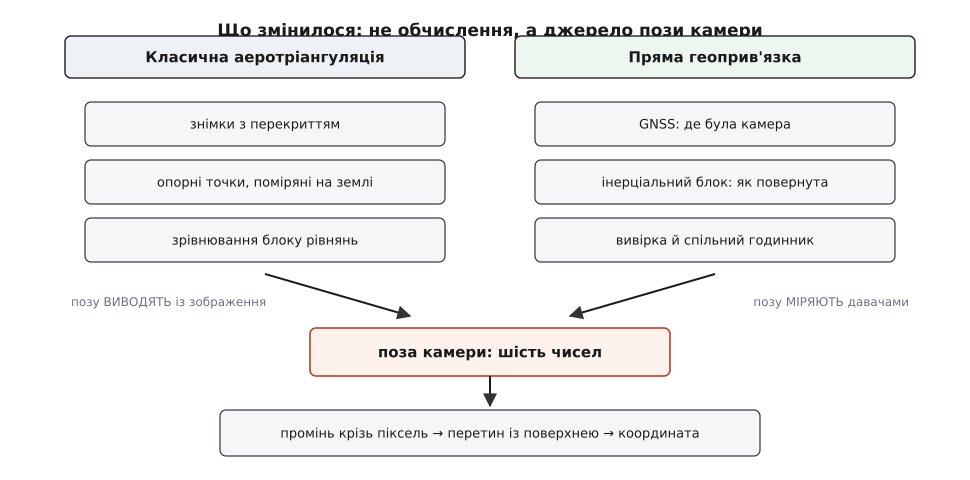

# 📜 Звідки беруть позу камери: сто п'ятдесят років, за які її перестали вгадувати

Формула, що перетворює піксель на широту й довготу, потребує шести чисел: де була камера і як була повернута. Півтора століття ці числа не міряли, а **вираховували з самого знімка** — і вся фотограмметрія була наукою про те, як їх видобути. Переворот кінця XX століття не змінив жодного рівняння: змінилося лише те, звідки беруться шість чисел на вході.

## Лоседа: знімок як вимірювальний прилад

Еме Лоседа (фр. *Aimé Laussedat*, 1819–1907), випускник Політехнічної школи й офіцер французького інженерного корпусу, приблизно з 1849 року взявся за думку, що спантеличувала його сучасників: фотографія — це не картинка, а **вимірювання**. Художник малює те, що бачить; об'єктив же проєктує світ за строгим законом центральної проєкції, і якщо цей закон знати, то з плаского відбитка можна відновити кути на реальні предмети — так само точно, як їх дає теодоліт.

Звідси його назва методу — **метрофотографія** (фр. *métrophotographie*), «вимірювальна фотозйомка». Інструментом став **фототеодоліт**: камера, посаджена на теодолітну підставку, тож для кожного знімка відомо, куди дивилася оптична вісь. Про успішне складання топографічних планів зі знімків Лоседа доповів Академії наук у 1859 році, а показові зйомки в Парижі та в селі Бюк під Версалем 1861 року переконали французьку армію завести окремий підрозділ для розвитку цього методу; перший відомий фототеодоліт разом із планом Парижа він виставив на Всесвітній виставці 1867 року. Датування добре задокументоване; титул «батька фотограмметрії» — усталена, але **спірна** оцінка: німець Альбрехт Майденбауер (нім. *Albrecht Meydenbauer*) прийшов до тієї самої ідеї незалежно, не знаючи про француза, і саме від нього походить сам термін «фотограмметрія» — слово вперше з'явилося 1867 року в берлінському архітектурному тижневику в неспідписаній статті, авторство якої приписали Майденбауеру аж 1892-го (реконструкція Альбрехта Грімма; ходить і популярніша дата 1893, і вона хибна).

Піднятися з камерою в повітря Лоседа теж пробував: 1858 року він чіпляв камеру на скляних пластинах до низки повітряних зміїв, брався й за кулі — і десь коло 1860-го ці спроби покинув. Причина проста й повчальна: з однієї точки в небі не вдавалося зробити стільки знімків, щоб покрити всю видиму звідти площу, а мокрий колодієвий процес вимагав готувати й проявляти пластину просто на місці. Того ж 1858 року Надар (фр. *Nadar*, Ґаспар-Фелікс Турнашон) зняв перший знімок із прив'язаної кулі над Пті-Бісетр — жоден із тих кадрів не зберігся; найдавніший уцілілий аерознімок — Бостон із висоти близько 360 м, 13 жовтня 1860 року, Джеймс Воллес Блек.

## Перша світова: зйомка стає промисловою

Аеростат і літак зробили те, чого не змогли змії: підняли камеру високо й дали їй рухатися. За чотири роки війни на Західному фронті відзняли мільйони кадрів, і на завершальний 1918-й обидві сторони, за поширеною в літературі оцінкою, фотографували всю лінію фронту двічі на день.

Тут і виникла справжня задача. Знімків стало багато, вони перекривалися, з них треба було креслити карти — а поза літака в мить затвора була невідома майже цілком. Прилади давали хіба грубу висоту й курс; про орієнтацію з точністю до частки градуса, яку вимагає геометрія, не йшлося.

## Аеротріангуляція: позу виводять із зображення

Класична фотограмметрія розв'язала це елегантно й дорого. Якщо позу не можна виміряти, її можна зробити **невідомою величиною** й знайти з рівнянь.

Кожна точка місцевості, впізнана на двох сусідніх знімках, дає рівняння, що пов'язує її координати з позами обох камер. Точок таких — сотні на кадр, поз — шість чисел на кадр. Рівнянь виходить більше, ніж невідомих, і система в принципі розв'язна. Але сама по собі вона знає лише **взаємне** розташування: увесь блок знімків можна цілком зсунути, повернути й змінити його масштаб, і рівняння цього не помітять. Щоб прибити модель до Землі, потрібні точки з **уже відомими** координатами — [опорні точки](book:algorithms/ground-control-points), фізично помічені на місцевості й поміряні наземною геодезією.

Так і працювала аерофотозйомка більшу частину XX століття: спершу бригада виїздила в поле й ставила знаки, і лише потім злітав літак. Позу камери діставали заднім числом — спільним зрівнюванням усього блоку, тим самим, що сьогодні зветься [оптимізацією пучком](book:algorithms/bundle-adjustment). Опорні точки коштували більшу частину бюджету зйомки й задавали її строк: у важкодоступній місцевості поставити знак було дорожче, ніж зробити знімок.


*Обчислення після пози в обох випадках однакове — різниця лише в тому, звідки взялися шість чисел.*

## Два давачі, що зійшлися докупи

Ідея міряти позу прямо була очевидна завжди; бракувало приладів. Кожен окремо не годився: [супутниковий приймач](book:communications/gnss) дає положення, але нічого не каже про повороти й видає його рідко; [інерціальний блок](book:electronics/imu) чудово ловить швидкі повороти, але його показ [пливе з часом](root:embedded/inertial-navigation) — і тим швидше, чим дешевший гіроскоп.

Ці двоє виявилися взаємно доповняльними. Приймач ловить дрейф інерціального блока, а той тримає позу між супутниковими відліками й на секундах, коли сигнал зник. Технічно це складають фільтром Калмана; докладніше — у статті про [зведення показів у курс, крен і тангаж](book:algorithms/ahrs).

Зрушилося з місця тоді, коли **диференціальний GPS** — обробка з опорою на наземну станцію — довів положення літака до сантиметрів. Дослідження з підтримки аеротріангуляції супутниковим приймачем почалися близько 1984 року; з 1993-го бортовий GPS уже вживали широко, і кількість потрібних опорних точок різко впала. Наступний крок був природний: якщо приймач із інерціальним блоком дають і положення, і орієнтацію, то опорні точки більше не потрібні **зовсім**.

Вузьким місцем при цьому лишалося не положення, а **кут**. Легко побачити чому: похибка положення переноситься на землю один до одного, а похибка орієнтації множиться на висоту польоту.

```
зйомка з висоти h = 1500 м, прямовисно вниз
δγ = 0.10°  = 1.745·10⁻³ рад  →  δ = 1500 · 1.745·10⁻³ = 2.62 м
δγ = 0.01°  = 1.745·10⁻⁴ рад  →  δ = 1500 · 1.745·10⁻⁴ = 0.26 м
```

Отже, щоб дотягтися до дециметрів, курс і нахили треба знати з точністю десь у соту частку градуса — а це вже не побутовий гіроскоп, а навігаційний інерціальний блок вагою в десятки кілограмів. Саме тому пряма геоприв'язка стала можливою в літаку на десяток років раніше, ніж у чомусь дрібнішому.

Цю тезу сформулював професор Клаус-Петер Шварц (нім. *Klaus-Peter Schwarz*) з Університету Калґарі в доповіді «Integrated Airborne Navigation Systems for Photogrammetry» на Photogrammetric Week 1995 року — вона й досі лежить у вільному доступі в архіві Штутґартського університету. Через рік, 1996-го, компанія Applanix випустила **POS/DG 510** — за її власними даними, першу комерційну систему прямої геоприв'язки; перші випробування провели на початку 1996 року в Квебеку з плівковою камерою Leica RC30. Пріоритет тут заявляє зацікавлена сторона — виробник, — тож твердження «перша комерційна» варто читати як добре засвідчену, але не незалежно перевірену заяву.

## Що з цього лишилося

Зміна була не обчислювальна, а **організаційна**: обчислення після пози яке було, таке й лишилось. Зникла ціла професія — бригада, що виїздить у поле перед польотом. Разом із нею з'явилися й нові клопоти, яких у класичній схемі не було: вивірка між оптичною віссю й осями інерціального блока, спільний годинник для знімка й телеметрії, важіль між антеною й оптичним центром. Пряма геоприв'язка не прибрала опорних точок із фотограмметрії назавжди — там, де потрібні сантиметри, їх ставлять і досі, а сантиметрове положення сьогодні дає [RTK](book:algorithms/rtk-integer-ambiguity), — але зробила їх вибором, а не умовою зйомки.

І тридцять років потому той самий ланцюг живе в апараті за кілька сотень доларів: супутниковий приймач, інерціальний блок на кремнієвому кристалі, кути підвісу з енкодерів — і перетин променя з моделлю поверхні. Різниця з POS/DG 510 не в схемі, а в тому, що колись важило десятки кілограмів і коштувало як літак, а тепер важить грами.
