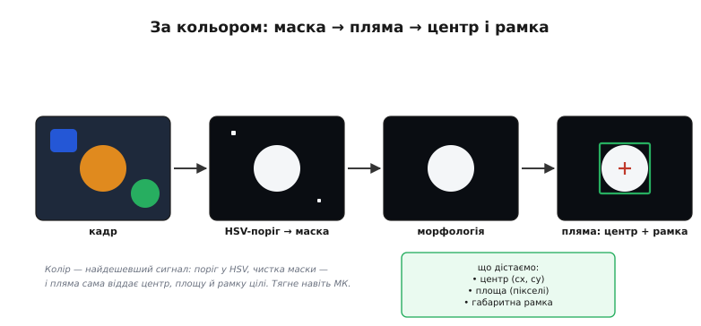
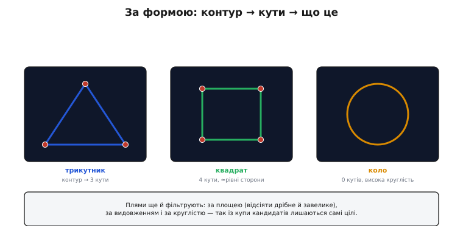
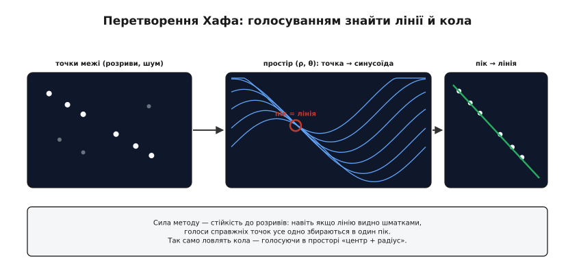
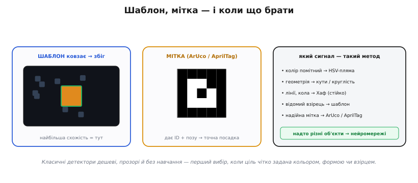

# Виявлення об'єктів

Уся обробка зображення — [канали](topic:algorithms/image-as-data), [гістограми](topic:algorithms/histogram), [фільтри](topic:algorithms/convolution-filters), [межі](topic:algorithms/edge-detection), [маски](topic:algorithms/threshold-morphology) — служить одному: **знайти об'єкт** і сказати, **де** він у кадрі. Перш ніж тягнути [нейромережу](topic:algorithms/nn-detectors), варто мати під рукою **класичний** набір детекторів: дешевих, прозорих, без жодного навчання. У них одна спільна ідея — обери **прикмету**, за якою ціль виділяється з-поміж усього іншого, і лови саме її. Прикмет рівно чотири: **колір**, **форма**, **геометричний примітив** (пряма, коло) і **взірець**.

Хоч би яким був детектор, відповідь він віддає в одному форматі — **габаритна рамка** (англ. *bounding box*, «обмежувальна коробка»): найменший прямокутник, що охоплює об'єкт. Рамку задають чотирма числами (ліво, верх, ширина, висота), і саме її дрон передає далі — в керування, у стеження, у наведення. Тож завдання детектора — від кольорового порога до згорткової мережі — звести кадр до кількох таких рамок.

### За кольором: маска → пляма → центр

Якщо ціль має **виразний колір** (помаранчевий м'яч, червоний маркер), це найдешевший шлях. Кадр переводять у **HSV** ([представлення зображення як даних](topic:algorithms/image-as-data)) — простір, де тон (*hue*), насиченість (*saturation*) і яскравість (*value*) розділені, тож «помаранчеве» задається діапазоном тону незалежно від освітлення. [Порогом](topic:algorithms/threshold-morphology) лишають тільки потрібний тон, чистять маску морфологією — і шукають на ній **пляму** (зв'язну білу область).


*Конвеєр виявлення за кольором. Кадр → поріг у HSV лишає лише потрібний тон (маска) → морфологія прибирає цятки → лишається чиста пляма. З неї дістають центр (cx, cy), площу (скільки пікселів) і габаритну рамку. Дешево й прозоро — тягне навіть мікроконтролер.*

Знайдена пляма одразу видає корисне: її **центр** (cx, cy) — куди дивитися; **площу** — наскільки ціль велика, а отже груба оцінка відстані; **габаритну рамку** — межі об'єкта. Це і є детектор кольорової цілі: тримати м'яч у кадрі, летіти за маркером, бачити кольорову мітку. Дешево, миттєво, зрозуміло.

### За формою: контур → кути → що це

Коли колір не виручає, рятує **форма**. Пляму чи контур (зібраний із [меж](topic:algorithms/edge-detection)) обводять, **спрощують** до многокутника й рахують **кути**: три — трикутник, чотири з рівними сторонами — квадрат, а коли кутів нема й фігура «кругла» — коло.


*Виявлення за формою. Контур спрощують і рахують кути: 3 → трикутник, 4 з ≈рівними сторонами → квадрат, 0 кутів і висока круглість → коло. Плями ще й фільтрують — за площею (відсіяти дрібне й завелике), співвідношенням сторін (видовжене?) і круглістю — так із купи кандидатів лишаються самі цілі.*

Тут стають у пригоді **фільтри плям**: відкинути надто дрібні (шум) і надто великі, лишити лише потрібного **видовження** чи **круглості**. Так із десятків випадкових плям лишаються самі цілі. Усе це — проста арифметика над контуром: жодного навчання, легко налагодити й видно, **чому** детектор спрацював (чи ні).

### Перетворення Хафа: голосуванням знайти прямі й кола

Найвинахідливіший із класичних — **перетворення Хафа** (за прізвищем Paul Hough). Воно знаходить **прямі** (і кола) навіть тоді, коли вони **розірвані** чи потонули в шумі. Ідея — **голосування**: кожна точка межі «голосує» за **всі** прямі, що можуть крізь неї пройти; де голоси багатьох точок **збігаються**, там і справжня пряма.


*Перетворення Хафа. Ліворуч — точки межі, що лежать на прямій (з розривами й шумом). Кожна точка стає синусоїдою в просторі параметрів (ρ — відстань, θ — кут): це всі прямі, що крізь неї проходять. Синусоїди справжніх точок перетинаються в одній клітинці (середня панель) — це пік голосів, тобто параметри прямої. За піком відновлюють саму пряму (праворуч). Так само голосуванням ловлять кола — у просторі «центр + радіус».*

Технічно кожну точку (x, y) описують усі прямі крізь неї — у просторі параметрів (ρ, θ) це **синусоїда**. Для точок однієї прямої ці синусоїди **перетинаються в одній клітинці**, де накопичується **пік голосів** — він і видає параметри прямої (ρ, θ). Сила методу — **стійкість до розривів**: навіть коли пряму видно шматками, голоси її справжніх точок усе одно зберуться в пік. Так само ловлять **кола** (голосуючи в просторі «центр + радіус»). Звідси практичні застосунки: лінія **горизонту**, край **злітної смуги**, дорожня **розмітка** для стеження, круглий **посадковий майданчик**.

Прийом цей народився не в комп'ютерному зорі, а у фізиці елементарних частинок — як спосіб обробити гори знімків бульбашкових камер; його ядро (голосування) дав Пол Хаф, а практичну полярну форму — Дуда й Гарт.

> 📜 [Як пошук слідів частинок став зором машин](topic:algorithms/object-detection/hist-hough.md) — історія перетворення Хафа: від бульбашкових камер CERN до патенту 1962 року й полярної переробки Дуди–Гарта 1972 року.

### За шаблоном і міткою

Останні два інструменти — для **відомого взірця**. **Зіставлення з шаблоном** (англ. *template matching*): маленьку картинку-зразок **ковзають** по кадру й міряють схожість; де схожість найбільша — там і збіг. Просто, та чутливо до масштабу й повороту: відійшов далі чи нахилив камеру — зразок уже не той. Надійніший варіант — [фідуційні мітки](topic:algorithms/aruco-apriltag) (від лат. *fiducia*, «довіра»; *ArUco*, *AprilTag*): спеціально намальовані чорно-білі квадрати, які легко й точно знайти, а вони ще й несуть **ID** і дають **позу** (положення та кут). Саме на них тримається **точна посадка** дронів (зокрема в ArduPilot).


*Шаблон, мітка й вибір методу. Зіставлення з шаблоном: зразок ковзає кадром, найбільша схожість = знайдено (та чутливо до масштабу й повороту). Мітка ArUco/AprilTag: надійний чорно-білий код несе ID і дає позу — основа точної посадки. Праворуч — правило вибору: помітний колір → HSV-пляма; геометрія → кути чи круглість; прямі й кола → Хаф; відомий взірець → шаблон чи мітка; а надто різні об'єкти — це вже до нейромереж.*

### Який сигнал — такий метод

Вибір детектора йде від **сигналу**, яким ціль виділяється: помітний колір — HSV-пляма; чітка геометрія — кути чи круглість; прямі або кола — Хаф; відомий незмінний взірець — шаблон чи мітка. Усі вони **дешеві, прозорі й без навчання**, тож для **добре заданих** цілей це перший вибір. А коли об'єкт **надто мінливий** (сотні порід «собаки», люди в різних позах) — тоді потрібні [нейромережні детектори](topic:algorithms/nn-detectors), що виводять прикмету з мільйонів прикладів, а не з рукотворного правила. Сучасні з них **одноетапні** (*one-stage*, як-от YOLO чи SSD): за один прохід мережі кадр одразу перетворюється на список габаритних рамок із класом і впевненістю — без окремого кроку «спершу запропонувати ділянки, потім класифікувати».

> 🔧 **Навіщо це.** Перш ніж тягнути важку мережу, спитай: **чим моя ціль виділяється?** Виразний **колір** — HSV-пляма (центр, площа, рамка — і досить для стеження). Чітка **геометрія** — лічи кути й круглість, фільтруй плями за площею. Прямі **лінії** чи **кола** (горизонт, смуга, майданчик) — **Хаф**: він прощає розриви й шум. Відома **мітка** для посадки — **ArUco/AprilTag**: дає не лише «де», а й позу для автопілота. Усе це дешеве й зрозуміле, тож і **налагоджувати** легко: видно, чому спрацювало. Нейромережам лиши тільки те, що класикою не береться.

### Коли рамок забагато: IoU і придушення немаксимумів

Майже кожен детектор — від ковзного шаблону до згорткової мережі — на один об'єкт видає **купу майже однакових рамок**: трохи зсунутих, трохи різних за розміром. Лишити всі — об'єкт «потроїться»; треба з пучка дублікатів узяти **одну найкращу**. Для цього потрібні дві речі: міра «наскільки дві рамки — про той самий об'єкт» і правило відбору.

Міра — **IoU** (*Intersection over Union*, «перетин поділити на об'єднання»): площу спільної частини двох рамок ділять на площу їхнього об'єднання. Повний збіг дає 1, без перекриття — 0. Та сама міра працює і в [стеженні за ціллю](topic:algorithms/tracking), де знайдену рамку звіряють з очікуваною. Правило відбору — **придушення немаксимумів** (*non-maximum suppression*, NMS): беремо рамку з найбільшою впевненістю, викидаємо всі, що сильно з нею перетинаються (IoU вище порога), і повторюємо з рештою. Лишаються по одній рамці на об'єкт.

> ⚙️ **Worked-приклад: IoU двох рамок і крок NMS.** Рамка — `{x, y, w, h}` (ліво, верх, ширина, висота, у пікселях). Рахуємо перекриття двох знахідок і вирішуємо, чи це дублікат.

:::tabs
```cpp
#include <algorithm>

struct Box { int x, y, w, h; float score; };

float iou(const Box &a, const Box &b) {
    int x1 = std::max(a.x, b.x);                    // ліва межа перетину
    int y1 = std::max(a.y, b.y);                    // верхня
    int x2 = std::min(a.x + a.w, b.x + b.w);        // права
    int y2 = std::min(a.y + a.h, b.y + b.h);        // нижня
    int iw = x2 - x1, ih = y2 - y1;
    if (iw <= 0 || ih <= 0) return 0.0f;            // не перетинаються
    float inter = static_cast<float>(iw) * ih;
    float uni   = static_cast<float>(a.w) * a.h + static_cast<float>(b.w) * b.h - inter;
    return inter / uni;
}
```
```python
from dataclasses import dataclass

@dataclass
class Box:
    x: int; y: int; w: int; h: int; score: float

def iou(a: Box, b: Box) -> float:
    x1 = max(a.x, b.x)                       # ліва межа перетину
    y1 = max(a.y, b.y)                       # верхня
    x2 = min(a.x + a.w, b.x + b.w)           # права
    y2 = min(a.y + a.h, b.y + b.h)           # нижня
    iw, ih = x2 - x1, y2 - y1
    if iw <= 0 or ih <= 0:
        return 0.0                           # не перетинаються
    inter = iw * ih
    uni   = a.w * a.h + b.w * b.h - inter
    return inter / uni
```
:::

Хай детектор м'яча видав дві рамки: `A = {100, 100, 50, 50, score 0.92}` і `B = {110, 108, 50, 50, score 0.81}`.

```
перетин:  x1=110, y1=108, x2=150, y2=150  →  iw=40, ih=42
inter  =  40 · 42                         =  1680
union  =  50·50 + 50·50 - 1680            =  3320
IoU    =  1680 / 3320                      ≈  0.506
```

IoU ≈ 0.51 — вище типового порога 0.5, отже A і B — про той самий м'яч. NMS лишає `A` (вища впевненість, 0.92) і викидає `B`. Так із пучка кандидатів виходить рівно одна рамка на ціль.

### Підсумок теми

Класичне виявлення об'єкта — це вибір **прикмети**, якою ціль виділяється, а відповідь завжди зводиться до **габаритної рамки**. За **кольором**: HSV-поріг → маска → пляма, що віддає центр, площу й рамку. За **формою**: контур → кути (3/4) чи круглість, плюс фільтри плям. **Перетворенням Хафа**: голосування точок межі дає прямі й кола, стійко до розривів і шуму (горизонт, смуга, майданчик). За **взірцем**: зіставлення з шаблоном чи надійні мітки **ArUco/AprilTag** (ID + поза для точної посадки). Коли рамок-дублікатів забагато, їх проріджують через **IoU** і **придушення немаксимумів**. Усі ці методи дешеві, прозорі й не потребують навчання — ідеальні для чітко заданих цілей. А для об'єктів, **надто різноманітних** для рукотворних прикмет, настає черга навченої моделі — [нейромережних детекторів](topic:algorithms/nn-detectors).

Кожен із цих детекторів має глибший шар — виведення формул, повні конвеєри й граничні випадки зібрано в [детальній версії](topic:algorithms/object-detection/detail).
