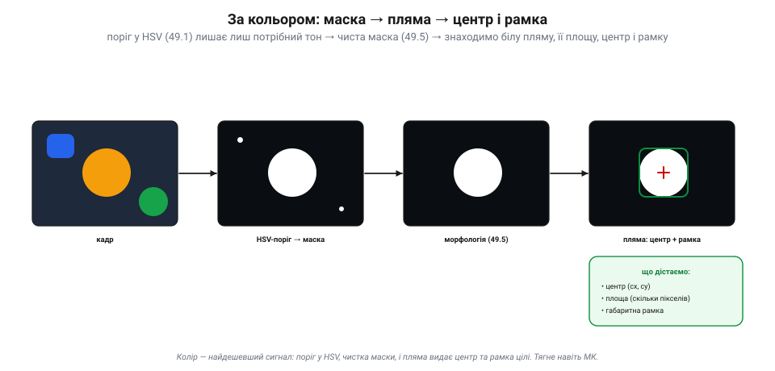
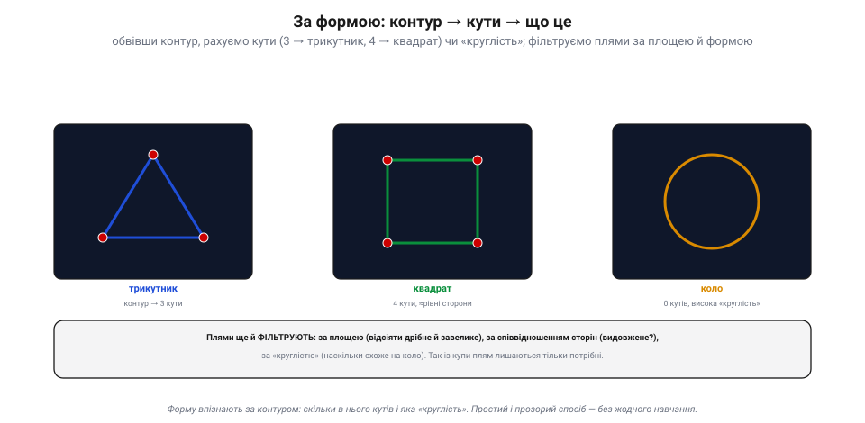
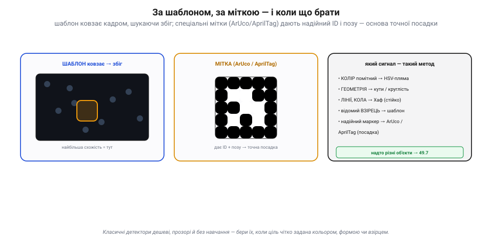

# Виявлення об'єктів: колір, форма, шаблон, Хаф

Уся обробка зображення — [канали](book:algorithms/image-as-data), [гістограми](book:algorithms/histogram), [фільтри](book:algorithms/convolution-filters), [межі](book:algorithms/edge-detection), [маски](book:algorithms/threshold-morphology) — служить одному: **знайти об'єкт**. І перш ніж кидатися до [нейромереж](book:algorithms/nn-detectors), варто знати **класичний** набір детекторів: дешевих, прозорих, без жодного навчання. Їхня спільна ідея проста — обери **прикмету**, за якою твоя ціль виділяється з-поміж усього, і лови саме її. Прикмет чотири: **колір**, **форма**, **геометричний примітив** (лінія, коло) і **взірець**.

### За кольором: маска → пляма → центр

Якщо ціль має **виразний колір** (помаранчевий м'яч, червоний маркер), це найдешевший шлях. Переводимо кадр у **HSV** ([представлення зображення як даних](book:algorithms/image-as-data)), [порогом](book:algorithms/threshold-morphology) лишаємо тільки потрібний тон, чистимо маску морфологією — і шукаємо на ній **пляму** (зв'язну білу область).

*Рис. Виявлення за кольором. Конвеєр: кадр → поріг у **HSV** лишає лише потрібний тон (маска) → морфологія прибирає цятки → лишається чиста **пляма**. З неї дістаємо **центр** (cx, cy), **площу** (скільки пікселів) і **габаритну рамку**. Дешево, прозоро — тягне навіть мікроконтролер.*

Знайдена пляма одразу видає корисне: її **центр** (cx, cy) — куди дивитися; **площу** — наскільки ціль велика (а отже, груба оцінка відстані); **габаритну рамку** — межі об'єкта. Це і є детектор кольорової цілі: тримати м'яч у кадрі, летіти за маркером, знайти кольорову мітку. Дешево, миттєво, зрозуміло.

### За формою: контур → кути → що це

Коли колір не виручає, рятує **форма**. Обвівши пляму чи контур (зібраний з [меж](book:algorithms/edge-detection)), його **спрощують** до многокутника й рахують **кути**: три — трикутник, чотири з рівними сторонами — квадрат, а якщо кутів нема й фігура «кругла» — коло.

*Рис. Виявлення за формою. Контур спрощують і рахують **кути**: 3 → трикутник, 4 (з ≈рівними сторонами) → квадрат, 0 кутів і висока «круглість» → коло. Плями ще й **фільтрують**: за площею (відсіяти дрібне й завелике), співвідношенням сторін (видовжене?) і круглістю — так із купи кандидатів лишаються тільки потрібні.*

Тут же стають у пригоді **фільтри плям**: відкинути надто дрібні (шум) і надто великі, лишити лише потрібного **видовження** чи **круглості**. Так із десятків випадкових плям лишаються самі цілі. Усе це — проста, прозора арифметика над контуром: жодного навчання, легко налагодити й зрозуміти, **чому** детектор спрацював (чи ні).

### Перетворення Хафа: голосуванням знайти лінії й кола

Найгеніальніший із класичних — **перетворення Хафа**. Воно знаходить **прямі лінії** (і кола) навіть тоді, коли вони **розірвані** чи потонули в шумі. Ідея — **голосування**: кожна точка межі «голосує» за **всі** лінії, що можуть крізь неї пройти; там, де голоси багатьох точок **збігаються**, і є справжня лінія.

*Рис. Перетворення Хафа. Ліворуч — точки межі, що лежать на лінії (з розривами й шумом). Кожна точка перетворюється на **синусоїду** в просторі параметрів (ρ — відстань, θ — кут): це всі лінії, що крізь неї проходять. Синусоїди справжніх точок **перетинаються в одній точці** (середній графік) — це **пік голосів**, тобто параметри лінії. За піком відновлюємо саму лінію (праворуч). Так само голосуванням ловлять і **кола** (у просторі центр + радіус).*

Технічно кожну точку (x, y) описують усі прямі крізь неї — у просторі параметрів (ρ, θ) це **синусоїда**. Для точок, що лежать на одній лінії, ці синусоїди **перетинаються в одній клітинці** — і там накопичується **пік голосів**, що й видає параметри лінії (ρ, θ). Сила методу — **стійкість до розривів**: навіть якщо лінію видно шматками, голоси її справжніх точок усе одно зберуться в пік. Так само ловлять **кола** (голосуючи в просторі «центр + радіус»). Звідси практичні застосунки: лінія **горизонту**, край **злітної смуги**, дорожня **розмітка** для стеження, круглий **посадковий майданчик**.

### За шаблоном і міткою; коли що брати

Останні два інструменти — для **відомого взірця**. **Зіставлення з шаблоном** (*template matching*): маленьку картинку-зразок **ковзають** по кадру й міряють схожість; де схожість найбільша — там і збіг. Просто, та чутливо до масштабу й повороту. Надійніший варіант — **фідуційні мітки** (*ArUco*, *AprilTag*): спеціально намальовані чорно-білі квадрати, які легко й точно знайти, а вони ще й дають **ID** і **позу** (положення та кут). Саме на них тримається **точна посадка** дронів (зокрема в ArduPilot).

*Рис. Шаблон, мітка й вибір методу. **Зіставлення з шаблоном**: зразок ковзає кадром, найбільша схожість = знайдено (та чутливо до масштабу/повороту). **Мітка** ArUco/AprilTag: надійний чорно-білий код дає ID і позу — основа точної посадки. Праворуч — правило вибору: помітний **колір** → HSV-пляма; **геометрія** → кути/круглість; **лінії/кола** → Хаф; відомий **взірець** → шаблон чи мітка; а **надто різні** об'єкти — це вже до нейромереж.*

Як вибрати? За **сигналом**, яким ціль виділяється: помітний колір — HSV-пляма; чітка геометрія — кути чи круглість; прямі лінії або кола — Хаф; відомий незмінний взірець — шаблон чи мітка. Усі вони **дешеві, прозорі й без навчання**, тож для **добре заданих** цілей це перший вибір. А коли об'єкт **надто мінливий** (сотні порід «собаки», люди в різних позах) — тоді вже потрібні [нейромережні детектори](book:algorithms/nn-detectors).

> 📜 **Лінії з бульбашок: Пол Хаф рахує сліди частинок (1962).** Перетворення Хафа, яким твій дрон ловить лінію горизонту, народилося… у фізиці елементарних частинок. На зламі 1950–60-х фізики фотографували **бульбашкові камери**: заряджена частинка, пролітаючи крізь перегріту рідину, лишала ланцюжок бульбашок — **слід**, який на знімку виглядав як ламана лінія. Знімків були гори, і армія людей-«сканувальників» вручну обводила сліди, не встигаючи за потоком плівки. Фізик **Пол Хаф**, працюючи в Лоуренсівській лабораторії (Берклі), 1959 року на конференції в CERN запропонував, як доручити це **машині**: нехай кожна точка сліду «голосує» за всі прямі, що крізь неї проходять, а комп'ютер шукає, де голоси збіглися. 1962-го він дістав на це патент США № 3 069 654. Спершу метод був незграбний (через нахил-зсув ламався на вертикалях), та 1972 року **Річард Дуда** й **Пітер Гарт** (ті самі, чия виноска прославила Собеля!) переписали його в зручних полярних координатах (ρ, θ) і узагальнили на криві — у такому вигляді він і живе досі. Так прийом, придуманий рахувати сліди частинок, тепер тримає дрон над злітною смугою.

> 🔧 **Навіщо це.** Перш ніж тягнути важку нейромережу, спитай: **чим моя ціль виділяється?** Виразний **колір** — HSV-пляма (центр, площа, рамка — і вистачить для стеження). Чітка **геометрія** — лічи кути й круглість, фільтруй плями за площею. Прямі **лінії** чи **кола** (горизонт, смуга, майданчик) — **Хаф**: він прощає розриви й шум. Відома **мітка** для посадки — **ArUco/AprilTag**: дає не лише «де», а й позу для автопілота. Усе це дешеве й зрозуміле, тож і **налагоджувати** легко: видно, чому спрацювало. Лиши [нейромережам](book:algorithms/nn-detectors) тільки те, що класикою не береться.

### Підсумок теми

Класичне виявлення об'єкта — це вибір **прикмети**, якою ціль виділяється. За **кольором**: HSV-поріг → маска → пляма, що видає центр, площу й рамку. За **формою**: контур → кути (3/4) чи круглість, плюс фільтри плям. **Перетворенням Хафа**: голосування точок межі дає лінії й кола, стійко до розривів і шуму (горизонт, смуга, майданчик). За **взірцем**: зіставлення з шаблоном чи надійні мітки **ArUco/AprilTag** (ID + поза для точної посадки). Усі ці методи дешеві, прозорі й не потребують навчання — ідеальні для чітко заданих цілей. А Хаф, до речі, прийшов із бульбашкових камер фізики 1962-го. Коли ж об'єкти **надто різноманітні** для рукотворних прикмет, настає черга **навченої** моделі — [нейромережних детекторів](book:algorithms/nn-detectors).
