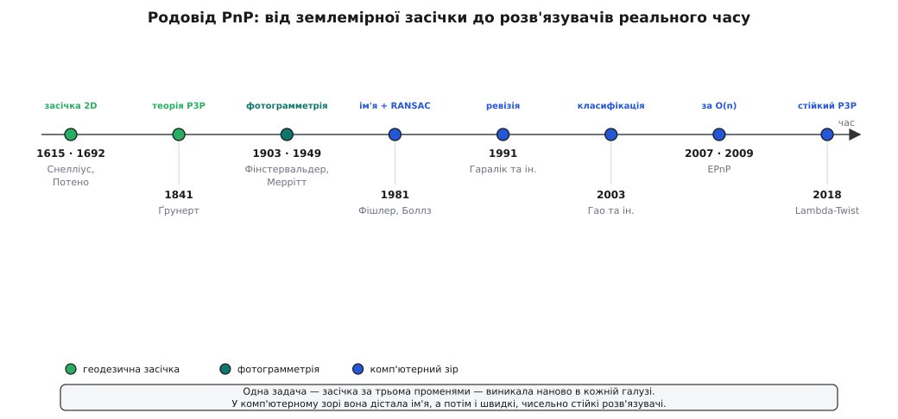

# 📜 Родовід задачі PnP: від землемірної засічки до розв'язувачів реального часу

Задача «звідки дивилися» старша за самі камери. Ще коли найточнішим кутоміром був теодоліт, землемір умів стати на невідомій точці, виміряти напрямки на три знайомі вершини — дзвіницю, гору, вежу — і за ними обчислити, де саме він стоїть. Це та сама задача, яку сьогодні щокадру розв'язують окуляри доповненої реальності, тільки орієнтири тепер — кути мітки, а «теодоліт» — матриця пікселів. За два століття вона переродилася в кожній галузі, що бралася вимірювати світ за зображеннями, і аж 1981 року дістала ім'я, під яким її знають у зорі, — **Perspective-n-Point**. Ось хто по черзі її ставив і приборкував.


*Одна задача — зворотна засічка за трьома променями — поставала наново в геодезії, фотограмметрії й комп'ютерному зорі. Ім'я PnP вона дістала аж 1981-го, а перегони за швидкий і чисельно стійкий розв'язок тривають досі.*

## Зворотна засічка: землемір знаходить себе

Тріангуляція будує карту так: стоячи на точці з відомими координатами, землемір міряє кути на дальні орієнтири й обчислює, де ті орієнтири. Задача PnP — обернена до цього. Тут відомі якраз орієнтири, а невідома — власна точка спостерігача: стань невідомо де, виміряй напрямки на три відомі вершини й знайди, звідки їх так видно. У геодезії це **зворотна засічка** (нім. *Rückwärtseinschneiden*), і вона — прямий предок PnP: ті самі відомі точки, ті самі напрямки на них, та сама шукана поза.

Розв'язок цієї задачі на площині знали ще на межі XVI–XVII століть. Голландець Віллеброрд Снелліус (Willebrord Snel van Royen, 1580–1626) застосував його у своїй тріангуляції Нідерландів близько 1615 року. Пізніше ту саму задачу поставив і француз Лоран Потено (Laurent Pothenot, 1692), і — за звичною історичною несправедливістю — назва прилипла не до першовідкривача: задачу й досі звуть **Снелліуса–Потено**, хоч Снелліус розв'язав її на кілька десятиліть раніше. Це вже цілком доведена історія, і повчальна: ім'я в науці чіпляється не завжди до того, хто був перший.

Одне «але» відділяє цю засічку від справжнього PnP: вона живе на площині й дає лише положення на карті. Камера ж висить у просторі й може бути нахилена як завгодно — її поза це аж шість чисел. Щоб засічка вийшла з площини в простір, задачу треба було переписати наново.

## Ґрунерт, 1841: засічка виходить у простір

Це зробив німець Йоганн Авґуст Ґрунерт (Johann August Grunert, 1797–1872), професор математики в Ґрайфсвальді, учень Пфаффа й Ґаусса. Він заснував і редагував власний часопис — «Archiv der Mathematik und Physik», що його потім так і звали «архів Ґрунерта». У першому ж томі, 1841 року, він надрукував працю з промовистою назвою: «Потенотова задача в розширеному вигляді» (*Das Pothenotsche Problem in erweiterter Gestalt*). «Розширення» й було тим самим кроком — із площини в простір.

Геометрія проста й гарна. Три промені з центра камери на три відомі точки утворюють трикутну піраміду. Знімок дає **кути** між променями; модель об'єкта дає **довжини сторін** трикутника-основи; невідомі — три **відстані** dᵢ від центра до вершин. Кожна бічна грань — трикутник із відомим кутом при вершині й відомою протилежною стороною, тож теорема косинусів дає систему:

```
|P₁P₂|² = d₁² + d₂² − 2·d₁·d₂·cos θ₁₂
|P₁P₃|² = d₁² + d₃² − 2·d₁·d₃·cos θ₁₃
|P₂P₃|² = d₂² + d₃² − 2·d₂·d₃·cos θ₂₃
```

Ґрунерт показав, як вилучити дві невідомі відстані й звести все до **одного многочлена четвертого степеня** з однією невідомою:

```
a₄·x⁴ + a₃·x³ + a₂·x² + a₁·x + a₀ = 0   →   до чотирьох додатних коренів
```

Звідси й славнозвісна властивість P3P: три точки задають **до чотирьох** поз камери. Це вже не здогад, а теорія — Ґрунерт вивів саму структуру задачі. Але варто чесно розрізнити, що він дав, а що ні. Ідею засічки він успадкував; він дав **теорію** — замкнену алгебру, яка доводить, скільки розв'язків можливо. **Реалізації**, яка молотила б цю квартику тисячі разів на секунду над зашумленими даними, не було й бути не могло: числа рахували руками, для жменьки точок. Саме цей розрив між готовою теорією 1841 року й швидкою реалізацією — і є те, що заповнять наступні сто сорок років. Найдавнішим відомим опублікованим розв'язком P3P досі вважають саме працю Ґрунерта.

## Та сама задача — з літака: фотограмметрія

XX століття посадило камеру на повітряну кулю, а тоді на літак — і задача постала знову, тепер як практична потреба картографів. Аерофотозйомка мусить за знімком землі з упізнаваними орієнтирами (наземними опорними точками) сказати, **де був літак і як його нахилило** тієї миті. Це знову зворотна засічка, тільки спостерігач — об'єктив у небі, а шість шуканих чисел — ті самі.

Прикметно, що фотограмметрія не взяла готове рішення Ґрунерта, а перевідкривала його раз за разом у власних позначеннях. Серед відомих перевідкриттів — праці німця Себастьяна Фінстервальдера (Sebastian Finsterwalder, 1903) та американця Еверетта Меррітта (Everett L. Merritt, 1949). Це не недбалість, а звичайний хід науки: геодезія й фотограмметрія працювали нарізно, кожна впиралася в ту саму стіну й обходила її по-своєму. Задача виявилася **колективним, міжгалузевим винаходом** без єдиного автора — її «мали за ідею», «довели як теорію» й «пристосували до застосунку» різні люди в різних десятиліттях.

> 🔧 **Навіщо це.** Дати розкиданій задачі одне ім'я — наукова дія, а не формальність. Поки «просторова резекція», *space resection* і «засічка з літака» жили в різних галузях під різними назвами, кожна спільнота вдосконалювала свій варіант наосліп, не знаючи про сусідів. Спільне ім'я зібрало всі ці варіанти в одну ціль, за яку відтоді можна змагатися відкрито — і саме тому дальші перегони за кращий розв'язувач узагалі стали можливі.

## 1981: комп'ютерний зір дає задачі ім'я

Ім'я з'явилося тоді, коли задачу віддали машині. 1981 року американці Мартін Фішлер (Martin A. Fischler) і Роберт Боллз (Robert C. Bolles) з інституту SRI надрукували в *Communications of the ACM* (том 24, № 6) працю, що подарувала комп'ютерному зору метод RANSAC, — і в ній увели назву **Perspective-n-Point** для випадку n точок та **P3P** для мінімальних трьох. Це доведений факт: терміни, якими сьогодні користується вся галузь, народилися саме там.

Чому назва прийшла разом із RANSAC — не випадковість. Метою Фішлера й Боллза була автоматична картографія: зіставити карту з аерознімком **без людини**. А коли пари «точка на карті ↔ піксель» шукає програма, частина їх неминуче хибні. Розв'язати P3P — лише половина справи; друга половина — **не датися брехливим парам**. Тому та сама праця, що назвала PnP, дала й оболонку проти викидів — [RANSAC](book:algorithms/ransac): бери випадкову трійку, розв'язуй P3P, дивись, скільки решти точок згодні, повторюй. Мінімальний іменований розв'язувач плюс спосіб пережити грубі помилки — це рівно те, що потрібно автоматичній системі, і не дивно, що вони прийшли однією працею. Тут задача остаточно перестала бути ручною вправою з геометрії й стала цеглиною машинного зору.

## Одна квартика, багато імен: ревізія Гараліка

На початок 1990-х назбиралося щонайменше шість «різних» прямих розв'язків P3P: Ґрунерта (1841), Фінстервальдера (1903), Меррітта (1949), Фішлера–Боллза (1981) і ще двох, кінця 1980-х. 1991 року група під проводом Роберта Гараліка (Robert M. Haralick) звела їх в одному великому огляді — і показала несподіване: усі шість — **та сама квартика**, лише по-різному виведена. Різних задач не було; була одна, переказана шістьма мовами.

Але огляд показав і друге, важливіше: попри спільну алгебру, розв'язки поводяться **геть по-різному чисельно**. Яку саме відстань вилучати першою, як укладати коефіцієнти многочлена — від цього залежить, чи не роздує похибка округлення відповідь на майже вироджених конфігураціях (коли точки майже на одній прямій чи майже в одній площині). Відтоді фронт змістився. Питання вже не «як розв'язати» — Ґрунерт розв'язав, — а «як розв'язати **швидко й без чисельної катастрофи**». Уся дальша історія методів PnP — це відповідь на це друге питання.

## Гао, 2003: коли розв'язків один, а коли чотири

Спершу добили теорію. 2003 року Сяошань Гао (Xiao-Shan Gao, 高小山) з колегами Хоу, Таном і Ченом (Академія наук Китаю) надрукували в *IEEE Transactions on PAMI* (том 25, № 8) **повну класифікацію коренів** P3P. Ґрунерт довів, що розв'язків «до чотирьох»; Гао та співавтори дали точні необхідні й достатні умови, **коли саме** їх один, два, три чи чотири, — здобуті засобами комп'ютерної алгебри (метод Ву–Ріта). Питання, яке Ґрунерт відкрив 1841-го, дістало вичерпну відповідь: тепер відомо не лише скільки поз можливо, а й за якої геометрії скільки їх буде насправді.

## EPnP, 2007–2009: розв'язок за лінійний час

Класифікація — це строгість, але не швидкість. Коли точок не три, а сотні, класичні схеми дорожчають надто круто. Розв'язали це Венсан Лепті (Vincent Lepetit), Франсеск Морено-Ноґер (Francesc Moreno-Noguer) і Паскаль Фюа (Pascal Fua) з Політехніки Лозанни (EPFL): метод **EPnP** — спершу на ICCV 2007, тоді повніше в *International Journal of Computer Vision* (2009, том 81, с. 155–166). Його гасло — «точний розв'язок за O(n)», перший лінійний за кількістю точок.

Хитрість елегантна. Замість вести дванадцять чисел пози, кожну з n тривимірних точок виражають як зважену суму лише **чотирьох опорних точок**. Тоді невідомими стають координати цих чотирьох опорних точок у системі камери — їх завжди рівно чотири, скільки б не було n. Робота росте лінійно, а не швидше. Це вже не про можливість розв'язати (можливість Ґрунерт довів), а про **вартість** — EPnP зробив PnP на багатьох точках достатньо дешевим для реального часу.

## Lambda-Twist, 2018: швидкий і чесно стійкий

Лишалося зняти саме те застереження, яке підняв Гаралік, — чисельну стійкість мінімального P3P, що його всередині циклу RANSAC викликають тисячі разів. 2018 року шведи Мікаель Перссон (Mikael Persson) і Клас Нордберг (Klas Nordberg) з Університету Лінчепінга подали на ECCV розв'язувач **Lambda-Twist** (у назві праці — саме «Perspective Three Point (P3P)»). Його формулювання внутрішньо стійке: воно обходить кроки, де стара алгебра втрачала точність, і при цьому дуже швидке. Саме тому Lambda-Twist став типовим P3P за замовчуванням усередині сучасних систем одночасної локалізації й картографування та відновлення структури з руху — там, де мінімальну розв'язку крутять у циклі відсіву викидів мільйони разів.

## Що показує цей родовід

Крізь усі два століття тягнеться одна задача — знайти позу за трьома променями. Землеміри розв'язали її на площині, Ґрунерт підняв у простір і замкнув алгеброю ще 1841 року, фотограмметрія перевідкрила її з літака, а комп'ютерний зір дав їй ім'я PnP і оболонку проти брехливих пар. Прикметно, що майже все після Ґрунерта — **не про те, як розв'язати**: це він уже вмів. Це про те, як розв'язати швидко, стійко й тисячі разів на секунду над даними, у яких частина точок бреше. Ім'я PnP склеїло розкидану родину в одну ціль; RANSAC навчив її переживати хибні збіги; O(n) і чисельна стійкість зробили її придатною для реального часу. Тому за коротким викликом `solvePnP` у сучасній бібліотеці стоять не роки роботи, а майже два століття — від теодоліта до окулярів доповненої реальності.
