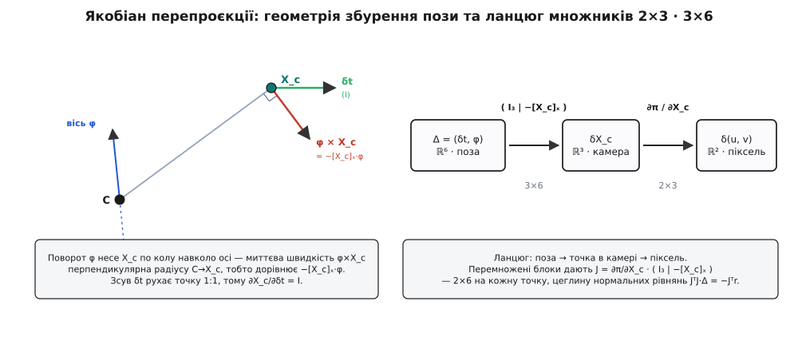

# 🧮 Якобіан похибки перепроєкції за позою

Крок [Ґаусса–Ньютона](topic:math/gauss-newton), що уточнює позу камери, спирається на одну-єдину похідну: як зрушиться спроєктований піксель, коли трохи змінити позу. Ця похідна пікселя за шістьма числами пози і є якобіан перепроєкції — матриця 2×6 на кожну точку. Виведімо її від першопричини, [ланцюговим правилом](topic:math/chain-rule) по тому самому діленню на глибину, що робить PnP нелінійною.

## Що саме диференціюємо

[Метод Ґаусса–Ньютона](topic:math/gauss-newton) уточнює позу так: біля поточної оцінки він замінює нелінійну похибку її дотичною лінійною моделлю, розв'язує маленьку лінійну задачу на поправку й робить крок. Щоб побудувати цю дотичну модель, і потрібна похідна — більше ні для чого.

Занумеруймо дійові особи. Точка об'єкта **X**_w потрапляє в піксель через [проєкцію камери-обскури](topic:algorithms/camera-model): спершу жорстке перетворення в систему камери, **X**_c = **R**·**X**_w + **t** = (X, Y, Z), потім ділення на глибину й масштаб внутрішніми параметрами. Позначмо весь цей шлях однією функцією π:

```
π(R, t, X_w) = ( fx·X/Z + cx ,  fy·Y/Z + cy ),     (X, Y, Z) = R·X_w + t
```

Для кожної точки i маємо спостережений піксель **z**ᵢ = (uᵢ, vᵢ)_виміряне. Двовимірна **нев'язка** — різниця між тим, куди точка проєктується за поточної пози, і тим, де її насправді бачили:

```
rᵢ = π(R, t, Xᵢ) − zᵢ  ∈ ℝ²
```

Знак — умовність: ‖π − z‖² = ‖z − π‖², тож на суму квадратів E = Σᵢ ‖rᵢ‖² він не впливає; беремо «спроєктоване мінус спостережене», щоб похідна нижче була похідною самої проєкції π. Мінімум цієї E по позі і є шукана поза, а [найменші квадрати](topic:math/least-squares) саме в пікселях правильно усереднюють шум детектора кутів.

Поза — шість чисел: три на зсув, три на поворот. Позначмо маленьку **поправку пози** за один крок через Δ = (δt, φ) ∈ ℝ⁶, де δt — приріст зсуву, φ — приріст повороту. Потрібний якобіан — це реакція нев'язки на цю поправку:

```
Jᵢ = ∂rᵢ/∂Δ = ∂π/∂Δ     (2×6: два рядки — u і v, шість стовпців — компоненти Δ)
```

Похідна z нульова — воно виміряне, стала, — тому ∂rᵢ/∂Δ = ∂π/∂Δ.

## Ланцюг: поза заходить лише через X_c

Уся залежність π від пози сидить в одному місці — у точці в системі камери **X**_c = **R**·**X**_w + **t**. Далі проєкція знає тільки **X**_c, а не окремо **R** і **t**. Тому [ланцюгове правило](topic:math/chain-rule) розриває якобіан на два незалежні куски:

```
∂π/∂Δ   =   ∂π/∂X_c   ·   ∂X_c/∂Δ
            (2×3)         (3×6)
```

Перший множник — як піксель реагує на зсув самої точки в камері (тут і лише тут ділення на глибину). Другий — як точка в камері реагує на поправку пози. Розберімо кожен окремо, тоді перемножимо.

## Множник перший: перспектива, 2×3

Розпишімо проєкцію покоординатно й продиференціюймо по (X, Y, Z):

```
u = fx·X/Z + cx
v = fy·Y/Z + cy
```

По X і Y — просто, вони чисто в чисельнику:

```
∂u/∂X = fx/Z        ∂u/∂Y = 0
∂v/∂X = 0           ∂v/∂Y = fy/Z
```

А по Z працює правило похідної частки: Z стоїть у знаменнику, ∂(X/Z)/∂Z = −X/Z². Ось де ділення на глибину дає про себе знати:

```
∂u/∂Z = fx · ∂(X/Z)/∂Z = −fx·X/Z²
∂v/∂Z = fy · ∂(Y/Z)/∂Z = −fy·Y/Z²
```

Складаємо в матрицю 2×3:

```
∂π/∂X_c  =  ⎡ fx/Z    0     −fx·X/Z² ⎤
            ⎣  0     fy/Z   −fy·Y/Z² ⎦
```

Винесімо 1/Z за дужку — і видно суть:

```
∂π/∂X_c  =  (1/Z) · ⎡ fx    0    −fx·X/Z ⎤
                    ⎣  0    fy   −fy·Y/Z ⎦
```

Кожен елемент має 1/Z; третій стовпець — ще одне ділення на Z. Далеку точку (велике Z) можна помітно совати, а піксель майже не ворухнеться — саме тому глибину видно кепсько, а якобіан «слабне» вдалині. І головне: ця матриця залежить від поточної **X**_c, тобто від поточної пози. Тому J перераховують щокроку — лінеаризація дійсна лише в тій точці, де її взяли.

## Множник другий: рух точки за позою, 3×6

Тепер ∂X_c/∂Δ: як **X**_c = **R**·**X**_w + **t** ворухнеться від поправки Δ = (δt, φ). Розділимо на зсув і поворот — вони поводяться геть по-різному.

**Зсув** входить доданком, тож похідна тривіальна:

```
∂X_c/∂δt = I₃     (одинична 3×3: посунули зсув на δt — точка в камері з'їхала рівно на те саме)
```

**Поворот — тонше.** Матриця **R** має дев'ять чисел, але лише три ступені вільності; додати до неї дев'ять довільних поправок не можна — вона перестане бути поворотом (стовпці втратять одиничну довжину й прямі кути). Тому поправку беруть із [дотичного простору so(3)](topic:math/lie-group-so3) — тривимірного простору «нескінченно малих поворотів»: вектор φ, чий напрям — вісь, а довжина — кут. Він стає справжнім поворотом через експоненту ([формула Родриґа](topic:math/rodrigues-rotation)):

```
exp(φ^) = I + φ^ + (φ^)²/2! + …       для малого φ:   exp(φ^) ≈ I + φ^
```

де φ^ — «капелюшок», кососиметрична матриця, що діє як [векторний добуток](topic:math/cross-product): φ^·v = φ × v для будь-якого v.

```
        ⎡  0   −φ₃    φ₂ ⎤
φ^  =   ⎢  φ₃    0   −φ₁ ⎥
        ⎣ −φ₂    φ₁    0 ⎦
```

Застосуймо поправку до пози **зліва** — повертаємо вже переведену в камеру точку навколо центра камери й доповнюємо зсувом:

```
X_c⁺ = exp(φ^)·X_c + δt        (жорсткий крок:  R⁺ = exp(φ^)·R,  t⁺ = exp(φ^)·t + δt)
```

Підставмо наближення exp(φ^) ≈ I + φ^ і лишімо лише перший порядок за малими φ, δt:

```
X_c⁺ ≈ (I + φ^)·X_c + δt = X_c + φ^·X_c + δt = X_c + (φ × X_c) + δt
```

Приріст точки — δX_c = φ × X_c + δt. Похідна по δt уже відома (I₃). Похідна по φ: скористаймося тим, що векторний добуток можна переставити зі зміною знака, φ × X_c = −X_c × φ = −[X_c]_×·φ, де [X_c]_× — той самий «капелюшок», але зроблений з X_c. Отже:

```
∂X_c/∂φ  =  −[X_c]_×  =  ⎡  0    Z   −Y ⎤
                        ⎢ −Z    0    X ⎥
                        ⎣  Y   −X    0 ⎦
```

Геометрично це не дивно: поворот навколо осі несе точку по колу, а миттєва швидкість на колі перпендикулярна і до осі, і до радіуса — це і є φ × X_c. Склеївши обидві половини, дістаємо повний другий множник:

```
∂X_c/∂Δ = [ I₃ | −[X_c]_× ]     (3×6: три стовпці зсуву, три повороту)
```

> 🔧 **Навіщо це.** Саме ліве збурення виражає поворот чистою кососиметричною матрицею з тих самих X, Y, Z, що вже стоять у першому множнику. Крутили б **R** «справа», **R**⁺ = **R**·exp(φ^) — вийшло б −**R**·[X_w]_×, і в якобіан заліз би сам поворот **R** та координати світу. Ліве збурення дає найдешевший якобіан: усе з однієї **X**_c.


*Зліва — геометричний зміст другого множника: поворот φ дає швидкість φ×X_c ⟂ радіуса (це −[X_c]ₓ·φ), а зсув δt рухає точку 1:1. Справа — ланцюг: поза → точка в камері → піксель, і перемножені блоки дають J розміру 2×6.*

## Повний якобіан: 2×6 на точку

Перемножуємо два множники, Jᵢ = ∂π/∂X_c · [ I₃ | −[X_c]_× ]. Ліві три стовпці (множення на I₃) — це просто сам ∂π/∂X_c. Праві три (множення на −[X_c]_×) розкриваються добутком 2×3 на 3×3. Результат — той самий якобіан, що стоїть усередині будь-якого уточнювача PnP:

```
       ⎡ fx/Z    0     −fx·X/Z²   −fx·XY/Z²        fx·(1 + X²/Z²)   −fx·Y/Z ⎤
Jᵢ  =  ⎢                                                                    ⎥
       ⎣  0     fy/Z   −fy·Y/Z²   −fy·(1 + Y²/Z²)   fy·XY/Z²         fy·X/Z ⎦
         └──────── зсув δt ───────┘└──────────────── поворот φ ──────────────┘
```

Два рядки — похибка в u і v; шість стовпців — реакція на шість чисел пози. Кожен елемент несе 1/Z або 1/Z² — слід того самого ділення на глибину, тепер уже застиглий у готовому якобіані.

## Числом: одна точка

Візьмімо конкретну точку з простими числами камери: fx = fy = 800, головна точка (cx, cy) = (320, 240), а в системі камери **X**_c = (0.10, −0.05, 2.00) метра. Тоді Z = 2, Z² = 4, і кожен елемент рахується прямо:

```
Перспектива (перші три стовпці):
fx/Z = 800/2 = 400          −fx·X/Z² = −800·0.10/4     = −20
fy/Z = 400                  −fy·Y/Z² = −800·(−0.05)/4  = +10

Стовпці повороту:
−fx·XY/Z²      = −800·(0.10·(−0.05))/4  = +1.0
 fx·(1+X²/Z²)  =  800·(1 + 0.01/4)      = 802
−fx·Y/Z        = −800·(−0.05)/2         = +20
−fy·(1+Y²/Z²)  = −800·(1 + 0.0025/4)    = −800.5
 fy·XY/Z²      =  800·(−0.005)/4        = −1.0
 fy·X/Z        =  800·0.10/2            = +40
```

```
        ⎡ 400    0   −20     1.0    802    20 ⎤
Jᵢ  =   ⎢                                      ⎥      (2×6)
        ⎣   0  400    10   −800.5  −1.0    40 ⎦
```

Нехай спостережений піксель був (365, 219), а спроєктований за цієї пози — (360, 220); тоді нев'язка **r**ᵢ = π − z = (−5, 1). Внесок цієї точки в праву частину нормальних рівнянь:

```
Jᵢᵀ·rᵢ  =  ( −2000,  400,  110,  −805.5,  −4011,  −60 )ᵀ      (6×1)
```

Найбільші за модулем компоненти — поворот навколо осі Y (−4011) і зсув уздовж X (−2000): горизонтальну похибку пікселя (Δu = −5) найдешевше виправити або зсувом убік, або поворотом навколо вертикалі — обидва совають піксель по горизонталі. Одна точка задає лише двовимірний напрям у шестивимірному просторі пози (ранг JᵢᵀJᵢ ≤ 2), тому позу тягнуть усі точки разом.

## Нормальні рівняння: 6-вимірна поправка

Складаємо всі N точок у стовпчик. Нев'язки стають вектором **r** довжини 2N, а якобіани — матрицею **J** розміру 2N×6:

```
      ⎡ r₁ ⎤              ⎡ J₁ ⎤
r  =  ⎢ r₂ ⎥   (2N×1)     J  =  ⎢ J₂ ⎥   (2N×6)
      ⎢ ⋮  ⎥              ⎢ ⋮  ⎥
      ⎣ r_N⎦              ⎣ J_N⎦
```

[Ґаусс–Ньютон](topic:math/gauss-newton) лінеаризує кожну нев'язку навколо поточної пози, **r**(Δ) ≈ **r** + **J**·Δ, і шукає Δ, що мінімізує ‖**r** + **J**·Δ‖². Похідна цього виразу по Δ, прирівняна до нуля, дає **нормальні рівняння**:

```
JᵀJ · Δ = −Jᵀ·r
```

Розміри стають на місце: **J**ᵀ**J** — 6×6, **J**ᵀ**r** — 6×1, поправка Δ — 6×1. Ту саму систему складають не множенням велетенської 2N×6, а накопиченням по точках — кожна додає свій маленький внесок:

```
JᵀJ = Σᵢ Jᵢᵀ·Jᵢ   (сума матриць 6×6)        Jᵀr = Σᵢ Jᵢᵀ·rᵢ   (сума векторів 6×1)
```

Оскільки одна точка дає ранг ≤ 2, для оборотної 6×6 треба щонайменше три неколінеарні точки — та сама трійка-мінімум, що й для прямої розв'язки, тільки тепер їх зазвичай десятки. Систему розв'язують розкладом Холецького, а не оберненням матриці:

```
Δ = −(JᵀJ)⁻¹ · Jᵀ·r      (на практиці: Cholesky(JᵀJ), потім пряма й зворотна підстановка)
```

## Крок: як накласти поправку

Знайдену Δ = (δt, φ) накладають рівно так, як її означили при виведенні якобіана, — зсув додаванням, поворот множенням:

```
t  ←  t + δt
R  ←  exp(φ^) · R          (експонента — [формула Родриґа](topic:math/rodrigues-rotation))
```

Додавати φ до дев'яти чисел **R** не можна — випали б з множини поворотів; множення на exp(φ^) лишає **R** ортонормованою за побудовою. Далі позу з новими (**R**, **t**) підставляють назад, перераховують **X**_c, нев'язки **r** і якобіан **J** — він залежить від пози, тому кожен крок має свій, — і роблять наступний крок. Кілька ітерацій — поправка Δ гасне, а поза сідає в мінімум піксельної похибки.
