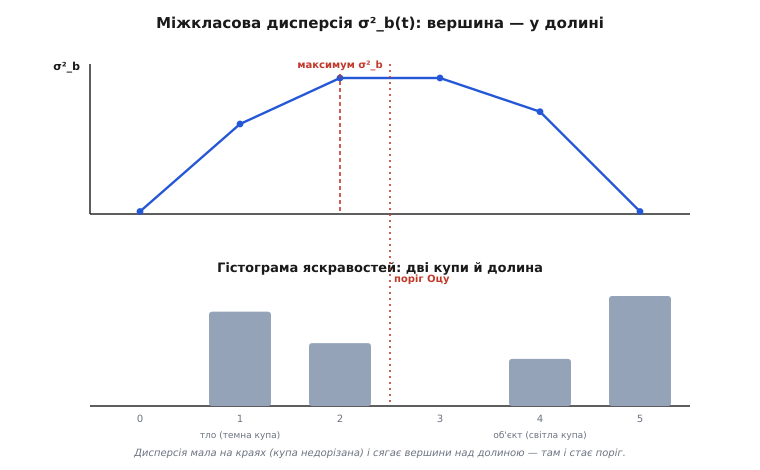

# 🧮 Повне виведення критерію Оцу

Метод [Оцу](book:algorithms/otsu-method) обіцяє дивовижну річ: дай йому гістограму яскравостей кадру — і він **сам** назве поріг T, який найкраще ділить картинку на об'єкт і тло. Жодних ручних підборів, жодних магічних констант. Звучить майже як ворожіння, але за цим стоїть одна чесна й проста ідея, доведена до кінця. Розберімо її від самого низу — так, щоб наприкінці критерій не лишав ні краплі загадки, а сам алгоритм укладався в один прохід по 256 числах.

## Що ми взагалі хочемо від «доброго» порога

Уявімо, що поріг розрізав усі пікселі кадру на дві купи. Усе, що темніше за T, ми оголосили **тлом** (клас 0), усе, що яскравіше, — **об'єктом** (клас 1). Питання: коли такий поділ «хороший»?

Інтуїція підказує дві вимоги, і вони тягнуть у різні боки. По-перше, **всередині** кожної купи яскравості мають бути схожі — тло має складатися з близьких темних тонів, об'єкт — із близьких світлих; якщо всередині купи розкид великий, ми, певно, згребли в одну купу те, що насправді різне. По-друге, **між** купами яскравості мають розходитися якнайдалі — середній тон тла має сильно відрізнятися від середнього тону об'єкта; інакше поділ безглуздий, бо обидві половини однакові.

Перша вимога — «тісно всередині» — це **мала внутрішньокласова дисперсія**. Друга — «далеко між собою» — це **велика міжкласова дисперсія**. Геній Оцу в тому, що він помітив: ці дві вимоги — не два окремих завдання, які треба якось зважувати одне проти одного, а **одне й те саме** завдання, дві сторони однієї монети. Мінімізувати розкид усередині — це буквально те саме, що максимізувати відстань між купами. Доведемо це строго; саме доведення і є серцем методу.

## Гістограма як розподіл імовірностей

Почнемо з гістограми. Хай яскравість набуває значень `i = 0, 1, …, L−1` (для 8-бітного кадру `L = 256`). Нехай `n_i` — скільки пікселів мають яскравість рівно `i`, а `N` — усього пікселів. Перейдімо від лічби до **частот** (імовірностей):

```
p_i = n_i / N          ←  частка пікселів яскравості i
Σ p_i = 1              ←  по всіх i = 0 … L−1
```

Це зручно: тепер уся гістограма — це розподіл імовірностей `p_i`, а сума всіх часток дорівнює одиниці. Числа `N` більше можна забути — важать лише пропорції.

Тепер ставимо поріг **T** (точніше — рівень `t`, після якого піксель іде в об'єкт; беремо клас 0 як `i ≤ t`, клас 1 як `i > t`). Поріг розбиває весь діапазон на два шматки, і кожен клас дістає свою **вагу** — сумарну частку пікселів, що в нього потрапили:

```
w₀(t) = Σ p_i   для i = 0 … t        ←  частка тла
w₁(t) = Σ p_i   для i = t+1 … L−1    ←  частка об'єкта
w₀ + w₁ = 1                          ←  кожен піксель кудись потрапив
```

Ваги — це просто **накопичена сума** гістограми зліва (`w₀`) і решта до одиниці (`w₁`). Вони залежать від `t`: посунули поріг праворуч — `w₀` зросла, `w₁` впала.

Кожен клас має й свій **середній тон** — математичне сподівання яскравості *в межах класу*:

```
μ₀(t) = ( Σ i·p_i для i = 0 … t )   / w₀     ←  середня яскравість тла
μ₁(t) = ( Σ i·p_i для i = t+1 … L−1 ) / w₁    ←  середня яскравість об'єкта
```

Ділимо на вагу, бо хочемо середнє **всередині** класу, а не по всьому кадру. І нарешті — повне середнє всього кадру, яке від порога **не залежить** (це просто яскравість усієї картинки):

```
μ_T = Σ i·p_i   для i = 0 … L−1      ←  загальне середнє, стала
```

Тут варто одразу записати тотожність, яка стане в пригоді далі. Повне середнє — це зважене середнє двох класових середніх:

```
μ_T = w₀·μ₀ + w₁·μ₁
```

Це не нова формула, а просто та сама сума `Σ i·p_i`, розбита порогом на дві частини й зібрана назад. Запам'ятаймо її — вона зробить половину роботи в доведенні.

## Дві дисперсії: всередині й між

Тепер — кількісно ті самі дві вимоги.

**Внутрішньокласова дисперсія** σ²_w (англ. *within-class*, «в межах класу») — це наскільки розкидані яскравості **всередині** кожної купи, усереднено по обох купах із їхніми вагами:

```
σ²₀ = ( Σ (i − μ₀)²·p_i для i = 0 … t )   / w₀     ←  розкид тла
σ²₁ = ( Σ (i − μ₁)²·p_i для i = t+1 … L−1 ) / w₁    ←  розкид об'єкта

σ²_w(t) = w₀·σ²₀ + w₁·σ²₁
```

Кожна купа дає свою дисперсію (середній квадрат відхилення від *свого* середнього), а тоді ми беремо їх зважене середнє. Це і є «наскільки тісно всередині»: маленьке σ²_w — обидві купи щільні.

**Міжкласова дисперсія** σ²_b (англ. *between-class*, «між класами») — це наскільки далеко рознесені **самі купи**, тобто розкид їхніх середніх навколо загального середнього:

```
σ²_b(t) = w₀·(μ₀ − μ_T)² + w₁·(μ₁ − μ_T)²
```

Кожен клас «стоїть» у своєму середньому μ₀ чи μ₁; ми міряємо, як далеко ці дві точки від спільного центру μ_T, зважуючи на розмір класу. Велике σ²_b — купи рознесені далеко.

## Чому повна дисперсія — це сума двох

Тепер — ключ до всього. Візьмімо **повну дисперсію** кадру — звичайний розкид усіх яскравостей навколо спільного середнього μ_T, без жодного поділу на класи:

```
σ²_T = Σ (i − μ_T)²·p_i   для i = 0 … L−1
```

Це стала: вона описує сам кадр і від порога не залежить. Доведемо тотожність, яка все вирішує:

```
σ²_T = σ²_w(t) + σ²_b(t)
```

Тобто **повний розкид завжди дорівнює сумі внутрішнього й міжкласового** — за будь-якого порога. Це окремий випадок загального «закону повної дисперсії» (у статистиці його звуть розкладом дисперсії, *law of total variance*); покажемо його прямо для нашого випадку.

Почнемо з означення σ²_T і розіб'ємо суму порогом на два шматки — `i ≤ t` (клас 0) і `i > t` (клас 1):

```
σ²_T = Σ₀ (i − μ_T)²·p_i  +  Σ₁ (i − μ_T)²·p_i
```

(тут `Σ₀` — сума по класу 0, `Σ₁` — по класу 1.) Тепер хитрість: усередині кожного шматка додамо й віднімемо середнє *цього* класу — для класу 0 це μ₀, для класу 1 це μ₁. Розгляньмо лише перший доданок (другий — дзеркально):

```
(i − μ_T)² = (i − μ₀ + μ₀ − μ_T)²
           = (i − μ₀)² + 2(i − μ₀)(μ₀ − μ_T) + (μ₀ − μ_T)²
```

Підставимо назад у `Σ₀ … p_i` і рознесемо на три суми. Середній доданок зникає, і ось чому: винесемо сталу `2(μ₀ − μ_T)` за дужку, лишиться `Σ₀ (i − μ₀)·p_i`. Але `Σ₀ i·p_i = w₀·μ₀` (за означенням μ₀), а `Σ₀ p_i = w₀`, тож `Σ₀ (i − μ₀)·p_i = w₀·μ₀ − μ₀·w₀ = 0`. Відхилення від власного середнього в сумі гасяться — це і є та сама причина, чому середнє зветься «центром мас». Лишається:

```
Σ₀ (i − μ_T)²·p_i = Σ₀ (i − μ₀)²·p_i  +  (μ₀ − μ_T)²·w₀
                  = w₀·σ²₀            +  w₀·(μ₀ − μ_T)²
```

Те саме для класу 1 дає `w₁·σ²₁ + w₁·(μ₁ − μ_T)²`. Складаємо обидва:

```
σ²_T = [w₀·σ²₀ + w₁·σ²₁]  +  [w₀·(μ₀−μ_T)² + w₁·(μ₁−μ_T)²]
     =        σ²_w        +            σ²_b
```

Що й треба було довести. Повний розкид кадру **точно** розпадається на внутрішній і міжкласовий, хоч би де стояв поріг.

## Звідси — головний висновок методу

А тепер просто подивімося на доведену рівність ще раз:

```
σ²_T = σ²_w(t) + σ²_b(t)        ←  ліва частина СТАЛА (не залежить від t)
```

Ліва частина — стала. Отже, коли поріг `t` повзе й одна частина суми росте, друга **зобов'язана** на стільки ж упасти. Звідси миттєво:

```
мінімізувати σ²_w(t)   ⟺   максимізувати σ²_b(t)
```

Ось і вся монета. «Тісно всередині купи» (мала σ²_w) і «далеко між купами» (велика σ²_b) — це **буквально один критерій**, бо їхня сума прибита цвяхом до сталої σ²_T. Не треба нічого зважувати чи балансувати: знайшов поріг, де купи розходяться найдужче, — і ти автоматично знайшов поріг, де всередині купи тримаються найтісніше.

Це й практично безцінно. Внутрішня дисперсія σ²_w вимагає на кожен поріг рахувати два σ²₀, σ²₁ — два проходи відхилень. А міжкласова σ²_b залежить лише від ваг і середніх, які беруться з **накопичених сум**. Тож Оцу максимізує саме σ²_b — те, що рахувати дешевше, — і це через доведену рівність те саме, що мінімізувати важку σ²_w.

> 🔧 **Навіщо це.** На контролері з обмеженими тактами немає сенсу рахувати дисперсії в лоба для кожного з 255 порогів — це сотні тисяч операцій. Доведена рівність дозволяє рахувати лише σ²_b через накопичені суми гістограми: один прохід по 256 значеннях, по кілька дій на крок. Саме тому Оцу влазить у бюджет навіть слабкого MCU й виконується раз на кадр непомітно.

## Робоча форма σ²_b: одне віднімання на крок

Згорнімо σ²_b у вид, який рахується найшвидше. Підставимо `μ_T = w₀·μ₀ + w₁·μ₁` у `σ²_b = w₀·(μ₀−μ_T)² + w₁·(μ₁−μ_T)²`. Після розкриття (це школярська алгебра, лише довга) усе стискається до напрочуд короткого:

```
σ²_b(t) = w₀·w₁·(μ₀ − μ₁)²
```

Перевірмо, що це розумно. Множник `(μ₀ − μ₁)²` — квадрат відстані між середніми тонами тла й об'єкта: що далі вони, то більша σ²_b. Множник `w₀·w₁` — наскільки збалансований поділ: він найбільший, коли половини рівні (`w₀ = w₁ = 0.5`), і падає до нуля, коли одна купа порожня. Тобто формула винагороджує і за **рознесені** тони, і за **непорожні** обидві купи — рівно та якість, якої ми хотіли. Коли поріг заїхав у самий край і один клас порожній, `w₀·w₁ = 0` — і σ²_b чесно дорівнює нулю, відкидаючи безглуздий поділ.

Тепер про швидкість. Введімо **накопичені суми** до рівня `t` включно:

```
P(t) = Σ p_i      для i = 0 … t        ←  накопичена частка   (це і є w₀)
S(t) = Σ i·p_i    для i = 0 … t        ←  накопичений момент
```

Через них усе виражається без жодного повторного підсумовування:

```
w₀ = P(t)              w₁ = 1 − P(t)
μ₀ = S(t) / P(t)       μ₁ = ( μ_T − S(t) ) / ( 1 − P(t) )
```

А `P(t)` і `S(t)` рахуються **наростанням**: `P(t) = P(t−1) + p_t`, `S(t) = S(t−1) + t·p_t`. Тобто один прохід по гістограмі зліва направо, на кожному кроці — одне додавання до кожної суми й обчислення σ²_b. Запам'ятовуємо `t`, де σ²_b була найбільша, — це і є поріг Оцу.

## Worked-приклад: гістограма з двох куп

Візьмімо крихітну гістограму, щоб усе порахувати руками й звірити з кодом. Хай яскравість набуває лише шести рівнів `0 … 5`, а пікселі розсипані у дві явні купи — темну (рівні 1–2) і світлу (рівні 4–5):

```
рівень i:   0    1    2    3    4    5
n_i:        0   24   16    0   12   28      (усього N = 80)
p_i:        0  .30  .20    0  .15  .35
```

Долина між купами — на рівні 3 (там пікселів нема). Інтуїтивно найкращий поріг `t = 3` (усе ≤ 3 — тло, усе > 3 — об'єкт). Перевірмо, що Оцу вибере саме його. Спершу загальне середнє:

```
μ_T = 0·0 + 1·.30 + 2·.20 + 3·0 + 4·.15 + 5·.35
    = .30 + .40 + .60 + 1.75 = 3.05
```

Тепер пройдімо пороги `t = 1, 2, 3, 4` і порахуймо σ²_b = w₀·w₁·(μ₀−μ₁)² через накопичені суми.

```
t = 1:  w₀ = .30                 (рівень 0..1)
        S  = 0·0 + 1·.30 = .30
        μ₀ = .30/.30 = 1.000
        w₁ = .70,  μ₁ = (3.05 − .30)/.70 = 2.75/.70 = 3.929
        σ²_b = .30·.70·(1.000 − 3.929)² = .21·8.579 = 1.802

t = 2:  w₀ = .50                 (рівень 0..2)
        S  = .30 + 2·.20 = .70
        μ₀ = .70/.50 = 1.400
        w₁ = .50,  μ₁ = (3.05 − .70)/.50 = 2.35/.50 = 4.700
        σ²_b = .50·.50·(1.400 − 4.700)² = .25·10.89 = 2.723   ← найбільша

t = 3:  w₀ = .50                 (рівень 0..3, рівень 3 порожній)
        S  = .70 + 3·0 = .70
        μ₀ = 1.400,  w₁ = .50,  μ₁ = 4.700
        σ²_b = .25·10.89 = 2.723   ← так само максимум (рівень 3 порожній)

t = 4:  w₀ = .65                 (рівень 0..4)
        S  = .70 + 4·.15 = 1.30
        μ₀ = 1.30/.65 = 2.000
        w₁ = .35,  μ₁ = (3.05 − 1.30)/.35 = 1.75/.35 = 5.000
        σ²_b = .65·.35·(2.000 − 5.000)² = .2275·9.000 = 2.048
```

Максимум σ²_b = 2.723 припав на `t = 2` (і так само `t = 3`, бо рівень 3 порожній — обидва пороги ділять однаково). Оцу обере поріг у долині між купами — рівно те, що нам підказувала інтуїція, тільки тепер це вийшло **саме**, без жодного ручного втручання. Зверни увагу: на краях (`t = 1` і `t = 4`) σ²_b менша — там поділ гірший, бо одна купа «недорізана». Функція σ²_b(t) має чіткий горб над долиною гістограми; саме його вершину й шукає алгоритм.


*Та сама гістограма з двох куп і під нею крива σ²_b(t). Дисперсія мала на краях (одна купа недорізана) і сягає вершини точно над долиною — там Оцу й ставить поріг. Шукати найкраще T — це буквально знайти вершину цього горба.*

## Той самий приклад у C

Тепер той самий розрахунок — робочим кодом прошивки. Гістограма вже зібрана (один прохід по кадру з інкрементом `hist[gray]`), лишається знайти поріг. Працюємо в цілих числах, щоб не тягнути float на слабкому MCU: усе домножене на `N`, тож порівнюємо `σ²_b` у виді, де дільник `N²` спільний і на вибір максимуму не впливає.

**Умова: гістограма з прикладу вище (n = {0,24,16,0,12,28}, N = 80). Знайти поріг Оцу.**
:::tabs
```cpp
#include <stdint.h>

// hist[L] — гістограма (лічба пікселів), N — усього пікселів.
// Повертає поріг t: пікселі з яскравістю > t — об'єкт.
int otsu_threshold(const uint32_t hist[], int L, uint32_t N) {
    uint64_t sum_total = 0;                 // Σ i·n_i по всій гістограмі
    for (int i = 0; i < L; i++) sum_total += (uint64_t)i * hist[i];

    uint64_t sum_bg = 0;                    // накопичений момент S(t)·N
    uint32_t w_bg   = 0;                    // накопичена вага w₀·N
    double   best_var = -1.0;
    int      best_t   = 0;

    for (int t = 0; t < L; t++) {
        w_bg   += hist[t];                  // w₀·N наростанням
        if (w_bg == 0) continue;            // клас тла ще порожній
        uint32_t w_fg = N - w_bg;           // w₁·N
        if (w_fg == 0) break;               // клас об'єкта спорожнів — далі нема сенсу

        sum_bg += (uint64_t)t * hist[t];    // S(t)·N наростанням
        double mu_bg = (double)sum_bg / w_bg;
        double mu_fg = (double)(sum_total - sum_bg) / w_fg;

        // σ²_b ∝ w₀·w₁·(μ₀−μ₁)²  (спільний дільник N² відкинуто)
        double diff = mu_bg - mu_fg;
        double var_between = (double)w_bg * w_fg * diff * diff;

        if (var_between > best_var) {        // запам'ятати вершину горба
            best_var = var_between;
            best_t   = t;
        }
    }
    return best_t;
}
```
```python
def otsu_threshold(hist, N):
    """hist — гістограма (лічба пікселів), N — усього пікселів.
    Повертає поріг t: пікселі з яскравістю > t — об'єкт."""
    L = len(hist)
    sum_total = sum(i * hist[i] for i in range(L))  # Σ i·n_i по всій гістограмі

    sum_bg = 0                              # накопичений момент S(t)·N
    w_bg = 0                                # накопичена вага w₀·N
    best_var = -1.0
    best_t = 0

    for t in range(L):
        w_bg += hist[t]                     # w₀·N наростанням
        if w_bg == 0:
            continue                        # клас тла ще порожній
        w_fg = N - w_bg                     # w₁·N
        if w_fg == 0:
            break                           # клас об'єкта спорожнів — далі нема сенсу

        sum_bg += t * hist[t]               # S(t)·N наростанням
        mu_bg = sum_bg / w_bg
        mu_fg = (sum_total - sum_bg) / w_fg

        # σ²_b ∝ w₀·w₁·(μ₀−μ₁)²  (спільний дільник N² відкинуто)
        diff = mu_bg - mu_fg
        var_between = w_bg * w_fg * diff * diff

        if var_between > best_var:          # запам'ятати вершину горба
            best_var = var_between
            best_t = t

    return best_t
```
:::

Проженімо його думкою на нашій гістограмі. На `t = 2`: `w_bg = 0+24+16 = 40`, `w_fg = 40`, `sum_bg = 0+24+32 = 56`, `mu_bg = 56/40 = 1.4`, `mu_fg = (sum_total − 56)/40`. Повна `sum_total = 24·1 + 16·2 + 12·4 + 28·5 = 24+32+48+140 = 244`, тож `mu_fg = (244−56)/40 = 188/40 = 4.7`. Тоді `var_between = 40·40·(1.4−4.7)² = 1600·10.89 = 17424`. На `t = 1`: `w_bg = 24`, `sum_bg = 24`, `mu_bg = 1.0`, `mu_fg = (244−24)/56 = 220/56 = 3.929`, `var_between = 24·56·(−2.929)² = 1344·8.579 = 11530`. Менше. На `t = 4`: `w_bg = 64`, `sum_bg = 24+32+0+48 = 104`, `mu_bg = 104/64 = 1.625`… стоп — тут видно, чому код важливий: рівень 3 порожній, тож на `t = 3` `sum_bg` і `w_bg` не змінюються від `t = 2`, і `var_between` лишається 17424 (нічия з `t = 2`, `>` лишає перший — `best_t = 2`). На `t = 4` `var_between = 64·16·(1.625−5.0)²`… менше за 17424. Максимум — на `t = 2`, рівно як руками (множник `N² = 6400` між `17424` і `2.723` лише масштаб: `17424/6400 = 2.723`). Поріг Оцу: пікселі з яскравістю **3, 4, 5** — об'єкт; **0, 1, 2** — тло.

## Граничні випадки й де метод чесно ламається

Оцу могутній, але не всемогутній — і його межі прямо випливають із того, що він максимізує `w₀·w₁·(μ₀−μ₁)²`.

**Унімодальна гістограма.** Якщо в кадрі **одна** купа — темний об'єкт на темному тлі, рівне небо, однотонна стіна — долини між купами просто немає. Оцу все одно поверне *якесь* `t` (вершина σ²_b завжди десь є), але цей поріг штучний: він розріже єдину купу навпіл по чомусь на кшталт медіани й видасть купу шуму замість осмисленої маски. Лік не в Оцу: треба або інший сигнал (адаптивний поріг по локальних околах, де перепад усе-таки є), або визнати, що порогом тут нічого не виділиш. Проста перевірка перед довірою до Оцу — глянути, чи гістограма взагалі **двогорба**; якщо ні, поріг Оцу беззмістовний.

**Дуже нерівні класи.** Коли об'єкт — крихітна яскрава цятка на величезному темному тлі (`w₁ ≪ w₀`), множник `w₀·w₁` тягне максимум σ²_b убік від справжньої межі: метод воліє різати ближче до центру гістограми, де ваги збалансованіші, і «недобачає» дрібний об'єкт. Це не помилка коду, а вбудоване уподобання критерію до рівних половин. Лік — зважений варіант або зовсім інший підхід (виділення за локальним контрастом), якщо ціль свідомо мала.

**Нерівне світло.** Оцу — **глобальний** метод: одне T на весь кадр. Якщо світло гуляє по сцені, єдина гістограма змішує «світле тло одного кутка» зі «темним об'єктом іншого», купи розмазуються, і жоден глобальний поріг не годиться. Тут Оцу застосовують **локально** — рахують свій поріг для кожного вікна (це місток до адаптивного порога), або спершу вирівнюють освітлення.

**Шум і дискретність.** На реальній зашумленій гістограмі σ²_b(t) — не гладкий горб, а зубчаста крива з кількома близькими локальними максимумами. Код вище бере перший глобальний максимум (`>`), і це звичайно правильно; та якщо потрібна стійкість, гістограму перед пошуком трохи згладжують (ковзне середнє по кількох рівнях), щоб дрібні зубці не зміщували вершину на сусідній рівень.

**Цілочислове переповнення.** У коді `sum_total` і `sum_bg` накопичують `Σ i·n_i`. Для кадру 1920×1080 це до `2·10⁶` пікселів, помножених на `255` — близько `5·10⁸`, що ще влазить у 32 біти, але впритул; а `w_bg·w_fg·diff²` у цілому виді переростає 32 біти легко. Тому в коді ваги тримаємо в `uint32_t`, моменти — у `uint64_t`, а саму σ²_b рахуємо в `double` (або в `uint64_t`, якщо float дорогий). Порахувати «в лоб» у 32-бітних і дістати тихе обгортання — класична пастка, що дає поріг «з нізвідки».

Підсумок виведення: метод Оцу — не евристика, а наслідок однієї доведеної рівності `σ²_T = σ²_w + σ²_b`. Із неї випливає, що «тісно всередині» і «далеко між собою» — той самий критерій, що його дешево рахувати через накопичені суми як `w₀·w₁·(μ₀−μ₁)²`, і що ламається він рівно там, де його припущення (дві помітні купи приблизно зрівноваженого розміру під рівним світлом) перестає бути правдою.
