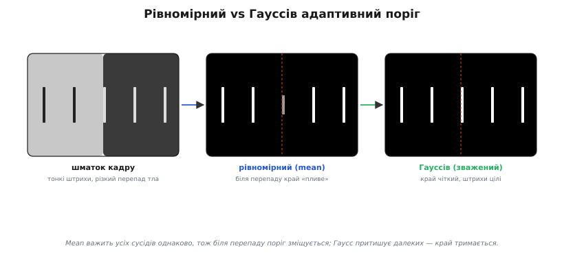
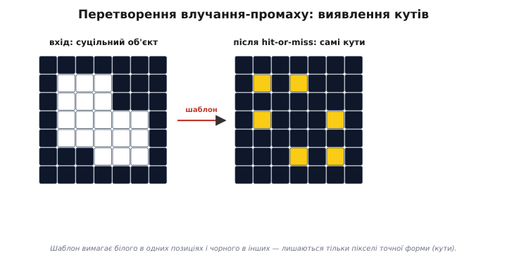

# Пороги й морфологія — детально

<preknowlist>
- [Зображення як дані](book:algorithms/image-as-data) — кадр як мапа яскравостей (сіра або кольорова, зокрема HSV): кожен піксель — число.
- [Гістограма](book:algorithms/histogram) — розподіл яскравостей кадру: скільки пікселів припадає на кожен тон.
</preknowlist>

Розділити кадр навпіл — на «об'єкт» і «тло» — звучить як найпростіша операція бачення, і базова ідея справді проста: вибрав число, порівняв із ним кожен піксель, дістав чорно-білу маску. Але щойно цей прийом виходить із класної дошки в реальну камеру на контролері, спливає десяток тонкощів. Звідки взяти поріг, коли світло в сцені нерівне? Чому морфологія, що чистить маску, не псує розмір об'єкта, хоч її дії — то «з'їдання», то «нарощування» країв? Чи дасть та сама ерозія однаковий результат квадратом і колом? Що буде, коли гістограма не двогорба? Ця стаття веде поріг і морфологію до самого дна: виводить критерій [Оцу](book:algorithms/otsu-method) з нуля, розписує математику локального вікна, дає формальну алгебру морфологічних операцій з їхніми гарантіями стабільності, доходить до скелетонізації — і чесно показує, де кожен метод ламається.

## Поріг як розв'язання й критерій Оцу

Поставити поріг — означає кожному пікселю яскравості `i` присвоїти один із двох ярликів: тло (якщо `i ≤ T`) або об'єкт (якщо `i > T`). Усе питання — у виборі числа `T`. Коли об'єкт і тло помітно різні за яскравістю, [гістограма](book:algorithms/histogram) кадру має дві «купи»: темну (тло) і світлу (об'єкт), розділені долиною. Поріг природно ставити в цю долину. Але «на око» — ненадійно й не годиться для автомата; потрібен критерій, який сам назве найкраще T.

Метод, що дав японський інженер Нобуюкі Оцу 1979 року, відповідає на це з рідкісною елегантністю. Сформулюймо, чого ми хочемо від «доброго» порога, двома вимогами, що тягнуть у різні боки. По-перше, **всередині** кожної купи яскравості мають бути схожі — інакше ми згребли різне в одну купу. По-друге, середні тони двох куп мають бути **далеко** одне від одного — інакше поділ безглуздий. Перша вимога — мала **внутрішньокласова дисперсія**; друга — велика **міжкласова дисперсія**. Оцу довів, що це **одне й те саме** завдання.

### Виведення: дві дисперсії й рівність, що все вирішує

Перейдімо від лічби пікселів до часток. Хай `p_i = n_i / N` — частка пікселів яскравості `i` (де `n_i` — їхня лічба, `N` — усього). Тоді `Σ p_i = 1`, і вся гістограма — це розподіл імовірностей. Поріг `t` ділить діапазон на клас 0 (`i ≤ t`) і клас 1 (`i > t`); кожен дістає **вагу** — сумарну частку своїх пікселів:

```
w₀(t) = Σ p_i   (i = 0 … t)        ←  частка тла
w₁(t) = Σ p_i   (i = t+1 … L−1)    ←  частка об'єкта
w₀ + w₁ = 1
```

і свій **середній тон** — сподівання яскравості в межах класу:

```
μ₀(t) = ( Σ i·p_i, i = 0 … t )   / w₀
μ₁(t) = ( Σ i·p_i, i = t+1 … L−1 ) / w₁
```

Повне середнє кадру `μ_T = Σ i·p_i` від порога не залежить і зв'язане з класовими простою тотожністю `μ_T = w₀·μ₀ + w₁·μ₁` (та сама сума, розбита й зібрана). Тепер дві дисперсії. **Внутрішньокласова** — зважений розкид усередині куп:

```
σ²_w(t) = w₀·σ²₀ + w₁·σ²₁
```

де `σ²₀`, `σ²₁` — дисперсії яскравості в кожному класі навколо свого μ. **Міжкласова** — розкид самих середніх навколо спільного центру:

```
σ²_b(t) = w₀·(μ₀ − μ_T)² + w₁·(μ₁ − μ_T)²
```

А тепер — серце методу. Візьмімо **повну дисперсію** кадру `σ²_T = Σ (i − μ_T)²·p_i` — звичайний розкид усіх яскравостей, без поділу на класи; це стала. Виявляється:

```
σ²_T = σ²_w(t) + σ²_b(t)        ←  для будь-якого t
```

Повний розкид **точно** розпадається на внутрішній плюс міжкласовий. Доводиться це прямо: розбиваємо `σ²_T` порогом на дві суми, у кожній додаємо-віднімаємо своє класове середнє, розкриваємо квадрат `(i − μ_T)² = (i − μ₀ + μ₀ − μ_T)²` — і перехресний доданок гасне, бо `Σ (i − μ₀)·p_i = 0` (відхилення від власного середнього в сумі дають нуль). Лишається рівно σ²_w + σ²_b. Повне покрокове виведення з усіма сумами — в [окремій вставці](book:algorithms/threshold-morphology/math-otsu-derivation.md); тут важливий **наслідок**.

Ліва частина `σ²_T` — стала. Отже, коли поріг повзе й σ²_w росте, σ²_b **зобов'язана** на стільки ж упасти, і навпаки:

```
мінімізувати σ²_w(t)   ⟺   максимізувати σ²_b(t)
```

«Тісно всередині купи» і «далеко між купами» — буквально один критерій. Не треба нічого зважувати: знайшов поріг, де купи розходяться найдужче, — і автоматично знайшов поріг, де всередині найтісніше. А максимізувати зручно саме σ²_b, бо вона згортається в напрочуд дешеву форму. Підставивши `μ_T` й розкривши, дістаємо:

```
σ²_b(t) = w₀·w₁·(μ₀ − μ₁)²
```

Це й розумно, і швидко. Множник `(μ₀ − μ₁)²` — квадрат відстані між тонами тла й об'єкта (далі → краще). Множник `w₀·w₁` — баланс поділу: найбільший при рівних половинах, нуль — коли купа порожня (відкидає безглуздий поріг у краю). А рахувати все можна **накопиченням**: тримаємо біжучі суми `P(t) = Σ p_i` і `S(t) = Σ i·p_i` до рівня `t`, тоді `w₀ = P`, `μ₀ = S/P`, `w₁ = 1−P`, `μ₁ = (μ_T − S)/(1−P)`. Один прохід по 256 рівнях, по кілька дій на крок, запам'ятовуємо `t` із найбільшою σ²_b. Як це лягає в робочий C прошивки — теж у [виведенні](book:algorithms/threshold-morphology/math-otsu-derivation.md).


*Гістограма з двох куп і крива σ²_b(t) під нею. На краях дисперсія мала (одна купа недорізана), а вершина горба припадає точно на долину — там Оцу й ставить поріг. Знайти найкраще T — це знайти вершину цього горба.*

Практична вага цього видна одразу: Оцу прибирає з конвеєра магічну константу. Замість здогадного «поставимо T = 128 й сподіватимемось» поріг сам їде за яскравістю кожного кадру — камера в тіні чи на сонці, а поділ лишається правильним. І коштує це один прохід по гістограмі раз на кадр, тож підйомне навіть слабкому контролеру.

### Коли Оцу ламається

Сила методу — у його припущенні: дві помітні купи приблизно зрівноваженого розміру. Де припущення хибне, там і поріг хибний. **Унімодальна гістограма** (темний об'єкт на темному тлі, рівне небо, однотонна стіна) долини не має — Оцу все одно поверне якесь `t`, але воно штучно розріже єдину купу й видасть шум. Перевірка проста: глянути, чи гістограма взагалі двогорба; якщо ні — порогом тут нічого не виділиш, треба інший сигнал. **Дуже нерівні класи** (крихітна яскрава цятка на величезному тлі, `w₁ ≪ w₀`): множник `w₀·w₁` тягне максимум до центру гістограми, і метод недобачає дрібний об'єкт. **Нерівне світло**: Оцу глобальний (одне T на кадр), тож при гулянні світла купи розмазуються — лік у локальному застосуванні, до якого ми зараз і переходимо.

## Адаптивний поріг: математика локального вікна

Глобальний поріг — навіть ідеально підібраний Оцу — безсилий проти **нерівного освітлення**. Якщо лівий край кадру залитий світлом, а правий лежить у тіні, темний об'єкт зліва може бути яскравішим за світле тло справа. Жодне єдине число `T` не розрубає таку сцену: підняв поріг — згубив об'єкт у тіні, опустив — тло на світлі стало білим. Вихід — рахувати **своє** T для кожної ділянки, з її ж околу. Це й є [адаптивний (локальний) поріг](book:algorithms/adaptive-thresholding).

### Формула й варіанти зважування

Найпростіший адаптивний поріг бере середню яскравість квадратного вікна навколо пікселя й віднімає невеликий запас:

```
T(x,y) = mean(окіл S×S навколо (x,y)) − C
маска(x,y) = 255, якщо gray(x,y) > T(x,y),  інакше 0
```

Тут `S` — розмір вікна (непарний, скажімо 15), `C` — запас (типово 2…10). Запас `C` вирішальний: без нього (при `C = 0`) поріг ловить власний шум — піксель, рівний середньому околу, мерехтить між чорним і білим від кадру до кадру. `C` вимагає, щоб піксель був не просто яскравішим за окіл, а **помітно** яскравішим, і тим стабілізує маску на рівному тлі.

Звичайне середнє важить усіх сусідів однаково — і далекий кут вікна впливає так само, як найближчий сусід. Часто розумніше, щоб ближчі пікселі важили більше: це **Гауссів адаптивний поріг**, де середнє зважене дзвоном Гауса:

```
T(x,y) = Σ g(dx,dy)·gray(x+dx, y+dy)  −  C
         де g(dx,dy) = exp( −(dx² + dy²) / (2σ²) ),  Σ g = 1 (нормуємо)
```

Різниця практична: рівномірне (mean) середнє реагує на весь вміст вікна однаково, тож на межі різкого перепаду яскравості «бачить» далеку яскраву ділянку так само, як близьку, і поріг біля межі трохи зміщується. Гауссове зважування притишує далекі пікселі, тож поріг тісніше тримається безпосереднього оточення — край виходить чистіший, дрібні деталі менше «пливуть». Платня — трохи більше обчислень (вагова таблиця замість простого ділення) і параметр `σ` на додачу до `S`.


*Один і той самий шматок кадру під рівномірним і Гауссовим адаптивним порогом. Mean важить усіх сусідів однаково, тож біля різкого перепаду яскравості край трохи «пливе»; Гаусс притишує далекі пікселі, і край тримається чіткіше, а тонкі штрихи зберігаються краще.*

### Вплив розміру вікна

Розмір вікна `S` — головна ручка адаптивного порога, і вона має два протилежні кінці. **Велике вікно** усереднює яскравість по широкій ділянці, тож стійке до плавного градієнта освітлення (віньєтки, тіні) — воно «бачить» загальний рівень фону й не реагує на повільні зміни. Але велике вікно **не помічає дрібних деталей**: тонка лінія, вужча за вікно, розчиняється в його середньому, і поріг її не виокремить. **Мале вікно** навпаки — чутливе до дрібних деталей, ловить тонкі штрихи, але **вразливе до шуму** і може «побачити межу» там, де її нема, бо кілька зашумлених пікселів зрушують локальне середнє. Практичне правило: вікно беруть **трохи більшим за найбільшу деталь, яку треба виділити**, але меншим за масштаб, на якому гуляє освітлення. Для тексту це приблизно півтори висоти літери; для дрібних об'єктів — кілька їхніх діаметрів.

**Умова: піксель у центрі вікна 5×5, яскравості околу нижче, C = 3. Знайти T і ярлик пікселя.**
```c
// вікно 5×5 навколо пікселя (його яскравість gray = 128):
//   90  92  88  95  91
//   89 110 130 125  93     ← центральний рядок, у центрі 130
//   94 128 128 126  90
//   91 120 124 122  92
//   88  90  93  89  87
//
// сума всіх 25 значень = 2615
// mean = 2615 / 25 = 104.6  →  T = 104.6 − 3 = 101.6
// gray(центр) = 130 > 101.6  →  маска = 255 (білий)
//
// сусід зліва, gray = 89:  89 > 101.6 ?  ні  →  маска = 0 (чорний)
```
Видно суть: той самий абсолютний рівень 130 в цьому околі — об'єкт (бо окіл тьмяний, ~105), а в яскравому околі (скажімо, mean = 200) той самий 130 був би тлом. Поріг **їде за фоном** — у цьому вся сила методу.

Наївно середнє вікна `S×S` коштує `S²` читань на піксель. Для `S = 15` це 225 операцій на кожен піксель — задорого. Інтегральне зображення (таблиця накопичених сум) зводить суму **будь-якого** прямокутного вікна до чотирьох звернень незалежно від `S`; повний робочий конвеєр із ним — в [окремій вставці](book:algorithms/threshold-morphology/proj-threshold-morphology-pipeline.md). Гауссів варіант через прямокутне інтегральне зображення не пришвидшити (вага не стала по вікну), зате Гаусс **розділюваний**: двовимірне зважування = горизонтальний прохід дзвоном, тоді вертикальний, разом `2S` операцій замість `S²`.

## Алгебра морфології: формальні означення

Свіжа маска майже завжди брудна: дрібні білі цятки шуму, дірки в тілах, рвані краї, злиплі сусіди. Чистить це **математична морфологія** — апарат, що оперує формами на бінарному зображенні через одну пробну фігуру, **структурний елемент**. Базова стаття дає інтуїцію («ерозія з'їдає край, дилатація нарощує»); тут — формальні означення, з яких випливають **гарантії**, заради яких морфологію й люблять.

Розгляньмо бінарне зображення як **множину** `A` — набір координат білих пікселів. Структурний елемент — теж множина `B` (наприклад, квадрат 3×3 із центром у початку координат). Позначмо `B_x` зсув `B` так, щоб його центр потрапив у точку `x`.

**Ерозія** `A` структурним елементом `B`:

```
ε(A, B) = { x : B_x ⊆ A }
```

Словами: піксель `x` лишається в результаті, лише якщо весь зсунутий структурний елемент `B_x` **повністю вкладається** в `A`. Для квадрата 3×3 це значить «всі дев'ять сусідів білі» — рівно те «з'їдання» краю, що його дає мінімум по вікну на бінарній масці.

**Дилатація** `A` структурним елементом `B`:

```
δ(A, B) = { x : B̂_x ∩ A ≠ ∅ }
```

де `B̂` — `B`, відбитий через початок координат (для симетричного `B`, як квадрат чи коло, `B̂ = B`). Словами: піксель `x` потрапляє в результат, якщо зсунутий (відбитий) елемент **хоч десь перетинає** `A` — хоч один його піксель накрив біле. Це «нарощування» краю, максимум по вікну.

З цих двох будуються складені дії. **Відкриття**:

```
γ(A, B) = δ( ε(A, B), B )        ←  ерозія, потім дилатація
```

**Закриття**:

```
φ(A, B) = ε( δ(A, B), B )        ←  дилатація, потім ерозія
```

### Ідемпотентність: гарантія стабільності конвеєра

Тепер найважливіша властивість, заради якої ці означення варті заходу. Відкриття й закриття **ідемпотентні**:

```
γ( γ(A) ) = γ(A)            ←  повторне відкриття нічого не міняє
φ( φ(A) ) = φ(A)            ←  повторне закриття нічого не міняє
```

(Тут і далі `B` для стислості опускаємо.) Прогнавши відкриття **двічі**, дістанеш те саме, що й один раз; тричі, десять разів — те саме. Це не випадковість, а наслідок означень. Інтуїція для відкриття: воно лишає рівно ті ділянки, **куди структурний елемент уміщується цілком**, і згладжує все, куди не вміщується. Після першого відкриття зображення вже складається **лише** з місць, куди `B` уміщується, — тож друге відкриття не має чого прибирати, бо нема куди `B` не вмістився б. Дзеркально для закриття.

Чому це безцінно на практиці? **Стабільність конвеєра.** Якщо стадія чистки маски ідемпотентна, її можна застосовувати **скільки завгодно разів** без страху, що зображення «попливе» — почне з кожним проходом усе більше спотворюватися. Конвеєр сходиться за один крок і там лишається. Це різко відрізняє відкриття/закриття від голих ерозії чи дилатації: ерозія, прогнана двічі, з'їдає **вдвічі** товстіший шар (`ε(ε(A))` стискає сильніше за `ε(A)`), і повторювати її наосліп небезпечно — об'єкт усохне. А відкриття можна повторювати безкарно. Тому в надійному коді чистку будують саме на ідемпотентних відкритті/закритті, а не на сирих ε/δ — і відкриття можна ганяти щокадру, не боячись, що маска з часом усохне.

### Подвійність де Моргана

Ерозія й дилатація пов'язані елегантною подвійністю: **ерозія множини = доповнення дилатації її доповнення**:

```
ε(A, B) = ( δ( Aᶜ, B̂ ) )ᶜ
```

де `Aᶜ` — доповнення `A` (чорне стає білим і навпаки). Словами: з'їдати об'єкт ерозією — те саме, що нарощувати **тло** дилатацією, а тоді знову поміняти кольори. Це не просто гарна симетрія — вона практична. По-перше, дозволяє реалізувати **одну** операцію через іншу (заощадити код: маєш дилатацію — маєш і ерозію через два інвертування). По-друге, з неї випливає подвійність відкриття й закриття: `γ(A) = (φ(Aᶜ))ᶜ` — відкриття об'єкта є закриттям тла. Тобто прибрати білі цятки на чорному тлі (відкриття) — те саме, що залатати чорні дірки в білому тлі (закриття) з протилежного боку. Це пояснює, чому відкриття й закриття — дзеркальна пара: вони роблять одне й те саме, лише дивляться з різних боків межі, тож і плутати «латати дірки в об'єкті» чи «з'їдати тло» більше нема потреби — це той самий хід.

## Форма структурного елемента

Дотепер «структурний елемент» був абстрактною множиною `B`. На практиці його **форма** прямо впливає на результат, і вибір не випадковий. Три типові форми — квадрат, ромб і круг (точніше, дискова апроксимація) — поводяться помітно по-різному.

**Квадрат** (повне вікно 3×3, 5×5) діє однаково по всіх напрямках сітки, але **не ізотропно**: по діагоналі він «дотягується» далі (на `√2` від центру до кута), ніж по горизонталі/вертикалі (на 1). Через це квадрат лишає **кутові артефакти** — гострі кути об'єктів він обтинає інакше, ніж пласкі краї, і круглий об'єкт після кількох ерозій квадратом стає трохи восьмикутним. **Ромб** (хрест: центр і чотири прямі сусіди) — протилежна крайність: дотягується лише по осях, по діагоналях не дістає, тож округлює кути в інший бік. **Круг** (дискова апроксимація — усі пікселі в радіусі `r` від центру) **ізотропний**: діє однаково в усіх напрямках, тож не вносить кутових спотворень і зберігає округлість форм. Платня — круг дорожчий (більше пікселів у елементі, складніша апроксимація на сітці).

| структурний елемент | форма | дотяг | ефект на форму |
|---|---|---|---|
| квадрат 3×3 | усі 8 сусідів + центр | по діагоналі далі (√2) | кутові артефакти, округле → восьмикутне |
| ромб (хрест) | центр + 4 прямі сусіди | лише по осях | округлює кути по-іншому, рве діагоналі |
| круг (диск r) | пікселі в радіусі r | однаково всюди | ізотропний, зберігає округлість |

Практичне правило: для **загальної** чистки шуму квадрат 3×3 цілком годиться й найдешевший. Коли важлива **форма** об'єкта (вимір округлих деталей, збереження контуру) — беруть дисковий елемент, щоб не внести гранчастих артефактів. Ромб корисний, коли треба свідомо різати по осях (наприклад, рвати горизонтальні/вертикальні перемички).

**Умова: той самий об'єкт-«плюс» (товстий хрест) після ерозії квадратом 3×3 і дисковим 3×3 (1 — біле).**
```
вхід (товстий хрест)     ерозія квадратом 3×3     ерозія диском 3×3 (хрест-елемент)
. . 1 1 1 . .            . . . . . . .            . . . . . . .
. . 1 1 1 . .            . . . 1 . . .            . . . 1 . . .
1 1 1 1 1 1 1            . . 1 1 1 . .            . . . 1 . . .
1 1 1 1 1 1 1     →      . . 1 1 1 . .      →     . 1 1 1 1 1 .
1 1 1 1 1 1 1            . . 1 1 1 . .            . . . 1 . . .
. . 1 1 1 . .            . . . 1 . . .            . . . 1 . . .
. . 1 1 1 . .            . . . . . . .            . . . . . . .
```
Квадрат вимагає, щоб усі 8 сусідів були білі, тож з'їдає рівно один шар по всьому периметру — і виступи хреста, і центр стискаються рівномірно, лишаючи компактне ядро. Дисковий хрест-елемент дивиться лише на 4 прямі сусіди, тож зберігає тонший осьовий «кістяк» хреста — видно, що форма елемента диктує, **що саме** від об'єкта вціліє. Тонкі виступи виживають при тому елементі, чия форма їх «підпирає».

## Перетворення влучання-промаху (hit-or-miss)

Звичайна ерозія питає одне: чи весь структурний елемент уміщується в об'єкт. Часто потрібно тонше — знайти пікселі, навколо яких **певний візерунок білого ТА чорного** одночасно. Це робить **перетворення влучання-промаху** (англ. *hit-or-miss transform*): воно шукає **точну локальну конфігурацію** і тому ловить специфічні структури — кути, кінці ліній, перехрестя, ізольовані точки.

Формально задаються **два** структурні елементи: `B₁` — пікселі, що мають бути білими (об'єкт), і `B₂` — пікселі, що мають бути чорними (тло), причому `B₁ ∩ B₂ = ∅`. Перетворення:

```
HMT(A) = ε(A, B₁) ∩ ε(Aᶜ, B₂)
```

Словами: піксель потрапляє в результат, якщо в його околі `B₁` **весь білий** (ерозія об'єкта) І `B₂` **весь чорний** (ерозія доповнення). Тобто навколо точки збігся **повний** заданий шаблон — і де об'єкт, і де порожнеча. Саме вимога **і білого, і чорного** в конкретних місцях робить перетворення вибірковим: воно реагує не на «багато білого поряд», а на точну форму.

Це інструмент для пошуку **тонких форм**: наприклад, шаблон «білий піксель, у якого білі сусіди лише знизу й справа, а зверху й зліва чорно» ловить **верхньо-лівий кут** об'єкта. Інший шаблон — кінці тонких ліній чи T-перетину. Звідси hit-or-miss — будівельний блок скелетонізації та аналізу форм.

**Умова: знайти ізольовані білі точки (білий піксель, усі 8 сусідів чорні) у масці. Шаблон у C.**
:::tabs
```cpp
// B₁: центр білий.  B₂: усі 8 сусідів чорні.
// Ізольована точка = центр 255 І весь окіл 3×3, крім центру, = 0.
uint8_t hitmiss_isolated(const uint8_t m[H][W], int y, int x) {
    if (m[y][x] != 255) return 0;                 // центр мусить бути білим (B₁)
    for (int dy = -1; dy <= 1; dy++)
        for (int dx = -1; dx <= 1; dx++) {
            if (dx == 0 && dy == 0) continue;     // центр пропускаємо
            if (at_clamp(m, y+dy, x+dx) != 0)     // будь-який сусід білий → не ізольована
                return 0;
        }
    return 255;                                    // збігся повний шаблон (B₁ і B₂)
}
```
```python
# B₁: центр білий.  B₂: усі 8 сусідів чорні.
# Ізольована точка = центр 255 І весь окіл 3×3, крім центру, = 0.
def hitmiss_isolated(m, y, x):
    if m[y][x] != 255:                            # центр мусить бути білим (B₁)
        return 0
    for dy in (-1, 0, 1):
        for dx in (-1, 0, 1):
            if dx == 0 and dy == 0:               # центр пропускаємо
                continue
            if at_clamp(m, y + dy, x + dx) != 0:  # будь-який сусід білий → не ізольована
                return 0
    return 255                                    # збігся повний шаблон (B₁ і B₂)
```
:::
Цей самий каркас — «перевір, що в одних позиціях біле, в інших чорне» — задає будь-який шаблон hit-or-miss: міняється лише набір позицій, що мають бути 255, і тих, що 0. Для пошуку кута, скажімо, частина сусідів вимагалася б білою, частина чорною, а решта — байдуже (не входить ні в `B₁`, ні в `B₂`). Саме «байдужі» позиції роблять шаблон гнучким: вони дозволяють ловити форму, не прив'язуючись до того, що діється поза нею.

## Скелетонізація

Часто від об'єкта потрібна не повна форма, а його **кістяк** — тонка (в один піксель) серединна лінія, що зберігає топологію: де було розгалуження, там і лишилось, де була петля, там і петля. Це **скелетонізація** (англ. *skeletonization*, від грец. *skeletos* — висохлий, кістяк): зведення товстого об'єкта до лінії-хребта. Вона потрібна для аналізу форм (розпізнавання рукописних символів, де важлива саме лінія руху пера), вимірювання довжини видовжених об'єктів, аналізу мереж (судини, тріщини, доріжки).

Найпрямолінійніша ідея — **ітеративна ерозія**: знімати по шару з країв, доки не лишиться лінія. Але голий ε не годиться: він рве об'єкт на шматки, бо стирає й ті пікселі, що тримають форму зв'язаною. Потрібна **умова незв'язності**: знімати піксель, лише якщо його видалення **не розриває** об'єкт і **не вкорочує** кінець лінії. Класичний алгоритм, що це втілює, — **Чжана–Суеня** (Zhang–Suen, 1984): він проходить зображення повторними ітераціями, кожна — з двох підкроків, і видаляє граничні пікселі за чіткими умовами, що зберігають зв'язність.

Розгляньмо піксель `P` і його 8 сусідів, пронумерованих по колу `P2` (зверху), `P3`, `P4`, … `P9` за годинниковою стрілкою. Введімо дві величини:

```
B(P) = кількість білих сусідів P  (з восьми)
A(P) = кількість переходів 0→1 при обході сусідів по колу P2→P3→…→P9→P2
```

`A(P)` — скільки разів, ідучи по колу сусідів, ми переходимо з чорного на біле; для пікселя на гладкому краю це 1 (один суцільний білий сектор), для пікселя-перемички між двома частинами — 2 і більше. **Перший підкрок** ітерації видаляє `P` (робить чорним), якщо виконані **всі чотири** умови:

```
(1)  2 ≤ B(P) ≤ 6           ←  P на краю (не всередині, не ізольований)
(2)  A(P) = 1               ←  видалення НЕ розірве зв'язність (один білий сектор)
(3)  P2 · P4 · P6 = 0       ←  принаймні один із верх/право/низ — чорний
(4)  P4 · P6 · P8 = 0       ←  принаймні один із право/низ/ліво — чорний
```

**Другий підкрок** — те саме, але умови (3),(4) замінено на `P2·P4·P8 = 0` і `P2·P6·P8 = 0`. Два дзеркальні підкроки потрібні, щоб об'єкт стоншувався **симетрично** з усіх боків, а не зсувався вбік. Ітерації повторюють, **доки за повний прохід не зникне жодного пікселя** — тоді лишився скелет завтовшки в один піксель. Умови (2)–(4) — це і є та «незв'язність»: умова `A(P) = 1` не дає розірвати лінію, а добутки сусідів бережуть кінці від укорочення.

**Умова: горизонтальний прямокутник 7×3 → сегмент лінії. Що дасть скелетонізація.**
```
вхід (прямокутник 7×3)        скелет (Zhang–Suen)
. . . . . . . . .             . . . . . . . . .
. 1 1 1 1 1 1 1 .             . 1 1 1 1 1 1 1 .     ← середня лінія, 1 піксель
. 1 1 1 1 1 1 1 .             . . . . . . . . .
. 1 1 1 1 1 1 1 .             . . . . . . . . .
. . . . . . . . .             . . . . . . . . .
```
Алгоритм симетрично зняв верхній і нижній рядки (їхні пікселі на краю, `A(P) = 1`, видалення нічого не рве), а середній рядок лишився недоторканним: його пікселі видалити не можна, бо це розірвало б лінію навпіл (`A(P)` для них після зняття країв став би 2 — два білі сусіди по боках, перемичка). Прямокутник звівся до своєї серединної лінії, зберігши довжину й зв'язність — рівно те, чого ми хотіли від скелета.


*Перетворення влучання-промаху на бінарній матриці: ліворуч — вхідний об'єкт, праворуч — лишилися тільки пікселі, навколо яких збігся повний шаблон «білий у цих позиціях ТА чорний у тих». Так ловлять кути, кінці й перехрестя — точну локальну форму, а не просто скупчення білого.*

## Граничні випадки й пастки

Усе вище працює, доки не впираєшся в реальні межі. Зведімо найголовніші.

**Оцу на унімодальній гістограмі.** Темний об'єкт на темному тлі дає одну купу без долини. Оцу поверне поріг, але він розріже єдину купу навпіл і видасть шум. Перед довірою до Оцу варто перевірити **двогорбість** гістограми (наприклад, чи є між максимумами помітна долина); якщо її нема — порогом сцену не розділити, потрібен адаптивний поріг (бо локально перепад може бути) або зовсім інший підхід.

**Адаптивний поріг на текстурному фоні.** Якщо «тло» саме по собі рябе (дерево, тканина, трава), локальне середнє стрибає від ділянки до ділянки, і адаптивний поріг малює маску з самої текстури — кожна рисочка фону стає «об'єктом». Тут вікно треба брати **більшим** за масштаб текстури (щоб вона всереднилась у рівний фон), а запас `C` — більшим, щоб дрібні коливання текстури не дотягували до порога. Іноді фон краще спершу згладити, перш ніж порогувати.

**Морфологія на краях кадру.** Окіл структурного елемента на рамці вилазить за межі зображення, і треба явно вирішити, що там. Дві стратегії дають різний результат. **Zero-padding** (за межами — чорне): на краю ерозія завжди стирає біле (бо «сусід» за межею чорний), тож об'єкт, що торкається рамки, по краю усихає, а дилатація на краю поводиться як звичайно. **Reflect/clamp** (за межами — дзеркало чи повтор краю): край поводиться як продовження кадру, нічого штучно не темніє — безпечніше для виміру площі. Вибір не косметичний: для лічби площі об'єктів, що виходять за кадр, zero-padding занижує результат, а reflect зберігає. Головне — стратегію **обрати свідомо**, а не лишити випадковій поведінці індексів.

**Переповнення буфера при великому структурному елементі на MCU.** Чим більший структурний елемент, тим ширший окіл треба читати — і тим легше вилізти за масив на краю без перевірки меж. На контролері це особливо підступно: вихід за межі не падає одразу, а тихо читає сусідню (або чужу) пам'ять, і маска по краю псується без видимої причини. Великий елемент і коштує більше пам'яті: морфологію не можна робити на місці (змінений піксель псує сусіда), тож потрібен окремий вихідний буфер `H×W`, а для відкриття/закриття — ще проміжний. Для великих елементів і малої пам'яті рятує **розклад**: ерозія/дилатація прямокутником `S×S` розділювана — це послідовні горизонтальна й вертикальна одновимірні дії розміру `S`, разом `2S` операцій на піксель замість `S²`, та й проміжний буфер можна тримати смугою рядків, а не цілим кадром. А лічильник результату завжди беруть достатньо широким (`uint32_t`): кадр навіть скромних 320×240 переповнить `uint16_t`.

Знаючи ці межі наперед, поріг і морфологію застосовують свідомо — і тоді на виході маємо чисту, передбачувану маску: суцільні тіла, рівні краї, без сміття. Це і є вхід, якого чекає наступна стадія бачення: на готовій масці вже [шукають і рахують самі об'єкти](book:algorithms/object-detection) — за формою, кольором чи шаблоном, аж до прямих ліній перетворенням Хафа.
