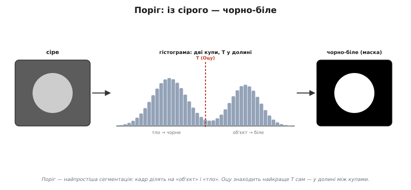
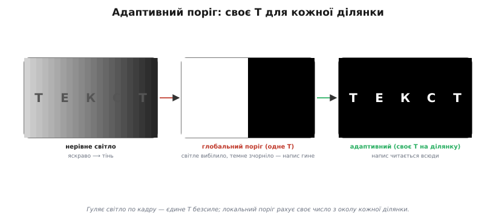
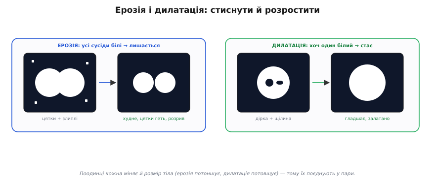
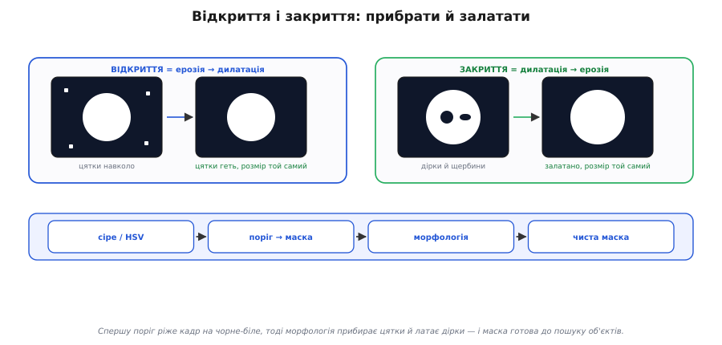

# Пороги й морфологія

<preknowlist>
- [Зображення як дані](topic:algorithms/image-as-data) — кадр як мапа яскравостей (сіра або кольорова, зокрема HSV): кожен піксель — число.
- [Гістограма](topic:algorithms/histogram) — розподіл яскравостей кадру: скільки пікселів припадає на кожен тон.
</preknowlist>

Маючи [сіру чи кольорову мапу яскравостей](topic:algorithms/image-as-data), для багатьох задач потрібне простіше й рішучіше, ніж [пошук меж](topic:algorithms/edge-detection): розрізати кадр навпіл — на **«об'єкт»** і **«тло»**. Отримати чорно-білу **маску**, де біле — це наша ціль (м'яч, мітка, лінія, посадковий майданчик), а чорне — усе решта. Це робить **поріг**. А тоді **морфологія** прибирає за ним безлад.

### Поріг: із сірого — чорно-біле

**Поріг** (англ. *threshold* — поріг дому, межа, яку треба переступити) — найпростіша сегментація: вибираємо число **T**, і кожен піксель, яскравіший за T, робимо **білим** (об'єкт), а темніший — **чорним** (тло). З мапи яскравостей виходить **бінарна маска**: лише 0 і 1.


*Якщо об'єкт і тло різняться яскравістю, на гістограмі видно дві купи — темну (тло) і світлу (об'єкт). Поставивши поріг T у долину між ними, ділимо кадр: усе світліше за T → біле, темніше → чорне. Метод Оцу знаходить це найкраще T автоматично — там, де дві купи розділяються найчистіше.*

Звідки взяти T? Якщо об'єкт і тло помітно різняться яскравістю, на [**гістограмі**](topic:algorithms/histogram) буде дві «купи», і найкраще T лежить у **долині** між ними. Шукати її вручну — морока, тож беруть **[метод Оцу](topic:algorithms/threshold-morphology)**: він перебирає всі можливі пороги й вибирає той, що найчистіше **розділяє** дві купи. «Найчистіше» тут означає: між двома половинами яскравість розходиться якнайдужче, а всередині кожної — тримається купи. Один рядок коду — і поріг підібрано сам. (Метод 1979 року дав японський інженер **Нобуюкі Оцу**; відтоді це найходовіший спосіб автоматично знайти поріг.) Чому «розійтися між половинами» і «триматися купи всередині» — це насправді **одне й те саме** число, і як його порахувати за один прохід гістограми, розписано в [повному виведенні критерію Оцу](topic:algorithms/threshold-morphology/math-otsu-derivation.md). Так само порогом ловлять **колір**: переводимо кадр у [HSV](topic:algorithms/image-as-data) і лишаємо білими лише пікселі з потрібним тоном.

### Коли один поріг не годиться: адаптивний поріг

Один поріг на весь кадр (**глобальний**) має ахіллесову п'яту — **нерівне світло**. Якщо один край кадру яскравий, а інший у тіні, жодне єдине T не підійде всюди.


*Кадр із нерівним світлом (яскраво ліворуч, тінь праворуч). Глобальний поріг (одне T на все): світлий бік стає суцільно білим, темний — суцільно чорним, напис гине і там, і там. Адаптивний (локальний) рахує своє T для кожної ділянки з її ж околу, тож і в тіні, і на світлі поділ виходить правильний.*

Рятунок — **[адаптивний (локальний) поріг](topic:algorithms/threshold-morphology)**: для кожної ділянки кадру рахуємо **своє** T, виходячи з яскравості її **околу**. Там, де темно, поріг сам опускається; де яскраво — підіймається. Так тіні, віньєтка чи нерівне підсвічування більше не збивають поділ. Це трохи дорожче (для кожного пікселя — окіл), та незамінне в реальному світлі. Запам'ятай: **глобальний поріг крихкий**; щойно світло гуляє по кадру — бери адаптивний (або спершу [вирівняй кадр](topic:algorithms/histogram)).

### Ерозія і дилатація: стиснути й розростити

Свіжа маска майже завжди **брудна**: по ній розсипані дрібні білі цятки (шум), у тілах об'єктів зяють дірки, краї рвані, а дві цілі злиплися в одну. Чистити це — робота **морфології**. Вона теж ковзає по зображенню малою формою — **структурним елементом** (наприклад, 3×3), — але працює з бінарною маскою. Два її атоми:


*Ерозія: піксель лишається білим, лише якщо всі його сусіди (під структурним елементом) білі — тож біле «худне», дрібні цятки зникають, тонкі перемички рвуться, злиплі тіла роз'єднуються. Дилатація: піксель стає білим, якщо білий хоч один сусід — тож біле «гладшає», дірки й щілини затягуються, близькі тіла зливаються.*

**Ерозія** (від лат. *erodere* — роз'їдати, *e-* + *rodere* «гризти») «з'їдає» край білого: піксель лишається білим, тільки якщо **всі** сусіди під елементом теж білі. Тож біле стискається — дрібні цятки **зникають** зовсім, тонкі перемички рвуться, а злиплі об'єкти роз'єднуються. **Дилатація** (від лат. *dilatare* — розширювати) — навпаки, «нарощує»: піксель стає білим, якщо білий **хоч один** сусід. Біле розростається — дірки й щілини **затягуються**, близькі шматки зливаються. Поодинці вони змінюють і **розмір** тіла (ерозія все потоншує, дилатація потовщує) — а це не завжди бажано. Тому їх **поєднують**.

### Відкриття і закриття: прибрати й залатати

Хитрість у тім, що ерозія й дилатація — **взаємно зворотні** за напрямом, тож роблячи їх **по черзі**, можна прибрати дрібне, **не змінивши** розміру головного тіла.


*Відкриття (ерозія → дилатація): ерозія знищує дрібні цятки, а наступна дилатація повертає головному тілу його розмір — цятки геть, об'єкт цілий. Закриття (дилатація → ерозія): дилатація затягує дірки й щербини, а ерозія повертає розмір — дірки залатано, об'єкт цілий. Унизу — типовий конвеєр: сіре/HSV → поріг → морфологія → чиста маска, готова до пошуку об'єктів.*

**Відкриття** (англ. *opening* — розкриття: воно «розмикає» тонкі перемички й відділяє дрібне) = ерозія, **потім** дилатація: ерозія стирає дрібні цятки, а дилатація повертає головному тілу втрачений розмір. Результат — **прибрані шуми** без усихання об'єкта. **Закриття** (англ. *closing* — змикання: воно «стуляє» дірки й щілини) = дилатація, **потім** ерозія: дилатація затягує дірки й щілини, ерозія повертає розмір. Результат — **залатані діри** без розбухання. Це і є робочий тандем чистки маски: відкриттям — геть цятки, закриттям — заповнити проломи. Після нього маска стає **чистою**: суцільні тіла, рівні краї, без сміття — саме те, на чому легко [знайти й **порахувати** об'єкти](topic:algorithms/object-detection).

### Як це виглядає в коді

Уся ця механіка лягає в кілька рядків прошивки. Маємо сірий кадр `gray[]` (по байту на піксель) і робимо два кроки: спершу **бінаризуємо** за порогом, тоді **відкриттям** прибираємо поодинокі білі цятки.

Бінаризація — буквально один прохід: кожен піксель порівняли з T і записали 0 або 255.

**Умова: кадр 1 піксель, яскравість 200, поріг T = 128. Бінаризуємо.**
:::tabs
```c
// gray[i] = 200, T = 128
uint8_t out = (gray[i] > T) ? 255 : 0;
// 200 > 128  →  out = 255  (білий: це об'єкт)
```
```python
# gray[i] = 200, T = 128
out = 255 if gray[i] > T else 0
# 200 > 128  →  out = 255  (білий: це об'єкт)
```
:::

Морфологія так само проста: один піксель дивиться на свій окіл 3×3. Для ерозії беремо **мінімум** по вікну (білим лишається тільки той, у кого всі сусіди білі), для дилатації — **максимум** (білим стає той, у кого білий хоч один сусід). На бінарній масці мінімум — це логічне «І», максимум — «АБО»:

:::tabs
```c
// erode: out[y][x] = 255, лише якщо ВЕСЬ окіл 3×3 білий (інакше 0)
uint8_t mn = 255;
for (int dy = -1; dy <= 1; ++dy)
    for (int dx = -1; dx <= 1; ++dx)
        if (mask[y+dy][x+dx] < mn) mn = mask[y+dy][x+dx];
ero[y][x] = mn;

// dilate: out[y][x] = 255, якщо в околі 3×3 є хоч один білий
uint8_t mx = 0;
for (int dy = -1; dy <= 1; ++dy)
    for (int dx = -1; dx <= 1; ++dx)
        if (ero[y+dy][x+dx] > mx) mx = ero[y+dy][x+dx];
out[y][x] = mx;   // відкриття = erode, потім dilate
```
```python
# erode: out[y][x] = 255, лише якщо ВЕСЬ окіл 3×3 білий (інакше 0)
mn = 255
for dy in (-1, 0, 1):
    for dx in (-1, 0, 1):
        if mask[y+dy][x+dx] < mn:
            mn = mask[y+dy][x+dx]
ero[y][x] = mn

# dilate: out[y][x] = 255, якщо в околі 3×3 є хоч один білий
mx = 0
for dy in (-1, 0, 1):
    for dx in (-1, 0, 1):
        if ero[y+dy][x+dx] > mx:
            mx = ero[y+dy][x+dx]
out[y][x] = mx   # відкриття = erode, потім dilate
```
:::

**Умова: маска 5×5, у центрі тіло 3×3, а в кутку — самотня біла цятка. Відкриваємо (1 — біле, `.` — чорне).**
```
вхід            після ерозії     після дилатації (відкриття)
. . . . 1       . . . . .         . . . . .
. 1 1 1 .       . . . . .         . 1 1 1 .
. 1 1 1 .   →   . . 1 . .    →    . 1 1 1 .
. 1 1 1 .       . . . . .         . 1 1 1 .
. . . . .       . . . . .         . . . . .
```
Ерозія стерла **все**: і цятку (у неї сусіди чорні), і край тіла — від тіла лишилося єдине ядро. Дилатація розрослася назад від цього ядра й **відновила тіло 3×3**, а цятці відновлюватися вже нема з чого. Отже, **цятка зникла, тіло ціле** — рівно те, по що ми бралися за відкриття.

Як це збирається в **цілий конвеєр** на контролері камери — від сірого кадру через адаптивний поріг, відкриття й закриття до лічби білих пікселів маски, з чесною обробкою країв і без жодного `malloc` — показано в [повному робочому прикладі на C](topic:algorithms/threshold-morphology/proj-threshold-morphology-pipeline.md). Кожен крок тут — копійчана бінарна дія (порівняння й мінімум чи максимум по вікну 3×3), тож навіть скромний мікроконтролер камери встигає чистити маску кадр за кадром, у реальному часі.

> 📜 **Морфологія, народжена з каменю: Матерон і Серра, 1964.** Ерозія, дилатація, відкриття, закриття — сьогодні вони чистять маски в кожній програмі зору. А винайшли їх, щоб роздивлятися… **руду**. 1964 року у Паризькій гірничій школі молодий інженер **Жан Серра** писав дисертацію під орудою математика **Жоржа Матерона**: за тонкими шліфами (зрізами) залізної руди Лотарингії треба було **виміряти** геометрію зерен мінералу — щоб передбачити її подрібнюваність, тобто наскільки легко ту руду буде змолоти на млині перед збагаченням. Серра придумав «прикладати» до зображення зрізу маленькі пробні форми — **структурні елементи** — і так міряти й перетворювати фігури; із цього виріс навіть окремий прилад — «аналізатор текстур» (*Texture Analyser*), що робив ці виміри автоматично. Матерон узагальнив ці дії в **ерозію** й **дилатацію**, а з них — **відкриття** й **закриття**. А назву всьому цьому Матерон, Серра й **Філіпп Формері** вигадали взимку 1966-го **в пивничці міста Нансі** — «математична морфологія»; 1968-го Матерон заснував у **Фонтенбло** цілий її центр. Тож коли твій дрон чистить маску посадкового знака — ерозією геть шум, закриттям залатати дірку, — він застосовує математику, придуману, щоб міряти зерна заліза під мікроскопом.
