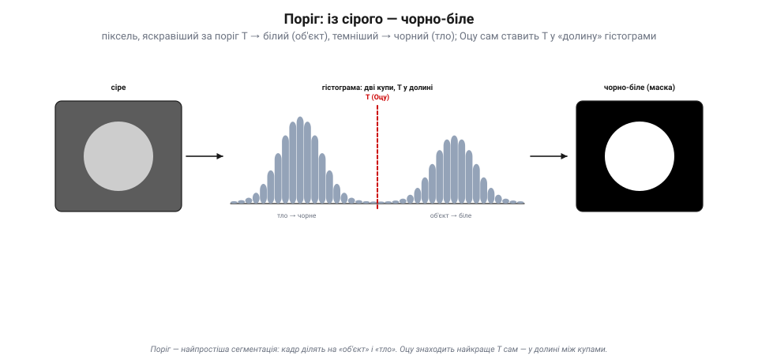
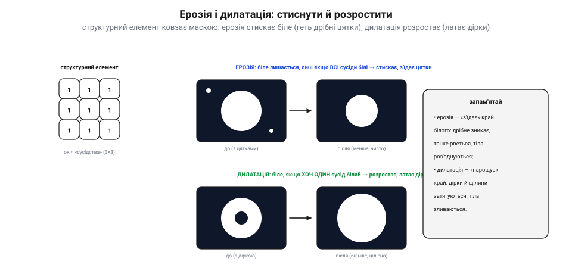

# Пороги й морфологія

Маючи [сіру чи кольорову мапу яскравостей](book:algorithms/image-as-data), для багатьох задач потрібне простіше й рішучіше, ніж [пошук меж](book:algorithms/edge-detection): розрізати кадр навпіл — на **«об'єкт»** і **«тло»**. Отримати чорно-білу **маску**, де біле — це наша ціль (м'яч, мітка, лінія, посадковий майданчик), а чорне — усе решта. Це робить **поріг**. А тоді **морфологія** прибирає за ним безлад.

### Поріг: із сірого — чорно-біле

**Поріг** (*threshold*) — найпростіша сегментація: вибираємо число **T**, і кожен піксель, яскравіший за T, робимо **білим** (об'єкт), а темніший — **чорним** (тло). З мапи яскравостей виходить **бінарна маска**: лише 0 і 1.

*Рис. Поріг. Якщо об'єкт і тло різняться яскравістю, на гістограмі видно **дві купи** — темну (тло) і світлу (об'єкт). Поставивши поріг **T** у **долину** між ними, ділимо кадр: усе світліше за T → біле, темніше → чорне. Метод **Оцу** знаходить це найкраще T **автоматично** — там, де дві купи розділяються найчистіше.*

Звідки взяти T? Якщо об'єкт і тло помітно різняться яскравістю, на [**гістограмі**](book:algorithms/histogram) буде дві «купи», і найкраще T лежить у **долині** між ними. Шукати її вручну — морока, тож беруть **метод Оцу**: він перебирає всі можливі пороги й вибирає той, що найчистіше **розділяє** дві купи (формально — найдужче розводить їхні середні). Один рядок коду — і поріг підібрано сам. (Так само порогом ловлять **колір**: переводимо кадр у [HSV](book:algorithms/image-as-data) і лишаємо білими лише пікселі з потрібним тоном.)

### Коли один поріг не годиться: адаптивний поріг

Один поріг на весь кадр (**глобальний**) має ахіллесову п'яту — **нерівне світло**. Якщо один край кадру яскравий, а інший у тіні, жодне єдине T не підійде всюди.

*Рис. Адаптивний поріг. Кадр із нерівним світлом (яскраво ліворуч, тінь праворуч). **Глобальний** поріг (одне T на все): світлий бік стає суцільно білим, темний — суцільно чорним, напис гине і там, і там. **Адаптивний** (локальний) рахує своє T для **кожної ділянки** з її ж околу, тож і в тіні, і на світлі поділ виходить правильний.*

Рятунок — **адаптивний** (локальний) поріг: для кожної ділянки кадру рахуємо **своє** T, виходячи з яскравості її **околу**. Там, де темно, поріг сам опускається; де яскраво — підіймається. Так тіні, віньєтка чи нерівне підсвічування більше не збивають поділ. Це трохи дорожче (для кожного пікселя — окіл), та незамінне в реальному світлі. Запам'ятай: **глобальний поріг крихкий**; щойно світло гуляє по кадру — бери адаптивний (або спершу [вирівняй кадр](book:algorithms/histogram)).

### Ерозія і дилатація: стиснути й розростити

Свіжа маска майже завжди **брудна**: по ній розсипані дрібні білі цятки (шум), у тілах об'єктів зяють дірки, краї рвані, а дві цілі злиплися в одну. Чистити це — робота **морфології**. Вона теж ковзає по зображенню малою формою — **структурним елементом** (наприклад, 3×3), — але працює з бінарною маскою. Два її атоми:

*Рис. Ерозія і дилатація. **Ерозія**: піксель лишається білим, лише якщо **всі** його сусіди (під структурним елементом) білі — тож біле «худне», дрібні цятки зникають, тонкі перемички рвуться, злиплі тіла роз'єднуються. **Дилатація**: піксель стає білим, якщо білий **хоч один** сусід — тож біле «гладшає», дірки й щілини затягуються, близькі тіла зливаються.*

**Ерозія** (*erosion*) «з'їдає» край білого: піксель лишається білим, тільки якщо **всі** сусіди під елементом теж білі. Тож біле стискається — дрібні цятки **зникають** зовсім, тонкі перемички рвуться, а злиплі об'єкти роз'єднуються. **Дилатація** (*dilation*) — навпаки, «нарощує»: піксель стає білим, якщо білий **хоч один** сусід. Біле розростається — дірки й щілини **затягуються**, близькі шматки зливаються. Поодинці вони змінюють і **розмір** тіла (ерозія все потоншує, дилатація потовщує) — а це не завжди бажано. Тому їх **поєднують**.

### Відкриття і закриття: прибрати й залатати

Хитрість у тім, що ерозія й дилатація — **взаємно зворотні** за напрямом, тож роблячи їх **по черзі**, можна прибрати дрібне, **не змінивши** розміру головного тіла.

*Рис. Відкриття і закриття. **Відкриття** (ерозія → дилатація): ерозія знищує дрібні цятки, а наступна дилатація повертає головному тілу його розмір — цятки геть, об'єкт цілий. **Закриття** (дилатація → ерозія): дилатація затягує дірки й щербини, а ерозія повертає розмір — дірки залатано, об'єкт цілий. Унизу — типовий конвеєр: сіре/HSV → поріг → морфологія → чиста маска, готова до пошуку об'єктів.*

**Відкриття** (*opening*) = ерозія, **потім** дилатація: ерозія стирає дрібні цятки, а дилатація повертає головному тілу втрачений розмір. Результат — **прибрані шуми** без усихання об'єкта. **Закриття** (*closing*) = дилатація, **потім** ерозія: дилатація затягує дірки й щілини, ерозія повертає розмір. Результат — **залатані діри** без розбухання. Це і є робочий тандем чистки маски: відкриттям — геть цятки, закриттям — заповнити проломи. Після нього маска стає **чистою**: суцільні тіла, рівні краї, без сміття — саме те, на чому легко [знайти й **порахувати** об'єкти](book:algorithms/object-detection).

> 📜 **Морфологія, народжена з каменю: Матерон і Серра у Фонтенбло (1964).** Ерозія, дилатація, відкриття, закриття — сьогодні вони чистять маски в кожній програмі зору. А винайшли їх, щоб роздивлятися… **руду**. 1964 року у Паризькій гірничій школі молодий інженер **Жан Серра** писав дисертацію під орудою математика **Жоржа Матерона**: треба було за тонкими шліфами (зрізами) залізної руди Лотарингії **виміряти** геометрію зерен мінералу — щоб передбачити, як та руда видобуватиметься. Серра придумав «прикладати» до зображення зрізу маленькі пробні форми — **структурні елементи** — і так міряти й перетворювати фігури; із цього вийшов навіть прилад, «Texture Analyser» (патент 1965). Матерон узагальнив ці дії в **ерозію** й **дилатацію**, а з них — **відкриття** й **закриття**. А назву всьому цьому троє дослідників вигадали взимку 1966-го **в пивничці міста Нансі** — «математична морфологія»; 1968-го Матерон заснував у **Фонтенбло** цілий її центр. Тож коли твій дрон чистить маску посадкового знака — ерозією геть шум, закриттям залатати дірку, — він застосовує математику, придуману, щоб рахувати зерна заліза під мікроскопом.

> 🔧 **Навіщо це.** Щоб виділити ціль, **порогуй**: за яскравістю (Оцу сам підбере T) або за [кольором у HSV](book:algorithms/image-as-data) (лиши потрібний тон). При **нерівному світлі** не довіряй одному T — бери **адаптивний** поріг або спершу [вирівняй кадр](book:algorithms/histogram). Сиру маску завжди **чисти морфологією**: **відкриттям** — геть дрібні цятки, **закриттям** — залатати дірки, **ерозією** — роз'єднати злиплі тіла, **дилатацією** — з'єднати розірване. Усе це — копійчані бінарні дії, які тягне навіть мікроконтролер. Аж тоді на чистій масці [шукай об'єкти](book:algorithms/object-detection).

### Підсумок теми

**Поріг** ріже сіру (чи кольорову) мапу на бінарну **маску** «об'єкт / тло»: T у долині гістограми, причому **Оцу** підбирає його сам, а під **нерівне світло** беруть **адаптивний** (локальний) поріг. Сира маска брудна, тож її чистять **морфологією** структурним елементом: **ерозія** стискає біле (геть цятки, роз'єднати), **дилатація** розростає (залатати, з'єднати), а їхні пари — **відкриття** (прибрати цятки, зберігши розмір) і **закриття** (залатати дірки, зберігши розмір) — доводять маску до чистоти. І все це — спадок Матерона й Серра, що 1964-го міряли морфологією залізну руду. Маска чиста; нарешті можна [знайти на ній **самі об'єкти**](book:algorithms/object-detection) — за кольором, формою чи шаблоном, аж до прямих ліній перетворенням Хафа.
