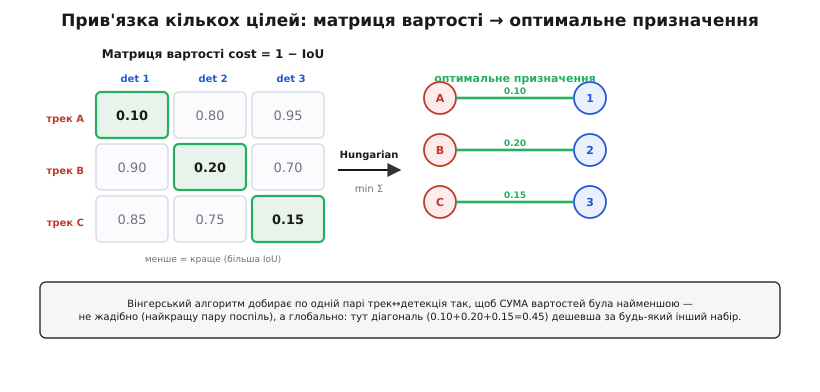

# Трекінг: стан, прив'язка, метрики

Базовий трекінг легко вкласти в одне речення: не шукай ціль наново щокадру, а **веди** вже знайдену, тримаючи її «особистість» тією самою. Та щойно цілей стає більше однієї, щойно вони ховаються за стовпами й перетинають шляхи одна одній, це речення розпадається на десяток гострих питань. Якими саме числами описати ціль, щоб уміти її **передбачати**? Звідки взяти ковариації фільтра, а не списати з неба? Як із N треків і M детекцій скласти правильні пари, не переплутавши номери? Коли відкривати новий трек, а коли визнати старий мертвим? І, нарешті, як **виміряти**, що трекер працює добре, а не просто гарно виглядає на одному ролику?

Тут ми проходимо ці питання від першопричини. Не «ось формула фільтра Калмана», а **звідки** в ній саме такі матриці для бокс-трекера; не «беремо вінгерський алгоритм», а **чому** жадібна прив'язка ламається й що замість неї; не «SORT хороший», а з **яких** трьох деталей він складений і що рівно одне додає DeepSORT. У кінці — три метрики, якими галузь міряє трекери, з обчисленням руками на крихітному прикладі.

## Формальний стан трекера: вісім чисел на бокс

Трекер веде ціль, бо тримає не саму рамку, а її **стан** — набір чисел, з яких він уміє **передбачити** наступну рамку. Питання лише: які саме числа?

Найгрубший стан — це чотири числа самої рамки: центр (x, y) і розмір (w, h). Але з самого положення передбачити нічого не можна: де ціль буде наступного кадру, залежить не від того, **де** вона, а від того, **куди й як швидко** вона рухається. Тож до кожної координати, що змінюється з часом, додають її **швидкість**. Положення центра рухається — додаємо (vx, vy). Розмір рамки теж пливе (ціль наближається — бокс росте) — додаємо (vw, vh). Виходить **восьмивимірний** вектор стану:

```
       ⎡ x  ⎤   центр по горизонталі
       ⎢ y  ⎥   центр по вертикалі
       ⎢ w  ⎥   ширина рамки
   x = ⎢ h  ⎥   висота рамки
       ⎢ vx ⎥   швидкість центра по x
       ⎢ vy ⎥   швидкість центра по y
       ⎢ vw ⎥   швидкість зміни ширини
       ⎣ vh ⎦   швидкість зміни висоти
```

Чому саме вісім, не більше й не менше? Менше — бо без швидкостей розміру трекер не встигає за ціллю, що наближається: бокс лишається малим, поки ціль уже виросла, IoU падає, прив'язка зривається. Більше (наприклад, **прискорення**) майже ніколи не варте свічок: реальні цілі на коротких відрізках між кадрами рухаються майже рівномірно, а кожне зайве число в стані треба з чогось оцінювати, тобто воно додає шуму більше, ніж користі. Вісім — це класичний компроміс **моделі сталої швидкості** (англ. *constant velocity*, CV): припускаємо, що між сусідніми кадрами і центр, і розмір повзуть зі сталою швидкістю, а будь-яке відхилення від цього (поворот керма, гальмування) ловимо як «шум процесу», про який далі.

> 🔧 **Навіщо це.** Восьмивимірний стан — це не академічна примха, а рівно те, що дає трекеру передбачати рамку **повністю**, а не лише її центр. На дроні, що женеться за машиною, машина і їде вбік, і наближається; якби стан не містив (vw, vh), бокс прогнозу був би правильного **місця**, але неправильного **розміру**, IoU з детекцією просіла б — і трек зірвався б саме тоді, коли ціль близько й вести її найважливіше.

### Матриця переходу F: як стан робить крок у часі

Маючи стан, трекер мусить уміти посунути його на один кадр уперед — це **передбачення**. У моделі сталої швидкості правило просте й знайоме зі шкільної фізики: нове положення = старе + швидкість × час, а сама швидкість не міняється. Запишемо це для кожної координати, де Δt — час між кадрами:

```
x'  = x  + vx·Δt        vx' = vx
y'  = y  + vy·Δt        vy' = vy
w'  = w  + vw·Δt        vw' = vw
h'  = h  + vh·Δt        vh' = vh
```

Вісім рівнянь, кожне — лінійна комбінація компонент стану. А будь-яку лінійну комбінацію зручно записати **матрицею**: новий стан x' = F·x, де F (англ. *state transition matrix*, матриця переходу) кодує саме ці вісім правил. Випишемо її явно — рядок задає, з чого складається відповідна нова компонента:

```
       x  y  w  h  vx vy vw vh
     ⎡ 1  0  0  0  Δt 0  0  0 ⎤  x'  = x + vx·Δt
     ⎢ 0  1  0  0  0  Δt 0  0 ⎥  y'  = y + vy·Δt
     ⎢ 0  0  1  0  0  0  Δt 0 ⎥  w'  = w + vw·Δt
 F = ⎢ 0  0  0  1  0  0  0  Δt⎥  h'  = h + vh·Δt
     ⎢ 0  0  0  0  1  0  0  0 ⎥  vx' = vx
     ⎢ 0  0  0  0  0  1  0  0 ⎥  vy' = vy
     ⎢ 0  0  0  0  0  0  1  0 ⎥  vw' = vw
     ⎣ 0  0  0  0  0  0  0  1 ⎦  vh' = vh
```

Прочитати її легко: одиниці на головній діагоналі переносять кожну компоненту в себе («було x — лишилось x»), а чотири Δt у правому верхньому блоці домішують швидкість у положення («плюс vx·Δt»). Нижня половина — самі одиниці: швидкості переходять у себе незмінними, бо модель сталої швидкості так і каже. Помножити x на цю F — і дістаєш прогноз стану на кадр уперед, рівно ті вісім рівнянь вище, але одним множенням.

### Матриця виміру H: що з восьми чисел нам показують

Детектор бачить не стан, а лише **рамку** — чотири числа (x, y, w, h). Швидкостей він не вимірює: жоден детектор не каже «ця машина їде 12 пікселів за кадр», він каже лише «ось рамка тут». Тож вимір z — це чотиривимірний вектор, а стан — восьмивимірний, і нам потрібна матриця, що з повного стану **витягає** саме ту частину, яку видно. Це **матриця виміру** H (англ. *measurement matrix*): z = H·x.

Вона просто вибирає перші чотири компоненти й викидає чотири швидкості:

```
       x  y  w  h  vx vy vw vh
     ⎡ 1  0  0  0  0  0  0  0 ⎤  → x
 H = ⎢ 0  1  0  0  0  0  0  0 ⎥  → y
     ⎢ 0  0  1  0  0  0  0  0 ⎥  → w
     ⎣ 0  0  0  1  0  0  0  0 ⎦  → h
```

Чотири рядки, по одній одиниці кожен, точно на місці потрібної компоненти. H·x бере восьмивимірний стан і повертає чотиривимірну рамку — «як цей стан мав би виглядати очима детектора». Саме різницю між цим очікуванням H·x і реальною детекцією z фільтр і використає, щоб виправити стан. Те, що швидкостей ми **не** вимірюємо прямо, — не біда: фільтр оцінює їх **опосередковано**, із того, як змінюється положення від кадру до кадру. У цьому й сила: вісім чисел стану, з яких видно лише чотири, а решта чотири фільтр **відновлює** сам.

## Ковариації P, Q, R: звідки беруть числа

Матриці F і H — це геометрія руху, вони те саме для будь-якої камери. А от три **ковариаційні** матриці — P, Q, R — це там, де трекер торкається конкретної задачі, і де початківець найчастіше «списує з неба». Розберімо, що кожна означає й звідки беруться її числа.

**P — невпевненість у стані.** Фільтр тримає не лише оцінку стану x, а й те, **наскільки він у ній упевнений** — матрицю коваріації P (англ. *state covariance*). Діагональ P — це «розкид» по кожній компоненті: велике P[x][x] означає «я погано знаю, де ціль по горизонталі». P живе й дихає: росте на кожному сліпому кадрі (передбачив — упевненість упала) і падає на кожному вимірі (побачив ціль — підтвердив). Її не задають вручну на кожному кроці; задають лише **початкову** P при народженні треку.

**Q — шум процесу.** Модель сталої швидкості — брехня, хоч і корисна: насправді ціль і прискорюється, і повертає, і гальмує. Q (англ. *process noise*) — це чесне зізнання моделі «я не все врахувала»: вона додається до P на кожному передбаченні й каже, наскільки реальність може відхилитися від «сталої швидкості» за один кадр. Велике Q — «ціль може різко змінити рух»; мале Q — «ціль рухається майже ідеально рівномірно».

**R — шум виміру.** Детекторна рамка не ідеальна: вона дрижить на пікселі-два навіть на нерухомій цілі, бо межі об'єкта розмиті, а детектор округлює. R (англ. *measurement noise*) описує цей розкид виміру. Велике R — «детектору не дуже вір, рамка скаче»; мале R — «детектор точний, рамці можна вірити».

Уся магія фільтра — у тому, як він **зважує** прогноз і вимір за їхніми невпевненостями. І тут критичний баланс **Q проти R**:

```
Q велике (модель не вірить собі)  → фільтр більше вірить ВИМІРАМ → трек смикається за детектором
Q мале  (модель певна себе)        → фільтр більше вірить МОДЕЛІ  → трек гладкий, але млявий, відстає
R велике (вимір зашумлений)        → фільтр більше вірить МОДЕЛІ  → той самий млявий, гладкий трек
R мале  (вимір точний)             → фільтр більше вірить ВИМІРАМ → трек жвавий, але тремкий
```

Видно, що Q і R тягнуть у протилежні боки за ту саму ручку «кому вірити». Тому на практиці одне з них **фіксують** (зазвичай R — його можна **виміряти**), а друге **крутять** як налаштування гладкості.

> 🔧 **Навіщо це.** Q — це ручка «гладкість проти спритності», і вона визначає характер трекера напряму. Завелике Q — і трек відтворює кожне піксельне дрижання детектора, наведення трясеться, регулятор отримує брудний сигнал. Замале Q — і коли машина різко зверне, трек поповзе прямо ще кілька кадрів за інерцією моделі, відстане від цілі й, можливо, зірве прив'язку. Підбір Q — це не «правильне число», а вибір, який бік помилки тобі дешевший: тремтіння чи запізнення.

### Звідки беруться числа на практиці

Загальне правило одне: **R вимірюй, Q підбирай.**

R **можна виміряти** прямо. Постав детектор на нерухому ціль (плакат на стіні), зніми сотню кадрів, подивись, як гуляє рамка. Стандартне відхилення координат рамки в пікселях — це і є корінь з діагоналі R. Скажімо, рамка дрижить на ±1 піксель по центру й ±2 по розміру — отже, дисперсії приблизно 1 і 4 відповідно. Це не вгадування, це експеримент.

Q **підбирають** від динаміки цілі. Орієнтир: наскільки швидкість може змінитися за один кадр через те, чого модель не бачить (прискорення). Якщо ціль здатна за кадр додати δv пікселів швидкості, то відповідний елемент Q має порядок δv². Точну форму Q для моделі сталої швидкості виводять інтегруванням білого шуму прискорення, але на практиці беруть простіше: маленькі числа на швидкісних компонентах, ще менші — на позиційних, і **крутять** одне на спільний множник, дивлячись на трек.

P **ініціалізують** широко на швидкостях. У момент народження треку положення ми знаємо (з першої детекції), а швидкість — **ні**: об'єкт щойно з'явився, куди він рухається — невідомо. Тож початкову невпевненість по положенню беруть помірну (вір першій рамці), а по швидкості — **велику**: «гадки не маю, куди він поїде». За кілька кадрів фільтр сам стягне її, коли побачить, як ціль рухається.

Випишемо ініціалізацію всіх трьох явно — це реальний C, який кладуть у народження треку:

> 🔧 **Навіщо це.** Широка початкова P по швидкості — те, що рятує трек у перші кадри. Якби ми сказали фільтру «я впевнений, що швидкість нульова» (мала P), він би вперто не вірив першим вимірам руху й кілька кадрів тримав ціль на місці, поки вона вже поїхала. Велика початкова невпевненість каже «вір вимірам, поки сам не зрозумієш рух» — і трек швидко «чіпляється» за реальну траєкторію.

:::tabs
```c
#define NS 8     /* розмір стану */
#define NM 4     /* розмір виміру */

typedef struct {
    float x[NS];          /* стан [x y w h vx vy vw vh] */
    float P[NS][NS];      /* коваріація стану */
    float Q[NS][NS];      /* шум процесу */
    float R[NM][NM];      /* шум виміру */
    float F[NS][NS];      /* перехід */
    float H[NM][NS];      /* вимір */
} KF;

/* ініціалізація фільтра при народженні треку з першої рамки (cx,cy,w,h) */
void kf_init(KF *f, float cx, float cy, float w, float h, float dt) {
    memset(f, 0, sizeof(*f));

    /* стан: положення з детекції, швидкості — нуль (ще не знаємо) */
    f->x[0]=cx; f->x[1]=cy; f->x[2]=w; f->x[3]=h;
    /* x[4..7] вже 0 після memset */

    /* F = одинична + Δt на блоці положення←швидкість */
    for (int i = 0; i < NS; i++) f->F[i][i] = 1.0f;
    f->F[0][4] = dt; f->F[1][5] = dt; f->F[2][6] = dt; f->F[3][7] = dt;

    /* H вибирає перші 4 компоненти (рамку) */
    f->H[0][0]=1; f->H[1][1]=1; f->H[2][2]=1; f->H[3][3]=1;

    /* P: помірно по положенню, ШИРОКО по швидкості (її ще не знаємо) */
    float p_pos = 10.0f, p_vel = 1000.0f;
    f->P[0][0]=f->P[1][1]=f->P[2][2]=f->P[3][3] = p_pos;
    f->P[4][4]=f->P[5][5]=f->P[6][6]=f->P[7][7] = p_vel;

    /* Q: малий шум процесу; на швидкостях трохи більший (там «живе» прискорення) */
    float q_pos = 1.0f, q_vel = 10.0f;
    f->Q[0][0]=f->Q[1][1]=f->Q[2][2]=f->Q[3][3] = q_pos;
    f->Q[4][4]=f->Q[5][5]=f->Q[6][6]=f->Q[7][7] = q_vel;

    /* R: ВИМІРЯНО на нерухомій цілі — дрижання рамки в пікселях² */
    f->R[0][0]=f->R[1][1] = 1.0f;    /* центр ±1 px  */
    f->R[2][2]=f->R[3][3] = 4.0f;    /* розмір ±2 px */
}
```
```python
import numpy as np

NS = 8   # розмір стану
NM = 4   # розмір виміру


class KF:
    """Фільтр Калмана для бокс-трекера: стан [x y w h vx vy vw vh]."""

    def __init__(self, cx, cy, w, h, dt):
        # стан: положення з детекції, швидкості — нуль (ще не знаємо)
        self.x = np.zeros(NS)
        self.x[:4] = [cx, cy, w, h]

        # F = одинична + Δt на блоці положення←швидкість
        self.F = np.eye(NS)
        self.F[0, 4] = self.F[1, 5] = self.F[2, 6] = self.F[3, 7] = dt

        # H вибирає перші 4 компоненти (рамку)
        self.H = np.zeros((NM, NS))
        self.H[0, 0] = self.H[1, 1] = self.H[2, 2] = self.H[3, 3] = 1.0

        # P: помірно по положенню, ШИРОКО по швидкості (її ще не знаємо)
        p_pos, p_vel = 10.0, 1000.0
        self.P = np.diag([p_pos] * 4 + [p_vel] * 4)

        # Q: малий шум процесу; на швидкостях трохи більший (там «живе» прискорення)
        q_pos, q_vel = 1.0, 10.0
        self.Q = np.diag([q_pos] * 4 + [q_vel] * 4)

        # R: ВИМІРЯНО на нерухомій цілі — дрижання рамки в пікселях²
        #   центр ±1 px, розмір ±2 px
        self.R = np.diag([1.0, 1.0, 4.0, 4.0])
```
:::

Числа тут — типовий старт, не догма: p_vel завелике для повільної камери стеження, замале для шаленого дрону; q_vel крутять, дивлячись на гладкість. Але **структура** правильна завжди: P широка по швидкості, R виміряна, Q підібрана.


*Два кроки фільтра для бокс-трекера. PREDICT множить стан на F (бокс повзе за швидкістю) і додає до невпевненості P шум процесу Q — упевненість падає. UPDATE, коли є детекція z, рахує підсилення K із P, H та R і стягує оцінку до виміру, важачи прогноз і вимір за їхньою певністю. Сліпий кадр — лише predict, і P росте кадр за кадром, аж доки ціль не виринула. Повний апарат цих рівнянь і числовий приклад — у [математичній вставці про стан бокс-трекера](book:algorithms/tracking/math-kf-tracking-state.md).*

Повні рівняння predict/update з усіма матричними добутками й покроковим числовим прогоном винесено в окрему [математичну вставку про стан бокс-трекера](book:algorithms/tracking/math-kf-tracking-state.md), щоб тут не тонути в матричній алгебрі; для трекінгу важливо розуміти **роль** кожної матриці й баланс Q↔R, а не вручну перемножувати 8×8.

## Багатоцільовий трекінг: N треків, M детекцій

Усе дотепер було про **один** трек. Реальність майже завжди множинна: на перехресті десяток машин, у натовпі сотня людей. Це **багатоцільовий трекінг** (англ. *multi-object tracking*, MOT), і він додає рівно одну, але гостру нову задачу: **прив'язку** (англ. *data association*).

Уяви, що маємо N активних треків, кожен зі своїм прогнозом рамки на цей кадр, і детектор щойно дав M нових рамок. Питання: яка детекція кому належить? Трек №3 веде синю машину — котра з M свіжих рамок є та сама синя машина? Помилишся — і трек №3 «перестрибне» на сусідню червону, номери поплутаються, лічба зламається.

Наївний підхід — **жадібний**: для кожного треку візьми найближчу детекцію. Він ламається передбачувано. Хай трек A ближчий за все до детекції 1, але трек B **теж** ближчий за все до детекції 1, а його друга за близькістю — детекція 2, до якої A зовсім далеко. Жадібний віддасть детекцію 1 тому, хто спитав перший, і лишить другого ні з чим або з поганою парою. Правильна відповідь дивиться на картину **цілком**: треба добрати пари так, щоб **сумарна** якість була найкраща, навіть якщо комусь дістанеться не його найперший вибір.

### Матриця вартості: cost = 1 − IoU

Щоб «якість пари» стала числом, будують **матрицю вартості** cost[i][j] — скільки коштує призначити трек i детекції j. Вартість має бути **мала для хорошої пари** й велика для поганої. Природна міра близькості двох рамок — **IoU** (перетин до об'єднання): одиниця, коли рамки збігаються, нуль — коли не торкаються. IoU велика для хорошої пари, тож саму її як вартість брати не можна (мінімізувати треба погане). Беремо доповнення:

```
cost[i][j] = 1 − IoU( прогноз_треку_i , детекція_j )
```

Тепер вартість мала, коли рамки добре лягають одна на одну (IoU→1, cost→0), і близька до 1, коли вони далеко (IoU→0, cost→1). Матриця виходить N×M: рядок — трек, стовпець — детекція, клітинка — ціна їхньої пари.


*Прив'язка кількох цілей як задача призначення. Будуємо матрицю N×M, де клітинка — вартість 1 − IoU пари трек↔детекція (менше = краще). Вінгерський алгоритм добирає по одній клітинці в кожному рядку й стовпці так, щоб СУМА вартостей була найменшою — глобально, а не жадібно. Тут оптимум — діагональ (0.10 + 0.20 + 0.15 = 0.45); будь-який інший набір трьох пар дорожчий.*

### Вінгерський алгоритм: оптимальне призначення

Тепер задача чітка: у матриці N×M вибрати по одній клітинці в кожному рядку й кожному стовпці так, щоб **сума** вибраних була найменша. Це класична **задача про призначення** (англ. *assignment problem*), і її точний розв'язок дає **вінгерський алгоритм** (англ. *Hungarian algorithm*; названий так Гарольдом Куном 1955 року на честь угорських математиків Кеніга й Егерварі, чиї результати він поклав в основу).

Інтуїція алгоритму проста, хоч деталі технічні. Він зауважує, що **відняти константу від цілого рядка чи цілого стовпця** матриці вартості не змінює, **яке** призначення оптимальне (бо кожне призначення бере рівно одну клітинку з того рядка/стовпця, тож усі призначення дешевшають однаково). Користуючись цим, алгоритм віднімає мінімум з кожного рядка, тоді з кожного стовпця — так у кожному з'являється нуль — і шукає набір нулів, що покриває всі рядки й стовпці. Якщо не виходить — додатковими відніманнями створює нові нулі, доки повний набір не знайдеться. Цей набір нульових клітинок у вихідній матриці й є найдешевше призначення. Складність — кубічна, O(n³), що для розумної кількості цілей (десятки) — дрібниця на кадр.

Важлива практична деталь: матриця рідко квадратна (треків і детекцій різна кількість), і не кожну пару взагалі можна допускати. Дві речі це лагодять. По-перше, матрицю **доповнюють** фіктивними рядками/стовпцями з великою вартістю, щоб зробити квадратною, — зайві треки/детекції тоді «призначаються» на фікцію, тобто лишаються без пари. По-друге, ставлять **поріг**: якщо найкраща вартість пари все одно завелика (IoU нижча, скажімо, за 0.3), пару **відкидають** — краще лишити трек без детекції (а детекцію — без треку), ніж зв'язати очевидно чужих. Те, що лишилось непов'язаним, годує наступний крок — народження й смерть треків.

> 🔧 **Навіщо це.** Різниця між жадібною й оптимальною прив'язкою — це різниця між трекером, що плутає номери в щільному русі, і тим, що тримає їх. На порожній дорозі обидва однакові; на перехресті в годину пік жадібний регулярно віддає детекцію не тому треку, бо вирішує по одному, не бачачи картини. Вінгерський коштує копійки (кубічна складність від десятків цілей) і прибирає цілий клас помилок прив'язки — тому він стандарт навіть у найлегших трекерах.

## Народження й смерть треків

Прив'язка розкладає кадр на три купки: пари (трек ↔ детекція), **треки без детекції** (нічого не лягло) і **детекції без треку** (нова рамка, до якої не підійшов жоден трек). Останні дві купки й керують **життєвим циклом** треків — коли їх заводити й коли ховати.

**Народження.** Детекція без пари — кандидат на новий об'єкт: щось з'явилося в кадрі, чого ми ще не вели. Та одразу заводити повноцінний трек небезпечно: детектори дають **хибні спрацювання** (тінь, відблиск, шматок паркану на мить «став схожий» на ціль), і якби кожна самотня детекція родила трек, кадр заповнився б фантомами. Тому новий трек спершу **пробний** (англ. *tentative*): він існує, фільтр його веде, але назовні (у лічбу, у керування) його **не віддають**, доки він не доведе, що справжній, — а саме поки не набере **min_hits** збігів поспіль (типово 3). Хибне спрацювання рідко повторюється тричі на одному місці, тож поріг min_hits відсіює фантоми, а справжню ціль лише трохи затримує на старті.

**Смерть.** Трек без детекції — ще не мрець: ціль могла на кадр сховатися за стовпом, кадр міг змазатися. Фільтр кілька кадрів веде її на **чистому прогнозі** (лише predict, без update), а лічильник пропусків наростає. Та якщо пропуски тривають надто довго — **max_missed** кадрів поспіль (типово 30, тобто близько секунди при 30 к/с) — прогноз уже вигадка, і трек **убивають**. Поріг max_missed — це баланс: малий — і трек гине від кожного короткого затуляння; великий — і мертві треки довго «висять», ведучи порожнечу й плутаючись під ногами в прив'язки.

Пробний трек живе за суворішим правилом: він мусить **довести** себе раніше, ніж заслужить поблажку. Один пропуск — і пробний трек одразу вбивають, не чекаючи max_missed: він ще не довів, що справжній, тож сумнівів на його користь немає.


*Життєвий цикл треку. Детекція без пари родить ПРОБНИЙ трек — фільтр його веде, але назовні не віддає. Витримав min_hits збігів поспіль — стає ПІДТВЕРДЖЕНИМ і йде у вихід. Підтверджений веде далі, доки збіги тривають; пропустив ціль max_missed кадрів поспіль — гине. Пробний суворіший: один зрив — і його одразу вбивають, щоб шум детектора не плодив фантомних треків. Повна реалізація цього циклу — в окремій статті [Алгоритм трекінгу об'єктів SORT](book:algorithms/sort-tracking-algorithm).*

Випишемо структуру треку й кістяк оновлення — це серце будь-якого MOT-трекера:

:::tabs
```c
typedef enum { TENTATIVE, CONFIRMED, DELETED } TrackState;

typedef struct {
    int        id;            /* стійкий номер об'єкта */
    KF         kf;            /* фільтр Калмана зі станом цілі */
    TrackState state;
    int        hits;          /* скільки разів поспіль був збіг */
    int        misses;        /* скільки кадрів поспіль без детекції */
    int        age;           /* скільки кадрів живе всього */
} Track;

/* один кадр: tracks[] уже мають прогноз (predict зроблено),
   matched[i] = індекс детекції для треку i або -1 (без пари) */
void update_tracks(Track *tracks, int n, const Rect *dets, const int *matched,
                   int min_hits, int max_missed)
{
    for (int i = 0; i < n; i++) {
        Track *t = &tracks[i];
        t->age++;

        if (matched[i] >= 0) {                 /* є детекція → update фільтра */
            kf_update(&t->kf, dets[matched[i]]);
            t->hits++;
            t->misses = 0;
            if (t->state == TENTATIVE && t->hits >= min_hits)
                t->state = CONFIRMED;          /* проба витримала → підтверджено */
        } else {                                /* пари немає → ведемо наосліп */
            t->misses++;
            if (t->state == TENTATIVE)
                t->state = DELETED;            /* проба зірвалась одразу */
            else if (t->misses > max_missed)
                t->state = DELETED;            /* підтверджений жив, та зник надовго */
        }
    }
    /* (окремим проходом: викинути DELETED і завести нові TENTATIVE
        з детекцій, що лишились без пари — див. тему sort-tracking-algorithm) */
}
```
```python
from enum import Enum


class TrackState(Enum):
    TENTATIVE = 0
    CONFIRMED = 1
    DELETED = 2


class Track:
    def __init__(self, track_id, kf):
        self.id = track_id          # стійкий номер об'єкта
        self.kf = kf                # фільтр Калмана зі станом цілі
        self.state = TrackState.TENTATIVE
        self.hits = 0               # скільки разів поспіль був збіг
        self.misses = 0             # скільки кадрів поспіль без детекції
        self.age = 0                # скільки кадрів живе всього


def update_tracks(tracks, dets, matched, min_hits, max_missed):
    """Один кадр: tracks[] уже мають прогноз (predict зроблено),
    matched[i] = індекс детекції для треку i або -1 (без пари)."""
    for i, t in enumerate(tracks):
        t.age += 1

        if matched[i] >= 0:                       # є детекція → update фільтра
            t.kf.update(dets[matched[i]])
            t.hits += 1
            t.misses = 0
            if t.state is TrackState.TENTATIVE and t.hits >= min_hits:
                t.state = TrackState.CONFIRMED    # проба витримала → підтверджено
        else:                                      # пари немає → ведемо наосліп
            t.misses += 1
            if t.state is TrackState.TENTATIVE:
                t.state = TrackState.DELETED      # проба зірвалась одразу
            elif t.misses > max_missed:
                t.state = TrackState.DELETED      # підтверджений жив, та зник надовго

    # (окремим проходом: викинути DELETED і завести нові TENTATIVE
    #  з детекцій, що лишились без пари — див. тему sort-tracking-algorithm)
```
:::

Уся логіка тут — це лічильники hits і misses плюс три пороги (min_hits, max_missed, IoU-поріг прив'язки), що крутять характер трекера: швидше підтверджувати чи обережніше, довше тримати втрачені чи рішучіше ховати. Повну реалізацію з прив'язкою, народженням нових і вибиранням мертвих зібрано в окремій статті [Алгоритм трекінгу об'єктів SORT](book:algorithms/sort-tracking-algorithm).

## SORT і DeepSORT: трекінг через детекцію

Усе, що ми зібрали — фільтр Калмана на восьмивимірному боксі, матриця вартості 1 − IoU, вінгерська прив'язка, життєвий цикл треків, — це **не** опис якогось одного алгоритму. Це опис **SORT** (англ. *Simple Online and Realtime Tracking*, «простий онлайновий трекінг реального часу»; Алекс Б'юлі зі співавторами, 2016). Уся його ідея: бери готовий детектор, а тяглість між його спрацюваннями забезпеч найдешевшими класичними засобами. Сам трекер — близько **двохсот рядків**, бо весь важкий зір уже зроблено детектором, а SORT лише **зшиває** кадри в треки.

Це окрема парадигма — **трекінг через детекцію** (англ. *tracking-by-detection*): детектор працює щокадру (або зрідка), даючи рамки, а трекер тільки прив'язує їх до треків і веде через прогалини. Він **не дивиться на пікселі** взагалі — оперує самими рамками. Звідси і сила (дешево, просто, швидко), і слабкість.

Слабкість одна, але болюча: SORT прив'язує **лише за геометрією** (IoU прогнозу й детекції). Поки цілі розрізняються положенням — усе гаразд. Та коли дві однакові цілі зблизяться, їхні прогнози перекриються так, що IoU перестане казати, котра котра, — і прив'язка може віддати детекцію не тому треку. Ще гірше з **довгою оклюзією**: ціль зникла на дві секунди за вантажівкою, її трек давно вбито за max_missed, вона виринає — і SORT заводить **новий** номер, бо не пам'ятає, **як** вона виглядала. Геометрія не зберігає особистості через довгу прогалину.

**DeepSORT** (Нікçай Войке зі співавторами, 2017) лагодить рівно це й нічим більше. Він додає до картини **ознаку зовнішності** (англ. *appearance embedding*) — компактний вектор, що описує, **як ціль виглядає**, добутий маленькою нейромережею з пікселів рамки. Тепер вартість пари враховує не лише «де бокс», а й «чи схожий вигляд»:

```
SORT:      cost = 1 − IoU(прогноз, детекція)
DeepSORT:  cost = λ · (геометрія: 1 − IoU)  +  (1−λ) · (відстань між ознаками вигляду)
```

І додає **пам'ять вигляду**: для кожного треку зберігає кілька останніх ознак. Коли ціль виринає після довгої оклюзії, DeepSORT звіряє її ознаку з пам'яттю — і якщо вигляд збігається, **повертає той самий номер**, навіть якщо геометрично рамка з'явилась далеко від останнього прогнозу. Те, чого гола IoU не вміє в принципі.


*Що рівно додає DeepSORT. SORT — це Калман + матриця 1 − IoU + вінгерське призначення + життєвий цикл треків, усе на самих рамках, у двох сотнях рядків. DeepSORT лишає цей кістяк недоторканим і вкладає одне: ознаку ВИГЛЯДУ (embedding із пікселів) у вартість прив'язки і пам'ять кількох останніх виглядів кожного треку. Тому після довгої оклюзії він упізнає ціль за виглядом і повертає той самий номер — там, де гола геометрія вже безсила. Класичні корені обох — у [історії трекінгу](book:algorithms/tracking/hist-tracking-history.md).*

> 🔧 **Навіщо це.** Вибір між SORT і DeepSORT — це прямий торг «процесор проти стійкості ідентичності». SORT майже безкоштовний і чудовий, коли цілі рідкі й різні (порахувати машини на трасі). DeepSORT платить за кожну рамку прогоном ще однієї нейромережі (ознака вигляду), зате тримає номер через щільний натовп і довгі затуляння (стеження за конкретною людиною в юрбі). На кволому борті часто беруть SORT і миряться з рідкими підмінами номерів; де ідентичність критична — платять за DeepSORT.

## Оптичний потік як інструмент трекінгу

Усе дотепер вело ціль **рамками** від детектора. Та є й інший, давніший спосіб вести рух — дивитися прямо на **пікселі** й питати: куди змістилася ось ця конкретна цяточка зображення між двома кадрами? Це **оптичний потік** (англ. *optical flow*), і він стоїть осторонь трекінгу через детекцію, але часто працює пліч-о-пліч із ним — як легкий спосіб вести характерні точки між рідкими спрацюваннями детектора. Докладніше — у статті [оптичний потік](book:algorithms/optical-flow); тут виведемо його серцевину, бо без неї незрозуміло, **чому** він уміє й чого не вміє.

### Рівняння яскравості: одне рівняння, дві невідомі

Уся ідея спирається на одне припущення — **сталість яскравості** (англ. *brightness constancy*): коли точка зображення зсувається між кадрами, її **яскравість не міняється**. Та сама цяточка машини на наступному кадрі — там само яскрава, лише в іншому місці. Запишемо це. Хай I(x, y, t) — яскравість пікселя (x, y) у момент t. Точка за час dt зсунулась на (dx, dy), і її яскравість лишилась тією самою:

```
I(x + dx, y + dy, t + dt) = I(x, y, t)
```

Ліву частину розкладемо в ряд Тейлора (для малого зсуву лишаємо лише перші похідні):

```
I(x,y,t) + (∂I/∂x)·dx + (∂I/∂y)·dy + (∂I/∂t)·dt ≈ I(x,y,t)
```

I(x,y,t) скорочується з обох боків. Лишається, поділивши на dt і позначивши швидкості зсуву u = dx/dt, v = dy/dt:

```
Iₓ·u + Iᵧ·v + Iₜ = 0
```

Це **рівняння оптичного потоку**. Iₓ, Iᵧ — як швидко яскравість міняється по горизонталі й вертикалі (просторовий градієнт, його легко порахувати з кадру), Iₜ — як швидко вона міняється в часі (різниця двох кадрів). А u, v — те, що шукаємо: куди точка поїхала. І ось проблема, видна одразу: **одне рівняння, дві невідомі**. З однієї точки потік не визначити — це називають **проблемою апертури** (англ. *aperture problem*): дивлячись у крихітне вічко на рівну межу, видно лише рух **поперек** неї, а **вздовж** — ні.

### Розв'язок Лукаса–Канаде: вікно сусідів

Брюс Лукас і Такео Канаде 1981 року обійшли цю стіну простим припущенням: сусідні пікселі рухаються **однаково**. Якщо взяти не одну точку, а маленьке **вікно** навколо неї (скажімо, 5×5 = 25 пікселів) і вважати, що в усьому вікні (u, v) одне й те саме, то маємо 25 рівнянь на ті самі дві невідомі — система **перевизначена**, і її розв'язують методом найменших квадратів. У матричному вигляді:

```
⎡ ΣIₓ²    ΣIₓIᵧ ⎤ ⎡u⎤   ⎡ −ΣIₓIₜ ⎤
⎢              ⎥ ⎢ ⎥ = ⎢         ⎥
⎣ ΣIₓIᵧ   ΣIᵧ² ⎦ ⎣v⎦   ⎣ −ΣIᵧIₜ ⎦
```

де суми беруть по всіх пікселях вікна. Це система 2×2, її розв'язати — справа кількох множень. Але розв'язок існує й стійкий лише тоді, коли матриця ліворуч **оборотна** — а вона оборотна саме там, де градієнт **сильний у двох напрямках**, тобто на **кутах** і плямах, а не на рівних ділянках чи прямих краях.

### Чому ведуть кути

Ось чому оптичний потік не ведуть на чому завгодно. На **рівній** ділянці (стіна, небо) градієнт нульовий — матриця вироджена, потоку не видно взагалі. На **прямому краї** градієнт є, але лише поперек краю — матриця майже вироджена (проблема апертури в дії), рух уздовж краю невизначений. І лише на **кутах** градієнт сильний у двох напрямках — матриця добре оборотна, (u, v) визначаються надійно. Тому потік ведуть саме по характерних точках-кутах, які знаходять окремим **детектором кутів** (Харріса або Ші–Томасі — останній прямо й бере мінімальне власне число тієї самої матриці 2×2 як міру «кутистості»). Зв'язку «знайти кути → вести їх потоком» називають методом **KLT** (Канаде — Лукас — Томасі), і саме він живить класичні точкові трекери.

> 🔧 **Навіщо це.** Оптичний потік дає трекеру те, чого не дає жоден детектор рамок: **піксельно точний** рух **без** будь-якого навчання й майже задарма. Стабілізація відео на дроні, груба оцінка власного руху камери, ведення текстурованої мітки між рідкими спрацюваннями детектора — усе це KLT тягне на копійчаному залізі. Але знати його межу критично: він вірний лише для **малих** зсувів і **гладкого** руху — на швидкому об'єкті чи різкому ривку припущення про малий зсув ламається, точки «зриваються», і вести далі нема за що.

Звідси й обмеження, прямо з виведення. Розклад Тейлора чесний лише для **малого** зсуву — отже, потік працює, поки ціль між кадрами зрушилась трохи (на швидкий рух рятуються пірамідами: рахують потік на зменшеній копії кадру, де великий зсув стає малим). Сталість яскравості ламається на **зміні освітлення** (хмара набігла — уся сцена потемніла, потік «побачить» рух, якого нема). А вимога сильного двовимірного градієнта означає, що **гладкі, однотонні** цілі вести нема за що — на них просто немає кутів.

## Граничні випадки та пастки

Трекер ламається не на простому русі, а на жмені характерних ситуацій. Знати їх наперед — половина справи, бо кожна вимагає свого захисту.

**Підміна номерів (ID switch).** Найвідоміша пастка: дві цілі з **однаковим виглядом** (два однакові авто, два гравці в тій самій формі) перетинають шляхи. У точці зближення їхні прогнози перекриваються так, що IoU не каже, котра котра, — і прив'язка може віддати детекції навхрест. Після перетину номери лишаються **переставленими**: те, що було об'єктом №7, поїхало далі як №8. Геометрія тут безсила в принципі (рамки **справді** збіглися), і єдиний справжній рятунок — **ознака зовнішності** (DeepSORT): якщо вигляд цілей бодай трохи різний, embedding розрізнить їх там, де IoU здалася.


*Класична підміна номерів. Дві однакові цілі зближуються, їхні прогнози перекриваються так, що IoU не розрізняє, котра котра. Прив'язка віддає детекції навхрест, і після перетину номери лишаються переставленими (пунктир): колишній «A» їде далі як «B» і навпаки. Сама геометрія цього не вилікує — рамки **справді** збіглися; потрібна ознака зовнішності, що пам'ятає, як кожна ціль виглядає.*

**Повна оклюзія довша за max_missed.** Ціль зникла за великою перешкодою надовго. Кілька кадрів фільтр веде її на прогнозі, тоді max_missed вичерпується — і трек убито. Коли ціль виринає, її вже ведуть як **нову**, з новим номером і втраченою історією. Тут торг прямий: підняти max_missed — переживеш довші затуляння, але мертві треки довше висять і плутають прив'язку; додати Re-ID — повернеш номер за виглядом, але заплатиш обчисленнями. Чарівної межі немає, є вибір під задачу.

**«Мерехтіння» біля порога IoU.** Поріг прив'язки (типово 0.3) — це різкий обрив: трохи вище — пара приймається, трохи нижче — ні. Коли якість збігу **тремтить** біля самого порога (ціль наполовину затулена, IoU гуляє 0.28 ↔ 0.32), трек починає **мерехтіти**: кадр прив'язався, кадр ні, лічильник misses то росте, то скидається, стан смикається. Лікують це не одним порогом, а **гістерезисом** — двома: приймати пару легше (нижчий поріг), а кидати — лише коли якість впала помітно нижче. Тоді трек не дрижить на самій межі.

**Дрейф шаблону (template drift).** Стосується трекерів, що тримають **шаблон** (клапоть зображення цілі) й оновлюють його щокадру свіжим виглядом. Спокуса оновлювати зрозуміла: ціль міняє вигляд (поворот, освітлення), хочеться, щоб шаблон ішов за нею. Але кожне оновлення несе **крихту похибки** — шаблон вбирає трохи фону по краях рамки, наступного кадру шукає вже трохи зміщене, вбирає ще, — і за десятки кадрів **сповзає** з цілі на фон, ведучи стіну позаду неї. Підступність у тім, що трекер при цьому **не знає**, що загубився: збіг із (уже зіпсованим) шаблоном лишається високим. Лікують обережним оновленням (оновлювати рідко, лише за дуже певного збігу) або взагалі тримають **первісний** шаблон як якір.

Спільна риса всіх чотирьох — трекер **тихо** робить неправильне, не подаючи сигналу тривоги: номери поплуталися, а трек «упевнений»; шаблон сповз, а збіг високий. Тому надійний трекер не лише веде ціль, а й **сумнівається** в собі — стежить за якістю збігу, за зростанням невпевненості, за узгодженістю руху — і чесно каже «я загубився», щоб система встигла перезахопити ціль детектором.

## Метрики якості трекінгу

«Трекер працює добре» — порожні слова, доки немає **числа**. А зміряти трекер хитро: він може ідеально вести положення, але плутати номери; може тримати номери, але смикати рамку. Тому усталилися **три** метрики, кожна ловить свій бік.

**MOTA — точність багатоцільового трекінгу** (англ. *Multi-Object Tracking Accuracy*). Найголовніша й найсуворіша: вона рахує **всі три типи помилок** разом і ділить на кількість справжніх об'єктів за всі кадри:

```
            FN + FP + IDSW
MOTA = 1 − ───────────────
                 GT
```

де FN (*false negatives*) — скільки разів трекер **проґавив** наявну ціль, FP (*false positives*) — скільки разів **вигадав** неіснуючу, IDSW (*ID switches*) — скільки разів **переплутав** номери, а GT (*ground truth*) — скільки об'єктів було насправді (сума по всіх кадрах). MOTA = 1 — ідеал; вона може бути й **від'ємна**, якщо помилок більше, ніж об'єктів. Суворість у тім, що один промах рахується щокадру: проґавив ціль на 10 кадрів — це 10 у FN.

**MOTP — точність положення** (англ. *Multi-Object Tracking Precision*). Окремо від «скільки помилок» — питання «а наскільки **точно** лягають рамки, коли вже лягли». MOTP усереднює якість збігу (зазвичай IoU) по всіх **правильно** прив'язаних парах:

```
        Σ IoU(трек, ціль)  по всіх збігах
MOTP = ──────────────────────────────────
              кількість збігів
```

MOTP **не** карає за пропуски чи плутанину номерів — лише міряє, чи щільно сидить рамка там, де об'єкт **знайдено**. Тому висока MOTP при низькій MOTA — звична картина: трекер ставить точні рамки, але часто губить ціль або плутає номери.

**IDF1 — тяглість ідентичності** (англ. *ID F1 score*). MOTA рахує підміни щокадру, та погано відбиває **довгу** тяглість: чи вів трекер ту саму ціль **під тим самим номером** від початку до кінця, чи розрізав її на шматки. IDF1 дивиться саме на це — наскільки стабільно номер треку тримається за справжнім об'єктом упродовж усього його життя, як гармонійне середнє точності та повноти **правильно ідентифікованих** виявлень. Висока IDF1 — «номери тримаються»; низька при пристойній MOTA означає, що трекер **бачить** цілі, але постійно **перейменовує** їх — лихо для будь-якої лічби.

### Рахуємо руками на міні-прикладі

Найкраще метрики стають зрозумілі на крихітному прикладі. Хай сцена триває 5 кадрів, у кожному є рівно 2 справжні об'єкти (A і B) — отже GT = 5 × 2 = 10. Запишемо, що трекер видав покадрово, і порівняймо:

```
кадр │ справжні │ трекер видав           │ розбір
─────┼──────────┼────────────────────────┼──────────────────────────
  1  │  A   B   │  #1→A   #2→B            │ обидва вірно
  2  │  A   B   │  #1→A   #2→B            │ обидва вірно
  3  │  A   B   │  #1→A   (B проґавлено)  │ FN += 1 (B не знайдено)
  4  │  A   B   │  #1→A   #2→B            │ B знову, але... (див. нижче)
  5  │  A   B   │  #1→A   #2→B   #3→(порожнє) │ FP += 1 (#3 — фантом)
```

Порахуймо доданки MOTA:

```
FN   = 1     (кадр 3: B проґавлено)
FP   = 1     (кадр 5: трек #3 не відповідає жодному об'єкту)
IDSW = 1     (кадр 4: B повернувся, але трекер дав йому інший номер,
              ніж до пропуску — переплутана ідентичність)
GT   = 10

           FN + FP + IDSW     1 + 1 + 1      3
MOTA = 1 − ──────────────  = 1 − ─────────  = 1 − ──  = 0.70
                GT                  10           10
```

MOTA = 0.70 — сім із десяти «можливостей» трекер відпрацював чисто. Тепер MOTP. Хай у правильно прив'язаних парах IoU рамок були: кадр 1 — 0.90 і 0.85; кадр 2 — 0.88 і 0.80; кадр 3 — 0.92 (лише A); кадр 4 — 0.86 і 0.78; кадр 5 — 0.90 і 0.82 (фантом #3 у MOTP не рахується — він ні з чим не збігся). Це 9 збігів:

```
Σ IoU = 0.90+0.85 + 0.88+0.80 + 0.92 + 0.86+0.78 + 0.90+0.82 = 7.71
збігів = 9
MOTP  = 7.71 / 9 ≈ 0.857
```

MOTP ≈ 0.86 — там, де трекер **знайшов** ціль, рамка сиділа щільно. Зверни увагу на розрив: MOTP (0.86) помітно вища за MOTA (0.70). Це типовий діагноз — **рамки точні, але є пропуск, фантом і підміна номера**. MOTP про якість пропусків і плутанини мовчить; її ловить лише MOTA. А якби нас турбувала саме тяглість номерів (та підміна на кадрі 4), на неї відповіла б IDF1 — вона просіла б через те, що B провів частину життя під «чужим» номером.

> 🔧 **Навіщо це.** Три метрики розводять три різні провали, які «на око» зливаються в одне «трекер глючить». Висока MOTP, але низька MOTA — рамки точні, та багато пропусків чи фантомів (крути пороги детектора й max_missed). Пристойна MOTA, але низька IDF1 — цілі видно, та номери скачуть (треба Re-ID або краща прив'язка). Не мавши цих чисел, оптимізуєш наосліп: «покращуєш» трекер під один ролик і ламаєш під інший. Метрика — це компас, без якого тюнінг трекера перетворюється на ворожіння.

## Підсумок теми

Трекінг, коли заглянути глибше, тримається на кількох точних механізмах. Ціль описують **восьмивимірним станом** (рамка плюс її швидкості), бо саме він дає передбачити рамку **повністю**; рух кодують матрицею переходу **F** (модель сталої швидкості), а те, що з нього видно детектору, — матрицею виміру **H** (вибирає рамку, ховає швидкості). Три ковариації несуть невпевненість: **P** (у стані, живе й дихає), **Q** (шум процесу, ручка «гладкість проти спритності») і **R** (шум виміру, його **вимірюють**, а не вгадують), і весь характер трекера — у балансі Q проти R, кому вірити, моделі чи виміру.

Коли цілей багато, додається **прив'язка**: будують матрицю вартості **1 − IoU**, а **вінгерський алгоритм** добирає пари так, щоб сумарна вартість була найменша — глобально, не жадібно. Незв'язані детекції й треки керують **життєвим циклом**: детекція без пари родить **пробний** трек, **min_hits** збігів роблять його **підтвердженим**, **max_missed** пропусків — убивають. Усе це разом і є **SORT** — двісті рядків трекінгу через детекцію; **DeepSORT** додає рівно одне — **ознаку зовнішності**, що рятує ідентичність через підміни й довгі оклюзії. Осторонь стоїть **оптичний потік**: із рівняння сталості яскравості Лукас і Канаде вивели потік по **вікну сусідів**, який визначений лише на **кутах**, — піксельно точний рух задарма, але тільки для малих гладких зсувів.

Ламається трекер на жмені пасток — **підміна номерів**, довга **оклюзія**, **мерехтіння** біля порога, **дрейф шаблону** — і спільне в них те, що він робить неправильне **тихо**, не сигналячи. Тому надійний трекер сумнівається в собі. А наскільки він добрий — каже не око, а три числа: **MOTA** (усі помилки разом), **MOTP** (точність рамки) і **IDF1** (тяглість номера); і лише розвівши ці три провали, можна тюнити трекер не наосліп, а під свою справжню задачу.
