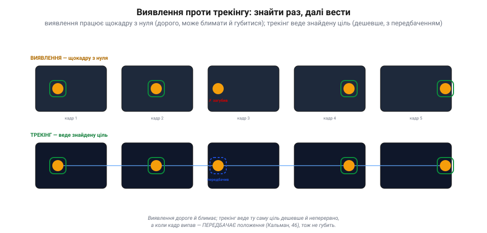
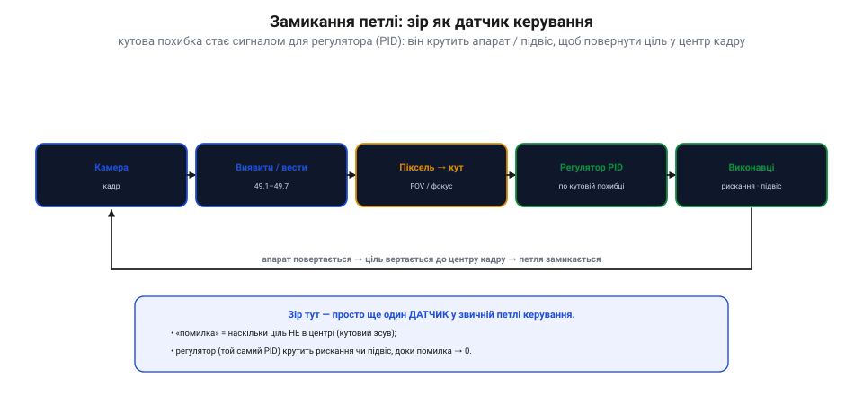

# Трекінг і «піксель → кут»: замикання зору в керування

[Знайти ціль у кадрі](book:algorithms/object-detection) — та знайти ще не означає **діяти**. Ця тема замикає коло: повести ціль крізь кадри (**трекінг**), перетворити її піксельне положення на **кут** («піксель → кут») і подати цей кут як **похибку** регуляторові, що поверне апарат чи підвіс. Зір нарешті стає **датчиком у петлі керування**.

### Виявлення проти трекінгу: знайти раз, далі вести

Детектор працює **щокадру з нуля**: дорого, а ще його рамка **блимає** й часом губиться (кадр змазався, ціль на мить сховалась). Тут і потрібен **трекінг** — він не шукає заново, а **веде** вже знайдену ціль із кадру в кадр.

*Рис. Виявлення проти трекінгу. **Виявлення** працює щокадру з нуля — дорого, і коли кадр невдалий, рамка зникає (3-й кадр). **Трекінг** веде ту саму ціль: дешевше, неперервно, з єдиною «особистістю», а коли детекція випала — **передбачає** положення (фільтр Кальмана) і не губить. На практиці часто роблять так: детектор запускають **зрідка** (він важкий), а між його спрацюваннями ціль **веде** легкий трекер.*

Трекер тримає не лише «де ціль зараз», а й її **стан** (положення + швидкість) у часі. Тому він уміє **передбачати**, куди ціль зміститься далі — і саме це рятує, коли детектор на мить осліп (ціль за перешкодою, кадр змазався). Тут у пригоді стає [фільтр Кальмана](book:algorithms/kalman-filter): він зливає зашумлені детекції з передбаченням, згладжує трек і перекидає місток через прогалини. Виходить дешево (трекер легший за детектор), неперервно й стійко.

### Піксель → кут: де ціль відносно камери

Тепер головний геометричний місток. Детектор каже: «ціль у пікселі (cx, cy)». Та апарат не керує **пікселями** — йому потрібен **кут**: на скільки градусів ціль збоку від того, куди дивиться камера. Перехід дає **поле зору** (FOV) камери.

*Рис. Піксель → кут. Детектор дає **зсув** цілі в пікселях від центру кадру. Знаючи **поле зору** камери (FOV), цей зсув переводять у **кут**: кут ≈ (зсув / півширина кадру) × (FOV / 2), а точніше — кут = atan(зсув / фокусна відстань у пікселях). Приклад: 120 px за півширини 320 px і FOV 60° → ≈ 11° ліворуч. Точне число залежить від камери, тож її **калібрують**.*

Ідея проста: піксель на самому краю кадру відповідає **краю поля зору** (півкута FOV), а піксель у центрі — куту 0. Між ними — пропорція: **кут ≈ (зсув у пікселях / півширина кадру) × (FOV / 2)**. Точніше беруть `кут = atan(зсув / фокусна_відстань_у_пікселях)`, де фокусну відстань дає **калібрування** камери ([піксель — це просто число](book:algorithms/image-as-data), але щоб зв'язати його з кутом, треба знати оптику). Так «ціль за 120 пікселів ліворуч» стає «ціль за 11° ліворуч» — а кут уже можна **виконати**: повернути апарат чи підвіс саме на стільки.

### Замикання петлі: зір як датчик керування

І ось тут зір вмикається у звичну петлю керування. **Кутова похибка** (наскільки ціль не в центрі) — це просто **сигнал помилки** для регулятора. А регулятором служить класичний [**PID**](book:algorithms/discrete-pid).

*Рис. Замикання петлі. Камера дає кадр → детектор/трекер знаходить ціль → «піксель → кут» дає **кутову похибку** → регулятор **PID** крутить **виконавці** (рискання, підвіс, тяга) → апарат повертається, і ціль вертається до центру кадру → петля замикається. Зір тут — **просто ще один датчик**: похибка = «наскільки ціль не в центрі», а PID той самий, що завжди.*

Уся петля: камера → знайти/вести ціль → перевести в кут → дістати кутову **похибку** → подати її в **PID** → той крутить **рискання** (повернути ніс), **підвіс** (повернути камеру) чи **тягу** — аж доки ціль не опиниться **в центрі** (похибка → 0). Це й зветься **візуальне керування** (*visual servoing*). Чудо в тому, що нічого нового тут нема: зір — це просто **ще один датчик**, як гіроскоп чи GPS, а навколо — звичайнісінький контур керування з тих самих модулів. Камера побачила зсув — регулятор його виправив.

### Застосунки й застереження про затримку

Так замикають десятки корисних поведінок — але з однією важливою осторогою.

*Рис. Застосунки й затримка. **Точна посадка**: кут мітки (ArUco/AprilTag) → корекція (в ArduPilot — повідомлення LANDING_TARGET). **Стеження**: тримати ціль у центрі підвісом чи рисканням. **Політ за лінією**: кут лінії (з перетворення Хафа) → рискання. **Та зір ПОВІЛЬНИЙ** (інференс нейромережі, затримка відеотракту), тож петля бачить трохи минуле — звідси ризик розгойдування. Лік: **м'які** підсилення PID, **передбачення** між кадрами (Кальман) і **запасний план**, якщо ціль зникла. На апараті зір зазвичай живе в **бортовому комп'ютері**, а кут цілі йде по **MAVLink** у політний контролер.*

Найважливіша осторога — **затримка**. Зір повільний: [інференс нейромережі](book:algorithms/nn-detectors) і [затримка відеотракту](book:algorithms/quality-bitrate) означають, що петля реагує на **трохи застаріле** положення цілі. А запізніла реакція в контурі керування — прямий шлях до розгойдування, бо вона підточує [стійкість регулятора](book:math/loop-stability). Тому: тримай **підсилення PID м'якими**, додай **передбачення** ([Кальман](book:algorithms/kalman-filter)), щоб заповнити час між кадрами, і завжди май **запасний план** на випадок, коли ціль загубилась (зависнути, розширити пошук, передати керування пілотові). У типовій схемі на дроні зір крутиться на **бортовому комп'ютері**, а готовий **кут** (чи координати) цілі він шле по **MAVLink** у політний контролер — і вже той замикає петлю на моторах.

> 📜 **Перший, хто перетворив бачене на дію: робот Shakey (SRI, 1966–1972).** Замикати зір у керування першим навчився не дрон, а кошлатий візок на колесах. У Стенфордському дослідному інституті (SRI) між 1966 і 1972 роками збудували **Shakey** — перший у світі мобільний «розумний» робот, що **бачив** і **діяв**. На ньому стояла телекамера; кадри з неї робот розкладав на [**межі**](book:algorithms/edge-detection), щоб розгледіти стіни й коробки, тоді **планував** маршрут і **їхав**, навіть штовхаючи ящики штовхачем. По суті, Shakey вперше зімкнув ланцюг «**побачив → обміркував → зробив**» — пращур нашого «піксель → кут → керування». А ще проєкт лишив техніці коштовний спадок: саме з нього вийшли алгоритм пошуку **A\*** і [**перетворення Хафа**](book:algorithms/object-detection), а серед його творців був **Річард Дуда** — той самий, чия виноска прославила Собеля, а стаття подарувала Хафу сучасний вигляд. (Прізвисько «Shakey» бідолаха дістав за те, що **трусився**, коли рушав.) Тож коли твій апарат наводиться на мітку, він повторює те, що півстоліття тому, тремтячи, робив перший зрячий робот.

> 🔧 **Навіщо це.** Не запускай важкий детектор **щокадру** — лови ціль зрідка, а між тим **веди** її легким трекером (дешевше й гладше); коли детекція випала, **передбачай** ([Кальман](book:algorithms/kalman-filter)), а не губи. Щоб діяти, переводь **піксель у кут** через FOV/фокус своєї камери — і обов'язково **калібруй** її, інакше кут брехатиме. Подавай кутову похибку у **звичайний PID**: зір — це лиш ще один датчик. Найбільше пильнуй **затримку**: зір повільний, тож тримай підсилення **м'якими**, додавай **передбачення** й завжди май **запасний план**, якщо ціль зникла. На ArduPilot віддай зір **бортовому комп'ютеру**, а кут шли в контролер по **MAVLink** (для посадки — LANDING_TARGET).

### Підсумок теми

Знайти ціль — півсправи; щоб **діяти**, її треба **вести** й **виміряти кутом**. **Трекінг** веде вже знайдену ціль крізь кадри — дешевше, неперервно й із передбаченням (Кальман), що рятує, коли детектор на мить осліп. **«Піксель → кут»** через поле зору (й калібрування) камери перетворює піксельний зсув на кутову похибку. А далі — звичне **замикання петлі**: похибку подають у **PID**, що крутить рискання чи підвіс, доки ціль не стане в центр (візуальне керування) — для точної посадки, стеження, польоту за лінією. Головна осторога — **затримка** зору: м'які підсилення, передбачення, запасний план. Так увесь шлях — від пікселя до кута — змикається в керування апаратом, як уперше зробив тремтливий Shakey 1966-го.
