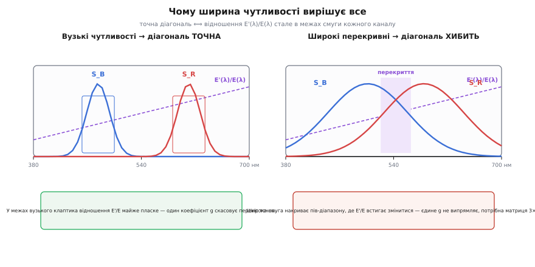
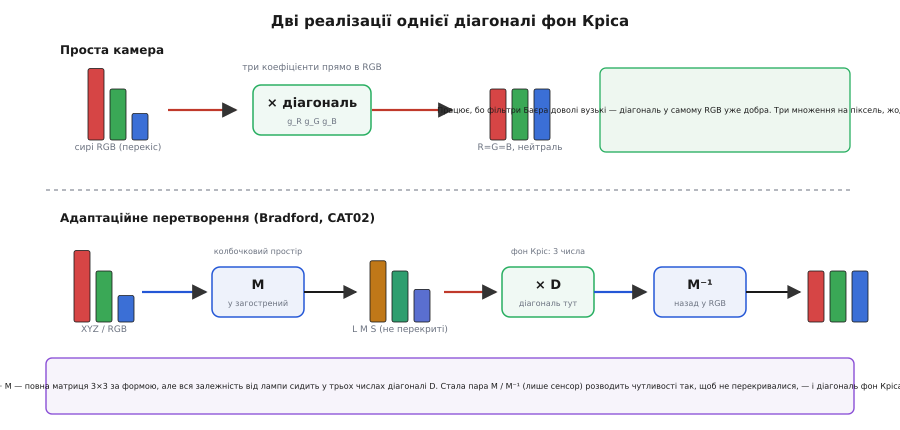

# 🧮 Діагональ фон Кріса: чому трьох коефіцієнтів досить

Баланс білого множить кожен канал на своє число — червоний на `g_R`, зелений на `g_G`, синій на `g_B` — і цього виявляється досить, щоб прибрати колір лампи з кадру. Дивно мало. Освітлення — річ спектральна: сонце, свічка й люмінесцентна трубка розкидають енергію по хвилях зовсім по-різному, це неперервні криві на всьому видимому діапазоні. А ми випрямляємо кадр **трьома числами**, без жодного змішування каналів між собою. Чому не потрібна повна матриця 3×3, що дозволяла б червоному підмішуватися в зелений? Звідки взагалі береться право звести спектральну поправку до трьох незалежних множників?

Відповідь не «бо так простіше» і не «бо приблизно годиться». За нею стоїть точний результат: **за певної умови на сенсор діагональна поправка є не наближенням, а тотожністю** — вона виправляє зміну освітлення ідеально. А коли умова порушена, видно рівно, **чого саме бракує** й що робити замість (повна матриця, а ще розумніше — перехід у спеціальний простір, де діагональ знову стає точною). Виведемо це від першопричини — від того, як фізично народжується число в пікселі.

## Означення: піксель — це інтеграл по спектру

Колір, який сенсор запише в канал, — не «скільки червоного в предметі». Це підсумок довгого фізичного ланцюга, і щоб зрозуміти корекцію, треба записати цей ланцюг чесно.

На предмет падає світло. Опишімо його **спектром освітлення** `E(λ)` — скільки енергії припадає на кожну довжину хвилі λ (грец. *lambda*), від фіолетового краю (≈380 нм) до червоного (≈700 нм). Свічка дає криву, задерту в червоному кінці; полудневе небо — рівнішу, з підйомом у синьому.

Предмет частину світла поглинає, частину відбиває. Це задає **спектр відбивності** `R(λ)` — частка (від 0 до 1), яку поверхня відбиває на кожній хвилі. Червоне яблуко має `R(λ)`, високу в довгих хвилях і низьку в коротких; нейтрально-сіра картка — майже пласку `R(λ) ≈ const` на всьому діапазоні (тому вона й «сіра»: не фарбує світло, що відбиває).

Те, що злетіло з поверхні до камери, — це добуток на кожній хвилі: `E(λ)·R(λ)`. Далі це світло потрапляє в піксель, накритий кольоровим фільтром. Фільтр разом із кремнієм має **спектральну чутливість каналу** — скільки відгуку дасть канал на одиницю світла кожної хвилі. Позначмо три криві чутливості `S_R(λ)`, `S_G(λ)`, `S_B(λ)`: «червоний» піксель чутливий переважно до довгих хвиль, «синій» — до коротких, «зелений» — до середніх.

Піксель не бачить окремих хвиль — він **збирає всю енергію разом** в одне число. Математично «зібрати внесок усіх хвиль» — це проінтегрувати добуток по всьому діапазону:

```
       ⌠ 700
R_px = ⎮      E(λ) · ρ(λ) · S_R(λ)  dλ
       ⌡ 380

       ⌠
G_px = ⎮  E(λ) · ρ(λ) · S_G(λ)  dλ
       ⌡
       ⌠
B_px = ⎮  E(λ) · ρ(λ) · S_B(λ)  dλ
       ⌡
```

де `ρ(λ)` (грец. *rho*) — та сама відбивність `R(λ)`, лише переписана буквою ρ, щоб не плутати зі значенням червоного каналу `R_px`. Ось повне, чесне означення пікселя: **потрійний інтеграл добутку освітлення, відбивності й чутливості каналу**. Усе решта в цій статті — наслідки цієї формули.

Три канали, три числа на піксель — це та сама трійка RGB, у якій живе кольорове зображення: піксель як три числа, а колірний кадр як три накладені площини. Ключове тут — що ці три числа не сирі «кількості кольору», а **інтеграли**, кожен зі своєю чутливістю. Хто вже бачив кольоровий піксель [як три канали в пам'яті](topic:algorithms/image-as-data), тут побачить, **звідки** ці канали фізично беруться.

> 🔧 **Навіщо це.** Ця формула пояснює, чому «колір предмета» в кадрі — величина відносна, а не абсолютна. Змінилося `E(λ)` (інша лампа) — і всі три інтеграли змінилися, хоча предмет `ρ(λ)` той самий. Саме тому баланс білого взагалі можливий і потрібний: він намагається **скасувати внесок `E(λ)`**, лишивши число, що залежить лише від `ρ(λ)`. А ще звідси видно межу можливого: два різні спектри `ρ(λ)` можуть дати **однакові** три інтеграли під одним світлом і **різні** — під іншим. Це метамерія (гр. *metá* + *méros* — «за межею частин»), і жоден баланс білого її не розрулить, бо інформацію про повний спектр сенсор утратив ще на етапі інтегрування — стиснув неперервну криву в три числа.

## Інтуїція: якщо канал слухає одну хвилю, інтеграл згортається в добуток

Тепер головний хід. Спитаймо: **за якої умови на сенсор зміну освітлення можна скасувати пер-канально?** Відповідь стане очевидною, якщо уявити ідеалізований, «нескінченно вузький» сенсор.

Хай кожен канал чутливий **рівно до однієї** довжини хвилі й глухий до всіх інших. Червоний слухає тільки λ_R (скажімо, 600 нм), зелений тільки λ_G (550 нм), синій тільки λ_B (450 нм). Формально це чутливість-сплеск: `S_R(λ)` дорівнює нулю всюди, крім гострого піка на λ_R. Що тоді станеться з інтегралом?

Інтеграл підсумовує внески всіх хвиль — але внесок ненульовий лише там, де чутливість ненульова, тобто **в єдиній точці** λ_R. Уся крива під інтегралом «схлопується» в одне значення підінтегрального виразу на цій хвилі:

```
R_px = E(λ_R) · ρ(λ_R)
G_px = E(λ_G) · ρ(λ_G)
B_px = E(λ_B) · ρ(λ_B)
```

Інтеграл зник — лишився **звичайний добуток трьох чисел** на канал. І тут проступає вся суть. Число в червоному каналі — це `E(λ_R)·ρ(λ_R)`: освітлення на червоній хвилі, помножене на відбивність на червоній хвилі. **Освітлення входить у канал одним-єдиним множником `E(λ_R)`** — і в жоден інший канал воно не втручається, бо зелений слухає геть іншу хвилю λ_G, куди `E(λ_R)` не дотягується.

Змінімо лампу: замість `E(λ)` стало `E'(λ)`. Червоний канал помножився на нове `E'(λ_R)` замість `E(λ_R)`, зелений — на `E'(λ_G)`, синій — на `E'(λ_B)`. Три незалежні перекоси, по одному на канал. Щоб їх **скасувати**, досить помножити кожен канал на зворотний множник:

```
g_R = E(λ_R) / E'(λ_R)      ← вертає червоний до «еталонного» світла
g_G = E(λ_G) / E'(λ_G)
g_B = E(λ_B) / E'(λ_B)
```

І це відновить `ρ(λ)`-залежну частину **точно**, без жодної похибки. Освітлення діяло на канали нарізно, тож і ліки нарізні. Ніякого змішування каналів не треба, бо його не було й у хворобі: `E(λ_R)` ніколи не потрапляв у зелений канал, тож і виправляти зелений через червоний нема потреби. **Три коефіцієнти — це не спрощення, а точна форма ліків для сенсора з вузькими чутливостями.**

Ось інтуїтивна серцевина всієї теми балансу білого: пер-канальний коефіцієнт працює тому, що ідеальний сенсор **розкладає світло на незалежні хвильові смуги**, а незалежні перекоси лікуються незалежними множниками. Реальний сенсор не ідеальний — до цього дійдемо, — але спершу вдягнімо цю інтуїцію в строгий апарат, бо саме він скаже, **наскільки** реальність відхиляється й що з цим робити.

## Формальний апарат: діагональна матриця й гіпотеза фон Кріса

Запишімо перекіс освітлення мовою лінійної алгебри — це дасть точну назву тому, що ми щойно намацали, і місток до випадку, коли пер-канальності бракує.

Складімо три числа пікселя у вектор-стовпчик `c = (R_px, G_px, B_px)`. Для сенсора з вузькими чутливостями перехід від старого світла `E` до нового `E'` — це множення кожної компоненти на свій коефіцієнт. Таке множення записують **діагональною матрицею** — квадратною таблицею, де ненульові лише три числа на головній діагоналі, а всі позадіагональні (ті, що «змішують» канали) — нулі:

```
⎡ R' ⎤   ⎡ g_R   0    0  ⎤ ⎡ R ⎤
⎢ G' ⎥ = ⎢  0   g_G   0  ⎥ ⎢ G ⎥
⎣ B' ⎦   ⎣  0    0   g_B ⎦ ⎣ B ⎦
```

Розкрий це множення рядок за рядком — і побачиш рівно `R' = g_R·R`, `G' = g_G·G`, `B' = g_B·B`. Позадіагональні нулі кажуть головне: **зелений не залежить від червоного чи синього**. Саме тому пер-канальний баланс білого — це «діагональне перетворення»: уся дія сидить на діагоналі, змішування нема.

Порівняй із **повною матрицею 3×3**, де всі дев'ять клітин можуть бути ненульові:

```
⎡ R' ⎤   ⎡ m₁₁  m₁₂  m₁₃ ⎤ ⎡ R ⎤
⎢ G' ⎥ = ⎢ m₂₁  m₂₂  m₂₃ ⎥ ⎢ G ⎥       R' = m₁₁·R + m₁₂·G + m₁₃·B
⎣ B' ⎦   ⎣ m₃₁  m₃₂  m₃₃ ⎦ ⎣ B ⎦
```

Тут новий червоний уже **мішанина** старих R, G, B. Дев'ять чисел проти трьох, дев'ять множень на піксель проти трьох, і канали переплетені. Питання теми переформулюється строго: **коли діагональ (три числа) дає той самий результат, що повна матриця (дев'ять)?** Ми вже знаємо відповідь інтуїтивно — коли чутливості вузькі. Строгий доказ цього прийде за розділ; спершу — звідки взагалі гіпотеза, що око (і камера) чинить саме діагонально.

Цю ідею першим висловив німецький фізіолог **Йоганн Адольф фон Кріс** (Johannes Adolf von Kries, 1853–1928) з університету Фрайбурга — 1902 року, задовго до будь-яких цифрових сенсорів, для **людського ока**. Він міркував так. У сітківці три типи колбочок (гр. *kōnos* — «конус»): довгохвильні L, середньохвильні M, короткохвильні S — по суті три «канали» з власними спектральними чутливостями. Око вміє пристосовуватися до освітлення: аркуш здається білим і під лампою, і в тіні. Фон Кріс припустив, що адаптація влаштована **найпростіше з можливого** — око просто **окремо підкручує підсилення кожного з трьох типів колбочок**, ніби три незалежні регулятори гучності. Це і є **закон коефіцієнтів фон Кріса** (нім. *von Kries'sche Koeffizientenregel*): адаптація = діагональне масштабування L, M, S.

Мовою відгуків колбочок його перехід між двома станами адаптації записують так само діагонально. Хай під першим світлом колбочки дали `(L₁, M₁, S₁)`, а «еталонний білий» під ним — `(L_w1, M_w1, S_w1)`; під другим світлом білий дає `(L_w2, M_w2, S_w2)`. Тоді відгук, адаптований до другого стану:

```
⎡ L₂ ⎤   ⎡ L_w2/L_w1     0          0      ⎤ ⎡ L₁ ⎤
⎢ M₂ ⎥ = ⎢    0       M_w2/M_w1     0      ⎥ ⎢ M₁ ⎥
⎣ S₂ ⎦   ⎣    0          0       S_w2/S_w1 ⎦ ⎣ S₁ ⎦
```

Кожна колбочка ділиться на «свій білий» і множиться на «білий цілі» — три незалежні відношення на діагоналі. Камера робить буквально те саме зі своїми трьома каналами: ділить кожен на виміряний білий поточної сцени (щоб той став нейтральним) — це і є коефіцієнти `g_R = 1/R_white`, `g_G = 1/G_white`, `g_B = 1/B_white` з точністю до спільного масштабу. Гіпотеза фон Кріса для ока й пер-канальний баланс білого для сенсора — **та сама діагональна модель**, лише в різних трійках чутливостей (LMS проти RGB).

> 🔧 **Навіщо це.** Практика балансу білого «по сірій картці» — це фон Кріс у чистому вигляді. Кладеш у сцену нейтральну картку, знімаєш, читаєш її `(R_white, G_white, B_white)` — це прямий вимір `E`-перекосу (бо в сірої `ρ(λ) ≈ const`, тож інтеграл дає майже чисте освітлення, профільтроване чутливостями). Ділиш кожен канал на своє — і білий стає рівним R=G=B, а решта кадру автоматично «охолоджується» разом із ним. Один рядок множень на піксель випрямляє весь кадр — і працює він не «на віру», а тому, що модель сенсора справді (майже) діагональна.

## Строгий доказ: чому саме вузькі чутливості дають точну діагональ

Інтуїція з «нескінченно вузьким» каналом переконлива, та варто побачити, чому діагональ точна не лише в ідеалі-сплеску, а й ширше — і де рівно проходить межа. Це і є зміст результату, який 1994 року строго розібрали **Грем Фінлейсон, Марк Дрю й Браян Фант** (Graham Finlayson, Mark Drew, Brian Funt) у Journal of the Optical Society of America — праці «Color constancy: generalized diagonal transforms suffice» та «Spectral sharpening». Розгорнімо суть без важкого формалізму.

Повернімося до інтеграла й спитаймо чесно: коли зміна `E → E'` рівносильна множенню кожного каналу на константу? Канал `R_px = ∫ E(λ)·ρ(λ)·S_R(λ) dλ`. Щоб після зміни світла вийшло рівно `g_R · R_px` для **будь-якої** відбивності `ρ(λ)`, потрібно, аби всередині інтеграла заміна `E` на `E'` витягалася назовні як спільний множник:

```
∫ E'(λ)·ρ(λ)·S_R(λ) dλ  =  g_R · ∫ E(λ)·ρ(λ)·S_R(λ) dλ      для всіх ρ(λ)
```

Ліва й права частини — це інтеграли ваги `ρ(λ)` з ядрами `E'·S_R` та `g_R·E·S_R`. Дві ваги дають однаковий результат на **всіх** `ρ` тоді й тільки тоді, коли ядра тотожні як функції λ:

```
E'(λ) · S_R(λ)  =  g_R · E(λ) · S_R(λ)        (усюди, де S_R(λ) ≠ 0)
```

Скоротімо `S_R(λ)` (там, де воно ненульове) — лишається умова на **саме освітлення в межах смуги каналу**:

```
E'(λ) / E(λ)  =  g_R = const        для всіх λ, де S_R(λ) ≠ 0
```

Ось і точна межа, без жодної містики. Діагональ точна, коли **відношення двох освітлень стале в межах смуги кожного каналу**. Звідси видно обидва боки:

- **Вузька чутливість** робить це майже даром: якщо `S_R(λ)` ненульова лише на клаптику λ навколо піка, то `E'(λ)/E(λ)` треба бути сталим лише на цьому клаптику — а будь-яка гладка крива на вузькому клаптику майже стала. Гранична межа (сплеск) — умова виконана точно, бо «клаптик» стягнувся в точку, де відношення просто дорівнює своєму значенню. Тому вузькі чутливості → діагональ точна.
- **Широка й перекривна чутливість** цю умову ламає: якщо `S_R(λ)` розмазана по пів-діапазону, то `E'(λ)/E(λ)` мусило б бути сталим на пів-діапазоні — а це майже ніколи не так, бо різні лампи міняють форму спектра, а не лише його рівень. Тоді жодне єдине `g_R` не задовольнить рівність на всій смузі, і пер-канальне множення дає **похибку** — тим більшу, чим ширша чутливість і чим сильніше `E'` міняє форму, а не тільки висоту.

Тепер зрозуміло, чому для типової камери діагоналі **достатньо**, хоч її чутливості й не сплески. Реальні кольорові фільтри над пікселями — та сама мозаїка червоних, зелених і синіх віконець, крізь яку сенсор і бачить колір ([масив кольорових фільтрів Баєра](topic:algorithms/bayer-demosaic)), — доволі вузькосмугові: червоний, зелений і синій сидять кожен у своїй третині видимого діапазону з помірним перекриттям. У межах кожної такої смуги відношення двох звичайних освітлень (скажімо, лампи розжарення й денного світла) міняється м'яко, тож єдиний коефіцієнт наближає його добре. Похибка є, але дрібна — а виграш величезний: три множення проти дев'яти й жодного змішування каналів. Тому пер-канальний коефіцієнт — стандарт від найдешевшого сенсора до професійної камери, і повну матрицю в баланс білого зазвичай не тягнуть.


*Чому ширина чутливості вирішує все. Умова точної діагоналі — щоб відношення нового світла до старого E'(λ)/E(λ) було сталим у межах смуги кожного каналу. Вузька чутливість (ліворуч) накриває вузький клаптик λ, де будь-яка гладка крива відношення майже пласка — один коефіцієнт скасовує перекіс точно. Широка перекривна чутливість (праворуч) захоплює пів-діапазону, де відношення встигає змінитися — єдине число вже не випрямляє смугу, лишається похибка, і потрібна повна матриця.*

## Коли діагоналі бракує: повна матриця й перехід у колбочковий простір

Отже, коли чутливості широкі й сильно перекриваються, пер-канальне множення програє. Тут і потрібна **повна матриця 3×3**: вона дозволяє новому червоному братися з суміші старих R, G, B — і цим компенсує те, що частина «червоного» світла насправді просочилась і в зелений канал через перекриття чутливостей. Дев'ять коефіцієнтів дають більше свободи, щоб наблизити істинну спектральну поправку. Але платиш і складністю, і — головне — матрицю треба **знати** для кожної пари освітлень, а вона залежить від точних кривих чутливості сенсора.

Є, однак, розумніший шлях, і саме ним ідуть серйозні системи керування кольором. Замість боротися з широкими чутливостями «в лоб» повною матрицею, зробімо так, **щоб діагональ знову стала точною** — перевівши кольори у зручніший простір. Ідея Фінлейсона й співавторів («спектральне загострення», *spectral sharpening*): візьмімо наявні три широкі чутливості й складімо з них **нові три криві як їхні лінійні комбінації** так, щоб кожна нова була якомога вужчою й гострішою — «загостреною». У цьому загостреному просторі чутливості майже не перекриваються, а отже (за доведеною вище умовою) діагональна поправка знову працює майже точно. План дії стає триступеневим:

```
1. перевести колір у «загострений», колбочкоподібний простір     c_sharp = M · c
2. застосувати там ДІАГОНАЛЬНУ поправку фон Кріса                c'_sharp = D · c_sharp
3. повернутися назад у вихідний простір                           c' = M⁻¹ · c'_sharp
```

Разом це `c' = M⁻¹ · D · M · c` — повна матриця 3×3 **за формою**, але з чіткою будовою: незмінна пара `M`/`M⁻¹` (перехід у загострений простір і назад, залежить лише від сенсора) обгортає діагональ `D`, що несе всю залежність від освітлення. Уся адаптація до конкретної лампи знову зведена до **трьох чисел** на діагоналі `D` — лише живуть вони в правильному просторі. Це найкраще з обох світів: гнучкість повної матриці там, де вона потрібна (у сталих `M`), і простота діагоналі там, де міняється сцена.

Саме так влаштовані стандартні **адаптаційні перетворення** (англ. *chromatic adaptation transform*, CAT) у колірному менеджменті. Два найвідоміші:

- **Bradford** — вивів **К. М. Лем** (K. M. Lam, докторська «Metamerism and Colour Constancy», Університет Бредфорда, 1985) на 58 фарбованих вовняних зразках. Його матриця `M` переводить CIE XYZ у «загострений» колбочкоподібний простір із **навмисно зменшеним перекриттям**. Це не фізичні криві реальних колбочок — Лем свідомо загострив їх, бо так модель точніше передбачає, який колір людина назве тим самим під різними лампами. Лінійна форма Bradford стандартизована й від 2001 року працює в системах керування кольором (напр. при переході між профілями пристроїв):

```
        ⎡  0.8951   0.2664  −0.1614 ⎤
M_Brad = ⎢ −0.7502   1.7135   0.0367 ⎥
        ⎣  0.0389  −0.0685   1.0296 ⎦
```

- **CAT02** — частина стандарту CIECAM02 (CIE, 2002), уточнена наступниця Bradford. Її матриця так само веде XYZ у загострений RGB-простір колбочкового типу (побудований на кривих колбочок Стокмана–Шарпе), де перекриття мінімальне й діагональ фон Кріса працює найкраще, ще й із поправкою на **ступінь адаптації** (людське око адаптується не на всі 100% — CAT02 це моделює множником D від 0 до 1):

```
       ⎡  0.7328   0.4296  −0.1624 ⎤
M_CAT02 = ⎢ −0.7036   1.6975   0.0061 ⎥
       ⎣  0.0030   0.0136   0.9834 ⎦
```

Обидві роблять концептуально те саме, що й найпростіший баланс білого камери, — лишень свідоміше. Найдешевша камера множить сирі RGB на три коефіцієнти прямо (припускаючи, що її фільтри достатньо вузькі, аби діагональ у самому RGB була вже добра). CAT спершу **переходить у простір, де діагональ гарантовано добра**, множить там на три числа, і повертається. Ідея фон Кріса — три незалежні підсилення — жива в обох; різниця лише в тому, у якій трійці чутливостей ці підсилення прикладати.


*Дві реалізації однієї ідеї фон Кріса. Згори: проста камера множить сирі RGB на три коефіцієнти напряму — працює, бо фільтри Баєра доволі вузькі, тож діагональ у самому RGB уже добра. Знизу: адаптаційне перетворення (Bradford, CAT02) спершу переводить колір матрицею M у «загострений» простір колбочкового типу з мінімальним перекриттям, де діагональ фон Кріса D точна, застосовує там три коефіцієнти й повертається назад M⁻¹. Разом M⁻¹·D·M — повна матриця 3×3 за формою, але вся залежність від лампи сидить у трьох числах діагоналі D.*

## Worked-приклад: наскільки бреше діагональ на широкому сенсорі

Поставмо число на місце слів. Візьмімо гранично спрощений «сенсор» із **двома** каналами й **трьома** дискретними хвилями — щоб усе рахувалося в голові, але механізм був точно той самий, що й у справжнього RGB на неперервному спектрі.

**Умова.** Хвилі λ₁, λ₂, λ₃. Два канали з чутливостями (рядок = внесок кожної хвилі в канал):

```
канал A (умовно «синій»):  S_A = (1.0,  0.5,  0.0)     ← широкий: слухає λ₁ і трохи λ₂
канал B (умовно «червоний»): S_B = (0.0,  0.5,  1.0)     ← широкий: слухає λ₃ і трохи λ₂
```

Перекриття сидить на λ₂: обидва канали її частково чують — це і є «широкі перекривні чутливості». Старе світло рівне на всіх хвилях, `E = (1, 1, 1)`. Нове світло — тепле, задерте в довгих хвилях: `E' = (0.5, 1.0, 2.0)` (мало короткохвильного λ₁, багато довгохвильного λ₃).

**Крок 1. Виміряймо білу картку `ρ = (1, 1, 1)` під обома світлами** — щоб дістати коефіцієнти діагоналі. Відгук каналу = сума по хвилях `E·ρ·S`:

```
під старим E:   A = 1·1·1.0 + 1·1·0.5 + 1·1·0.0 = 1.5
                B = 1·1·0.0 + 1·1·0.5 + 1·1·1.0 = 1.5
під новим E':   A' = 0.5·1.0 + 1.0·0.5 + 2.0·0.0 = 1.0
                B' = 0.5·0.0 + 1.0·0.5 + 2.0·1.0 = 2.5
```

Щоб під новим світлом біла картка знову дала старі (1.5, 1.5), діагональні коефіцієнти:

```
g_A = 1.5 / 1.0 = 1.5
g_B = 1.5 / 2.5 = 0.6
```

**Крок 2. Тепер перевірмо ці коефіцієнти на ІНШОМУ предметі** — не на білому, а на такому, що відбиває лише середню хвилю λ₂: `ρ = (0, 1, 0)`. Це чесний тест: коефіцієнти калібрували по білому, а працювати вони мусять на всьому.

Спершу — «свята істина», еталон: як цей предмет **мав би** виглядати під старим світлом (те, що баланс білого зобов'язаний відновити):

```
еталон (старе E):  A = 1·0·1.0 + 1·1·0.5 + 1·0·0.0 = 0.5
                   B = 1·0·0.0 + 1·1·0.5 + 1·0·1.0 = 0.5      → (0.5, 0.5)
```

Тепер знімімо той самий предмет під новим світлом і випрямімо діагоналлю:

```
під новим E':  A' = 0.5·0·1.0 + 1.0·1·0.5 + 2.0·0·0.0 = 0.5
               B' = 0.5·0·0.0 + 1.0·1·0.5 + 2.0·0·1.0 = 0.5
після діагоналі:  A'' = 1.5 · 0.5 = 0.75
                  B'' = 0.6 · 0.5 = 0.30      → (0.75, 0.30)
```

**Висновок.** Еталон — (0.5, 0.5), нейтральна рівновага каналів. Діагональ дала (0.75, 0.30) — перекошено на користь A. Похибка не крихітна: канали розійшлися там, де мали зійтися. Причина рівно та, що вивів апарат: обидва канали слухають спільну хвилю λ₂, а нове світло змінило її внесок **неоднаково відносно решти смуги** кожного каналу — умова `E'(λ)/E(λ) = const у межах смуги` порушена (відношення `E'/E` дорівнює 0.5 на λ₁, 1.0 на λ₂, 2.0 на λ₃ — геть не стале). Один коефіцієнт на канал не міг це втягнути.

**Що виправило б.** Повна матриця 2×2 (тут — 3×3 у реальному RGB) із позадіагональними членами дозволила б відняти «протікання» λ₂ між каналами й повернути точну (0.5, 0.5). Або — загострення: знайти нову пару чутливостей як комбінації `S_A, S_B`, що **не** перекриваються на λ₂; у тому просторі діагональ знову дала б еталон точно. Обидва шляхи роблять те, чого бракувало голій діагоналі, — рахуються з перекриттям. А якби чутливості від початку були вузькі (`S_A = (1,0,0)`, `S_B = (0,0,1)`, без спільної λ₂), діагональ потрапила б в еталон **точно**, і ніякої матриці не знадобилося б — рівно те, що обіцяє теорія.

## Підсумок

Піксель — це інтеграл добутку `освітлення(λ) · відбивність(λ) · чутливість каналу(λ)` по всьому видимому спектру: неперервна спектральна дійсність стискається в три числа. Якби кожен канал слухав **одну** хвилю, інтеграл згорнувся б у добуток, освітлення входило б у кожен канал **одним незалежним множником**, і зміну лампи можна було б скасувати **пер-канально** — трьома коефіцієнтами, тобто **діагональною матрицею**. Це не спрощення, а точна форма ліків для вузьких чутливостей; саме її 1902 року вгадав для трьох типів колбочок ока фон Кріс своїм законом коефіцієнтів. Строго (Фінлейсон, Дрю, Фант, 1994) діагональ точна тоді й лише тоді, коли відношення двох освітлень `E'(λ)/E(λ)` стале **в межах смуги кожного каналу** — а це майже так для вузьких фільтрів (тому дешева камера сміливо множить сирі RGB на три числа) і ламається для широких перекривних (тоді один коефіцієнт бреше, як показує розрахунок). Порятунок не обов'язково повна матриця 3×3: розумніше перевести колір у **загострений колбочкоподібний простір** (Bradford, CAT02), де чутливості штучно розведені й не перекриваються, застосувати там **ту саму діагональ фон Кріса**, і повернутися — `M⁻¹·D·M`. Уся залежність від лампи так і лишається трьома числами на діагоналі; змінюється лише простір, у якому їх прикладати. Три коефіцієнти виявляються не бідняцьким наближенням, а глибокою правдою про те, як освітлення діє на канальний сенсор, — треба тільки прикласти їх там, де сенсор справді розкладає світло на незалежні смуги.
