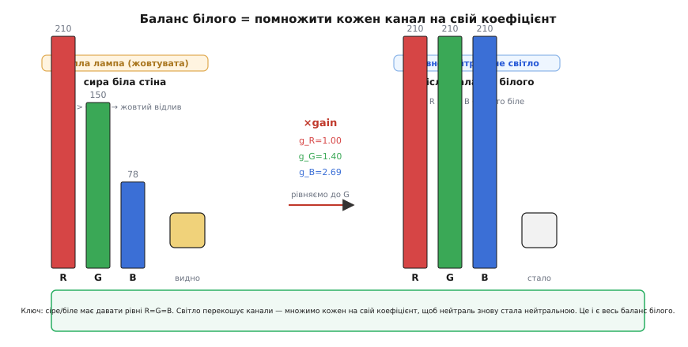
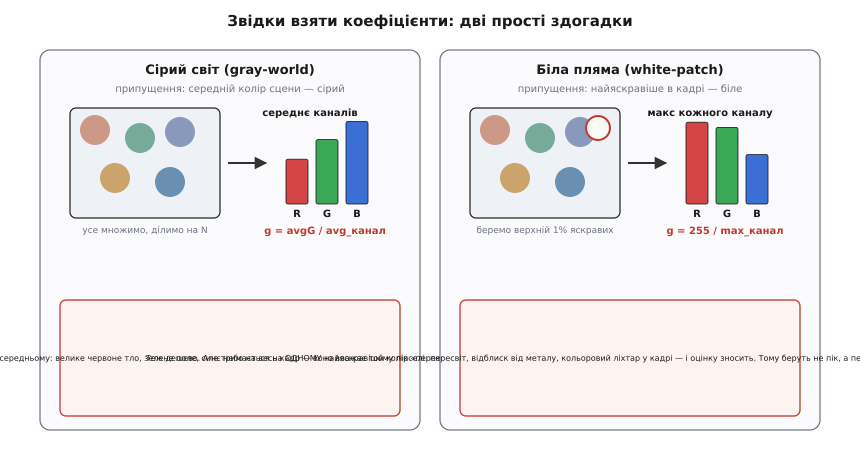
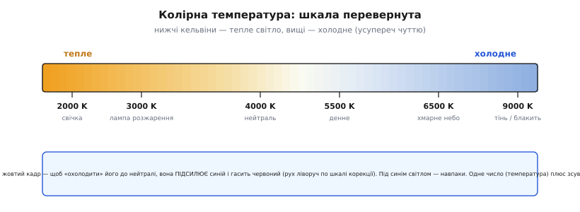

# Баланс білого

Аркуш паперу здається білим і під полуденним сонцем, і під жовтою лампою, і в синюватій тіні — хоча світло, що від нього відбивається, у цих трьох випадках **фізично різного кольору**. Око з мозком мовчки роблять поправку: вони знають, що папір білий, і «віднімають» відтінок освітлення. Камера цього не знає. Її сенсор чесно міряє те, що прилетіло, — а прилетіло під лампою жовтувате світло, тож і кадр виходить жовтуватим. **Баланс білого** — це та сама поправка, але зроблена вже в цифрі: перерахунок кольорів так, ніби сцену освітлювало нейтральне біле світло.

Назва проста й буквальна: ми **балансуємо** канали так, щоб те, що має бути **білим**, знову стало білим. У науці про сприйняття це саме явище звуть **колірною сталістю** (англ. *color constancy* — «сталість кольору»): здатність бачити колір предмета незмінним, попри зміну освітлення. Камера цю здатність не має від народження — її треба відтворити алгоритмом.

### Чому кадр «жовтіє»: світло множиться на відбивність

Щоб зрозуміти, що саме йде не так, треба згадати, звідки взагалі береться колір пікселя. Предмет сам по собі кольору не випромінює (окрім ламп та екранів) — він лише **відбиває** частину світла, що на нього падає. Скільки червоного долетить до сенсора, залежить від **двох** речей одразу: скільки червоного було **у світлі** й скільки червоного предмет **відбиває**. Те саме для зеленого й синього. Грубо, для кожного каналу:

```text
сенсор = освітлення × відбивність
R = L_R · ρ_R     G = L_G · ρ_G     B = L_B · ρ_B
```

де `L` — скільки цього кольору у світлі, `ρ` (грец. *rho*) — частка, яку предмет відбиває. Біла стіна відбиває **все порівну** (ρ_R ≈ ρ_G ≈ ρ_B), тож під **нейтральним** світлом (L_R = L_G = L_B) вона й дасть рівні R = G = B — чисто біле. Але лампа розжарення світить **тепло**: у її світлі багато червоного й мало синього. Множимо — і біла стіна дає **R > G > B**. Сенсор не збрехав; просто у виміряне число вплетено колір лампи, і стіна виходить жовтуватою.

Звідси й видно ліки. Якщо кадр перекошений тим, що `L_R`, `L_G`, `L_B` нерівні, то щоб **скасувати** перекіс, досить кожен канал помножити на свій **коефіцієнт** (англ. *gain* — «підсилення»), який вирівнює освітлення назад до нейтралі:

```text
R' = g_R · R     G' = g_G · G     B' = g_B · B
```

Підібрати `g_R, g_G, g_B` так, щоб біле знову стало білим, — це і є весь баланс білого. Уся хитрість — **звідки взяти ці три числа**, адже самого освітлення `L` ми не бачимо: сенсор дає лише добуток `L · ρ`, а розділити добуток на два множники, знаючи тільки результат, узагалі неможливо без **додаткового припущення**. Різні припущення дають різні алгоритми.


*Суть балансу білого. Тепле світло перекошує канали: біла стіна дає R210 G150 B78 замість рівних — звідси жовтий відлив. Множимо кожен канал на свій коефіцієнт (тут рівняємо до найбільшого), і R = G = B знову — біле стало білим. Уся робота — правильно оцінити ці три коефіцієнти зі самого кадру.*

> 🔧 **Навіщо це.** Без балансу білого кольорова обробка «пливе»: [пошук об'єкта за тоном](topic:algorithms/object-detection) ловить не той колір, коли перекіс освітлення зсуває всі канали; [гістограма](topic:algorithms/histogram) кольорового каналу зміщена; нейромережа-детектор бачить кадр, не схожий на ті, якими її вчили. Тому в [конвеєрі обробки RAW](topic:algorithms/raw-processing-pipeline) баланс білого ставлять **рано** — зразу після [демозаїки](topic:algorithms/bayer-demosaic), ще до тонових кривих, — щоб уся подальша логіка працювала над кольором, звільненим від відтінку лампи.

### Здогадка перша: сірий світ

Найпростіше припущення таке: **якщо змішати всі кольори сцени, вийде сірий**. Логіка за ним — статистична: у типовій сцені стільки різних барв (шкіра, зелень, небо, одяг, тіні), що в середньому вони гасять одна одну до нейтралі. Це називають **припущенням сірого світу** (англ. *gray world* — «сірий світ»). Якщо в нього повірити, то середній колір кадру **мусить** бути сірим — а якщо він насправді жовтуватий, то винне освітлення, і саме цей середній відтінок треба прибрати.

Рецепт прямий: порахуй середнє по кожному каналу, а тоді підбери коефіцієнти так, щоб три середні зрівнялися. Зазвичай рівняють до зеленого (він найближчий до яскравості й найменше шумить):

:::tabs
```c
// Сірий світ: коефіцієнти так, щоб середні R,G,B зрівнялися (рівняємо до G)
double sumR = 0, sumG = 0, sumB = 0;
for (int i = 0; i < N; i++) {         // N — кількість пікселів
    sumR += px[i].r;  sumG += px[i].g;  sumB += px[i].b;
}
double gR = sumG / sumR;              // < 1: гасимо надлишок червоного
double gB = sumG / sumB;              // > 1: підсилюємо нестачу синього
double gG = 1.0;                      // зелений лишаємо опорним
```
```python
# Сірий світ: коефіцієнти так, щоб середні R,G,B зрівнялися (рівняємо до G)
# img — масив пікселів (..., 3) з каналами R,G,B
sumR, sumG, sumB = img.reshape(-1, 3).sum(axis=0)  # суми по каналах
gR = sumG / sumR                     # < 1: гасимо надлишок червоного
gB = sumG / sumB                     # > 1: підсилюємо нестачу синього
gG = 1.0                             # зелений лишаємо опорним
```
:::

**Приклад: біла стіна під лампою розжарення.** Хай уся стіна дала в середньому R = 210, G = 150, B = 78 (жовтий перекіс з рисунка). Тоді:

```text
gR = 150 / 210 = 0.714
gB = 150 / 78  = 1.923
gG = 1.000

перевірка на середньому пікселі:
R' = 0.714 · 210 = 150
G' = 1.000 · 150 = 150
B' = 1.923 · 78  = 150      → R' = G' = B' = 150 (нейтральне сіре)
```

Перекіс зник: усі канали зійшлися до 150. Метод коштує **один прохід** по кадру й три ділення — дешевше нема куди, тож він живе в кожній камері як запасний варіант.

Але припущення легко зламати, і зламане воно бреше **впевнено**. Зніми крупним планом **зелене поле** на весь кадр — середнє сцени тепер зелене, і сірий світ вирішить, що це «зелений перекіс освітлення», та вибілить траву в сіру. Те саме з червоною цегляною стіною, синім небом на пів кадру, портретом на однотонному тлі. Метод працює рівно доти, доки сцена **справді** різнобарвна; щойно один колір домінує — він приймає предмет за світло. Тому в реальних камерах його підпирають перевірками (відкидають надто насичені ділянки, важать за кольоровим розмаїттям) — але серцевина лишається цією однорядковою здогадкою.

### Здогадка друга: найяскравіше — це біле

Інший бік тієї самої задачі: замість середнього дивимось на **пік**. Припущення таке: **найяскравіша точка кадру — це відблиск або біла поверхня**, тобто щось, що відбиває світло **повністю й порівну**. А отже, колір цієї найяскравішої точки — це прямий портрет самого освітлення (бо ρ там ≈ 1 в усіх каналах, і сенсор бачить майже чисте `L`). Знаючи колір світла, легко його скасувати. Це **припущення білої плями** (англ. *white patch* — «біла латка»), історично частина [ретинексної теорії](topic:algorithms/white-balance/hist-color-constancy.md) Едвіна Ленда.

Рецепт: знайди максимум кожного каналу й розтягни його до повної шкали (255):

:::tabs
```c
// Біла пляма: найяскравіше в кожному каналі вважаємо білим → тягнемо до 255
int maxR = 0, maxG = 0, maxB = 0;
for (int i = 0; i < N; i++) {
    if (px[i].r > maxR) maxR = px[i].r;
    if (px[i].g > maxG) maxG = px[i].g;
    if (px[i].b > maxB) maxB = px[i].b;
}
double gR = 255.0 / maxR;
double gG = 255.0 / maxG;
double gB = 255.0 / maxB;
```
```python
# Біла пляма: найяскравіше в кожному каналі вважаємо білим → тягнемо до 255
# img — масив пікселів (..., 3) з каналами R,G,B
maxR, maxG, maxB = img.reshape(-1, 3).max(axis=0)  # пік по каналах
gR = 255.0 / maxR
gG = 255.0 / maxG
gB = 255.0 / maxB
```
:::

Гарне тут те, що метод не потребує різнобарвної сцени — досить одного білого клаптя чи відблиску. Погане — що він **тримається на єдиному пікселі**, а один піксель ненадійний: гарячий піксель сенсора, лискучий метал, пересвічена лампа в кадрі — і максимум каналу задає **випадковий сміттєвий блиск**, а не біла поверхня. Тому на практиці беруть **не абсолютний максимум, а перцентиль** — скажімо, значення, вище за яке лежить верхній 1% пікселів каналу. Це відкидає поодинокі викиди й лишає стійку оцінку «дуже яскравого». Ідея та сама, лише пік замінено на «майже пік».


*Дві дешеві здогадки, звідки взяти коефіцієнти. Сірий світ припускає, що середній колір сцени сірий, і рівняє середні каналів — падає на одноколірних сценах (велике поле, небо). Біла пляма припускає, що найяскравіше — біле, і тягне пік до 255 — падає на відблисках і пересвітах, тому беруть перцентиль, а не голий максимум. Обидві задають ті самі три коефіцієнти — різниться лише спосіб їх оцінити.*

Ці дві здогадки не конкурують, а **доповнюють** одна одну: там, де сцена одноколірна, рятує біла пляма; там, де немає жодної білої поверхні, рятує сірий світ. Тому реальні автобаланси часто рахують обидві оцінки й **поєднують** їх, ще й дивлячись на насиченість та яскравість ділянок. [Робочий код обох оцінювачів разом із застосуванням коефіцієнтів і обрізанням переповнення](topic:algorithms/white-balance/proj-auto-white-balance.md) — окремим розбором.

### Чому вистачає одного коефіцієнта на канал

Може здатися дивним, що складне явище — зміну кольору освітлення — випрямляють **трьома числами**, по одному на канал, без жодної складнішої математики. Чому не потрібна повна матриця 3×3, що змішує канали між собою?

Відповідь у тому, що освітлення діє на канали **нарізно**: воно множить червоний внесок на `L_R`, зелений на `L_G`, синій на `L_B` — і **не перемішує** їх. А що зробило множення, те скасовує ділення на той самий множник, теж нарізно. Тому корекція, дзеркальна до перекосу, теж має бути **пер-канальною**: помножити кожен канал на своє. Мовою лінійної алгебри це **діагональне перетворення** — матриця, у якій ненульові лише три числа на діагоналі, тобто рівно наші `g_R, g_G, g_B`. Цю ідею першим строго сформулював фізіолог **Йоганн фон Кріс** ще 1902 року для людського ока: він припустив, що око пристосовується до освітлення, **окремо** підкручуючи чутливість кожного з трьох типів колбочок. Камера робить буквально те саме зі своїми трьома каналами — [чому діагональної поправки досить і коли її бракує, з виведенням](topic:algorithms/white-balance/math-von-kries-diagonal.md), варте окремого розбору.

Діагональна модель — наближення, і воно має межу: якщо спектральна чутливість каналів сенсора «широка» й перекривається, чистого множення бракує, і кращий результат дає повна матриця. Але для типової камери діагоналі достатньо, а виграш у простоті величезний: три множення на піксель проти дев'яти, і жодного змішування каналів. Тому пер-канальний коефіцієнт — стандарт від дешевого сенсора до професійної камери.

### Колірна температура: шкала, що дражнить інтуїцію

На практиці перекіс освітлення часто задають **не** трьома коефіцієнтами, а **одним числом** — **колірною температурою** в кельвінах (K). Це елегантний спосіб описати колір «білого» світла однією величиною, і корисно розуміти його логіку, бо саме її крутять повзунком «warm/cool» у камерах і редакторах.

Ідея фізична: якщо нагрівати ідеальне чорне тіло, воно світиться, і колір світіння залежить від температури. Тепле (низька температура) світиться **червоно-жовтим**, гарячіше — білим, найгарячіше — **блакитним**. Тож будь-яке біле світло можна порівняти з таким тілом і приписати йому температуру: свічка ≈ 2000 K, лампа розжарення ≈ 2700–3000 K, денне світло ≈ 5500 K, хмарне небо ≈ 6500 K, синя тінь ≈ 8000–9000 K.

Ось де інтуїція спотикається: **низькі** кельвіни дають **тепле** (жовте) світло, **високі** — **холодне** (синє). Здавалось би, має бути навпаки — «більше градусів = гарячіше = червоніше». Але «тепле» й «холодне» тут — назви **естетичні** (жовте як вогонь, синє як лід), а не фізичні: за фізикою синє полум'я справді гарячіше за жовте. Ім'я шкали суперечить її ж числам, і це збиває всіх, хто вперше править баланс білого руками.


*Колірна температура однією віссю. Низькі кельвіни — тепле жовте світло (свічка, лампа), високі — холодне синє (хмарне небо, тінь). Назви естетичні й перевернуті щодо фізики: синє насправді гарячіше. Камера під теплим світлом бачить жовтий кадр і, щоб повернути нейтраль, підсилює синій та гасить червоний; додатковий зсув «тінт» лагодить зелено-пурпуровий ухил (люмінесцентні лампи).*

Одного числа мало для повної поправки: температура рухає баланс по осі **синій ⇄ жовтий**, але лампи (особливо люмінесцентні) дають ще й ухил по осі **зелений ⇄ пурпуровий**. Тому поряд із температурою тримають другий повзунок — **зсув тінт** (англ. *tint* — «відтінок»). Разом ці два числа однозначно задають ті самі `g_R, g_G, g_B`: температура каже, наскільки перекошено синій проти червоного, тінт — наскільки зелений проти пурпурового, а камера переводить цю пару назад у три канальні коефіцієнти й множить кадр.

### Автоматично, вручну і «по сірій картці»

Звідки камера бере температуру в кадрі? Три шляхи, і всі живуть поряд. **Автоматичний баланс** (англ. *auto white balance*, AWB) — це і є сірий світ, біла пляма чи їхня суміш: камера сама вгадує освітлення з кадру щоразу. Швидко й без клопоту, але вгадування помиляється на складних сценах (захід сонця AWB часто «виправляє» в нудну нейтраль, убиваючи саме той теплий колір, задля якого й знімали). **Ручні пресети** — «сонце», «хмарно», «лампа», «люмінесцент» — це готові пари температура-тінт під типове освітлення: коли знаєш умови, надійніше за автовгадування. І найточніше — **баланс по еталону**: у ті самі умови кладуть завідомо нейтральну **сіру картку**, знімають, і камера бере її колір за прямий вимір освітлення (адже сіре відбиває все порівну, тож її колір у кадрі — це чистий `L`). Знаючи справжнє `L`, коефіцієнти рахуються точно, без жодних припущень про сцену — тому в студії та на відповідальній зйомці роблять саме так.

Формати `RAW` тут дають свободу: сенсор зберігає сирі числа **до** балансу білого, а самі коефіцієнти пишуть у метадані лише як позначку. Тому баланс білого в `RAW` можна **перебрати після зйомки** без утрати якості — це просто інші три множники на ті самі сирі дані. У `JPEG` баланс уже **вжитий** і вбудований у пікселі, тож виправити його потім куди важче: частину інформації (наприклад, вибілений до 255 синій під сильним теплим світлом) уже втрачено обрізанням.

### Підсумок теми

Камера міряє добуток `освітлення × відбивність`, тож колір лампи вплітається у виміряний піксель, і кадр набуває відтінку світла. **Баланс білого** скасовує цей відтінок, множачи кожен канал на свій **коефіцієнт** так, щоб нейтральне (сіре, біле) знову давало рівні R = G = B. Одного коефіцієнта на канал досить, бо освітлення діє на канали нарізно — це діагональна поправка, яку ще 1902 року для ока описав фон Кріс. Самих коефіцієнтів кадр не показує, тож їх **оцінюють** із припущень: **сірий світ** (середнє сцени сіре — падає на одноколірних кадрах) або **біла пляма** (найяскравіше біле — падає на відблисках, тому беруть перцентиль); реальні камери поєднують обидва. Для людини перекіс зручно задають **колірною температурою** — з перевернутою шкалою, де низькі кельвіни теплі, а високі холодні, — плюс зсув тінт. А найточніше освітлення міряють прямо, знявши нейтральну сіру картку. Коли колір звільнено від відтінку лампи, будь-яка подальша робота з кольором — пошук, сегментація, розпізнавання — стоїть на твердому.
