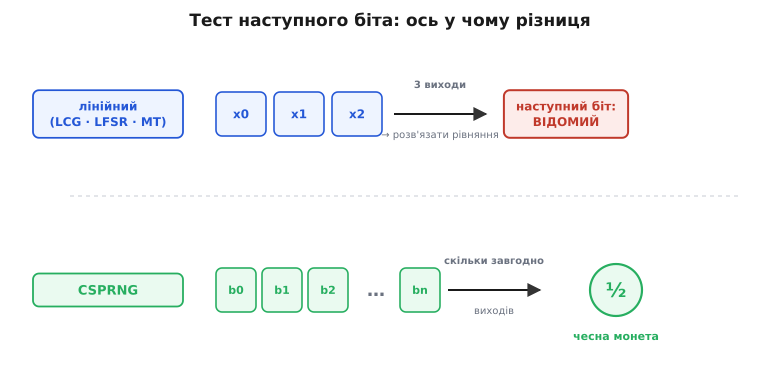
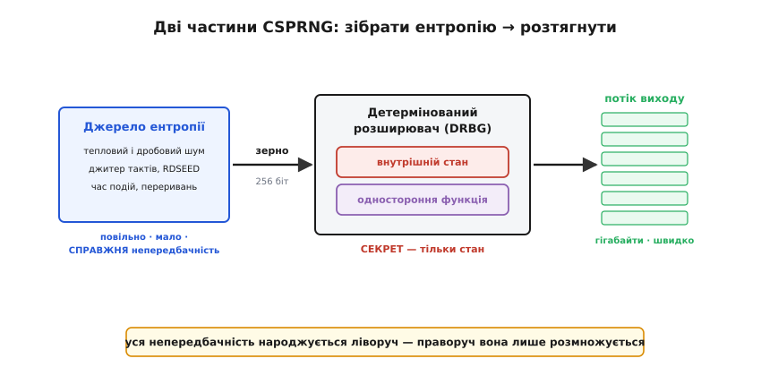
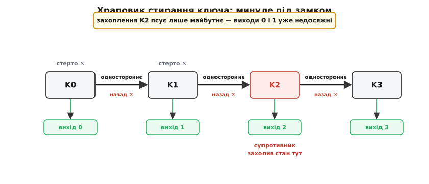
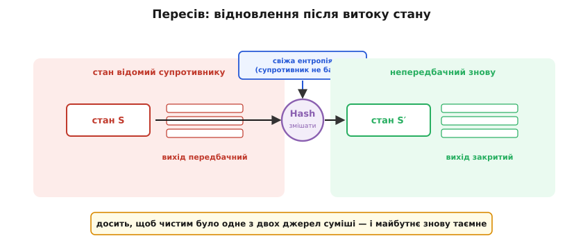

# Криптографічний генератор випадкових чисел (CSPRNG)

<preknowlist>
- [Ентропія](topic:algorithms/entropy) — міра непередбачності: скільки справжньої несподіванки (у бітах) несе джерело. Половина всієї конструкції — про те, звідки взяти достатньо ентропії.
- [Імовірність як міра непевності](topic:math/probability-basics) — «вгадати з імовірністю ½» та «мізерна перевага над ½» — це мова, якою тут формулюють саме поняття надійності.
- [XOR](topic:electronics/xor-comparison) — побітове додавання за модулем 2, само-обернене: `a ⊕ b ⊕ b = a`. Так псевдовипадкову гаму накладають на дані й так змішують незалежні джерела ентропії.
- [Криптографічна геш-функція](topic:programming/cryptographic-hash) — одностороння функція: вперед порахувати легко, обернути обчислювально неможливо. На цій асиметрії стоїть увесь детермінований розширювач.
</preknowlist>

Можна взяти математично бездоганний шифр із ключем на 256 бітів — такий, що перебрати всі `2²⁵⁶` варіантів не встигне жоден комп'ютер до теплової смерті Всесвіту, — і зламати його за секунду. Не атакуючи шифр. Атакуючи те, звідки взявся ключ. Бо ключ таємний рівно настільки, наскільки **непередбачне** число, що його породило; якщо генератор випадкових чисел видає щось, що супротивник уміє відтворити, то перебирати треба вже не `2²⁵⁶` ключів, а рівно стільки, скільки станів здатен пройти той генератор. У сумнозвісному випадку зламаного 2008 року генератора в Debian це число впало до `32768`.

Звідси й уся тема. Кожен ключ, кожен одноразовий номер (nonce), кожен токен сесії, кожна «сіль» для пароля — усе це числа, витягнуті з генератора, і вся криптографія над ними міцна рівно настільки, наскільки міцний той генератор. **Криптографічно надійний генератор псевдовипадкових чисел** (англ. *cryptographically secure pseudo-random number generator*, CSPRNG; *псевдо-* — гр. *pseûdos*, «неправда», бо випадковість тут несправжня, обчислена) — це пристрій, який з малесенької дрібки справжньої непередбачності робить нескінченний потік чисел, невідрізнний від справді випадкового для будь-кого, хто не знає внутрішнього стану. Далі — чому звичайні генератори для цього катастрофічно не годяться, що саме означає «невідрізнний», як така машина влаштована всередині й чому її не варто писати самому.

## Статистично випадкове — це ще не непередбачне

Слово «випадковий» ховає дві зовсім різні вимоги, і плутанина між ними коштувала індустрії десятків зламів.

Перша вимога — **статистична**. Потік чисел має бути рівномірним: нулів і одиниць порівну, пари й трійки трапляються з правильною частотою, немає помітних періодів і кореляцій. Такі числа потрібні для симуляцій Монте-Карло, для перемішування, для хеш-таблиць. І звичайні генератори — лінійний конгруентний, вихор Мерсенна, регістр зсуву — дають саме це, швидко й дешево.

Візьмімо **лінійний конгруентний генератор** (англ. *linear congruential generator*, LCG) — робочого коня половини стандартних бібліотек. Весь він — один рядок:

```
xₙ₊₁ = (a · xₙ + c) mod m
```

Підбери гарні `a`, `c`, `m` — і послідовність `x₀, x₁, x₂, …` проходить купу статистичних тестів на рівномірність. Виглядає випадково.

А тепер друга вимога — **непередбачність**, і саме її LCG провалює миттєво. Уявіть, що супротивник побачив кілька виходів поспіль. Він не знає ні `a`, ні `c`, ні `m` — але має рівняння. Три послідовні виходи дають два співвідношення, і з них модуль та коефіцієнти дістаються звичайною арифметикою (різниці `xₙ₊₁ − xₙ` кратні багатьом спільним дільникам — так витягується `m`, далі `a`, далі `c`). Кілька чисел — і генератор відновлено повністю: тепер супротивник знає **весь минулий і весь майбутній потік**. Навіть якщо старші біти обрізати, лишивши на виході тільки кілька молодших, задача не рятується — вона зводиться до розв'язання ґраток і теж піддається.

Те саме з двома іншими улюбленцями. [Регістр зсуву з лінійним зворотним зв'язком](topic:electronics/lfsr) (LFSR) — генератор, де кожен новий біт є XOR кількох попередніх — має чудові статистичні властивості (максимальний період, рівномірний спектр), але він **лінійний**, а лінійне означає розв'язне: `n`-бітовий LFSR повністю відновлюється з `2n` послідовних вихідних бітів. Є навіть іменований інструмент для цього — [алгоритм Берлекампа–Мессі](topic:algorithms/berlekamp-massey), який за виходом знаходить найкоротший LFSR, що його породжує. Вихор Мерсенна (*Mersenne Twister*, MT19937) — стандартний генератор Python, C++, R — теж не таємниця: його перетворення виходу оборотне, тож, зібравши 624 послідовні 32-бітові числа, відновлюють увесь внутрішній стан і передбачають усе наступне.

> 🔧 **Навіщо це.** Найпідступніше тут те, що зламаний генератор виглядає бездоганно на будь-якому тесті рівномірності. Ви проганяєте вихід через статистичну батарею (Diehard, TestU01, NIST STS), усе зелене — і робите з нього ключі. Тести рівномірності не ловлять передбачності, бо передбачність — це не властивість чисел, а властивість вашого супротивника: чи вміє він, побачивши частину, дорахувати решту. Генератор для симуляцій і генератор для ключів — це два різні класи інструментів, і сплутати їх означає віддати ключі задарма.

Причина провалу спільна й глибока: усі ці генератори **детерміновані та прості**. Стан невеликий, перехід лінійний, вихід — майже сам стан. А проста детермінована машина, за визначенням, повністю задається кількома своїми виходами. Щоб зробити вихід непередбачним, треба зламати саме цю простоту — так, щоб з виходу **обчислювально неможливо** було відновити стан.


*Обидва потоки на вигляд однаково «випадкові». Але лінійному генератору досить кількох виходів, щоб супротивник розв'язав рівняння, відновив стан і знав увесь потік наперед; у CSPRNG навіть з усім побаченим виходом наступний біт для нього — підкидання монети. Різниця не в статистиці виходу, а в тому, що супротивник здатен із нього дорахувати.*

## Що означає «непередбачний» насправді

Перш ніж будувати таку машину, домовмося точно, чого від неї хочемо, — бо інтуїтивне «щоб не можна було вгадати» треба перетворити на вимогу, яку можна перевірити.

Правильне означення сформулювали на початку 1980-х Мануель Блум із Сільвіо Мікалі та, у загальному вигляді, Ендрю Яо. Воно зветься **тестом наступного біта** (*next-bit test*) і звучить так: генератор надійний, якщо жоден ефективний алгоритм, побачивши скільки завгодно перших вихідних бітів, не вгадає **наступний** біт помітно краще, ніж підкиданням монети. «Ефективний» — той, що працює за розумний час; «помітно краще» — з перевагою над ½, більшою за мізерну (за таку, що спадає швидше за будь-який поліном від довжини ключа).

Вдумаймося, чому це саме та вимога. Супротивник бачить вихід — це найсильніше, що йому взагалі можна дати. Якщо навіть з усім побаченим він не має жодної зачіпки щодо наступного біта, то й щодо ключа, зробленого з таких бітів, зачіпки немає: кожен наступний біт для нього — чесна монета, а вгадати 256 чесних монет — це рівно `2²⁵⁶` спроб. Непередбачність наступного біта автоматично тягне непередбачність усього.

Яо довів річ, що на перший погляд сильніша: якщо генератор проходить тест наступного біта, то його вихід **обчислювально невідрізнний** від справді випадкового — жодна ефективна програма не скаже, дивиться вона на вихід генератора чи на справжній шум, із перевагою, більшою за мізерну. Тобто «не вгадати наступний біт» і «взагалі не відрізнити від шуму» — це одне й те саме. Ця еквівалентність і робить означення практичним: досить закрити одну щілину (наступний біт), і закриваються всі можливі статистичні атаки заразом. [Формальні означення, поняття переваги розрізнювача й доведення теореми Яо гібридним аргументом](topic:algorithms/csprng/math-unpredictability.md) винесено окремо — там показано, звідки береться еквівалентність і чому мірою насіння мусить бути саме мін-ентропія, а не звичайна.

З цього означення випливають два практичні обличчя надійності, які варто назвати окремо, бо саме за них воюють реальні конструкції:

- **Пряма таємність** (*forward secrecy*): якщо супротивник колись захопить внутрішній стан генератора, він не має змоги відновити **раніше** виданий вихід. Минуле лишається таємним.
- **Стійкість до передбачення** (*prediction resistance*, або відновлюваність): якщо стан колись витік, генератор здатен **оговтатися** — після вливання нової ентропії його майбутній вихід знову стає непередбачним.

Це різні властивості — одна про минуле, друга про майбутнє, — і за кожну відповідає свій окремий механізм.

## Архітектура: зібрати ентропію, тоді розтягнути

Тепер головне архітектурне рішення, і воно неминуче. З нічого непередбачності не зробити: будь-яка детермінована функція від відомих вхідних даних дає відомий вихід — якщо супротивник знає вхід, він порахує вихід сам. Отже, десь на дні мусить лежати **справжня** непередбачність, узята не з обчислень, а з фізики. Але фізичної непередбачності мало й вона повільна. Тому CSPRNG складається з двох частин із чітким поділом праці.


*Джерело ентропії дає мало, зате справжніх бітів непередбачності; детермінований розширювач бере це коротке зерно і швидко розтягує в скільки завгодно виходу. Уся непередбачність народжується ліворуч; праворуч вона лише розмножується. Секрет — тільки внутрішній стан.*

**Перша частина — джерело ентропії.** Це збирач фізичного безладу: теплового й дробового шуму на переходах, тремтіння (джитеру) тактових генераторів, точного часу між натисканнями клавіш і перериваннями пристроїв, спеціальних апаратних інструкцій (RDSEED на сучасних процесорах бере ентропію з метастабільності транзисторів). Кожне таке джерело дає непередбачність повільно й нерівно — по кілька справжніх бітів за подію, ще й упереміш із передбачними шматками, — тому сирі дані ще треба очистити й чесно оцінити, скільки в них насправді ентропії. [Як влаштоване фізичне джерело, як прибирають зсув сирого шуму й рахують мін-ентропію](topic:algorithms/entropy-source) — окрема тема; тут досить, що на виході першої частини маємо коротке **зерно** (англ. *seed* — зерно, з якого проростає весь потік) з кількасот справжніх бітів непередбачності.

**Друга частина — детермінований розширювач.** Це та сама швидка детермінована машина, що й звичайний PRNG, але побудована так, щоб з виходу не можна було відновити стан. Вона бере зерно, кладе його у внутрішній стан і починає видавати біти — гігабайтами, мільйони за секунду, суто обчисленнями, без жодного нового звертання до повільного джерела. NIST називає цю частину **DRBG** (*deterministic random bit generator*, детермінований генератор випадкових бітів), підкреслюючи головне: вона детермінована. Той самий стан завжди дає той самий потік.

Ключ до всієї конструкції — **асиметрія кількостей**. Зерна на 256 справжніх бітів ентропії досить назавжди, бо, щоб угадати такий стан перебором, треба `2²⁵⁶` спроб — а це недосяжно фізично. Тобто краплі справжньої непередбачності вистачає, щоб напоїти океан псевдовипадкового виходу, і океан цей буде непередбачним рівно доти, доки та крапля (внутрішній стан) лишається таємною. Уся інженерія CSPRNG — це, по суті, дві задачі: **зібрати досить ентропії в зерно** і **розтягнути її так, щоб вихід не видавав стану**.

> 🔧 **Навіщо це.** Поділ на дві частини пояснює найпоширенішу катастрофу — брак ентропії на старті. Розширювач готовий видавати біти будь-коли, а от джерело на щойно завантаженій системі (особливо у віртуалці чи на вбудованому пристрої без клавіатури й диска) ще не назбирало навіть тих 256 бітів. Якщо в цей момент видати ключ, він зроблений із передбачного зерна — і всі `2²⁵⁶` перетворюються на жменю. Тому правильний системний виклик на старті радше **почекає**, доки набереться ентропія, ніж віддасть слабке зерно; нетерплячий обхід цього очікування — класична вразливість.

## Серце розширювача: одностороння функція

Чому взагалі можлива детермінована машина, вихід якої не видає стану? Адже вихід — функція стану; здавалося б, знаючи вихід, крокуй назад до стану. Уся річ у тому, щоб цей крок назад був **обчислювально неможливим**, хоч крок уперед — легким.

Саме таку асиметрію дає [криптографічна геш-функція](topic:programming/cryptographic-hash) — **одностороння функція**: за входом вихід рахується миттєво, а за виходом відновити вхід не легше, ніж перебрати всі входи поспіль. Побудуймо на ній розширювач, найпростіший можливий, щоб побачити механізм оголеним. Хай стан — це лічильник `i` і таємний ключ `K`. Вихідний блок:

```
блокᵢ = Hash(K ‖ i)      (‖ — склеювання)
i = i + 1
```

Розберімо, чому це проходить тест наступного біта. Вихід — це геш від таємного `K` зі щораз новим `i`. Супротивник бачить `блок₀, блок₁, …` і хоче вгадати наступний. Але наступний блок — це `Hash(K ‖ i)`, а порахувати геш він не може, бо не знає `K`; відновити ж `K` із побачених гешів означало б обернути односторонню функцію — обчислювально неможливо. Кожен новий блок для нього невідрізнний від свіжого шуму. Ось і вся ідея: **непередбачність виходу спирається на односторонність примітиву**.

Реальні CSPRNG — це та сама ідея, доведена інженерами до швидкості й акуратно закрита від тонких атак. Три сімейства ділять поле:

- **На геш-функції.** `Hash_DRBG` і `HMAC_DRBG` зі стандарту NIST SP 800-90A будують потік із SHA-2, вимішуючи стан гешем на кожному кроці; варіант на [HMAC](topic:communications/hmac) особливо люблять за акуратний доказ надійності. Це прямий нащадок щойно показаної іграшкової схеми.
- **На блоковому шифрі.** [Блоковий шифр](topic:algorithms/block-cipher) (найчастіше AES) у **режимі лічильника** сам є чудовим розширювачем: шифруєш послідовні числа `0, 1, 2, …` на таємному ключі, і шифротексти йдуть як псевдовипадкові блоки. Це `CTR_DRBG` — робочий кінь апаратних генераторів (інструкція RDRAND усередині процесора влаштована приблизно так).
- **На потоковому шифрі.** [Потоковий шифр](topic:algorithms/stream-cipher) — примітив, чия єдина робота якраз і є «зробити з ключа довгий псевдовипадковий потік». Сучасний фаворит — **ChaCha20**: він швидкий без апаратної підтримки, стійкий до атак за часом і саме тому лежить в основі генераторів Linux, OpenBSD й багатьох мов. Його ми й розберемо в коді.

Що всі три надійні — не самоочевидно, і за цим стоїть глибокий результат: **генератор псевдовипадкових бітів існує тоді й лише тоді, коли існує одностороння функція** (теорема Гостада–Імпальяццо–Левіна–Луби, 1990-ті). Тобто вся можливість криптографічної випадковості впирається рівно в те, чи існують задачі, легкі вперед і важкі назад. Ми віримо, що існують (обертання SHA-2, факторизація, дискретний логарифм), — і на цій вірі стоїть уся практична криптографія. Був і **доказово** надійний генератор без цієї віри-по-аналогії — [Блюма–Блюма–Шуба](topic:algorithms/csprng/hist-rng-disasters.md) (1986): `xₙ₊₁ = xₙ² mod N`, де `N = pq` — добуток двох великих простих, а виходом беруть молодший біт. Його непередбачність зводиться до задачі про квадратичні лишки [за модулем](topic:math/modular-arithmetic), яку вміють розв'язувати не легше за факторизацію. Краса в тому, що надійність доведена; біда в тому, що одне множення великих чисел на один вихідний біт — надто повільно для практики, тож він лишився теоретичним еталоном.

## Пряма таємність: храповик, що стирає своє минуле

Іграшкова схема `Hash(K ‖ i)` має тиху ваду. Ключ `K` у ній не міняється — він той самий увесь час. А отже, якщо супротивник **колись** дістане внутрішній стан (витік пам'яті, вкрадений образ диска, холодне перезавантаження), він дістане `K` — і зможе перерахувати не лише майбутні блоки, а й **усі минулі**: адже `блокᵢ = Hash(K ‖ i)`, а всі `i` він знає. Один витік — і скомпрометовано весь потік, назад у часі. Це провал прямої таємності.

Ліки прості за ідеєю й гарні за виконанням — **храповик** (англ. *ratchet*, за назвою зубчатки з собачкою, що дозволяє колесу крутитися лише в один бік). Стан має еволюціонувати односторонньо, стираючи за собою кожен попередній ключ, щоб із теперішнього не можна було відкрутити до колишнього. Найчистіше це втілює прийом **швидкого стирання ключа** (*fast-key-erasure*), який Даніель Бернстайн описав 2017 року і який тепер стоїть у генераторах Linux та BSD.


*Кожен крок з ключа Kᵢ обчислює довгий блок і бере його перші байти як наступний ключ Kᵢ₊₁, а решту віддає користувачеві; тоді Kᵢ негайно затирається нулями. Стрілки ведуть лише вправо: перетворення одностороннє, тож із захопленого Kᵢ₊₁ повернутися до Kᵢ (а отже, і до раніших виходів) обчислювально неможливо.*

Механізм крок за кроком. З поточного ключа `Kᵢ` обчислюємо довгий псевдовипадковий блок (наприклад, шифруємо потоковим шифром на цьому ключі). Перші, скажімо, 32 байти цього блоку відрізаємо й робимо **новим ключем** `Kᵢ₊₁`. Решту віддаємо як випадковий вихід. І одразу **затираємо `Kᵢ` нулями** в пам'яті. Тепер, щоб із `Kᵢ₊₁` дізнатися хоч один раніший вихід, треба з `Kᵢ₊₁` відновити `Kᵢ` — а це означає обернути потоковий шифр, обчислювально неможливо. Ланцюг ключів `K₀ → K₁ → K₂ → …` є односторонньою доріжкою: захопивши стан посередині, супротивник псує лише майбутнє (доки не буде пересіву), а все минуле лишається під замком. [Повний код цього генератора на C — блокова функція ChaCha20, крок стирання, пересів і пастки реалізації](topic:algorithms/csprng/proj-fast-key-erasure.md) розібрано окремо.

## Відновлення після компрометації: пересів

Храповик боронить минуле. А майбутнє? Якщо стан захоплено, то з `Kᵢ₊₁` супротивник чудово рахує весь **майбутній** потік — храповик тут не рятує, бо він якраз і зроблений детермінованим уперед. Щоб оговтатися, генератору треба влити в стан **свіжу** непередбачність, якої супротивник не бачив, — це й зветься **пересівом** (*reseeding*).

Пересів — це підмішування нової ентропії до наявного стану односторонньою функцією:

```
новий стан = Hash( старий стан ‖ свіжа ентропія )
```

Тонкість у слові «підмішування»: новий ключ роблять із **суміші** старого стану й нової ентропії, а не з самої лише нової. Тоді генератор надійний, якщо непередбачне **хоч що-небудь одне** — або старий стан (супротивник його не мав), або нова ентропія (супротивник її не бачив). Досить, щоб бодай одне джерело було чистим, — і майбутній вихід знову закривається.


*Ліворуч від захоплення стану вихід передбачний. Пересів змішує поточний стан зі свіжою ентропією односторонньою функцією; навіть якщо супротивник знав увесь стан, нової ентропії він не бачив, тож новий стан для нього непередбачний — і потік праворуч знову закритий. Достатньо, щоб чистим було одне з двох джерел суміші.*

Тут криється підступна атака, від якої захищаються найкращі конструкції. Уявіть, що супротивник частково контролює джерело ентропії — скажімо, підсовує свої «випадкові» дані або стежить за їхнім таймінгом. Якщо генератор пересівається малими порціями й негайно їх використовує, супротивник може весь час тримати стан у відомій собі області. Розв'язок — **накопичувач**: збирати ентропію в резервуар і пересіватися рідше, зате великими дозами, щоб один пересів гарантовано перекривав будь-який частковий контроль. Найвідоміша така схема — **Fortuna** Фергюсона й Шнаєра (2003) з її 32 пулами, що спорожняються з різною частотою: навіть якщо супротивник отруює швидкі пули, повільні рано чи пізно вливають дозу чистої ентропії, і генератор гарантовано оговтується. Це прямий нащадок ранішого **Yarrow** (1999) тих самих авторів із Джоном Келсі.

Разом храповик і пересів дають повну картину живучості: **минуле** береже одностороння еволюція стану (пряма таємність), **майбутнє** лікує підмішування свіжої ентропії (стійкість до передбачення). Обидва спираються на ту саму цеглину — односторонню функцію, — лише повернуту різними боками.

## Практичне правило: не пиши свій, бери в системи

З усього вище випливає незручна для програміста істина: **правильний CSPRNG — це системний CSPRNG**, і власноруч його писати не треба. Причина не в тому, що алгоритм складний (сам розширювач, як показує іграшкова схема на односторонній функції, доступний), а в тому, що найтонше — не алгоритм, а **збір ентропії й керування станом**, і це вміє тільки ядро операційної системи.

Ядро сидить там, де тече найкраща ентропія: воно бачить точний час кожного апаратного переривання, читає RDSEED, знає джитер дисків і мережі. Воно єдине може чесно вирішити, чи набралося вже досить ентропії на старті. Воно переживає **fork** процесу й клонування віртуалки — ситуації, де наївний генератор у просторі користувача видав би двом «дітям» однаковий потік (той самий успадкований стан → той самий вихід → однакові ключі у двох машинах). Тому в кожній системі є готовий, вилизаний роками генератор:

- **Linux** — виклик `getrandom()` і пристрій `/dev/urandom`; усередині — ChaCha20-розширювач із накопичувачем ентропії (Тед Цо переклав ядро на ChaCha20 близько 2016 року, а 2022-го Джейсон Доненфельд переписав усю підсистему, узявши BLAKE2s для пула й ChaCha20 для виходу).
- **BSD і macOS** — `arc4random()`; ім'я лишилося історичним (колись усередині був шифр RC4), але від 2014 року там теж ChaCha20.
- **Windows** — `BCryptGenRandom` (`CTR_DRBG` на AES).

Усі вони дають один інтерфейс: попроси байтів — отримай непередбачні байти, будь-скільки, миттєво, з правильним пересівом і живучістю під капотом. Мовні обгортки (`secrets` у Python, `crypto.randomBytes` у Node, `SecureRandom` у Java, `getentropy` у C) кличуть саме їх.

> 🔧 **Навіщо це.** Різницю між системним CSPRNG і звичайним `rand()` треба вбити собі в рефлекс. `rand()`, `random()`, `Math.random()`, вихор Мерсенна — це генератори **для симуляцій**: швидкі, статистично гарні, повністю передбачні. Жоден із них не можна пускати на ключ, токен, пароль, сіль чи одноразовий номер. Проста мнемоніка: якщо число має лишитися таємним від розумного супротивника — воно з `getrandom`/`secrets`/`randomBytes`, і крапка.

Чому це не педантизм, а виживання, найкраще видно з реальних катастроф, і майже кожна велика вразливість випадковості — це порушення одного з розібраних тут принципів. Netscape 1995 року сіяв SSL-генератор часом і номером процесу — двоє студентів вгадали ключ (провал збору ентропії). Debian 2008-го випадково викинув з OpenSSL майже всю ентропію, лишивши тільки номер процесу, — і всі ключі світу на цій системі стали одними з `32768`. Дуал-крива NIST (`Dual_EC_DRBG`) несла, за всіма ознаками, вбудовані задні двері. Sony 2010-го повторно вжила один і той самий одноразовий номер у підписах PlayStation 3 — і приватний ключ витягли алгеброю. Android-гаманці 2013-го через ваду `SecureRandom` повторювали номери в підписах — і біткоїни вкрали. [Ці історії з технічними деталями — як саме кожна помилка ламала непередбачність і чого навчила галузь](topic:algorithms/csprng/hist-rng-disasters.md) зібрано окремо; спільний висновок один — випадковість не можна перевірити, дивлячись на вихід, тож її треба **правильно зробити** й довірити тому, хто вміє.

**Скільки ключів міг видати зламаний Debian.** Порахуймо той обвал прямо, щоб відчути масштаб. Правильний 2048-бітовий ключ RSA черпає з генератора близько 2048 бітів непередбачності; після вади в стан ішов лише номер процесу, а він на Linux пробігає діапазон від 1 до 32768:

```
Правильно:  ентропія ключа ≈ 2048 біт  →  2²⁰⁴⁸ можливих ключів
Після вади: єдина змінна — PID ∈ [1, 32768]
            2¹⁵ = 32768 можливих ключів на архітектуру й тип ключа
Перебір:    32768 варіантів — секунди на ноутбуку
```

Шифр RSA не постраждав ні на біт; зламали те, що під ним, — генератор. У цьому вся мораль теми: **непередбачність — це не властивість чисел, які ви бачите, а властивість того, чого не знає супротивник про ваш стан.** CSPRNG — це інженерна гарантія, що навіть із повним потоком виходу в руках і всією обчислювальною силою світу той стан лишається для нього недосяжним; а щойно ця гарантія протікає бодай в одному місці — на джерелі, на fork, на пересіві, — уся математика над нею стає марною.
