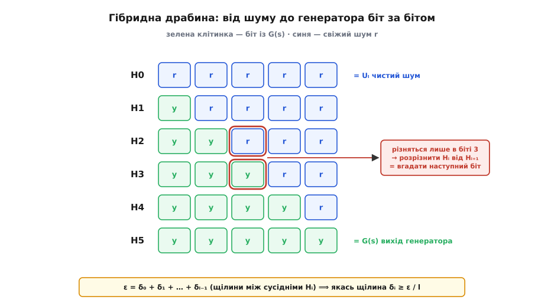
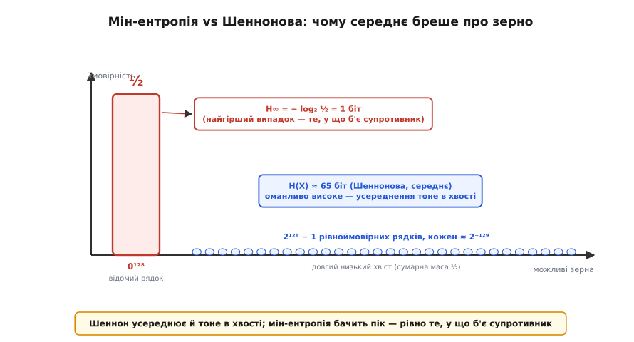

# 🧮 Математика непередбачності: перевага розрізнювача й теорема Яо

Непередбачність — це інтуїція; щоб на ній щось довести, її треба записати рівнянням. Тут зібрано саме апарат: означення надійного генератора через **перевагу розрізнювача**, **тест наступного біта** як окрему вимогу, доведення їхньої рівносильності (**теорема Яо**) гібридним аргументом, далі **мін-ентропію** як єдино чесну міру зерна (і чому Шеннонова тут бреше), а на самому дні — **теорему HILL**, що зводить існування криптографічної випадковості рівно до односторонніх функцій. Нічого, крім математики: означення, теореми, доведення.

Домовимося про дві звички, спільні для всього далі. **Ефективний** алгоритм — той, що працює за час, обмежений поліномом від параметра надійності `n` (довжини зерна); саме такому супротивникові ми й протистоїмо. **Мізерна** функція `ε(n)` — та, що спадає швидше за обернений до будь-якого полінома:

```
ε: ℕ → ℝ⁺  мізерна  ⟺  для кожного полінома p
                        від якогось N і далі:  ε(n) < 1/p(n)

приклади мізерних:   2⁻ⁿ,   2⁻√n,   n⁻ˡᵒᵍ ⁿ
НЕ мізерна:          1/n¹⁰⁰      (це просто малий поліном)
```

Сенс пари такий: «зламати» означає домогтися **не мізерної** переваги **ефективним** алгоритмом. Усе інше — деталі того, що саме вважати перевагою. [Ймовірність, розподіл, рівномірний розподіл і сподівання](book:math/probability-basics) тут — робоча мова, далі без пояснень.

## Розрізнювач і його перевага

Хай `Uₖ` — рівномірний розподіл на `{0,1}ᵏ` (усі `2ᵏ` рядків однаково ймовірні). **Розрізнювач** `D` — це ефективний алгоритм, який дістає рядок і видає один біт: `1` («по-моєму, це справжній шум») чи `0` («по-моєму, це вихід генератора»). Його вміння відрізнити два розподіли `X` і `Y` міряють **перевагою розрізнення**:

```
Adv_D(X, Y) = | Pr[D(X) = 1] − Pr[D(Y) = 1] |
```

Чому саме модуль різниці двох імовірностей? Якщо `D` каже `1` однаково часто на `X` і на `Y`, його відповідь не залежить від того, що йому дали, — він нічого не розрізняє, перевага `0`. Якщо ж `D` каже `1` помітно частіше на одному з них — оцим розривом він і «бачить» різницю. Байдуже, у який бік нахил (тому модуль): розрізнювача, що систематично помиляється навпаки, досить перевернути.

Тепер означення надійності. Генератор `G: {0,1}ⁿ → {0,1}ˡ` розтягує коротке зерно завдовжки `n` у довгий вихід завдовжки `l = l(n) > n`. Він **надійний** (криптографічно стійкий), якщо жоден ефективний розрізнювач не відрізнить його виходу від справжнього шуму тієї самої довжини краще, ніж мізерно:

```
Adv_D(G) = | Pr[s ← Uₙ : D(G(s)) = 1] − Pr[r ← Uₗ : D(r) = 1] |

для КОЖНОГО ефективного D:   Adv_D(G)  мізерна
```

Ключове слово — «жоден»: надійність під квантором `∀`. Досить одного ефективного `D` з не мізерною перевагою — і генератор зламано. Це найсильніша можлива вимога: ми віддаємо супротивникові весь вихід і всю поліноміальну обчислювальну силу, а вимагаємо, щоб він однаково не вирізнив той вихід з-поміж шуму.

## Тест наступного біта — окрема, слабша на вигляд вимога

Невідрізнність — глобальна вимога до всього рядка. Поставмо поряд іншу, локальну й на позір значно скромнішу: не вміти вгадати **лише наступний** біт. **Передбачник** `P` — ефективний алгоритм, який дістає перші `i` бітів виходу й називає свій здогад про `(i+1)`-й. Його успіх міряють перевагою над чесною монеткою:

```
Adv_P,i(G) = Pr[s ← Uₙ, y = G(s) : P(y₁…yᵢ) = yᵢ₊₁] − ½
```

Генератор **проходить тест наступного біта**, якщо для кожного ефективного передбачника `P` і кожної позиції `i` ця перевага мізерна — тобто, побачивши будь-який префікс, ніхто не вгадує наступний біт відчутно краще за підкидання монети.

На перший погляд це слабша обіцянка. Невідрізнність забороняє **будь-яку** статистичну зачіпку в усьому рядку; тест наступного біта забороняє лише **одну** конкретну — передбачення вперед. Могло б здатися, що генератор здатен провалити якийсь хитрий глобальний тест (скажімо, приховану кореляцію між першим і останнім бітом), але при цьому чесно проходити тест наступного біта. Теорема Яо каже: не здатен. Ці дві вимоги — та сама вимога.

## Теорема Яо: непередбачність = невідрізнність

**Теорема (Ендрю Яо, 1982).** Генератор надійний (обчислювально невідрізнний від рівномірного) тоді й лише тоді, коли він проходить тест наступного біта.

Одна половина легка, друга — суть справи.

**Легкий бік: невідрізнність ⟹ непередбачність.** Доведемо навпаки: хто вгадує наступний біт, той і розрізняє. Хай `P` вгадує `(i+1)`-й біт із перевагою `γ`. Будуємо розрізнювач `D`: діставши рядок `w` завдовжки `l`, він запускає `P(w₁…wᵢ)` і порівнює здогад із дійсним `wᵢ₊₁`; видає `1`, якщо `P` угадав, і `0` інакше.

```
на виході G(s):   wᵢ₊₁ — справжній наступний біт,  P влучає з ім-стю ½+γ
                  ⟹  Pr[D=1] = ½ + γ
на шумі Uₗ:       wᵢ₊₁ — свіжа монета, незалежна від w₁…wᵢ
                  ⟹  P влучає рівно з ½,   Pr[D=1] = ½
перевага:         | (½+γ) − ½ | = γ
```

Не мізерний передбачник дає не мізерний розрізнювач. Отже, надійний (нерозрізненний) генератор передбачити не можна.

**Важкий бік: непередбачність ⟹ невідрізнність.** Тут працює **гібридний аргумент** — прийом, що з'єднує глобальну властивість (розрізнення всього рядка) з локальною (один біт) через низку проміжних розподілів. Знову доводимо навпаки: з розрізнювача зробимо передбачника.

Побудуємо драбину з `l+1` **гібридних** розподілів `H₀, H₁, …, Hₗ`. У гібриді `Hᵢ` перші `i` бітів беруть зі справжнього виходу генератора, а решту `l−i` — зі свіжого шуму:

```
Hᵢ = y₁ y₂ … yᵢ  rᵢ₊₁ … rₗ ,    де  y = G(s),  s ← Uₙ,   r ← Uₗ

H₀ = r₁ … rₗ        = Uₗ        (чистий шум)
Hₗ = y₁ … yₗ        = G(s)      (чистий вихід генератора)
```

Кінці драбини — рівно ті два розподіли, які розрізнювач нібито вміє розрізнити. Хай `D` має проти них перевагу `ε`:

```
| Pr[D(Hₗ)=1] − Pr[D(H₀)=1] | = ε
```

Далі два кроки, у яких уся сила прийому.

**Крок перший — телескоп і усереднення.** Велику різницю між кінцями розкладемо в суму маленьких різниць між сусідами. Позначмо щілину між сусідніми гібридами `δᵢ = Pr[D(Hᵢ₊₁)=1] − Pr[D(Hᵢ)=1]`. Сума телескопує (проміжні члени скорочуються):

```
δ₀ + δ₁ + … + δₗ₋₁ = Pr[D(Hₗ)=1] − Pr[D(H₀)=1] = ±ε
```

Знак «мінус» усуваємо, перевернувши відповідь `D` (це не псує ефективності); далі вважаємо суму рівною `+ε`. І тепер просте, але вирішальне спостереження: якщо `l` доданків дають у сумі `ε`, то бодай один із них не менший за `ε/l`. Не може вся сума набратися з доданків, менших за середнє. Отже, знайдеться позиція `i*`:

```
δ_{i*} = Pr[D(H_{i*+1})=1] − Pr[D(H_{i*})=1] ≥ ε / l
```

**Крок другий — сусіди різняться в одному біті.** Подивімося, чим `Hᵢ` відрізняється від `Hᵢ₊₁`:

```
Hᵢ   = y₁…yᵢ  rᵢ₊₁  rᵢ₊₂…rₗ      ← позиція i+1 тут ВИПАДКОВА (rᵢ₊₁)
Hᵢ₊₁ = y₁…yᵢ  yᵢ₊₁  rᵢ₊₂…rₗ      ← позиція i+1 тут СПРАВЖНЯ (yᵢ₊₁)
```

Вони збігаються всюди, крім однієї позиції `i+1`: у `Hᵢ` там свіжа монета, у `Hᵢ₊₁` — справжній наступний біт генератора. Отже, розрізнити `Hᵢ` від `Hᵢ₊₁` — це рівно відчути, справжній там наступний біт чи підмінена монета. А це вже робота передбачника.

Будуємо його. Передбачник `P` дістав справжній префікс `y₁…yᵢ` (саме те, що йому дозволено бачити) і хоче назвати `yᵢ₊₁`. Він:

```
1. кидає власну монету  z ∈ {0,1}   і добирає свіжий шум  rᵢ₊₂…rₗ
2. складає рядок   w = y₁…yᵢ · z · rᵢ₊₂…rₗ
3. запускає  D(w)
4. якщо D(w)=1 — повертає здогад  yᵢ₊₁ = z;   якщо D(w)=0 — повертає  z̄  (протилежне)
```

Логіка кроку 4 така: `D` схильний казати `1` частіше саме тоді, коли позиція `i+1` **справжня** (бо `Hᵢ₊₁` для нього ближчий до «виходу генератора»). Тож коли `D` каже `1`, ставмо, що наша монета `z` вгадала справжній біт; коли `D` каже `0` — що промахнулася, і беремо протилежне.

Порахуймо ймовірність влучення. Ключ — як розподілений складений `w` залежно від `z`:

```
якщо z = yᵢ₊₁ (справжній):    w ~ Hᵢ₊₁    (перші i+1 справжні, решта шум)
якщо z — рівномірна монета:   w ~ Hᵢ      (позиція i+1 випадкова, решта шум)
```

Розкладаємо по значенню `z`. Позначмо `α = Pr[D=1 | z=yᵢ₊₁]`, `β = Pr[D=1 | z≠yᵢ₊₁]`:

```
z = yᵢ₊₁   (ім-сть ½):   влучили ⟺ D=1  (бо повернули z = yᵢ₊₁)    → вклад  ½·α
z = ȳᵢ₊₁   (ім-сть ½):   влучили ⟺ D=0  (бо повернули z̄ = yᵢ₊₁)   → вклад  ½·(1−β)

Pr[влучив] = ½α + ½(1−β) = ½ + ½(α − β)
```

Лишилося впізнати `½(α−β)`. При рівномірній `z` рядок `w ~ Hᵢ`, тож `Pr[D(Hᵢ)=1] = ½α + ½β`; а `Pr[D(Hᵢ₊₁)=1] = α`. Тоді:

```
δᵢ = Pr[D(Hᵢ₊₁)=1] − Pr[D(Hᵢ)=1] = α − (½α + ½β) = ½(α − β)

⟹   Pr[влучив] = ½ + δᵢ
```

Ось і все. На позиції `i*`, де щілина `δ_{i*} ≥ ε/l`, наш передбачник вгадує наступний біт із перевагою

```
Pr[влучив] − ½ = δ_{i*} ≥ ε / l
```

Якщо `ε` не мізерна, то й `ε/l` не мізерна (`l` — поліном, а ділення на поліном мізерності не рятує). Отже, не мізерний розрізнювач породив не мізерного передбачника — суперечність із тим, що генератор проходить тест наступного біта. Значить, розрізнювача немає: непередбачність тягне невідрізнність. ∎


*Межа між справжнім виходом (зелене) і шумом (синє) сунеться на один біт за крок. Кінці драбини — це якраз «вихід генератора» проти «чистого шуму», що їх розрізнювач нібито розрізняє з перевагою ε. Уся перевага розкладається в суму `l` маленьких щілин між сусідами, тож якась щілина неминуче ≥ ε∕l; а сусіди різняться рівно в одному біті, тому розрізнити їх — те саме, що вгадати саме той наступний біт.*

**Приклад: як усереднення знаходить щілину.** Хай `l = 3`, і розрізнювач має перевагу `ε = 0.30` між `H₀` та `H₃`. Припустимо, він каже `1` на гібридах так:

```
Pr[D(Hᵢ)=1]:    H₀:0.20    H₁:0.25    H₂:0.45    H₃:0.50
щілини δᵢ:         δ₀=0.05    δ₁=0.20    δ₂=0.05
сума:            0.05 + 0.20 + 0.05 = 0.30 = ε  ✓
середня щілина:  ε / l = 0.30 / 3 = 0.10
```

Найбільша щілина — `δ₁ = 0.20 ≥ 0.10`. Отже, передбачник на позиції `i*=1` (вгадує **другий** біт) влучає з імовірністю `½ + 0.20 = 0.70` — на цілих 20 відсоткових пунктів краще за монету. Одна «непомітна» глобальна перевага `0.30` неминуче збирається бодай в одній позиції в помітну локальну.

> 🔧 **Навіщо це.** Уся ціна гібридного аргументу — множник `l` у переході від глобальної переваги до локальної: розрізнювач із перевагою `ε` дає передбачника з перевагою лише `ε/l`. Здавалося б, втрата. Але `l` — довжина виходу, тобто поліном від `n`, а поділ мізерної на поліном лишає мізерну, і поділ не мізерної на поліном лишає не мізерну. Тому межа «мізерне ↔ не мізерне» переходить через цей множник неушкодженою — рівно тому вся асимптотична криптографія й може дозволити собі такі редукції з поліноміальними втратами. Якби «надійність» означала конкретне число, а не асимптотику, множник `l` доводилося б оплачувати живими бітами стійкості.

## Мін-ентропія: чому Шеннонова міра бреше про зерно

Друге питання апарату — чим міряти зерно. Інтуїція «скільки в ньому непередбачності» має дві різні формалізації, і для криптографії правильна лише одна.

[Ентропія Шеннона](book:algorithms/entropy) розподілу `X` — це **середня** несподіванка:

```
H(X) = − Σ_x Pr[X=x] · log₂ Pr[X=x]  =  сподівання від  log₂( 1 / Pr[X=x] )
```

Вона відповідає на питання «скільки бітів у середньому коштує описати вислід». Для стиснення це та сама міра. Але супротивник не грає в середнє — він робить **один найкращий** здогад. Його цікавить не середина, а найімовірніший вислід. Це міряє **мін-ентропія**:

```
H∞(X) = − log₂ ( max_x Pr[X=x] )
```

Назва точна: це найменша з можливих «поверхонь» несподіванки — не середня, а в найгіршому випадку, по тому єдиному `x`, який найлегше вгадати. І вона прямо перекладається в ймовірність угадування з першої спроби:

```
найкраща стратегія — назвати найімовірніший  x*
Pr[угадав за 1 спробу] = max_x Pr[X=x] = 2^(−H∞(X))
```

Зерно з мін-ентропією `k` угадується з першої спроби з імовірністю рівно `2⁻ᵏ`. Оце й є чесна міра стійкості ключа: скільки в зерні мін-ентропії — стільки й «справжніх» бітів проти перебору.

Тепер — чому Шеннонова тут бреше. Візьмімо джерело, яке половину часу видає той самий передбачний рядок, а половину — справді випадковий.

**Приклад: зерно з високою Шенноновою ентропією, яке ламається з імовірністю ½.** Хай `X` на `{0,1}¹²⁸`:

```
Pr[X = 0¹²⁸]      = ½                            (один фіксований, ВІДОМИЙ рядок)
Pr[X = кожен ін.] = ½ / (2¹²⁸ − 1) ≈ 2⁻¹²⁹       (решта — рівномірно)

Шеннонова:   H(X)  = ½·log₂2 + ½·log₂(2·(2¹²⁸−1)) ≈ ½ + ½·129 ≈ 65 біт
мін-:        H∞(X) = − log₂(½) = 1 біт
угадування:  назви 0¹²⁸ — виграєш із імовірністю ½
```

Шеннон каже «65 бітів непередбачності» — звучить як міцне півключа. А насправді супротивник вгадує це зерно **з першої спроби в половині випадків**. Причина розходження проста: Шеннонова ентропія **усереднює**, тож величезна маса на одному передбачному значенні тоне в довгому рівномірному хвості. Мін-ентропія дивиться саме на цей пік — на те єдине, у що б'є супротивник. Брати для ключа Шеннонову міру — однаково що хвалитися середньою глибиною ріки, переходячи вбрід її найглибше місце.


*Пік маси ½ сидить на єдиному відомому рядку, ще ½ маси розмазано в довгий низький хвіст. Шеннонова ентропія усереднює по всьому й тоне у хвості (≈ 65 біт), тому виглядає високою. Мін-ентропія дивиться лише на пік — і чесно каже 1 біт: супротивник назве той рядок і виграє з імовірністю ½.*

Ці дві — крайні представниці одного роду, **ентропій Реньї** `Hα`, упорядкованих за параметром `α`:

```
Hα(X) = 1/(1−α) · log₂ ( Σ_x Pr[X=x]^α )

α → 1:  Шеннонова H₁          (середнє)
α = 2:  ентропія збігу H₂     ( −log₂ Σ p² )
α → ∞:  мін-ентропія H∞       (найгірший випадок)

завжди:   H∞ ≤ … ≤ H₂ ≤ H₁ ≤ H₀ = log₂|носій|
```

Мін-ентропія — найменша з усього роду, найконсервативніша оцінка. Рівність `H∞ = H₁` настає тільки для **рівного** розподілу (усі висліди однаково ймовірні) — лише тоді середнє й найгірше збігаються. Саме тому фізичне джерело, чий сирий вихід завжди нерівний, оцінюють мін-ентропією й ніколи Шенноновою. [Як прибирають зсув сирого шуму й рахують мін-ентропію на практиці](book:algorithms/entropy-source) — окрема інженерна тема; тут важливий сам критерій.

## Скільки з зерна можна витягнути: лема про залишок гешування

Мін-ентропія не лише лякає числом — вона й обіцяє: з джерела з мін-ентропією `k` можна **видобути** майже `k` справді рівномірних бітів. Це перетворює «нерівне зерно» на «майже ідеальне» й дає мін-ентропії операційний сенс: рівно стільки бітів звідти й витягується. Щоб це сформулювати, потрібні дві цеглини.

Перша — як міряти «майже рівномірний». **Статистична відстань** (повна варіація) між розподілами:

```
Δ(X, Y) = ½ Σ_z | Pr[X=z] − Pr[Y=z] |  =  max_S ( Pr[X∈S] − Pr[Y∈S] )
```

Друга форма промовиста: `Δ` — це найбільша перевага, яку взагалі може мати будь-який (навіть необмежений) розрізнювач, обравши найкращу підмножину `S` для відповіді «1». `Δ ≤ ε` означає, що ніхто не відрізнить `X` від `Y` з перевагою понад `ε`.

Друга цеглина — **універсальне сімейство геш-функцій** `H`: набір функцій `h: {0,1}ⁿ → {0,1}ᵐ` з єдиною вимогою — будь-які два різні входи стикаються рідко:

```
для всіх x ≠ x':   Pr[h ← H : h(x) = h(x')] ≤ 1 / 2ᵐ
```

**Лема про залишок гешування** (*Leftover Hash Lemma*; Impagliazzo, Levin, Luby, 1989). Якщо `H∞(X) ≥ k` і `h` беруть навмання з універсального сімейства, то пара «функція та її вихід» майже нерозрізненна з парою «функція та чистий шум»:

```
Δ( (h, h(X)),  (h, Uₘ) )  ≤  ½ · 2^((m−k)/2)
```

Тобто, взявши `m = k − 2·log₂(1/ε)` вихідних бітів, дістаємо `ε`-близькість до рівномірного. **Втрата ентропії** — рівно `2·log₂(1/ε)` бітів, ціна за близькість; решта мін-ентропії переходить у чисті випадкові біти.

Чому це правда — видно з **імовірності збігу**. Для розподілу `X` це шанс, що дві його незалежні копії збіглися:

```
Col(X) = Σ_x Pr[X=x]²  =  Pr[X = X']
```

Мін-ентропія прямо обмежує збіг: якщо жодне значення не важче за `2⁻ᵏ`, то

```
Col(X) = Σ_x p_x²  ≤  (max_x p_x) · Σ_x p_x  ≤  2⁻ᵏ · 1 = 2⁻ᵏ
```

Далі два кроки. По-перше, універсальність тримає збіг гешованої пари низьким. Копії `(h, h(X))` і `(h', h'(X'))` збігаються, лише коли `h = h'` (шанс `1/|H|`) і `h(X) = h(X')` — а це або справжній збіг входів (`Col(X) ≤ 2⁻ᵏ`), або зіткнення різних входів (`≤ 2⁻ᵐ`):

```
Col( (h, h(X)) )  ≤  (1/|H|) · ( 2⁻ᵏ + 2⁻ᵐ )
```

По-друге, мала ймовірність збігу означає близькість до рівномірного. Для будь-якого розподілу `Z` на носії розміру `N` виконано просту нерівність:

```
Δ(Z, U_N) ≤ ½ · √( N · Col(Z) − 1 )
        (бо  ‖Z − U_N‖₂² = Col(Z) − 1/N,   а  ‖·‖₁ ≤ √N · ‖·‖₂  за Коші–Шварцем)
```

Тут `N = |H|·2ᵐ` — розмір носія пари `(h, h(X))`. Підставляємо оцінку збігу:

```
N · Col(Z)  ≤  |H|·2ᵐ · (1/|H|)( 2⁻ᵏ + 2⁻ᵐ ) = 2^(m−k) + 1
⟹  N · Col(Z) − 1 ≤ 2^(m−k)
⟹  Δ(Z, U_N) ≤ ½ · √( 2^(m−k) ) = ½ · 2^((m−k)/2)
```

— рівно твердження леми. Уся вага лягла на одну нерівність `Col(X) ≤ 2⁻ᵏ`, а вона тримається саме на мін-ентропії, не на Шенноновій. Ось чому мін-ентропія — не просто обережніша, а **єдино правильна** міра зерна: це буквально кількість рівномірних бітів, які з нього можна чесно витягнути.

## Теорема HILL: усе впирається в односторонню функцію

Лишилося найглибше питання: а коли надійний генератор узагалі **існує**? Відповідь зводить усю криптографічну випадковість до одного припущення.

Спершу — строге означення того примітиву, на якому все стоїть. Функція `f` **одностороння**, якщо її легко порахувати вперед і обчислювально неможливо обернути:

```
f: {0,1}ⁿ → {0,1}ᵐ  одностороння  ⟺
  (вперед легко)  f(x) рахується за поліноміальний час
  (назад важко)   для кожного ефективного A:
      Pr[ x ← Uₙ, y = f(x) : f(A(y)) = y ]  мізерна
```

Тонкість в умові `f(A(y)) = y`, а не `A(y) = x`: обернути — це знайти **будь-який** прообраз, що дає те саме `y`, а не конче той самий `x`. [Криптографічна геш-функція](book:programming/cryptographic-hash) — звичне втілення такої функції.

**Теорема (Håstad, Impagliazzo, Levin, Luby; журнальна версія 1999).**

```
Генератор псевдовипадкових бітів існує   ⟺   існує одностороння функція
```

Один бік короткий і повчальний, другий — одна з найглибших теорем у криптографії.

**Легкий бік: PRG ⟹ OWF.** Надійний генератор сам є односторонньою функцією. Хай `G: {0,1}ⁿ → {0,1}²ⁿ` подвоює зерно. Покажемо: якби `G` можна було обернути, його можна було б і розрізнити. Хай алгоритм `A` знаходить прообраз `G` з не мізерною ймовірністю `p`. Будуємо розрізнювач `D(y)`: обчислює `s' = A(y)` і видає `1`, якщо `G(s') = y`, інакше `0`.

```
на y = G(s):   A влучає в прообраз з ім-стю ≥ p   ⟹   Pr[D=1] ≥ p
на y = U₂ₙ:    образ G містить щонайбільше 2ⁿ значень із 2²ⁿ можливих рядків
               ⟹ Pr[ y має прообраз ] ≤ 2ⁿ / 2²ⁿ = 2⁻ⁿ   ⟹   Pr[D=1] ≤ 2⁻ⁿ
перевага:      ≥ p − 2⁻ⁿ    — не мізерна
```

Розтягуючи навіть на один зайвий біт, генератор уже мусить бути важким для обернення — інакше сам факт наявності прообразу видає його з-поміж шуму. Отже, з PRG задарма випадає OWF.

**Важкий бік: OWF ⟹ PRG.** Це і є теорема HILL у власному розумінні — з **будь-якої** односторонньої функції збудувати генератор. Повне доведення — на книжковий розділ; ось його кістяк. З `f` спершу видобувають **твердий предикат** (*hardcore predicate*) — один біт, який легко порахувати, знаючи `x`, але неможливо вгадати, знаючи лише `f(x)`. Теорема Голдрайха–Левіна дає такий біт для будь-якої односторонньої функції: це `⟨x, r⟩ = x₁r₁ ⊕ … ⊕ xₙrₙ` для випадкового `r`, узятий разом із функцією `f′(x, r) = (f(x), r)`. Один твердий біт — уже крихта непередбачності; далі її **накопичують** (поняття псевдоентропії — вихід, що «на вигляд» має більше мін-ентропії, ніж насправді) і **витягують** у рівномірні біти тією самою лемою про залишок гешування з попереднього розділу. Так драбина редукцій піднімається від «важко обернути» до «неможливо відрізнити».

Статус — доведена теорема, не гіпотеза: рівносильність строго встановлена. Відкрите інше — чи односторонні функції взагалі існують (це сильніше за `P ≠ NP`). Але якщо існує бодай одна, теорема HILL обіцяє з неї генератор; а вся практика вірить, що обертання SHA-2 чи факторизація саме такі. На цій одній вірі — і на щойно розібраному апараті — стоїть уся обчислювальна випадковість.
