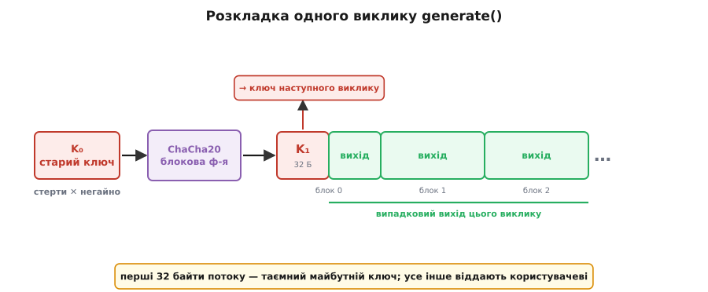

# 🔑 Швидке стирання ключа: робочий CSPRNG на ChaCha20

Зберемо генератор, який — якщо його стан викрадуть просто зараз — не видасть жодного байта з того, що вже роздав, і робить це швидко, звичайним C, на одному-єдиному примітиві. Прийом зветься **швидким стиранням ключа** (*fast-key-erasure*), Даніель Бернстайн описав його 23 липня 2017 року, і сьогодні він працює всередині генераторів Linux та BSD. Уся хитрість — одна операція `memset`, поставлена в правильному місці.

## Задача

Треба функція `generate(out, n)`, що заповнює буфер `n` непередбачними байтами, і при цьому:

- **швидко** — гігабайти за секунду, без звертання до повільного джерела ентропії на кожен байт;
- **пряма таємність** — якщо стан захоплять, увесь **раніше** виданий вихід лишається недосяжним;
- **відновлюваність** — окрема функція `reseed(entropy)` вливає свіжу непередбачність, щоб оговтатися після витоку.

Обмеження навмисно жорсткі: чистий C, стан — 32 байти, один криптографічний примітив на все. Цей примітив — **ChaCha20**, потоковий шифр Бернстайна: з 32-байтового ключа він розгортає скільки завгодно псевдовипадкового потоку, швидко й без апаратної підтримки.

> ⚠️ Це **навчальна** реалізація — щоб побачити механізм оголеним. Збір ентропії й керування станом на реальній системі робить ядро; насіння тут теж береться від системного генератора.

## Ідея одним абзацом

Тримаємо в стані лише 32-байтовий ключ `Kᵢ` — більше нічого. Щоб обслужити запит: женемо потік ChaCha на цьому ключі, **перші 32 байти потоку відрізаємо й робимо наступним ключем** `Kᵢ₊₁`, усе решта віддаємо як відповідь, а старий `Kᵢ` **негайно затираємо**. Оскільки блокова функція ChaCha одностороння, з `Kᵢ₊₁` неможливо відкрутити назад до `Kᵢ` — тож пряма таємність коштує рівно один зайвий блок і один `memset`.

## Цеглина: блокова функція ChaCha20

Уся сила спирається на одну функцію: з ключа й лічильника вона рахує 64 псевдовипадкові байти так, що вперед це миттєво, а назад — обчислювально неможливо. Розберімо її, бо саме її односторонність робить храповик храповиком.

Стан ChaCha — матриця 4×4 із шістнадцяти 32-бітових слів: чотири сталі (ASCII-рядок `"expand 32-byte k"`), вісім слів ключа, слово лічильника блоку й три слова одноразового номера (тут — нулі). Серце — **чвертькрок** (*quarter-round*): чотири додавання, чотири XOR-и й чотири циклічні зсуви, що перемішують четвірку слів. Двадцять раундів (десять «стовпцевих» і десять «діагональних» чвертькроків поспіль) розганяють будь-яку зміну входу на весь стан.

```c
#include <stdint.h>
#include <string.h>

#define ROTL(x, n) (((x) << (n)) | ((x) >> (32 - (n))))

#define QR(a, b, c, d) do {          \
    a += b; d ^= a; d = ROTL(d, 16); \
    c += d; b ^= c; b = ROTL(b, 12); \
    a += b; d ^= a; d = ROTL(d, 8);  \
    c += d; b ^= c; b = ROTL(b, 7);  \
} while (0)

/* 64 байти псевдовипадкового потоку з ключа й номера блоку. */
static void chacha20_block(const uint8_t key[32], uint32_t counter, uint8_t out[64]) {
    uint32_t s[16];
    s[0] = 0x61707865; s[1] = 0x3320646e;      /* "expand 32-byte k" */
    s[2] = 0x79622d32; s[3] = 0x6b206574;
    for (int i = 0; i < 8; i++)                /* ключ — 8 слів, little-endian */
        s[4 + i] =  (uint32_t)key[4*i]
                 | ((uint32_t)key[4*i + 1] << 8)
                 | ((uint32_t)key[4*i + 2] << 16)
                 | ((uint32_t)key[4*i + 3] << 24);
    s[12] = counter; s[13] = 0; s[14] = 0; s[15] = 0;   /* лічильник + nonce=0 */

    uint32_t x[16];
    memcpy(x, s, sizeof x);
    for (int i = 0; i < 10; i++) {             /* 20 раундів = 10 подвійних */
        QR(x[0], x[4], x[ 8], x[12]);          /* чотири стовпці */
        QR(x[1], x[5], x[ 9], x[13]);
        QR(x[2], x[6], x[10], x[14]);
        QR(x[3], x[7], x[11], x[15]);
        QR(x[0], x[5], x[10], x[15]);          /* чотири діагоналі */
        QR(x[1], x[6], x[11], x[12]);
        QR(x[2], x[7], x[ 8], x[13]);
        QR(x[3], x[4], x[ 9], x[14]);
    }
    for (int i = 0; i < 16; i++) {
        uint32_t v = x[i] + s[i];              /* ← додавання вихідного стану */
        out[4*i]     = (uint8_t)(v);           /* серіалізація little-endian */
        out[4*i + 1] = (uint8_t)(v >> 8);
        out[4*i + 2] = (uint8_t)(v >> 16);
        out[4*i + 3] = (uint8_t)(v >> 24);
    }
}
```

Уся односторонність народжується в одному, легко пропущеному рядку — `v = x[i] + s[i]`. Двадцять раундів самі по собі оборотні: це перестановка, її можна відкрутити крок за кроком. Але наприкінці до перемішаного стану `x` **додають вихідний стан** `s`, а `s` містить таємний ключ. Щоб обернути результат, треба відняти `s` — а `s` ти й шукаєш. Саме це подвійне «замикання» (перемішати, тоді додати незмішаний вхід) перетворює оборотну перестановку на [односторонню функцію](book:programming/cryptographic-hash) — таку, що вперед рахується легко, а назад обертається лише повним перебором усіх можливих ключів. На цій асиметрії стоятиме весь храповик.

> 🔧 **Навіщо це.** `nonce = 0` виглядає підозріло — адже повторити пару «ключ + лічильник» у потоковому шифрі означає видати ту саму гаму двічі, катастрофа рівня повторного одноразового блокнота. Але тут номер можна тримати нулем безкарно: ключ **міняється щовиклику**, тож пара (ключ, лічильник) ніколи не повторюється, навіть коли лічильник щоразу стартує з нуля. Швидке стирання ключа саме й дарує цю унікальність задарма.

## Генератор і generate()

Стан — рівно ключ (плюс мітка процесу, вона знадобиться проти fork). Ініціалізуємо його насінням від системного генератора:

```c
#include <sys/types.h>
#include <unistd.h>

typedef struct {
    uint8_t key[32];   /* Kᵢ — єдиний секрет генератора */
    pid_t   pid;       /* чий це стан (для виявлення fork) */
} frng;

void frng_init(frng *r, const uint8_t seed[32]) {
    memcpy(r->key, seed, 32);   /* seed ← getrandom() від ядра */
    r->pid = getpid();
}
```

Тепер сам храповик. Перший блок ділимо навпіл: його перші 32 байти ховаємо в майбутній ключ, другі 32 — це вже вихід. Дальші блоки того самого потоку йдуть у вихід цілком. І аж наприкінці, коли весь запит обслужено старим ключем, ставимо на його місце новий і затираємо все тимчасове.

```c
/* Надійне стирання — memset оптимізатор має право викинути (див. пастки). */
static void secure_wipe(void *p, size_t n) {
    volatile uint8_t *v = (volatile uint8_t *)p;
    while (n--) *v++ = 0;
}

void frng_generate(frng *r, uint8_t *out, size_t n) {
    uint8_t  block[64];
    uint8_t  newkey[32];
    uint32_t counter = 0;

    /* Блок 0: [0..32) — майбутній ключ, [32..64) — початок виходу. */
    chacha20_block(r->key, counter++, block);
    memcpy(newkey, block, 32);
    size_t take = n < 32 ? n : 32;
    memcpy(out, block + 32, take);
    out += take;
    n   -= take;

    /* Решта запиту — цілі блоки того самого потоку (усе ще старий Kᵢ). */
    while (n > 0) {
        chacha20_block(r->key, counter++, block);
        take = n < 64 ? n : 64;
        memcpy(out, block, take);
        out += take;
        n   -= take;
    }

    /* Храповик: новий ключ на місце старого, усе тимчасове — у нуль. */
    memcpy(r->key, newkey, 32);
    secure_wipe(newkey, sizeof newkey);
    secure_wipe(block,  sizeof block);
}
```

Вдумаймося, чому цей десяток рядків дає пряму таємність. **Увесь** вихід цього виклику порахований зі старого `Kᵢ`; наприкінці `Kᵢ` затерто, а в стані лежить лише `Kᵢ₊₁ = ChaCha(Kᵢ)[0:32]`. Хай тепер супротивник захопить стан — він тримає `Kᵢ₊₁`. Щоб відтворити бодай байт минулого виходу, йому треба `Kᵢ`; щоб дістати `Kᵢ` з `Kᵢ₊₁`, треба обернути блокову функцію — обчислювально неможливо. Ланцюг `K₀ → K₁ → K₂ → …` є однобічною доріжкою, і кожен затертий ключ замикає за собою двері.


*Перші 32 байти потоку — це `K₁`, таємний ключ наступного виклику; їх не показують нікому. Другі 32 байти першого блоку й усі дальші блоки — випадковий вихід цього виклику. Старий ключ затирають одразу, тож захоплення стану після виклику не дає відкрутити потік назад.*

## reseed(): вливання свіжої ентропії

Храповик береже минуле, але майбутнє — ні: із захопленого `Kᵢ₊₁` супротивник чудово рахує весь **наступний** потік, бо храповик детермінований уперед. Оговтатися можна лише одним способом — влити в ключ непередбачність, якої супротивник не бачив. І вливати треба **в суміш** зі старим станом, а не начисто: тоді генератор надійний, якщо чисте бодай одне джерело — або старий стан (супротивник його не мав), або нова ентропія (супротивник її не бачив).

Ту саму односторонню блокову функцію тут вживаємо як мішалку: поглинаємо насіння шматками, кожен XOR-имо в ключ і одразу проганяємо крізь ChaCha.

```c
void frng_reseed(frng *r, const uint8_t *seed, size_t slen) {
    uint8_t block[64];
    size_t  off = 0;

    do {
        size_t chunk = (slen - off) < 32 ? (slen - off) : 32;
        for (size_t i = 0; i < chunk; i++)
            r->key[i] ^= seed[off + i];      /* підмішати шматок насіння */
        chacha20_block(r->key, 0, block);    /* односторонньо перемішати */
        memcpy(r->key, block, 32);           /* новий ключ = ChaCha(суміш) */
        off += chunk;
    } while (off < slen);

    secure_wipe(block, sizeof block);
}
```

Новий ключ залежить і від старого, і від насіння, бо перше XOR-иться з другим, а результат проходить крізь односторонній блок. Навіть якщо супротивник знав увесь старий стан, свіжої ентропії він не бачив — тож новий ключ для нього непередбачний, і потік праворуч знову закритий. Поглинання шматками по 32 байти дозволяє влити насіння будь-якої довжини, а не тільки рівно 32.

## Пастки

Алгоритм короткий, але майже вся реальна вразливість випадковості ховається не в ньому, а в тому, як його вбудовують. Чотири місця, де легко все зіпсувати.

**1. Fork і клон віртуалки без пересіву.** Найпідступніше. Коли процес форкається, дитина успадковує **копію** стану — той самий `Kᵢ`. Далі батько й дитина рахують той самий потік, видають ті самі ключі, і дві незалежні на вигляд машини раптом мають спільні секрети. Те саме коли клонують образ віртуалки. Розв'язок — помітити fork і пересіятися перед першим байтом:

```c
void frng_generate_safe(frng *r, uint8_t *out, size_t n) {
    if (getpid() != r->pid) {           /* нас форкнули — стан успадкований */
        uint8_t fresh[32];
        os_getrandom(fresh, 32);        /* свіже насіння від ядра */
        frng_reseed(r, fresh, 32);
        secure_wipe(fresh, sizeof fresh);
        r->pid = getpid();
    }
    frng_generate(r, out, n);
}
```

Перевірка `getpid()` — лише мінімальна підлога: номери процесів переповнюються й повторюються, а `vfork`/`clone` та клон віртуалки її взагалі обходять. Надійно проблему закриває ядро — сторінкою з прапорцем `MADV_WIPEONFORK` (її вміст обнуляється в дитині після fork) або лічильником покоління віртуалки. Це одна з головних причин, чому генератор із простору користувача взагалі небезпечний, а системний — ні.

**2. Стирання, яке компілятор викидає.** Затерти ключ звичайним `memset(key, 0, 32)` перед виходом із функції — і оптимізатор має повне право його **прибрати**: з погляду стандарту C у мертву пам'ять уже ніхто не дивиться, отже, запис зайвий. Ключ лишається в пам'яті (а може, і в дампі чи своп-файлі) відкритим. Тому стирати треба способом, який не «оптимізується»: через `volatile`-вказівник (як `secure_wipe` вище) або платформною функцією — `explicit_bzero` (BSD, glibc), `memset_s` (C11 Annex K), `SecureZeroMemory` (Windows). Для параної ще й `mlock`, щоб ключ не потрапив у своп.

**3. Лічильник і одноразовий номер: пара (ключ, лічильник) не сміє повторитися.** У ChaCha повторення пари (ключ, лічильник) при тому самому nonce дає **ту саму** гаму — це двічі накладений одноразовий блокнот, з якого XOR виймає обидва повідомлення. Швидке стирання ключа рятує тут само собою: ключ міняється щовиклику, тож повторити пару неможливо, навіть коли лічильник щоразу з нуля. Але межа лишається: 32-бітовий лічильник вміщує 2³² блоків по 64 байти на один виклик:

```
2³² блоків · 64 Б = 2³⁸ Б = 256 ГіБ на ОДИН виклик generate()
```

Запит більший за 256 ГіБ переповнить лічильник і поверне гаму по колу. На практиці такого не буває, але коректна реалізація або ріже гігантський запит на шматки з окремим ключем, або тримає 64-бітовий лічильник.

**4. Буферизація заради швидкості.** Платити цілим блоком ChaCha за кожні 8 байтів марнотратно, тож справжні генератори (той-таки `arc4random`) наперед набивають буфер і роздають з нього скибками. Це вмикає три нові обов'язки, і забути будь-який — злам: перші 32 байти буфера (майбутній ключ) **не можна** віддати назовні; кожен виданий байт треба **одразу затерти** в буфері (пряма таємність поширюється й на нього — захоплений буфер не сміє видати вже роздане); а на fork **увесь буфер** треба викинути, не лише ключ, інакше дитина роздасть ті самі буферизовані байти. Швидкість буфера купується дисципліною стирання.

## Складність

Робота лінійна від довжини запиту: `generate(out, n)` рахує `⌈n/64⌉ + 1` блоків ChaCha, кожен — сталі 20 раундів по 8 чвертькроків (десь 15 простих операцій над 32-бітовим словом на байт виходу), тобто **O(n)** часу з кількома тактами процесора на байт. Храповик додає рівно **один** зайвий блок на виклик — на великому запиті це губиться, але для крихітних (скажімо, 8 байтів) ти все одно платиш повний блок за майбутній ключ, тож часті мікрозапити вигідніше обслуговувати з буфера. Пам'ять стану — **O(1)**, ті самі 32 байти ключа незалежно від того, скільки терабайтів уже роздано.

Це і є, з точністю до буферизації та роботи з ентропією, форма ядра `getrandom` в Linux і `arc4random` у BSD: увесь секрет живучості вміщується у 32 байти, а вся пряма таємність — в один затертий ключ на виході з функції.
