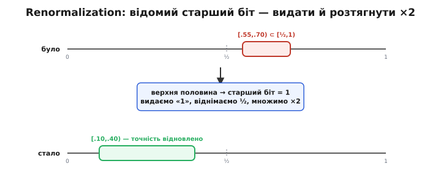
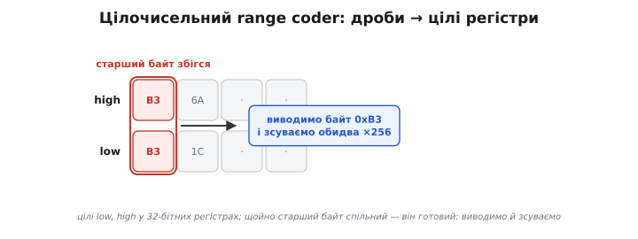
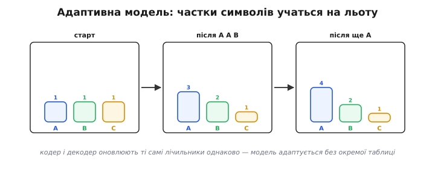

# Арифметичне кодування (детально)

[Базова версія](topic:algorithms/arithmetic-coding) показала головну ідею: всю послідовність перетворюють на одне число в інтервалі `[0, 1)`, звужуючи інтервал символ за символом пропорційно ймовірностям. Тут розберемо все, без чого цю ідею не перетворити на робочий кодек: точну арифметику кодування й декодування на числах, фундаментальну проблему нескінченної точності та її розв'язок (renormalization і боротьба з переносом), цілочисельний range coder, адаптивні моделі, що вчаться на льоту, сучасного нащадка rANS — і чому все це майже точно дістає [ентропію](topic:algorithms/entropy).

## Кодування на числах: повний прохід

Закріпімо механіку точним прикладом. Модель — три символи з імовірностями `p(A)=0.5, p(B)=0.3, p(C)=0.2`. Складемо **кумулятивні межі** — це частки, викладені вздовж `[0, 1)`:

```
символ   p     c_lo   c_hi
  A      0.5   0.0    0.5
  B      0.3   0.5    0.8
  C      0.2   0.8    1.0
```

Закодуймо повідомлення «C A B». Тримаємо два числа — `low` і `high`; на кожному символі рахуємо ширину `r = high − low` і вкладаємо в неї частку символу.

```
старт:        low = 0.000000   high = 1.000000   r = 1.000000

символ C  (c_lo=0.8, c_hi=1.0):
  new_low  = 0.000000 + 1.000000 · 0.8 = 0.800000
  new_high = 0.000000 + 1.000000 · 1.0 = 1.000000
              low = 0.800000   high = 1.000000   r = 0.200000

символ A  (c_lo=0.0, c_hi=0.5):
  new_low  = 0.800000 + 0.200000 · 0.0 = 0.800000
  new_high = 0.800000 + 0.200000 · 0.5 = 0.900000
              low = 0.800000   high = 0.900000   r = 0.100000

символ B  (c_lo=0.5, c_hi=0.8):
  new_low  = 0.800000 + 0.100000 · 0.5 = 0.850000
  new_high = 0.800000 + 0.100000 · 0.8 = 0.880000
              low = 0.850000   high = 0.880000   r = 0.030000
```

Підсумок — інтервал `[0.850000, 0.880000)`. Код повідомлення — **будь-яке** число всередині; беруть зазвичай те, що має найкоротший двійковий запис, скажімо `0.85`. Зверни увагу на ширину: `r = 0.5 · 0.2 · 0.3 = 0.03` — це **добуток ймовірностей** усіх трьох символів. Так буде завжди: кінцева ширина дорівнює `∏ p(символ)`, а отже довжина числа всередині — це `−log₂(∏ p) = Σ (−log₂ p)` біта. Сума `−log₂ p` — це рівно [Шеннонова ціна](topic:algorithms/entropy) повідомлення. Звідси й береться оптимальність: кодер ніде не округлює, тож платить точно стільки, скільки повідомлення «коштує».

## Декодування: те саме ділення навспак

Декодер отримує число — назвімо його `v = 0.85` — і ту саму модель. Він повторює ділення інтервалу й щоразу питає: **в яку частку впало `v`?**

```
старт: інтервал [0, 1), v = 0.85
  0.85 ∈ [0.8, 1.0) → це частка C  → видали символ C
  звузити до C: low=0.8, high=1.0, r=0.2

крок 2: масштабуємо v у поточний інтервал:
  v' = (v − low) / r = (0.85 − 0.8) / 0.2 = 0.25
  0.25 ∈ [0.0, 0.5) → частка A  → видали символ A
  звузити до A: low=0.8, high=0.9, r=0.1

крок 3:
  v' = (0.85 − 0.8) / 0.1 = 0.5
  0.5 ∈ [0.5, 0.8) → частка B  → видали символ B
```

Вийшло «C A B» — те саме повідомлення. Є два рівноцінні способи вести декодер: або щоразу **перемасштабовувати** `v` у поточний інтервал (як вище, `v' = (v−low)/r`), або тримати `v` незмінним і звужувати `low`/`high` точно як кодер, порівнюючи `v` з рухомими межами. Реалізації беруть другий шлях — він уникає накопичення похибки від ділення.

Лишилося питання, на якому декодер міг би спіткнутися: **коли спинятись?** Інтервал звужується вічно, тож декодер сам не знає, що символи скінчилися. Тому межу повідомлення задають окремо — або наперед записаною **довжиною**, або спеціальним символом «кінець потоку» (EOF), якому в моделі виділяють крихітну ймовірність. Без цього декодер «вигадуватиме» символи з хвоста числа без кінця.

Як це працює на цілих числах (так і реалізують насправді): декодер тримає той самий `low`/`high`, що й кодер, плюс регістр `code` — старші біти прочитаного потоку. Щоб дізнатися символ, він зводить `code` до «частоти» в межах поточного інтервалу й шукає, в яку кумулятивну частку та потрапляє:

```
range = high − low + 1
value = ((code − low + 1) · total − 1) / range      // зведена «частота»
символ = той, у кого cum_lo ≤ value < cum_hi          // пошук по таблиці
```

Знайшовши символ, декодер звужує `low`/`high` точно тією самою формулою, що й кодер, і робить ту саму byte-renormalization, підтягуючи з потоку нові молодші біти в `code`. Бо кодер і декодер ведуть **однакові** `low`, `high` й однакову модель, їхні інтервали збігаються крок у крок — і символи відновлюються без похибки.

## Проблема нескінченної точності

Дотепер ми писали `low` і `high` як дроби з усіма цифрами. На реальному процесорі так не вийде: після кожного символу ширина `r` множиться на `p < 1`, тож інтервал **експоненційно** вужчає. Уже за кілька десятків символів `r` стане меншим за крок машинного `double` (близько `2⁻⁵²`), межі `low` і `high` зіллються в одне число — і кодер втратить здатність розрізняти символи. Кодувати мегабайти даних одним числом неможливо: ніякої скінченної точності не стане.

Порятунок спирається на просте спостереження. Дивись, що сталося в прикладі вище після символів «C A»: інтервал був `[0.800, 0.900)`. Обидві межі починаються з `0.8…` — **старша цифра вже однакова й більше не зміниться**, хоч би які символи прийшли далі (бо інтервал лише звужується всередині себе). А якщо старша цифра вже відома й зафіксована — навіщо її тримати? Її можна негайно **вивести** в потік і **викинути** з обох чисел, звільнивши розряд під нові цифри.


*Renormalization у двійковому вигляді. Інтервал [0.55, 0.70) цілком лежить у верхній половині [½, 1) — отже його старший двійковий біт дорівнює 1 і вже не зміниться. Видаємо «1» у потік, віднімаємо ½ й множимо інтервал на 2: він стає [0.10, 0.40), розтягнувшись на всю шкалу. Точність відновлено — звуження може тривати. Так само з нижньою половиною [0, ½): старший біт = 0, видаємо «0» і розтягуємо.*

Це і є **renormalization** (від латинського *re-* — знову + *norma* — міра): тримати інтервал «розтягнутим» на робочу шкалу, видаючи старші біти, щойно вони визначилися. У двійковому світі правило просте:

- інтервал цілком у верхній половині `[½, 1)` → старший біт = **1**: вивести `1`, відняти `½`, помножити межі на `2`;
- інтервал цілком у нижній половині `[0, ½)` → старший біт = **0**: вивести `0`, помножити межі на `2`.

Кожне таке подвоєння **повертає** інтервалу втрачену через звуження ширину, тож робочих розрядів вистачає назавжди. Декодер дзеркально **вдвічі розтягує** і своє вікно, і прочитане число `v`, підтягуючи з потоку наступні біти. Так нескінченно точний дріб перетворюється на скінченний струмок бітів.

## Підступний випадок: перенос (carry)

Renormalization розв'язує майже все — крім однієї пастки. Буває, що інтервал «осідлав» середину: `low` трохи нижче `½`, `high` трохи вище. Старші біти **не збіглися** (один `0…`, другий `1…`), тож видати нічого, а проте інтервал уже вузенький і далі звужуватись нікуди. Якщо просто чекати, поки біти зійдуться, можна зависнути.

Класичний вихід — стежити саме за цим станом і відкладати рішення. Коли `low ∈ [¼, ½)` і `high ∈ [½, ¾)` (інтервал тулиться до середини зсередини), ми ще не знаємо старшого біта, але знаємо: **наступний** виведений біт і цей відкладений будуть **протилежні**. Тому інтервал розтягують довкола середини (відняти `¼`, помножити на `2`) і **лічать борг** — скільки таких «серединних» розтягів зроблено поспіль. Щойно справжній старший біт визначиться (`b`), ми виводимо `b`, а потім `b̄` стільки разів, скільки накопичено боргу. Це класичний прийом «E3-мапування» / pending bits.

Покажемо механізм pending-бітів на пальцях. Хай інтервал уже двічі поспіль «осідлав» середину, тож борг pending = 2, а старший біт усе не визначився. Нарешті інтервал цілком іде у верхню половину — старший біт `b = 1`. Тоді в потік лягає не один біт, а ціла серія:

```
визначився старший біт b = 1, борг pending = 2
виводимо:  b              → 1
потім b̄ × pending:        → 0 0      (протилежний біт стільки разів, скільки боргу)
борг обнуляємо: pending = 0
підсумок у потік:  1 0 0
```

Чому саме протилежні біти? Бо «серединний» розтяг означав: інтервал лежав довкола `½`, де код виглядає як `0111…` або `1000…` — тобто за старшим бітом ідуть **протилежні** йому розряди аж до точки, де інтервал нарешті визначиться. Декодер, читаючи, поводиться симетрично й відновлює ту саму послідовність.

Та сама колізія в інший бік відома як **перенос (carry)**: до вже виведених старших бітів може «прибігти» одиниця знизу, коли `low` при додаванні перевалює через круглу межу (`…0111… + щось = …1000…`, і одиниця «біжить» уліво крізь ланцюжок одиниць). Тоді треба «поширити» перенос назад у вже видані байти. Реалізації обходять це двома способами: або тим самим лічильником відкладених байтів (затримуємо ланцюжок `0xFF`, що загрожує переносом, доки не стане ясно, чи прийде одиниця: прийшла — попередній байт `+1`, а `0xFF` стають `0x00`; не прийшла — віддаємо `0xFF` як є), або **bit-stuffing** — вставляючи запобіжний нуль після кожного ланцюжка одиниць, щоб переносу не було куди поширюватися (так робить MQ-кодер у JPEG2000). Дрібниця на вигляд — та саме на ній найчастіше ламаються наївні реалізації: одна розбіжність кодера й декодера в обробці переносу — і весь потік за тим місцем перетворюється на сміття.

> 🔧 **Навіщо це.** Якщо колись писатимеш свій ентропійний кодер для вбудованого пристрою, **carry/pending bits — місце, де він майже напевно зламається першим**. Кодер і декодер мусять трактувати перенос **байт у байт однаково**, інакше потоки розійдуться на одному рідкісному символі — і весь хвіст декодується в сміття. Тому на практиці беруть **перевірену** реалізацію range coder, а не пишуть свою з нуля: тонкощів переносу більше, ніж здається.

## Цілочисельний range coder

Зібравши renormalization і обробку переносу разом, дістаємо практичну форму — **range coding**. Дроби `[0, 1)` замінюють **цілими** `low` і `high` (чи, як варіант, `low` і шириною `range`) у 32-бітних беззнакових регістрах. Інтервал стартує на весь діапазон `[0, 2³²)`, а звуження роблять цілочисельним масштабуванням через **загальну суму частот** `total`:

```
range = high − low + 1
high  = low + range · cum_hi / total − 1
low   = low + range · cum_lo / total
```


*Цілочисельний range coder. low і high живуть у 32-бітних регістрах. Коли їхній старший байт збігся (тут 0xB3), він уже зафіксований — виводимо його в потік і зсуваємо обидва регістри на байт уліво (×256), підтягуючи нові молодші розряди. Це байтова renormalization: замість одного біта за раз видаємо цілий байт, тож кодер швидкий. Перенос обробляють лічильником відкладених 0xFF-байтів.*

Тут renormalization зазвичай **байтова**, а не побітна: щойно старший **байт** `low` і `high` однаковий, його виводять і обидва регістри зсувають на 8 біт. Це швидше (один вихід — цілий байт) і добре лягає на потокову роботу. Множення `range · cum / total` ділиться на `total` — це єдине ділення в гарячому циклі; саме його прагнуть прибрати швидкісні варіанти.

Заради швидкості існують **multiplication-free** реалізації: ще в IBM показали, що `total` можна тримати степенем двійки (`2ᵏ`) — тоді ділення обертається на зсув. CABAC у H.264 іде далі: він **бінарний** (кодує лише біти 0/1) і тримає невелику таблицю заздалегідь порахованих звужень для квантованих станів імовірності — у його гарячому циклі множень і ділень нема взагалі, лише додавання, зсуви й пошук у таблиці. Тому CABAC і встигає кодувати відео в реальному часі.

## Адаптивні моделі: статистика на льоту

Дотепер ми вважали ймовірності `p` відомими наперед. Та звідки їх узяти? Можна порахувати частоти за два проходи (перший — рахуємо, другий — кодуємо) і записати таблицю в заголовок — це **статична** модель. Куди гнучкіше — **адаптивна**: почати з рівних лічильників і **оновлювати** їх після кожного символу, прямо під час кодування.


*Адаптивна модель учиться на льоту. На старті всі лічильники рівні (модель нічого не знає). Після кожного символу його лічильник росте, тож його частка в інтервалі ширшає — наступну його появу кодувати дешевше. Головне: декодер веде **ті самі** лічильники й оновлює їх **у тому самому порядку**, тож бачить ту саму модель, що й кодер, без жодної переданої таблиці.*

Працює це так: перед кодуванням символу беремо поточні частоти, кодуємо, **потім** збільшуємо лічильник цього символу. Декодер, розкодувавши символ, робить **те саме** оновлення. Через те що обидва міняють модель **однаково й синхронно**, передавати таблицю частот не треба зовсім — модель «вбудована» в сам процес. Це дає три виграші: жодних витрат на заголовок-таблицю; один прохід замість двох; і модель **підлаштовується** під локальні зміни даних (текст, де частоти літер пливуть від абзацу до абзацу, стиснеться краще).

Дрібні, але важливі деталі адаптивної моделі:

- **Жоден лічильник не може бути нулем** — символу з `p = 0` не можна виділити частку інтервалу, а якби він усе ж трапився, кодер би «впав». Тому всі лічильники стартують щонайменше з одиниці (це й розв'язує класичну «проблему нульової частоти»).
- **Сумарна частота не повинна переростати** межу, за якою `range · cum / total` втрачає точність у 32 бітах. Коли `total` досягає стелі, усі лічильники **ділять навпіл** (з округленням угору, щоб не занулити). Побічно це ще й корисно: свіжі символи важать більше за старі, тож модель «забуває» давню статистику й краще стежить за змінами.
- **Контекст.** Найсильніший приріст дає не проста частота символу, а частота **в контексті** попередніх: після «q» в англійському тексті майже завжди йде «u». Моделі, що тримають окрему статистику для кожного контексту (PPM, контекстне моделювання), віддають арифметичному кодеру значно нижчу [ентропію](topic:algorithms/entropy) — бо вгадують краще. Тут видно чіткий поділ праці: **модель** оцінює ймовірності, **кодер** лише чесно пакує їх у біти. Що розумніша модель, то кращий стиск — при незмінному кодері.

## rANS: сучасний нащадок

У 2009 році польський дослідник Ярослав Дуда (*Jarosław Duda*) запропонував **асиметричні системи числення** (*asymmetric numeral systems*, ANS) — інший спосіб дістати ту саму майже-оптимальну щільність, але **швидше** за класичний range coder. Ідея, дуже коротко: кодувати все повідомлення в одне велике натуральне число `x`, але так, щоб додавання символу `s` було простою операцією над `x`, а частий символ нарощував `x` повільніше (додавав менше бітів), ніж рідкісний. Це немовби «несиметрична» позиційна система, де розряди різної «ваги» розподілені пропорційно ймовірностям символів.

Трохи конкретніше, як росте число. У rANS стан `x` оновлюють формулою, де `freq` — частота символу, `total` — сума частот, `cum` — його кумулятивна межа:

```
кодування символу s:   x ← (x / freq_s) · total + (x mod freq_s) + cum_s
```

Поділ на `freq_s` означає: частий символ (велике `freq`) збільшує `x` **мало** (мало доданих бітів), рідкісний — сильно. Це той самий принцип «частий символ дешевший», тільки виражений арифметикою над одним числом, а не звуженням відрізка. Декодування — точний обернений крок: із `x` витягають символ (за залишком `x mod total`, що вказує на кумулятивну частку), а тоді відновлюють попередній `x`. Цікава особливість: rANS декодує символи **у зворотному** порядку до кодування (стек, не черга), тож кодер зазвичай обробляє дані з кінця.

Практичний rANS поєднує цю математику з байтовою renormalization у дусі range coder (щоб `x` не переростав регістр, молодші байти зливають у потік) і дає **табличну, майже без ділень** реалізацію, що працює навіть швидше, бо добре лягає на конвеєр і векторні інструкції процесора (одним проходом можна вести кілька незалежних станів `x`). За щільністю rANS практично нерозрізненний з арифметичним кодуванням (обидва туляться до ентропії), а за швидкістю часто його випереджає. Є й табличний близнюк **tANS** — повністю на заздалегідь порахованій таблиці переходів, де крок кодування — це просто пошук у таблиці; він придатний навіть для дуже простих процесорів і саме він стоїть у швидкому режимі Zstandard.

Ключове для долі методу: Дуда **свідомо** не патентував ANS і виборов, щоб його не запатентували інші (2018 року його спротив змусив Google відкликати відповідну патентну заявку). Тому, на відміну від десятиліть, коли арифметичне кодування лежало під патентами IBM, rANS від початку **вільний** — і блискавично розійшовся: Zstandard від Facebook, формат образів JPEG XL, LZFSE від Apple, стиснювач Draco. Та сама стара ідея «дані → положення в інтервалі/числі», тільки звільнена й пришвидшена.

## Чому воно майже точно дістає ентропію

Зведімо докупи, **звідки** береться оптимальність — без формальних доведень, на самій механіці.

Закодувати повідомлення означає вказати число всередині інтервалу ширини `r = ∏ p(символ)`. Щоб однозначно назвати число у відрізку завширшки `r`, треба приблизно `−log₂(r)` двійкових цифр (бо кожен біт ділить відрізок навпіл). Підставляємо:

```
довжина коду ≈ −log₂( ∏ pᵢ ) = Σ (−log₂ pᵢ)   біта
```

А `Σ (−log₂ pᵢ)`, поділена на кількість символів, прямує до [ентропії](topic:algorithms/entropy) `H` джерела. Отже середня ціна — близько `H` біта на символ, і це **межа Шеннона**: нижче неї не опускається жодне стиснення без втрат. Уся «надлишковість» арифметичного кодера над `H` — це лічені біти на **все** повідомлення (запас, щоб однозначно вказати число, плюс маркер кінця), тож на довгому потоці вона розчиняється до часток біта на символ.

Порівняймо з [Гаффманом](topic:algorithms/huffman-coding) чисельно. Нехай символ має `p = 0.95`.

```
чесна ціна (Шеннон):   −log₂(0.95) ≈ 0.074 біта
Гаффман:                1 біт (мінімум для будь-якого символу)
переплата Гаффмана:    ≈ 0.926 біта на КОЖНУ появу цього частого символу
арифметичне:           ≈ 0.074 біта — практично чесна ціна
```

Для дуже частого символу Гаффман переплачує більш як у **десять разів**. Саме такі символи (нулі після квантування, типові біти синтаксису відео) і переважають у реальних кодеках — тому перехід з Гаффмана на арифметичне ядро дає ті відсотки бітрейту, що вирішують, чи влізе [потік у канал](topic:algorithms/quality-bitrate). Гаффман оптимальний лише серед посимвольних кодів із **цілими** довжинами; арифметичне кодування виходить за цю рамку, бо не дає символам окремих кодів узагалі — і тому дістає те, чого посимвольний код дістати не може.

## Підсумок теми

Арифметичне кодування зводить повідомлення до одного числа в інтервалі, ширина якого дорівнює добутку ймовірностей символів, — тому довжина коду точно дорівнює сумі `−log₂ p`, тобто [ентропії](topic:algorithms/entropy). Декодування — те саме ділення інтервалу навспак; межу повідомлення задають довжиною або символом-кінцем. Нескінченну точність, якої вимагає чистий дріб, прибирає **renormalization**: щойно старший біт (чи байт) `low` і `high` збігся, його видають у потік і розтягують інтервал, повертаючи робочі розряди; найтонше місце реалізації — **перенос (carry)** і pending-біти, де кодер з декодером мусять діяти байт у байт однаково. Практична форма — цілочисельний **range coder** на 32-бітних регістрах; адаптивна **модель** веде лічильники синхронно в кодері й декодері, тож таблицю частот передавати не треба, а контекстні моделі ще дужче знижують ентропію. Сучасний вільний нащадок **rANS** дає ту саму щільність швидше й тому стоїть у Zstandard, JPEG XL та LZFSE, тоді як класичне арифметичне ядро живе в CABAC ([H.264/H.265](root:embedded/mjpeg-vs-h264)) та MQ-кодері JPEG2000.

---
