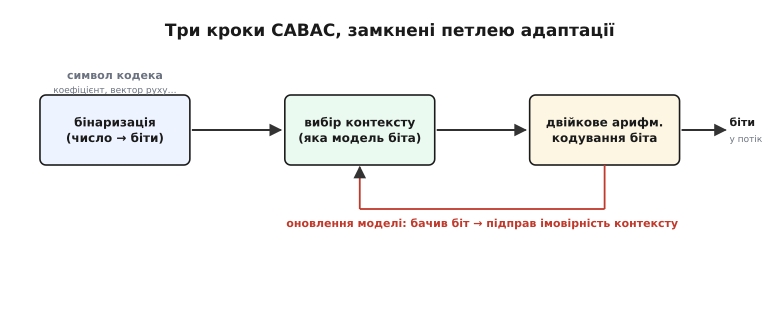
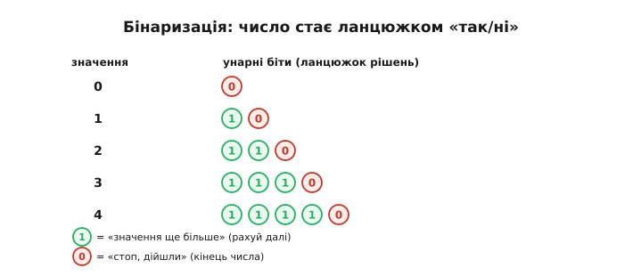
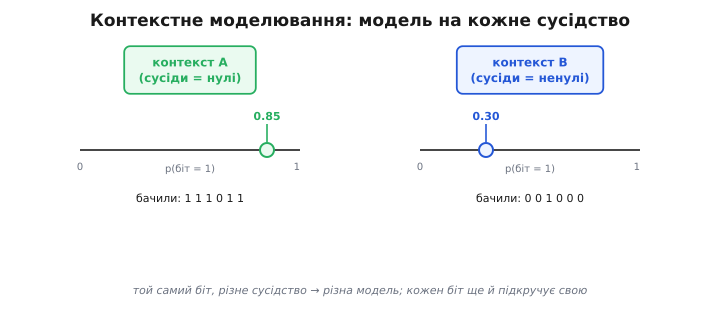
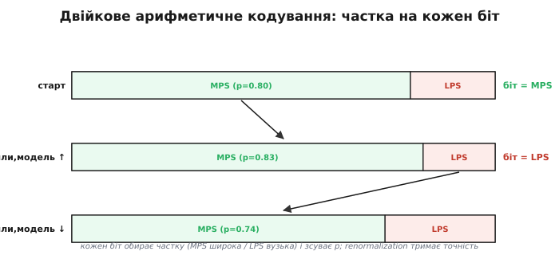
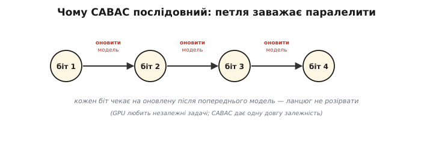

# CABAC

<preknowlist>
- [Арифметичне кодування](topic:algorithms/arithmetic-coding) — стиснення звуженням інтервалу [0, 1), що платить за символ дробову, а не цілу кількість бітів; CABAC — його двійковий різновид.
- [Ентропія](topic:algorithms/entropy) — середня несподіванка символу в бітах і межа, нижче якої без втрат не стиснути; чесна ціна символу — −log₂(p).
</preknowlist>

Кодек на кшталт [H.264](root:embedded/mjpeg-vs-h264) робить величезну роботу, аби описати кадр якомога коротше: розкладає його на блоки, передбачає рух, перетворює й квантує. Та наприкінці лишається купа чисел — квантовані коефіцієнти, вектори руху, прапорці режимів — і їх ще треба **записати бітами**. Це останній рубіж стиснення: скільки бітів витратити на самі числа. Тут і стоїть **CABAC** (*Context-Adaptive Binary Arithmetic Coding* — «контекстно-адаптивне двійкове арифметичне кодування»), ентропійний рушій H.264 і його наступника H.265. Він тисне ці числа впритул до [ентропії](topic:algorithms/entropy) — тієї межі, нижче якої без втрат не можна, — і робить це розумніше за простіших попередників на цілих 10–15% бітрейту. Розберімо, як саме, бо за абревіатурою ховається три чіткі кроки, кожен зі своєю ясною ідеєю.

### Навіщо окремий ентропійний рушій

Спершу — чому це взагалі окрема, важлива деталь, а не дрібниця наприкінці. Уся попередня робота кодека лише **готує** числа: робить їх дрібними, робить нулі частими. Але саме по собі це бітів не економить — поки числа лежать як є, кожне займає свою фіксовану розрядність. Виграш дає лише останній крок, що бере цю підготовлену статистику й **перетворює перекіс на короткі коди**: частому — мало бітів, рідкісному — багато. Що ближче цей крок підбереться до ентропії, то менше важитиме потік за тієї самої картинки.

H.264 пропонує тут два рушії на вибір. Простіший — **CAVLC** (*Context-Adaptive Variable-Length Coding*), різновид кодування зі змінною довжиною слова, рідня [коду Гаффмана](topic:algorithms/huffman-coding): він дає кожному символу окреме кодове слово з **цілої** кількості бітів. Складніший — CABAC. Він побудований не на готових кодових словах, а на [арифметичному кодуванні](topic:algorithms/arithmetic-coding), тож платить за символ **дробову** кількість бітів і тому тулиться до ентропії там, де CAVLC переплачує на округленні. Ось чому профілі H.264, де важить кожен біт (Main, High), беруть CABAC; найпростіший Baseline, де цінують легкість декодування, лишається на CAVLC.

> 🔧 **Навіщо це.** На дроні з вузьким радіоканалом ці 10–15% — не косметика. Той самий політ у тій самій якості влізе у вужчу смугу, або в ту саму смугу влізе вища роздільність. Платня — складніший декодер, що жере більше тактів процесора; тому вибір «CABAC чи CAVLC» — це прямий розмін бітрейту на обчислення, і його роблять свідомо під конкретний борт.

### Чому «двійкове»

Перше слово в назві, яке варто зрозуміти, — **binary**, двійкове. [Класичне арифметичне кодування](topic:algorithms/arithmetic-coding) працює з алфавітом будь-якого розміру: ділить інтервал `[0, 1)` на стільки часток, скільки символів. Це гнучко, але дорого — ділення інтервалу пропорційно ймовірності вимагає **множення** на кожен символ, а множень кодек робить мільйони на кадр. CABAC робить радикальне спрощення: він кодує **лише біти**, тобто алфавіт рівно з двох значень — 0 і 1. Один біт ділить інтервал лише на **дві** частки.

Чому це виграш? Бо двійкове рішення можна звузити **без множення**. Коли часток дві, «помножити ширину на ймовірність» вироджується у вибір з невеликої **готової таблиці**: за поточним станом моделі й кількома старшими бітами поточної ширини беруть наперед пораховане число. Мільйони множень перетворюються на мільйони звернень до таблиці — а це для апарата незрівнянно дешевше. Саме ця **множення-вільна** арифметика й зробила CABAC придатним для реального заліза, а не лише для теорії.

Та якщо рушій їсть лише біти, а кодувати треба числа — коефіцієнт може бути і 0, і 47, і −3, — то спершу кожне число доводиться **перекласти на біти**. Це і є перший із трьох кроків.


*Три кроки CABAC, замкнені петлею адаптації. Будь-яке число кодека (коефіцієнт, вектор руху) спершу стає ланцюжком бітів (бінаризація), кожен біт дістає свою модель імовірності (вибір контексту), і нею кодується (двійкове арифметичне кодування). Червона стрілка — головна родзинка: щойно біт закодовано, його значення підправляє модель того контексту, тож наступного разу прогноз точніший.*

### Крок перший: бінаризація

**Бінаризація** (*binarization*, від латинського *binarius* — «подвійний») — це переклад числа на ланцюжок двійкових рішень. Не просто запис числа у двійковій системі: ланцюжок будують так, щоб **частина бітів була сильно перекошена** в бік 0 чи 1, бо саме на перекосі арифметичне кодування й заробляє.

Найпростіша схема — **унарний код**: число `n` записують як `n` одиниць і завершальний нуль. Нуль — це `0`, одиниця — `10`, двійка — `110`, трійка — `1110`. Кожна одиниця читається як «значення ще більше, рахуй далі», а нуль — як «стоп, дійшли». Чому саме так, а не звичним двійковим записом? Бо в реальних даних кодека маленькі значення **набагато частіші** за великі: після квантування переважають нулі та одиниці. За унарного коду це означає, що перший біт майже завжди «стоп або один крок» — він сильно перекошений, і арифметичний рушій стискає його майже задарма. Звичайний двійковий запис такого перекосу не дав би: його біти ближчі до рівноймовірних.


*Бінаризація: число стає ланцюжком «так/ні». Кожна одиниця означає «значення ще більше», нуль — «кінець числа». Маленькі значення (а вони найчастіші) дають короткий ланцюжок із сильно перекошеним першим бітом — і цей перекіс арифметичне ядро перетворює на частки біта.*

Реальний CABAC не обмежується голим унарним кодом — для різних величин він бере різні, дібрані під їхню статистику схеми (зрізаний унарний, коди Голомба–Райса, експоненційний код Голомба для довгих хвостів). Та суть скрізь одна: розкласти число на біти так, щоб **виявити в них перекіс**, який далі буде що стискати. Як влаштовані ці схеми — у [детальній версії](topic:algorithms/cabac/detail).

### Крок другий: контекстне моделювання

Тепер у нас є потік бітів. Можна було б кодувати кожен якоюсь однією усередненою ймовірністю — але це й робить простий кодер, і саме тут CABAC його обходить. Його друга ідея: **ймовірність біта залежить від сусідства**, і її треба оцінювати окремо для кожного типу сусідства. Це і є **контекст** (*context*, латинське *contextus* — «зв'язок, сплетіння»).

Розгляньмо чому. Візьмемо прапорець «чи цей блок коефіцієнтів ненульовий». Якщо сусідні блоки **порожні** (саме тло, нічого не діється), то й цей майже напевно порожній — біт майже завжди 0. А якщо сусіди **повні деталей** (контур, текстура), то й цей радше ненульовий — біт частіше 1. Той самий за змістом біт має **різну ймовірність** залежно від того, що коїться поряд. Кодувати їх однією усередненою ймовірністю — марнувати стиск: усереднення розмиває обидва чіткі перекоси в одну мляву середину.

Тому CABAC тримає **окрему модель імовірності на кожен контекст** — фактично окреме число «наскільки ймовірно, що цей біт = 1» для кожного типу сусідства. Перед кодуванням біта він дивиться на вже відомих сусідів, **обирає відповідний контекст** і бере саме його модель. У H.264 таких контекстів кілька сотень — на кожну роль біта в кожній типовій ситуації.


*Контекстне моделювання: модель на кожне сусідство. Той самий за роллю біт за різного сусідства має різну ймовірність бути одиницею, тож CABAC тримає для кожного контексту свою модель. Кодуючи біт, він спершу обирає контекст за вже відомими сусідами, а тоді кодує біт саме його ймовірністю.*

І тут друга половина слова **adaptive**, адаптивне. Моделі не задані наперед таблицею — вони **вчаться на льоту**. Щойно біт закодовано, його справжнє значення **підправляє** модель цього контексту: був 1 — трохи піднімаємо ймовірність одиниці, був 0 — опускаємо. Кодер і декодер роблять це **синхронно й однаково**, тож обидва завжди мають ту саму, дедалі точнішу модель, не передаючи її одне одному ні байтом. Кодек починає кадр із грубих стартових оцінок, а до кінця кадру моделі вже підлаштовані під конкретний матеріал — спокійне небо чи рясний ліс. Саме контекстне моделювання дає більшу частину виграшу CABAC; решта — заслуга чистоти арифметичного ядра.

> 🔧 **Навіщо це.** Адаптація — причина, чому CABAC такий добрий саме на **однорідних** ділянках, яких на відео більшість: рівне небо, стіна, асфальт. На такому матеріалі моделі швидко стають дуже впевненими (біт майже завжди 0), і ядро витрачає на кожен такий біт **соті частки** біта. Простіший кодер з фіксованими словами цього не вміє — він віддав би цілий біт там, де чесна ціна — близько нуля.

### Крок третій: двійкове арифметичне кодування

Маємо біт і його ймовірність із обраного контексту. Лишилось записати — і тут працює те саме **звуження інтервалу**, що й у [звичайному арифметичному кодуванні](topic:algorithms/arithmetic-coding), тільки на двох частках. Поточний робочий діапазон ділять на дві: широку — для **MPS** (*Most Probable Symbol*, найімовірніший біт) — і вузьку — для **LPS** (*Least Probable Symbol*, найрідкісніший). Прийшов MPS — переходимо в широку частку, інтервал звужується **мало**, тож додається мало бітів. Прийшов рідкісний LPS — переходимо у вузьку, інтервал звужується **сильно**, біт коштує дорого. А ціна виходить рівно `−log₂(p)` — Шеннонова, дробова, не округлена до цілого.


*Двійкове арифметичне кодування: частка на кожен біт. Діапазон щоразу ділять на широку MPS-частку й вузьку LPS-частку за поточною ймовірністю. Біт MPS звужує мало (дешево) і додає впевненості моделі; рідкісний LPS звужує сильно (дорого) і збиває модель назад. Renormalization підхоплює діапазон, тільки-но він замалий, виштовхуючи готові біти в потік.*

Дві деталі роблять це придатним для заліза. Перша — те саме **множення-вільне** ділення: ширину LPS-частки не множать, а беруть з таблиці за станом моделі й старшими бітами діапазону. Друга — **renormalization** (від латинського *re-* — знову + *norma* — міра): коли діапазон від звужень стає замалим для цілочисельної точності, його **подвоюють**, а старші біти, що вже не зміняться, **виштовхують у потік**. Так точність ніколи не вичерпується, а біти течуть рівним струмком. Це ядро тримає лише кілька регістрів стану — діапазон, нижню межу й набір моделей, — жодних таблиць кодових слів.

### Worked-приклад: один коефіцієнт від числа до бітів

Пройдімо всі три кроки на одному значенні. Хай кодек має записати коефіцієнт `3`, а сусідні блоки порожні, тож ми в контексті «навколо тихо», де модель уже впевнена: `p(MPS=0) = 0.8`, MPS тут — нуль.

**Крок 1 — бінаризація.** Унарний код числа `3` — це `1110`:

```
3  →  1 1 1 0
      │ │ │ └ «стоп»  (нуль)
      └─┴─┴── «ще більше» × 3  (одиниці)
```

**Крок 2 — вибір контексту.** Сусіди тихі → беремо контекст «тихо», його модель: найімовірніший біт MPS = 0 з `p = 0.8`. Тобто рідкісний LPS — це 1.

**Крок 3 — кодування біт за бітом** із оновленням моделі після кожного. Поведімо діапазон як `[low, low+range)`; стартова ширина `range = 1.0`, ділимо `range` на MPS-частку `0.8` і LPS-частку `0.2`:

```
біт = 1  (це LPS!)  → вузька частка 0.2
   range: 1.000 → 1.000 · 0.2 = 0.200      (дорого: звузили сильно)
   модель: був LPS → впевненість падає, p(MPS) 0.80 → 0.74

біт = 1  (LPS знову) → вузька частка
   range: 0.200 → 0.200 · 0.26 = 0.052
   модель: p(MPS) 0.74 → 0.69

біт = 1  (LPS)        → вузька частка
   range: 0.052 → 0.052 · 0.31 = 0.016
   модель: p(MPS) 0.69 → 0.64

біт = 0  (це MPS)     → широка частка 0.64
   range: 0.016 → 0.016 · 0.64 = 0.010     (дешево: звузили мало)
   модель: був MPS → впевненість росте, p(MPS) 0.64 → 0.66
```

Ось де видно суть. Модель пророкувала нулі, а перші три біти виявилися рідкісними одиницями — і кодер **чесно за них переплатив**, бо щоразу брав вузьку частку. Зате він **навчився**: з кожним несподіваним бітом упевненість у нулі спадала (`0.80 → 0.74 → 0.69 → 0.64`), тож якби одиниці тривали, вони дешевшали б. А останній біт — нуль, як модель і чекала, — коштував копійки. Декодер, маючи ту саму стартову модель і ті самі правила оновлення, повторить ці поділи навспак: щоразу гляне, у яку частку діапазону впало число, відновить біт, **підправить модель так само** — і збере назад `1110`, а з нього — число `3`. Жодна модель між ними не передавалася; вони йшли крок у крок.

> 🔧 **Навіщо це.** Перепад ціни добре видно: ті самі чотири біти на однорідній ділянці, де модель **не** помилялася б, коштували б у рази менше. Тому реальний бітрейт CABAC так залежить від матеріалу — спокійна сцена тисне чудово, рясна деталями чи шумна (наприклад, зерниста нічна зйомка з дрона) дає кодеру багато «несподіванок» і важчий потік. Знаючи це, бітрейт під канал прикидають саме на **найгіршій** очікуваній сцені, не на середній.

### Ціна могутності: послідовність

За все платиться, і головна плата CABAC — він **майже не паралелиться**. Причина — та сама петля адаптації, що дає йому силу. Щоб закодувати біт, потрібна **актуальна** модель його контексту; а модель стає актуальною лише **після** того, як закодовано попередній біт того контексту. Виходить жорсткий ланцюг залежностей: біт за бітом, кожен чекає на оновлення від попереднього.


*Чому CABAC послідовний. Кожен біт чекає на модель, оновлену після попереднього, тож ланцюг не розірвати на незалежні шматки. Сучасні процесори й особливо GPU прискорюють задачі, розклавши їх на багато незалежних потоків, — а CABAC дає одну довгу залежність, яку нічим не розпаралелити.*

Для [CAVLC](topic:algorithms/huffman-coding) такої біди нема: готові кодові слова можна зчитувати майже незалежно. А CABAC по своїй природі **строго послідовний**, і це боляче саме там, де треба гнати багато пікселів за такт — у декодерах високої роздільності й високої частоти кадрів. Тому реалізують його дуже хитро: тримають усе ядро на спеціалізованому блоці заліза, виконують кілька дрібних дій за такт, виносять рідкісні рівноймовірні біти (знак, довгі хвости чисел) в **обвідний bypass-режим**, де модель не чіпають зовсім, тож такі біти можна обробляти швидше й гуртом. Як саме борються з цим вузьким місцем — і що тут змінив H.265 — у [детальній версії](topic:algorithms/cabac/detail).

### Від H.264 до H.265

CABAC виявився настільки вдалим, що в H.265 (*HEVC*) його лишили **єдиним** ентропійним рушієм — вибору «CABAC чи CAVLC» більше нема, бо менший виграш CAVLC не виправдовував підтримки двох гілок. Та сам рушій помітно **переробили заради швидкості**: укладачі стандарту цілеспрямовано зменшували кількість бітів, що мусять іти через повільну контекстну колію, і навпаки — побільшили частку дешевих bypass-бітів та згрупували їх, щоб залізо ковтало їх пачками. Це прямо лікувало те саме вузьке місце — послідовність, — бо HEVC з його 4K-кадрами потребує **набагато більшої** пропускної здатності декодера, ніж H.264. Ідея лишилася та сама — три кроки й петля адаптації, — а інженерія навколо неї змінилася під новий масштаб.

### Звідки CABAC узявся

Думку «адаптивно оцінювати ймовірності з контексту й кодувати їх двійковим арифметичним ядром» вели кілька груп у 1990-х; зокрема, близьку до сучасної схему 1999 року описали Янджун Ю (тоді Texas Instruments) з Янґ Ґап Квоном та Антоніо Ортеґою (Університет Південної Каліфорнії). Та **робочий CABAC**, який пішов у стандарт, довели до пуття інженери берлінського інституту **Fraunhofer HHI** (Генріха Герца) — **Детлев Марпе, Гайнц Шварц і Томас Віганд**; їхній метод увійшов у H.264/AVC, коли стандарт ухвалили **2003 року**. Це класичний приклад того, як винахід **колективний**: ідея визрівала в кількох місцях, а усталеною технологією її зробила конкретна команда, яка довела її до робочої, апаратно-придатної форми й провела крізь комітет стандарту.

Варто розрізняти й сам клас методів. CABAC — це **арифметичне** ядро; його родич **MQ-кодер** живе в JPEG2000 і JBIG2, а молодший швидкий нащадок тієї самої ідеї — [асиметричні системи числення (ANS)](topic:algorithms/asymmetric-numeral-systems) — стоїть у Zstandard і JPEG XL. Усі вони про одне: перетворити перекіс імовірностей на положення в інтервалі, платячи за символ дробову ціну.

---
