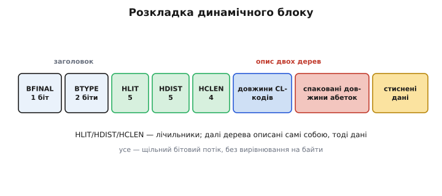
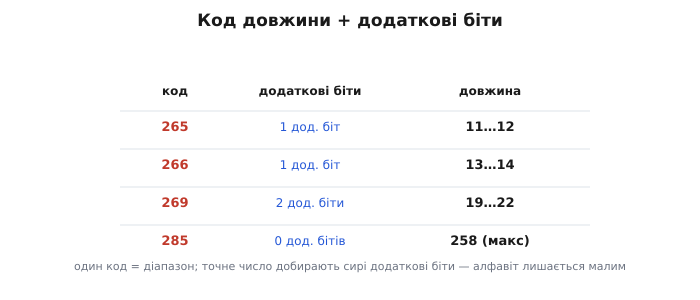
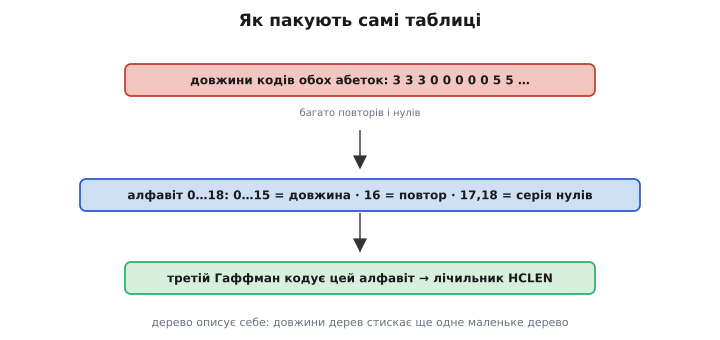
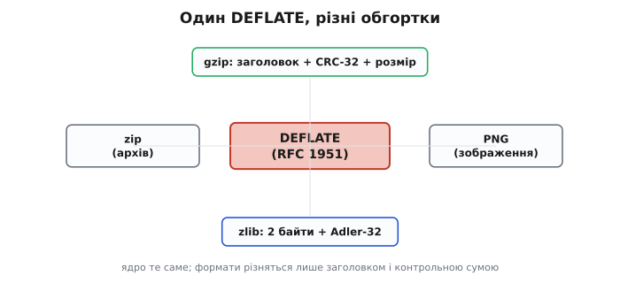

# DEFLATE (докладно)

Базовий погляд на DEFLATE — «спершу [LZ77](book:algorithms/lz77) б'є повтори, тоді [Гаффман](book:algorithms/huffman-coding) дешево пише рештку; дані ріжуться на блоки трьох типів» — лишимо за вступ. Тут ідемо в самі гвинтики: як блок розкладено по бітах до останньої дрібниці; як влаштовані дві абетки й навіщо їм **додаткові біти**; як динамічне дерево примудряється **описати само себе** в заголовку блоку — і чому для цього знадобився ще **третій** Гаффман над «кодами довжин кодів»; чому межу вікна поставили рівно на 32 КБ; як кодер вирішує, котрий тип блоку взяти; і нарешті — чим відрізняються обгортки, у які той самий DEFLATE загортають gzip, zlib і PNG, та яку контрольну суму кожна носить.

## Бітовий потік: усе впритул, без байтових меж

Перше, що треба прийняти: стиснений потік DEFLATE — це **суцільна низка бітів**, а не охайних байтів. Коди Гаффмана різної довжини, лічильники по 4–5 бітів, окремі прапорці — усе пакується **впритул**, один за одним, без вирівнювання на байт. Декодер читає потік **по біту**, не сподіваючись, що щось почнеться на круглій межі. Виняток єдиний — блок типу «без стиску»: перед ним потік **доганяють нулями до межі байта**, бо далі йдуть сирі байти, а їх читати побітно безглуздо.

Порядок бітів усередині елемента має значення й легко плутає. Прапорці та лічильники (як-от `BTYPE`, `HLIT`) пакуються **молодшим бітом уперед**: перший прочитаний біт — наймолодший. А самі **коди Гаффмана** — навпаки, **старшим бітом уперед**, бо так їх зручно нарощувати під час обходу дерева. Ця подвійність — класичне джерело помилок у саморобних декодерах: половину полів читаєш в один бік, половину в інший.

## Розкладка блоку по полях

Кожен блок починається трьома бітами заголовка. Перший — **BFINAL**: одиниця, якщо це **останній** блок у потоці (інакше нуль, і за цим блоком буде ще). Далі два біти — **BTYPE**, тип блоку: `00` — без стиску, `01` — фіксований Гаффман, `10` — динамічний Гаффман, `11` — заборонено (помилка). Усе подальше залежить від BTYPE.

Для **типу 00** одразу йде вирівнювання до байта, потім 16-бітне поле **LEN** (скільки сирих байтів далі), потім **NLEN** — той самий LEN, але побітно інвертований, як проста перевірка цілості, і нарешті самі LEN байтів даних. Звідси, до речі, стеля нестисненого блоку — **65 535 байтів** (максимум 16-бітного LEN).

Для **типу 01** жодного опису таблиць немає: коди беруться з фіксованої, прописаної в стандарті. Одразу за заголовком ідуть **дані блоку** — низка кодів Гаффмана, що тягнеться, аж доки не трапиться код символу **256 (кінець блоку)**.

Найбагатший — **тип 10**. За трьома бітами заголовка йдуть три лічильники, а тоді — **самоопис двох дерев**, і лише потім дані. Розгляньмо цей тип докладно, бо в ньому вся суть.


*Поля динамічного блоку зліва направо. Три біти заголовка (BFINAL+BTYPE), три лічильники HLIT/HDIST/HCLEN, далі самоопис двох дерев у два шари (спершу довжини «кодів довжин», тоді спаковані довжини самих абеток) і нарешті стиснені дані до символу «кінець блоку». Усе — щільний бітовий потік без байтових меж.*

## Дві абетки в усій повноті

DEFLATE кодує дані двома деревами над двома абетками. Розберімо обидві точно.

**Абетка літер-довжин** має **286** значень із можливих 288. Значення **0–255** — це звичайні байти-літери. Значення **256** — маркер кінця блоку. Значення **257–285** — **коди довжин** збігу. Двадцять дев'ять кодів довжин покривають усі довжини від 3 до 258 — але не один-в-один: на самі короткі довжини є окремі коди, а довші згруповані в **діапазони**, де точне число добирають додаткові біти (про них зараз).

**Абетка відступів** має **30** значень, **0–29**. Тридцять кодів покривають усі відступи від 1 до 32 768 — знову ж таки діапазонами з добором додатковими бітами.

Чому довжина обмежена саме **258**, а відступ — **32 768**? Це прямі наслідки конструкції. Відступ — це межа ковзного вікна (32 КБ = 32 768), питання лише в тому, як далеко назад сягати. Довжина 258 — стеля, яку обрали як розумний максимум одного збігу: довший повтор просто розіб'ють на кілька збігів. Числа не випадкові, а підігнані так, щоб обидві абетки лишалися маленькими (а отже, їхні дерева — дешевими), а діапазони з додатковими бітами докривали все проміжне.

### Додаткові біти: один код на цілий діапазон

Якби кожна довжина від 3 до 258 і кожен відступ від 1 до 32 768 мали власний код Гаффмана, абетки роздулися б до сотень і тисяч символів — а велика абетка означає велике дерево й довгий його опис. DEFLATE уникає цього хитро: код покриває не одне число, а **діапазон**, і точне значення в межах діапазону добирають кілька **сирих додаткових бітів** (*extra bits*), записаних одразу за кодом. Ці біти **не кодуються Гаффманом** — вони лежать як є, бо всередині діапазону значення вважаються рівноймовірними, і стискати їх нічим.

Подивись на приклад. Код довжини **265** означає не «довжина 265», а «довжина 11 або 12», і **один** наступний сирий біт каже, котра саме. Код **269** — це вже діапазон «19–22», і добирають його **два** біти. А найдовші збіги навпаки: код **285** — це рівно довжина 258, **нуль** додаткових бітів. Що рідкісніший і довший збіг, то ширший діапазон і більше добіркових бітів — бо точність там менш важлива.


*Код плюс додаткові біти. Один код Гаффмана покриває цілий діапазон довжин (чи відступів), а точне значення в діапазоні добирають кілька сирих, нестиснених бітів. Так абетка лишається крихітною (29 кодів довжин, 30 кодів відступів) і докриває всі значення до 258 та 32768 відповідно.*

> 🔧 **Навіщо це.** Прийом «код діапазону + сирі біти» — не вигадка лише DEFLATE; він трапляється всюди, де треба кодувати число зі **степеневим** розподілом (малі значення часті, великі рідкісні). Гаффман дешево кодує **порядок величини** (котрий діапазон), а точне зміщення всередині йде сирими бітами, бо несе мало інформації. Побачивши цю схему в чужому форматі — від JPEG до відеокодеків, — упізнаєш ту саму ідею: не марнуй дерево на те, що й так майже рівноймовірне.

## Дерево, що описує само себе

Тепер найвитонченіше. У динамічному блоці кодер будує **власні** дерева під цей блок — отже, мусить переслати декодеру їхній опис. Дерево однозначно задається **набором довжин кодів**: завдяки [канонічному Гаффману](book:algorithms/huffman-coding) з самих довжин обидві сторони відновлюють ті самі коди, тож досить переслати **по одному числу-довжині на символ**. Здавалося б, усе просто: випиши 286 довжин для першої абетки й 30 для другої — і готово.

Та тут DEFLATE робить ще один виток ощадливості. Ці довжини самі по собі — послідовність чисел (кожне від 0 до 15: нуль означає «символ не вживається», решта — довжина коду), і вона теж **надлишкова**: повна нулів (багато символів у блоці не трапляються) і повторів (сусідні символи часто мають однакову довжину). Гріх не стиснути й її. Тому довжини кодів кодуються **ще одним, третім Гаффманом** — над спеціальною маленькою абеткою.

### Абетка «кодів довжин кодів»

Ця третя абетка має **19** символів, 0–18, і зветься абеткою **кодів довжин** (*code length codes*). Її символи:
- **0–15** — це буквально довжина коду (0 = символ не вживається, 1–15 = довжина в бітах);
- **16** — «повтори **попередню** довжину 3–6 разів» (скільки саме — кажуть 2 додаткові біти);
- **17** — «постав **нуль** 3–10 разів поспіль» (3 додаткові біти);
- **18** — «постав **нуль** 11–138 разів поспіль» (7 додаткових бітів).

Символи 16, 17, 18 — це маленький [RLE](book:algorithms/rle) усередині опису дерева: довгі серії однакових довжин (надто нулів) згортаються в один символ із лічильником. Саме тому опис двох великих дерев займає в заголовку лічені байти, а не сотні.


*Дерево описує себе у три шари. Довжини кодів двох головних абеток — це послідовність чисел 0–15, повна нулів і повторів. Її стискають алфавітом 0–18, де 16/17/18 — це RLE-повтори (надто серій нулів). Цей алфавіт, своєю чергою, кодує третій, маленький Гаффман, чий розмір задає лічильник HCLEN. Глибина в три поверхи — плата за те, щоб опис двох дерев коштував байти, а не сотні байтів.*

### Три лічильники й хитрий порядок

Щоб декодер знав, скільки чого читати, динамічний блок починається трьома лічильниками:
- **HLIT** (5 бітів) — скільки кодів у абетці літер-довжин, **мінус 257**; тобто реальне число від 257 до 286.
- **HDIST** (5 бітів) — скільки кодів у абетці відступів, **мінус 1**; реально від 1 до 32.
- **HCLEN** (4 біти) — скільки довжин у третій абетці, **мінус 4**; реально від 4 до 19.

Скрізь «мінус щось» — бо менше за цей мінімум значень не буває, тож відлік починають із нього й економлять біти лічильника. Далі йдуть **(HCLEN+4) по 3 біти** — довжини кодів **третьої** абетки. І ось дрібниця, що ламає інтуїцію: ці 19 довжин записані **не** по порядку 0,1,2,…,18, а в особливому, прописаному в стандарті порядку:

```
16, 17, 18, 0, 8, 7, 9, 6, 10, 5, 11, 4, 12, 3, 13, 2, 14, 1, 15
```

Логіка проста, хай і неочевидна: символи, що **вживаються майже завжди** (повтори 16–18 і середні довжини коло 7–9), стоять **спереду**; рідкісні крайні довжини (1, 15) — у хвості. Тоді при малому HCLEN відрізають саме хвіст рідкісного, і нічого корисного не губиться. Прочитавши ці довжини, декодер канонічно будує третє дерево; ним розкодовує довжини першої та другої абеток (з RLE-повторами 16–18); і вже маючи всі довжини — канонічно будує два головні дерева. Аж тепер можна читати дані.

## Як працює декодер: один прохід, без озирання

Складність опису дерев оманлива — щойно дерева відновлено, **декодування блоку до смішного просте й лінійне**. Декодер крутить один цикл: читає з потоку наступний код **першим** деревом (літери-довжини) і дивиться, що вийшло.

Якщо код — значення **0–255**, це жива літера: випльовуємо цей байт у вихід і йдемо по наступний код. Якщо код — **256**, блок скінчився: виходимо з циклу. А якщо код **257–285**, це початок збігу — і тут робота на кілька рухів. Спершу за кодом визначаємо базову довжину й, прочитавши скільки треба **додаткових бітів**, добираємо точну довжину. Потім читаємо **другим** деревом код відступу, так само добираємо його додатковими бітами — і дістаємо пару (довжина, відступ). Лишається **скопіювати**: відлічуємо від кінця вже відновленого виходу `відступ` байтів назад і копіюємо звідти `довжина` байтів **уперед**, байт за байтом.

```c
// серце декодера DEFLATE: out[] — уже відновлені байти, pos — їх кількість
int sym = decode_symbol(&bits, &lit_tree);   // код першим деревом
if (sym < 256) {
    out[pos++] = (unsigned char)sym;          // літера — просто пишемо
} else if (sym == 256) {
    break;                                     // 256 — кінець блоку
} else {
    int len  = length_base[sym - 257]  + read_bits(&bits, length_extra[sym - 257]);
    int dcode = decode_symbol(&bits, &dist_tree);
    int dist = dist_base[dcode] + read_bits(&bits, dist_extra[dcode]);
    for (int i = 0; i < len; i++) {            // копіюємо байт за байтом
        out[pos] = out[pos - dist];            // джерело може наздоганяти само себе
        pos++;
    }
}
```

Зверни увагу на рядок копіювання: `out[pos - dist]` читається **щойно** перед записом `out[pos]`, тож коли `dist` менший за `len`, джерело потрапляє на **вже скопійовані** в цьому ж циклі байти. Саме це й дає періодичне розгортання (як `ABABABAB` з одного збігу): наївне «скопіюй блок пам'яті одним махом» тут зламалося б, а побайтова копія — ні. Увесь блок проходиться **раз**, зліва направо, без жодного повернення назад — звідси й швидкість розпакування DEFLATE.

## Як кодер обирає тип блоку

Три типи блоку — це вибір, і робить його кодер на **кожен блок окремо**, керуючись простим питанням: **що дасть найкоротший результат**. Зазвичай кодер прикидає (точно чи приблизно) розмір блоку в кожному з варіантів і бере найменший.

Логіка приблизно така. Якщо дані погано стискаються (вже стиснені чи близькі до випадкових), і фіксований, і динамічний Гаффман дадуть **більше** за сирий розмір — тоді перемагає **тип 00**, без стиску: чесніше покласти як є, ніж роздути. Якщо блок добре стискається, але **короткий**, виграш від ідеально підігнаних кодів не покриє вартості опису дерев — тоді вигідніший **тип 01**, фіксований: таблиця задарма. А якщо блок добре стискається й **довгий** — вартість опису дерев розмажеться по всіх даних і окупиться, а самі коди сидітимуть на дні ентропії: перемагає **тип 10**, динамічний. На практиці більшість байтів у типовому файлі лягає саме в динамічні блоки.

Сюди ж лягає й **межа блоку**: кодер не зобов'язаний робити блоки рівними. Він може закрити блок там, де **змінюється характер даних** (скажімо, текст переходить у двійкове сміття), щоб кожен блок дістав дерева під свою статистику. Це теж важіль якості: розумна нарізка на блоки дає трохи щільніший результат, ніж сліпа нарізка через рівні проміжки.

## Чому вікно — рівно 32 768

Межа відступу — 32 768 байтів (2¹⁵) — не кругле число з повітря, а наслідок арифметики кодування. Відступ кодується **15 бітами** базового значення (плюс добіркові), а 15 бітів якраз і дають діапазон до 32 768. Більше вікно вимагало б ширшого поля відступу — тобто **кожен** збіг подорожчав би на біт-два, навіть короткі й близькі, яких більшість. Менше вікно здешевило б відступи, але проґавило б дальні повтори.

32 КБ — це компроміс, обраний під дані й пам'ять початку 1990-х: достатньо великий, щоб упіймати майже всі повтори, які реально трапляються в тексті й коді на такій дистанції, і достатньо малий, щоб і таблиця пошуку, і саме поле відступу лишалися скромними. Сучасні формати, не зв'язані сумісністю (наприклад, ширші словникові кодери), беруть вікна в мегабайти — але DEFLATE лишився на 32 КБ заради зворотної сумісності з мільярдами вже створених файлів.

## Обгортки: один DEFLATE, різні конверти

Сам DEFLATE (RFC 1951) описує лише **стиснений потік** — і нічого більше: ні звідки він узявся, ні чи не побився дорогою. На практиці голий потік майже ніколи не вживають — його загортають у формат-конверт, що додає **заголовок** (метадані) і **контрольну суму** (перевірку цілості). Конвертів кілька, і їхня різниця — саме в цих двох речах, бо ядро в усіх однакове.

**zlib** (RFC 1950) — найлегша обгортка, створена для пам'яті й каналів зв'язку. Усього **2 байти** заголовка (метод і прапорці) спереду та **4 байти Adler-32** в кінці. Adler-32 — навмисно **швидка** контрольна сума (дві прості суми за модулем), дешевша за CRC, хоч і трохи слабша на дуже коротких даних. zlib сидить, зокрема, всередині **PNG**: там кожен потік пікселів стиснено саме zlib-обгорнутим DEFLATE.

**gzip** (RFC 1952) — обгортка для **файлів на диску**. Заголовок більший, **10+ байтів**: сигнатура `1F 8B`, мітка часу, прапорці, за потреби — ім'я файлу. У кінці — **4 байти CRC-32** і ще 4 байти **ISIZE** (розмір вихідних даних за модулем 2³²). CRC-32 повільніша за Adler-32, зате надійніше ловить помилки — для довгого файлу на диску це виправдано.

**zip** — це вже **формат архіву**: каталог записів, у кожного — ім'я, розміри, своя CRC-32 і метод стиску. Самі дані кожного запису найчастіше стиснені тим самим DEFLATE. Тобто zip не «інший стиск», а контейнер, що носить багато DEFLATE-потоків плюс довідник про них.


*Один DEFLATE, різні конверти. Ядро (RFC 1951) однакове скрізь; формати різняться лише заголовком і контрольною сумою. zlib — мінімум (2 байти + Adler-32), для пам'яті й каналів, усередині PNG. gzip — для файлів (10+ байтів + CRC-32 + розмір). zip — контейнер-архів, що носить багато DEFLATE-потоків із власними CRC.*

> 🔧 **Навіщо це.** Ця різниця конвертів — джерело реальних плутанин у роботі. Бібліотека на кшталт zlib уміє і «сирий» DEFLATE, і zlib-, і gzip-обгортку — і якщо подати потік не з тим очікуванням заголовка, декодер спіткнеться на перших же байтах (`1F 8B` для gzip проти `78 xx` для zlib). Коли власноруч стикуєш стиск між системами — браузер, бекенд, прошивка — спершу домовся **про обгортку**, а не лише «стиснемо DEFLATE»: ядро в усіх однакове, та конверт мусить збігтися, інакше навіть правильно стиснені дані не розпакуються.

## Де DEFLATE впирається в стелю

DEFLATE стоїть скрізь три десятиліття не тому, що його не можна перевершити, а тому, що його **вже всюди впровадили** — і зворотна сумісність важить більше за кілька зайвих відсотків стиску. А перевершити його **можна**, і сучасні формати це роблять, послаблюючи саме ті компроміси, що їх DEFLATE зафіксував під залізо 1990-х.

Найперше — **вікно**. 32 КБ ловлять близько розташовані повтори, та сліпі до дальніх: якщо той самий абзац повертається через сотню кілобайтів, DEFLATE його вже не бачить і кодує наново. Новіші словникові кодери — **Zstandard** (zstd) і **Brotli** — беруть вікна в мегабайти, тож ловлять повтори на куди більшій дистанції; Brotli до того ж носить **вбудований словник** типових для вебу шматків (частих слів HTML і CSS), щоб стискати навіть дрібні файли, де власних повторів іще обмаль.

Друге — **ентропійний крок**. DEFLATE кодує рештку [Гаффманом](book:algorithms/huffman-coding), а той, як відомо, дає кожному символу **ціле** число бітів і програє ентропії до майже цілого біта, коли якийсь символ дуже частий. Сучасні формати ставлять на це місце [арифметичне кодування](book:algorithms/arithmetic-coding) або його швидкого нащадка — [ANS](book:algorithms/asymmetric-numeral-systems), що вміють віддати символу **дробову** частку біта й тому притискаються до дна щільніше. Звідси й результат: на тих самих даних zstd і Brotli стискають відчутно краще за gzip, а часто ще й швидше — бо за тридцять років і алгоритми, і залізо пішли далеко вперед.

І все ж DEFLATE нікуди не зник. Він простий, передбачуваний, поміщається в кілька кілобайтів коду, не потребує великої пам'яті — і вже вшитий у геть усе: формат PNG, протокол HTTP, файл ZIP, ядра операційних систем. Замінити його означало б переробити **половину наявних форматів** заради виграшу, який у багатьох випадках не вартий ламання сумісності. Тому новіші кодери ростуть **поряд** із ним, а не замість нього.

## Підсумок теми

Стиснений потік DEFLATE — суцільна низка бітів **без байтових меж**, де прапорці й лічильники йдуть молодшим бітом уперед, а коди Гаффмана — старшим. Кожен блок відкривають три біти (BFINAL + BTYPE), далі — залежно від типу. Дві абетки: **літери-довжини** (286 значень: 0–255 байти, 256 кінець блоку, 257–285 довжини) і **відступи** (30 значень), причому довжина й відступ задаються **кодом діапазону плюс сирими додатковими бітами** — так абетки лишаються крихітними, докриваючи все до 258 і 32 768. Динамічне дерево **описує само себе**: довжини його кодів стискають ще одним, **третім** Гаффманом над абеткою «кодів довжин» 0–18 (де 16/17/18 — RLE-повтори), а скільки чого читати, кажуть лічильники HLIT/HDIST/HCLEN (усі зі зміщенням-«мінусом»); 19 довжин третьої абетки записані в особливому порядку `16,17,18,0,8,7,…`, щоб при обрізанні гинуло лише рідкісне. Кодер обирає тип блоку й межі блоків так, щоб вийшло **найкоротше**: сирий — для вже стисненого, фіксований — для коротких, динамічний — для довгих однорідних. Вікно — рівно **32 768** (15 бітів відступу), компроміс під дані й пам'ять початку 1990-х. А голий потік (RFC 1951) на практиці загортають у конверт: **zlib** (2 байти + швидкий Adler-32, усередині PNG), **gzip** (10+ байтів + надійніший CRC-32 + розмір, для файлів) або **zip** (архів-контейнер на багато потоків). Глибше про самі прийоми — у [LZ77](book:algorithms/lz77) і [коді Гаффмана](book:algorithms/huffman-coding); про межу, нижче якої не стиснути, — в [ентропії](book:algorithms/entropy).

---
