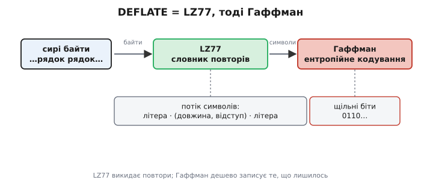
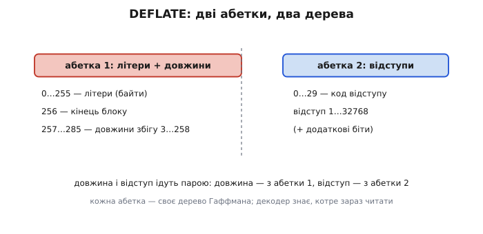
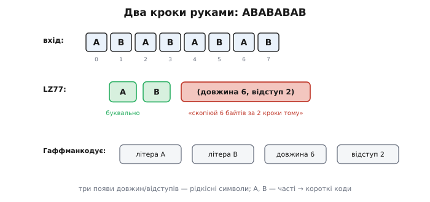
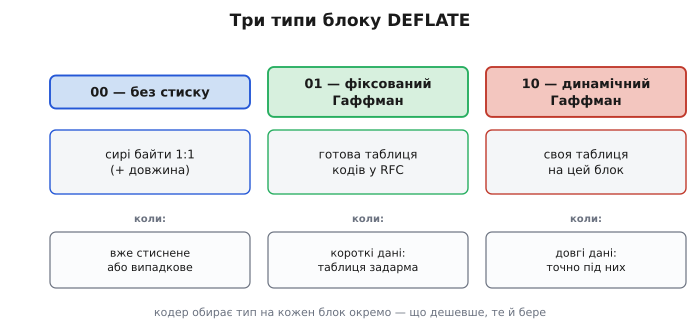
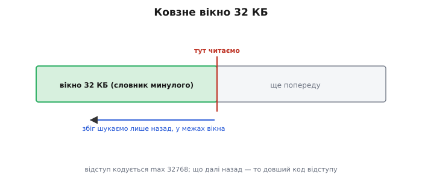

# DEFLATE

Коли архіватор ужимає теку, gzip — сторінку дорогою до браузера, а PNG — картинку, усередині майже завжди працює той самий рушій: **DEFLATE** (англ. *deflate* — «спускати повітря, здувати»; назва малює образ, як із роздутих даних випускають зайве). Він цікавий не якимось одним хитрим прийомом, а тим, що **поєднує два**, які поодинці лишають половину виграшу на столі. Один прийом полює на **повтори** — цілі шматки, що вже траплялися; другий дешево **записує** те, що лишилось, віддаючи частому короткі коди. Нарізно кожен слабкий там, де сильний інший; разом вони й дали формат, який три десятиліття стискає чи не весь стиснений без втрат потік навколо нас.

## Дві слабкості, що гасять одна одну

Згадаймо, чого бракує кожному прийому окремо. [Код Гаффмана](book:algorithms/huffman-coding) майстерно роздає бітами **окремі символи**: бачить, що літера «е» частіша за «ф», і дає їй коротший код. Та він дивиться на символи **поодинці** й сліпий до структури **між** ними. Хай у файлі сто разів поспіль повторюється слово «компресія» — для Гаффмана це просто звичні літери зі звичними частотами; він і не помітить, що то **той самий шматок** знову й знову. Повтор цілого слова він стиснути не вміє — лише трохи зекономить на кожній літері.

А [словниковий прийом LZ77](book:algorithms/lz77) — навпаки. Він якраз і живе повторами: знаходить, що поточний шматок уже траплявся раніше, і замість самих байтів пише коротке «**візьми стільки-то байтів за стільки-то кроків тому**» — пару (довжина, відступ). Сто повторів «компресія» він згорне в перший запис плюс дев'яносто дев'ять крихітних посилань назад. Та коли повторів немає — суцільний новий текст, — LZ77 мусить виписувати літери як є, **байт за байтом**, не вміючи зробити частий байт дешевшим за рідкісний. Тобто там, де сильний Гаффман, LZ77 безпорадний, і навпаки.

Звідси й думка, проста до неминучості: **пусти спершу LZ77, тоді Гаффман**. Перший викине повтори, перетворивши файл на потік «літера або посилання-назад». Другий візьме цей потік і запише його бітами — найчастішим літерам і найтиповішим посиланням дасть найкоротші коди. Перший прибирає **повтори**, другий вичавлює рештковий **дисбаланс частот**. Дві дірки затуляють одна одну.

Обидві половини існували задовго до DEFLATE — LZ77 описали 1977 року, Гаффмана ще 1952-го; новим було їх **поєднати** у швидкий формат, що його зробили **вільним** і тому розтягли всюди.

> 📜 Як саме DEFLATE розійшовся світом — через сварку, суд і свідоме рішення зробити формат відкритим, поки конкуренти грузли в патентах на [LZW](book:algorithms/lzw), — у [короткій історії PKZIP, Філа Каца та gzip](book:algorithms/deflate/hist-pkzip.md).


*Два цехи DEFLATE. LZ77 читає сирі байти й випльовує потік, де кожен елемент — або жива літера, або посилання «(довжина, відступ)» на вже бачене. Гаффман бере цей потік і кодує його щільними бітами, віддаючи частому короткі коди. Перший б'є повтори, другий — нерівні частоти; виграш множиться.*

## Що саме передають між цехами

Щоб два цехи стикувалися, потрібна спільна мова — **потік символів**, який видає LZ77 і споживає Гаффман. У DEFLATE кожен елемент цього потоку — одне з двох. Або **літера** (*literal*) — звичайний байт, що його не вдалося звести до повтору; таких 256 можливих значень, від 0 до 255. Або **збіг** (*match*) — пара з двох чисел: **довжина**, скільки байтів копіюємо, і **відступ** (*distance*), за скільки кроків назад починається джерело копії. Третього не дано: будь-який вихід LZ77 — це низка літер і збігів упереміш.

І ось ключова деталь, без якої DEFLATE не був би таким щільним. Гаффман не кодує літери, довжини й відступи трьома окремими таблицями навмання. Літери й довжини він зводить в **одну спільну абетку**: значення 0–255 — це літери, а значення 257 і далі — це **коди довжин** збігу. Чому разом? Бо в реальному потоці після обробки LZ77 літери та збіги перемежовуються, і обом вигідно ділити одне дерево частот — частий збіг дістає такий самий короткий код, як частий байт. Відступи живуть в **окремій** абетці: вони з іншого діапазону (аж до 32 тисяч), і мати для них своє дерево вигідніше. Тож абеток дві, дерев — два.

> 🔧 **Навіщо це.** Саме завдяки спільній абетці «літери + довжини» DEFLATE добре стискає і текст, і двійкові дані одним механізмом. У тексті переважають літери — і дерево віддає короткі коди їм; у даних із багатьма повторами (як-от пікселі PNG поряд) переважають збіги — і коротшають уже коди довжин. Не треба двох різних кодеків під два роди даних: одне адаптивне дерево саме підлаштовується під те, чого в блоці більше.

Лишається технічна, та важлива дрібниця: де кінчається блок? Серед значень спільної абетки є особливе — **256, «кінець блоку»** (*end-of-block*). Коли декодер витягає з потоку цей символ, він знає: поточний блок вичерпано, далі — або наступний блок, або кінець даних. Без цього маркера декодер не відрізнив би останній збіг від початку нового блоку.


*Дві абетки, два дерева. Перша зводить разом літери (0–255), маркер кінця блоку (256) і довжини збігу (257–285) — їм вигідно ділити частоти. Друга кодує відступи (0–29, з добором додатковими бітами до 32768). У потоці довжина й відступ ідуть парою: довжину читаємо першим деревом, відступ — другим.*

## Проходимо обидва кроки руками

Візьмімо навмисно простий рядок, де повтор видно неозброєно: **ABABABAB** — вісім байтів. Спершу через нього йде LZ77. Перші два байти, `A` і `B`, нічого не повторюють (попереду нічого ще не було) — їх доводиться лишити **літерами**. А ось далі починається диво: байти з позиції 2 — це `ABABAB`, і це **точно те саме**, що почалося з позиції 0. LZ77 це бачить і пише замість шести байтів один збіг: «**довжина 6, відступ 2**» — тобто «скопіюй 6 байтів, починаючи за 2 кроки тому».

```
вхід:   A B A B A B A B      (8 байтів)
LZ77:   A  B  (довжина 6, відступ 2)
```

Зверни увагу на тонкість: відступ — лише 2, а довжина — 6, більша за відступ. Це не помилка. Копіювання йде **байт за байтом наростаючи**: скопіювали `A` (з позиції 0) у позицію 2, потім `B` (з позиції 1) у позицію 3, потім `A` — але вже з **щойно записаної** позиції 2, і так далі. Джерело «наздоганяє само себе». Завдяки цьому один короткий збіг розгортає скільки завгодно довгий періодичний хвіст — звідси, до речі, LZ77 уміє те, чого не вміє наївне копіювання.

Тепер другий крок. На вхід Гаффману лягає вже не вісім байтів, а **чотири символи**: `A`, `B`, «довжина 6», «відступ 2». Перші два — зі спільної абетки літер; «довжина 6» — теж із неї (це код у діапазоні 257–285); «відступ 2» — з абетки відступів. Гаффман порахує їхні частоти й роздасть коди: на справжньому файлі літери `A` й `B` траплятимуться часто й дістануть короткі коди, а коди довжин-відступів — рідше, тож довші.


*Два кроки на ABABABAB. LZ77 лишає `A` і `B` літерами (попереду нічого не було), а решту згортає в один збіг «(довжина 6, відступ 2)» — джерело копіюється, наздоганяючи само себе. Гаффман уже кодує лише чотири символи: дві часті літери (короткі коди) і пару рідкісніших чисел збігу.*

Виграш видно навіть тут. Сирий рядок — 8 байтів, тобто 64 біти. Після LZ77 лишилось чотири символи; навіть якщо грубо дати кожному по 5–6 бітів, це вже близько 22 бітів — менш ніж половина. На реальних, довгих даних, де той самий шматок вертається сотні разів, два кроки разом дають **у рази** менше, ніж кожен поодинці.

## Три типи блоку: чим стискати цей шматок

DEFLATE не жене весь файл одним суцільним потоком. Він ріже дані на **блоки** й для кожного блоку окремо вирішує, **як** його стискати. Це гнучкість не з примхи: різні куски файлу влаштовані по-різному, і те, що добре для одного, марнує місце на іншому. Тип блоку задають **три біти** на його початку: один біт `BFINAL` каже, чи це останній блок, два біти `BTYPE` — котрий із трьох способів обрано.

**Тип 00 — без стиску.** Дані лежать сирими, байт у байт, лише з записаною на початку довжиною. Звучить безглуздо для формату стиснення, та це рятівний клапан: якщо шматок уже стиснений (скажімо, всередину zip кладуть JPEG) або просто випадковий, спроба його ужати лише **роздула** б його — Гаффман-таблиця та коди вийшли б довшими за самі дані. Чесніше визнати поразку й покласти як є.

**Тип 01 — фіксований Гаффман.** Тут не своя таблиця кодів, а **готова, наперед прописана в самому стандарті** (RFC 1951). Обидві сторони, кодер і декодер, знають її напам'ять, тож **передавати таблицю не треба зовсім**. Вигідно на коротких блоках: своя таблиця там коштувала б більше, ніж зекономила б, а готова — задарма. Платня — коди не ідеально підігнані під саме ці дані, лише під «типові».

**Тип 10 — динамічний Гаффман.** Кодер будує **власні** дерева точно під частоти цього блоку й **вкладає їхній опис у початок блоку**. Це найсильніший варіант для довгих, однорідних даних: коди сидять на самому дні ентропії, а вартість таблиці розмазується по великому блоку й окупається. Майже весь серйозний виграш DEFLATE дає саме цей тип.


*Три типи блоку. Без стиску (00) — рятівний клапан для вже стисненого чи випадкового. Фіксований Гаффман (01) — готова таблиця зі стандарту, нуль витрат на таблицю, добре для коротких блоків. Динамічний (10) — своя таблиця під цей блок, найсильніший на довгих однорідних даних. Кодер обирає тип на кожен блок окремо.*

> 🔧 **Навіщо це.** Коли налаштовуєш рівень стиску gzip від 1 до 9, ти насправді крутиш переважно **зусилля LZ77** (як довго й глибоко шукати збіги) та готовність будувати дорожчі динамічні дерева. На рівні 1 кодер шукає повтори побіжно й частіше бере дешевий блок; на 9 — риє вікно ретельно й майже завжди ладнає динамічні дерева під дані. Розуміючи, що під капотом три типи блоку й окремий вибір на кожен, ти бачиш, **звідки** береться компроміс «швидше проти щільніше»: він не магічний регулятор, а буквально скільки праці кодер вкладає в пошук збігів і підгонку таблиць.

## Чому вікно — 32 кілобайти

Збіг LZ77 — це посилання «назад», і постає питання: **як далеко назад** дозволено дивитися? DEFLATE відповідає конкретним числом: до **32 768 байтів** (32 КБ). Цей відрізок нещодавнього минулого, у якому шукають повтори, звуть **ковзним вікном** (*sliding window*). Вікно «ковзає» за поточною позицією: усе, що далі ніж 32 КБ тому, для збігу вже недосяжне, ніби випало з пам'яті.

Чому саме така межа, а не більша? Бо відступ доводиться **записувати**, і що далі дозволено сягати назад, то більше число — то довший його код. Тримати вікно меншим — дешевші відступи, але можна проґавити дальній повтор; робити більшим — ловиш дальні повтори, та кожен відступ дорожчає, і росте пам'ять та час пошуку. 32 КБ — компроміс, обраний свого часу під реальні дані й тодішню пам'ять: достатньо, щоб упіймати майже всі корисні повтори, і достатньо мало, щоб відступ влазив у небагато бітів.


*Ковзне вікно 32 КБ. У поточній позиції збіг шукають лише **назад** і лише в межах останніх 32 768 байтів — це «словник» нещодавнього минулого. Усе, що далі, недосяжне. Межу обрано як компроміс: ширше вікно ловило б дальші повтори, та робило б кожен відступ дорожчим у бітах.*

## Підсумок теми

DEFLATE (англ. *deflate* — «здувати») сильний тим, що **поєднує** два прийоми, кожен з яких поодинці лишає половину виграшу. Спершу [LZ77](book:algorithms/lz77) полює на **повтори**, замінюючи вже бачені шматки на посилання «(довжина, відступ)» назад у межах **32-кілобайтного** ковзного вікна; те, що лишилось, — потік літер і збігів — дешево записує [код Гаффмана](book:algorithms/huffman-coding), віддаючи частому короткі коди. Гаффман сам по собі сліпий до повторів, а LZ77 не вміє робити частий байт дешевшим — разом вони затуляють дірки один одного. Літери й довжини збігу DEFLATE зводить в **одну** абетку (з маркером 256 «кінець блоку»), відступи — в **окрему**, і кодує двома деревами. Дані ріжуться на **блоки**, для кожного окремо обирають один із трьох типів: без стиску (рятівний клапан для вже стисненого), фіксований Гаффман (готова таблиця зі стандарту, дешево на коротких блоках) і динамічний Гаффман (своя таблиця під дані, найсильніший на довгих). Цей формат, описаний у RFC 1951, і сидить усередині zip, gzip, [zlib](book:algorithms/deflate/detail) та PNG. Хто хоче в самі гвинтики — як саме блок розкладено по бітах, як дерево описує саме себе через «коди довжин кодів», як код довжини добирає точне значення додатковими бітами і чим відрізняються обгортки gzip і zlib з їхніми контрольними сумами — це в [детальній версії](book:algorithms/deflate/detail). А чому стиснення взагалі можливе і де його дно — в темі [навіщо стискати](book:algorithms/why-compress).

---
