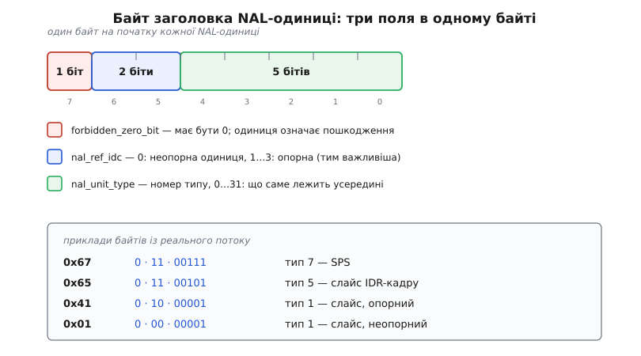
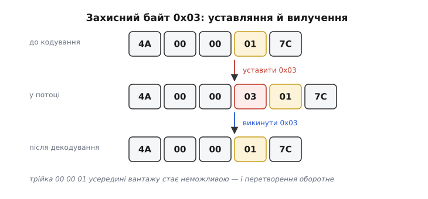
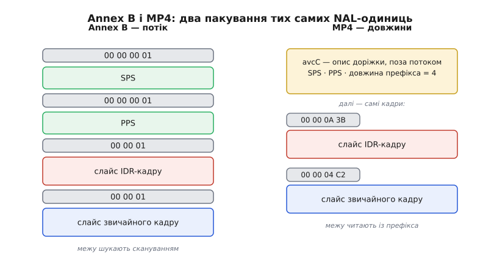
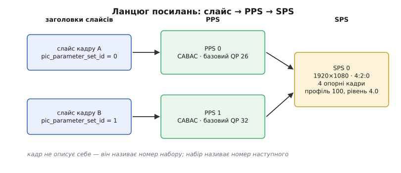
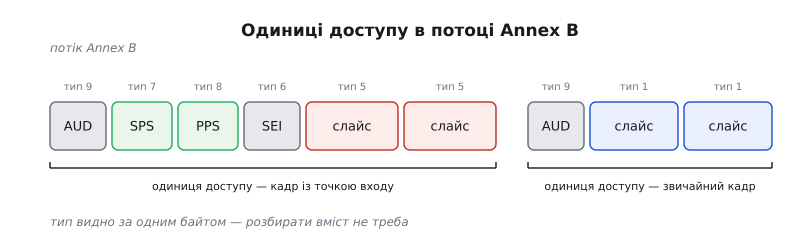

# H.264: NAL-одиниці, SPS/PPS і ключові кадри

<preknowlist>
- [Міжкадрове стиснення](topic:algorithms/inter-frame) — I-, P- і B-кадри, макроблоки, вектори руху й опорні кадри: що саме кодувальник видає на виході.
- [JPEG](topic:algorithms/jpeg-intra) — DCT, квантування й кодування коефіцієнтів усередині одного кадру.
- [CABAC](topic:algorithms/cabac) — контекстно-адаптивне арифметичне кодування: чому вихід кодувальника є суцільним потоком бітів без байтових меж.
- [Експоненційний код Голомба](topic:algorithms/exp-golomb) — ue(v) і se(v): як у службових заголовках H.264 записують цілі числа змінною довжиною.
</preknowlist>

Стисненому відео треба кудись поїхати. У мережевий пакет, який може загубитися дорогою. У файл, по якому глядач возитиме повзунок. У плату, що ввімкнулася через хвилину після початку передачі й мусить показати картинку.

Кожен із трьох хоче свого. Мережа хоче різати потік на шматки, які губляться поодинці, — а для цього мусить бачити, де шматок починається і чи страшна його втрата. Файл хоче точку, з якої відтворення почнеться начисто, не переглядаючи всього попереднього. Плата, що ввімкнулась посеред передачі, хоче найпростішого: якого розміру картинка.

І тут виявляється прикре. На виході кодувальника лежить **суцільний ланцюг бітів**: вектори руху, режими передбачення й коефіцієнти сплавлені разом, бо [арифметичний кодувальник](topic:algorithms/cabac) не лишає ні байтових меж, ні проміжків — кожен зайвий біт коштує бітрейту. Подивитись у цей ланцюг і побачити межу шматка чи розмір картинки неможливольності картинка, скільки опорних кадрів тримати в пам'яті, яким ентропійним кодувальником розпаковувати біти.

Жоден із них не дістане відповіді з самих стиснених бітів, бо щоб їх розпакувати, треба вже знати відповідь. Коло замикається. Розірвати його можна єдиним способом: потік мусить нести знання про себе **окремо** від стиснених даних — у вигляді, який читається без декодування, простим переглядом байтів.

Тому вихід H.264 — не суцільний бітовий потік, а низка окремих, самопідписаних згортків. Кожен згорток починається з байта-етикетки, що каже, **що всередині** і **наскільки воно важливе**, а далі йде вантаж, який має сенс лише для того, хто вміє його розпакувати. Такий згорток називають **NAL-одиницею** (Network Abstraction Layer — рівень абстракції від мережі), а весь шар пакування — NAL. Те, що виробляє самі стиснені дані про картинку, стандарт відділив в окремий рівень відеокодування, VCL (Video Coding Layer). Цей поділ і є головна конструкційна ідея H.264: [історія того, чому його зробили](topic:algorithms/h264-nal-structure/hist-nal-layer.md) починається з болючого досвіду попередніх стандартів, які надто щільно зрослися зі своїм транспортом і через це погано жили в пакетних мережах.

## Одиниця, що сама себе називає

Етикетка NAL-одиниці — рівно один байт, і в нього напхано три поля.


*Один байт на початку кожної NAL-одиниці. Старший біт має бути нулем — одиниця з одиничкою тут визнається пошкодженою. Два наступні біти кажуть, чи на цю одиницю хтось спиратиметься. П'ять молодших — номер типу, тобто що саме лежить усередині.*

**Старший біт — `forbidden_zero_bit`** — завжди нуль. Поле, яке ніколи не змінюється, здається марнотратством, аж поки не згадаєш, звідки одиниці приходять. Транспорт, що виявив пошкодження, але не хоче викидати дані зовсім, ставить сюди одиницю: «я передаю це далі, та воно побите». Декодер бачить порушення синтаксису одним порівнянням, ще не заглянувши в дані, і вмикає приховування помилок замість того, щоб захлинутися.

**Два наступні біти — `nal_ref_idc`** — відповідають на питання «чи спиратиметься на цю одиницю щось наступне». Нуль означає: картинка, що тут лежить, не є опорною, ніхто з неї не передбачається. Значення більше за нуль — опорна, і чим воно більше, тим важливіша. Це не декоративна позначка: маючи два біти, проміжний вузол може викинути неопорну картинку під час затору й не зламати нічого, тоді як утрата опорної потягне за собою всі кадри, що на неї спиралися. Для деяких типів значення задане жорстко: набори параметрів і кадр-точка входу мусять мати `nal_ref_idc` більший за нуль, а суто службові одиниці (додаткова інформація, роздільники, наповнювач) — рівно нуль.

**П'ять молодших бітів — `nal_unit_type`** — номер типу від 0 до 31. Саме він робить одиницю самопідписаною: за одним байтом, без жодного розбору вмісту, видно, що приїхало.

> 🔧 **Навіщо це.** Коли відео йде вузьким каналом і починається затор, скидати пакети наосліп означає ламати картинку надовго. Правило «скидати лише те, де `nal_ref_idc` дорівнює нулю» коштує одного зсуву й маски, а зберігає весь ланцюг передбачення: зникне один неопорний кадр, а не пів секунди відео. Те саме правило стоїть у пріоритезації черг на маршрутизаторах відеомереж.

Розбирається байт трьома операціями:

```c
uint8_t b = nal[0];                 // перший байт NAL-одиниці
int forbidden = (b >> 7) & 0x01;    // має бути 0
int nri       = (b >> 5) & 0x03;    // 0 — неопорна, 1..3 — опорна
int type      =  b       & 0x1F;    // номер типу
```

А ось як виглядають байти, які трапляються в кожному реальному потоці:

```
0x67 = 0 11 00111 → тип 7,  nri 3 : SPS
0x68 = 0 11 01000 → тип 8,  nri 3 : PPS
0x65 = 0 11 00101 → тип 5,  nri 3 : слайс IDR-кадру
0x41 = 0 10 00001 → тип 1,  nri 2 : слайс звичайного кадру, опорний
0x01 = 0 00 00001 → тип 1,  nri 0 : слайс звичайного кадру, НЕ опорний
0x06 = 0 00 00110 → тип 6,  nri 0 : SEI
0x09 = 0 00 01001 → тип 9,  nri 0 : роздільник одиниць доступу
```

Побачивши в дампі 0x67, ти вже знаєш більше, ніж дає весь інший вміст файлу: далі йде опис послідовності, з якого починається все.

## Що несе картинку, а що — знання про неї

Типи діляться надвоє за простим критерієм: чи є всередині закодовані пікселі.

**Одиниці VCL** несуть саму картинку. Тип 1 — слайс звичайного кадру, тип 5 — слайс кадру-точки входу. **Слайс** (англ. *slice* — скиба) — це група макроблоків, закодована незалежно від інших груп того самого кадру: у неї власний заголовок, власне ентропійне кодування з нуля й жодних передбачень через межу. Кадр можна закодувати одним слайсом, а можна кількома — і тоді втрата пакета зіпсує лише свою скибу, а решта кадру відновиться нормально. Це компроміс: більше слайсів — стійкіше до втрат, але гірший стиск, бо кожен розрив обриває контексти й забороняє передбачення через межу.

**Одиниці не-VCL** несуть знання, потрібне, щоб зрозуміти VCL. Типи 7 і 8 — набори параметрів, тип 6 — додаткова інформація (SEI, Supplemental Enhancement Information): підказки, без яких відео декодується правильно, але з якими краще (мітки часу, точка відновлення, опис розгортки). Тип 9 — роздільник одиниць доступу, дешевий маркер «тут починається новий кадр». Тип 12 — наповнювач, порожні байти для вирівнювання швидкості потоку в каналах із фіксованою смугою.

Окремо стоять типи 2, 3 і 4 — поділ слайса на три частини за важливістю: заголовки й вектори руху окремо, коефіцієнти яскравості окремо, коефіцієнти кольору окремо. Задум був гарний: у поганому каналі захистити найважливішу частину сильніше. На практиці цей механізм майже не вживають — його немає у поширених профілях, і жоден масовий кодувальник його не видає.

А типи 24–31 стандарт лишив невизначеними — і саме за них ухопився [транспорт медіа поверх UDP](topic:communications/rtp-rtcp). Правила пакування H.264 в RTP (RFC 6184) віддали типу 24 склеювання кількох дрібних одиниць в один пакет, а типу 28 — розрізання однієї великої одиниці на кілька пакетів. Виходить етикетка над етикеткою: перший байт пакета каже «я фрагмент», а всередині лежить справжній тип. Так пакетна мережа дістала свій рівень пакування, не змінивши жодного біта в самому відео. Повний перелік типів разом із полями наборів параметрів зібрано в [довіднику полів](topic:algorithms/h264-nal-structure/api-sps-pps.md).

## Як знайти межу: стартовий код і його ціна

Одиниці є, але як відрізнити, де закінчилася одна і почалася наступна? Якщо потік іде файлом чи послідовним каналом, ніхто не приносить меж ззовні — їх треба бачити в самих байтах.

Annex B стандарту робить це найпрямішим способом: перед кожною одиницею ставить **стартовий код** — три байти `00 00 01`. Декодер сканує потік, шукає цю трійку, і все між двома трійками є однією NAL-одиницею. Часто пишуть чотири байти, `00 00 00 01`: зайвий нуль дає приймачу, який щойно ввімкнувся посеред потоку, зачіпку для вирівнювання, а перед наборами параметрів і перед першою одиницею кожного кадру стандарт прямо вимагає чотирибайтну форму.

Але тут з'являється зобов'язання, яке пронизує весь формат. Якщо трійка `00 00 01` означає межу, то всередині вантажу її не має бути **ніколи**. А вантаж — стиснені дані, у яких трапляється будь-яка комбінація байтів. Отже, кодувальник мусить її знищити.


*Захист від підробки стартового коду. Щойно у вантажі мають зустрітися два нулі й малий байт, кодувальник уставляє між ними 0x03 — і трійка `00 00 01` більше не може виникнути випадково. Декодер, побачивши `00 00 03`, викидає трійку й дістає вихідні дані.*

Механізм зветься байт-стафінгом (англ. *byte stuffing* — набивання байтами), а сам вставлений байт стандарт називає `emulation_prevention_three_byte` — «трійка, що не дає підробити стартовий код». Правило одне: якщо два щойно записані байти були нулями, а наступний байт менший або дорівнює 0x03, спершу пиши 0x03.

```
у даних:   ... 4A 00 00 01 7C ...
у потоці:  ... 4A 00 00 03 01 7C ...
                        ↑ захисний байт

00 00 00 → 00 00 03 00
00 00 01 → 00 00 03 01
00 00 02 → 00 00 03 02
00 00 03 → 00 00 03 03
```

Останній рядок здається зайвим: `00 00 03` і так не стартовий код. Але без нього декодер не зміг би відрізнити справжню трійку в даних від вставленої й з'їв би чужий байт. Правило мусить бути оборотним, а не лише достатнім.

Ціна невелика й прорахована: у найгіршому разі, на суцільних нулях, потік розбухає на третину, бо на кожні три байти додається один. На реальних стиснених даних два нулі поспіль трапляються рідко, тож накладні витрати — частки відсотка.

Через це на кожній NAL-одиниці живуть два різні уявлення про її вміст. Те, що лежить у потоці, зі стартовим кодом і захисними байтами, — байти, які їдуть каналом. Те, що бачить синтаксичний розбір, уже без захисних байтів, — **RBSP** (Raw Byte Sequence Payload, сира байтова послідовність). Плутанина між ними — класична причина того, що парсер SPS раптом видає безглузді числа: [експоненційний код Голомба](topic:algorithms/exp-golomb) читає біти підряд, і один зайвий байт зсуває все далі за ним.

І ще одна дрібниця, без якої розбір не сходиться. NAL-одиниця вимірюється в байтах, а синтаксис усередині — у бітах, і закінчується він десь посеред останнього байта. Тому в кінці RBSP ставлять один біт `1`, а за ним нулі до межі байта. Парсер, дійшовши до кінця, відкидає нулі з хвоста разом із тією одиничкою — усе, що перед нею, і є даними. Без цієї мітки не було б способу відрізнити значущі нульові біти від набивки.

## Та сама одиниця у файлі: довжина замість стартового коду

Сканувати потік у пошуках трійки байтів має сенс, коли межі невідомі й дані можуть початися будь-де. У файлі це марна робота: файл має зміст, кадри в ньому вже полічені, довжини відомі наперед.

Тому контейнери сімейства MP4 пакують ті самі NAL-одиниці інакше — за правилами ISO/IEC 14496-15. Стартових кодів немає; перед кожною одиницею стоїть її **довжина** — один, два або чотири байти. Декодер не шукає нічого: прочитав довжину, відлічив стільки байтів, отримав одиницю.


*Два пакування тих самих одиниць. Ліворуч — потік Annex B: стартові коди як межі, набори параметрів течуть разом із кадрами й повторюються. Праворуч — MP4: замість меж чотирибайтна довжина, а набори параметрів винесені з потоку в опис доріжки, де лежать один раз.*

Разом із межами переїжджає й ще одна річ. У потоці Annex B набори параметрів мусять іти всередині даних і повторюватися, бо приймач може під'єднатися будь-коли. У файлі під'єднуватися нема куди: файл читають від заголовка. Тому SPS і PPS виносять з потоку в опис доріжки — запис `avcDecoderConfigurationRecord`, у якому лежать байти обох наборів, профіль і рівень із SPS та поле `lengthSizeMinusOne`, що каже, скільки байтів займає префікс довжини. Декодер отримує параметри до першого кадру й не витрачає на них жодного біта потоку.

Цікаво, що захисні байти при цьому **лишаються**. Здавалося б, у файлі з довжинами стартовий код підробити неможливо, отже, захист зайвий. Але стандарт визначив його як частину самої NAL-одиниці, а не як частину потокового пакування, — і одиниця переїжджає з формату у формат байт у байт, разом із захистом. Це вигідно: перекладання між Annex B і MP4 зводиться до заміни меж, а вантаж не чіпають.

> 🔧 **Навіщо це.** Саме на цій відмінності спотикається кожен, хто вперше витягає відео з MP4 і подає його в декодер. Одиниці ті самі, а декодер мовчить: він чекає стартових кодів, а отримує довжини, і не знаходить жодної межі. Ліки — перекласти пакування (у ffmpeg це фільтр `h264_mp4toannexb`) і не забути додати SPS та PPS із `avcC` на початок, бо в потоці їх немає. Симптом «файл грає в плеєрі, а мій код бачить сміття» майже завжди звідси.

## Параметри, які не змінюються щокадру

Тепер про те, що саме лежить у типах 7 і 8, і чому їх аж два.

Декодеру, щоб узятися за слайс, треба знати десятки речей: роздільність, формат кольору, глибину бітів, скільки кадрів тримати в буфері опор, як нумеруються кадри, яким ентропійним кодувальником розпаковувати. Жодна з них не змінюється від кадру до кадру. Писати їх у кожен кадр — це щосекунди слати ті самі сотні бітів тридцять разів дарма. Написати один раз на початку — і потік стане непридатним для всіх, хто під'єднався пізніше або втратив той єдиний пакет.

Вихід — зробити з параметрів **іменовані набори**, які живуть окремо від кадрів, мають номери й на які кадри посилаються номером. Тоді набір можна слати скільки завгодно разів (утратив — дочекайся наступної копії), можна тримати кілька одночасно, а сам кадр коштує кількох бітів посилання.


*Подвійне посилання. Заголовок слайса не описує кадр, а називає номер набору параметрів кадру; той, своєю чергою, називає номер набору параметрів послідовності. Кілька легких PPS можуть спиратися на один важкий SPS — так кодувальник змінює дрібні налаштування, не перевидаючи опису всієї послідовності.*

Рівнів саме два, бо в параметрів різна тривалість життя. Опис геометрії й пам'яті — річ на всю послідовність: змінити роздільність посеред потоку означає почати нову послідовність. А от базовий крок квантування чи вибір ентропійного кодувальника кодувальник хоче міняти від кадру до кадру. Тому важкий, рідко змінний опис пішов у **SPS** (Sequence Parameter Set — набір параметрів послідовності), а легкий, часто змінний — у **PPS** (Picture Parameter Set — набір параметрів кадру). Заголовок слайса називає номер PPS, PPS називає номер SPS. Номерів PPS може бути до 256, SPS — до 32.

> 🔧 **Навіщо це.** Найчастіша причина «потік іде, а картинки немає» — приймач не отримав наборів параметрів. У живій трансляції їх треба повторювати: або перед кожним ключовим кадром у самому потоці, або окремим каналом — у RTSP-сеансі набори передають в описі сеансу полем `sprop-parameter-sets`, закодованими в base64. Якщо кодувальник видав SPS і PPS лише один раз на старті, кожен глядач, що приєднався пізніше, побачить чорний екран, хоча дані течуть.

## Що саме лежить у SPS

Опис послідовності починається з трьох байтів, які читаються без жодного розбору бітів: `profile_idc`, байт прапорців обмежень і `level_idc`. **Профіль** каже, які інструменти кодувальник узагалі вживав: 66 — базовий, без B-кадрів і без CABAC; 77 — головний, з B-кадрами й CABAC; 100 — високий, з перетворенням 8×8 і власними матрицями квантування. **Рівень** каже, наскільки важке навантаження: рівень 4.0 дозволяє кадр до 8192 макроблоків і 245760 макроблоків на секунду, тобто рівно 1080p при 30 кадрах. Апаратний декодер, прочитавши ці три байти, одразу знає, потягне він потік чи ні, — тому вони й лежать першими, до всякого коду Голомба. Пара «[профіль і рівень](topic:algorithms/h264-profiles-levels)» — це і є формальний контракт сумісності H.264: профіль обмежує **набір інструментів**, рівень — **кількісні межі** (розмір кадру, швидкість, обсяг буфера опор); разом вони кажуть, чи зможе конкретна мікросхема відтворити потік, не декодуючи його.

Далі йдуть уже кодовані поля. `seq_parameter_set_id` — власний номер набору. `log2_max_frame_num_minus4` — скільки бітів відведено під лічильник кадрів, тобто як швидко він переповнюється й починає рахунок наново. `pic_order_cnt_type` і супутні поля — правила, за якими обчислюється порядок **показу** кадрів; він відрізняється від порядку декодування, коли в потоці є B-кадри. `max_num_ref_frames` — скільки декодованих кадрів декодер мусить тримати напоготові як можливі опори; це поле прямо перетворюється на мегабайти пам'яті. `chroma_format_idc` і глибина бітів описують формат вибірки кольору.

Розмір картинки задано не в пікселях, а в макроблоках — і саме тут ховається одна з найвідоміших дивниць формату.

**Умова.** SPS звичайного 1080p-потоку містить `pic_width_in_mbs_minus1 = 119`, `pic_height_in_map_units_minus1 = 67`, `frame_mbs_only_flag = 1`, `chroma_format_idc = 1` (4:2:0), увімкнене обрізання з `frame_crop_bottom_offset = 4`, решта зсувів нульові.

```
ширина в макроблоках = 119 + 1                   = 120
ширина в пікселях    = 120 · 16                  = 1920

висота в макроблоках = (2 − 1) · (67 + 1)        = 68
висота до обрізання  = 68 · 16                   = 1088

CropUnitY = SubHeightC · (2 − frame_mbs_only_flag)
          = 2 · (2 − 1)                          = 2
обрізано знизу = 4 · CropUnitY = 4 · 2           = 8 пікселів

висота = 1088 − 8                                = 1080
```

**Висновок.** 1080 не ділиться на 16, а кодувати можна лише цілими макроблоками. Тому кодувальник насправді кодує 1088 рядків — дописує знизу вісім рядків набивки — і просить декодер їх відкинути. Поля обрізання не косметика, а обов'язковий місток між макроблоковою сіткою й реальним розміром картинки; парсер, який їх проігнорує, повідомить хибну висоту.

Наприкінці SPS може стояти необов'язковий блок VUI (Video Usability Information) — відомості, потрібні не для декодування, а для правильного показу: співвідношення сторін пікселя, колірний простір і криву передачі, повний чи скорочений діапазон яскравості, частоту кадрів, а також параметри моделі буфера, за якою розраховують затримку. Без VUI картинка декодується правильно, але може виявитися розтягнутою або з блідими кольорами — бо плеєр змушений вгадувати.

## Що саме лежить у PPS

Набір параметрів кадру починається з двох номерів: власного та номера SPS, на який він спирається. Далі — саме ті ручки, які кодувальник хоче крутити частіше, ніж раз на послідовність.

Головна з них — `entropy_coding_mode_flag`: нуль означає [кодування змінної довжини CAVLC](topic:algorithms/cavlc), одиниця — [контекстно-адаптивне арифметичне кодування](topic:algorithms/cabac). CAVLC — простіший ентропійний кодувальник H.264: замість імовірнісної моделі він тримає кілька таблиць кодів і перемикається між ними за вже прочитаними сусідами, тому декодується швидше й дешевше — але за ту саму якість платить типово на 9–14% більшим потоком. Один біт перемикає весь спосіб читання решти потоку, тому декодер зобов'язаний розібрати PPS раніше за будь-який слайс — інакше він просто не знає, як читати біти. Це найяскравіший приклад того, чому набори параметрів мусять приходити першими: без них потік нечитний не «неповно», а взагалі.

`pic_init_qp_minus26` задає базовий крок квантування для кадру: справжнє значення дорівнює 26 плюс це число, а заголовок слайса може ще підкрутити його своєю поправкою. Так кодувальник керує бітрейтом, не переписуючи ні SPS, ні структури кадру. `num_ref_idx_l0_default_active_minus1` і його пара для другого списку задають, скільки опор беруть за замовчуванням. Прапорці зваженого передбачення вмикають множення опорних блоків на коефіцієнти — те, чим гарно кодуються плавні затемнення. `deblocking_filter_control_present_flag` дозволяє слайсам керувати згладжуванням меж блоків, а `constrained_intra_pred_flag` забороняє внутрішньокадровим блокам передбачатися від сусідів, узятих із попередніх кадрів.

Останній прапорець виглядає дрібним: заборона передбачатися від сусідів — це на перший погляд самі втрати стиску задарма. Насправді саме вона робить можливою дешеву заміну ключовому кадру.

## Одиниця доступу: де закінчується кадр

Слайсів у кадрі може бути кілька, а між ними ще трапляються SEI й набори параметрів. Отже, потрібне поняття «усе, що стосується одного кадру» — це **одиниця доступу** (access unit): набір NAL-одиниць, з яких декодер збирає рівно одну декодовану картинку.


*Одиниця доступу — усі одиниці одного кадру разом. Перша починається з роздільника, несе набори параметрів і слайси кадру-точки входу; наступна складається зі слайсів звичайного кадру. Набори параметрів повторюються перед точками входу, щоб приймач міг увійти будь-де.*

Знайти межу між одиницями доступу можна двома шляхами, і різниця між ними повчальна. Чесний шлях — розбирати заголовки слайсів і порівнювати: чи почався слайс із нульового макроблока, чи змінився лічильник кадрів, номер PPS, лічильник порядку показу, прапорці полів. Це працює завжди, але вимагає читати біти й знати набори параметрів наперед.

Дешевий шлях — попросити кодувальник ставити на початку кожної одиниці доступу роздільник, тип 9. Тоді межа видно за одним байтом, ще до всякого розбору: побачив 0x09 — почався новий кадр. Роздільник не несе майже нічого, крім підказки про типи слайсів усередині, і його часто вимикають, щоб не витрачати байти. Але в системах, де потік ріжуть на частини без декодування — у пакувальниках для стрімінгу, у записувачах, — його вмикають навмисно, бо він перетворює складний розбір на порівняння байта.

## Ключовий кадр: чому I замало і навіщо IDR

Лишилося головне питання, з якого починається кожне під'єднання: **звідки можна почати дивитися**.

Здавалося б, відповідь очевидна — з кадру, закодованого повністю всередині себе, без опори на сусідів. Такий кадр самодостатній, декодуй його й маєш картинку. Але цього замало, і причина в тому, як H.264 працює з опорами.

У ньому кадр не зобов'язаний спиратися на безпосередньо попередній. Декодер тримає буфер декодованих кадрів, і слайс може вибрати опору з-поміж кількох — аж до шістнадцяти, — причому не обов'язково найближчих у часі. Тому картина буває така: ти почав декодувати з чесного самодостатнього кадру, наступні кілька кадрів декодувалися теж добре, а потім якийсь із них потягнувся по опору **за** точку входу — у кадр, якого ти ніколи не бачив. І посеред начебто справної картинки з'являється сміття.

Отже, самодостатності одного кадру мало. Потрібна гарантія про **майбутнє**: ніщо після цієї точки не спиратиметься ні на що перед нею. Саме таку гарантію дає **IDR** (Instantaneous Decoding Refresh — миттєве оновлення декодування). Слайси IDR-кадру мають окремий тип NAL — п'ятий, а не перший, — і це не бухгалтерія, а суть: точка входу мусить упізнаватися за одним байтом, без розбору й без наборів параметрів.

Що відбувається на IDR. Декодер позначає всі кадри в буфері як непридатні для опори — буфер спорожнів. Лічильник кадрів скидається в нуль, лічильник порядку показу теж. Стандарт забороняє будь-якому кадру після IDR у порядку декодування посилатися на будь-що до нього. Усе, що було раніше, стає непотрібним, і декодер, який щойно ввімкнувся, опиняється в тому самому стані, що й декодер, який дивиться потік із самого початку.

Тому в контейнері саме IDR-кадри позначають як точки синхронізації, і саме по них ходить повзунок перемотки: між ними стрибнути нікуди — картинка розсиплеться.

> 🔧 **Навіщо це.** Відстань між IDR-кадрами — це одночасно три речі: затримка запуску (глядач чекає першої точки входу), крок перемотки (точніше не буде) і час відновлення після втрати (побита картинка живе до наступного IDR). Ставиш IDR раз на дві секунди — маєш дві секунди на кожен із трьох пунктів. Ставиш частіше — платиш бітрейтом, бо кожен IDR кодується без опор і важить у рази більше за звичайний кадр; звідси й характерні стрибки [бітрейту](topic:algorithms/quality-bitrate) на потоці.

## Коли IDR задорогий: точка відновлення

Для потоку керування — телеметрії, відео з підвісу, будь-чого, де важить затримка, — важкий IDR раз на секунду отруйний. Він на мить забиває канал, буфер набрякає, затримка стрибає саме тоді, коли її найменше хочеш.

Тому є другий спосіб дати точку входу — розтягнути її в часі. Кодувальник не кодує цілий кадр без опор, а щокадру оновлює **смугу** макроблоків: у першому кадрі перша смуга кодується без опор, у другому — друга, і так далі, поки за кілька десятків кадрів смуга не пройде всю картинку. Кожен окремий кадр лишається дешевим, а декодер, що почав із будь-якого місця, поступово набирає правильну картинку — спершу правильна лише смуга, потім дві, потім усе.

І тут стає в пригоді той дрібний прапорець із PPS. Оновлена смуга буде правильною лише доти, доки вона не запозичує пікселів у сусідів, декодованих зі старих, невідомих нам опор. Прапорець `constrained_intra_pred_flag` це й забороняє: внутрішньокадрові блоки не мають права передбачатися від блоків, узятих із попередніх кадрів. Без нього зараза з неоновленої частини картинки протекла б у щойно оновлену, і смуга ніколи б не зійшлася.

Лишається сказати декодеру, коли картинка вже правильна цілком. Це робить повідомлення SEI «точка відновлення»: у ньому лежить число кадрів, через яке зображення стане прийнятним для показу. Плеєр, що почав із такого місця, знає, скільки кадрів пропустити або показати з поміткою, замість вгадувати.

Різниця в гарантіях чесна й варта того, щоб її пам'ятати. IDR каже: «з цієї миті все правильно». Точка відновлення каже: «стане правильно ось через стільки кадрів». Перше дозволяє точну перемотку, друге — рівний бітрейт.

## Чого це коштувало і що дало

Усе, що робить NAL-рівень, зводиться до одного принципу: **межі й точки входу мають бути видні без декодування**. Тип одиниці — в одному байті, не в стисненому вмісті. Точка входу — окремий номер типу, а не властивість, яку треба вирахувати. Параметри — окремі іменовані одиниці, які можна повторювати, а не преамбула, що трапляється раз. Навіть захисний байт існує лише для того, щоб пошук межі лишався тупим скануванням трьох байтів.

Платня за це — накладні витрати, які видно в кожному дампі: байт заголовка на одиницю, три-чотири байти стартового коду, повторювані набори параметрів, зрідка захисні трійки. На потоці в кілька мегабіт це часточка відсотка.

А віддача в тому, що кодувальник ніколи не дізнається, куди поїде його вихід. Ті самі байти одиниць ідуть у RTP-пакетах, лягають у MP4 з довжинами, течуть транспортним потоком мовлення й потрапляють в апаратний декодер — і ніде вміст не переписують, лише міняють обгортку. Розділити «як стиснути картинку» і «як її довезти» вдалося настільки чисто, що [розбирач потоку](topic:algorithms/h264-nal-structure/proj-nal-parser.md) можна написати, не знаючи про DCT і вектори руху взагалі нічого: він працює з етикетками, довжинами й кількома полями, кодованими Голомбом.
