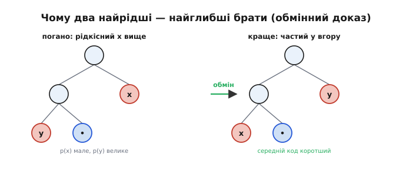
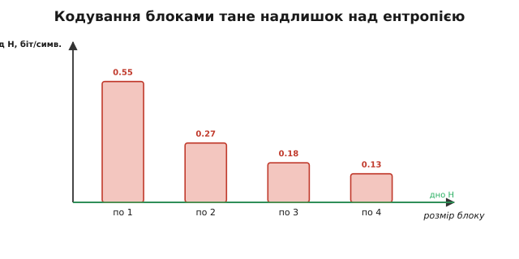
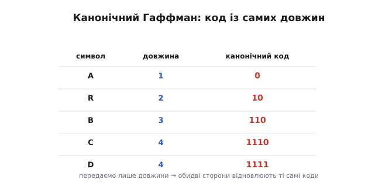
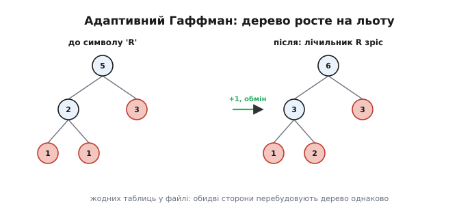

# Код Гаффмана (докладно)

<preknowlist>
- [Ентропія](topic:algorithms/entropy) — середня несподіванка символу в бітах і Шеннонове дно стиснення без втрат.
- [Двійкове дерево](topic:algorithms/binary-tree) — корінь, вузол, листок, глибина; шлях від кореня до листка як код.
- [Черга з пріоритетом (купа)](topic:algorithms/priority-queue) — структура, що швидко віддає найменший елемент; потрібна в реалізації на C.
</preknowlist>

Код Гаффмана легко переказати правилом «зливай два найрідші вузли» — і легко лишитися з відчуттям, що це просто вдалий трюк. Насправді за ним стоїть точна теорема: цей жадібний рецепт дає **оптимальний** посимвольний префіксний код, і це можна **довести**, а не лише повірити. Тут ми розберемо, чому жадібність тут не наближення, а точність; чому навіть оптимальний посимвольний код упирається в стелю H+1 і коли ця стеля болить; як декодувати швидко й як не пересилати ціле дерево (канонічний код); як обійтися **взагалі без** попереднього проходу за частотами (адаптивний код); і нарешті — як це лягає в робочий C.

Базовий погляд — «префіксний код деревом, жадібна побудова, виграш на ABRACADABRA» — лишимо за вступ. Тут ідемо в механізм: **чому** воно оптимальне і **де** перестає бути достатнім.

## Чому жадібність дає оптимум

Жадібні алгоритми зазвичай підозрілі: локально найкращий крок рідко складається в глобально найкращий результат. Гаффман — славний виняток, і доказ його оптимальності короткий та повчальний. Він спирається на дві леми, обидві доводяться **обміном** (*exchange argument*): припускаємо, що є краще дерево, робимо в ньому невеликий обмін вузлів і показуємо, що воно не погіршало, — отже, наше не гірше за будь-яке.

Спершу домовимося про міру. Вартість дерева T — це середня довжина коду, тобто сума по листках «частота символу × його глибина»:

```
B(T) = Σ  freq(c) · depth(c)
       c
```

Глибина листка — це довжина його коду (скільки разів ми звернули від кореня). Мінімізувати середній код означає мінімізувати B(T). Тепер дві леми.

**Лема 1 (два найрідші — найглибші брати).** У якомусь оптимальному дереві два символи з **найменшими** частотами лежать на **найбільшій** глибині й є братами (мають спільного батька).

Доведемо обміном. Хай x і y — два найрідші символи. Візьми будь-яке оптимальне дерево й поглянь на два листки на найбільшій глибині — назви їх a і b (у повному бінарному дереві найглибший листок завжди має брата тієї ж глибини). Якщо x не серед найглибших, то freq(x) ≤ freq(a), а depth(x) ≤ depth(a). Поміняй x і a місцями. Як зміниться вартість?

```
ΔB = (freq(a) − freq(x)) · (depth(a) − depth(x))
```

Обидві дужки невід'ємні (a — глибший, x — рідкісніший), тож добуток невід'ємний, а в формулі він іде зі знаком мінус — отже, ΔB ≤ 0: вартість **не зросла**. Так само переставляємо y до другого найглибшого листка. Дерево лишилося оптимальним, але тепер найрідші x і y сидять найглибше й поряд. Лема доведена.


*Обмінний доказ. Якщо рідкісний символ x сидить вище, ніж якийсь частіший символ y глибоко внизу, поміняй їх місцями: частий підіймається (його довгий код коротшає), рідкісний опускається (його код подовшає, але він рідкісний). Добуток (різниця частот)×(різниця глибин) невід'ємний, тож середній код не зростає. Звідси — два найрідші мусять бути найглибшими.*

**Лема 2 (злиття зводить задачу до меншої).** Хай x і y — два найрідші символи. Утвори новий символ z із частотою freq(x)+freq(y), викинь x та y і розв'яжи задачу для цього меншого алфавіту. Тоді, підвісивши до листка z дітей x та y, дістанеш оптимальне дерево для **початкового** алфавіту.

І це доводиться обміном. Позначмо T′ — оптимальне дерево меншого алфавіту (з листком z), а T — те, що вийшло, коли ми розкрили z у двох дітей. Вартості пов'язані просто: коли z глибини d розкривається у двох дітей глибини d+1,

```
B(T) = B(T′) + freq(x) + freq(y)
```

(кожна з частот x, y тепер лежить на один рівень глибше, ніж лежав z, — звідси доданок). Цей зв'язок **сталий**: він не залежить від того, яке саме T′ ми взяли. Тому мінімум B(T) досягається рівно тоді, коли мінімальне B(T′). А раз наш алгоритм рекурсивно будує оптимальне T′ (база — алфавіт з одного символу, дерево тривіальне), то й T оптимальне. Дві леми разом і кажуть: жадібне злиття найрідших на кожному кроці **точно** будує дерево з найменшим середнім кодом. Жодного наближення.

> 🔧 **Навіщо це.** Розуміння доказу — не формальність. Воно каже, що **немає сенсу** шукати «хитріший» посимвольний префіксний код: кращого за Гаффмана не існує в принципі. Якщо твій стискач програє конкурентові, виграш ховається **не** в кращому розподілі бітів по символах (там стеля вже досягнута), а деінде — у кращій моделі джерела (контекст, передбачення), у блокуванні символів або в переході на арифметичне кодування. Знаючи, де межа, не марнуєш зусиль на безнадійне.

## Стеля H+1 і коли вона болить

Оптимальність Гаффмана має точну, але **вузьку** силу: він найкращий **серед посимвольних** кодів — тих, що дають кожному символу ціле число бітів. Це й породжує розрив із ентропією. Сформулюймо межу точно. Якщо L — середня довжина коду Гаффмана, а H — ентропія джерела, то

```
H  ≤  L  <  H + 1     (бітів на символ)
```

Ліва нерівність — Шеннонове дно: жоден код без втрат не опуститься нижче ентропії. Права — гарантія Гаффмана: він ніколи не перевищить ентропію більш ніж на один біт на символ. Звідки береться цей зайвий «майже біт»? З округлення. Ідеальний код дав би символу з імовірністю p рівно −log₂p бітів — узагалі кажучи, **дробову** кількість. Гаффман мусить округлити до цілого, і в середньому програє на цьому округленні менш ніж біт.

Тепер головне — **коли** цей програш дрібний, а коли руйнівний. Глянь, де округлення дешеве: якщо всі ймовірності є степенями ½ (½, ¼, ⅛, …), то −log₂p **уже ціле**, округляти нічого, і Гаффман сідає **точно** на ентропію, L = H. Що далі ймовірності від степенів ½, то більше округлення, то більший розрив. Найгірший випадок — коли один символ дуже частий:

```
p(символ) = 0.9   →   чесна ціна −log₂0.9 ≈ 0.152 біта
                       Гаффман дає      ≥ 1     біт
                       втрата           ≈ 0.85  біта НА КОЖНІЙ появі
```

А появ цього символу — більшість потоку. Втрата ≈0.85 біта на майже кожному символі — це катастрофа: дані, де чесна ентропія, скажімо, 0.5 біта на символ, Гаффман запише по цілому біту — удвічі гірше за можливе. Формально: коли ймовірність найчастішого символу перевищує ½, неефективність Гаффмана **необмежена** — відношення L/H можна розігнати як завгодно високо, наближаючи p до одиниці.

Тут і пролягає межа методу й причина існування [арифметичного кодування](topic:algorithms/arithmetic-coding): воно не приписує символу окремий цілий код, а кодує **весь потік** одним довгим числом, через що кожному символу дістається його чесна **дробова** частка біта. Там, де Гаффман втрачає 0.85 біта на символі з p=0.9, арифметичне віддає рівно 0.152 — і притискається до ентропії впритул.


*Як Гаффман дотягується до дна блокуванням. Надлишок над ентропією для коду по 1 символу великий; якщо кодувати символи **парами**, трійками, четвірками — той самий зайвий «менш ніж біт» ділиться на розмір блоку n, бо припадає вже на n символів. Блок 2 ріже надлишок удвічі, блок 4 — учетверо. Так посимвольний код наближають до ентропії, не міняючи самого Гаффмана.*

Є й спосіб лишитися з Гаффманом, але дотягтися до дна — **блокування** (*blocking*): кодувати не окремі символи, а їхні **пари**, трійки, четвірки як нові «суперсимволи». Округлення тоді відбувається раз на **блок**, тож зайвий «менш ніж біт» ділиться на розмір блоку n і дає вже < 1/n біта на символ. Платня — алфавіт росте степенево (для пар він у квадраті), тож на практиці блокують лише трохи. Це проміжний шлях між простим Гаффманом і повноцінним арифметичним кодуванням.

> 🔧 **Навіщо це.** Ця арифметика прямо підказує **вибір кодувальника під дані**. Якщо статистика помірно нерівна (текст, коефіцієнти DCT після квантування) — Гаффман віддає майже все, дешево й швидко, бери його. Якщо ж у потоці домінує один символ (довгі серії нулів, дуже передбачуване джерело) — Гаффман на «майже цілому біті» втрачає відчутно, і тут або блокуй символи, або переходь на арифметичне кодування (саме тому JPEG має необов'язковий арифметичний режим, а сучасні відеокодеки користуються CABAC — контекстним арифметичним кодуванням, а не Гаффманом).

## Швидке декодування: від спуску деревом до таблиці

Найпростіший декодер іде деревом від кореня: біт `0` — крок ліворуч, `1` — праворуч, дійшов до листка — видав символ, повернувся до кореня. Це коректно (префіксна умова гарантує, що листок зустрінеться рівно на повному коді) і коштує пам'яті лише на саме дерево. Та воно **повільне**: на кожен **біт** входу — одне розгалуження й один стрибок по пам'яті, а гілкування процесор погано передбачає, тож конвеєр раз по раз зривається.

Швидкі декодери міняють час на пам'ять — **табличним** декодуванням. Ідея: бери з потоку одразу `k` біт наперед (скажімо, 8) і використай їх як **індекс** у таблицю розміру 2ᵏ. У кожній комірці заздалегідь записано, який символ починається з цих біт і скільки біт насправді зайняв його код. Тоді один доступ до таблиці декодує **цілий символ** за раз, а не біт:

```c
// Один крок табличного декодування (k-бітне вікно наперед).
uint32_t window = peek_bits(&br, K);     // взяти K біт, не споживаючи
fast_entry e = table[window];            // один доступ — і символ, і довжина
emit(e.symbol);                          // видали символ
consume_bits(&br, e.length);             // спожити рівно стільки, скільки зайняв код
```

Чому в комірці лежить **довжина** коду? Бо `k` біт можуть містити короткий код плюс початок наступного: таблиця каже, скільки біт належали саме цьому символу, щоб решту повернути в потік. Коли найдовший код перевищує `k`, роблять **багаторівневі** таблиці: перша покриває часті короткі коди прямо, а рідкісні довгі відсилає в дрібнішу другу таблицю. Так декодують zlib і більшість JPEG-декодерів: пам'ять на таблиці окупається швидкістю, бо коротких (частих) кодів — більшість, і вони декодуються першим же доступом.

> 🔧 **Навіщо це.** Якщо колись профілюватимеш розпакування й побачиш, що Гаффман-декодер — вузьке місце, причина майже завжди в побітовому спуску деревом із непередбачуваним гілкуванням. Перехід на табличне декодування (8–12 біт на доступ, із другим рівнем для довгих кодів) часто прискорює декодування в кілька разів — без зміни самого формату, лише способу читання.

## Канонічний Гаффман: код із самих довжин

Декодувати декодуванням, та спершу декодер мусить добути **те саме** дерево, що в кодувальника. Наївно — переслати в заголовку повне дерево або частоти; на малих даних це з'їдає весь виграш. Канонічний Гаффман (*canonical Huffman*) усуває цей коштовний заголовок, помітивши важливу свободу: дерев з **однаковим набором довжин** кодів багато (ліві й праві піддерева можна міняти місцями — глибини листків не зміняться), і всі вони однаково оптимальні. Раз так, домовмося про **одне** правило, як із самих довжин однозначно відновити коди, — і тоді досить переслати лише довжини.

Правило таке. Символи впорядковують спершу за **довжиною** коду (коротші перші), а в межах однакової довжини — за самим символом (за абеткою чи кодом). Далі роздають коди як **послідовні двійкові числа**: перший код — самі нулі потрібної довжини; кожен наступний код тієї ж довжини — попередній **плюс один**; при переході до більшої довжини до коду **дописують нулі** справа (зсувають уліво). Ось ці самі довжини A=1, R=2, B=3, C=4, D=4 з прикладу ABRACADABRA дають канонічні коди:

```
символ  довжина  канонічний код
  A         1        0
  R         2        10        (0+1=1, доросло до 2 біт)
  B         3        110       (10+1=11 → зсув → 110)
  C         4        1110
  D         4        1111      (1110 + 1)
```


*Канонічне призначення. Маючи лише довжини кодів, обидві сторони сортують символи (за довжиною, потім за символом) і роздають коди послідовними числами, доростаючи нулями при переході до більшої довжини. Результат однозначний, тож у файл досить покласти самі довжини — кілька біт на символ замість цілого дерева.*

Вигода подвійна. По-перше, **заголовок схуднув** до списку довжин (по кілька біт на символ), а DEFLATE іде ще далі — стискає сам цей список ще одним Гаффманом. По-друге, канонічний код **декодується без дерева** в пам'яті: знаючи, скільки кодів кожної довжини й з якого числа вони починаються, декодер за лічені арифметичні дії визначає символ — це і є основа табличних декодерів. Саме тому канонічний Гаффман стоїть у DEFLATE (zip, gzip, PNG) і в JPEG: він економить і байти заголовка, і пам'ять декодера.

## Адаптивний Гаффман: без проходу за частотами

У звичайного Гаффмана є прихована незручність: щоб порахувати частоти, треба **прочитати весь вхід наперед**, і лише тоді кодувати — два проходи. Для потоку, що йде в реальному часі (мережа, давач), це або неможливо, або додає затримку на буферизацію цілого блоку. Адаптивний Гаффман (*adaptive Huffman*) знімає це: він кодує **за один прохід**, не знаючи частот наперед, і не пересилає жодних таблиць.

Працює він так. Кодувальник і декодер тримають **однакове** дерево й починають з порожнього (з одним спеціальним «новим символом»). Кодуючи черговий символ, кодувальник виплюває його **поточний** код, потім **збільшує лічильник** цього символу на одиницю й за потреби перебудовує дерево, щоб воно лишалося Гаффмановим. Декодер робить **дзеркально**: декодує символ поточним деревом, тоді так само збільшує лічильник і перебудовує. Оскільки обидва бачать ту саму історію символів і застосовують те саме правило оновлення, їхні дерева **завжди тотожні** — переслати таблицю не треба ні разу.


*Оновлення на льоту. З'явився символ — його лічильник росте на одиницю, і вузли за потреби міняються місцями, щоб ваги лишалися впорядковані (знизу вгору, зліва направо). І кодувальник, і декодер роблять це однаково, тож дерева збігаються без жодної пересланої таблиці.*

Уся хитрість — у тому, як **дешево** перебудовувати дерево після кожного +1, не зводячи його щоразу з нуля. Тут діє **властивість братів** (*sibling property*), яку довів Галлагер: дерево дає код Гаффмана тоді й лише тоді, коли всі його вузли можна вишикувати в ряд за неспадною вагою так, що кожна пара братів стоїть поряд. Алгоритм **FGK** (за іменами Фаллера, Галлагера й Кнута, що склали його впродовж 1973–1985 років) і пізніший алгоритм **Віттера** (англ. *Vitter*, 1987, тісніший до оптимуму) тримають саме цей порядок: збільшуючи лічильник листка, вони перевіряють, чи не порушив він шикування, і якщо так — **міняють** вузол місцями з найдальшим вузлом тієї ж ваги, після чого піднімаються до батька й повторюють. Один символ коштує лише кількох таких обмінів уздовж шляху до кореня, а не повної перебудови.

Платня за однопрохідність — швидкість і складність. Перебудова дерева на **кожному** символі робить адаптивний Гаффман помітно повільнішим за статичний (де код просто беруть із готової таблиці), а код перебудови мудрований і легкий на помилку. Тому на практиці його витіснило адаптивне **арифметичне** кодування: воно так само однопрохідне, але краще тисне (дробові біти) і оновлює модель дешевше. Адаптивний Гаффман лишається радше повчальним і нішевим, ніж робочим конем.

> 🔧 **Навіщо це.** Якщо тобі треба тиснути **потік** без затримки на буферизацію цілого блоку (телеметрія, лог у реальному часі), адаптивна схема — спокуса: ні другого проходу, ні таблиці у файлі. Та перш ніж брати адаптивний Гаффман, зваж адаптивне арифметичне кодування — за тих самих переваг воно зазвичай і тисне краще, і оновлюється простіше. Статичний Гаффман бери, коли можеш дозволити два проходи (дані вже в пам'яті) — він і швидший, і простіший.

## Реалізація на C

Зведімо це в робочий код. Статичний кодувальник Гаффмана складається з чотирьох кроків: **порахувати частоти**, **побудувати дерево** через чергу з пріоритетом, **обійти дерево** й зібрати коди, **записати бітами**. Серце — побудова дерева; її і покажемо тут, а повний кодек із бітовим записом і декодуванням винесено окремо, бо коду чимало.

Дерево тримаємо масивом вузлів — це простіше за вказівникову алокацію й дружнє до кешу. Кожен вузол знає свою вагу й двох дітей (для листка — індекс символу):

```c
#include <stdint.h>

#define SYMS 256                 /* алфавіт байтів */

typedef struct {
    uint32_t freq;               /* вага: частота (листок) або сума (вузол) */
    int16_t  left, right;        /* індекси дітей; -1 у листка             */
    int16_t  symbol;             /* символ у листка; -1 у внутрішнього      */
} node_t;
```

Два найрідші вузли на кожному кроці беремо з **мінімальної купи** (бінарної піраміди) — вона віддає найменший елемент за O(log n), тож уся побудова коштує O(n log n). Купу тримаємо масивом індексів вузлів, упорядкованим за їхньою вагою:

```c
typedef struct { int16_t idx[2 * SYMS]; int n; node_t *nodes; } heap_t;

static void heap_push(heap_t *h, int16_t v) {
    int i = h->n++;
    h->idx[i] = v;
    while (i > 0) {                       /* просіювання вгору */
        int parent = (i - 1) / 2;
        if (h->nodes[h->idx[parent]].freq <= h->nodes[h->idx[i]].freq) break;
        int16_t t = h->idx[parent]; h->idx[parent] = h->idx[i]; h->idx[i] = t;
        i = parent;
    }
}

static int16_t heap_pop(heap_t *h) {
    int16_t top = h->idx[0];
    h->idx[0] = h->idx[--h->n];
    int i = 0;                            /* просіювання вниз */
    for (;;) {
        int l = 2 * i + 1, r = 2 * i + 2, m = i;
        if (l < h->n && h->nodes[h->idx[l]].freq < h->nodes[h->idx[m]].freq) m = l;
        if (r < h->n && h->nodes[h->idx[r]].freq < h->nodes[h->idx[m]].freq) m = r;
        if (m == i) break;
        int16_t t = h->idx[m]; h->idx[m] = h->idx[i]; h->idx[i] = t;
        i = m;
    }
    return top;
}
```

Тепер сама побудова — пряме втілення жадібного правила. Кладемо в купу всі ненульові листки, тоді раз по раз дістаємо два найрідші, зливаємо в новий вузол і повертаємо його назад, доки не лишиться корінь:

```c
/* Повертає індекс кореня. nodes[] заповнюється; nfree — лічильник вузлів. */
static int16_t huff_build(node_t *nodes, const uint32_t *freq) {
    heap_t h; h.n = 0; h.nodes = nodes;
    int nfree = 0;

    for (int s = 0; s < SYMS; s++) {           /* листки лише для наявних символів */
        if (freq[s] == 0) continue;
        nodes[nfree] = (node_t){ freq[s], -1, -1, (int16_t)s };
        heap_push(&h, (int16_t)nfree++);
    }
    if (h.n == 1) {                            /* окремий випадок: один символ */
        int16_t only = heap_pop(&h);
        nodes[nfree] = (node_t){ nodes[only].freq, only, -1, -1 };
        return (int16_t)nfree++;               /* дамо йому довжину коду 1 */
    }
    while (h.n > 1) {                          /* зливаємо два найрідші */
        int16_t a = heap_pop(&h);
        int16_t b = heap_pop(&h);
        nodes[nfree] = (node_t){ nodes[a].freq + nodes[b].freq, a, b, -1 };
        heap_push(&h, (int16_t)nfree++);
    }
    return heap_pop(&h);                        /* останній — корінь */
}
```

Лишається обійти дерево й зібрати коди. Рекурсія від кореня несе поточний код і його довжину; дописуємо `0`, спускаючись ліворуч, `1` — праворуч, а на листку записуємо готовий код у таблицю:

```c
typedef struct { uint32_t bits; uint8_t len; } code_t;   /* код до 32 біт */

static void huff_codes(const node_t *nodes, int16_t i,
                       uint32_t bits, uint8_t len, code_t *out) {
    if (nodes[i].symbol >= 0) {                 /* листок — записати код */
        out[nodes[i].symbol].bits = bits;
        out[nodes[i].symbol].len  = len ? len : 1;   /* корінь-листок → 1 біт */
        return;
    }
    huff_codes(nodes, nodes[i].left,  (bits << 1),     len + 1, out);  /* 0 */
    huff_codes(nodes, nodes[i].right, (bits << 1) | 1, len + 1, out);  /* 1 */
}
```

Маючи таблицю `code_t out[256]`, кодувальник записує вхід, виштовхуючи в бітовий потік `out[byte].bits` завдовжки `out[byte].len` для кожного байта; декодувати ж найкраще канонічно або таблицею (вище). Повний кодек — з бітовими читачем-писачем, пакуванням довжин у заголовок (канонічний варіант) і табличним декодером — зібрано в окремому [проєкті-кодеку на C](topic:algorithms/huffman-coding/proj-huffman-c.md), щоб тут лишити видимою саму суть алгоритму, а не службову обв'язку.

> 🔧 **Навіщо це.** Кілька рішень у цьому коді — практичні, не випадкові. **Масив вузлів** замість вказівників: уся алокація — один буфер `node_t[2*SYMS]`, ніякого `malloc` на кожен вузол, і дані лежать суцільно (швидко в кеші, безпечно на дрібному МК). **Купа** замість лінійного пошуку двох найменших: для 256 символів різниця невелика, та для великих алфавітів (Unicode, словники) O(n log n) проти O(n²) вирішальна. **Код у `uint32_t`**: довжина коду Гаффмана для байтового алфавіту майже завжди влазить у 32 біти, але на патологічно перекошених частотах теоретично сягає більшого — промислові кодеки тому **обмежують** довжину коду (зазвичай 15–16 біт), трохи жертвуючи оптимальністю заради простих 16-бітових таблиць; пам'ятай про цю межу, коли пишеш свій.

---
