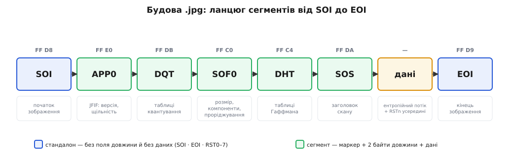
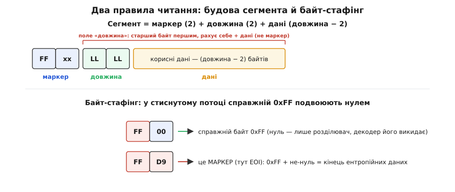

# 🧭 Маркери й будова JPEG-файлу

Ця довідка — мапа декодера: як прочитати байти `.jpg`, знайти в них таблиці й розміри та відрізнити керівний маркер від стиснутих даних. Готовий JPEG — не суцільний потік бітів, а низка **сегментів**, і кожен відкриває **маркер** — два байти, що починаються на `0xFF`. Нижче — повний перелік маркерів, будова кожного сегмента побайтово, порядок їх у файлі та єдиний трюк (байт-стафінг), який дає стиснутим даним і маркерам уживатися в одному потоці.


*Файл `.jpg` — це послідовність сегментів у певному порядку. Таблиці (DQT, DHT) лежать перед сканом, що їх вживає. Три родини маркерів — SOI, EOI, RST — «стандалонні»: не мають ні поля довжини, ні даних. За SOS одразу тягнеться ентропійний потік змінної довжини.*

## Анатомія сегмента: маркер + довжина + дані

Одне правило описує майже весь файл. Звичайний сегмент складається з трьох частин:

```
FF xx        маркер    — 2 байти: перший завжди 0xFF, другий (xx) визначає тип
LL LL        довжина   — 2 байти, порядок big-endian (старший першим)
[ дані ]     корисне   — (LLLL − 2) байтів
```

Уся тонкість — що саме рахує поле **довжини**. Воно включає **себе** (свої два байти) плюс дані, але **не** включає двох байтів маркера. Тому розмір самих даних дорівнює `довжина − 2`, а щоб перестрибнути на наступний сегмент, від першого байта довжини відлічують рівно `довжина` байтів. Багатобайтові числа тут — у порядку [big-endian](topic:programming/endianness): старший байт першим (`00 F0` означає 0·256 + 240 = 240), як у мережевих протоколах.

Три родини маркерів це правило **порушують** — вони **стандалонні**: складаються лише з двох байтів маркера, без поля довжини й без даних. Це `SOI`, `EOI` та `RST0…RST7`. Їх упізнають за самим кодом і читають далі, не намагаючись прочитати неіснуючу довжину.


*Два правила читання файлу. Ліворуч: сегмент = маркер (2) + довжина (2) + дані (довжина − 2); поле довжини рахує себе й дані, але не маркер. Праворуч: у стиснутому потоці справжній `0xFF` подвоюють нулем (`FF 00`), тож `FF` із будь-яким не-нулем — це вже маркер.*

## Таблиця маркерів

Кожен маркер — це байт `0xFF` плюс один байт-код. Ось ті, що трапляються в базовому й прогресивному JPEG:

| Маркер | Код | Довжина | Що несе |
|---|---|:---:|---|
| **SOI** | `FFD8` | нема | Start of Image — початок файлу |
| **APP0** | `FFE0` | так | заголовок JFIF: версія, щільність точок, мініатюра |
| **APPn** | `FFE1`–`FFEF` | так | інші застосунки: `APP1` — Exif/XMP тощо |
| **DQT** | `FFDB` | так | Define Quantization Table — таблиці квантування |
| **DHT** | `FFC4` | так | Define Huffman Table — таблиці Гаффмана |
| **DRI** | `FFDD` | так | Define Restart Interval — інтервал перезапуску |
| **SOF0** | `FFC0` | так | Start of Frame, базовий (baseline DCT): розміри, компоненти, проріджування |
| **SOF2** | `FFC2` | так | Start of Frame, прогресивний (progressive DCT) |
| **SOS** | `FFDA` | так | Start of Scan — заголовок скану; одразу за ним ідуть стиснуті дані |
| **RST0**–**RST7** | `FFD0`–`FFD7` | нема | Restart — точки перезапуску всередині стиснутого потоку |
| **DNL** | `FFDC` | так | Define Number of Lines — число рядків, якщо його нема в SOF |
| **COM** | `FFFE` | так | Comment — текстовий коментар |
| **EOI** | `FFD9` | нема | End of Image — кінець файлу |

Є й інші кадрові маркери — `FFC1` (розширений послідовний), `FFC3` (без утрат), `FFC9`–`FFCB` (з арифметичним кодуванням), — але дві головні гілки це `SOF0` і `SOF2`. Коди `FF00` і `FFFF` маркерами **не** є: перший — частина байт-стафінгу (нижче), другий — байт-заповнювач.

## Порядок сегментів у файлі

Файл читають від першого байта, стрибаючи по довжинах. Типовий базовий JPEG укладено так:

```
SOI                    FF D8           початок
APP0 (JFIF)            FF E0 …         заголовок формату
[APP1 Exif, COM…]                      необовʼязкові метадані
DQT                    FF DB …         таблиці квантування (одна-дві)
SOF0                   FF C0 …         розміри й компоненти кадру
DHT                    FF C4 …         таблиці Гаффмана (кілька)
[DRI                   FF DD …]        інтервал перезапуску, якщо є
SOS                    FF DA …         заголовок скану
   <ентропійні дані>                   стиснутий потік; RSTn кожні DRI одиниць
EOI                    FF D9           кінець
```

Жорстке в цьому порядку одне: **таблиця мусить стояти перед сканом, що її вживає** — декодер не деквантує без `DQT` і не розкодує Гаффмана без `DHT`. А от між собою `DQT`, `DHT`, `DRI` та `SOF` кодувальники розкладають по-різному, і `DQT`/`DHT` трапляються вроздріб по кілька. Тому надійний парсер не покладається на фіксовані зсуви, а **йде по маркерах**.

## Будова ключових сегментів

Далі — вміст поля даних кожного сегмента, поле за полем. Розмір у байтах; багатобайтові числа — big-endian.

**APP0 — заголовок JFIF**

| Поле | Байтів | Значення |
|---|:---:|---|
| ідентифікатор | 5 | `"JFIF\0"` = `4A 46 49 46 00` |
| версія | 2 | старший.молодший, напр. `01 01` = 1.01 |
| одиниці щільності | 1 | 0 — лише пропорція; 1 — точок/дюйм; 2 — точок/см |
| Xdensity | 2 | щільність по горизонталі |
| Ydensity | 2 | щільність по вертикалі |
| Xthumbnail | 1 | ширина вбудованої мініатюри (0 — нема) |
| Ythumbnail | 1 | висота мініатюри |
| мініатюра | 3·X·Y | пікселі RGB мініатюри |

**SOF0 — параметри кадру (baseline)**

| Поле | Байтів | Значення |
|---|:---:|---|
| точність | 1 | бітів на відлік, зазвичай 8 |
| висота | 2 | рядків у зображенні |
| ширина | 2 | стовпців |
| Nf | 1 | число компонент: 1 — сірий, 3 — YCbCr |

Далі йде `Nf` записів по 3 байти — по одному на компоненту:

| Поле | Байтів | Значення |
|---|:---:|---|
| ідентифікатор Cᵢ | 1 | 1 = Y, 2 = Cb, 3 = Cr |
| проріджування Hᵢ:Vᵢ | 1 | старший нібл — горизонтальне, молодший — вертикальне |
| таблиця Tqᵢ | 1 | номер таблиці квантування (0–3) для цієї компоненти |

Запис компоненти Y для 4:2:0 виглядає як `01 22 00`: ідентифікатор 1, проріджування 2×2, квантування за таблицею 0.

**DQT — таблиці квантування** (одна або більше поспіль)

| Поле | Байтів | Значення |
|---|:---:|---|
| Pq:Tq | 1 | старший нібл — точність (0 — 8 біт, 1 — 16 біт); молодший — номер таблиці (0–3) |
| значення | 64 або 128 | 64 коефіцієнти в **зигзаг**-порядку (128 байтів, якщо 16-бітні) |

**DHT — таблиці Гаффмана** (одна або більше поспіль)

| Поле | Байтів | Значення |
|---|:---:|---|
| Tc:Th | 1 | старший нібл — клас (0 — DC, 1 — AC); молодший — номер таблиці (0–3) |
| Lᵢ | 16 | скільки кодів кожної довжини від 1 до 16 біт |
| значення | Σ Lᵢ | символи, за зростанням довжини коду |

Це канонічний спосіб задати код: не самі бітові рядки, а лише **скільки** кодів кожної довжини й **які символи** їм відповідають, — а самі коди декодер відбудовує з цих лічильників однозначно ([код Гаффмана](topic:algorithms/huffman-coding)).

**DRI — інтервал перезапуску**

| Поле | Байтів | Значення |
|---|:---:|---|
| Rᵢ | 2 | скільки MCU (мінімальних кодованих одиниць) між маркерами `RSTn`; 0 — вимкнено |

**SOS — заголовок скану**

| Поле | Байтів | Значення |
|---|:---:|---|
| Ns | 1 | число компонент у скані |

Далі — `Ns` записів по 2 байти, потім три байти вибірки спектра:

| Поле | Байтів | Значення |
|---|:---:|---|
| Csⱼ | 1 | яку компоненту (той самий Cᵢ, що в SOF) |
| Td:Ta | 1 | старший нібл — таблиця Гаффмана для DC, молодший — для AC |
| Ss | 1 | перший коефіцієнт спектра (baseline 0) |
| Se | 1 | останній коефіцієнт (baseline 63) |
| Ah:Al | 1 | успішне наближення (baseline 0; для прогресивного — номери бітових проходів) |

Одразу за цими байтами — **без жодного поля довжини** — починається ентропійно-стиснутий потік. Він тягнеться, доки парсер не натрапить на наступний справжній маркер.

## Байт-стафінг: `0xFF` серед даних

Проблема очевидна: стиснуті дані — це довільні байти, і серед них раз у раз трапляється `0xFF`. Як декодерові відрізнити такий `0xFF` від початку маркера? Домовились так: у стиснутому потоці **кожен справжній байт `0xFF` кодувальник записує парою `FF 00`**. Нуль — це не дані, а розділювач, що каже: «попередній `0xFF` — байт даних, а не маркер».

Правило читання потоку, байт за байтом:

```
FF 00              → у вихід іде один байт 0xFF; нуль викинути
FF D0 … FF D7      → маркер перезапуску RSTn; проковтнути, читати далі
FF xx (інше)       → справжній маркер: стиснутий потік скінчився
FF FF …            → 0xFF-заповнювач; пропустити зайві 0xFF
```

Так `FF D9` посеред даних однозначно читається як кінець (EOI), а `FF 00` — як звичайний піксельний байт. Саме через це маркери в JPEG завжди можна знайти, не розпаковуючи стиснутого: досить сканувати `0xFF`, за яким іде не-нуль.

> 🔧 **Навіщо це.** На цьому правилі стоять усі інструменти, що читають JPEG «зверху», не декодуючи: переглядач бере розміри з `SOF`, орієнтацію та GPS — з `APP1`/Exif, мініатюру — з `APP0`, і все це коштує кілька стрибків по маркерах замість розпакування мільйонів пікселів. На ньому ж тримається відновлення пошкоджених файлів: `SOI`/`EOI` позначають межі кадру, а `RSTn` дають точки, від яких декодер синхронізується заново після збою в потоці — тому дефект нижче псує не весь кадр, а лиш один інтервал перезапуску.

## Живий приклад: голова файлу в hex

**Перші байти реального базового JPEG 320×240 з проріджуванням 4:2:0:**

```
FF D8                          SOI — початок зображення
FF E0 00 10                    APP0, довжина 16 (даних 14)
   4A 46 49 46 00              "JFIF\0"
   01 01                       версія 1.01
   00  00 01  00 01            одиниці 0, щільність 1×1
   00 00                       мініатюри нема (0×0)
FF DB 00 43                    DQT, довжина 67 (даних 65)
   00                          8-бітна, таблиця №0
   10 0B 0C 0E 0C …            64 числа в зигзаг-порядку
FF C0 00 11                    SOF0, довжина 17 (даних 15)
   08                          8 біт на відлік
   00 F0  01 40                висота 240, ширина 320
   03                          3 компоненти
   01 22 00                    Y : проріджування 2×2, квантування 0
   02 11 01                    Cb: 1×1, квантування 1
   03 11 01                    Cr: 1×1, квантування 1
FF C4 00 1F …                  DHT — таблиця Гаффмана
FF DA 00 0C …                  SOS — заголовок скану (3 компоненти)
   <стиснуті дані; кожен справжній 0xFF записано як FF 00>
FF D9                          EOI — кінець зображення
```

Прочитавши самі заголовки й не торкаючись стиснутих даних, уже знаємо про кадр усе: 320×240, три компоненти, яскравість повна, а хрому проріджено 4:2:0, і яка таблиця до чого. Тут-таки видно big-endian: у `00 F0` = 240 і `01 40` = 320 старший байт (`00`, `01`) стоїть першим.

## Мінімальний обхід маркерів

Найкоротший корисний парсер JPEG нічого не декодує — він лише **йде по маркерах** і друкує структуру файлу. Уся логіка вище вміщається в один цикл: знайти `0xFF`, розібрати тип, для сегмента прочитати big-endian довжину й перестрибнути, а для `SOS` — проскочити стиснутий потік до наступного маркера, зважаючи на байт-стафінг.

:::tabs
```c
#include <stdio.h>
#include <stdint.h>

// Пройти сегменти JPEG у буфері buf (n байтів) і надрукувати структуру файлу.
void walk_jpeg(const uint8_t *buf, long n) {
    long i = 0;
    while (i + 1 < n) {
        if (buf[i] != 0xFF) { i++; continue; }       // маркер починається на 0xFF
        uint8_t m = buf[i + 1];
        if (m == 0xFF) { i++; continue; }             // 0xFF-заповнювач — пропустити
        i += 2;                                        // проковтнули «FF xx»

        if (m == 0xD8) { puts("SOI"); continue; }                  // стандалон
        if (m == 0xD9) { puts("EOI"); break;    }                  // стандалон, кінець
        if (m >= 0xD0 && m <= 0xD7) { printf("RST%d\n", m - 0xD0); continue; }

        long len = (buf[i] << 8) | buf[i + 1];         // big-endian; рахує себе + дані
        printf("FF%02X  довжина=%ld  даних=%ld\n", m, len, len - 2);

        if (m == 0xDA) {                               // SOS: далі — стиснутий потік
            i += len;                                  // перескочити заголовок скану…
            while (i + 1 < n) {                        // …і сам потік до наступного маркера
                if (buf[i] == 0xFF && buf[i + 1] != 0x00 &&
                    !(buf[i + 1] >= 0xD0 && buf[i + 1] <= 0xD7))
                    break;                             // справжній маркер (не FF00, не RSTn)
                i++;
            }
            continue;
        }
        i += len;                                      // на наступний сегмент
    }
}
```
```python
def walk_jpeg(buf: bytes) -> None:
    """Пройти сегменти JPEG і надрукувати структуру файлу."""
    i, n = 0, len(buf)
    while i + 1 < n:
        if buf[i] != 0xFF:                    # маркер починається на 0xFF
            i += 1; continue
        m = buf[i + 1]
        if m == 0xFF:                         # 0xFF-заповнювач — пропустити
            i += 1; continue
        i += 2                                # проковтнули «FF xx»

        if m == 0xD8:                         # SOI — стандалон
            print("SOI"); continue
        if m == 0xD9:                         # EOI — стандалон, кінець
            print("EOI"); break
        if 0xD0 <= m <= 0xD7:                 # RST0..RST7 — стандалон
            print(f"RST{m - 0xD0}"); continue

        length = (buf[i] << 8) | buf[i + 1]   # big-endian; рахує себе + дані
        print(f"FF{m:02X}  довжина={length}  даних={length - 2}")

        if m == 0xDA:                         # SOS: далі — стиснутий потік
            i += length                       # перескочити заголовок скану…
            while i + 1 < n:                  # …і сам потік до наступного маркера
                if buf[i] == 0xFF and buf[i + 1] != 0x00 \
                        and not (0xD0 <= buf[i + 1] <= 0xD7):
                    break                     # справжній маркер (не FF00, не RSTn)
                i += 1
            continue
        i += length                           # на наступний сегмент

# walk_jpeg(open("photo.jpg", "rb").read())
```
:::

Це і є «мінімальний виклик» контракту формату: маючи саму лише таблицю маркерів і правило довжини, будь-який `.jpg` розкладається на сегменти — фундамент і для повного декодера, і для легких інструментів, що витягують розміри чи метадані, не розпаковуючи пікселів.
