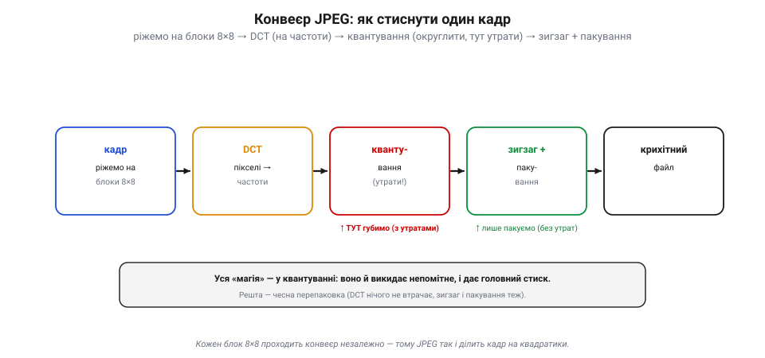
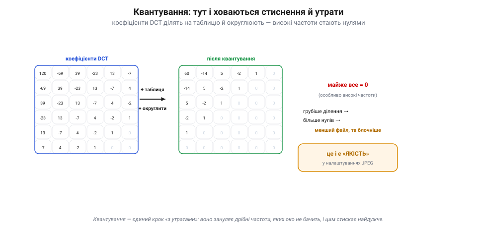

# JPEG: стиснення одного кадру

<preknowlist>
- [Ідея Фур'є](topic:math/fourier-idea) — будь-який сигнал можна розкласти на суму хвиль різної частоти: повільні хвилі несуть плавне, швидкі — дрібні деталі.
- [Роздільність і кадри](topic:communications/resolution-framerate) — зображення це сітка пікселів (мільйони точок у кадрі), кожна зі своєю яскравістю й кольором.
</preknowlist>

Фотографія — це мільйони пікселів, і кожен несе свої числа яскравості та кольору; сирими це мегабайти. А файл JPEG виходить у десять-двадцять разів менший, і око різниці майже не бачить. Звідки такий виграш? Бо сусідні пікселі в кадрі майже однакові: небо, стіна, обличчя — великі гладкі плями, де точка ледь відрізняється від сусідки. Цей запас схожості зветься **просторовим надлишком**, і найнаочніше його вирізає **JPEG** — спосіб стиснути **одне** зображення, не озираючись на інші кадри (тому й кажуть **intra-frame**, лат. *intra* — всередині, «у межах кадру»; так само кодують окремі I-кадри у відео). Конвеєр JPEG напрочуд логічний — розберімо його по кроках.

### Конвеєр у чотири кроки

JPEG не стискає весь кадр заразом — він ріже його на **квадратики 8×8 пікселів** і обробляє кожен **окремо**, одним і тим самим конвеєром.

*Конвеєр JPEG. Кадр ріжуть на блоки 8×8, і кожен незалежно проходить: **DCT** (пікселі → частоти, без утрат) → **квантування** (грубо округлити — тут єдина втрата й головний стиск) → **зигзаг** (нулі в хвіст) → **пакування** (RLE + Гаффман, без утрат) → крихітний файл. Уся «магія» — у квантуванні; решта — чесна перепаковка.*

Кроки такі. **Перший** — DCT (дискретне косинусне перетворення, англ. *discrete cosine transform*): 64 пікселі блока перетворюють на 64 **коефіцієнти частот**, де майже вся «суть» збирається в кількох низькочастотних числах (плавний фон блока), а високочастотні (дрібні деталі) крихітні. Це **без утрат** — лише інша форма запису тих самих 64 чисел. **Другий, головний** — **квантування**: коефіцієнти грубо **округлюють**, і дрібні високочастотні стають **нулями**. Ось тут — і єдина **втрата**, і головний стиск. **Третій** — **зигзаг**: коефіцієнти зчитують особливим порядком, щоб усі нулі зібралися в хвіст. **Четвертий** — **пакування**: довгий хвіст нулів і решту чисел упаковують у кілька байтів, знов **без утрат**. На виході — крихітний файл.

### Квантування: де ховаються стиск і втрати

Спинімося на серці JPEG — **квантуванні** (лат. *quantum* — «скільки, яка кількість»), бо саме воно робить усю роботу.

*Квантування — серце JPEG. Кожен коефіцієнт DCT ділять на число з таблиці й округлюють. Високі частоти ділять на великі числа — і вони стають нулями (а нулі майже нічого не коштують). Із 64 чисел лишається кілька. Грубість ділення — це і є «якість»: грубіше → більше нулів, менший файл, та блочніше. Це єдиний крок «з утратами».*

Ідея проста: кожен коефіцієнт **ділять** на число з **таблиці квантування** й **округлюють** до цілого. Таблицю підбирають так, щоб **високі** частоти ділити на **великі** числа — і вони після округлення обертаються на **нулі**. А нулів зберігати майже нічого не коштує. Так із 64 чисел лишається **кілька** ненульових. І тут-таки сидить **ручка якості**: ділиш **грубо** (великі числа в таблиці) — більше нулів, менший файл, але грубіша картинка; ділиш **дрібно** — навпаки. Те, що ти крутиш повзунком «якість 90 / 50 / 10» у редакторі, — це і є **грубість квантування**. І саме тут єдина точка, де JPEG **губить** інформацію: усі інші кроки оборотні.

> 📜 А пакують ту жменю чисел рекордно щільно завдяки коду, що його придумав **студент**, аби не складати іспит. 1951 року в MIT професор **Роберт Фано** (колега Шеннона) дав своєму класу вибір: іспит або реферат — знайти **найкоротший** можливий двійковий код. **Девід Гаффман** бився над задачею, уже мало не здався й сів готуватися до іспиту — аж тут його осяяло: будувати дерево коду **знизу вгору**, від найрідших символів. Так він знайшов **оптимальний** код — кращий за той, що мали сам Фано із Шенноном! Опублікований 1952-го, [**код Гаффмана**](topic:algorithms/huffman-coding) дає **найкоротший можливий запис серед посимвольних (префіксних) кодів** із цілими довжинами — і досі пакує фінальний крок JPEG, ZIP, MP3 і безлічі іншого. (Ще щільніше вміє **арифметичне кодування**, не прив'язане до цілого числа бітів на символ, — його беруть новіші кодеки.) Студент, що не хотів складати іспит, винайшов одну з найуживаніших цеглинок цифрового світу.

### Зигзаг: чому саме він

Лишилося пояснити дивний крок — **зигзаг**. Навіщо читати коефіцієнти якимось хитрим порядком?

*Навіщо зигзаг. Після квантування ненульові числа купчаться в кутку низьких частот (синє), решта — нулі. Зигзаг-обхід по діагоналях, від низьких частот до високих, вишиковує всі нулі в один довгий хвіст. Такий хвіст пакують майже задарма (кодом довжин серій), а решту — кодом Гаффмана: 64 числа → кілька байтів.*

Бо після квантування ненульові числа купчаться **в одному кутку** (низькі частоти, ліворуч-угорі), а решта блока — суцільні нулі. Якби їх читати рядками, нулі чергувалися б із числами. А **зигзаг** іде по діагоналях — від низьких частот до високих — і всі нулі вишиковуються в **один довгий хвіст**. А довгу низку однакових нулів пакують майже **задарма** [кодом довжин серій](topic:algorithms/rle): «далі 47 нулів» — це кілька байтів. Тоді решту чисел дотискають кодом Гаффмана. Так блок із 64 чисел стає **кількома байтами**.

### Ручка якості й артефакти

За все, звісно, платиться. Що грубіше квантування (менший файл) — то помітніші **артефакти**.

*Ручка якості й артефакти. Висока якість — великий файл, гладко; низька — малий файл, та видно **блоки 8×8** (бо кожен стискали окремо) і **«дзвін»** біля різких меж (погрубили високі частоти). Для машинного бачення це халепа: блочність і дзвін творять фальшиві краї й кольори, яких у сцені нема.*

Найхарактерніший — **блочність**: оскільки кожен квадратик 8×8 стискали окремо, за сильного стиснення їхні **межі** стають видні, і картинка розпадається на квадратики. Другий — **«дзвін»** (англ. *ringing* — «дзвеніння»): біля різких контурів з'являються хвильки-відлуння, бо різкий перепад — це високі частоти, які квантування погрубило. Плюс колір буває «розмазаний», бо його ще й проріджують окремо від яскравості — око до кольору менш чутливе. Для [машинного бачення](topic:algorithms/object-detection) це справжня халепа: блочність і дзвін творять фальшиві «краї» й кольори, яких у сцені нема, — і алгоритм бачить те, чого немає.

> 🔧 **Навіщо це.** «Якість» у налаштуваннях камери чи кодувальника — це прямо **грубість квантування**: тиснеш сильніше — менший файл і менша затримка, але блочніша картинка. Для запису красивого відео став якість вище; для FPV у вузькому радіоканалі — нижче, аби потік уліз і не лагав; а для машинного бачення стережися перетиску, бо артефакти збивають детектори. І якщо бачиш на сильно стисненому відео квадратну «решітку» — це ті самі блоки 8×8.

Усе це вичавлює лише **один** надлишок — схожість сусідніх пікселів у межах кадру. Та відео ховає ще й другий, багатший: сусідні **кадри** майже однакові між собою, бо за 1/30 секунди світ ледь змінюється. На ньому будується [міжкадрове стиснення](topic:algorithms/inter-frame), що додає ще десятки разів понад те, чого досяг JPEG усередині одного кадру.

---
