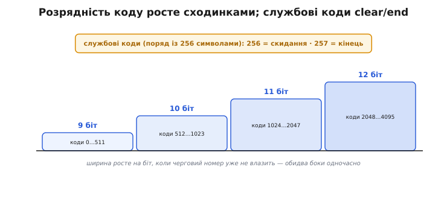
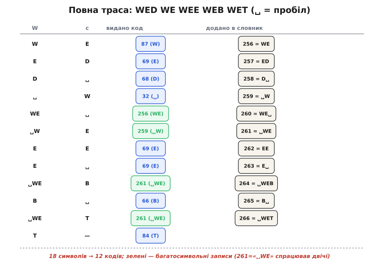
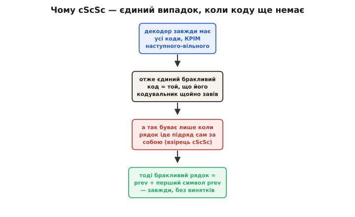

# LZW (детально)

<preknowlist>
- [Навіщо стискати](book:algorithms/why-compress) — що таке стиснення без втрат і чому в даних є надмірність, яку можна прибрати.
- [LZ77](book:algorithms/lz77) — словниковий підхід до стиснення: повтори заносять у словник і підставляють короткий номер замість цілого шматка.
</preknowlist>

[Базовий розбір LZW](book:algorithms/lzw) показує головну ідею: словник будується з потоку й **не передається** — обидва боки відтворюють його синхронно, а в канал ідуть самі номери. Тут ми спускаємося на рівень, де цю ідею можна реалізувати в робочому коді: точний байтовий алгоритм кодування й декодування, пакування кодів **змінної розрядності**, службові коди скидання й кінця, повний доказ того, чому пастка `cScSc` — **єдиний** особливий випадок декодера, і нарешті — як саме LZW сидить у GIF і чим він поступається сусідам по [сімейству стискачів](book:algorithms/why-compress). Усе з коротким коректним C, бо саме на цьому рівні ховаються справжні граблі.

### Точний байтовий словник: 256 символів плюс два службові коди

На байтових даних словник стартує не з кількох записів, а з усіх можливих **одиночних байтів**: коди від 0 до 255, по одному на кожне значення. Це початковий стан, відомий обом бокам напам'ять, — його не треба ні будувати, ні передавати. Нові, довші записи підуть під номерами від 256 угору.

Та перш ніж зайняти 256, варто зарезервувати кілька номерів під **службові коди** — сигнали, що не означають жодного рядка даних, а керують самим процесом. Практично потрібні два:

- **Код скидання** (*clear code*) — каже «очисти словник до початкових 256 записів і почни наново». У GIF це код з номером, рівним розміру початкового алфавіту (для 8-бітних даних — 256).
- **Код кінця** (*end-of-information*) — каже «дані скінчилися, далі не читай». У GIF це наступний номер (257).

Тож перший вільний номер для справжніх записів — не 256, а **258**. Дрібниця, але саме через неї найчастіше розходяться саморобна й еталонна реалізації: забув зарезервувати службові коди — і всі номери з'їхали на два, декодер читає сміття.


*Будова реального словника. Перші 256 номерів — одиночні байти; одразу за ними два службові коди (скидання й кінця), тож справжні записи йдуть від 258. Розрядність коду не фіксована: вона росте на біт щоразу, коли черговий номер уже не влазить у поточну ширину, — і кодувальник, і декодер роблять цей крок одночасно, бо обидва бачать, як росте таблиця.*

### Кодування байт за байтом

Правило кодувальника те саме, що в базовому розборі, лише записане точно для байтів. Кодувальник тримає **поточний рядок** `w` (на старті порожній) і читає вхід байт за байтом. На кожен байт `c`:

```
wc = w + c
якщо wc є в словнику:      w = wc                 (нарощуємо збіг)
інакше:                    видай код(w)           (w точно в словнику)
                           додай wc під наступним номером
                           w = c                   (новий збіг із c)
```

Коли вхід скінчився — видай код того `w`, що лишився, і службовий код кінця. От повний кодувальник; словник тут — проста хеш-таблиця «рядок → номер», а самі рядки представлені не явними байтовими послідовностями, а **парою (попередній номер, байт)** — це класичний трюк, що уникає зберігання довгих рядків:

:::tabs
```c
// LZW-кодування. Словник: запис = (батьківський код, байт). Рядок ніколи не
// зберігаємо цілком — лише його останній байт і номер «хвоста без останнього».
// dict[code] = {prefix, byte}; пошук "w+c" — за хешем (prefix=code(w), byte=c).
#define CLEAR 256
#define END   257
#define FIRST 258
#define MAXBITS 12
#define MAXCODE ((1 << MAXBITS) - 1)   // 4095

typedef struct { int prefix; uint8_t byte; } Entry;

// Хеш-таблиця (code(w), c) -> номер. Повертає номер або -1, якщо нема.
static int dict_lookup(int prefix, uint8_t c);          // деталі хешу опускаємо
static void dict_insert(int prefix, uint8_t c, int code);
static void dict_reset(void);                            // лишити тільки 0..255

void lzw_encode(const uint8_t *src, size_t n, BitWriter *bw) {
    dict_reset();
    int next = FIRST, width = 9;
    bits_put(bw, CLEAR, width);          // почати зі скидання — поширена угода

    int w = -1;                          // -1 = «порожній рядок»
    for (size_t i = 0; i < n; i++) {
        uint8_t c = src[i];
        if (w == -1) { w = c; continue; }    // перший байт — просто стає w
        int found = dict_lookup(w, c);
        if (found >= 0) {
            w = found;                       // wc у словнику — нарощуємо
        } else {
            bits_put(bw, w, width);          // видати код(w)
            dict_insert(w, c, next++);       // додати wc
            if (next > (1 << width) && width < MAXBITS)
                width++;                      // номер переріс ширину — +1 біт
            if (next > MAXCODE) {             // словник повний
                bits_put(bw, CLEAR, width);   // сигнал скидання
                dict_reset(); next = FIRST; width = 9;
            }
            w = c;                            // новий збіг
        }
    }
    if (w != -1) bits_put(bw, w, width);     // хвіст
    bits_put(bw, END, width);
}
```
```python
# LZW-кодування. Словник: ключ (prefix, byte) -> номер. Рядок ніколи не
# зберігаємо цілком — лише його останній байт і номер «хвоста без останнього».
CLEAR, END, FIRST = 256, 257, 258
MAXBITS = 12
MAXCODE = (1 << MAXBITS) - 1   # 4095

def lzw_encode(src, bw):
    dict_ = {}                          # (prefix, byte) -> номер
    next_, width = FIRST, 9
    bw.put(CLEAR, width)                # почати зі скидання — поширена угода

    w = -1                              # -1 = «порожній рядок»
    for c in src:
        if w == -1:                     # перший байт — просто стає w
            w = c
            continue
        found = dict_.get((w, c))
        if found is not None:
            w = found                   # wc у словнику — нарощуємо
        else:
            bw.put(w, width)            # видати код(w)
            dict_[(w, c)] = next_       # додати wc
            next_ += 1
            if next_ > (1 << width) and width < MAXBITS:
                width += 1              # номер переріс ширину — +1 біт
            if next_ > MAXCODE:         # словник повний
                bw.put(CLEAR, width)    # сигнал скидання
                dict_.clear()
                next_, width = FIRST, 9
            w = c                       # новий збіг
    if w != -1:
        bw.put(w, width)               # хвіст
    bw.put(END, width)
```
:::

Зверни увагу на дві тонкощі, видні з коду. По-перше, **рядок не зберігається цілком** — запис словника це лише `(prefix, byte)`, тобто «номер рядка без останнього байта» плюс цей останній байт. Так навіть запис, що відповідає рядку в сотню байтів, займає кілька байтів пам'яті, а сам рядок при потребі відновлюється проходом по ланцюжку `prefix`. По-друге, **порядок двох останніх дій критичний**: спершу видати код `w`, тоді додати `wc`. Якби додавали перед тим, як видати, номери поїхали б, і — головне — зник би той самий «крок позаду», на якому тримається синхронність із декодером.

Це представлення `(prefix, byte)` варте окремої уваги, бо саме воно робить LZW таким ощадливим до пам'яті. Кожен запис посилається на **інший запис** як на свій початок — виходить ланцюжок, що тягнеться до якогось одиночного байта (номер < 256), і самі байти ніде не дублюються. Запис `␣WEB` зберігається не як чотири байти, а як «(номер `␣WE`) + `B`», а `␣WE` — як «(номер `␣W`) + `E`», і так далі. Уся таблиця на 4096 записів займає тоді фіксовані 4096 × (кілька байтів на пару), незалежно від того, які довгі рядки в ній закодовані. Декодерська функція `dict_emit`, що перетворює номер на байти, іде цим ланцюжком **назад** — від останнього байта до першого, — а тому збирає рядок із **хвоста** і наприкінці його розвертає (або, як у коді вище, пише у буфер із кінця). Звідси й розмір буфера `MAXCODE + 1`: найдовший можливий запис не перевищує глибини ланцюжка, а вона обмежена розміром словника.

Хеш-таблиця для пошуку `w+c` теж має свою тонкість. Ключ — пара `(prefix, byte)`, тобто 12 бітів номера плюс 8 бітів байта, разом 20 бітів; зручно хешувати їх в одне число й тримати відкриту адресацію з лінійним пробуванням. Колізії неминучі, тож кожна комірка зберігає не лише номер, а й сам ключ `(prefix, byte)`, щоб відрізнити справжній збіг від чужого, що випадково сів у ту саму комірку. На скидання словника не треба фізично чистити всю таблицю — досить позначити комірки порожніми, наприклад завівши «номер покоління» й порівнюючи його; це робить скидання майже миттєвим, що важливо, коли воно трапляється часто.

### Повна траса на реальному рядку

Щоб побачити, як записи довшають і **повторно вживаються**, простежмо класичний приклад — рядок `WED WE WEE WEB WET` (пробіл позначатимемо `␣`). Тут алфавіт — звичайні ASCII-байти, нові записи йдуть від 256 (службові коди для стислості опускаємо — показуємо саму механіку словника).


*Кодування WED WE WEE WEB WET крок за кроком. Перші записи — пари (`WE`, `ED`, `D␣`, `␣W`), далі трійки (`WE␣`, `␣WE`) і навіть четвірки (`␣WEB`, `␣WET`). Виділені коди — багатосимвольні: за один номер летить цілий шматок. Запис 261 (`␣WE`) народжується раз, а вживається **двічі** — саме повторне вживання довгих записів і дає стиск: 18 символів обернулися на 12 кодів.*

Простежмо ключові кроки. Спершу йдуть самі одиночні байти, бо словник ще не знає жодної пари: `W`, `E`, `D`, `␣` — і кожен крок **додає** нову пару (`WE`=256, `ED`=257, `D␣`=258, `␣W`=259). Тоді трапляється перше повторне `WE`: рядок `w=W`, байт `E`, `WE` **уже є** (256) — нарощуємо `w=WE`, наступний байт `␣`, `WE␣` нема — **видаємо 256** (цілий `WE` одним кодом!) і додаємо `WE␣`=260. Далі `␣W` теж уже відоме (259), нарощуємо до `␣WE`, видаємо 259, додаємо `␣WE`=261. А наприкінці запис 261 (`␣WE`) спрацьовує **двічі** поспіль — у `␣WEB` і `␣WET`, — щоразу віддаючи три символи одним номером. Що довше тягнуться знайомі візерунки, то довші записи ловить кодувальник і то відчутніший стиск.

### Декодування й чому воно відстає рівно на крок

Декодер дістає той самий словник, не отримавши його, бо застосовує дзеркальне правило. Він теж стартує з 256 одиночних байтів, теж тримає **попередній** розкодований рядок (`prev`) і на кожен номер `code` робить:

```
рядок = словник[code]               (перевести номер у байти, вивести)
якщо prev існує:
    додай запис  prev + перший_байт(рядок)   під наступним номером
prev = рядок
```

Чому доданий запис збігається з тим, що завів кодувальник? Бо кодувальник додавав `w+c` — «щойно виданий рядок плюс перший байт **наступного**». Для декодера «наступний» рядок — це той, що він розкодує з наступного номера, і його перший байт декодер бачить аж тоді. Тому декодер додає той самий запис, але **на крок пізніше**: він дізнається останній бракливий байт продовження лише з наступного коду. Звідси й уся синхронність — і звідси ж єдина пастка.

### Пастка cScSc: повний розбір і доказ

Базовий розбір згадав пастку `KwKwK`; тут доведемо її до кінця, бо це місце, де декодер може спіткнутися, і саме тут варто бути педантичним. Запитання: чи може декодер отримати номер, якого **ще немає** в його словнику? На перший погляд — ні, адже кодувальник видає лише наявні коди. Та згадаймо порядок: кодувальник **додає** `wc` і може видати цей-таки номер **уже наступним** кроком, тоді як декодер про новий запис дізнається лише з наступного коду. Виникає вузька щілина в часі.

Доведімо точно, **коли** саме декодер натрапляє на відсутній код. Нехай декодер щойно вивів рядок `prev` і збирається завести запис під номером `next` (наступний вільний). Єдиний код, якого може бракувати, — це рівно `next`: усі менші номери вже в таблиці (вони заведені раніше), а більших кодувальник видати не міг (він теж нарощує номери підряд і не перестрибує). Отже, проблема зводиться до одного питання: **коли кодувальник видає номер тієї миті, як його завів?**


*Чому cScSc — єдиний випадок. Декодер відстає рівно на один запис, тож бракувати може лише наступний-вільний номер. Кодувальник видає номер у мить його створення тільки тоді, коли збіг наздоганяє власний хвіст — тобто рядок iде підряд сам за собою. У цьому і лише в цьому разі бракливий рядок має однозначний вигляд: попередній рядок плюс його ж перший символ.*

Розберімо механізм. Кодувальник заводить `wc` і **наступним же** кроком видає його номер тільки якщо новий поточний рядок (а це `c`, останній байт `wc`) одразу нарощується назад до того самого `wc`. Тобто у вході після `wc` знову йде `wc` — рядок наздоганяє власний хвіст. Запишімо `prev` (попередній виданий рядок) як `cS`, де `c` — його перший символ, а `S` — решта. Тоді ситуація, що породжує відсутній код, виглядає у вході як `cS cS c…` — символ `c`, рядок `S`, знову `c`, `S`, і ще `c`. Це і є взірець **`cScSc`**: кінець збігу зачіпає його ж початок.

А раз так, бракливий рядок завжди однозначний. Кодувальник видав номер для рядка `cSc` (тобто `prev` + перший символ `prev`), а декодер його ще не має. Та декодер **знає `prev`** і знає, що перший символ нового рядка дорівнює першому символу `prev` (бо рядок іде сам за собою) — отже може скласти бракливий рядок сам: **`prev` + перший_байт(`prev`)**. Це не евристика, а строгий висновок: у єдиному можливому випадку відсутній рядок має рівно цей вигляд. Ось декодер, що враховує це одним `if`:

:::tabs
```c
// LZW-декодування. Єдина тонкість — гілка code == next (випадок cScSc).
void lzw_decode(BitReader *br, uint8_t *dst, size_t cap) {
    dict_reset();
    int next = FIRST, width = 9;
    size_t o = 0;

    int prev = -1;
    uint8_t first_of_prev = 0;
    for (;;) {
        int code = bits_get(br, width);
        if (code == END) break;
        if (code == CLEAR) {                 // скидання — почати наново
            dict_reset(); next = FIRST; width = 9; prev = -1;
            continue;
        }

        uint8_t buf[MAXCODE + 1];            // рядок збираємо з ХВОСТА
        int len;
        if (code < next) {                   // код є — звичайний випадок
            len = dict_emit(code, buf);      // розкласти запис у байти
        } else if (code == next && prev != -1) {  // cScSc: код = наступний-вільний
            len = dict_emit(prev, buf);      // це prev + перший байт prev
            buf[len++] = first_of_prev;
        } else {
            return;                          // зіпсований потік
        }

        for (int k = 0; k < len; k++) dst[o++] = buf[k];   // вивести рядок
        uint8_t first_of_cur = buf[0];

        if (prev != -1) {                    // додати prev + перший байт поточного
            dict_insert(prev, first_of_cur, next++);
            if (next > (1 << width) && width < MAXBITS) width++;
        }
        prev = (code < next - 1) ? code : next - 1;   // новий prev (його номер)
        first_of_prev = first_of_cur;
    }
}
```
```python
# LZW-декодування. Єдина тонкість — гілка code == next (випадок cScSc).
def lzw_decode(br, dst):
    dict_ = {i: bytes([i]) for i in range(256)}   # номер -> байти рядка
    next_, width = FIRST, 9

    prev = None
    first_of_prev = 0
    while True:
        code = br.get(width)
        if code == END:
            break
        if code == CLEAR:                    # скидання — почати наново
            dict_ = {i: bytes([i]) for i in range(256)}
            next_, width = FIRST, 9
            prev = None
            continue

        if code in dict_:                    # код є — звичайний випадок
            s = dict_[code]                  # розкласти запис у байти
        elif code == next_ and prev is not None:  # cScSc: код = наступний-вільний
            s = dict_[prev] + bytes([first_of_prev])  # це prev + перший байт prev
        else:
            return                           # зіпсований потік

        dst.extend(s)                        # вивести рядок
        first_of_cur = s[0]

        if prev is not None:                 # додати prev + перший байт поточного
            dict_[next_] = dict_[prev] + bytes([first_of_cur])
            next_ += 1
            if next_ > (1 << width) and width < MAXBITS:
                width += 1
        prev = code if code < next_ - 1 else next_ - 1   # новий prev (його номер)
        first_of_prev = first_of_cur
```
:::

Найтонше місце — гілка `code == next`: без неї декодер на рядку з повтором підряд або впаде (звернення до неіснуючого запису), або видасть сміття. Це найчастіший баг саморобного LZW: усе працює, аж поки на вхід не трапиться щось на кшталт `TOBEORTOBEORTOBEOR…` — і саме там декодер перечіпляється об щойно народжений код. Ще одна дрібниця в коді: розрядність декодер мусить нарощувати **на той самий крок раніше**, ніж кодувальник, бо він читає номер, перш ніж завести запис, — класичне джерело розсинхрону «на один біт», коли декодер переходить на ширшу ширину то на крок пізніше, то на крок раніше за кодувальника.

> 🔧 **Навіщо це.** Якщо колись писатимеш чи лагодитимеш LZW-кодек, ці два рядки коштуватимуть тобі найбільше часу: гілка `code == next` і момент зростання розрядності. Перевіряй реалізацію не на «звичайному» тексті, а навмисне на рядках із негайним повтором (`ABABAB…`, `AAAAA…`) — саме вони запускають `cScSc`. І звіряй ширину коду біт-у-біт із еталоном на межах 511→512, 1023→1024: різниця на один крок ширини зсуває весь подальший потік.

### Пакування кодів змінної розрядності

Дотепер ми говорили про «номери», та у файл вони лягають **бітами**, і LZW робить це ощадливо: ширина коду не фіксована, а **росте сходинками**. Поки всі номери ≤ 511, кожен код пишеться 9 бітами; щойно з'явився номер 512 — переходимо на 10 бітів, далі на 11, на 12 (типова стеля — 4096 записів). Тримати від початку 12 бітів марнотратно, коли номери ще малі; зростання ширини економить майже біт на кожному ранньому коді.

Зростання має бути **синхронним**: обидва боки переходять на ширшу ширину в ту саму мить, інакше потік розсиплеться. Тонкість у тому, **коли саме**: кодувальник збільшує ширину, коли `next` (наступний номер, що він заведе) перевалює за поточну межу; декодер — коли `next` у нього досягає тієї ж межі, але він робить це **перед** читанням наступного коду. Через зсув «декодер на крок попереду в нарощуванні таблиці» межі зростання в коді кодера й декодера записують трохи по-різному (порівняння `>` чи `>=`, `next` чи `next+1`) — і саме тут криється класичний «off-by-one», через який чужий формат раптом не читається.

Сам біт-пакувальник простий — складаємо коди в бітовий буфер молодшими бітами вперед (так робить GIF):

:::tabs
```c
// Бітовий запис LSB-first (як у GIF): код width бітів дописуємо до акумулятора.
typedef struct { uint8_t *out; size_t o; uint32_t acc; int nbits; } BitWriter;

void bits_put(BitWriter *bw, int code, int width) {
    bw->acc |= (uint32_t)code << bw->nbits;   // молодші біти коду — першими
    bw->nbits += width;
    while (bw->nbits >= 8) {                   // вивантажуємо повні байти
        bw->out[bw->o++] = (uint8_t)(bw->acc & 0xFF);
        bw->acc >>= 8;
        bw->nbits -= 8;
    }
}
// наприкінці: якщо лишилися біти (nbits>0) — дописати останній неповний байт.
```
```python
# Бітовий запис LSB-first (як у GIF): код width бітів дописуємо до акумулятора.
class BitWriter:
    def __init__(self):
        self.out = bytearray()
        self.acc = 0
        self.nbits = 0

    def put(self, code, width):
        self.acc |= code << self.nbits         # молодші біти коду — першими
        self.nbits += width
        while self.nbits >= 8:                  # вивантажуємо повні байти
            self.out.append(self.acc & 0xFF)
            self.acc >>= 8
            self.nbits -= 8

    def flush(self):
        # наприкінці: якщо лишилися біти (nbits>0) — дописати останній неповний байт.
        if self.nbits > 0:
            self.out.append(self.acc & 0xFF)
            self.acc = 0
            self.nbits = 0
```
:::

Порядок бітів — теж предмет угоди формату: GIF пакує **молодшими бітами вперед** (LSB-first), а, скажімо, TIFF — старшими (MSB-first). Переплутав порядок — і той самий потік номерів дасть зовсім інші байти, нечитані чужим декодером.

### Що робити з повним словником: заморозити чи скинути

Рано чи пізно номери впираються в стелю (4096 при 12 бітах), і вільних більше нема. Тут можливі дві стратегії, і кодек обирає одну.

Перша — **заморозити** словник: припинити додавати записи й далі кодувати тим, що вже є. Це безпечно й просто, але має ваду: якщо вдача даних змінилася (далі пішов зовсім інший текст), заморожений старий словник дедалі гірше відповідає новим даним, і стиск повзе вниз. Деякі реалізації пом'якшують це, стежачи за коефіцієнтом стиску: поки заморожений словник тисне добре — лишають його, а як стало гірше за поріг — скидають.

Друга — **скинути** словник кодом скидання: обидва боки очищають таблицю до початкових 256 записів і нарощують її наново, уже під свіжі дані. Так робить Unix `compress`: він безперервно міряє, наскільки добре тисне, і коли коефіцієнт починає псуватися, шле код скидання — щоб не тягти застарілий словник. Платою за скидання є короткий «провал» одразу після нього: новий словник знову порожній, перші коди знову однобайтні, поки таблиця не набере довгих записів. Тому скидати варто не за розкладом, а **за потребою** — коли користь від свіжого словника переважує цей провал.

> 🔧 **Навіщо це.** Поведінка на повному словнику — це те, що відрізняє іграшковий LZW від придатного для довгих потоків. Якщо тиснеш файл, де природа даних змінюється (заголовок, тоді інше тіло, тоді ще інше), заморожений словник віддасть помітно гірший результат, ніж той, що вчасно скидається. А якщо потік однорідний — зайві скидання лише шкодять, бо щоразу починаєш із порожнього. Правильний кодек дивиться на власний коефіцієнт стиску й вирішує динамічно.

### LZW усередині GIF: блоки, рання зміна ширини, кадри

GIF — найвідоміший дім LZW, і його реалізація має кілька особливостей, які варто знати, читаючи реальні файли. По-перше, **початкова ширина коду** в GIF дорівнює розмірові піксельного коду плюс один: для 8-бітних індексів кольору — 9 бітів від старту (бо самі індекси 8-бітні, а службові коди вимагають дев'ятого). По-друге, GIF тримає службові коди скидання й кінця **відразу за** палітрою індексів: якщо в зображенні `2^k` кольорів, то код скидання має номер `2^k`, а код кінця — `2^k + 1`, і перші справжні записи йдуть із `2^k + 2`.

По-третє — горезвісна **рання зміна ширини** (*early change*): через історичну особливість деяких ранніх кодувальників GIF збільшує розрядність коду **на один код раніше**, ніж випливало б із суворої логіки (на межі `2^width − 1`, а не `2^width`). Це той самий «off-by-one», що ловить більшість саморобних GIF-декодерів: формат сам у собі несе цю несиметричність, і її доводиться відтворювати, інакше байти не зійдуться. По-четверте, потік кодів GIF розбитий на **під-блоки** завдовжки до 255 байтів кожен (перший байт під-блока — його довжина), а нульова довжина позначає кінець потоку; це чисто транспортна обгортка навколо бітів LZW.

Анімований GIF — це послідовність **кадрів**, і кожен кадр стискається LZW **незалежно**: свій старт зі скидання, свій словник, свій кінець. Тому GIF не використовує **міжкадрову** надмірність так, як це робить [відеостиснення](book:algorithms/inter-frame) — він не порівнює сусідні кадри, лише дозволяє кадрові перемалювати частину площі поверх попереднього. Звідси й роздуті розміри анімованих GIF проти справжнього відео: кожен кадр платить за себе сам.

### Де LZW сильний, а де поступається

LZW виграє там, де в даних багато **однакових повторюваних візерунків**, що швидко наповнюють словник довгими записами: палітрова графіка з великими однотонними зонами, піксель-арт, прості схеми, текст із частими словами. На фотографії чи вже стиснених даних він майже безсилий — повторів обмаль, словник набирає самі короткі записи, а на несхожих байтах LZW навіть трохи **роздуває** потік (кожен новий байт коштує цілий код).

Проти сусідів LZW програє за **щільністю**, але виграє за **простотою й швидкістю**. [Арифметичне кодування](book:algorithms/arithmetic-coding) тисне впритул до [ентропійної межі](book:algorithms/entropy), віддаючи символу дробову частку біта, — LZW так не вміє, бо оперує цілими кодами. [LZ77](book:algorithms/lz77) гнучкіше ловить близькі повтори (посиланнями «назад на стільки-то, копіюй стільки-то») і, поєднаний із [кодом Гаффмана](book:algorithms/huffman-coding) у вигляді [DEFLATE](book:algorithms/deflate), дає кращий стиск, ніж чистий LZW, — саме тому zip, gzip і PNG стоять на LZ77+Гаффман, а не на LZW. Натомість LZW реалізується в кілька десятків рядків, працює одним проходом без важкого заголовка й чудово лягає на просте залізо (для чого Велч його й задумав — для дискових контролерів). Звідси його роль: не найкращий стиск, а **дешевий і швидкий** для свого класу даних.

> 🔧 **Навіщо це.** Вибір між LZW та сусідами — практичний. Треба максимум стиску загальних даних — бери LZ77+Гаффман (DEFLATE), він стандартний і всюди підтриманий. Треба притиснутися до ентропії на відомому розподілі — арифметичне кодування чи [ANS](book:algorithms/asymmetric-numeral-systems). А LZW лишається доречним там, де цінується простота реалізації й потоковість: розбір старих форматів (`.Z`, GIF, LZW-TIFF), украй обмежене залізо, або коли формат уже диктує саме LZW.

### Патент, що загальмував GIF

Історія LZW на цьому не закінчується, бо саме реалізація в GIF зробила його героєм повчальної пригоди про те, як патент на алгоритм здатен загальмувати цілий формат. Прийом уперше з'явився на людях 1984 року: **Террі Велч** (англ. *Terry A. Welch*) описав його в статті «A Technique for High-Performance Data Compression» у журналі *Computer* — це й була та третя літера, що додала «W» до назви LZ. Велч довів до робочого вигляду ідею словника, що росте на льоту, з раніших праць **Авраама Лемпеля** та **Якоба Зіва** (їхні LZ77 і LZ78 заклали словниковий підхід; LZW — практичне доведення схеми LZ78 до придатного стану). Винахід тут колективний: теорія Лемпеля й Зіва плюс інженерне доведення Велча — звідси й назва **Lempel-Ziv-Welch**.

Заковика в тому, що ще до публікації, у червні **1983 року**, Велч подав патентну заявку; патент США 4 558 302 видали (спершу на корпорацію Sperry, згодом Unisys) у **1985 році**. Кілька років на це мало хто зважав: LZW тихо розійшовся по `compress`, по TIFF і, головне, по **GIF**, який став стандартним форматом картинок раннього вебу. А тоді, наприкінці **1994 року**, Unisys і CompuServe оголосили, що розробники програм, які створюють чи читають GIF, мусять **ліцензувати** патент. Спільнота, що роками мала формат за вільний, опинилася перед раптовою вимогою платити.


*Чому GIF поступився PNG. Алгоритм роками вільно розходився, аж поки 1994-го власник патенту зажадав ліцензій. У відповідь спільнота швидко зробила **вільний** формат — PNG (1996), що стискає [алгоритмом DEFLATE](book:algorithms/deflate) на основі LZ77, не обтяженим патентом. Патент США сплив **2003 року** (закордонні відповідники — у 2004-му), та на той час PNG уже закріпився.*

Відповідь спільноти була швидка й рішуча: за рік-два народився **PNG** (1996) — формат картинок без жодного патенту, що стискає не через LZW, а [алгоритмом DEFLATE](book:algorithms/deflate) на основі [LZ77](book:algorithms/lz77). Патент на LZW зрештою сплив — у США **20 червня 2003 року** (рівно через 20 років після подання заявки), а закордонні відповідники в Канаді, Британії, Франції, Німеччині, Італії та Японії — упродовж 2004-го. Та для GIF як «вільного стандарту» було вже пізно: PNG на той час укоренився. Так вийшло, що найтонше інженерне місце LZW — синхронний словник без передачі — пережило його ж юридичну спадщину: сам прийом лишився хрестоматійним, а формат, який його прославив, поступився вільному наступникові. (Ці факти усталені: дати патенту, авторство Велча й хронологія GIF→PNG задокументовані й безсуперечні.)
