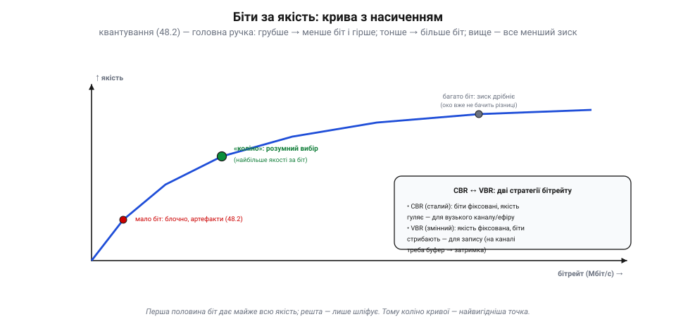
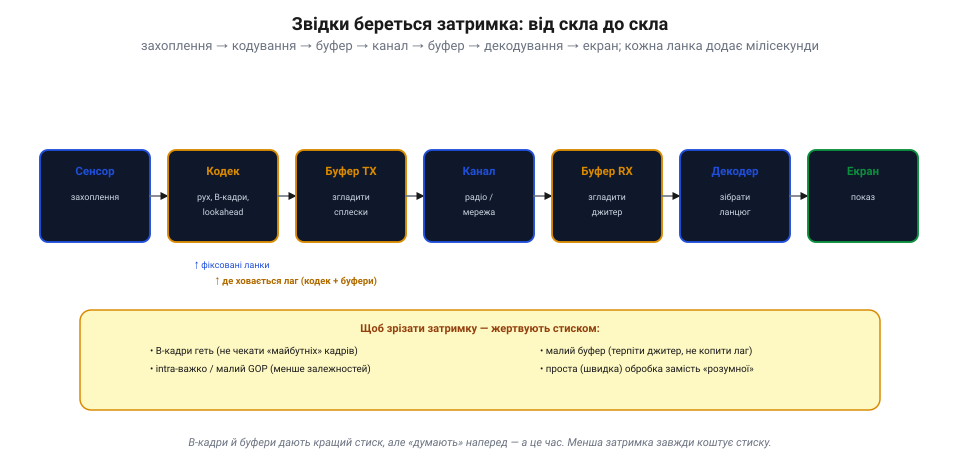
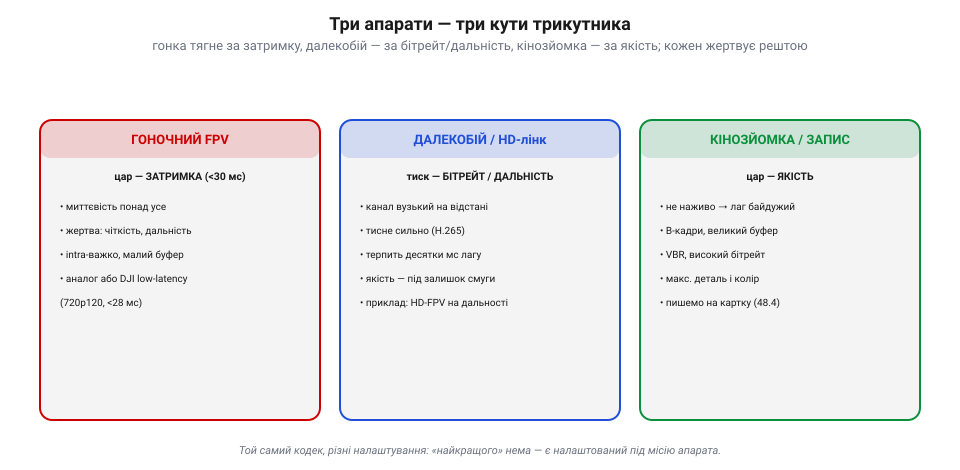

# Компроміс: якість ↔ бітрейт ↔ затримка

Коли доходить до реальної передачі відео з апарата, стискання впирається в **залізний компроміс**, якого не обійти жодним кодеком. Є три речі, яких усі хочуть водночас: **якість** (щоб гарно було видно), малий **бітрейт** (щоб улізти у вузький канал і пам'ять) і мала **затримка** (щоб бачити **зараз**, а не пів секунди тому). Біда в тім, що всі три найкращими не бувають — вони тягнуть одна одну.

### Три ручки, що тягнуть одна одну

Уяви три ручки на пульті кодувальника. **Якість** — наскільки чітка й чиста картинка (роздільність, деталі, мало артефактів). **Бітрейт** — скільки біт за секунду їсть потік (а отже, яку смугу каналу й скільки місця він займає). **Затримка** — скільки минає від моменту, коли світло впало на сенсор, до моменту, коли кадр спалахнув на твоєму екрані.

*Трикутник компромісу. Три ручки — **якість**, **бітрейт**, **затримка** — тягнуть одна одну: викрутиш дві як хочеш, а третя визначиться сама. Хочеш якість — плати бітрейтом або затримкою. Канал тисне бітрейт — ріж якість або копи буфер (лаг). Треба мала затримка — стиск гірший, тож або якість падає, або бітрейт росте. Найчастіше **канал задає бітрейт** (його смуга фіксована), і тоді ти торгуєш якість проти затримки.*

Це не вада конкретної техніки, а **закон**: викрутиш дві ручки як заманеться — третя визначиться сама. Хочеш максимум якості за малого бітрейту? Доведеться тиснути «розумно» й повільно — виросте затримка. Хочеш миттєвість за гарної якості? Готуй широкий бітрейт. Зазвичай реальність ще й **забирає вибір однієї ручки**: канал (радіо чи мережа) має фіксовану смугу, тобто **задає бітрейт** згори. Тоді в тебе лишаються тільки дві ручки — і ти торгуєш **якість проти затримки**.

### Якість проти бітрейту: крива з насиченням

Перша пара — якість і бітрейт. Головна ручка тут — [грубість квантування](book:algorithms/jpeg-intra): тиснеш грубіше — менше біт, але видно блоки й артефакти; тонше — більше біт і чистіша картинка. Якщо намалювати залежність якості від бітрейту, вийде не пряма, а **крива з насиченням**.

*Біти за якість. Перша половина біт дає майже всю якість — крива круто йде вгору; далі вона **вирівнюється**: кожен наступний мегабіт додає все менше помітного. Зліва — мало біт: блочно й брудно. «Коліно» — найвигідніша точка (максимум якості за біт). Справа — багато біт, та зиск дрібніє, бо око вже не бачить різниці. Звідси й дві стратегії бітрейту: **CBR** (сталий — для каналу) і **VBR** (змінний — для запису).*

Крива круто росте спочатку (перші біти дають майже всю якість), а тоді **вирівнюється**: кожен наступний мегабіт додає все менше помітного — око вже не бачить різниці. «**Коліно**» цієї кривої — найвигідніша точка: максимум якості за вкладений біт. Звідси й дві стратегії розподілу бітрейту в часі. **CBR** (*constant bitrate*, сталий) тримає біти фіксованими, а якість гуляє — складна сцена виглядає гірше; зате потік рівно лягає у вузький канал. **VBR** (*variable bitrate*, змінний) тримає **якість** сталою, а біти стрибають — на складних сценах їх більше; чудово для запису, та на каналі ці стрибки треба десь **буферити**, а буфер додає затримку. І так ми впираємось у третю ручку.

### Звідки береться затримка

Затримку часто звуть «**від скла до скла**» (*glass-to-glass*) — від скла об'єктива до скла екрана. Це **сума** дрібних затримок усього ланцюга, і кожна ланка щось додає.

*Затримка від скла до скла. Кадр проходить ланцюг: захоплення сенсором → кодування → буфер передачі → канал → буфер прийому → декодування → екран. Фіксовані ланки (сенсор, канал) майже не вкоротиш. А ось **кодек і буфери** — головні схованки лагу: B-кадри й lookahead «думають наперед», буфери згладжують сплески, та все це коштує часу. Щоб зрізати затримку — жертвують стиском: B-кадри геть, intra-важко, малий буфер, проста обробка.*

Найбільше затримки ховається у двох місцях. Перше — **кодек**: [пошук руху](book:algorithms/inter-frame) — важка робота, а **B-кадри** взагалі мусять зазирати в «майбутні» кадри, тобто кодувальник чекає, доки вони прийдуть, перш ніж видати поточний. Те саме з «**lookahead**» — заглядання наперед заради кращого стиску. Друге — **буфери**: вони згладжують стрибки бітрейту (VBR) і нерівний прихід пакетів («джитер»), та все, що осіло в буфері, **чекає** — а це лаг. Тому рецепт малої затримки завжди той самий і завжди коштує стиску: **B-кадри геть** (не чекати майбутніх), **intra-важко** чи малий GOP (менше залежностей), **малий буфер** (терпіти джитер, а не копити лаг), проста швидка обробка замість «розумної». Менша затримка — гірший стиск; іншого не буває.

### Як це лягає на апарат

Звідси й видно, чому різні апарати крутять ці ручки геть по-різному — кожен жертвує тим, що для його місії дешевше.

*Три апарати — три кути трикутника. **Гоночний FPV**: цар — затримка (<30 мс), жертва — чіткість і дальність; intra-важко, малий буфер, аналог або DJI low-latency. **Далекобій / HD-лінк**: канал на відстані вузький, тож тиснуть сильно (H.265) і терплять десятки мс лагу, а якість — під залишок смуги. **Кінозйомка / запис**: цар — якість, лаг байдужий (не наживо), тож B-кадри, великий буфер, VBR і високий бітрейт. Той самий кодек — різні налаштування.*

**Гоночний FPV**: затримка — цар (пілотові потрібні <30 мс, бо інакше він б'ється об ворота), тож жертвують і чіткістю, і дальністю — intra-важке кодування, крихітний буфер. **Далекобійний HD-лінк**: на відстані канал вужчає, бітрейт і дальність у дефіциті, тож тиснуть сильно (H.265) і терплять десятки мілісекунд лагу, а якість беруть «під залишок» смуги. **Кінозйомка чи запис на картку**: дивитися наживо не треба, тож затримка байдужа — і можна викрутити якість на максимум: B-кадри, великий буфер, VBR, високий бітрейт. Кодек той самий — різниця лише в тому, які ручки прикрутили.

> 📜 **Як цифрове FPV роками програвало аналогу — поки затримка не впала до 28 мс.** Десятиліттями гонщики-дрони вперто літали на **аналоговому** відео — каламутному, шумному, з роздільністю гіршою за старий телевізор. Чому? Бо аналог давав майже **нульову затримку**: картинка з'являлася перед очима практично миттєво. Перші **цифрові** системи (на Wi-Fi чи з екшн-камер) давали гарну HD-картинку, але з лагом у сотні мілісекунд — на такому в гонці не полетиш, дрон у стіні раніше, ніж ти побачиш стіну. Це був трикутник у чистому вигляді: цифра вигравала якість, та програвала затримку. Аж 2019-го **DJI** випустила Digital FPV System і нарешті зламала компроміс: HD-картинка із затримкою всього **~28 мілісекунд** — нарівні з аналогом. Хитрість була саме в тому, щоб свідомо **пожертвувати** двома кутами трикутника заради третього: знизити роздільність (720p, не 1080p) і дальність, зате відкрутити ручку затримки до краю. DJI навіть винесла цей компроміс прямо в меню: **Low-Latency Mode** (720p/120 кадрів, <28 мс) проти **High-Quality Mode** (720p/60 кадрів, <40 мс) — пілот власноруч крутить ту саму ручку «якість ↔ затримка», про яку ця тема. Трикутник нікуди не зник — його просто дали в руки пілотові.

> 🔧 **Навіщо це.** Налаштовуючи відеолінк, спершу спитай: **яка ручка для цієї місії священна?** Гонка чи ручне пілотування — священна **затримка**: бери аналог чи цифровий low-latency режим, intra-важко, малий буфер, і не плач за роздільністю. Далекий політ — священний **бітрейт/дальність**: тисни H.265, терпи лаг, віддай якість під залишок смуги. Запис «для кіно» — священна **якість**: VBR, великий буфер, B-кадри, лаг неважливий. Головне — **не чекай усіх трьох одразу**: щойно хтось обіцяє «HD, миттєво й по тонкому каналу» — він щось замовчує (зазвичай дальність або стабільність).

Цей торг описує лише, **чим** ми платимо за картинку. **Як** саме стиснутий потік долітає з апарата на землю — окрема історія: [радіоканал аналогового FPV і цифрова мережа](book:communications/video-transmission) кладуть на той самий компроміс свої власні обмеження смуги й затримки.
