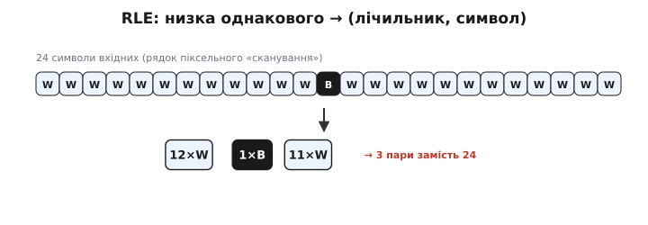
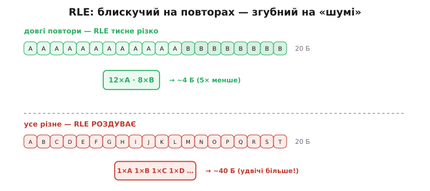
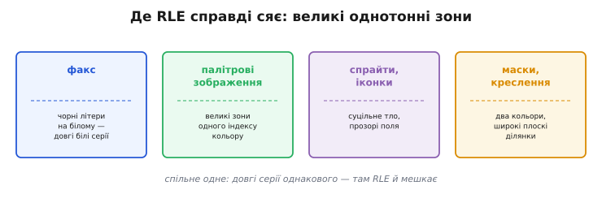
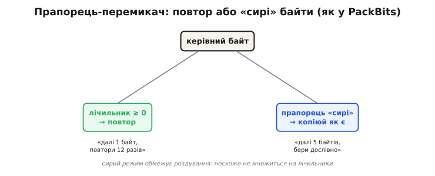

# RLE (довжини серій)

### Найгрубіший спосіб не писати зайвого

Уся [техніка стиснення](topic:algorithms/why-compress) зводиться до одного: не зберігай того, що можна **передбачити** з уже відомого. RLE — найпряміше, майже дитяче втілення цієї думки. Він ловить **найпростіший** рід надлишку: коли той самий символ повторюється **поспіль**, багато разів підряд.

Уяви рядок із сканування факсу — суцільно білі точки, потім кілька чорних, знову білі. Записувати кожну білу точку окремо — марнотратство: щойно ти побачив білу, наступна майже напевно теж біла. То навіщо її писати? Запиши **один раз символ** і **скільки разів** він іде підряд. Дванадцять білих точок — це не дванадцять записів, а один: «біла, дванадцять разів». Ось і весь прийом. Він зветься **кодуванням довжин серій** (*run-length encoding*, англ. *run* — «серія, низка однакового», *length* — «довжина»): серію однакових символів замінюємо парою **(символ, лічильник)**.


*Душа RLE. Низку однакових символів замінюємо однією парою: 12 білих точок → «12×W», одна чорна → «1×B», 11 білих → «11×W». Замість 24 записів — три. Що довша серія, то більший виграш; саме на цьому стоїть стиснення факсів і палітрових картинок.*

Це **стиснення без утрат** (*lossless*): із пар можна точно, до біта, відновити оригінал — просто розгорни кожну назад у стільки копій, скільки каже лічильник. Нічого не викинуто, лише записано стисліше. Тому RLE годиться там, де **кожен біт святий**, а не лише там, де важить розмір.

### Чому це працює — і коли

Виграш від RLE цілком тримається на **довжині серій**. Що довша низка однакового, то більше записів вона замінює одним. Серія з тисячі однакових байтів стискається в **одну** пару — це стиск у сотні разів. Але серія з одного-єдиного символу не стискається ніяк: щоб записати «цей символ, один раз», треба і символ, і лічильник — тобто **два** елементи замість одного.

Ось тут і ховається головна пастка RLE: на даних **без повторів він не стискає, а РОЗДУВАЄ**. Якщо кожен сусідній символ інший — текст, уже стиснені дані, шум, — то на кожен символ доводиться чіпляти ще й лічильник «один раз», і вихід стає вдвічі більшим за вхід. Наївний RLE корисний лише тоді, коли **середня довжина серії перевищує два**; коротші серії з'їдають усю економію й ведуть у мінус.


*Дві сторони RLE. **Угорі** — довгі повтори (12 однакових, тоді 8 однакових): дві пари замість 20 байтів, стиск у п'ять разів. **Унизу** — усе різне: на кожен символ доводиться чіпляти лічильник «один раз», і 20 байтів обертаються на 40. Той самий метод блискучий на повторах і згубний на «шумі».*

> 🔧 **Навіщо це.** Перш ніж тулити RLE до якихось даних, спитай себе: чи довгі в них серії однакового? Картинка-логотип із суцільним тлом, маска, факс — так, серії довжелезні, RLE тисне чудово. Уже запакований JPEG, випадкові байти, звичайний текст — серій майже нема, і RLE лише роздує файл. Тому в реальних форматах RLE або вмикають **лише там, де він допомагає**, або захищають від роздування прапорцями (нижче). Сліпо застосувати його до всього — певний спосіб зробити файл більшим.

### Куди RLE лягає ідеально

RLE мешкає там, де в даних **великі однотонні зони** — суцільні ділянки одного значення, що дають довгі серії.


*Природне середовище RLE. **Факс**: чорний текст на білому аркуші — рядки з довжелезними білими серіями. **Палітрові зображення**: великі плями одного індексу кольору. **Спрайти й іконки**: суцільне тло, широкі прозорі поля. **Маски й креслення**: два кольори, плоскі ділянки. Спільне одне — довгі серії однакового.*

Класичний приклад — **факс**. Сторінка факсу чорно-біла: чорні літери на майже суцільно білому аркуші. Кожен рядок сканування — це довжелезні білі серії з рідкими чорними вкрапленнями, ідеальна їжа для RLE. Стандарти факсу **CCITT Group 3** (ITU-T T.4, 1980) і **Group 4** (ITU-T T.6, 1984) саме так і працюють: кодують **довжини білих і чорних серій** на кожному рядку, а самі довжини ще й дотискають [кодом Гаффмана](topic:algorithms/huffman-coding) — короткі серії дістають короткі коди, рідкісні довгі — довші. Так аркуш тексту стискається в десятки разів і пролазить телефонною лінією за секунди.

Так само добре RLE лягає на **палітрові зображення** (де піксель — це індекс у таблиці кольорів): великі зони неба чи стіни стають однаковим індексом і згортаються в кілька пар. На цьому стояли старі формати картинок — PCX, BMP, TGA — і дотепер стоять **спрайти й іконки** в іграх, де багато суцільного тла й прозорих полів. Та сама логіка — у масок і креслень: два-три кольори, широкі плоскі ділянки.

### Як уберегтися від роздування: прапорці

Раз наївний RLE роздуває дані без повторів, постає природне питання: **як зробити, щоб у найгіршому разі не стало набагато гірше?** Адже реальна картинка — це не суцільні серії: ділянки повторів чергуються з ділянками, де все різне. Хочеться тиснути перші й не псувати другі.

Розв'язок — навчити кодувальник **двох режимів** і перемикати їх **прапорцем** (керівним байтом). Один режим — звичний повтор: «далі один символ, повтори його стільки-то разів». Другий — **сирий**: «далі стільки-то байтів, бери їх **дослівно**, не чіпаючи». Тоді ділянку, де все різне, кодувальник не множить на лічильники по одному, а гуртом позначає як «сирі» — і платить за неї лише **один** зайвий керівний байт на цілий шматок.


*Захист від роздування — два режими через керівний байт. Одне значення каже «повтори наступний байт N разів» (виграш на серіях); інше — «візьми наступні N байтів дослівно» (для ділянок, де все різне). Сирий режим не дає несхожим даним множитися на лічильники: за цілий строкатий шматок платимо лише одним зайвим байтом.*

Саме так влаштований **PackBits** — проста й дуже поширена схема RLE (її ввела Apple, вона ж стандартне стиснення у форматі TIFF). Керівний байт зі знаком: невід'ємне число `n` означає «далі `n+1` сирих байтів — копіюй як є»; від'ємне — «повтори наступний єдиний байт» потрібну кількість разів. Завдяки сирому режиму **найгірший випадок PackBits обмежений**: він роздуває дані щонайбільше на **один байт на кожні 128** вхідних — це менш ніж один відсоток, тоді як наївний RLE міг подвоїти розмір. Платиш дрібку на найгіршому, зате на серіях виграш повний.

Є й інший спосіб уникнути роздування — **escape-байт** (англ. *escape* — «вихід, утеча»): домовляємося про спеціальний символ-прапорець, який сам каже «далі йде пара (лічильник, символ)», а все інше пишемо як є, без лічильників. Тоді поодинокі символи не дорожчають зовсім, а пакуються лише справжні серії — починаючи з тих, де лічильник окупає прапорець. Платою стає те, що сам символ-прапорець, коли він трапляється в даних, доводиться якось екранувати.

### Порахуймо виграш і гірший випадок

Прикинемо на пальцях, щоб «стиск» і «роздування» перестали бути словами. Візьмемо рядок піксельних індексів і закодуємо його найпростішим RLE — кожна серія стає парою з двох байтів (символ і лічильник).

**Стиск на довгих серіях.** Рядок із 20 однакових пікселів кольору `5`, тоді 8 пікселів кольору `2`:

```
вхід:   5 5 5 5 5 5 5 5 5 5 5 5 5 5 5 5 5 5 5 5  2 2 2 2 2 2 2 2
        ─────────── 20 однакових ───────────    ── 8 однакових ──
RLE:    (20, 5)  (8, 2)
байтів: 28 на вході  →  2 пари × 2 байти = 4 байти на виході
виграш: 28 / 4 = 7×
```

**Гірший випадок на «шумі».** Той самий кодувальник на рядку, де всі 8 пікселів різні:

```
вхід:   3 1 4 1 5 9 2 6          (8 різних байтів)
RLE:    (1,3) (1,1) (1,4) (1,1) (1,5) (1,9) (1,2) (1,6)
байтів: 8 на вході  →  8 пар × 2 байти = 16 байтів на виході
«виграш»: 8 / 16 = 0.5×  — файл роздувся ВДВІЧІ
```

Той самий код: на серіях стиск у сім разів, на строкатому — роздування вдвічі. Усе вирішує середня довжина серії. Ось як виглядає кодувальник наївного RLE у прошивці — короткий і коректний:

:::tabs
```c
// Наївний RLE: серію однакових байтів пишемо парою (лічильник, символ).
// Лічильник — один байт, тож серію довшу за 255 ріжемо на шматки.
// Повертає кількість записаних байтів у dst (буфер виклику має вмістити 2*n у гіршому разі).
size_t rle_encode(const uint8_t *src, size_t n, uint8_t *dst) {
    size_t o = 0;
    for (size_t i = 0; i < n; ) {
        uint8_t  v   = src[i];
        size_t   run = 1;
        // рахуємо серію, поки той самий байт і поки влазить у лічильник 8 біт
        while (i + run < n && src[i + run] == v && run < 255)
            run++;
        dst[o++] = (uint8_t)run;   // лічильник
        dst[o++] = v;              // символ
        i += run;
    }
    return o;
}
```
```python
# Наївний RLE: серію однакових байтів пишемо парою (лічильник, символ).
# Лічильник — один байт, тож серію довшу за 255 ріжемо на шматки.
# Повертає bytes із пар (лічильник, символ); у гіршому разі — 2*len(src).
def rle_encode(src: bytes) -> bytes:
    dst = bytearray()
    i, n = 0, len(src)
    while i < n:
        v = src[i]
        run = 1
        # рахуємо серію, поки той самий байт і поки влазить у лічильник 8 біт
        while i + run < n and src[i + run] == v and run < 255:
            run += 1
        dst.append(run)   # лічильник
        dst.append(v)     # символ
        i += run
    return bytes(dst)
```
:::

Зверни увагу на дві справжні пастки, видні просто з коду. По-перше, лічильник в один байт уміщає серію не довшу за **255** — довшу доводиться різати на кілька пар (тому формати часто беруть інакший розмір лічильника). По-друге, вихідний буфер мусить бути **вдвічі більший** за вхід: у найгіршому разі (усе різне) кожен байт дає пару, і кодувальник без захисту-прапорця цілком може віддати вдвічі більше, ніж отримав.

### Чому RLE рідко стоїть сам

З усієї простоти RLE випливає його місце: він **чудово знімає один-єдиний рід надлишку** — поспіль повторені символи — і **геть безсилий** проти будь-якого іншого. Він не помічає, що символ `q` майже завжди тягне за собою `u`; не бачить, що той самий **візерунок** із кількох байтів повторюється по всьому файлу; не наближається до [ентропійної межі](topic:algorithms/entropy) на даних без довгих серій. Усе це вміють складніші схеми — словникові й [ентропійні коди](topic:algorithms/huffman-coding).

Тому в серйозних форматах RLE рідко працює наодинці — частіше він **одна цеглинка в конвеєрі**. У [JPEG](topic:algorithms/jpeg-intra) після квантування й зигзаг-обходу залишається довгий хвіст нулів — і саме RLE задешево згортає його («далі 47 нулів»), а вже потім решту дотискає Гаффман. У факсі RLE кодує довжини серій, а Гаффман дотискає самі довжини. Раз по раз та сама зв'язка: **RLE прибирає грубі повтори, а тонший код добирає решту**. Простий прийом, що знає рівно одну річ, — але робить її так дешево й надійно, що його вбудовують мало не всюди, де ця одна річ трапляється.

### Підсумок теми

RLE замінює серію однакових символів парою **(символ, лічильник)** — найпряміше втілення правила «не пиши передбачуваного». Це стиснення **без утрат**: оригінал відновлюється точно. Виграш цілком залежить від **довжини серій**: довгі повтори стискаються в рази й сотні разів, але на даних **без повторів наївний RLE роздуває** вихід удвічі — корисний він лише там, де середня серія довша за два символи. Тому RLE сяє на **факсах** (CCITT Group 3/4), **палітрових зображеннях**, спрайтах і масках — усюди, де є великі однотонні зони. Від роздування рятують **прапорці**: режим «сирих» байтів (як у PackBits, з гарантією не більш як ~1 зайвий байт на 128) або escape-символ. А оскільки RLE знає лише один рід надлишку, частіше він не стоїть сам, а служить **дешевою першою цеглинкою** в конвеєрі — згортає грубі повтори перед тим, як [код Гаффмана](topic:algorithms/huffman-coding) добере решту.

---
