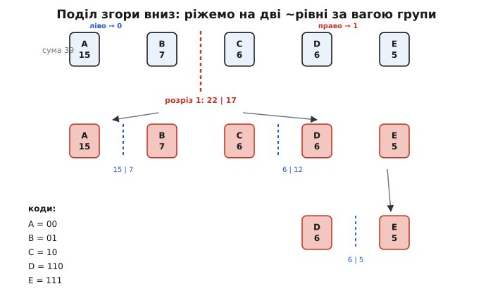
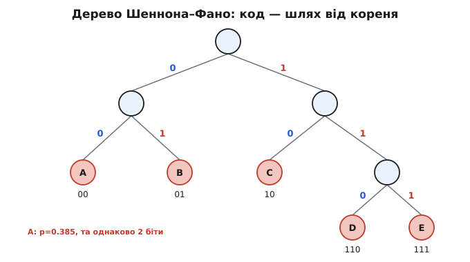
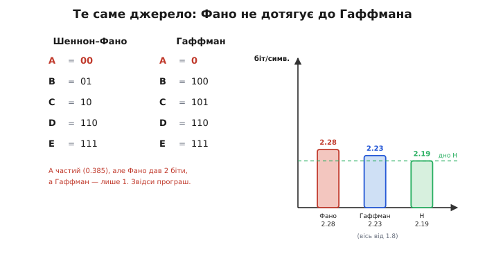
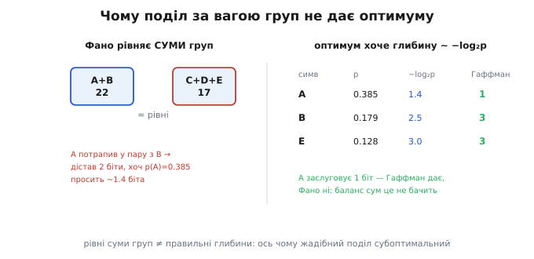

# Код Шеннона–Фано

[Ентропія](book:algorithms/entropy) каже, скільки бітів **у середньому** несе один символ джерела, а отже, до якого дна можна [стиснути без втрат](book:algorithms/why-compress). Лишається інженерна задача: маючи частоти символів, **роздати кожному ціле число бітів** так, щоб у середньому вийшло якнайближче до цього дна, і щоб коди читалися без роздільника. Код Шеннона–Фано (англ. *Shannon–Fano code*, на честь Клода Шеннона та Роберта Фано) — перша струнка відповідь на цю задачу, на кілька років давніша за [код Гаффмана](book:algorithms/huffman-coding). Ідея в нього напрочуд проста й наочна: бери відсортовані за ймовірністю символи й **рубай їх навпіл згори вниз**. Метод працює, дає коди, близькі до ентропії, — і саме на ньому найкраще видно, **чому проста жадібна ідея не завжди оптимальна**: Гаффман, що з'явився пізніше, ніколи не буває гіршим.

### Та сама задача: цілі біти й жодного роздільника

Нагадаймо, у що впирається будь-яке посимвольне кодування. Частий символ хочеться записати коротко, рідкісний — можна довше: на короткому виграємо багато разів, на довгому втрачаємо зрідка. Це **код змінної довжини** (*variable-length code*). Та щойно коди стають різної довжини, вискакує пастка: якщо «A» закодовано як `0`, а «B» як `01`, то в потоці `001` декодер не знає, де кінчається перший символ. Початок коду «B» збігається з усім кодом «A».

Рятунок той самий, що й у Гаффмана, — **префіксний код** (*prefix code*): жоден код не повинен бути початком (префіксом) іншого. Тоді декодер читає біти підряд, і щойно зібране збіглося з якимось кодом — це **напевно** той символ, бо жоден довший так не починається. Найприродніше будувати такий код **деревом**: на кожній розвилці ліва гілка — біт `0`, права — `1`, а символи сидять **лише на листках**. Код символу — шлях від кореня до його листка. Оскільки дорога до одного листка ніколи не проходить крізь інший, префіксна умова виконується сама собою.

Питання, на якому розходяться методи, одне: **як саме побудувати це дерево**? Гаффман зводить його **знизу вгору**, зливаючи найрідші вузли. Шеннон і Фано пішли навпаки — **згори вниз**, від кореня до листків. Цей напрям і робить метод таким наочним, але він-таки ховає його слабке місце.

### Ідея: рубай навпіл за ймовірністю

Думка Фано така. Корінь дерева має дві гілки — `0` і `1`. Розподілімо символи між цими двома гілками так, щоб обидві половини були **якомога рівніші за сумарною ймовірністю**. Тоді перший біт коду ділить світ майже навпіл: дізнавшись його, ми відсіяли приблизно половину «ваги» джерела — а це рівно один чесний біт інформації. Далі повторюємо те саме всередині кожної половини, доки в групі не лишиться один символ. Він і дістає свій листок.

Чому саме **рівні половини**? Бо один біт відповіді «так чи ні» вартий найбільше, коли обидва варіанти однаково ймовірні — рівно тоді він несе цілий біт (це прямо видно з форми ентропії: на двох наслідках вона максимальна, 1 біт, саме при рівних шансах). Якщо ж розкраяти групу нерівно — скажімо, 0.9 проти 0.1, — то перший біт майже завжди той самий, передбачуваний, і несе куди менше за біт; ми його почасти змарнували. Тож Фано на кожному кроці намагається зробити розріз **максимально інформативним**: половина на половину.

Покроково метод виглядає так:

```
1. Порахуй частоти; відсортуй символи за спаданням імовірності.
2. Знайди межу, що ділить ряд на ліву й праву частини з
   якомога рівнішими сумами ймовірностей.
3. Лівій частині припиши біт 0, правій — біт 1.
4. Повтори кроки 2–3 окремо в кожній частині,
   доки в частині не лишиться один символ.
```

Сортування важливе: воно ставить поряд символи близьких ваг, і тоді «рівний» розріз можна знайти простим проходом — нарощуємо ліву суму, доки вона не наблизиться до половини загальної.

> 🔧 **Навіщо це.** Поділ навпіл — це той самий принцип, що й у двійковому пошуку: кожне питання «ліворуч чи праворуч» відсікає половину можливостей. Тому код Шеннона–Фано легко зрозуміти й нескладно закодувати руками — він добре пасує, коли треба **швидко прикинути** розумний префіксний код без повної машинерії Гаффмана. На цьому його й варто тримати: як ясну, інтуїтивну заготовку, а не як останнє слово.

### Будуємо код для прикладу

Візьмемо джерело з п'яти символів із такими підрахунками (загалом 39 появ):

```
символ:  A    B    C    D    E
частота: 15   7    6    6    5      (разом 39)
p:       .385 .179 .154 .154 .128
```

Символи вже відсортовані за спаданням. Шукаємо перший розріз — межу, що ділить суму 39 якнайрівніше. Спробуймо по черзі:

```
A | BCDE   →  15 | 24    різниця 9
AB | CDE   →  22 | 17    різниця 5   ← найрівніше
ABC | DE   →  28 | 11    різниця 17
```

Найкраще ділить межа між **B і C**: ліворуч `AB` (сума 22), праворуч `CDE` (сума 17). Лівій групі даємо біт `0`, правій — `1`. Тепер рубаємо кожну групу окремо.

Ліва `AB`: тут лише два символи, межа одна — `A`(15) проти `B`(7). Отже `A` дістає другий біт `0`, а `B` — `1`. Коди готові: **A = `00`**, **B = `01`**.

Права `CDE`: пробуємо `C` | `DE` (6 проти 11, різниця 5) і `CD` | `E` (12 проти 5, різниця 7). Рівніший перший варіант: `C` йде ліворуч із бітом `0`, `DE` — праворуч із бітом `1`. Отже **C = `10`**. Лишилось розрубати `DE`: `D`(6) проти `E`(5), звідки **D = `110`**, **E = `111`**.


*Поділ згори вниз. Відсортований за частотою ряд ріжемо так, щоб сума ліворуч була якнайближча до суми праворуч; ліва частина дістає біт 0, права — 1. Потім кожну частину ділимо так само, нарощуючи коди, доки в групі не лишиться один символ. Звідси й випливають коди A=00, B=01, C=10, D=110, E=111.*

Ті самі рішення зручно бачити деревом: кожен розріз — це розвилка, символ — листок, код — шлях від кореня.


*Те саме рішення деревом. Ліва гілка — 0, права — 1; символи на листках, код — шлях від кореня. Зверни увагу на A: він найчастіший (p=0.385), а сидить на глибині два, тобто дістав 2 біти. Запам'ятаймо це місце — саме тут метод втратить.*

Порахуймо, що вийшло. Довжини кодів: A — 2, B — 2, C — 2, D — 3, E — 3. Загальна довжина потоку:

:::tabs
```c
// Довжина потоку Шеннона–Фано: Σ (частота · довжина коду).
int bits = 15*2   // A
         +  7*2   // B
         +  6*2   // C
         +  6*3   // D
         +  5*3;  // E
// bits = 30 + 14 + 12 + 18 + 15 = 89
```
```python
# Довжина потоку Шеннона–Фано: Σ (частота · довжина коду).
bits = (15*2   # A
        + 7*2   # B
        + 6*2   # C
        + 6*3   # D
        + 5*3)  # E
# bits = 30 + 14 + 12 + 18 + 15 = 89
```
:::

**89 бітів** на 39 символів — це 89/39 ≈ **2.28 біта** на символ. Наївна фіксована довжина дала б ⌈log₂5⌉ = 3 біти на кожен, тобто 117 бітів; код Шеннона–Фано вже помітно тісніший. А скільки обіцяла ентропія цього джерела? Підрахунок дає H ≈ **2.19 біта** на символ. Метод сів близько до дна — лише на ~0.1 біта вище. Це його **гарантія**: для будь-якого джерела середня довжина коду Шеннона–Фано не перевищує ентропію більш ніж на один біт на символ (а точніше — H ≤ L < H + 1). Близько до дна, але, як зараз побачимо, **не на самому дні**.

### Де воно програє Гаффману

Прикладемо до **того самого джерела** [код Гаффмана](book:algorithms/huffman-coding) — той, що будує дерево знизу вгору, зливаючи найрідші вузли. Він дає такі коди: A — `0`, B — `100`, C — `101`, D — `110`, E — `111`. Порахуймо довжину:

:::tabs
```c
// Той самий приклад, але коди Гаффмана: A коротший на біт.
int bits = 15*1   // A — лише 1 біт!
         +  7*3   // B
         +  6*3   // C
         +  6*3   // D
         +  5*3;  // E
// bits = 15 + 21 + 18 + 18 + 15 = 87
```
```python
# Той самий приклад, але коди Гаффмана: A коротший на біт.
bits = (15*1   # A — лише 1 біт!
        + 7*3   # B
        + 6*3   # C
        + 6*3   # D
        + 5*3)  # E
# bits = 15 + 21 + 18 + 18 + 15 = 87
```
:::

**87 бітів проти 89.** Гаффман виграв два біти, його середня довжина — 2.23 проти 2.28 у Шеннона–Фано. Різниця крихітна на цьому прикладі, але вона **не випадкова й не зникне**: Гаффман доведено оптимальний серед усіх посимвольних префіксних кодів, тож на жодному джерелі він не може програти Шеннону–Фано — лише зрівнятися або виграти.


*Те саме джерело, два методи. Уся різниця — в символі A: Шеннон–Фано дав йому 2 біти, Гаффман — 1. Через це середня довжина Фано (2.28) вища за Гаффманову (2.23), хоч обидві близькі до дна H≈2.19. Гаффман притиснувся ближче, бо віддав найчастішому символу найкоротший код.*

Уся різниця сидить в одному місці — у символі **A**. Він найчастіший (трапляється 15 разів із 39), і його чесна ціна за формулою несподіванки — лише −log₂0.385 ≈ **1.4 біта**. Гаффман віддав йому **1 біт**, найкоротший можливий. А Шеннон–Фано загнав A на глибину два й дав **2 біти** — на кожній з п'ятнадцяти появ зайвий біт. Ось де набігли ті два біти різниці.

### Чому жадібний поділ не оптимальний

Чому ж розумна на вигляд ідея «рубай навпіл» промахнулася саме на найчастішому символі? Корінь у тому, **що саме** вирівнює розріз. Фано рівняє **сумарні ймовірності двох груп** — і робить це чесно: 22 проти 17 справді найрівніший розріз. Але оптимальність коду залежить не від балансу груп, а від **глибини кожного листка**: символ із імовірністю p мав би сидіти на глибині приблизно −log₂p, щоб його код-довжина збігалася з його чесною ціною. А баланс груп цих глибин **не гарантує**.

Дивись, що сталося з A. Щоб розрізати 39 якнайрівніше, Фано **мусив** покласти A в пару з B (15 + 7 = 22 — найближче до половини). Але тим самим він прирік A ділити перший рівень дерева з кимось іще, тобто дістати щонайменше 2 біти. А оптимум хотів би дати такому жирному символу **власну** гілку від кореня — 1 біт, — і нехай уся дрібнота тісниться в іншій половині глибше. Гаффман саме так і робить: будуючи знизу, він зливає дрібних першими, ті тонуть углиб, а найчастіший A лишається наостанок біля кореня з однобітним кодом.


*Корінь розбіжності. Шеннон–Фано рівняє сумарну вагу двох груп — і змушений покласти частий A в пару, бо це найрівніший розріз. Та оптимальність вимагає іншого: глибина листка має бути близька до −log₂p символу. Баланс сум це не забезпечує, тож найчастіший символ дістає на біт довший код, ніж заслуговує. Гаффман, будуючи знизу вгору, цю глибину витримує точно.*

Ось загальна суть: поділ згори вниз — **жадібний**, він робить локально найкращий розріз на кожному кроці, не озираючись на наслідки для глибин окремих символів. Локально рівний розріз не завжди веде до глобально найкоротшого дерева. Гаффман будує з протилежного боку — від листків — і саме тому щоразу точно знає, кого штовхати вглиб (найрідших), а кого лишати нагорі. Його жадібність працює, бо застосована **в правильному напрямі**; жадібність Шеннона–Фано в напрямі згори вниз — ні.

> 🔧 **Навіщо це.** Це класичний урок про жадібні алгоритми взагалі: те, що крок локально оптимальний, ще не означає, що ланцюжок таких кроків дасть оптимум. Шеннон–Фано й Гаффман — найчистіша пара прикладів: однакова мета, той самий вид дерева, але один напрям побудови оптимальний, а другий ні. Тому на практиці, коли потрібен **найкоротший** посимвольний код, беруть Гаффмана; Шеннон–Фано лишається повчальним кроком на шляху до нього й зрідка — там, де простота побудови важливіша за останні відсотки.

### Звідки воно взялося

Метод народився на самому початку теорії інформації. **Клод Шеннон** (*Claude Shannon*) описав свій варіант 1948 року в тій самій основоположній статті «Математична теорія зв'язку», що ввела поняття ентропії. **Роберт Фано** (*Robert Fano*) — професор Массачусетського технологічного інституту (MIT) — виклав свій варіант 1949 року в технічному звіті «The Transmission of Information». Варіанти були **різні за побудовою**, та обидва прижилися під спільною назвою «код Шеннона–Фано»; той рекурсивний поділ навпіл, який ми розбирали, — це власне метод Фано (Шеннонів будував коди інакше, через двійковий запис накопичених імовірностей).

Цікаво, що саме слабкість цього методу породила його знаменитого наступника. Фано читав у MIT курс теорії інформації й дав студентам задачу: знайти найкращий префіксний код. Один зі слухачів, аспірант **Девід Гаффман** (*David Huffman*), обравши курсову роботу замість іспиту, не лише знайшов код, кращий за метод свого викладача, а й **довів**, що кращого посимвольного коду взагалі не існує. Так субоптимальний код Шеннона–Фано прямо привів до оптимального коду Гаффмана 1952 року — рідкісний випадок, коли студент перевершив задачу вчителя на очах і назавжди.

### Місток далі: коли цілого біта мало

У коду Шеннона–Фано є й друга, глибша лінія розвитку — і вона веде вже за межі посимвольних кодів. Шеннонів власний варіант будував код із **накопиченої ймовірності**: символи впорядковують, рахують наростаючу суму ймовірностей і беруть стільки перших бітів її двійкового запису, скільки треба, щоб код був однозначним. Цю ідею розвинув **Пітер Еліас** (*Peter Elias*), і вийшов **код Шеннона–Фано–Еліаса** (*Shannon–Fano–Elias coding*) — той, що замість дерева працює з відрізком `[0, 1)`, поділеним на частини за ймовірностями символів.

Сам по собі він на практиці не вживається — витрачає від одного до двох зайвих бітів на символ, більше за Гаффмана. Та його значення в іншому: це **прямий попередник арифметичного кодування**. [Арифметичне кодування](book:algorithms/arithmetic-coding) — це, по суті, той самий прийом із накопиченою ймовірністю, доведений до краю: воно кодує не окремий символ, а **ціле повідомлення** одним числом в інтервалі, і тому вміє віддати символу **дробову** частку біта — те, чого жоден посимвольний код, ні Шеннона–Фано, ні Гаффмана, зробити не може. Так скромна ідея «бери біти накопиченої ймовірності» виросла в метод, що тисне впритул до самого дна ентропії.

### Підсумок теми

Код Шеннона–Фано розв'язує ту саму задачу, що й [Гаффман](book:algorithms/huffman-coding): роздати символам ціле число бітів так, щоб коди були **префіксними** (жоден не початок іншого) і в середньому якнайближче до [ентропії](book:algorithms/entropy). Будує він дерево **згори вниз**: сортує символи за ймовірністю й рекурсивно ріже ряд на дві якомога рівніші за вагою групи, даючи лівій біт `0`, правій `1`. На прикладі з п'яти символів це дало 89 бітів замість наївних 117 і середню довжину 2.28 при ентропії 2.19 — близько до дна, бо завжди тримається межі H ≤ L < H + 1. Але **не на самому дні**: на тому самому джерелі Гаффман дав 87 бітів (2.23), бо віддав найчастішому символу однобітний код, а Шеннон–Фано загнав його на глибину два. Причина — у природі жадібного поділу: він рівняє **суми груп**, тоді як оптимальність вимагає правильних **глибин** окремих символів, і баланс сум цього не гарантує. Тому Гаффман, що будує знизу вгору, ніколи не буває гіршим. Історично код Шеннона–Фано (Шеннон, 1948; Фано, 1949) — перший систематичний префіксний код, що прямо привів до оптимального коду Гаффмана; а його друга гілка, через код Шеннона–Фано–Еліаса, стала містком до [арифметичного кодування](book:algorithms/arithmetic-coding), яке вміє те, чого посимвольний код не може, — дати символу дробову частку біта.

---
