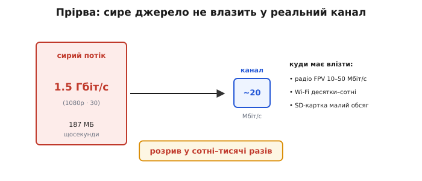
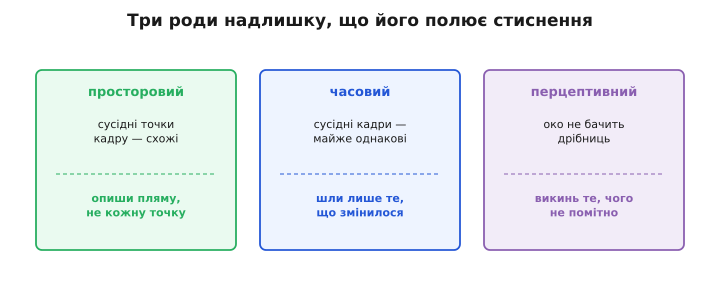
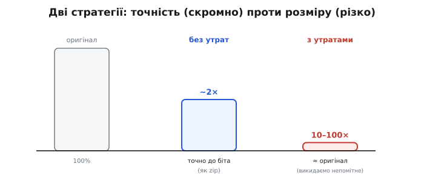
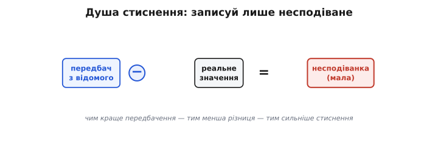

# Навіщо стискати

<preknowlist>
- [Біт і байт](topic:programming/bits-bytes-endianness) — біт як найменша одиниця даних, а байт — це 8 біт; звідси й «мегабіт» та «гігабайт», якими міряють обсяг і потік.
- [Роздільність і кадри](topic:communications/resolution-framerate) — скільки точок у кадрі й скільки кадрів за секунду; з цих двох чисел рахують сирий обсяг відео.
- [Імовірність](topic:math/probability-basics) — наскільки подія ймовірна (число від 0 до 1); нею міряють, як часто трапляється той чи той символ.
- [Двійковий логарифм](topic:math/binary-logarithm) — log₂x каже, у який степінь звести 2, щоб дістати x; саме він переводить імовірність у біти інформації.
</preknowlist>

### Прірва між «є» і «вміщається»

Дані майже завжди більші за те місце, куди їх треба покласти чи протягнути. Найгостріше це видно на відео. Сире 1080p на 30 кадрах — це близько **1.5 гігабіта за секунду** (187 мегабайт!), якщо порахувати з [роздільності й частоти кадрів](topic:communications/resolution-framerate). А тепер поглянь, у що це треба влити. Радіоканал FPV тягне **десятки мегабіт** за секунду. Мережа Wi-Fi — десятки-сотні. Навіть SD-картка, дарма що швидка, має скінченний обсяг: хвилина сирого 1080p — це понад **10 гігабайтів**, і картка заповниться за лічені хвилини.


*Прірва між «є» й «вміщається». Сире 1080p30 — це ≈1.5 Гбіт/с (187 МБ щосекунди). А реальна «труба» куди вужча: радіо FPV тягне ~10–50 Мбіт/с, мережа — десятки-сотні, SD-картка швидка, та малого обсягу. Розрив у сотні-тисячі разів: сирий потік просто не влазить. Вихід один — стиснути.*

Розрив тут — **у сотні, а то й тисячі разів**. Сирий потік просто **не влазить** ні в радіоканал, ні розумно — на картку. Тому вибору немає: відео **мусить** бути стиснене, ще на борту, перш ніж його кудись послати чи покласти. Те саме, лише не так драматично, з усім іншим — фото, звуком, текстом, логами телеметрії: стиснути означає або вмістити більше в ту саму пам'ять, або протягнути швидше крізь той самий канал. Стискати (*compression*, від латинського *comprimere* — «стискати, здавлювати») — це не забаганка, а спосіб подолати розрив між тим, скільки даних **є**, і тим, скільки їх **вміщається**.

І вся машинерія стиснення — відповідь на одне питання: **як викинути в рази (а то й у сотні разів) даних, нічого важливого не втративши?** На перший погляд це звучить як фокус на межі чуда. Та ні — і причина в одному слові.

### Чому стиснення взагалі можливе: надлишок

Сирі дані **страшенно марнотратні**: вони раз по раз зберігають те, що можна було б **передбачити** з уже відомого. А передбачуване не несе нової інформації — отже, його не треба зберігати повністю. Цей запас передбачуваного, зайвого зветься **надлишком** (*redundancy*, від латинського *redundare* — «переливатися через край»), і саме його полює будь-яке стиснення.

Найпростіший приклад надлишку — звичайний текст. У слові «стиснення» після «н» дуже ймовірне ще одне «н» або голосна, а не, скажімо, «ж»; після «щ» майже завжди йде голосна. Літери йдуть не навмання — мова повна правил, і кожне правило робить наступну літеру **передбачуванішою**, тобто надлишковою. Виміряли, що звичайний англійський текст несе лише близько **1–1.5 біта** справжньої інформації на літеру замість «наївних» ~4.7 біта для 26 рівноймовірних літер; решта — надлишок, і його близько **70–75%**. Саме тому текст так легко ужимається.

У відео надлишку ще більше, і він трьох родів.


*Три роди надлишку, що його полює стиснення. **Просторовий**: сусідні точки кадру майже однакові — опиши пляму, не кожну точку. **Часовий**: сусідні кадри майже однакові — зберігай лише те, що змінилося. **Перцептивний**: око слабке до дрібниць — що воно й не помітить, можна викинути.*

**Просторовий** надлишок — у межах одного кадру: сусідні точки майже завжди **схожі** (небо, стіна, обличчя — великі гладкі плями). Навіщо писати яскравість кожної точки, коли можна описати **пляму** загалом — а як точки геть однакові, то й зовсім [записати раз довжину серії](topic:algorithms/rle)? У тексті ж і файлах повторюються цілі шматки, тож їх ловлять [словникові методи](topic:algorithms/lz77) — [LZ77](topic:algorithms/lz77) із його родичем [LZW](topic:algorithms/lzw), що замість повтору пишуть коротке посилання на вже бачене. Це й робить [перетворення DCT](topic:algorithms/jpeg-intra) — прийом, що його колись [відхилили як «надто простий»](topic:algorithms/why-compress/hist-dct.md), а він стиснув мало не всю цифрову картину світу. **Часовий** надлишок — між кадрами: сусідні кадри відео майже **однакові**, бо за 1/30 секунди світ майже не змінюється — рухається лише дрібка. Навіщо слати весь кадр щоразу, коли можна слати лише те, що **змінилося**? Це [міжкадрове стиснення](topic:algorithms/inter-frame). І третій — **перцептивний**: око людини **не бачить** багато чого (дрібний колір, як показує [перехід до Bayer-сітки й демозаїки](topic:algorithms/bayer-demosaic); тонку деталь і шум, що тонуть у [динамічному діапазоні сенсора](topic:electronics/dynamic-range-noise)). Що око й не помітить, можна сміливо **викинути**. Уся ця троїстість і дає той стократний виграш.

То скільки ж надлишку можна вирізати — чи є межа? Є, і вона точна.

> 📜 Що інформацію взагалі можна **виміряти** числом, а надлишок — **вирізати** до межі, довів 1948 року **Клод Шеннон** (*Claude Shannon*) у Bell Labs. Його стаття «Математична теорія зв'язку» заснувала цілу науку — **теорію інформації**. Шеннон показав: у будь-якому повідомленні є справжня «несподіванка» (він назвав її **ентропією**), а все понад неї — **надлишок**, який можна стиснути без втрати змісту. Він-таки впровадив у науку й слово «**біт**» — одиницю інформації (а сам термін, скорочення від *binary digit*, 1947 року підказав його колега **Джон Тюкі**). Уся техніка стиснення, від zip до H.264, лише **наближається** до межі, яку накреслив Шеннон: не можна стиснути менше, ніж є справжньої інформації, але все зайве над нею — чесна здобич. Дрон, що ужимає відео в сто разів, грає за правилами, написаними ще 1948-го.

### Ентропія: де лежить дно стиску

Шеннонова **ентропія** (*entropy*, грецьке *en-* + *tropḗ* — «перетворення»; слово він узяв за аналогією з термодинамікою) каже річ напрочуд просту: інформацію несе лише **несподіванка**. Подія, якої ти й так чекав, нової інформації не дає; дивує — і несе щось — лише те, що могло б бути інакше. Чим рідкісніша подія, тим більше вона важить, коли таки стається.

Звідси й міра. Ентропія — це **середня несподіванка** одного символу джерела, виміряна в бітах: для символів з імовірностями `p` вона дорівнює

```
H = − Σ p · log₂(p)   бітів на символ
```

Не лякайся формули — за нею стоїть проста думка. Часта подія (велике `p`) дивує мало, тож коштує **менше одного біта**; рідкісна (мале `p`) дивує сильно й коштує **більше**. Ентропія `H` — це скільки бітів **у середньому** треба, щоб чесно записати один символ із цього джерела. І ось ключове, що довів Шеннон: **жодне стиснення без втрат не може опуститися нижче `H`**. Це не слабкість сьогоднішніх алгоритмів — це математична неможливість. Спакувати дані менше, ніж у них є справжньої інформації, — однаково що відняти від них зміст.

Тому надлишок легко порахувати: це різниця між тим, скільки місця дані **займають** наївно, і тим, скільки в них **інформації** (`H`). [Шеннон–Фано](topic:algorithms/shannon-fano), [Huffman](topic:algorithms/huffman-coding), [арифметичне кодування](topic:algorithms/arithmetic-coding) лише наближаються до `H` знизу-вгору, кожен щільніше за попередній, але **нижче дна — нікому**. А справжні архіватори на кшталт zip склеюють обидва підходи: [DEFLATE](topic:algorithms/deflate) спершу ловить повтори словником, а тоді дотискає рештки кодом Гаффмана. Стискати можна аж до [ентропії](topic:algorithms/entropy); під неї — вже не стиснення, а втрата.

### Без утрат і з утратами

Раз є дно, постає вибір: спинитися на ньому чи піти **нижче**, свідомо щось викинувши. Це і є дві великі стратегії.

**Без утрат** (*lossless*, англ. *loss* — «втрата» + *-less* — «без») — стиснути так, щоб відновити оригінал **точно, до біта**: просто записати надлишок розумніше (як архіватор zip). Це чесно, та обмежено самою ентропією: фото так ужимається разів у два, текст — у три-чотири, не більше. **З утратами** (*lossy*, «з втратою») — піти нижче ентропії оригіналу, **викинувши** те, чого мало й чого око (чи вухо) не помітить. Відновлене вже **не точна** копія, зате стиск — **у десятки й сотні разів**. Хитрість у тім, що ентропію рахують **відносно того, що треба зберегти**: коли ми домовилися не зберігати непомітне, у даних «справжньої інформації» лишається набагато менше — і дно опускається.


*Дві стратегії. **Без утрат** (lossless): точно відновлює оригінал (як zip), лише пакуючи надлишок розумніше — стиск скромний (~2× для фото), там, де треба точність. **З утратами** (lossy): свідомо викидає непомітне — відновлене ≈ оригінал, та стиск у 10–100 разів, там, де важить розмір.*

Куди яку? Де **кожен біт святий** — програма, архів, банківський запис, медичний знімок для діагнозу, — тільки **без утрат**: спотворити там зміст не можна. Де важить **розмір, а не побітна точність** — фото для перегляду, музика, відео, — майже завжди **з утратами**: ніхто не помітить відсутніх дрібниць, зате воно влізе куди треба. Для відео вибір очевидний: самим лише **без утрат** прірву не перестрибнути — двократного стиску геть не досить. Уся майстерність — викинути рівно те, чого не шкода, і не торкнутися важливого.

> 🔧 **Навіщо це.** Коли налаштовуєш кодек на борту дрона, ти насправді крутиш один регулятор — **скільки інформації лишити**. Піднімеш якість (бітрейт) — відео ближче до оригіналу, та потік розпухає й перестає влазити в радіоканал; опустиш — влазить, але повзуть «квадратики» там, де викинули забагато. Розуміння, що дно стиску без утрат — це ентропія, а нижче можна лише ціною викинутих деталей, відразу пояснює, чому не можна мати водночас «ідеальну якість» і «крихітний потік»: ти або над ентропією (велике), або жертвуєш деталями (мале). Третього не дано.

### Душа стиснення: пиши лише несподіване

Зведімо все в один принцип, що пронизує **геть усе** стиснення — і без утрат, і з утратами. Не зберігай того, що можна **передбачити** з уже відомого; зберігай лише **різницю** — несподіванку.


*Душа стиснення. Передбач значення з уже відомого (сусідні точки, попередній кадр, попередні літери); відніми від реальності — лишиться сама **несподіванка** (різниця), мала й добре стискана. Її й записують. Чим краще передбачення, тим менша несподіванка й сильніше стиснення.*

Передбачив точку із сусідів — записуй лише похибку передбачення (вона мала). Передбачив кадр із попереднього — записуй лише те, що зрушилося. Передбачив літеру з попередніх — записуй лише поправку. Що краще передбачення, то менша несподіванка, то ближче ти до ентропійного дна. Саме тому фото JPEG ужимається разів у десять, а відео H.264 — у **п'ятдесят-двісті**: воно експлуатує не лише схожість точок у кадрі, а ще й схожість кадрів між собою. Так півтора-гігабітний потік сирого відео і стає десятками мегабіт, що вже влазять у радіоканал чи картку.

Прикинемо виграш на пальцях, щоб «сотні разів» перестали бути магією.

**Скільки економить просте передбачення.** Кадр 1920×1080, кожна точка — байт яскравості (8 біт). Небо: сусідні точки відрізняються щонайбільше на одиницю-дві з 256.

```
наївно:        8 біт на точку
різниця сусідів: майже завжди −2…+2 → лише 5 значень
несподіванка:  log₂(5) ≈ 2.3 біта на точку
виграш лише з просторового надлишку: 8 / 2.3 ≈ 3.5×
```

І це **тільки** просторовий надлишок одного кадру, ще без часового й перцептивного. Додай схожість кадрів (часовий) та викидання непомітного (перцептивний з утратами) — і три множники перемножуються в ті самі **десятки-сотні разів**. Жодного чуда: просто три рази поспіль ми не пишемо передбачуване.
