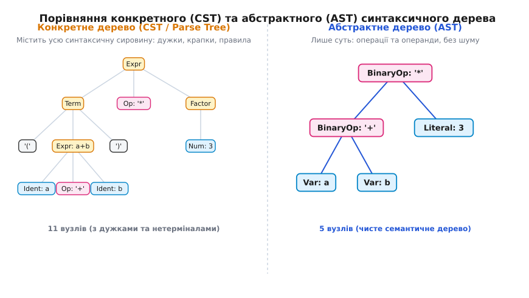
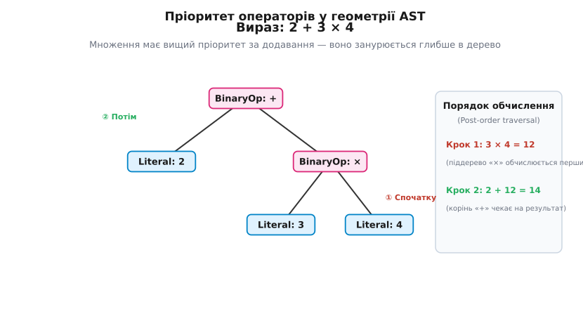
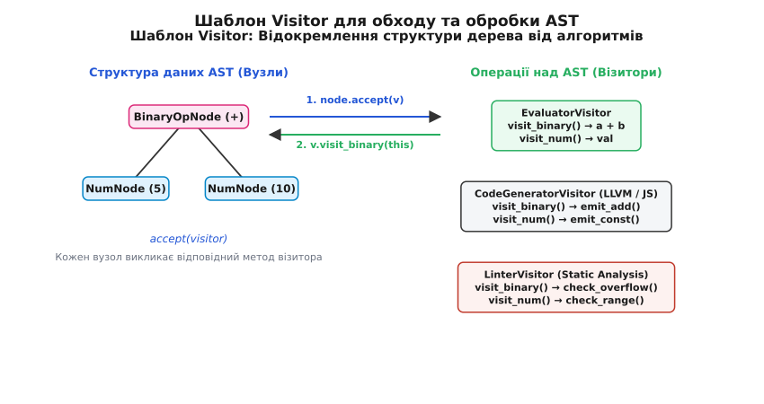
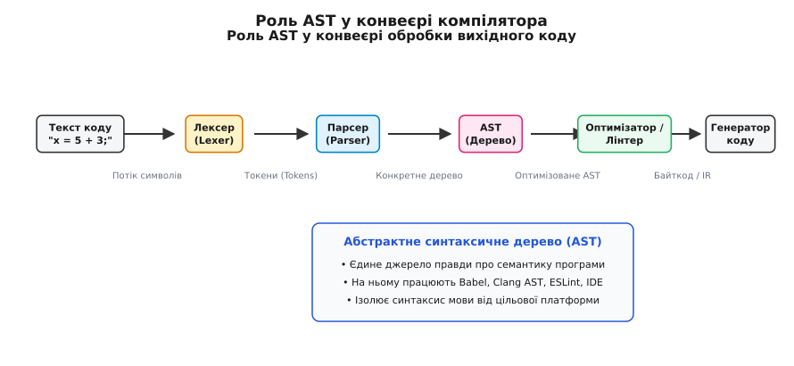

# Абстрактне синтаксичне дерево (AST)

<preknowlist>
- [Двійкове дерево](topic:algorithms/binary-tree) — вузли, корінь, листки, батьківські й дочірні зв'язки.
- [Рекурсія](topic:algorithms/recursion) — обхід дерев та рекурсивний спуск для обробки вкладених структур.
- [Асимптотична складність](topic:algorithms/asymptotic-complexity) — нотація O великого для оцінки часу обходу й парсингу.
- [Формальні граматики й обхід дерев](topic:algorithms/abstract-syntax-tree/math-tree-traversal.md) — математичний апарат BNF-граматик, обхід дерев та шаблон Visitor.
</preknowlist>

Коли ти пишеш рядок коду `if (x > 0) return y * 2;`, для тебе це прозора структура з умовою, відгалуженням і математичною операцією. Але для комп'ютера чи інтерпретатора цей же код на самому початку — лише плоский, одновимірний потік байтів: послідовність символів 'i', 'f', ' ', '(', 'x', ' ', '>', ' ', '0', ')'... 

Текст коду в файлі позбавлений об'єму. У ньому немає вказівників, немає ієрархії, немає поняття «що обчислюється першим». Спробуй змусити програму виконати такий текст напряму — і ти опинишся перед стіною. Простий пошук за шаблоном чи регулярні вирази з тріском провалюються, як тільки вирази стають вкладеними: дужка в дужці, цикл у циклі, функція всередині іншої функції. Регулярні граматики не мають пам'яті, щоб стежити за довільною глибиною вкладеності.

Щоб перетворити безлику плоску строку символів на живу програму, обчислювальний рушій мусить збудувати в пам'яті її **просторову модель**. Він має витягнути з сирого тексту зв'язки «операція — операнди», «умова — тіло циклу» і представити їх у вигляді древоподібної структури, де пріоритети й порядок виконання задаються самою геометрією зв'язків.

Ця фундаментальна структура даних і називається **абстрактним синтаксичним деревом** (англ. *Abstract Syntax Tree*, AST).

## Від лінійного тексту до дерева: Лексер і Парсер

Перетворення мертвого тексту на живальне дерево відбуваються у два послідовні етапи, кожен із яких спрощує завдання наступному.

### 1. Лексичний аналіз (Лексер)

Перший крок — розбити суцільний потік символів на неподільні «слова» або «маркери» — **токени** (англ. *tokens*). Лексер (або сканер) ігнорує несуттєві пробіли й коментарі, перетворюючи символи на категоріальні сутності:

```
Текст:    if ( x > 0 ) return y * 2 ;
Токени:   [IF] [LPAREN] [IDENT("x")] [GT] [INT(0)] [RPAREN] [RETURN] [IDENT("y")] [MUL] [INT(2)] [SEMI]
```

Лексер звільняє нас від необхідності посимвольного аналізу, але потік токенів усе ще лишається лінійним. У ньому досі немає структури.

### 2. Синтаксичний аналіз (Парсер)

Другий крок — **парсер** (синтаксичний аналізатор). Він приймає потік токенів і, спираючись на правила мови, будує ієрархічне дерево. Парсер знає, що токен `IF` вимагає після себе виразу в дужках і оператора, а оператор `*` з'єднує два операнди.

Чому саме дерево? Бо людські мови програмування за своєю природою фрактальні й вкладені. Вираз складається з доданків, доданки — з множників, множники — з викликів функцій, а аргументи функцій — знову з виразів. Дерево — єдина природна структура даних, що ідеально відображає цю самоподібну вкладеність.

## CST проти AST: Навіщо потрібна «абстрактність»

Коли парсер уперше будує дерево за формальними правилами граматики, він утворює так зване **конкретне синтаксичне дерево** (англ. *Concrete Syntax Tree*, CST, або дерево розбору / *parse tree*). 

CST — це точне дзеркальне відображення синтаксису. Воно зберігає абсолютно кожен елемент вихідного тексту: кожну круглу й фігурну дужку, кожну кому, крапку з комою, двої крапки й навіть нетермінальні правила граматики (`Expr`, `Term`, `Factor`).

```
          [Expr]
         /  |   \
   [Term]  [*]  [Factor]
     |             |
  [(a + b)]       [3]
```

Для аналізу семантики (що саме робить програма) така кількість «синтаксичного сміття» є важким тягарем. Крапки з комою та дужки потрібні були лише для того, щоб парсер міг однозначно зрозуміти межі виразів у плоскому тексті. Після того, як дерево побудоване, самі дужки більше не потрібні — їхню роль виконує сама структура гілок!

Ось чому компілятори очищають CST від синтаксичного шуму, залишаючи лише змістовні вузли. Виходить **абстрактне синтаксичне дерево (AST)**:

```
        BinaryOp (*)
        /          \
  BinaryOp (+)    Literal (3)
   /        \
Var (a)    Var (b)
```



*Порівняння CST та AST: конкретне дерево ліворуч зберігає всі службові дужки й проміжні правила граматики (11 вузлів), тоді як абстрактне дерево праворуч залишає лише суттєві операції та операнди (5 вузлів).*

У чому полягають головні відмінності між ними?

1. **Відсутність пунктуації**: дужки, коми, крапки з комою повністю видаляються.
2. **Скорочення ланцюжків**: проміжні односинівні правила граматики (наприклад, `Expr -> Term -> Factor -> Number`) згортаються в один вузол `Literal`.
3. **Оператори як вузли**: знаки операцій (`+`, `-`, `*`, `if`, `while`) стають внутрішніми вузлами дерева, а не просто лиштфою навколо операндів.

| Характеристика | Конкретне дерево (CST) | Абстрактне дерево (AST) |
| :--- | :--- | :--- |
| **Мета** | Точно відтворити синтаксис коду | Передати семантичне значення програми |
| **Деталізація** | Зберігає дужки, коми, крапки з комою | Лише оператори, змінні та константи |
| **Розмір у пам'яті** | Великий (багато проміжних вузлів) | Компактний і оптимізований |
| **Сфера застосування** | Редактори коду (форматування, коментарі) | Компілятори, інтерпретатори, лінтери |

## Анатомія AST: Вузли, Оператори, Листки

Усі вузли абстрактного синтаксичного дерева можна поділити на дві фундаментальні категорії за їхньою роллю у структурі:

### 1. Внутрішні вузли (Операції та Структури)

Це вузли, які мають одного або кількох дітей. Вони уособлюють дії, які треба виконати над дітьми, або керуючі конструкції:
- **Бінарні оператори**: `+`, `-`, `*`, `/`, `==`, `&&` (мають двох дітей: лівий та правий операнд).
- **Унарні оператори**: `-` (заперечення знаку), `!` (логічне НІ), `*` (розмейнування вказівника) (мають одного дитину).
- **Умовні оператори (`IfStatement`)**: мають трьох дітей: умову, гілку `then` та гілку `else`.
- **Цикли (`WhileLoop`)**: мають двох дітей: умову продовження та тіло циклу.
- **Виклики функцій (`FunctionCall`)**: мають ім'я функції та список дітей-аргументів.

### 2. Листові вузли (Термінали / Дані)

Це вузли на самому дні дерева, які не мають дітей. Вони містять конкретні значення:
- **Числові та строкові літерали**: `42`, `"hello"`, `3.14`.
- **Ідентифікатори (змінні)**: `x`, `total_sum`, `user_id`.
- **Булеві константи**: `true`, `false`.

### Пріоритет операторів у геометрії дерева

Одною з найчудовіших властивостей AST є те, що воно **усуває будь-яку неоднозначність пріоритетів операторів**.

Розгляньмо математичний вираз: `2 + 3 * 4`.

У шкільній арифметиці ми знаємо, що множення виконується раніше за додавання. У плоскій строці символів це вимагає запам'ятовування таблиці пріоритетів. Але в AST це правило втілюється в самій топології дерева:

```
      +
     / \
    2   *
       / \
      3   4
```

Вузол `*` знаходиться **нижче** (глибше) за вузол `+`. Оскільки для обчислення додавання корінь `+` мусить спершу отримати готові значення своїх лівого й правого дітей, він змушений чекати, поки обчислиться праве піддерево `3 * 4`.



*Геометрія пріоритету: у виразі 2 + 3 × 4 операція множення занурюється глибше у дерево. Під час обходу знизу вгору спочатку обчислюється 3 × 4 = 12, і лише потім 2 + 12 = 14.*

Отже, в AST пріоритет операцій визначається глибиною вузла: **чим глибше лежить операція в дереві, тим раніше вона виконується**. Дужки більше не потрібні! Якщо змінити вираз на `(2 + 3) * 4`, дерево змінить форму: `*` стане коренем, а `+` піде в його ліве піддерево.

## Побудова AST: Рекурсивний спуск

Як на практиці побудувати таке дерево з потоку токенів? Найпопулярнішим і найінтуїтивнішим методом є **парсер рекурсивного спуску** (англ. *Recursive Descent Parser*).

Ідея полягає в тому, що кожне правило формальної граматики мови відображається у відповідну функцію в коді. Ці функції викликають одна одну рекурсивно, спускаючись за ієрархією пріоритетів.

Нехай наша граматика описується трьома рівнями:
1. `Expression` -> `Term` ( (`+` | `-`) `Term` )*
2. `Term`       -> `Factor` ( (`*` | `/`) `Factor` )*
3. `Factor`     -> `NUMBER` | `(` `Expression` `)`

Нижче наведено спрощену концептуальну реалізацію побудови вузлів AST на C++ та Python:

:::tabs
```cpp
#include <memory>
#include <string>
#include <utility>

// Базовий вузол AST
struct ASTNode {
    virtual ~ASTNode() = default;
};

// Вузол чисельної константи (Листок)
struct NumberNode : public ASTNode {
    double value;
    explicit NumberNode(double val) : value(val) {}
};

// Вузол бінарної операції (Внутрішній вузол)
struct BinaryOpNode : public ASTNode {
    char op;
    std::unique_ptr<ASTNode> left;
    std::unique_ptr<ASTNode> right;

    BinaryOpNode(char op, std::unique_ptr<ASTNode> l, std::unique_ptr<ASTNode> r)
        : op(op), left(std::move(l)), right(std::move(r)) {}
};
```
```py
from dataclasses import dataclass
from typing import Union

class ASTNode:
    pass

@dataclass
class NumberNode(ASTNode):
    value: float

@dataclass
class BinaryOpNode(ASTNode):
    op: str
    left: ASTNode
    right: ASTNode
```
:::

Процес побудови виразу `2 + 3 * 4` у рекурсивному парсері працює так:

1. `parse_expression()` викликає `parse_term()`, щоб отримати ліву частину.
2. `parse_term()` викликає `parse_factor()` і зчитує `2`. Повертає `NumberNode(2)`.
3. `parse_expression()` бачить токен `+`. Він зберігає `+` і викликає `parse_term()` для правої частини.
4. `parse_term()` зчитує `3`, бачить токен `*`, зчитує `4` і створює вузол `BinaryOpNode('*', NumberNode(3), NumberNode(4))`.
5. `parse_expression()` повертає підсумковий корінь `BinaryOpNode('+', NumberNode(2), BinaryOpNode('*', NumberNode(3), NumberNode(4)))`.

Зв'язок між математичною теорією BNF-граматик та алгоритмами обходу дерев докладно проілюстровано в [математичному додатку про формальні граматики та обхід дерев](topic:algorithms/abstract-syntax-tree/math-tree-traversal.md).

## Обхід та обчислення AST: Оцінювачі та Трансформації

Створення AST — це лише половина справи. Справжня сила дерева розкривається тоді, коли ми починаємо його **обходити** (траверсувати) для виконання коду, оптимізації або генерації машинного коду.

### 1. Оцінювання (Інтерпретація)

Щоб обчислити значення дерева виразу, використовують **зворотний обхід** (англ. *post-order traversal*): спочатку рекурсивно обчислюються ліве та праве піддерева, а потім отримані значення застосовуються до оператора в корені.

```cpp
double evaluate(const ASTNode* node) {
    if (auto num = dynamic_cast<const NumberNode*>(node)) {
        return num->value; // Листок: повертаємо число
    }
    if (auto bin = dynamic_cast<const BinaryOpNode*>(node)) {
        double left_val  = evaluate(bin->left.get());  // Обчислюємо ліве піддерево
        double right_val = evaluate(bin->right.get()); // Обчислюємо праве піддерево
        
        switch (bin->op) {
            case '+': return left_val + right_val;
            case '-': return left_val - right_val;
            case '*': return left_val * right_val;
            case '/': return left_val / right_val;
        }
    }
    return 0.0;
}
```

### 2. Згортання констант (Constant Folding)

AST дозволяє проводити потужні оптимізації коду ще до його запуску. Популярний приклад — **згортання констант**. Якщо оптимізатор бачить у дереві піддерево бінарної операції, у якого ОБОЄ дітей є константами (наприклад, `3 * 4`), він може обчислити це піддерево під час компіляції й замінити весь вузол бінарної операції на один листок `Literal(12)`!

```
      +                  +
     / \                / \
    x   *    ──►       x   12
       / \
      3   4
```

Це зменшує розмір підсумкового коду і позбавляє процесор необхідності виконувати марне множення під час виконання програми.

### 3. Шаблон Visitor (Відвідувач)

Коли мова програмування розростається, з'являються десятки різних типів вузлів (`IfNode`, `ForNode`, `VarDeclNode`, `TryCatchNode`) і десятки операцій над ними (інтерпретатор, генератор байткоду, перевірка типів, оптимізатор, форматувальник).

Якщо додавати методи для кожної операції безпосередньо в класи вузлів, код перетвориться на кашу. Щоб відокремити структуру даних (вузли AST) від алгоритмів обробки, використовують паттерн **Visitor**.

Він дозволяє винести логику обходу в окремі класи-відвідувачі (`EvaluatorVisitor`, `CodeGeneratorVisitor`, `TypeCheckerVisitor`), не змінюючи класи самих вузлів.



*Структура дерева (вузли `BinaryOpNode`, `NumNode`) і алгоритми обробки (`EvaluatorVisitor`, `CodeGeneratorVisitor`, `LinterVisitor`) живуть в окремих ієрархіях класів. Кожен вузол лише викликає `accept(visitor)`, а подвійна диспетчеризація сама доводить виклик до потрібного методу відвідувача — додати нову операцію означає дописати новий клас-відвідувач, не чіпаючи жодного вузла.*

## AST у сучасному інструментарії: Транслятори, Лінтери, IDE

AST — це серцевого роду «універсальна мова», на якій спілкуються майже всі сучасні інструменти розробки програмного забезпечення.



*Конвеєр обробки коду: AST слугує центральним вузлом і єдиним джерелом правди про програму, відокремлюючи синтаксичний аналіз від оптимізації та генерації коду.*

Де саме застосовується AST?

1. **Компілятори (GCC, Clang, rustc)**: перетворюють AST на проміжне представлення (IR, наприклад LLVM IR), проводять оптимізації та генерують машинні інструкції.
2. **Транспілятори (Babel, TypeScript, SWC)**: розбирають код сучасної версії мови в AST, модифікують вузли для сумісності зі старими стандартами (наприклад, перетворюють стрілкові функції ES6 у звичайні функції ES5) і генерують назад текст JavaScript.
3. **Статичні аналізатори та Лінтери (ESLint, Clang-Tidy, SonarQube)**: обходять AST і шукають потенційні баги, невикористані змінні, небезпечні операції чи порушення стилю коду. Наприклад, правила лінтера — це просто перевірка наявності певних комбінацій вузлів в AST (скажімо, присвоєння `= ` всередині умови `if`).
4. **Сучасні IDE та Tree-sitter**: редактори коду (VS Code, Neovim, CLion) використовують швидкісні інкрементальні парсери (такі як `Tree-sitter`), щоб будувати AST "на льоту" під час вводу кожного символу. Це забезпечує точне підсвічування синтаксису, автодоповнення, навігацію по коду та безпечний рефакторинг (перейменування змінної у всій області видимості).

Історію створення перших синтаксичних дерев — від S-виразів LISP до сучасних високошвидкісних парсерів — детально розкрито в [історичному нарисі про еволюцію AST](topic:algorithms/abstract-syntax-tree/hist-ast-evolution.md).

Повну робочу програму на C++ та Python, яка парсить математичні вирази в дерево та обчислює їхній результат, наведено в [практичному проєкті побудови AST-парсера](topic:algorithms/abstract-syntax-tree/proj-ast-parser.md).

> 🔧 **Навіщо це.**
> Розуміння AST перетворює програміста з пасивного користувача мови на її творця. Завдяки AST ти можеш:
> - Написати власний DSL (Domain-Specific Language) для конфігурації складних бізнес-правил чи обчислення фінансових формул у таблицях.
> - Створити плагін для лінтера, який автоматично відловлюватиме специфічні помилки вашої команди.
> - Зробити інструмент автоматичної генерації коду чи міграції зі старої версії фреймворку на нову.
> - Глибоко зрозуміти, як компілятор бачить твій код, що дозволяє писати більш продуктивні й елегантні програми.
