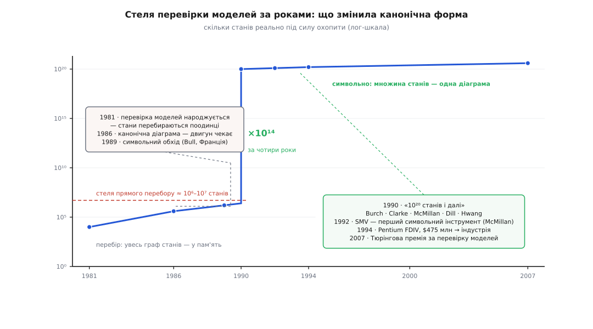

# 📜 Як канонічна форма за кілька років зробила перевірку моделей індустрією

Це історія про те, як структура даних урятувала цілий метод верифікації. Перевірка моделей — спосіб **довести** властивість системи, обійшовши всі її стани замість кількох проб, — народилася 1981 року й майже одразу вперлась у стіну: станів у реальної системи стільки, що перелічити їх поодинці не вистачить ані часу, ані пам'яті. А за кілька років по тому та сама канонічна діаграма, що перетворила рівність булевих функцій на порівняння покажчиків, дала методові інший погляд на стани — не по одному, а цілими множинами заразом. І метод, що ледве дихав на іграшкових прикладах, почав перевіряти справжні мікросхеми. Розберімо, що саме перемкнулося.

## Метод, що вперся у стіну першого ж дня

1981 року Едмунд Кларк (*Clarke*) з Алленом Емерсоном (*Emerson*) у США, а незалежно від них грек Жозеф Сіфакіс (*Sifakis*) із Жаном-П'єром Кеєм (*Queille*) у Греноблі, описали те, що згодом назвуть **перевіркою моделей** (англ. *model checking*). Задум прямий і зухвалий. Тест бере кілька значень із простору входів і сподівається, що не проґавив біди. А що, як натомість перебрати **всі** досяжні стани системи й у кожному звірити властивість? Тоді це вже не вибірка, а вичерпний доказ. Ідеться не про звичайну умову, а про **темпоральну** (лат. *tempus* — час) — властивість про поведінку в часі: «система ніколи не потрапляє в аварійний стан», «на кожен запит колись надійде відповідь». Інструмент будує граф досяжних станів, у кожному перевіряє формулу й або мовчить (властивість тримається скрізь), або друкує **контрприклад** — точний ланцюжок подій до біди. Це один із наріжних методів [формальної верифікації](topic:programming/formal-verification): не випробувати систему, а довести її.

І тут-таки — стіна. Щоб обійти всі стани, їх треба десь тримати, по одному. Кількість станів росте **вибухово**: сотня двійкових комірок пам'яті — це 2¹⁰⁰ ≈ 10³⁰ конфігурацій, і перебрати їх по одній не здатна жодна машина за будь-який мислимий час. Прямий перелік справлявся приблизно з 10⁴–10⁶ станами — а реальна мікросхема має їх астрономічно більше. Метод був теоретично бездоганний і практично безсилий: він тонув у **вибуху простору станів** (англ. *state explosion*) на будь-чому, крім навчальних прикладів. Десять років поспіль перевірка моделей лишалася прекрасною ідеєю без гідного застосунку.

## Двигун, що вже лежав напоготові

Тим часом в іншому кутку інформатики вже лежав готовий інструмент — тільки ніхто не бачив, що він саме про це. 1986 року Рендел Брайант (*Bryant*) довів: якщо булеву функцію подати діаграмою рішень, зафіксувати порядок змінних і прибрати всю надмірність, діаграма стає **єдиною** — канонічною. Це теорема, а не програма: вона гарантує, що структурована функція від багатьох змінних часто важить копійки, а рівність двох функцій зводиться до порівняння двох діаграм.

Щоб з'єднати теорему з перевіркою моделей, бракувало одного зсуву погляду — і він подвійний. По-перше, **множина — це булева функція**: будь-якій множині станів `S` відповідає характеристична функція `χ`, що дає 1 рівно на членах `S`; множина та її `χ` — одне й те саме, записане по-різному, тож множину станів можна тримати діаграмою. По-друге, **відношення переходів — теж булева функція**: «зі стану `s` за один крок можна в `s′`» — це функція від двох наборів бітів, `T(s, s′)`, і її теж можна тримати діаграмою. А якщо і множини станів, і переходи — це діаграми, то обхід простору станів перестає бути перебором і стає **алгеброю над діаграмами**.


*Вертикальна шкала — скільки станів реально під силу охопити, у степенях десятки. Ціле десятиліття крива повзе під стелею прямого перебору (≈ 10⁶–10⁷ станів): стани тримають по одному, і граф не влазить. 1990-й — вертикальний стрибок на чотирнадцять порядків: множину станів починають тримати однією діаграмою. Далі — не теорія, а промисловість: інструмент SMV, шок від помилки Pentium, впровадження у виробників мікросхем.*

## Обхід, що бере цілий фронт заразом

Ось як алгебра над діаграмами замінює перебір. Питання «які стани взагалі досяжні?» розв'язують **нерухомою точкою**: беруть множину початкових станів, додають усіх їхніх наступників, тоді наступників наступників — і так, доки множина перестане рости. Ключ — операція **образу** (англ. *image*): «усі стани, досяжні за один крок із множини `X`». Символьно вона робиться однією комбінацією булевих дій: перетнути `X` із відношенням переходів, а тоді **вигнати квантором існування** змінні поточного стану — лишити тільки те, куди можна дійти.

**Порахуймо, куди дійде система, — символьно, не торкнувшись жодного стану поодинці.**

```
Стан — два біти (p, q).  Початок: лише 00.
Перехід T: щокроку обидва біти інвертуються  →  (p, q) ⟶ (¬p, ¬q).
Як функція від «до» і «після»:   T(p,q,p′,q′) = (p′ ≡ ¬p)·(q′ ≡ ¬q)
Множину станів тримаємо характеристичною функцією χ.

R₀ = { 00 }                              χ₀ = ¬p·¬q

образ = «усі наступники за крок»:
    Image(X) = ∃p,q [ X(p,q) · T(p,q,p′,q′) ] ,  тоді перейменувати p′→p, q′→q
    ∃p,q [ ¬p·¬q · (p′≡¬p)·(q′≡¬q) ]  =  p′·q′        →  { 11 }

R₁ = R₀ + Image(R₀)                      χ₁ = ¬p·¬q + p·q  =  (p ≡ q)

ще крок:
    Image(R₁) = { 00, 11 }  — ті самі стани
    R₂ = R₁                               χ₂ = χ₁   ← нерухома точка

Досяжні стани: { 00, 11 }.  Питання «чи можлива розбіжність p ≠ q ?»
    R ∩ (p ≠ q) = 0    →    НІ. Система назавжди в станах, де p = q. Доведено.
```

Два кроки — і вся нескінченна майбутня поведінка охоплена. Придивіться до трьох речей. Кожен `Image` додав **цілий фронт** станів однією булевою дією, а не по стану за раз. Уся множина досяжних станів вийшла компактною функцією `(p ≡ q)`, а не списком. І — найтонше — зупинку впіймали тим, що `χ₂` і `χ₁` виявилися **тим самим об'єктом**: канонічна форма робить рівність множин рівністю діаграм, а рівність діаграм — порівнянням покажчиків. Нерухома точка розпізнається за один такт.

> 🔧 **Навіщо це.** Тут і захована вся перемога над вибухом станів. Прямий перебір платить за **кожен** стан — і тому програє, щойно станів стає багато. Символьний обхід платить за **складність множини**, а не за її розмір: мільярд станів, що підкоряються простому правилу, живуть у дрібній діаграмі, і крок обходу коштує стільки ж. Плюс дармовий подарунок канонічности: «множина перестала рости» — це не звірка елементів, а одне порівняння покажчиків. Метод, приречений на експоненту, дістав спосіб її обійти скрізь, де в системи є структура.

## Чому перелік не мав жодного шансу

Щоб відчути прірву між двома підходами, порахуймо не час, а **місце**. Візьмімо систему з 10²⁰ станів і спитаймо найскромніше: скільки пам'яті треба лише на те, щоб кожному станові поставити галочку «досягнутий / ні» — навіть не зберігаючи переходів?

```
10²⁰ станів · 1 біт = 10²⁰ біт
10²⁰ / 8            = 1.25·10¹⁹ байтів
1.25·10¹⁹ / 10¹⁸   = 12.5 ЕБ (ексабайтів)
```

Дванадцять із половиною ексабайтів — і це найощадніше можливе подання перебору, гола бітова карта. Стільки пам'яті не існує в одному місці. А структурована множина тих самих 10²⁰ станів як діаграма важить кілобайти — бо росте зі складности правила, що описує стани, а не з їх кількости. Ось де перебір програв остаточно: йому забракло не швидкости, а місця навіть на список галочок. Символьному поданню списку не потрібно взагалі — воно тримає **правило**, а не перелік.

## Два незалежні народження одного прийому

Прийом «тримати стани символьно» дозрів настільки, що його винайшли двічі, майже одночасно й з різних боків — класична ознака ідеї, чий час настав.

У червні 1989 року на семінарі з автоматичної верифікації скінченних систем французька команда з дослідного центру компанії Bull — Олів'є Кудер (*Coudert*), Крістіан Берте (*Berthet*) і Жан-Крістоф Мадр (*Madre*) — доповідає роботу «Верифікація синхронних послідовнісних машин на основі символьного виконання». Їхній хід: щоб порівняти два автомати, не перелічувати їхні стани, а обходити простір **символьно**, тримаючи множини станів діаграмами, і так уникнути й перебору, й побудови дерева. Це вже була жива символьна перевірка досяжности, з якої потім виріс корисний оператор обмеження діаграми (*restrict*). Статус — **усталено** (доповідь опубліковано в *Lecture Notes in Computer Science*, том 407).

А 1990 року на симпозіумі з логіки в інформатиці (*LICS*) команда з Карнеґі — Меллона й Стенфорда — Джеррі Берч, Едмунд Кларк, Кеннет Макміллан, Девід Ділл і Л. Джеймс Гван — доповідає роботу з назвою, що сама є маніфестом: **«Символьна перевірка моделей: 10²⁰ станів і далі»**. Тут ідею доведено до повного методу: не лише досяжність, а перевірка цілих темпоральних властивостей зводиться до дій над діаграмами, а мовою специфікації служить μ-числення (числення нерухомих точок), у яке компілюються звичні темпоральні формули. Заголовне число — це і є аргумент: символьне подання дотяглося туди, куди переліку бракувало не годин, а самої матерії всесвіту. Статус — **усталено** (LICS 1990, с. 428–439; журнальна версія — *Information and Computation*, том 98, 1992).

Варто чесно розділити внески. **Теорему** канонічної форми дав Брайант 1986-го. **Ідею** обходити стани символьно винайшли незалежно у Франції (Bull, 1989) і в США (CMU, 1990), причому французька група дійшла до неї трохи раніше й у вужчій постановці — рівність автоматів; американська зробила з неї загальний метод перевірки моделей із гучним числом у назві. Ні привласнювати ідею одному центрові, ні мовчати про європейську лінію було б неточно: це паралельне відкриття, і обидві дати задокументовані.

## Від методу до інструмента

Метод, описаний у статті, — ще не те, чим користуються інженери. Потрібен був **інструмент**, і його зробив Кеннет Макміллан (*McMillan*), тоді аспірант Кларка в Карнеґі — Меллоні. 1992 року він випускає **SMV** (*Symbolic Model Verifier*), а 1993-го виходить його книжка «Symbolic Model Checking». SMV був першим робочим символьним перевіряльником моделей: ти описуєш систему й темпоральну властивість, а він будує діаграми, ганяє нерухому точку й або доводить властивість, або дає контрприклад — усе на діаграмах Брайанта під капотом.

Різниця між статтею й інструментом — це різниця між «так можна» і «так роблять щодня». Саме SMV переніс символьну перевірку з дошки в практику: його ідеї й діалекти розійшлися десятками груп, і навіть пізніші перевіряльники здебільшого — його нащадки. Тут замикається ланцюг «теорема → ідея → впровадження»: канонічна форма дозволила ідею, ідея дозволила інструмент, а інструмент відкрив двері промисловості.

## Від інструмента до індустрії

Останній поштовх дала не наука, а дорога помилка. 1994 року математик Томас Найслі (*Nicely*) виявив, що процесор Intel Pentium подеколи **неправильно ділить** — вада в таблиці блоку ділення з рухомою комою. Відкликання коштувало Intel близько 475 мільйонів доларів, і урок засвоїли миттєво: довести коректність проєкту дешевше, ніж відкликати мільйони чипів. Формальна верифікація дістала потужний поштовх саме тоді.

І символьна перевірка виявилася готовою його підхопити — бо вміла те, чого потребувало залізо. Виробники мікросхем узяли її на озброєння: в Intel виросли внутрішні перевіряльники властивостей на діаграмах, у IBM — система RuleBase з коренями в SMV, а сам SMV перейшов у промислову форму (Cadence SMV). Поряд стала на потік **перевірка еквівалентности** — після кожного автоматичного перетворення схеми будують діаграми «до» і «після» й звіряють корені, щоб довести, що функція не змінилася: мільярд входів — одним порівнянням. За якихось п'ять років академічний метод став обов'язковим цехом у проєктуванні мікросхем.

## Що лишилось: двигун під нагородою

2007 року Тюрінгову премію — найвищу в інформатиці — присудили Кларкові, Емерсонові й Сіфакісу за перетворення перевірки моделей на «високоефективну технологію верифікації». Формулювання варте уваги: нагородили **метод**, а не структуру даних. Але без канонічної форми метод так і лишився б красивою ідеєю, що давиться на 10⁶ станах; двигуном, який підняв його до 10²⁰ і виніс у промисловість, була діаграма Брайанта. Тому в цій історії два герої різного роду, і жоден не зайвий: метод, що поставив вартісне питання, і структура, чия канонічність зробила відповідь дешевою.

І ось найкорисніше, що з цього видно. Сила структури даних живе не лише в ній самій, а й у питанні, з яким до неї приходять. Канонічна форма пролежала готовою, роблячи щось інше — звіряючи схеми, — доки перевірка моделей не принесла їй питання, вартісне рівно настільки, щоб за нього платити дисципліною єдиної форми. Метод чекав на двигун, двигун чекав на питання, і коли вони нарешті зустрілися, ціле десятиліття знемоги стиснулося в кілька років, за які верифікація стала індустрією. Наступний її розділ — коли для тих самих завдань замість діаграм почали брати розв'язувачі [задачі здійсненности (SAT)](topic:math/boolean-satisfiability) — уже інша історія, але й вона виросла з тієї самої зміни погляду: систему не перебирати, а закодувати.
