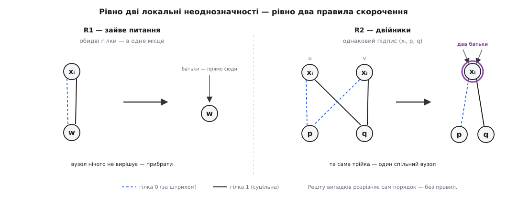

# 🧮 Єдиність скороченої діаграми: доведення канонічности

Стверджують: за наперед фіксованого порядку змінних повністю скорочена впорядкована діаграма [булевої функції](topic:math/boolean-algebra) — **єдина**. Це не спостереження, а теорема, і на ній тримається вся сила BDD: якщо форма єдина, то питання «чи дві функції рівні» перетворюється на «чи це той самий граф». Доведімо строго — [індукцією](topic:math/mathematical-induction) — і заразом побачимо, чому саме **два** правила скорочення прибирають рівно всю свободу вибору: ні на одне менше, ні на одне більше.

### Що саме доводимо — формальні об'єкти

Закріпимо порядок змінних `x₁ ≺ x₂ ≺ … ≺ xₙ` (індекс — це номер змінної в цьому порядку). **Впорядкована діаграма** (OBDD) — орієнтований ациклічний граф із двома терміналами-стоками `0` і `1` (без вихідних ребер) та внутрішніми вузлами; кожен внутрішній вузол `v` несе змінну `var(v) = xᵢ` і два ребра: `lo(v)` (гілка «0») та `hi(v)` (гілка «1»). Слово «впорядкована» означає єдине обмеження: уздовж будь-якого ребра індекс змінної **строго зростає** — `index(var(v)) < index(var(дитини))` для внутрішніх дітей.

Кожен вузол задає функцію [розкладом Шеннона](topic:math/shannon-expansion):

```
термінал 0    →  стала 0
термінал 1    →  стала 1
вузол v (xᵢ)  →  f_v = ¬xᵢ·f_lo(v) + xᵢ·f_hi(v)
```

Функція діаграми — це `f` її кореня. Тепер два правила, що роблять діаграму **скороченою**:

```
R1 (зайвий вузол):  жодного вузла з  lo(v) = hi(v)
R2 (двійники):      жодних двох різних вузлів з однаковим ПІДПИСОМ —
                    для внутрішнього підпис = трійка (var, lo, hi),
                    для термінала  підпис = стала (тож стоків рівно два)
```

Скорочену впорядковану діаграму (ROBDD) і маємо на увазі, кажучи «діаграма». **Ізоморфізм** двох діаграм — взаємно однозначна відповідність вузлів, що зберігає підписи й ребра: термінал у термінал тієї ж сталої, вузол `xᵢ` у вузол `xᵢ`, `lo` у `lo`, `hi` у `hi`. І ось твердження.

> **Теорема (канонічність; Bryant, 1986).** За фіксованого порядку кожну булеву функцію задає **рівно одна** ROBDD — з точністю до ізоморфізму. Рівносильно: дві ROBDD над тим самим порядком задають ту саму функцію тоді й лише тоді, коли вони ізоморфні.

Ідемо знизу: спершу дрібні факти, що не потребують скорочень, потім осердя, потім сама теорема.

### Діти вузла — це кофактори

**Лема 1.** Якщо вузол `v` перевіряє `xᵢ`, то `f_lo(v) = f_v|xᵢ=0` та `f_hi(v) = f_v|xᵢ=1`.

Доведення — один рядок. За порядком обидві діти перевіряють змінні з індексом `> i`, тож ані `f_lo`, ані `f_hi` **не залежать** від `xᵢ`. Підставмо в тотожність `f_v = ¬xᵢ·f_lo + xᵢ·f_hi` значення `xᵢ = 0` — лишається `f_lo`; значення `xᵢ = 1` — лишається `f_hi`. ∎

Звідси ж — простий, але потрібний факт: **функція вузла залежить лише від змінних з індексом ≥ `index(var(v))`**, бо всі змінні, досяжні з `v` по ребрах, мають індекс не менший (порядок лише зростає). Зокрема, якщо `i < j`, то функція вузла, що перевіряє `xⱼ`, від `xᵢ` не залежить узагалі.

### Осердя: у скороченій діаграмі різні вузли — різні функції

Усе тримається на одній лемі. Вона каже, що скорочення виполює дублювання **вповні**: у ROBDD не буває двох вузлів з однаковою функцією.

**Лема 2.** У будь-якій ROBDD різні вузли задають різні функції: `u ≠ v ⟹ f_u ≠ f_v`.

Доведення — індукцією за **висотою** пари (висота термінала — 0; висота внутрішнього вузла — на 1 більша за більшу з висот його дітей). Беремо `u ≠ v` і розбираємо, ким вони можуть бути. Показово, що́ рятує нас у кожному куті:

- **Обидва термінали.** Різні термінали мають різні сталі, `0 ≠ 1` — функції різні. *(Працює термінальна частина R2: стоків лише два.)*

- **Термінал `c` і внутрішній `v` (xᵢ).** Припустимо противне: `f_v = c` (стала). Тоді обидва кофактори сталі й рівні: `f_lo(v) = f_hi(v) = c`. Діти нижчі за `v`, тож за припущенням індукції рівність їхніх функцій тягне рівність вузлів: `lo(v) = hi(v)`. Але це **заборонено R1**. Суперечність — отже `f_v ≠ c`. *(Ось де потрібне R1 — і лише тут.)*

- **Двоє внутрішніх, `u` (xᵢ) і `v` (xⱼ), різні змінні `i ≠ j`.** Нехай `i < j`. Кофактори `u` за `xᵢ` — це `f_lo(u)` і `f_hi(u)`; за R1 `lo(u) ≠ hi(u)`, за припущенням індукції `f_lo(u) ≠ f_hi(u)` — отже `f_u` **залежить** від `xᵢ`. А `f_v` від `xᵢ` не залежить (індекс `j > i`). Одна функція від `xᵢ` залежить, друга — ні, тож вони різні. *(Тут жодне правило не потрібне — розрізняє сам порядок.)*

- **Двоє внутрішніх, та сама змінна `xᵢ`.** Оскільки `u ≠ v` мають однакову `var = xᵢ`, за **R2** не можуть збігтися обидві дитини одразу: `lo(u) ≠ lo(v)` або `hi(u) ≠ hi(v)`. Нехай різняться `lo`; вони нижчі, тож за припущенням індукції `f_lo(u) ≠ f_lo(v)`, тобто `f_u|xᵢ=0 ≠ f_v|xᵢ=0` — функції різні. *(Ось де потрібне R2 — і лише тут.)* ∎

Придивімося, що́ сталося. Випадків було рівно чотири, і **свобода** — можливість двом різним вузлам задавати одну функцію — виникала лише у двох із них: коли вузол вироджувався у сталу (лікує R1) і коли два вузли на одній змінній дублювали трійку (лікує R2). Решту двох випадків закриває сам порядок, безкоштовно. Ось точний сенс слів «саме два скорочення прибирають рівно всі джерела неоднозначности»: джерел рівно два, і кожному відповідає одне правило.


*Дві — і лише дві — локальні неоднозначності, які скорочення мусить прибрати. R1 стирає вузол, що нічого не питає (обидві гілки в одне місце); R2 зливає вузли з однаковим підписом у спільний, з двома батьками. Доведення Леми 2 показує, що інших джерел дублювання порядок не лишає.*

Одразу — **наслідок**, який знадобиться далі.

**Наслідок.** Внутрішній вузол `v` задає **несталу** функцію, і `var(v)` — це **найменша за порядком змінна, від якої залежить `f_v`** (назвімо її верхньою істотною змінною). Справді: за R1 `lo(v) ≠ hi(v)`, за Лемою 2 тоді `f_lo(v) ≠ f_hi(v)`, тобто `f_v` залежить від `var(v)` — і вже тому нестала. Від змінних із меншим індексом `f_v` не залежить, тож істотної змінної, меншої за `var(v)`, немає.

### Теорема: за фіксованого порядку діаграма єдина

Тепер — індукція за **числом змінних** `n`, якраз та коротка, що обіцяли: єдиність скорочених кофакторів тягне єдиність вузла над ними.

**База `n = 0`.** Функція без змінних — стала, `0` або `1`. Внутрішнім коренем вона бути не може (наслідок: внутрішній вузол несталий), тож корінь — термінал, а стоків рівно два. Кожній сталій — свій єдиний термінал. ✓

**Крок.** Хай теорема справджується для всіх функцій над коротшим порядком `x₂ ≺ … ≺ xₙ` (на одну змінну менше). Візьмімо `f` над `x₁ ≺ … ≺ xₙ` і дві її ROBDD — `G` та `H`.

Якщо `f` стала — як у базі, обидві діаграми суть той самий термінал. Хай `f` нестала. Позначмо `xₘ` її верхню істотну змінну — найменший індекс, де `f|xₘ=0 ≠ f|xₘ=1`. За наслідком корінь **кожної** правильної ROBDD функції `f` перевіряє саме `xₘ`: не раніше (менші змінні неістотні) і не пізніше (інакше `f` не залежала б від `xₘ`). Отже, і `корінь(G)`, і `корінь(H)` несуть `xₘ`. Їхні діти за Лемою 1 задають кофактори:

```
f_lo(корінь) = f|xₘ=0        f_hi(корінь) = f|xₘ=1
```

Обидва кофактори — функції над коротшим порядком (від `xₘ` вони вже не залежать, а менші змінні неістотні). За **припущенням індукції** кожен із них має **єдину** ROBDD. Тому піддіаграма під `lo(корінь(G))` ізоморфна такій під `lo(корінь(H))` — обидві суть єдина ROBDD того самого `f|xₘ=0`; так само для `hi`. Єдиність кофакторів — доведена.

Лишається зшити це в ізоморфізм цілих `G` і `H`, і Лема 2 робить зшивання **автоматичним**. Зіставмо кожному вузлу `p` діаграми `G` той вузол `q` діаграми `H`, що задає **ту саму функцію**: `f_q = f_p`. Такий `q` **існує** (множини функцій, що трапляються на вузлах `G` і `H`, однакові — це видно з тієї самої рекурсії: корінь дає `f`, а діти вичерпують кофактори згори донизу аж до сталих) і **єдиний** (Лема 2 в `H`: функція визначає вузол однозначно). Ця відповідність зберігає ребра: якщо `p` перевіряє `xₖ`, то `f_lo(p) = f_p|xₖ=0`; вузол-образ `q` перевіряє ту саму `xₖ` (верхню істотну змінну функції `f_p`), а його `lo` задає `f_p|xₖ=0 = f_lo(p)` — тобто образом `lo(p)` є саме `lo(q)`. Термінали йдуть у термінали тієї ж сталої. Відповідність — ізоморфізм, отже `G ≅ H`. ∎

Стрижень кроку — рівно обіцяне: **скорочена форма кофакторів визначена однозначно (гіпотеза індукції), а вузол над двома однозначними кофакторами — теж однозначний** (та сама змінна, ті самі діти). Уся діаграма будується цим правилом згори вниз — тож і вся вона однозначна.

### Наслідки: рівність стала тотожністю

Головний наслідок — той, заради якого теорему й доводять.

**Еквівалентність ⟺ ізоморфізм.** `f = g` тоді й лише тоді, коли їхні ROBDD ізоморфні. Пряме — щойно доведене (рівні функції → та сама діаграма); зворотне очевидне (ізоморфні діаграми обчислюють те саме). **Семантичне** питання — рівність функцій на всіх `2ⁿ` входах — звелося до **синтаксичного**: збігу графів. А якщо пакет тримає всі діаграми в одній таблиці й ніколи не творить двох структурно однакових вузлів (спільне зберігання, *hash-consing*), то ізоморфізм вироджується у **рівність покажчиків**: `f = g` — це `корінь(f) == корінь(g)`, одне порівняння. Те, що для формул було задачею рівня [здійсненности (SAT)](topic:math/boolean-satisfiability), тепер коштує сталу — уся ціна перенесена в побудову діаграми.

**Скорочення конфлюентне.** Оскільки повністю скорочена форма єдина, то хоч у якому порядку застосовувати R1 і R2, доки є що прибирати, результат той самий. «Недоскороченої», неоднозначної форми не буває: правила приводять до однієї нерухомої точки незалежно від шляху (властивість Черча — Россера).

### Межі: де фіксований порядок обов'язковий

У теоремі є гіпотеза — «за фіксованого порядку», — і вона не прикраса. Приберіть її, і єдиність провалюється: та сама функція в різних порядках дає **неізоморфні** скорочені діаграми, ба навіть різні за розміром.

**Найдрібніший свідок — `f = a·b + a·c = a·(b + c)`.**

```
Порядок  a ≺ b ≺ c:
  f|a=0 = 0,   f|a=1 = b+c      → корінь a
  під a=1:  b+c  →  вузол b, вузол c
  різні несталі підфункції:  f, b+c, c       →  3 внутрішні вузли

Порядок  b ≺ a ≺ c:
  f|b=0 = a·c,  f|b=1 = a        → корінь b
  a·c  →  вузол a′ (підпис a, 0, c),  вузол c
  a    →  вузол a″ (підпис a, 0, 1) — окремий від a′
  різні несталі підфункції:  f, a·c, a, c    →  4 внутрішні вузли
```

Три вузли проти чотирьох — діаграми не ізоморфні, хоч функція одна. Причину видно крізь Лему 2: число внутрішніх вузлів дорівнює числу **різних несталих підфункцій**, а їхня множина залежить від того, в якому порядку розтинати. Тож «канонічна форма» завжди канонічна **щодо обраного порядку**; порівнювати за тотожністю графів можна лише діаграми в **одному** порядку. (Наскільки різко порядок б'є по розміру — аж до експоненти — то вже про ефективність, не про єдиність; тут важить сам факт: без закріпленого порядку єдиности немає.)

І дзеркально — обидва скорочення теж обов'язкові, кожне окремо. Без **R1** ту саму функцію можна роздути будь-яким числом зайвих вузлів виду `(xᵢ, w, w)` — діаграм безліч. Без **R2** можна тримати скільки завгодно копій будь-якої підфункції — знову не єдино. Лема 2 показала це зсередини: рівно ці два випадки й породжують свободу, і рівно два правила її знімають. Приберіть будь-яке — і рівність функцій перестане бути рівністю графів.
