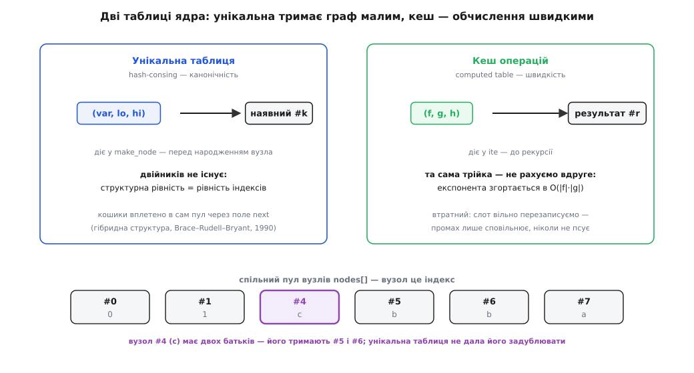

# ⚙️ Ядро пакета BDD: дві таблиці й одна рекурсія

Ось уся машинерія двійкової діаграми рішень як півтори сотні рядків C, які можна скомпілювати й запустити: вузол — просте ціле число, `make_node` стереже обидва скорочення, унікальна таблиця тримає кожну підфункцію в єдиному екземплярі, кеш операцій пам'ятає кожен уже порахований результат, а одна рекурсивна `ite` розкручує все булеве числення. Наприкінці ми збудуємо функцію «більшости» `maj(a, b, c)` двома різними шляхами й побачимо, як вони злипаються в **той самий** вузол.

Чому C, а не щось із автоматичною пам'яттю. Це системний код: пам'ять тут доводиться вести руками, хеш-таблицю вплетено в сам пул вузлів, а живучість вузлів рахує лічильник посилань. Мова зі збирачем сміття сховала б рівно ту машинерію, заради якої ми сюди й прийшли. Не випадково еталонний пакет — CUDD Фабіо Соменці (*Somenzi*) з Університету Колорадо — написаний саме на C.

## Задача, зведена до чотирьох рішень

Ми хочемо `and`, `or`, `not`, `xor` над діаграмами, які **завжди** повертають скорочену впорядковану діаграму й **ніколи** не рахують те саме двічі. Щоб це стало кодом, а не наміром, треба ухвалити чотири інженерні рішення — і вся решта випливе з них.

**Перше: вузол — це ціле число, індекс у масиві, а не покажчик.** Дрібна на вигляд відмінність дає три вигоди одразу. Ключ хеш-таблиці стає трійкою чисел — його дешево змішати в хеш. Пул вузлів можна нарощувати через `realloc`, і жодне посилання від цього не зіпсується: усі, хто «показує» на вузол, тримають індекс, а не адресу, тож переїзд пулу в пам'яті їх не обходить. І сусідні за номером вузли лежать поряд — процесорному кешу легше.

**Друге: `make_node` — єдине місце, де вузол народжується,** і саме воно застосовує обидва скорочення. Ніде більше в коді немає `nodes[nnodes++] = …`; хто хоче вузол — просить `make_node`, і той або віддасть наявний, або зробить новий канонічний. Одна брама — одна гарантія.

**Третє: унікальна таблиця** ловить двійників: перш ніж створити вузол, `make_node` питає її, чи такий уже є. **Четверте: кеш операцій** ловить повторні обчислення: `ite` кладе туди кожну пораховану трійку. Перша тримає граф малим, другий — обчислення швидкими.

> 🔧 **Навіщо індекс, а не покажчик.** Коли граф росте, пул вузлів рано чи пізно переповнюється й переїжджає на нове місце. У світі покажчиків це катастрофа: усі адреси враз протухли. У світі індексів — не сталося нічого: `realloc` перемістив байти, індекси лишилися тими самими числами. Тому промислові пакети BDD майже завжди адресують вузли числом, а не вказівником.

## Структури й дві таблиці

```c
#include <stdio.h>
#include <stdlib.h>

#define TERM       0x7fffffff   /* «рівень» термінала — нижче за будь-яку змінну */
#define BDD_FALSE  0            /* вузол-константа 0 */
#define BDD_TRUE   1            /* вузол-константа 1 */

typedef struct {
    int var;        /* індекс змінної: 0 — найвища за порядком; термінал → TERM */
    int lo, hi;     /* нащадки: гілки «0» і «1» (теж індекси) */
    int next;       /* наступний вузол у ланцюжку кошика унікальної таблиці, -1 — кінець */
    int ref;        /* лічильник посилань */
} Node;

static Node *nodes;             /* пул вузлів; вузол — це індекс сюди */
static int   ncap, nnodes;

static int  *utable;            /* унікальна таблиця: кошик → голова ланцюжка (індекс) */
static int   umask;             /* розмір−1 (розмір — степінь двійки) */

typedef struct { int f, g, h, r; } Cache;
static Cache *ctable;           /* кеш операцій: слот → трійка ITE та її результат */
static int    cmask;

static unsigned hash3(int a, int b, int c) {
    unsigned x = (unsigned)a * 73856093u ^ (unsigned)b * 19349663u ^ (unsigned)c * 83492791u;
    return x ^ (x >> 13);
}

static void bdd_init(int cap, int ubits, int cbits) {
    ncap = cap; nodes = malloc(sizeof(Node) * ncap);
    umask = (1 << ubits) - 1; utable = malloc(sizeof(int) * (umask + 1));
    for (int i = 0; i <= umask; i++) utable[i] = -1;
    cmask = (1 << cbits) - 1; ctable = malloc(sizeof(Cache) * (cmask + 1));
    for (int i = 0; i <= cmask; i++) ctable[i].f = -1;      /* −1 = порожній слот */
    nodes[0] = (Node){ TERM, 0, 0, -1, 1 };                 /* константа 0 */
    nodes[1] = (Node){ TERM, 1, 1, -1, 1 };                 /* константа 1 */
    nnodes = 2;
}
```

Два термінали `#0` і `#1` заводяться раз і назавжди — усі діаграми пакета діляться ними. Їхнє поле `var` — це `TERM`, велике число: у порядку змінних термінал стоїть **нижче** за всіх, тож будь-яка справжня змінна виявляється «вищою» простим порівнянням цілих.

Найцікавіше поле — `next`. Унікальна таблиця не тримає власних записів: її кошики — це просто голови ланцюжків, а самі ланки живуть **усередині** вузлів, у полі `next`. Так таблиця й пул зрощені в одну структуру, без окремих вузлів-обгорток на кожен запис. Саме цю економію — вплести хеш-таблицю прямо в пул — запропонували Брейс, Руделл і Брайант (*Brace, Rudell, Bryant*) у роботі «Efficient Implementation of a BDD Package» (27-ма конференція DAC, 1990), і відтоді так роблять усі.

Кеш операцій влаштований простіше — це масив `ctable` із прямою адресацією: трійка `(f, g, h)` хешується в один слот, і там лежить рівно один запис. Колізія просто затирає старий — і це не вада, а свідомий вибір, до якого повернемося.

## make_node: обидва скорочення тут

```c
/* Єдине місце, де народжується вузол. Повертає КАНОНІЧНИЙ вузол (var, lo, hi):
   якщо такий уже є — наявний, інакше створює новий. */
static int make_node(int var, int lo, int hi) {
    if (lo == hi) return lo;                     /* скорочення 1: гілки збіглися — питання зайве */

    unsigned slot = hash3(var, lo, hi) & umask;  /* скорочення 2: шукаємо двійника в кошику */
    for (int u = utable[slot]; u != -1; u = nodes[u].next)
        if (nodes[u].var == var && nodes[u].lo == lo && nodes[u].hi == hi)
            return u;                             /* уже існує — віддаємо той самий вузол */

    if (nnodes == ncap) { ncap *= 2; nodes = realloc(nodes, sizeof(Node) * ncap); }
    int u = nnodes++;                             /* новий канонічний вузол */
    nodes[u] = (Node){ var, lo, hi, utable[slot], 0 };
    utable[slot] = u;                             /* чіпляємо в голову ланцюжка кошика */
    nodes[lo].ref++; nodes[hi].ref++;             /* тримаємо нащадків живими */
    return u;
}
```

Обидва скорочення, що перетворюють дерево на граф, стиснуто в кілька рядків. Перший рядок — правило «зайвого питання»: якщо гілки `lo` і `hi` ведуть в одне місце, змінна ні на що не впливає, тож вузол не потрібен — повертаємо просто цю спільну ціль. Цикл по ланцюжку — правило «двійників»: якщо вузол із таким самим `(var, lo, hi)` уже є, віддаємо його, нового не робимо. Лише коли обидва скорочення промовчали, з'являється новий вузол — і одразу чіпляється в голову кошика через своє поле `next`.

Останній рядок — `nodes[lo].ref++; nodes[hi].ref++` — оголошує правило живучости: **вузол тримає своїх нащадків.** Поки живий батько, діти не можуть зникнути. Це той стрижень, на якому згодом триматиметься збирання сміття.

## ite: розтин, рекурсія, збірка

```c
static int ite(int f, int g, int h) {
    if (f == BDD_TRUE)  return g;                /* ITE(1,g,h) = g */
    if (f == BDD_FALSE) return h;                /* ITE(0,g,h) = h */
    if (g == h)         return g;                /* обидві гілки однакові */
    if (g == BDD_TRUE && h == BDD_FALSE) return f;   /* ITE(f,1,0) = f */

    unsigned slot = hash3(f, g, h) & cmask;      /* кеш: чи рахували цю трійку? */
    Cache *e = &ctable[slot];
    if (e->f == f && e->g == g && e->h == h) return e->r;

    int v = nodes[f].var;                        /* верхня змінна серед f, g, h */
    if (nodes[g].var < v) v = nodes[g].var;
    if (nodes[h].var < v) v = nodes[h].var;

    #define COF(u, br) (nodes[u].var == v ? nodes[u].br : (u))   /* кофактор за v */
    int lo = ite(COF(f, lo), COF(g, lo), COF(h, lo));           /* гілка v = 0 */
    int hi = ite(COF(f, hi), COF(g, hi), COF(h, hi));           /* гілка v = 1 */
    #undef COF

    int r = make_node(v, lo, hi);                /* збірка — знову з обома скороченнями */
    e->f = f; e->g = g; e->h = h; e->r = r;      /* кешуємо (слот перезаписуємо — кеш втратний) */
    return r;
}
```

Чотири перші рядки — це дно рекурсії, точки, де відповідь очевидна без розтину: якщо умова `f` — стала, беремо ту чи ту гілку; якщо гілки й так однакові, немає що вибирати; а `ITE(f, 1, 0)` — це просто `f`. Далі — кеш: якщо цю саму трійку вже колись рахували, готове віддається негайно. Саме цей рядок і перетворює наївну експоненту на добуток розмірів: різних трійок обмаль, а кожну обчислюємо один-єдиний раз.

Якщо ж трійка нова, беремо **верхню** з трьох змінних `v` і розтинаємо за нею всіх трьох одразу. Кофактор дешевий: якщо корінь питає саме про `v`, беремо його гілку; якщо про пізнішу змінну — вузол від `v` не залежить, і кофактор дорівнює йому самому (макрос `COF` це й робить). Дві рекурсії дають гілки `0` і `1`, а `make_node` збирає з них вузол — знову крізь обидва скорочення, тож на виході одразу канонічна діаграма. І наостанок — трійку разом із результатом кладемо в кеш.

Дрібна, але важлива деталь коректности: покажчик `e` на комірку кешу живе крізь обидві рекурсії. Він не протухає — бо рекурсія може нарощувати лише **пул вузлів**, а таблиця кешу зафіксована й з місця не рушить. Це знову дивіденд від того, що вузли адресуються індексами: переїзд пулу нікого не турбує.

## Уся булева алгебра — чотири рядки

```c
static int bdd_var(int i) { return make_node(i, BDD_FALSE, BDD_TRUE); }  /* xᵢ */

static int bdd_not(int f)        { return ite(f, BDD_FALSE, BDD_TRUE); } /* ¬f    = ITE(f,0,1) */
static int bdd_and(int f, int g) { return ite(f, g, BDD_FALSE); }        /* f · g = ITE(f,g,0) */
static int bdd_or (int f, int g) { return ite(f, BDD_TRUE, g); }         /* f + g = ITE(f,1,g) */
static int bdd_xor(int f, int g) { return ite(f, bdd_not(g), g); }       /* f ⊕ g = ITE(f,¬g,g) */
```

Змінна `xᵢ` — це вузол, що питає про `xᵢ`: коли `0`, веде в термінал `0`, коли `1` — у термінал `1`. А всі операції — це підбір трьох аргументів до `ite`. Жодна з них не знає ні про скорочення, ні про кеш, ні про порядок змінних: усе це вже зроблено всередині. Додати нову операцію — це знайти для неї трійку, а не писати новий алгоритм.

> 🔧 **Навіщо одна операція замість десяти.** Коли вся алгебра проходить крізь єдину рекурсію, будь-яка вигода вкладається туди раз і працює для всього. Покращили кеш — швидше стало і `and`, і `xor`, і `or`. Це протилежність до пакета з окремою процедурою на кожну операцію, де кожну треба доводити й прискорювати нарізно.

## Приклад: maj двома шляхами

```c
static void mark(int u, char *seen) {
    if (seen[u]) return;
    seen[u] = 1;
    if (nodes[u].var != TERM) { mark(nodes[u].lo, seen); mark(nodes[u].hi, seen); }
}

int main(void) {
    bdd_init(64, 10, 10);                        /* пул + дві таблиці по 1024 слоти */
    int a = bdd_var(0), b = bdd_var(1), c = bdd_var(2);

    /* Спосіб 1 — прямо через ITE:  a ? (b+c) : (b·c) */
    int maj1 = ite(a, bdd_or(b, c), bdd_and(b, c));
    /* Спосіб 2 — сума добутків:  a·b + a·c + b·c */
    int maj2 = bdd_or(bdd_or(bdd_and(a, b), bdd_and(a, c)), bdd_and(b, c));

    printf("maj спосіб 1 (ITE)           = вузол #%d\n", maj1);
    printf("maj спосіб 2 (сума добутків) = вузол #%d\n", maj2);
    printf("тотожні? %s\n\n", maj1 == maj2 ? "так — той самий вузол" : "ні");

    char *seen = calloc(nnodes, 1);
    mark(maj1, seen);
    const char *nm = "abc";
    int internal = 0;
    for (int u = 2; u < nnodes; u++) internal += seen[u];
    printf("діаграма maj: %d внутрішніх вузли + 2 термінали\n", internal);
    for (int u = nnodes - 1; u >= 2; u--)
        if (seen[u])
            printf("  #%d  var %c  lo #%d  hi #%d\n",
                   u, nm[nodes[u].var], nodes[u].lo, nodes[u].hi);

    int parents = 0;
    for (int u = 2; u < nnodes; u++)
        if (seen[u] && (nodes[u].lo == c || nodes[u].hi == c)) parents++;
    printf("\nвузол #%d (c) має %d батьків — спільний, тож це граф\n", c, parents);
    return 0;
}
```

Функцію «більшости» ми будуємо двічі геть по-різному. Перший спосіб — прямий розтин за `a`: якщо `a = 1`, лишається `b + c`, якщо `a = 0` — `b · c`. Другий — класична сума добутків `a·b + a·c + b·c`, зібрана з п'яти окремих операцій. На вигляд — два незалежні обчислювальні маршрути. Ось що друкує програма:

```
maj спосіб 1 (ITE)           = вузол #7
maj спосіб 2 (сума добутків) = вузол #7
тотожні? так — той самий вузол

діаграма maj: 4 внутрішніх вузли + 2 термінали
  #7  var a  lo #6  hi #5
  #6  var b  lo #0  hi #4
  #5  var b  lo #4  hi #1
  #4  var c  lo #0  hi #1

вузол #4 (c) має 2 батьків — спільний, тож це граф
```

Обидва шляхи привели в **той самий** вузол `#7` — не в рівні, а в буквально один об'єкт із одним індексом. Це канонічність у дії: рівність функцій звелася до рівности цілих чисел, і перевірити її коштує одне порівняння `maj1 == maj2`. За це подбала унікальна таблиця: коли сума добутків наприкінці попросила зібрати вузол `(a, #6, #5)`, він там уже був — з першого способу, — тож повернувся наявний.

А кеш операцій відпрацював по дорозі непомітно. Будуючи `maj1`, ми порахували `bdd_or(b, c)` — це трійка `ITE(b, 1, c)`. Пізніше, глибоко всередині другого способу, розтин наткнувся рівно на цю ж трійку — і замість повторної рекурсії кеш віддав готовий вузол `#5`. Дві таблиці працюють у парі: унікальна не дала задублювати структуру, кеш не дав повторити обчислення.

І видно обіцяне графом злиття: у діаграмі `maj` вузол `#4` (це `c`) слухають **двоє** батьків — `#5` (гілкою `0`) і `#6` (гілкою `1`). Одна підфункція, збережена раз, з двома посиланнями — те саме місце, де дерево стало графом.


*Дві таблиці, дві ролі. Унікальна таблиця питається перед народженням вузла — тож двійників не існує, а структурна рівність збігається з рівністю індексів. Кеш операцій питається перед рекурсією — тож та сама трійка не рахується вдруге. Обидві спираються на спільний пул вузлів, де вузол — це просто індекс, а `c` живе в одному екземплярі на двох батьків.*

## Скільки це коштує

Ціна `ite` — це кількість **різних** трійок `(f, g, h)`, які трапляться в рекурсії, бо кожну рахуємо рівно раз, а решту віддає кеш. Для бінарної операції один із трьох аргументів завжди сталий (`0` чи `1`), тож різних пар з-поміж двох діаграм — щонайбільше `|f|·|g|`, а обробка кожної коштує `O(1)`: пошук у кеші, розтин, збірка. Разом:

```
and, or, xor:   O(|f| · |g|)      ← стільки різних пар, стільки й роботи
без кешу:       O(2ⁿ)             ← та сама рекурсія, але кожну пару рахуємо знову
```

`make_node` коштує `O(1)` в середньому: хеш веде прямо в потрібний кошик, ланцюжки за доброго хешування короткі, а `realloc` подвоює пул, тож усереднена ціна нарощування — стала. За пам'яттю пакет платить по одному вузлу на кожну **різну** підфункцію — і на весь пакет, а не на кожну функцію окремо: спільне зберігання діє глобально.

## Пастки

**Пам'ять доводиться вести руками.** Поле `ref` — це [підрахунок посилань](topic:programming/reference-counting): `make_node` збільшує лічильник нащадкам, а зовнішній код мусить сам «утримати» ті корені, які хоче зберегти, і «відпустити» непотрібні. Вузол із нульовим лічильником — **мертвий**: на нього ніхто не посилається, і місце під ним можна повернути.

**Мертві вузли треба колись прибирати** — це [збирання сміття](topic:programming/garbage-collection): прохід пулом, що звільняє вузли з `ref == 0`, зменшуючи при цьому лічильники їхнім нащадкам (звільнення може каскадом піти далі), і перебудовує ланцюжки унікальної таблиці. Тут чигає найпідступніша пастка: **кеш операцій треба спорожнити разом зі збиранням.** Кеш тримає індекси результатів, ні на кого офіційно не посилаючись; якщо збирач прибере вузол, а в кеші лишиться запис із його номером, наступний влучний запит віддасть покажчик у порожнечу. Тому збирання сміття завжди супроводжується скиданням кешу — і саме тому збирати можна лише в безпечній точці, коли жодне обчислення не в польоті.

**Втратність кешу — це не вада, а свобода.** Пряма адресація дозволяє новому запису затерти старий, і жодної спроби розрулити колізію немає. Це безпечно рівно тому, що кеш впливає лише на **швидкість**, ніколи на правильність: промах просто змусить порахувати гілку заново, а результат вийде той самий. Тому кеш можна тримати невеликим і безжально перезаписувати — а от унікальну таблицю не можна: там втрата запису означала б дубль вузла й розвал канонічности.

**Один порядок на весь пакет.** Індекс `var` — це позиція змінної в **спільному** порядку; хеш-консинг тримає канонічність, лише поки всі діаграми будуються в тому самому порядку. Змішати діаграми з різними порядками — зруйнувати єдиність, заради якої все й затівалося. А оскільки від порядку різко залежить розмір, промислові пакети ще й **переставляють** змінні під час роботи, перебудовуючи таблиці, — окрема машинерія поверх цього кістяка.

**Наступний крок оптимізації — доповнені ребра** (*complement edges*). Ідея з тієї ж роботи 1990 року: замість окремого вузла на `¬f` позначати заперечення одним бітом прямо на ребрі. Тоді `not` коштує `O(1)`, а функція та її заперечення діляться однією структурою — це заощаджує до половини вузлів. Це головна причина, чому CUDD і рідня такі ощадливі; ми лишили заперечення звичайною операцією через `ite` заради ясности, але в бойовому пакеті воно живе на ребрі.
