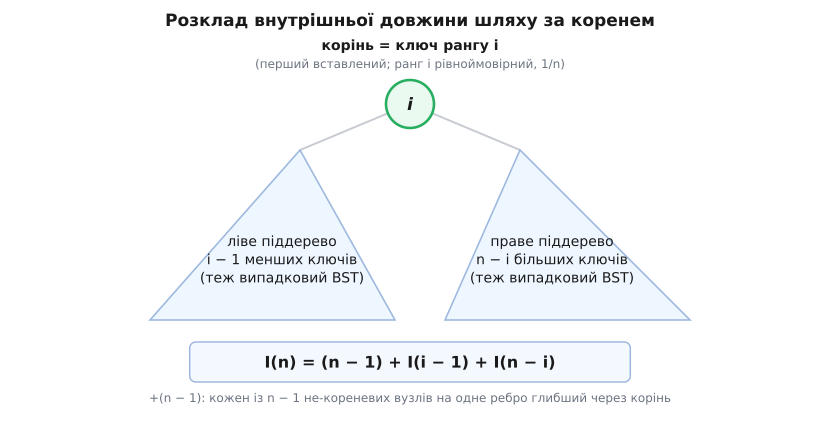
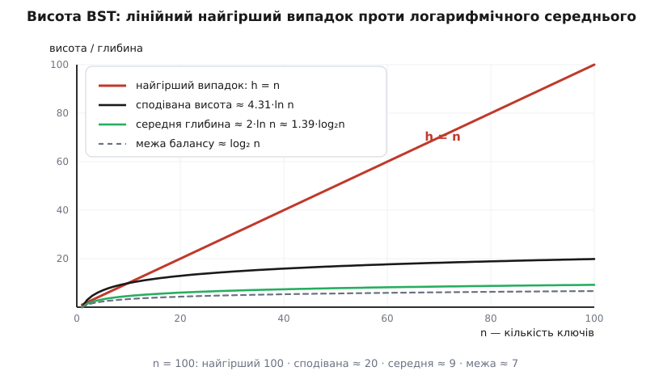

# 🧮 Висота дерева пошуку: чому найгірший випадок — рівно n, а випадковий — 1.39·log₂n

Вартість пошуку, вставки й видалення у двійковому дереві пошуку — це довжина шляху від кореня вниз, тобто все впирається у **висоту** дерева; тут ми виводимо алгебраїчно дві оцінки цієї висоти, на які спирається стаття, — чому невдалий порядок вставок дає вироджений ланцюг заввишки рівно n, а випадковий порядок дає сподівану висоту Θ(log n) із середньою глибиною вузла близько 2·ln n ≈ 1.39·log₂n. Жодних нових понять — сама арифметика оцінок.

Домовимося про позначення раз і назавжди. **Глибина** вузла — число ребер від кореня до нього: корінь має глибину 0, його діти — 1, і так далі. **Висота** h дерева — найбільша глибина серед усіх вузлів. Пошук вузла на глибині d коштує d + 1 порівнянь, тож найдовший спуск коштує h + 1 порівнянь. Отже, уся розмова про швидкість — це розмова про одне число h.

## Дві стіни: між log₂n і n висоті нікуди не дітися

Перш ніж рахувати «типову» висоту, обмежимо, де вона взагалі може лежати. Обидві межі дає просте перелічення вузлів по рівнях.

**Стеля (мінімальна висота).** На рівні d (глибина d) вузлів не більше за 2ᵈ — бо кожен вузол має щонайбільше двох дітей, і рівень щоразу подвоюється в кращому разі. Тому дерево висоти h вміщає щонайбільше стільки вузлів:

```
рівні 0, 1, …, h  →  вузлів ≤ 2⁰ + 2¹ + … + 2ʰ = 2ʰ⁺¹ − 1

n ≤ 2ʰ⁺¹ − 1   ⇒   2ʰ⁺¹ ≥ n + 1   ⇒   h ≥ log₂(n + 1) − 1
```

Це жорсткий фізичний ліміт: скільки ключів не тасуй, нижче за ⌈log₂(n + 1)⌉ − 1 висоту не опустити — просто нема куди складати вузли.

**Підлога (максимальна висота).** Найдовший можливий шлях у дереві з n вузлів проходить через усі n вузлів — це один суцільний ланцюг, у якому кожен вузол лежить на одне ребро нижче за попередній. Такий ланцюг має висоту h = n − 1, і вище дерево з n вузлів бути не може. Разом:

```
⌈log₂(n + 1)⌉ − 1  ≤  h  ≤  n − 1
```

Обидві стіни досяжні. Уся дальша математика — про те, до якої з них тулиться реальне дерево: найгірший порядок вставок притискає його до правої стіни, випадковий — майже до лівої.

## Найгірший випадок: відсортований вхід — це рівно ланцюг

Стаття показала трасу: вставмо 10, 20, 30, 40, 50 — і дерево витягнеться в правий ланцюг. Доведімо це строго для будь-яких відсортованих ключів a₁ < a₂ < … < aₙ, вставлених за зростанням.

Твердження: після вставки перших k ключів дерево — це правий ланцюг a₁ → a₂ → … → aₖ, у якому aₖ найглибший. Індукція за k. База k = 1 очевидна: один вузол. Крок: наступний ключ aₖ₊₁ більший за всі вже наявні, тому спуск-пошук його місця в кожному вузлі повертає праворуч — повз a₁, a₂, …, аж до aₖ, у якого правого сина ще нема. Туди aₖ₊₁ і сідає новим правим листком, подовживши ланцюг. Отже, підсумкове дерево — правий ланцюг з усіх n вузлів:

```
висота  h = n − 1
найдовший пошук (по aₙ):  h + 1 = n порівнянь   →   Θ(n)
```

Спадний вхід дає дзеркальний лівий ланцюг із тим самим h = n − 1. Ба більше, катастрофу вмикає не лише строгий порядок: будь-який достатньо довгий монотонний відрізок на вході нарощує відповідну гілку лінійно. Наївне дерево на відсортованих даних — це переодягнений зв'язаний список: та сама Θ(n), від якої дерево й тікало.

## Модель випадкового дерева: форма залежить лише від порядку

Найгірший випадок рідкісний серед *усіх* можливих порядків — тож спитаймо про **середнє**. Модель така: n різних ключів вставляють у випадковому порядку, і всі n! перестановок рівноймовірні. Тоді дерево — випадкова величина, і в нього є [сподівана](book:math/probability-basics) висота.

Уся сила аналізу — в одному структурному спостереженні: **форма дерева залежить лише від відносного порядку вставок, а не від самих значень ключів**. Коренем стає той ключ, який вставили першим. Позначмо його ранг (номер за зростанням серед усіх n) через i. За симетрією рівноймовірної перестановки перший вставлений однаково легко може виявитися будь-яким із n ключів, тому:

```
P(корінь має ранг i) = 1/n     для кожного i = 1, 2, …, n
```

Зафіксувавши корінь рангу i, решта ділиться сама собою: i − 1 менших ключів підуть у ліве піддерево, n − i більших — у праве. І — ключова деталь — усередині кожної групи порядок вставок лишається рівноймовірною перестановкою *цієї* групи, причому незалежно від другої групи. Тому **кожне піддерево саме є випадковим деревом пошуку** свого розміру, за тим самим законом. Ця самоподібність і є двигуном усіх формул нижче.

## Рекурентність на внутрішню довжину шляху

Щоб дістати середню глибину, підсумуймо глибини всіх вузлів. Ця сума має ім'я — **внутрішня довжина шляху**:

```
I(дерево) = Σ глибина(вузол)  по всіх вузлах

середня глибина = I / n
```

Тепер розкладімо I за коренем. Корінь має глибину 0. Кожен інший вузол лежить на одне ребро глибше, ніж лежав *усередині свого піддерева* — через зайвий стрибок з кореня. Не-кореневих вузлів рівно (i − 1) + (n − i) = n − 1, тож кожен додає ту саму одиницю:

```
I(n) = (n − 1) + I(ліве) + I(праве)
       └─ +1 на кожен ─┘   └─ довжини шляху піддерев ─┘
          з n−1 вузлів
```



*Самоподібність у дії: обидва піддерева — випадкові BST менших розмірів, а корінь додає рівно по одному ребру кожному з n−1 вузлів під ним. Це й дає доданок +(n−1) у рекурентності.*

Позначмо P(n) = E[I(n)] — сподівану внутрішню довжину шляху. Усереднимо рекурентність за рангом кореня i, який рівноймовірний. Коли i пробігає 1…n, розмір лівого піддерева i − 1 пробігає 0…n − 1, і так само розмір правого n − i пробігає 0…n − 1 у зворотному напрямі. Тому обидві суми дають той самий пробіг по P(0), P(1), …, P(n − 1):

```
P(n) = (n − 1) + (1/n) · Σ[i=1..n] ( P(i−1) + P(n−i) )
     = (n − 1) + (2/n) · Σ[k=0..n−1] P(k)

базові:  P(0) = P(1) = 0     (порожнє й однокореневе дерево — глибина 0)
```

## Розв'язання: звідки беруться гармонічні числа

Сума під знаком робить рекурентність незручною — приберімо її телескопуванням. Помножмо на n і випишімо те саме для n − 1:

```
n · P(n)       = n(n − 1)     + 2 · Σ[k=0..n−1] P(k)
(n−1) · P(n−1) = (n−1)(n−2)   + 2 · Σ[k=0..n−2] P(k)
```

Віднімемо другий рядок від першого — уся довга сума скорочується, лишається один доданок 2·P(n−1):

```
n·P(n) − (n−1)·P(n−1) = n(n−1) − (n−1)(n−2) + 2·P(n−1)
                      = (n−1)·[n − (n−2)]  + 2·P(n−1)
                      = 2(n−1)             + 2·P(n−1)

⇒  n·P(n) = (n + 1)·P(n−1) + 2(n − 1)
```

Ділення на n(n + 1) робить ліву частину «тією самою формою» для сусідніх n — класичний трюк, що перетворює рекурентність на просту суму. Введімо Q(n) = P(n)/(n + 1):

```
P(n)/(n+1) = P(n−1)/n + 2(n−1) / [n(n+1)]

⇒  Q(n) = Q(n−1) + 2(n−1) / [n(n+1)],     Q(0) = 0
```

Дріб розкладається на прості (елементарна перевірка: n − 1 = −(n+1) + 2n):

```
(n − 1) / [n(n + 1)]  =  −1/n  +  2/(n + 1)
```

Тепер Q(n) — це просто накопичена сума цих доданків від 1 до n. Тут і з'являються **гармонічні числа** Hₙ = 1 + 1/2 + 1/3 + … + 1/n:

```
Q(n) = 2 · Σ[k=1..n] ( −1/k + 2/(k+1) )
     = 2 · ( −Hₙ + 2·(H(n+1) − 1) )          бо Σ[k=1..n] 1/(k+1) = H(n+1) − 1
     = 2 · ( −Hₙ + 2Hₙ + 2/(n+1) − 2 )       бо H(n+1) = Hₙ + 1/(n+1)
     = 2Hₙ + 4/(n+1) − 4
```

Множимо назад на (n + 1) — і додаток 4/(n+1) стає рівно +4, що гасить хвіст:

```
P(n) = (n + 1)·Q(n) = 2(n + 1)·Hₙ − 4(n + 1) + 4

┌─────────────────────────────────┐
│   P(n) = 2(n + 1)·Hₙ − 4n        │
└─────────────────────────────────┘
```

Перевірмо на n = 3, перелічивши всі 6 порядків вставки ключів {1, 2, 3} і суму глибин у кожному:

```
1,2,3 → ланцюг 1-2-3  → глибини 0,1,2 → сума 3
1,3,2 → 1(_,3(2,_))   → глибини 0,1,2 → сума 3
2,1,3 → 2(1,3)        → глибини 0,1,1 → сума 2
2,3,1 → 2(1,3)        → глибини 0,1,1 → сума 2
3,1,2 → 3(1(_,2),_)   → глибини 0,1,2 → сума 3
3,2,1 → ланцюг 3-2-1  → глибини 0,1,2 → сума 3

E[I(3)] = (3+3+2+2+3+3)/6 = 16/6 = 8/3
формула: 2·4·H₃ − 12 = 8·(11/6) − 12 = 8/3   ✓
```

## Середня глибина ≈ 2·ln n ≈ 1.39·log₂n

Поділимо на n і отримаймо те, заради чого все й рахувалося, — сподівану глибину випадкового вузла:

```
d̄(n) = P(n)/n = 2·(1 + 1/n)·Hₙ − 4
```

Гармонічне число зростає як натуральний логарифм — це класична асимптотика зі сталою Ейлера–Маскероні γ ≈ 0.5772:

```
Hₙ = ln n + γ + 1/(2n) − …   ≈  ln n + 0.5772
```

Підставмо й лишімо провідний член (доданки з 1/n і стала −4 при великих n тьмяніють поряд із ln n):

```
d̄(n)  →  2·ln n

переведення основи:  ln n = ln2 · log₂n,   ln2 ≈ 0.6931
⇒  2·ln n = 2·ln2 · log₂n = 1.386 · log₂n  ≈  1.39·log₂n
```

Ось звідки береться число 1.39 зі статті. Порахуймо конкретно для мільйона ключів:

```
n = 1 000 000
Hₙ ≈ ln(10⁶) + γ = 13.8155 + 0.5772 = 14.3928
d̄  ≈ 2·14.3928 − 4 = 24.79

найкраща можлива середня глибина (ідеально збалансоване) ≈ 18.0
відношення  24.79 / 18.0 ≈ 1.38   (асимптотично → 1.386)
```

Тобто типовий пошук у випадковому дереві коштує приблизно на 39 % більше, ніж у ідеально збалансованому, — не катастрофа, а сталий множник. Випадковий порядок вставок сам собою тримає дерево гарним; біда лише в тому, що на реальний порядок вхідних даних покладатися не можна.

> 🔧 **Навіщо це.** Саме ця оцінка виправдовує старий інженерний прийом: **перетасувати ключі перед масовою вставкою** в наївне BST. Відсортований імпорт дав би ланцюг заввишки n (Θ(n) на запит), а випадкова перестановка — дерево з середньою глибиною 1.39·log₂n, лише на третину гіршою за оптимум. Один рядок тасування перетворює гарантовану катастрофу на майже-логарифм — за умови, що вставки далі не корельовані. Коли ж такої гарантії випадковості нема, форму доводиться тримати активно, обертаннями, — але це вже інша межа: сталий множник 1.39 проти жодних гарантій.

## Від середньої глибини до сподіваної висоти Θ(log n)

Середня глибина — це про *типовий* вузол. Висота — про *найглибший*. Покажімо, що й вона логарифмічна в середньому, обмеживши її з обох боків.

**Знизу — Ω(log n), майже задарма.** У будь-якому дереві найбільше не менше за середнє: висота h = max глибина ≥ середня глибина = I/n. Ця нерівність поточкова, тож переживає сподівання:

```
E[h] ≥ E[I/n] = P(n)/n = d̄(n) ~ 2·ln n     ⇒   E[h] = Ω(log n)
```

**Зверху — O(log n), трюком із 2 у степені висоти.** Пряма рекурентність на висоту незручна через max, але max стає керованим, якщо піднести двійку в його степінь. Нехай Xₙ — висота випадкового дерева (у ребрах). За коренем рангу R висота — це вища з двох гілок плюс одне ребро:

```
Xₙ = 1 + max( X(R−1),  X(n−R) )
```

Візьмімо Yₙ = 2^Xₙ. Оскільки 2^(1+max(a,b)) = 2·max(2ᵃ, 2ᵇ) ≤ 2·(2ᵃ + 2ᵇ), маємо:

```
Yₙ = 2·max( Y(R−1), Y(n−R) )  ≤  2·( Y(R−1) + Y(n−R) )
```

max поступився сумою — і рекурентність стала лінійною. Усереднимо за рівноймовірним R, як раніше (обидві суми пробігають Y(0)…Y(n−1)):

```
yₙ := E[Yₙ]  ≤  (4/n) · Σ[k=0..n−1] y(k),      y₀ = 2^(−1) = 1/2
```

(порожнє піддерево має висоту −1, тож Y = 2⁻¹). Доведімо індукцією просту межу yₙ ≤ (n + 1)³/2. База: y₀ = 1/2 = 1³/2 ✓. Крок, використавши Σ[m=1..n] m³ = [n(n+1)/2]²:

```
yₙ ≤ (4/n) · Σ[k=0..n−1] (k+1)³/2 = (2/n) · Σ[m=1..n] m³
   = (2/n) · [n(n+1)/2]² = n(n+1)²/2  ≤  (n+1)³/2   ✓
```

Лишився останній крок — від сподіваного 2^X до сподіваного X. Його дає [опуклість](book:math/convex-functions) функції 2ˣ: за нерівністю Єнсена образ середнього не перевищує середнього образів, тобто 2^E[Xₙ] ≤ E[2^Xₙ] = yₙ. Логарифмуємо за основою 2:

```
2^E[Xₙ] ≤ (n+1)³/2

⇒  E[Xₙ] ≤ log₂( (n+1)³ / 2 ) = 3·log₂(n + 1) − 1     ⇒   E[h] = O(log n)
```

Дві межі стискають сподівану висоту з обох боків — вона Θ(log n):

```
2·ln n  ≲  E[h]  ≤  3·log₂(n + 1)
   ≈ 1.39·log₂n        ≈ 3·log₂n
```



*Ті самі осі, чотири долі. Найгірший випадок h = n рветься по діагоналі вгору, а всі логарифмічні криві — сподівана висота, середня глибина й межа балансу — тиснуться до дна. Оце розходження лінійного й логарифмічного і є всією ставкою балансування.*

**Точна стала.** Наш «сендвіч» грубий, але правда лежить усередині нього. Люк Деврой (Luc Devroye, 1986) довів точну асимптотику сподіваної висоти випадкового BST:

```
E[Hₙ] = α·ln n − β·ln ln n + O(1)

α ≈ 4.311  — єдиний корінь ≥ 2 рівняння  α·ln(2e/α) = 1
β ≈ 1.953
Var(Hₙ) = O(1)   — висота майже не гуляє навколо середнього
```

Кумедно, що наша чорнова верхня межа 3·log₂(n + 1) = (3/ln2)·ln n ≈ 4.33·ln n майже точно вгадала α ≈ 4.31: простий трюк із 2^висота виявляється майже гострим. А стала дисперсія означає, що «сподівана» тут — це майже «завжди»: випадкове дерево з великим n практично напевно має висоту біля α·ln n.

Зберімо всі числа для мільйона ключів в одну картину:

```
n = 1 000 000
найгірший випадок       h = n − 1     ≈ 1 000 000
наш сендвіж             2 ln n … 3 log₂(n+1)   ≈ 27.6 … 59.8
точна сподівана (Деврой)  α ln n − β ln ln n    ≈ 54
межа балансу            log₂(n+1)     ≈ 20
```

Мільйон ключів у випадковому порядку дають дерево заввишки десь півсотні рівнів — утричі вище за ідеальні ~20, але астрономічно нижче за мільйонний ланцюг найгіршого випадку. Ось точна ціна того, що дерево не балансують, коли щастить із порядком, — і точна міра того, наскільки страшно, коли не щастить.
