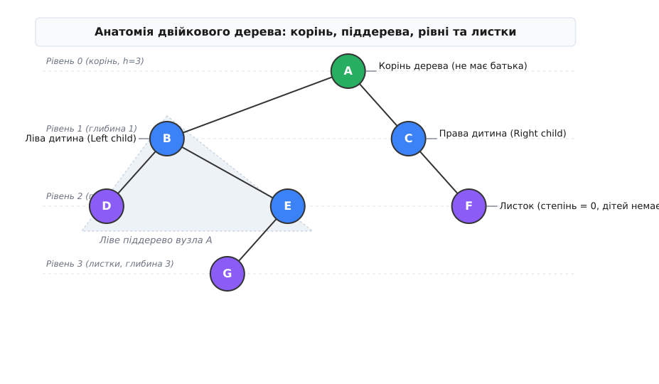
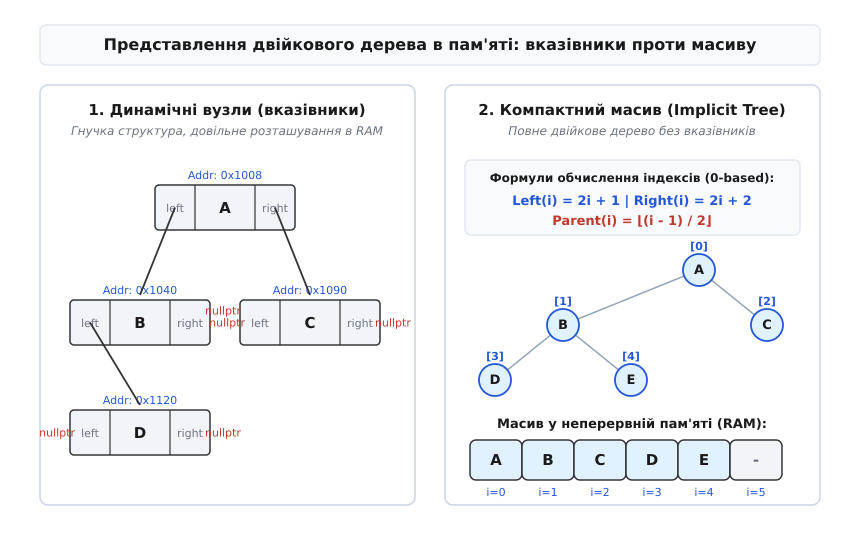
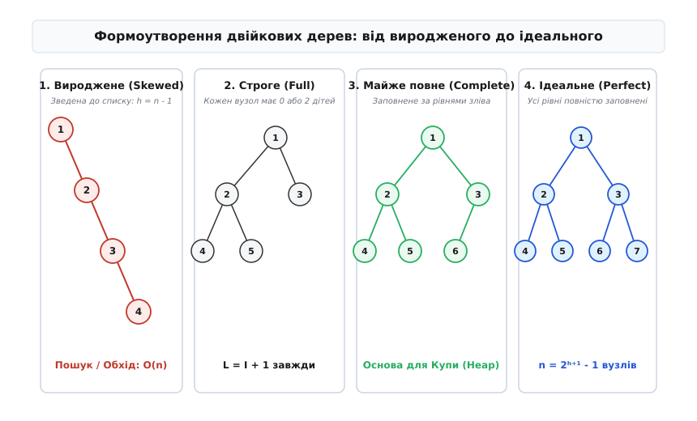
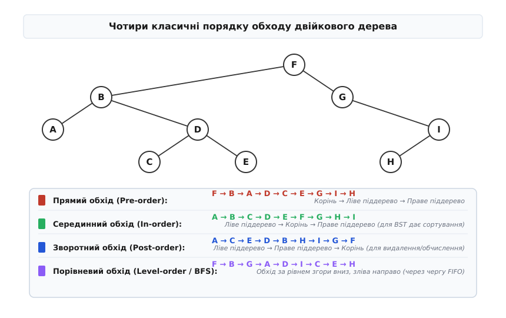

# Двійкове дерево

<preknowlist>
- [Зв'язаний список](book:algorithms/linked-list) — вказівники на наступний елемент, динамічне виділення вузлів у пам'яті.
- [Рекурсія](book:algorithms/recursion) — базовий випадок, рекурсивний крок, стек викликів і природна відповідність самоподібним структурам.
- [Стек](book:programming/stack-lifo) — порядок LIFO та його роль в ітеративному обході дерев углиб.
- [Черга](book:algorithms/queue-fifo) — порядок FIFO та його застосування в порівневому обході (BFS).
- [k-d дерево](book:algorithms/kd-tree) — розбиття k-вимірного простору двійковим деревом для просторового пошуку та `k`-NN.
- [Сортувальна станція Дейкстри](book:algorithms/shunting-yard) — алгоритм перетворення інфіксного виразу на дерево виразів та ОПЗ.
- [Числа Каталана](book:math/catalan-numbers) — комбінаторна послідовність для підрахунку кількості можливих топологій двійкових дерев.
</preknowlist>

Коли програма працює з лінійними структурами даних — масивами або зв'язаними списками, — вона завжди впирається в жорсткий компроміс між швидкістю доступу та швидкістю оновлення. У суцільному масиві можна миттєво звернутися до елемента за індексом за `O(1)` або знайти ключ за `O(log n)` за допомогою двійкового пошуку, проте вставка чи видалення в середину вимагає зсуву елементів і коштує `O(n)`. У зв'язаному списку навпаки: вставка чи видалення за відомою позицією коштує `O(1)`, але сам пошук цієї позиції вимагає послідовного перебору від початку і коштує `O(n)`. Причина цього компромісу полягає в тому, що кожен елемент лінійної структури зв'язаний лише з одним наступником, вимушуючи алгоритм рухатися вздовж єдиного виміру.

Щоб подолати це обмеження і забезпечити логарифмічну швидкість як для пошуку, так і для оновлення, необхідний перехід від одновимірного ланцюжка до двовимірного розгалуження. Якщо дозволити кожному елементу посилатися не на один, а на **два незалежні наступники**, структура отримує здатність на кожному кроці ділити простір пошуку навпіл. Така організація даних називається **двійковим деревом**.

## Анатомія та фундаментальні поняття

**Двійкове дерево** (англ. *binary tree*, від лат. *bini* — «по два» та прагерм. *\*trewam*) — це ієрархічна структура даних, яка складається з автономних елементів (вузлів) і задовольняє одну з двох умов:
1. Дерево є **порожнім** (не містить жодного вузла).
2. Дерево складається з одного виділеного **кореневого вузла** (англ. *root*) та двох впорядкованих диз'юнктних двійкових дерев, які називаються **лівим піддеревом** (англ. *left subtree*) та **правим піддеревом** (англ. *right subtree*).

Критично важливою деталлю цього означення є **впорядкованість піддерева**: ліве піддерево і праве піддерево не є еквівалентними місцями. Навіть якщо вузол має лише один нащадок, чітко розрізняється, чи є цей нащадок лівим, чи правим. Як показано в [історії виникнення двійкових дерев](book:algorithms/binary-tree/hist-binary-tree.md), саме ця риса відрізняє двійкове дерево від загального графового дерева.



*Анатомія двійкового дерева: корінь утворює вершину ієрархії, кожен вузол розгалужується на ліве та праве піддерева, а рівні визначають глибину занурення до листків.*

Для опису відносин між вузлами використовується генеалогічна та геометрична термінологія:
- **Батько (Parent):** вузол, який містить посилання на даний вузол. Корінь не має батька.
- **Дитина / Нащадок (Child):** вузол, на який вказує батько (ліва або права дитина).
- **Брати / Сестри (Siblings):** вузли, які мають одного спільного батька.
- **Листок / Зовнішній вузол (Leaf / External node):** вузол, який не має жодної дитини (обидва посилання є порожніми — `nullptr`).
- **Внутрішній вузол (Internal node):** вузол, який має принаймні одного нащадка.
- **Степінь вузла (Degree):** кількість дітей у даного вузла (для двійкового дерева степінь може дорівнювати 0, 1 або 2).
- **Шлях (Path):** послідовність суміжних ребер від предка до нащадка. Довжина шляху дорівнює кількості ребер у ньому.
- **Глибина вузла (Depth):** довжина єдиного шляху від кореня до цього вузла. Глибина кореня дорівнює 0.
- **Рівень (Level):** множина всіх вузлів, що мають однакову глибину.
- **Висота дерева (Height):** максимальна глибина серед усіх листків дерева. Висота дерева з одного кореневого вузла дорівнює 0; висота порожнього дерева за домовленістю дорівнює -1.

> 🔧 **Навіщо це.** Ієрархічна структура двійкового дерева є природним відображенням процесу прийняття бінарних рішень. Кожен внутрішній вузол працює як розвилка «так / ні» або «ліворуч / праворуч». У компіляторах абстрактне синтаксичне дерево (AST) описує обчислення виразу, де внутрішні вузли є операціями, а листки — операндами. У мережевих роутерах двійкові дерева префіксного пошуку (Trie) визначають маршрутизацію IP-пакетів за лічені наносекунди.

## Дві картини в пам'яті: Вказівники проти Масиву

Теоретична абстракція двійкового дерева може бути втілена в фізичній пам'яті комп'ютера двома принципово різними способами: через динамічні вузли на купі або через суцільний масив.

### 1. Зв'язане подання на вказівниках (Pointer-based Representation)

Найбільш гнучкий і поширений спосіб — створення кожного вузла як окремого об'єкта в динамічній пам'яті (на купі). Вузол містить корисне навантаження (значення) та два посилання на лівого і правого нащадків.

:::tabs
```c
// Вузол двійкового дерева мовою C
typedef struct Node {
    int data;
    struct Node* left;
    struct Node* right;
} Node;
```
```cpp
// Ідіоматичний вузол двійкового дерева мовою C++ (RAII)
#include <memory>

struct TreeNode {
    int data;
    std::unique_ptr<TreeNode> left;
    std::unique_ptr<TreeNode> right;

    explicit TreeNode(int val) 
        : data(val), left(nullptr), right(nullptr) {}
};
```
:::

Перевага вказівникового подання полягає у **динамічності**: дерево може довільно рости та змінювати форму без перевиділення пам'яті чи зсуву сусідніх елементів. Вставка чи відсікання піддерева зводиться до перезапису кількох вказівників за `O(1)`.

Недоліки пов'язані з накладними витратами:
- **Накладні витрати на вказівники:** На 64-бітній архітектурі кожен вказівник займає 8 байт. Для збереження 4-байтового цілого числа `int` витрачається 16 байт лише під посилання `left` та `right` (плюс вирівнювання виділювача пам'яті).
- **Фрагментація та кеш-промахи (Cache Misses):** Вузли, виділені окремими викликами `malloc` або `new`, розкидані по всій купі. Обхід такого дерева змушує процесор постійно завантажувати нові лінії кешу крізь довільний доступ до RAM, що суттєво сповільнює виконання порівняно зі скануванням суцільного масиву.

### 2. Послідовне подання в масиві (Implicit Array Representation)

Якщо двійкове дерево є **майже повним** (усі рівні заповнені, а останній рівень заповнюється строго зліва направо), його можна упакувати у звичайний одномірний масив без жодного вказівника.

Корінь розміщується в комірці з індексом `0`. Для будь-якого вузла, що лежить за індексом `i`, індекси його родичів обчислюються за допомогою прямої арифметики:

```
Left(i)   = 2i + 1
Right(i)  = 2i + 2
Parent(i) = ⌊(i - 1) / 2⌋
```



*Порівняння структур пам'яті: динамічні вузли забезпечують точкове оновлення через посилання, тоді як послідовний масив усуває оверхед на вказівники та забезпечує ідеальну локальність даних для системних структур на кшталт купи.*

Переваги послідовного подання:
- **Нульові накладні витрати пам'яті:** Немає жодного вказівника `left` чи `right`. Пам'ять витрачається виключно на корисні дані.
- **Ідеальна локальність кешу:** Елементи лежать у суцільному блоці RAM. Процесорний префетчер завантажує сусідні вузли в L1/L2 кеш заздалегідь.
- **Обчислювальні зв'язки:** Перехід до батька чи дітей здійснюється за одну бітову операцію або додавання (наприклад, `2i + 1` еквівалентно `(i << 1) | 1`).

Однак якщо дерево є розрідженим або зсунутим в один бік (наприклад, містить лише праві гілки), масив стає край неефективним: для вузла на глибині `h` знадобиться масив розміром `2ʰ⁺¹ - 1`, де більшість комірок залишаться порожніми.

> 🔧 **Навіщо це.** Послідовне подання двійкового дерева в масиві є основою для **двійкової купи (Binary Heap)** — структури даних, на якій побудовані черги з пріоритетом у ядрах операційних систем (планувальник задач Linux CFS), системних виділювачах пам'яті та алгоритмах швидкого сортування Heapsort.

## Спектр формоутворення: Від виродженого до ідеального

Швидкість роботи алгоритмів на двійкових деревах прямо залежить від їхньої геометричної форми. Залежно від того, як вузли розподілені по рівнях, виділяють п'ять класичних видів двійкових дерев:



*Геометрія двійкових дерев: форма дерева варіюється від деградованого однозв'язного списку з висотою n-1 до ідеально вирівняного дерева з логарифмічною висотою.*

1. **Вироджене або бамбукове дерево (Skewed / Degenerate tree):**
   Дерево, у якому кожен внутрішній вузол має лише одного нащадка. Вона повністю втрачає переваги розгалуження і деградує в однозв'язний список. Висота такого дерева дорівнює `h = n - 1`, а час обходу чи пошуку зростає до найгіршого значення `O(n)`.

2. **Строге або повне двійкове дерево (Strict / Full binary tree):**
   Дерево, у якому кожен вузол має **або рівно 0, або рівно 2 нащадків**. Жоден вузол не може мати одного сина. Як доведено у [математичних властивостях двійкових дерев](book:algorithms/binary-tree/math-binary-tree.md), у такому дереві кількість листків завжди строго на одиницю більша за кількість внутрішніх вузлів: `L = I + 1`.

3. **Майже повне двійкове дерево (Complete binary tree):**
   Дерево, у якому всі рівні, крім, можливо, останнього, повністю заповнені вузлами, а на останньому рівні всі вузли розміщені строго зліва направо без пропусків. Саме ця форма гарантує можливість щільного упаковування дерева в масив.

4. **Ідеальне двійкове дерево (Perfect binary tree):**
   Дерево, у якому всі внутрішні вузли мають по дві дитини, а всі листки лежать на одному й тому самому найглибшому рівні. Ідеальне дерево висоти `h` містить максимально можливу кількість вузлів:

```
n = 2⁰ + 2¹ + ... + 2ʰ = 2ʰ⁺¹ - 1
```

5. **Збалансоване за висотою дерево (Height-Balanced tree):**
   Дерево, у якому для кожного вузла висоти його лівого та правого піддереврізняться не більше ніж на одиницю (або на сталий коефіцієнт). Збалансованість гарантує, що висота дерева утримується в межах `h = O(log n)`, запобігаючи деградації в список.

## Чотири парадигми обходу (Traversals)

На відміну від лінійного масиву, де є лише один природний порядок перебору (від початку до кінця), ієрархічне дерево можна обходити багатьма різними шляхами. Обхід (англ. *traversal*) — це процес систематичного відвідування кожного вузла дерева рівно один раз.

Залежно від порядку відвідування кореня відносно його піддерев, обходи поділяють на дві великі групи: **обхід углиб (DFS)** та **обхід ушир (BFS)**.



*Чотири класичні порядки обходу: прямий (Pre-order) рухається від предка до дітей, серединний (In-order) відвідує вузли зліва направо, зворотний (Post-order) обробляє листки перед батьком, а порівневий (Level-order) сканує горизонтальні шари дерева.*

### 1. Прямий обхід (Pre-order Traversal: Корінь → Ліве → Праве)

У прямому обході спочатку обробляється сам **корінь**, після чого рекурсивно обходиться ліве піддерево, а потім — праве піддерево.

- **Порядок відвідування:** `N -> L -> R`.
- **Основне застосування:** Клонування або дублювання дерева, префіксна нотація виразів (прямий польський запис), серіалізація структури дерева у файл. При відновленні дерева з файлу прямий обхід дозволяє створювати батьківські вузли раніше за їхніх дітей.

### 2. Серединний обхід (In-order Traversal: Ліве → Корінь → Праве)

У серединному обході спочатку рекурсивно відвідується ліве піддерево, потім обробляється сам **корінь**, і лише після цього — праве піддерево.

- **Порядок відвідування:** `L -> N -> R`.
- **Основне застосування:** Для двійкових дерев пошуку (BST) серединний обхід відвідує всі ключі у **строго зростаючому порядку**. Також використовується для генерації інфіксного математичного запису зі дужками.

### 3. Зворотний обхід (Post-order Traversal: Ліве → Праве → Корінь)

У зворотному обході спочатку рекурсивно відвідуються ліве та праве піддерева, і лише після завершення обробки обох дітей обробляється сам **корінь**.

- **Порядок відвідування:** `L -> R -> N`.
- **Основне застосування:** Звільнення динамічної пам'яті дерева (в C необхідно спочатку видалити дітей, перш ніж видаляти батьківський вузол), обчислення розміру файлових каталогів, постфіксний обчислювальний запис (зворотний польський запис для стек-машин).

### 4. Порівневий обхід (Level-order Traversal / BFS)

Порівневий обхід відвідує вузли рівень за рівнем: спочатку корінь (рівень 0), потім усі вузли рівня 1 зліва направо, потім рівень 2 і так далі.

На відміну від трьох рекурсивних обходів углиб, які спираються на стек викликів, порівневий обхід є алгоритмом обходу вшир і вимагає використання **черги (FIFO)**. Повна практична реалізація всіх чотирьох обходів мовами C та C++ подана в [реалізації обходів та маніпуляцій з двійковим деревом](book:algorithms/binary-tree/proj-binary-tree.md).

```
Вхід у корінь  ──>  Покласти корінь у чергу Q
Поки черга Q не порожня:
    1. Забрати вузол N з голови черги
    2. Обробити вузол N
    3. Якщо є ліва дитина  ──> Додати N.left у хвіст Q
    4. Якщо є права дитина ──> Додати N.right у хвіст Q
```

## Дерева виразів та алгоритм сортувальної станції

Одним із найважливіших практичних застосувань двійкових дерев у системному програмуванні та розробці компіляторів є **дерева синтаксичних виразів (Expression Trees)**.

У дереві виразів:
- Кожен **внутрішній вузол** містить оператор (наприклад, `+`, `-`, `*`, `/`).
- Кожен **листок** містить операнд (константу або змінну, наприклад, `x`, `5`, `a`).

Побудова дерева виразів дозволяє усунути неоднозначність пріоритету операцій та дужок. Наприклад, вираз `(a + b) * (c - d)` перетворюється у двійкове дерево з коренем `*`, лівим піддеревом `+ (a, b)` та правим піддеревом `- (c, d)`.

Для перетворення лінійного інфіксного рядку виразу у синтаксичне дерево використовується [**алгоритм сортувальної станції Дейкстри (Shunting-yard algorithm)**](book:algorithms/shunting-yard). Алгоритм сканує токени виразу та за допомогою стека операторів будує дерево виразів знизу вгору.

Три різновиди обходу дерева виразів дають три класичні нотації запису математичних формул:
1. **In-order обхід** дає стандартну **інфіксну нотацію** зі дужками: `(a + b) * (c - d)`.
2. **Pre-order обхід** дає **префіксну нотацію (польський запис)**: `* + a b - c d`.
3. **Post-order обхід** дає **постфіксну нотацію (зворотний польський запис)**: `a b + c d - *`.

Постфіксна нотація є ідеальною для виконання на стек-машинах (наприклад, байткод JVM або стек обчислень PostScript), оскільки обчислення виразу за post-order обходом не вимагає жодних дужок і реалізується одним проходом стека за `O(n)`.

## Серіалізація та відновлення структури дерева

Збереження двійкового дерева на диску або передача його через мережу вимагає **серіалізації** — перетворення двохвимірної зв'язаної структури у лінійну послідовність байтів, з якої дерево можна пізніше однозначно **відновити (десеріалізувати)**.

Існує два основні підходи до серіалізації:

1. **Серіалізація з маркерами порожніх посилань (Null-markers):**
   Використовується прямий обхід (Pre-order). Під час відвідування кожного вузла записується його значення. Якщо дитина порожня (`nullptr`), у потік додається спеціальний символ-маркер (наприклад, `#` або `null`). 
   Для десеріалізації достатньо одного лінійного проходу за послідовністю токенів: перший символ створює корінь, після чого рекурсивно конструюються ліве та праве піддерева.

2. **Відновлення за двома обходами без маркерів:**
   Якщо маркерів порожніх посилань немає, однієї послідовності обходу недостатньо (наприклад, одна й та сама послідовність Pre-order може відповідати різним топологіям дерев). 
   Проте якщо відомі **дві послідовності обходу одночасно** — обов'язково **In-order** плюс **Pre-order** (або Post-order), — дерево відновлюється однозначно за умови, що всі значення вузлів є унікальними. 
   Перший елемент у Pre-order завжди є коренем. Знайшовши цей корінь у послідовності In-order, алгоритм ділить In-order на ліве піддерево (все, що лежить ліворуч від кореня) та праве піддерево (все, що праворуч), після чого рекурсивно відбудовує гілки.

## Обертання дерев (Rotations) та збереження балансу

При проведенні операцій додавання або видалення вузлів збалансоване дерево може втрачати свою логарифмічну висоту. Для відновлення збалансованості використовуються локальні бінарні маніпуляції вказівниками — **обертання дерев (Tree Rotations)**.

Обертання змінює висоту піддерев без порушення відносного порядку вузлів при серединному обході (In-order invariant):

- **Мале праве обертання (Right Rotation / Rotate Right):** піднімає лівого сина `L` на місце батька `P`, роблячи `P` правим сином `L`. Праве піддерево вузла `L` стає лівим піддеревом вузла `P`.
- **Мале ліве обертання (Left Rotation / Rotate Left):** піднімає правого сина `R` на місце батька `P`, роблячи `P` лівим сином `R`. Ліве піддерево вузла `R` стає правим піддеревом вузла `P`.

Обертання виконуються за сталий час `O(1)` шляхом перезапису рівно трьох вказівників. Вони є фундаментальними атомними операціями в AVL-деревах, червоно-чорних деревах та Splay-деревах.

## Прошиті двійкові дерева та розклад Ейтцингера

У низькорівневому системному програмуванні та налаштуванні високопродуктивних обчислень використовують спеціальні техніки оптимізації представлення дерев:

1. **Прошиті двійкові дерева (Threaded Binary Trees):**
   У звичайному двійковому дереві з `n` вузлів існує `n + 1` порожніх вказівників (`nullptr`). Прошивання замінює ці порожні посилання на прямого попередника чи наступника при серединному обході. Це дозволяє здійснювати ітеративний обхід дерева без використання стека чи рекурсії, прискорюючи виконання на 15–20% завдяки відсутності додаткових виділень пам'яті.

2. **Розклад Ейтцингера (Eytzinger Layout / Array Layout for Binary Search):**
   При зберіганні відсортованого масиву традиційний двійковий пошук стрибає за індексами `mid = (left + right) / 2`, що призводить до промахів у L1/L2 кеші на кожному кроці. Розклад Ейтцингера перевпорядковує елементи масиву за схемою майже повного двійкового дерева (`Left(i) = 2i + 1`). При такому розміщенні нащадки поточного вузла лежать у тій самій або суміжній лінії кешу. Використання команд SIMD та інструкцій префетчингу (`__builtin_prefetch`) робить обхід розкладу Ейтцингера у 2–3 рази швидшим за класичний двійковий пошук у масиві.

## Просторові дерева: BSP та k-d дерева у комп'ютерній графіці

Принципи двійкового розгалуження виходять далеко за межі одновимірних ключів і широко застосовуються для геопросторового аналізу та комп'ютерної графіки.

1. **Дерева двобічного розбиття простору (BSP — Binary Space Partitioning):**
   Використовуються в тривимірних графічних рушіях (історично запроваджені в гри Doom та Quake). Кожен внутрішній вузол BSP-дерева являє собою 2D/3D-гіперплощину, яка ділить простір на дві півпростори («перед площиною» та «поза площиною»). Спуск цим деревом дозволяє миттєво впорядкувати тривимірні геометрії від найвіддаленіших до найближчих відносно камери спостерігача (алгоритм художника) за `O(n)` без використання Z-буфера.

2. **[k-d дерева (k-dimensional trees)](book:algorithms/kd-tree):**
   Двійкові дерева для організації точок у `k`-вимірному просторі. На рівні 0 простір ділиться навпіл за координатою `X`, на рівні 1 — за координатою `Y`, на рівні 2 — за координатою `Z`, і далі циклічно. k-d дерева забезпечують логарифмічний пошук найближчих сусідів (Nearest Neighbor Search) у задачах комп'ютерного зору, машинного навчання (`k`-NN) та фізичних симуляціях.

## Математичні інваріанти та оцінки складності

Математична краса двійкового дерева полягає в наявності строгих співвідношень між його параметрами. Розглянемо ключові інваріанти, детальні виведення яких містить [математичний розділ](book:algorithms/binary-tree/math-binary-tree.md).

### 1. Формула кількості листків у строгому дереві

У будь-якому непорожньому строгому двійковому дереві (де кожен вузол має 0 або 2 дітей) кількість листків `L` пов'язана з кількістю внутрішніх вузлів `I` рівністю:

```
L = I + 1
```

Звідси випливає, що загальна кількість вузлів строгого дерева завжди є **непарною**: `n = I + L = 2I + 1`.

### 2. Логарифмічна межа висоти

Загальна кількість вузлів `n` у дереві висоти `h` обмежена двома крайніми геометричними формами:
- Для виродженого дерева: `n = h + 1`  ⇒  `h = n - 1` (лінійна висота);
- Для ідеального дерева: `n = 2ʰ⁺¹ - 1`  ⇒  `h = ⌊log₂ n⌋` (логарифмічна висота).

Отже, висота будь-якого двійкового дерева з `n` вузлами задовольняє нерівність:

```
⌊log₂ n⌋  ≤  h  ≤  n - 1
```

Саме ця нерівність пояснює прагнення алгоритмів підтримувати дерево у збалансованому стані: якщо висота `h = O(log n)`, то всі базові операції спуску від кореня до листка виконуються за логарифмічний час.

### 3. Сводна таблиця складності операцій над двійковим деревом

| Операція | Збалансоване дерево (Best / Average) | Вироджене дерево (Worst case) | Просторова складність (Auxiliary Space) |
| :--- | :--- | :--- | :--- |
| **Пошук елемента** | `O(log n)` | `O(n)` | `O(h)` рекурсивний стек / `O(1)` ітеративний |
| **Вставка вузла** | `O(log n)` | `O(n)` | `O(h)` |
| **Видалення вузла** | `O(log n)` | `O(n)` | `O(h)` |
| **Обхід (DFS: Pre/In/Post)** | `O(n)` | `O(n)` | `O(h)` — стек рекурсії (`O(log n)` або `O(n)`) |
| **Обхід (BFS: Level-order)** | `O(n)` | `O(n)` | `O(w)` — черга, де `w` — макс. ширина дерева (`O(n)`) |

## Похідні типи дерев та їхня роль у комп'ютерних науках

Само по собі базове двійкове дерево є лише «скелетом» або топологічною формою. Надаючи вузлам додаткові інваріанти чи властивості упорядкування, комп'ютерна наука створює цілу серію фундаментальних структур даних:

1. **Двійкове дерево пошуку (BST — Binary Search Tree):**
   Накладає інваріант впорядкування: для кожного вузла всі ключі в його лівому піддереві менші за ключ вузла, а в правому піддереві — більші. Завдяки цьому пошук ключа зводиться до спуску однією гілкою за `O(h)`.

2. **Самобалансовані дерева пошуку (AVL, Red-Black Trees):**
   Автоматично підтримують висоту `h = O(log n)` під час операцій вставки та видалення за допомогою локальних операцій перекомпонування вказівників (ротацій). Використовуються в системних асоціативних контейнерах (`std::map`, `std::set`, двійкові індекси СУБД).

3. **Двійкова купа (Binary Heap):**
   Повне двійкове дерево, яке задовольняє властивість купи: ключ у кожному батьківському вузлі є меншим (або більшим) за ключі його дітей. Дозволяє знаходити мінімум/максимум за `O(1)` і вилучати його за `O(log n)`.

4. **Дерево Гаффмана (Huffman Tree):**
   Використовується в алгоритмах стиснення даних. Кодує частоти символів у вигляді префіксного двійкового дерева, де частіші символи отримують коротші шляхи від кореня (коротші бітові коди).

5. **Абстрактне синтаксичне дерево (AST — Abstract Syntax Tree):**
   Використовується в компіляторах та інтерпретаторах для представлення структури сирцевого коду програми. Оператори утворюють внутрішні вузли, а змінні — листки.

## Персистентні двійкові дерева та функціональні дані

У сучасних розподілених системах та функціональних мовах програмування (Haskell, Clojure, Scala, Erlang) широко застосовуються **персистентні двійкові дерева (Persistent Binary Trees)**.

Персистентна структура даних зберігає доступ до всіх своїх попередніх версій при внесенні змін. Замість мутації існуючих вказівників вузла за місцем (англ. *in-place mutation*), алгоритм створює новий корінь і копіює лише вузли вздовж шляху модифікації — це називається **копіюванням шляху (Path Copying)**.

Оскільки всі піддерева, які не зазнали змін, залишаються незмінними, нова версія дерева перевикористовує (ділить) незмінені піддерева попередньої версії.
- Часова складність вставки чи оновлення вузла у збалансованому персистентному дереві дорівнює `O(log n)`.
- Просторова складність створення нової версії становить лише `O(log n)` додаткових нових вузлів.

Персистентні двійкові дерева лежать в основі миттєвих знімків баз даних (Database Snapshots), систем керування версіями (Git tree objects) та структур даних `persistent vector / map` у мові Clojure.

## Співвідношення з іншими структурами даних

Щоб чітко обрати двійкове дерево серед інших архітектурних альтернатив, наведемо порівняльну характеристику:

| Структура даних | Швидкість пошуку | Швидкість оновлення | Порядок ключів | Кеш-локальність |
| :--- | :--- | :--- | :--- | :--- |
| **Відсортований масив** | `O(log n)` | `O(n)` | Строгий | Ідеальна |
| **Зв'язаний список** | `O(n)` | `O(1)` (позиція відома) | Довільний | Низька |
| **Збалансоване BST** | `O(log n)` | `O(log n)` | Строгий | Середня / Низька |
| **Хеш-таблиця** | `O(1)` average | `O(1)` average | Хаотичний | Середня |
| **B-дерево (B-Tree)** | `O(log n)` | `O(log n)` | Строгий | Висока (блокова RAM/Disk) |

## Системні пастки та підводні камені

Під час роботи з двійковими деревами в реальних програмах розробники найчастіше зіштовхуються з трьома критичними проблемами:

### 1. Переповнення стеку викликів (Stack Overflow)

Рекурсивний обхід дерева спирається на системний стек викликів. Для збалансованого дерева з мільйоном вузлів глибина рекурсії становить лише `h = log₂(10⁶) ≈ 20` кадрів стеку, що цілком безпечно. 

Однак якщо дерево деградує у вироджений список із 100 000 вузлів, рекурсивна функція створить 100 000 послідовних кадрів стеку. Це неминуче призведе до аварійного завершення програми через **Stack Overflow**.

*Рішення:* Для потенційно глибоких чи незабалансованих дерев слід використовувати **ітеративні обходи** з явно виділеним стеком у купі (Heap RAM) або **обхід Морріса (Morris Traversal)**, який використовує порожні вказівники `right` у листках (прошивання дерева) для повернення вгору без використання додаткової пам'яті (`O(1)` додаткової пам'яті).

### 2. Руйнування локальності кешу (Cache Invalidation)

У вказівниковій реалізації кожен вузол купується в динамічній пам'яті окремо. Під час сканування мільйона вузлів процесор змушений здійснювати випадкові стрибки по всій оперативній пам'яті. Вимоги до пропускної здатності RAM стають вузьким місцем (Memory Bottleneck).

*Рішення:* Використання **арена-виділювачів (Arena Allocator / Memory Pool)**, які виділяють пам'ять під вузли дерева великими суцільними блоками (пакетами). Це гарантує, що суміжні вузли сидітимуть поруч у фізичній пам'яті, відновлюючи ефективність L1/L2 кешу процесора.

### 3. Витоки пам'яті та циклічні посилання

В мовах без автоматичного збирача сміття (C) некоректний порядок звільнення вузлів спричиняє витоки пам'яті. Звільнення батьківського вузла `free(root)` до видалення його дітей призводить до втрати посилань на піддерева. У C++ використання `std::shared_ptr` замість `std::unique_ptr` може створити циклічні посилання (якщо дитина має посилання на батька), унаслідок чого лічильник посилань ніколи не впаде до нуля.

*Рішення:* Використовувати **зворотний обхід (Post-order)** для послідовного видалення дітей перед батьком або застосовувати монопольне володіння `std::unique_ptr` у C++.
