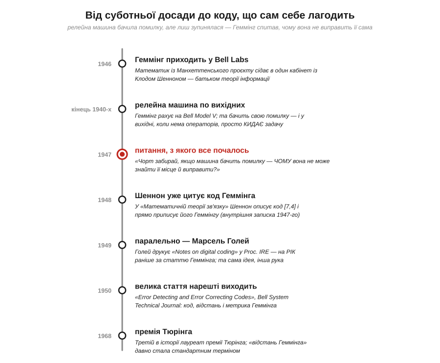
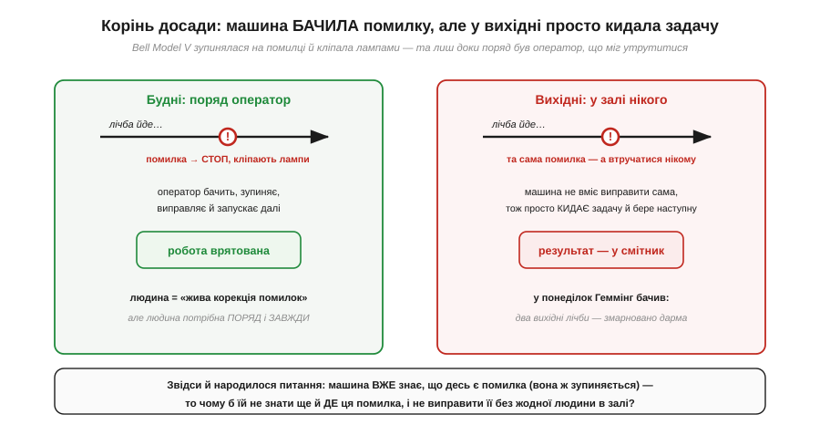
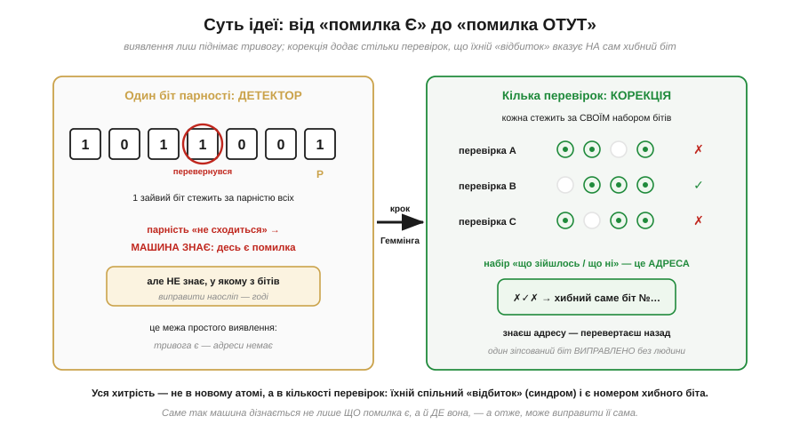
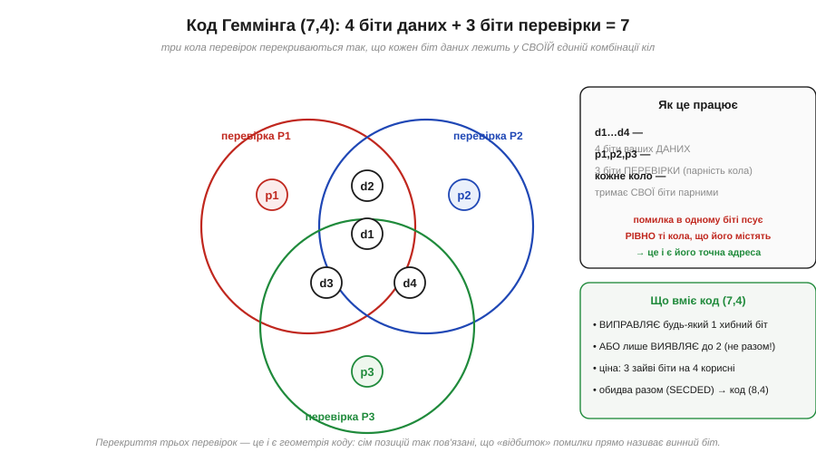

# 📜 Річард Геммінг і питання, з якого почалися коди, що самі себе лагодять: «якщо машина бачить помилку — чому не виправить?»

> Уся цифрова техніка тримається на одній зручній обіцянці: що [два чіткі рівні напруги](topic:electronics/logic-levels-as-ranges) надійніші за плавний аналог, що з них складаються [вентилі](topic:electronics/basic-gates) і [пам'ять](topic:programming/memory-as-array), а [процесор](topic:programming/what-is-processor) крок за кроком чесно виконує програму. І в основі всього лежить тихе припущення: що біт, записаний як «1», прочитається назад теж як «1». А що, коли ні? Що, коли посеред обчислення один-єдиний біт нишком перевернеться — від наведеної завади, від космічної частинки, від утомленої комірки пам'яті? Машина, яка цього не помічає, спокійно видасть неправильну відповідь із виглядом цілковитої певності — і це найгірший різновид помилки, бо їй неможливо не повірити. Цю незатишну прогалину вперше перетворив на інженерну задачу — і блискуче розв'язав — американський математик **Річард Геммінг** (*Richard Wesley Hamming*, 1915–1998). Його шлях почався не з теореми, а з буденної досади: машина бачила власну помилку, але нічого з нею не робила. І Геммінг поставив питання, яке здавалося майже зухвалим у своїй простоті: якщо машина вже знає, що десь схибила, — **чому б їй не знати ще й де, і не виправити це самій?**

Почнімо з тієї самої досади, бо вона — справжня матір усієї історії, і саме з неї природно виростає все подальше. Цифрова техніка надійна тому, що відрізнити [«низько» від «високо»](topic:electronics/logic-levels-as-ranges) легше, ніж виміряти точну напругу, і дрібний шум не збиває з пантелику. Але «легше» — не означає «завжди». Зрідка завада таки буває достатньою, щоб перекинути рівень через поріг, і тоді «0» обертається на «1» чи навпаки. На одному біті це майже неймовірно; та коли бітів мільйони, а машина гуде годинами, рідкісне стає неминучим. Геммінг зіткнувся з цим у найдошкульнішій формі — і не змирився.

*Як питання Геммінга визрівало й здійснювалося. Червоний вузол — 1947 рік, момент самого питання: релейна машина в Bell Labs бачила свою помилку, зупинялася й кліпала лампами, та у вихідні, коли поряд не було операторів, просто кидала зіпсовану задачу й бралася за наступну. Геммінг, який рахував саме по вихідних, утомився марнувати цілі прогони — і спитав, чому машина не може виправити помилку сама. Звідти простягнулася нитка: 1948-го Шеннон уже цитує його код у своїй знаменитій статті, 1949-го Марсель Голей незалежно друкує споріднену ідею, а 1950-го виходить велика стаття Геммінга, що дала цілій галузі і самі коди, і мову для них — «відстань Геммінга».*

---

## Машина, що бачила свою помилку — і нічого не робила

Щоб відчути, звідки взялося питання Геммінга, треба уявити машину, на якій він працював, і дуже конкретний різновид безсилля, що та машина в ньому викликала. Наприкінці 1940-х Геммінг служив математиком у **Bell Telephone Laboratories** — легендарних дослідницьких лабораторіях телефонної компанії, де тоді ж винаходили транзистор і де народжувалася теорія інформації. Лічбу він вів на електромеханічному релейному комп'ютері **Bell Model V** — велетенській машині, що клацала сотнями реле й мала такт у цілі секунди, нескінченність за нинішніми мірками. Важлива деталь: ця машина вже вміла **виявляти** власні похибки. Дані вона тримала в надлишковому вигляді, і коли арифметика «не сходилася», машина бачила, що схибила.

Здавалося б, чудово — машина чесна, вона зізнається в помилці. Та диявол ховався в тому, **що саме** вона після цього робила, і саме тут визрівала майбутня ідея. У будні, коли в залі чергували оператори, виявлена помилка означала зупинку: машина спинялася, кліпала сигнальними лампами, людина підходила, розбиралася й запускала лічбу далі. Прикро, але терпимо — людина працювала «живою корекцією помилок». А от **у вихідні**, коли в залі не було ні душі, та сама машина, наткнувшись на помилку, не мала кому поскаржитися — тож просто **кидала** зіпсовану задачу й переходила до наступної в черзі. У понеділок Геммінг повертався й виявляв, що його розрахунок, поставлений на цілі вихідні, обвалився десь на півдорозі через один-єдиний збій — і два дні машинного часу пішли намарне.

*Та сама виявлена помилка — і дві геть різні долі. Ліворуч, у будні: машина зупиняється, оператор бачить тривогу, виправляє й веде лічбу далі — робота врятована, але ціною людини, яка мусить бути поряд щомиті. Праворуч, у вихідні: у залі порожньо, виправляти нікому, тож машина просто викидає зіпсовану задачу й бере наступну, а двозмінний розрахунок іде в смітник. Саме цей контраст і загострив питання: машина ж уже **знає**, що десь є помилка (вона ж бо зупиняється) — то чому б їй не знати ще й **де** ця помилка й не залатати її без жодної людини в залі?*

Двічі поспіль діставши в понеділок розбитий результат, Геммінг розсердився по-справжньому — і ця злість виявилася продуктивною. Свою реакцію він згодом переказував майже дослівно, і ці слова стали хрестоматійними: «Чорт забирай, якщо машина може **виявити** помилку, то чому вона не може **визначити її місце** і **виправити**?» («*Damn it, if the machine can detect an error, why can't it locate the position of the error and correct it?*»). У цьому пориві роздратування і ховалося зерно всієї теорії кодів, що виправляють помилки. Бо досі техніка вміла лише **виявляти** збій — підняти тривогу, сказати «щось не так». Геммінг же поставив якісно вищу мету: навчити машину не просто **помічати** помилку, а **самій її лагодити** — без людини, без зупинки, без викинутих вихідних.

> 🔧 **Навіщо це.** Та сама розвилка «виявити проти виправити» — не музейна історія, а щоденний вибір розробника, що боротиметься з [перевернутими бітами](topic:algorithms/bit-flips). Коли давач шле вам дані по зашумленому дроту, коли прошивка лежить у флеші, що з роками зношується, коли пакет летить радіоканалом крізь завади — щоразу ви вирішуєте, чого досить: лише **помітити** зіпсований байт і попросити переслати його ще раз, чи **відновити** його на місці, коли перепитати нема в кого (приймач у космосі, дані вже на диску, відповіді чекати ніколи). Перший шлях дешевший, другий — могутніший. Геммінг першим пройшов другий шлях до кінця; усе подальше — про те, як саме він це зробив.

---

## Стрибок думки: від «помилка є» до «помилка ось тут»

Чому ж питання Геммінга було не дрібним удосконаленням, а саме **стрибком**? Щоб це відчути, варто спершу зрозуміти, як узагалі машина помічає збій — і де лежить стіна, об яку впирається просте виявлення. Найпростіший спосіб упіймати перевернутий біт відомий давно й називається **бітом парності** (*parity bit*). Ідея чарівно проста: до групи бітів додають один зайвий — так, щоб **загальна кількість одиниць** завжди була, скажімо, парною. Цей зайвий біт — не що інше, як [XOR](topic:electronics/xor-comparison) усіх бітів групи, та сама операція «додавання за модулем 2». Якщо тепер один біт перевернеться, кількість одиниць стане непарною — і приймач одразу бачить: щось зіпсувалося.

Та ось де парність упирається в стіну, і ця стіна — рівно те, що дратувало Геммінга. Біт парності чесно кричить «помилка!» — але **не каже, котрий саме біт винен**. Він підняв тривогу, проте не назвав адреси. А без адреси виправити нічого: перевертати наосліп один із восьми бітів — це з імовірністю сім до восьми зробити тільки гірше. Більше того, якщо перевернеться не один біт, а **два**, то парність знову «зійдеться», і простий детектор пропустить помилку повз себе, нічого не помітивши. Виявлення вміє сказати, **що** біда сталася, але мовчить про те, **де** вона, — і саме ця німота й була тим безсиллям, на яке Геммінг наткнувся в понеділок уранці.

*Дві сходинки надійності. Ліворуч — один біт парності: він стежить за парністю всіх бітів одразу, тож переверни будь-який — і парність «не сходиться». Машина **знає, що** помилка є, але **не знає, у якому** з бітів вона сидить, — виправити наосліп годі. Праворуч — крок Геммінга: замість однієї перевірки беремо **кілька**, і кожна стежить за **своїм** набором бітів, що частково перекриваються. Тепер набір «ця перевірка зійшлася, а ця ні» — це вже не просто тривога, а **адреса**: він однозначно вказує на винний біт. Знаєш адресу — перевертаєш цей біт назад, і помилки наче й не було. Уся хитрість — не в новому атомі (це той самий [XOR](topic:electronics/xor-comparison)), а в **кількості** перевірок: їхній спільний «відбиток» і є номером хибного біта.*

Геммінгове прозріння, коли його розкласти на пальцях, по-фейнманівському просте — і саме в простоті його краса. Якщо одна перевірка дає лише «так/ні» (тривога є чи нема), то **кілька** перевірок дають уже цілий візерунок «так-ні-так» — а візерунок несе незрівнянно більше відомостей. Влаштуймо перевірки так, щоб кожен біт даних потрапляв у **свою, неповторну** комбінацію перевірок. Тоді, коли якийсь біт перевернеться, він зіпсує **рівно ті** перевірки, до яких належить, — і саме ця комбінація «зіпсованих» перевірок працюватиме як **адреса**, що однозначно вказує на винуватця. Інженери звуть цей «відбиток помилки» **синдромом** (*syndrome*) — за аналогією з медициною, де набір симптомів указує на конкретну хворобу. Прочитав синдром — дізнався адресу; знаєш адресу — перевернув біт назад. Машина не лише помітила збій, а й **вилікувала** його сама. Рівно те, чого Геммінг вимагав у понеділок уранці.

---

## Код Геммінга (7,4): сім бітів, що стережуть себе самі

Від ідеї «кілька перевірок дають адресу» до конкретного робочого коду — ще один крок, і Геммінг зробив його напрочуд ощадливо. Найвідоміше його дітище — **код Геммінга (7,4)** (*Hamming (7,4) code*). Назва читається прямо: на кожні **4** біти корисних даних додають **3** біти перевірки, і разом виходить кодове слово з **7** бітів. Ці три перевірки — не абищо, а три біти парності, кожен зі своєю, ретельно дібраною зоною відповідальності: кожен стежить за своєю частиною даних, і зони ці перекриваються так хитро, що кожен біт даних опиняється під наглядом **своєї єдиної** трійки-комбінації перевірок.

*Геометрія коду (7,4) у трьох колах, що перекриваються. Кожне коло — одна перевірка парності (P1, P2, P3), яка тримає парною суму бітів усередині себе. Чотири біти даних (d1…d4) лягають у зони перетину, а три біти перевірки (p1, p2, p3) — кожен у «своє» одиничне коло. Хитрість у тому, що **кожна з семи позицій належить своїй неповторній комбінації кіл**. Тож коли один біт перевертається, він псує рівно ті перевірки, у чиї кола входить, — і ця трійка «зіпсованих/цілих» кіл прямо називає його номер. Звідси й сила коду: знаючи адресу, він **виправляє** будь-яку одиничну помилку — і платить за це лише трьома зайвими бітами на чотири корисні. А щоб той самий код ще й **виявляв** будь-яку подвійну помилку (не виправляючи її), до нього додають один загальний біт парності — виходить розширений код (8,4), про що йдеться далі.*

Придивімося, що цей маленький код уміє — і де проходить чесна межа його сили. По-перше, він **виправляє будь-яку одиничну помилку**: якщо в семи бітах перевернувся один, синдром одразу назве його позицію, і приймач полагодить слово сам, ні в кого нічого не перепитуючи. Це його головна робота, і виконує він її бездоганно.

А ось далі треба бути точним, бо тут легко сказати зайве. Сам код (7,4) **не вміє водночас** і виправляти одну помилку, і ловити дві — і причина суто геометрична. Найменша [відстань Геммінга](topic:communications/hamming-distance) між його кодовими словами дорівнює **трьом**, а цього вистачає рівно на одне з двох: **або** виправляти будь-який одиничний збій, **або** (в іншому режимі, не виправляючи нічого) лише виявляти до двох. Обидва разом — ні. У режимі виправлення подвійна помилка навіть не підніме тривоги: синдром покаже на якийсь третій, ні в чому не винний біт, і код слухняно «виправить» слово в ще більш хибне, так і не здогадавшись, що збоїв було два.

Щоб дістати обидві властивості нараз, до слова додають **ще один** біт — загальну парність усіх семи. Тоді код стає **розширеним кодом Геммінга (8,4)**, його найменша відстань зростає з трьох до **чотирьох**, і аж тепер він справді робить обидві справи заразом: **виправляє** будь-яку одиничну помилку й водночас **виявляє** (хоч і не виправляє) будь-яку подвійну. Саме цю пару властивостей звуть **SECDED** (*Single Error Correction, Double Error Detection* — «виправлення однієї, виявлення двох»), і саме розширений код, а не голий (7,4), десятиліттями стереже пам'ять комп'ютерів. Ціна ж самого (7,4) скромна — лише три зайві біти на кожні чотири корисні; за цю невелику надлишковість дані дістають здатність самозцілюватися від одиничного збою.

> 🔧 **Навіщо це.** Код, що дебютував у Геммінга 1950 року, дотепер живе у вашому залізі майже без змін — і має прямих нащадків. Серверна оперативна пам'ять із позначкою [«ECC»](topic:communications/ecc-ram-flash) (*Error-Correcting Code*) — це по суті той самий код Геммінга в його розширеній, SECDED-формі: зазвичай до кожних 64 бітів даних доточено 8 перевірочних (сім Геммінгових плюс один загальної парності), і контролер пам'яті на льоту виправляє поодинокий збій від космічної частинки, а подвійний принаймні помічає — навіть не турбуючи процесор. Спалах радіації перевернув біт у RAM сервера — а машина й не здригнулася: полагодила сама й рахує далі. Це пряме здійснення тієї самої мрії, що народилася в понеділок уранці перед розбитим розрахунком: машина, яка не зупиняється на помилці, а тихо лікує її на ходу.

---

## Чому стаття вийшла аж 1950-го: тінь патенту й відбиток Шеннона

Тут історія робить несподіваний поворот, який варто проговорити, бо він багато каже про те, як насправді рухається техніка. Свій код Геммінг придумав **1947 року** й одразу описав у внутрішній записці Bell Labs. А ось велика, ретельна стаття **«Error Detecting and Error Correcting Codes»** вийшла у **Bell System Technical Journal** аж **1950 року** — через цілих **три роки**. Звідки розрив? Причина, як часто буває з корпоративною наукою, виявилася не науковою, а **патентною**: компанія вбачала в коді комерційну цінність і не поспішала публікувати, поки юристи оформляли патентний захист. Так гарну ідею на роки замкнули в шухляді не через брак готовності, а через міркування власності. (Винахід зрештою таки запатентували — патент на «систему виявлення й виправлення помилок» носить ім'я Геммінга; точні деталі оформлення тут наводити не будемо — **(перевірити)**.)

Та поки стаття чекала на дозвіл вийти, ідея Геммінга вже почала жити власним життям — і ось тут історія перестає бути історією однієї людини. У сусідньому кабінеті тих самих Bell Labs працював **Клод Шеннон** (*Claude Shannon*, 1916–2001) — батько теорії інформації, з яким Геммінг, за свідченнями, навіть **ділив робочий кабінет**. Саме 1948 року Шеннон друкує свою епохальну працю «Математична теорія зв'язку» («*A Mathematical Theory of Communication*»), що заклала всю сучасну науку про передачу даних. І в цій праці він описує код Геммінга [7,4] як приклад — **прямо приписуючи** його Геммінгу й посилаючись на ту саму внутрішню записку 1947 року. Виходить дивовижна річ: код Геммінга з'явився у великому світовому друці **раніше** в чужій статті, ніж у власній статті автора, — і вже з належним посиланням на справжнього винахідника. Рідкісний випадок, коли пріоритет зафіксував не сам автор, а його видатний колега.

*Точна, по ролях, атрибуція. **Клод Шеннон** дав **теорію**: 1948 року він довів, що надійна передача крізь шум узагалі можлива, — але його доведення неконструктивне, воно лише обіцяє, що код існує, не кажучи, який саме; і саме він першим оприлюднив код Геммінга, чесно віддавши авторство колезі. **Річард Геммінг** дав **конструкцію**: готовий код, що справді виправляє біт, плюс відстань і метрику, названі його іменем. **Марсель Голей** прийшов до спорідненої ідеї **паралельно**: його коротка нотатка вийшла друком на рік раніше за статтю Геммінга. Код по праву носить ім'я Геммінга — та за цим іменем стоять, як це майже завжди в техніці, кілька різних людей із різними, однаково потрібними внесками, що зійшлися в той самий короткий час.*

Зв'язок із Шенноном — не просто кумедний збіг сусідства, а ключ до того, **чому** код Геммінга такий важливий, і його варто проговорити окремо. Шеннон 1948 року довів приголомшливу теорему: крізь зашумлений канал **можна** передавати дані як завгодно надійно, аби лиш не перевищувати певної граничної швидкості. Та його доведення було **неконструктивним** — воно лише обіцяло, що добрі коди **існують**, але не показувало, **як** їх побудувати. Шеннон, образно кажучи, довів, що скарб закопано, але не дав карти. А Геммінг тим часом тримав у руках **реальну лопату**: конкретний, простий, працюючий код, який і справді виправляв помилки. Тому ці двоє так чудово доповнюють одне одного: Шеннон окреслив **межу можливого**, а Геммінг зробив **перший практичний крок** до неї. Теорія сказала «так, це можливо»; інженерія відповіла «ось, дивіться, працює».

---

## Марсель Голей: та сама ідея іншою рукою — і чесність про першість

Лишився ще один штрих, без якого розповідь була б неповною й трохи нечесною, — бо це той самий випадок, де так легко скотитися в зручний міф про «одного винахідника». Поряд із Геммінгом стоїть постать, яку популярні перекази часто оминають: швейцарсько-американський інженер і фізик **Марсель Голей** (*Marcel J. E. Golay*, 1902–1989). 1949 року — тобто на **рік раніше** за велику статтю Геммінга — Голей опублікував у Proceedings of the IRE коротку, на пів сторінки, але напрочуд щільну нотатку «Notes on digital coding». У ній він незалежно виклав ту саму ідею кодів, що виправляють помилки, а заразом узагальнив її далі — до родини кодів, які тепер звуть **кодами Голея** (*Golay codes*) і які згодом стануть у пригоді навіть у далекому космічному зв'язку.

Як же бути з першістю — і тут потрібна та сама чесність, до якої зобов'язує жанр? Чесно — визнати: за **датою друку** Голей вийшов раніше. Це не зменшує Геммінга ні на крихту, і ось чому. По-перше, Геммінг придумав і записав свій код ще 1947-го, тож **зробив** він це раніше за публікацію Голея — затримку спричинив патент, а не брак готовності. По-друге, внутрішня логіка тут важливіша за календар: Геммінг дав не лише код, а й цілий **понятійний апарат** — насамперед «відстань Геммінга», міру несхожості двох кодових слів, що стала наріжним каменем усієї теорії й донині лежить у її основі. А по-третє — і це, мабуть, головне — два незалежні розуми, що майже водночас приходять до однієї ідеї, не сваряться за лаври, а **підтверджують** одне одного: коли думка дозріла, її підхоплює не одна голова. Тож історично точна картина — не «Геммінг винайшов корекцію помилок», а «Геммінг і Голей незалежно дійшли спорідненої ідеї майже водночас, а Шеннон у ті ж роки підвів під неї теоретичну основу». Код носить ім'я Геммінга по праву — та поряд із цим іменем чесно тримати в пам'яті ще два.

---

## Чим скінчилося — і що з цього взяти

Зведімо нитки докупи. Питання, кинуте в досаді перед розбитим розрахунком, обернулося на цілу наукову галузь. Сам Геммінг 1968 року дістав **премію Тюрінга** — найвищу нагороду в інформатиці, ставши лише її **третім** в історії лауреатом; його ім'я навіки вкарбувалося в технічну мову — «код Геммінга», «відстань Геммінга», «межа Геммінга», «вага Геммінга» (*Hamming code/distance/bound/weight*). Він прожив довге плідне життя, багато викладав, лишив відому й донині лекцію «You and Your Research» про те, як робити роботу, що варта зусиль, — і пішов 1998 року. А посіяна ним ідея за десятиліття розрослася так, що сьогодні непомітно береже **кожен** байт, який проходить крізь нашу техніку.

Та головний слід цієї історії — **подвійний**, і обидві його половини прямо живлять усе, що чекає на нас далі. Перший слід — технічний, і він задає тон усій боротьбі з [перевернутими бітами](topic:algorithms/bit-flips): надлишковість — це не марнотратство, а **інженерна валюта**, якою ми **купуємо** надійність. Додаючи до даних із розумом дібрані зайві біти, ми дістаємо здатність спершу **помічати** збої, а тоді й **самостійно їх лагодити** — і це пряме продовження логіки самої цифри: вона тому й перемогла аналог, що її легше **захистити** від спотворення. Геммінг лише довів цю думку до кінця — від «[два рівні стійкіші за плавний сигнал](topic:electronics/logic-levels-as-ranges)» до «дані можна зробити такими, що самі себе виправляють».

Другий слід — той, що повторюється в історії техніки раз по раз, від Беббіджа з Лавлейс до засновників Xilinx: велике майже завжди **колективне**. За охайною назвою «код Геммінга» стоїть не самотній геній, а **троє** людей із різними, однаково необхідними ролями: Шеннон дав **теорію** (довів, що так можна), Геммінг дав **конструкцію** (показав, як саме, і викував мову), а Голей **незалежно й трохи раніше** надрукував споріднену ідею. Це варто тримати в голові щоразу, коли підручник зручно зводить винахід до одного імені й однієї дати: за кожним «хтось придумав» зазвичай ховається кілька різних людей, які майже водночас зробили кілька різних, але неподільних справ.

А за самим питанням «чому б машині не виправити власну помилку» та людьми, які перетворили його на науку, починається вже строга інженерія: **звідки взагалі беруться [перевернуті біти](topic:algorithms/bit-flips), наскільки часто це стається й коли з цим справді треба рахуватися.**
