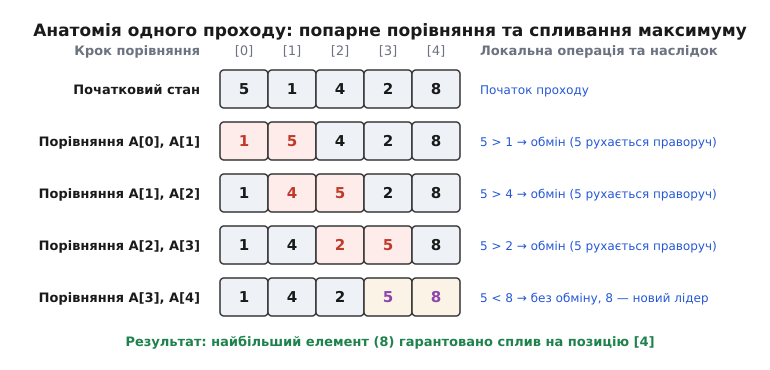
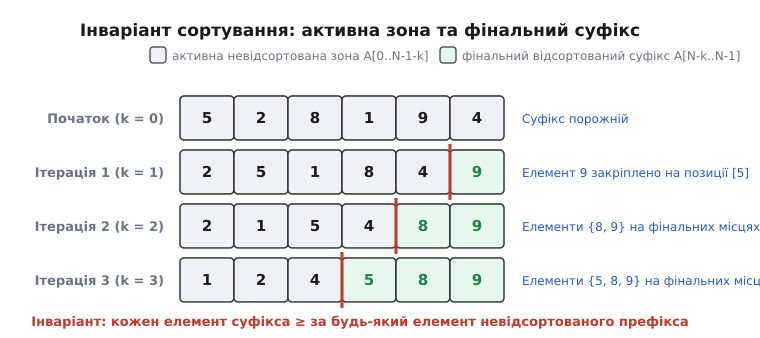
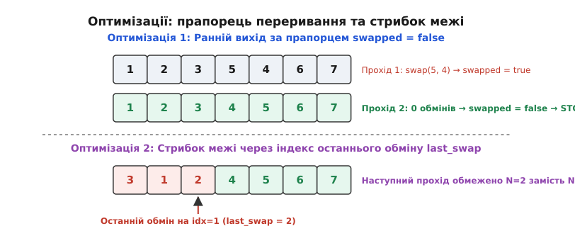
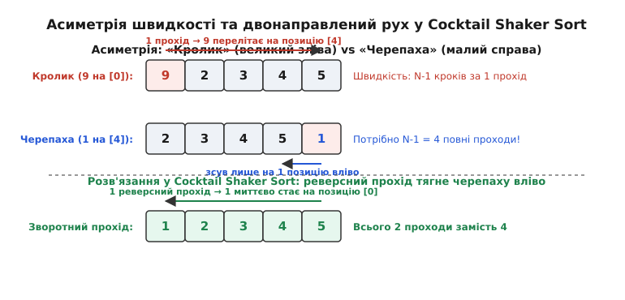

# Сортування бульбашкою (Bubble Sort)

<preknowlist>
- [Масив і вектор](topic:algorithms/array) — послідовне розміщення даних у пам'яті та адресація за індексами.
- [Асимптотичний аналіз](topic:algorithms/asymptotic-complexity) — O-нотація, аналіз найкращого, середнього та найгіршого випадків.
- [Стійкість сортування](topic:algorithms/sorting-stability) — збереження відносного порядку елементів із однаковими ключами.
- [Сортування вставками (Insertion Sort)](topic:algorithms/insertion-sort) — локальне впорядкування через зсув елементів.
- [Нижня межа сортування порівняннями](topic:algorithms/comparison-sort-lower-bound) — інформаційно-теоретична межа Omega(N log N).
</preknowlist>

Коли процесор отримує неструктурований масив із `N` чисел у послідовних комірках оперативної пам'яті, найпростішою апаратною дією над цими даними є послідовне завантаження двох сусідніх комірок у регістри, порівняння їхніх значень і зворотний запис у пам'ять у разі порушення порядку. Якщо масив містить хоча б одну пару сусідніх елементів, де лівий елемент більший за правий, цей масив не є впорядкованим. Сортування бульбашкою (Bubble Sort) будує глобальний порядок усього масиву виключно на основі цієї елементарної локальної перевірки: воно багаторазово сканує послідовність зліва направо, обмінюючи суміжні невпорядковані пари, внаслідок чого найбільші елементи неперервно витісняються в кінець масиву подібно до спливання бульбашок газу у рідині.

## 1. Першопричина: локальне впорядкування суміжних пар як найпростіша дія над пам'яттю

Упорядкування довільного масиву даних у пам'яті комп'ютера спирається на базову математичну властивість транзитивності відношення лінійного порядку. Якщо для кожного допустимого індексу `j` від `0` до `N - 2` виконується елементарна локальна умова `A[j] ≤ A[j + 1]`, то в силу транзитивності автоматично виконується глобальна нерівність `A[0] ≤ A[1] ≤ A[2] ≤ ... ≤ A[N - 1]`. Це означає, що весь масив гарантовано стає впорядкованим без необхідності одночасного аналізу всіх елементів.

Зворотне твердження є настільки ж фундаментальним: якщо масив не є відсортованим, у ньому неминуче знайдеться хоча б одна суміжна пара `(A[j], A[j + 1])`, для якої локальний порядок порушено, тобто `A[j] > A[j + 1]`.

З погляду апаратної архітектури комп'ютера, послідовна обробка сусідніх комірок є найбільш дружньою до апаратного конвеєра та ієрархії пам'яті. Сучасні процесори зчитують дані з оперативної пам'яті блоками фіксованого розміру — кеш-лініями (зазвичай 64 байти). Коли алгоритм сканує масив лінійно від початку до кінця, один рядок кешу вміщує від 8 до 16 суміжних 32- або 64-розрядних чисел. Апаратний блок попередньої вибірки (Hardware Prefetcher) процесора миттєво розпізнає лінійний шаблон доступу і завчасно підвантажує наступні кеш-лінії з повільної RAM у надшвидкий L1-кеш інструкцій та даних.

Ця фізична реальність породжує найпростіший механічний алгоритм впорядкування:
1. Почати сканування з нульового індексу масиву.
2. Завантажити два сусідні значення `A[j]` та `A[j + 1]` у регістри арифметико-логічного пристрою (ALU).
3. Виконати інструкцію порівняння. Якщо `A[j] > A[j + 1]`, поміняти значення місцями і записати їх назад у пам'ять.
4. Якщо `A[j] ≤ A[j + 1]`, залишити комірки без змін.
5. Зсунути вікно аналізу на одну позицію праворуч (`j → j + 1`) і повторити операцію.

Коли пара `(A[j], A[j + 1])` міняється місцями, більше з двох значень переміщується на позицію `j + 1`. На наступній ітерації внутрішнього циклу це ж саме значення виступає лівим операндом у новому порівнянні з `A[j + 2]`. Якщо воно перевершує і наступний елемент, відбувається черговий обмін. Таким чином, поточний максимум «захоплюється» процесом послідовного сканування і рухається разом із вказівником внутрішнього циклу доти, доки на його шляху не зустрінеться ще більше число або доки він не досягне кінця активної зони масиву.

## 2. Анатомія одного проходу: покрокове спливання максимуму

Для глибокого розуміння динаміки переміщення комірок розглянемо детальний крок за кроком прохід алгоритму на прикладі довільного масиву з 5 цілих чисел: `[5, 1, 4, 2, 8]`.

```
Початковий стан масиву: [ 5, 1, 4, 2, 8 ]  (довжина N = 5)
```

1. **Крок 0 (`j = 0`):** Процесор завантажує пару `A[0]` (`5`) та `A[1]` (`1`). Виконується порівняння: `5 > 1` — істина. Відбувається обмін значеннями. Стан масиву: `[ 1, 5, 4, 2, 8 ]`. Число `5` перемістилося на позицію `1`.
2. **Крок 1 (`j = 1`):** Завантажується пара `A[1]` (`5`) та `A[2]` (`4`). Порівняння: `5 > 4` — істина. Відбувається обмін. Стан масиву: `[ 1, 4, 5, 2, 8 ]`. Число `5` перемістилося на позицію `2`.
3. **Крок 2 (`j = 2`):** Завантажується пара `A[2]` (`5`) та `A[3]` (`2`). Порівняння: `5 > 2` — істина. Відбувається обмін. Стан масиву: `[ 1, 4, 2, 5, 8 ]`. Число `5` перемістилося на позицію `3`.
4. **Крок 3 (`j = 3`):** Завантажується пара `A[3]` (`5`) та `A[4]` (`8`). Порівняння: `5 > 8` — хибно. Обмін не виконується. Число `5` залишається на позиції `3`, а число `8` стає новим лідером порівнянь.

Прохід завершено. За 4 послідовні порівняння та 3 операції обміну максимальний елемент початкового масиву (число `8`) гарантовано опинився на останній позиції `A[4]`.


*Анатомія одного проходу сортування бульбашкою: попарне порівняння та спливання максимального елемента в кінець масиву.*

Критично важливий наслідок цього процесу полягає в тому, що елемент на позиції `A[N - 1]` після першого проходу набуває свого **остаточного положення**. Він є абсолютним максимумом серед усіх елементів масиву, і жоден наступний прохід більше ніколи не змістить його з цієї позиції.

Якщо у масиві присутні кілька однакових максимальних елементів (наприклад, дві вісімки), перший знайдений максимум доходить до позиції другого. Під час їхнього порівняння умова строгої більшості `8 > 8` повертає `false`, тому обмін не відбувається. Перша вісімка зупиняється, а друга стає активним лідером і продовжує рух до кінця масиву, що природно зберігає початковий відносний порядок дублікатів.

## 3. Інваріант зовнішнього циклу та поділ масиву на зони

Під час виконання алгоритму сортування бульбашкою масив у будь-який момент часу розділений на два функціональні сегменти:
1. **Активна невідсортована зона (префікс):** підмасив `A[0 ... N - 1 - k]`, де елементи перебувають у довільному відносному порядку і вимагають подальшої обробки.
2. **Фінальна відсортована зона (суфікс):** підмасив `A[N - k ... N - 1]`, який містить `k` найбільших елементів вхідних даних, розташованих у строгому порядку зростання.


*Поділ масиву на активну невідсортовану зону та фінальний відсортований суфікс після кожної зовнішньої ітерації.*

### Формальне визначення інваріанта циклу

Перед початком кожної `k`-ї зовнішньої ітерації (де лічильник `k` змінюється від `0` до `N - 1`) одночасно виконуються дві фундаментальні умови інваріанта:
1. **Впорядкованість суфікса:** Підмасив `A[N - k ... N - 1]` містить `k` найбільших елементів початкового масиву у відсортованому вигляді:
   ```
   A[N - k] ≤ A[N - k + 1] ≤ ... ≤ A[N - 1]
   ```
2. **Невід'ємне домінування суфікса:** Кожен елемент невідсортованого префікса не перевищує будь-якого елемента відсортованого суфікса:
   ```
   max(A[0 ... N - 1 - k]) ≤ min(A[N - k ... N - 1])
   ```

### Доведення коректності за індукцією

- **База індукції (`k = 0`):** До початку виконання алгоритму зовнішній цикл ще не зробив жодного проходу. Відсортований суфікс порожній (`k = 0`), а невідсортована зона охоплює весь масив `A[0 ... N - 1]`. Інваріант виконується тривіально.
- **Індукційний перехід (`k → k + 1`):** Припустимо, що інваріант виконувався після `k` проходів. Внутрішній цикл запускається для індексів `j` від `0` до `N - 2 - k`. Під час кожного кроку більший елемент із пари `(A[j], A[j + 1])` пересувається праворуч. Досягнувши індексу `N - 2 - k`, внутрішній цикл переміщує локальний максимум префікса `A[0 ... N - 1 - k]` у позицію `A[N - 1 - k]`. За припущенням індукції, всі елементи префікса не перевищували елементів суфікса `A[N - k ... N - 1]`, а переміщений елемент є найбільшим серед усіх елементів префікса. Отже, новий суфікс `A[N - (k + 1) ... N - 1]` складається з `k + 1` найбільших елементів масиву і є повністю відсортованим. Інваріант збережено для `k + 1`.
- **Завершення роботи (`k = N - 1`):** Зовнішній цикл виконує `N - 1` проходів. Відсортований суфікс містить `N - 1` елементів. У невідсортованому префіксі залишається єдиний елемент `A[0]`. Оскільки він за інваріантом не перевищує жодного елемента суфікса, він автоматично є глобальним мінімумом і вже перебуває на своїй правильній позиції. Весь масив довжиною `N` гарантовано відсортовано.

## 4. Зв'язок між обмінами та інверсіями перестановок

Математична структура сортування бульбашкою безпосередньо пов'язана з поняттям інверсій у комбінаториці та теорії симетричних груп перестановок.

Нехай вхідний масив представляє перестановку `π` із `N` різних елементів. Впорядкована пара індексів `(i, j)` називається **інверсією**, якщо `i < j`, але `A[i] > A[j]`. Кількість інверсій `I(A)` є природною мірою безладу в послідовності:
- Повністю відсортований масив має `I(A) = 0`.
- Масив, впорядкований у зворотному порядку, містить максимальну можливу кількість інверсій:
  ```
  I_max = N·(N - 1) / 2
  ```

Коли сортування бульбашкою виконує обмін для сусідньої пари `(A[j], A[j + 1])` за умови `A[j] > A[j + 1]`, ця транспозиція змінює відносний порядок **виключно цієї єдиної пари**. Відносне розташування елементів `A[j]` та `A[j + 1]` щодо всіх інших елементів масиву ліворуч і праворуч залишається абсолютно незмінним.

Оскільки обмін відбувається лише тоді, коли пара утворювала інверсію, кожен окремий `swap` зменшує загальну кількість інверсій рівно на одиницю:
```
I(A_after) = I(A_before) - 1
```

Звідси випливає фундаментальна теорема: загальна кількість операцій `swap`, здійснених сортуванням бульбашкою над масивом `A`, **строго дорівнює початковій кількості інверсій у цьому масиві**:

```
TotalSwaps = I(A_initial)
```

Для випадкового масиву, де всі `N!` перестановок рівноймовірні, кожна пара індексів `(i, j)` утворює інверсію з імовірністю `1/2`. Оскільки всього існує `C(N, 2) = N(N - 1) / 2` пар, математичне сподівання сумарної кількості обмінів складає рівно чверть від квадрата довжини:

```
E[Swaps] = N·(N - 1) / 4 ≈ 0.25·N²
```

З погляду геометрії, простір усіх перестановок утворює опуклий багатогранник — **пермутоедр** (Permutohedron). Ребра цього багатогранника відповідають елементарним транспозиціям суміжних елементів. Сортування бульбашкою можна інтерпретувати як жадібний спуск уздовж ребер пермутоедра від початкової вершини до вершини тотожної перестановки по найкоротшому шляху на ґратці слабкого порядку Брюа.

Вичерпне математичне доведення інверсійного балансу, аналіз коваріаційної матриці індикаторних величин та точний розрахунок дисперсії кількості перестановок за формулою Кнута–Феллікса наведено у вставці [Математичний аналіз інверсій та складності сортування бульбашкою](topic:algorithms/bubble-sort/math-inversions-bubble.md).

## 5. Оптимізація 1: Прапорець перестановки (`swapped`)

Базове неоптимізоване сортування бульбашкою є абсолютно «сліпим» до поточного стану даних. Воно завжди виконує рівно `N - 1` зовнішніх ітерацій, здійснюючи `N(N - 1) / 2` порівнянь навіть тоді, коли масив був відсортованим із самого початку або набув впорядкованого вигляду вже після другого проходу.

Цю ваду усуває введення булевого прапорця `swapped`. На початку кожного зовнішнього проходу прапорець встановлюється у значення `false`. Якщо під час сканування невідсортованої зони відбувається хоча б один обмін, прапорець перемикається у `true`.

```
if (!swapped) break;
```

Якщо внутрішній цикл пройшов усю невідсортовану зону і прапорець залишився `false`, це математично доводить, що для кожної суміжної пари виконувалася умова `A[j] ≤ A[j + 1]`. За транзитивністю весь масив уже є відсортованим, тому всі наступні проходи скасовуються.

:::tabs
```c
#include <stddef.h>
#include <stdbool.h>

void bubble_sort_flag(int *arr, size_t n) {
    if (n < 2) return;

    for (size_t i = 0; i < n - 1; ++i) {
        bool swapped = false;
        for (size_t j = 0; j < n - 1 - i; ++j) {
            if (arr[j] > arr[j + 1]) {
                int tmp = arr[j];
                arr[j] = arr[j + 1];
                arr[j + 1] = tmp;
                swapped = true;
            }
        }
        if (!swapped) {
            break;
        }
    }
}
```
```cpp
#include <span>
#include <utility>
#include <functional>

namespace algo {

template <typename T, typename Compare = std::less<T>>
void bubble_sort_flag(std::span<T> data, Compare comp = Compare{}) {
    const std::size_t n = data.size();
    if (n < 2) return;

    for (std::size_t i = 0; i < n - 1; ++i) {
        bool swapped = false;
        for (std::size_t j = 0; j < n - 1 - i; ++j) {
            if (comp(data[j + 1], data[j])) {
                std::swap(data[j], data[j + 1]);
                swapped = true;
            }
        }
        if (!swapped) {
            break;
        }
    }
}

} // namespace algo
```
:::

Завдяки перевірці прапорця найкраща часова складність сортування бульбашкою на вже впорядкованому масиві падає з квадратичної `O(N²)` до лінійної `O(N)`: алгоритм здійснює рівно `N - 1` порівнянь, 0 обмінів і негайно завершує роботу після першого проходу.

## 6. Оптимізація 2: Запам'ятовування індексу останнього обміну (`last_swap`)

Прапорець `swapped` фіксує лише повну відсутність обмінів у всьому підмасиві. Проте в реальних наборах даних часто виникає ситуація, коли під час проходу формується цілий впорядкований блок із кількох чисел наприкінці зони сканування.

Якщо на поточному проході останній обмін відбувся на індексі `j = last_swap`, це гарантує, що для всіх індексів від `last_swap + 1` до кінця масиву жодна пара не вимагала перестановки. Отже, весь суфікс праворуч від позиції `last_swap` уже перебуває в правильному відносному порядку і не містить значень, менших за елементи ліворуч від нього.

Наступний прохід внутрішнього циклу можна безпечно обмежити значенням `limit = last_swap` замість поступового декременту `limit = limit - 1`. Якщо за весь прохід не відбулося жодного обміну, `last_swap` залишається рівним `0`, і зовнішній цикл негайно припиняє роботу.


*Оптимізації сортування бульбашкою: ранній вихід за прапорцем swapped та стрибок межі через індекс останнього обміну.*

:::tabs
```c
void bubble_sort_last_swap(int *arr, size_t n) {
    if (n < 2) return;
    size_t limit = n - 1;

    while (limit > 0) {
        size_t new_limit = 0;
        for (size_t j = 0; j < limit; ++j) {
            if (arr[j] > arr[j + 1]) {
                int tmp = arr[j];
                arr[j] = arr[j + 1];
                arr[j + 1] = tmp;
                new_limit = j;
            }
        }
        limit = new_limit;
    }
}
```
```cpp
namespace algo {

template <typename T, typename Compare = std::less<T>>
void bubble_sort_last_swap(std::span<T> data, Compare comp = Compare{}) {
    if (data.size() < 2) return;
    std::size_t limit = data.size() - 1;

    while (limit > 0) {
        std::size_t new_limit = 0;
        for (std::size_t j = 0; j < limit; ++j) {
            if (comp(data[j + 1], data[j])) {
                std::swap(data[j], data[j + 1]);
                new_limit = j;
            }
        }
        limit = new_limit;
    }
}

} // namespace algo
```
:::

Ця оптимізація дозволяє алгоритму робити стрибки через впорядковані кінцеві кластери, що суттєво прискорює обробку масивів із частково відсортованими суфіксами.

## 7. Асиметрія напрямку: феномен «кроликів» та «черепах»

Сортування бульбашкою має виражену динамічну асиметрію швидкості переміщення елементів залежно від їхньої величини та початкового положення. В алгоритмічній літературі ця нерівність отримала назву проблеми **«кроликів та черепах» (Rabbits and Turtles)**.

### «Кролики» (великі елементи на початку)

Коли великий елемент розташований на початку масиву, він виграє кожне попарне порівняння і рухається разом із вказівником внутрішнього циклу. За один прохід зліва направо такий елемент долає всю довжину масиву і переміщується з позиції `0` на позицію `N - 1`. Швидкість переміщення великого елемента вправо складає:

```
v_right = N - 1  позицій за один прохід
```

Такі швидкі елементи називаються «кроликами».

### «Черепахи» (малі елементи наприкінці)

Зовсім інша картина виникає, коли малий елемент опиняється наприкінці масиву. Під час руху зліва направо внутрішній цикл штовхає більші елементи праворуч. Дійшовши до малого елемента в кінці, алгоритм здійснює обмін, зміщуючи малий елемент ліворуч рівно на **1 позицію**, після чого прохід негайно завершується.

На наступному проході цей елемент знову зможе зміститися ліворуч лише на 1 позицію. Якщо мінімальний елемент масиву початково перебував на позиції `N - 1`, для його доставки на правильну позицію `0` алгоритму знадобиться рівно `N - 1` повних проходів масиву, навіть якщо всі інші елементи вже були ідеально впорядкованими.

Швидкість переміщення малого елемента вліво становить:

```
v_left = 1  позиція за один прохід
```

Такі повільні елементи називаються «черепахами».

Проілюструємо це на масиві `[ 2, 3, 4, 5, 1 ]`:
- Початковий стан: масив майже відсортований, але число `1` на індексі 4 є «черепахою».
- Прохід 1: `[ 2, 3, 4, 1, 5 ]` (`1` змістилося на індекс 3).
- Прохід 2: `[ 2, 3, 1, 4, 5 ]` (`1` змістилося на індекс 2).
- Прохід 3: `[ 2, 1, 3, 4, 5 ]` (`1` змістилося на індекс 1).
- Прохід 4: `[ 1, 2, 3, 4, 5 ]` (`1` нарешті опинилося на індексі 0).

Незважаючи на те, що в масиві було лише 4 інверсії, алгоритм виконав 4 повні проходи та максимально можливу кількість порівнянь через єдину «черепаху» у хвості.


*Феномен кроликів та черепах: миттєве спливання великих значень праворуч та повільне повзання малих значень ліворуч.*

## 8. Подолання асиметрії: Сортування перемішуванням (Cocktail Shaker Sort)

Для усунення проблеми «черепах» було розроблено двонаправлену модифікацію алгоритму — **сортування перемішуванням** (Cocktail Shaker Sort, або сортування шейкером).

Алгоритм чергує напрямки сканування масиву:
1. **Прямий прохід (зліва направо):** як і у звичайному сортуванні бульбашкою, штовхає максимальний елемент у правий кінець невідсортованої зони. Після завершення проходу права межа `right` звужується за позицією останнього обміну.
2. **Зворотний прохід (справа наліво):** сканує масив у зворотному напрямку від `right` до `left`. Якщо лівий елемент більший за правий (`A[i - 1] > A[i]`), вони міняються місцями. Цей прохід негайно підхоплює «черепаху» і за один рух протягує її через весь масив у лівий кінець. Після проходу ліва межа `left` розширюється.

На тому самому проблемному масиві `[ 2, 3, 4, 5, 1 ]`:
- Прямий прохід переносить `5` на позицію 4: `[ 2, 3, 4, 1, 5 ]` (`right` стає рівним 3).
- Зворотний прохід підхоплює `1` і за один рух тягне її на початок: `[ 1, 2, 3, 4, 5 ]` (`left` стає рівним 1).
- Оскільки `left >= right`, сортування повністю завершується всього за **2 проходи** замість 4.

:::tabs
```c
void cocktail_shaker_sort(int *arr, size_t n) {
    if (n < 2) return;
    size_t left = 0;
    size_t right = n - 1;

    while (left < right) {
        size_t last_swap = left;

        // Прямий прохід: спливання максимуму праворуч
        for (size_t i = left; i < right; ++i) {
            if (arr[i] > arr[i + 1]) {
                int tmp = arr[i];
                arr[i] = arr[i + 1];
                arr[i + 1] = tmp;
                last_swap = i;
            }
        }
        right = last_swap;
        if (left >= right) break;

        last_swap = right;

        // Зворотний прохід: занурення мінімуму ліворуч
        for (size_t i = right; i > left; --i) {
            if (arr[i - 1] > arr[i]) {
                int tmp = arr[i - 1];
                arr[i - 1] = arr[i];
                arr[i] = tmp;
                last_swap = i;
            }
        }
        left = last_swap;
    }
}
```
```cpp
namespace algo {

template <typename T, typename Compare = std::less<T>>
void cocktail_shaker_sort(std::span<T> data, Compare comp = Compare{}) {
    if (data.size() < 2) return;
    std::size_t left = 0;
    std::size_t right = data.size() - 1;

    while (left < right) {
        std::size_t last_swap = left;

        for (std::size_t i = left; i < right; ++i) {
            if (comp(data[i + 1], data[i])) {
                std::swap(data[i], data[i + 1]);
                last_swap = i;
            }
        }
        right = last_swap;
        if (left >= right) break;

        last_swap = right;

        for (std::size_t i = right; i > left; --i) {
            if (comp(data[i], data[i - 1])) {
                std::swap(data[i - 1], data[i]);
                last_swap = i;
            }
        }
        left = last_swap;
    }
}

} // namespace algo
```
:::

Детальний аналіз інженерної реалізації, заміри процесорних тактів та порівняльні бенчмарки на різних класах даних наведено у вставці [Практична реалізація та варіації сортування бульбашкою](topic:algorithms/bubble-sort/proj-bubble-variants.md).

## 9. Стійкість та збереження порядку еквівалентних ключів

Сортування бульбашкою є **природно стійким (stable)** алгоритмом сортування.

Алгоритм сортування називається стійким, якщо він гарантовано зберігає відносний порядок розташування записів з однаковими ключами сортування. Якщо у вхідному масиві запис `X` з ключем `K` передував запису `Y` з тим самим ключем `K`, то після стійкого сортування `X` обов'язково залишиться ліворуч від `Y`.

Стійкість сортування бульбашкою повністю забезпечується використанням строгої нерівності в умові обміну:

```
if (A[j] > A[j + 1]) {
    swap(A[j], A[j + 1]);
}
```

Якщо два сусідні елементи мають однакові ключі (`A[j] == A[j + 1]`), умова `A[j] > A[j + 1]` повертає `false`. Алгоритм не виконує обмін і переходить до наступної пари. Елемент, який початково стояв лівіше, ніколи не перестрибне через однаковий із ним правий елемент.

Якщо розробник помилково замінить строгу нерівність `>` на нестрогу `>=`, алгоритм почне міняти місцями рівні елементи. Це призведе до повної втрати властивості стійкості та спричинить зайві операції перезапису пам'яті. Детальний аналіз математичних властивостей стійкості та порівняння з іншими алгоритмами розглянуто в статті [Стійкість сортування](topic:algorithms/sorting-stability).

## 10. Поведінка на специфічних профілях вхідних даних

Реальна ефективність сортування бульбашкою сильно варіюється залежно від внутрішньої структури вхідних послідовностей:

1. **Бінарні масиви (лише два значення `{0, 1}`):**
   Якщо масив складається виключно з нулів та одиниць (наприклад, стан прапорців або бітові маски), усі одиниці виступають у ролі «кроликів». За перший же прохід зліва направо максимальна одиниця доходить до кінця, а всі нулі зміщуються ліворуч на 1 позицію. Оскільки всі елементи набувають відсортованого вигляду `[0, 0, ..., 1, 1]` після `k` проходів (де `k` — початкова кількість нулів праворуч від першої одиниці), адаптивний варіант із прапорцем завершує сортування бінарного масиву максимум за `k + 1` проходів, що на практиці дає майже лінійний час `O(N)`.

2. **Дзеркально-реверсний масив `[N, N-1, ..., 2, 1]`:**
   Це абсолютний найгірший випадок для алгоритму. Кожна пара утворює інверсію. Кількість обмінів сягає теоретичного максимуму `N(N - 1) / 2`. Прапорець `swapped` спрацьовує на кожній ітерації і не дає жодного виграшу. На кожному кроці активна зона зменшується строго на 1, а загальна кількість операцій зчитування і запису в пам'ять є максимальною.

3. **Масив із двома впорядкованими підмасивами:**
   Якщо масив утворений об'єднанням двох відсортованих послідовностей (наприклад, парні та непарні числа `[1, 3, 5, 7, 2, 4, 6, 8]`), кожен елемент другої половини зміщується ліворуч на кількість позицій, рівну числу більших за нього елементів із першої половини. Кількість проходів визначається максимальною відстанзю зміщення ліворуч, тому звичайний Bubble Sort вимагає стільки проходів, скільки елементів першої половини є більшими за перші елементи другої половини.

## 11. Системний аналіз: чому сортування бульбашкою програє на сучасному залізі

Незважаючи на однакову асимптотичну складність `O(N²)` у середньому та найгіршому випадках із сортуванням вставками (Insertion Sort) та сортуванням вибором (Selection Sort), на реальних процесорах архітектур x86-64 та ARM сортування бульбашкою працює у 3–5 разів повільніше.

### Порівняльна таблиця характеристик

| Алгоритм | Найкращий час | Середній час | Найгірший час | Кількість записів у пам'ять (середня) | Стійкість | Чутливість до «черепах» |
| :--- | :--- | :--- | :--- | :--- | :--- | :--- |
| **Bubble Sort** | `O(N)` | `O(N²)` | `O(N²)` | `3 · N²/4` (обміни) | **Стійкий** | **Критична** |
| **Cocktail Shaker** | `O(N)` | `O(N²)` | `O(N²)` | `3 · N²/4` (обміни) | **Стійкий** | Відсутня |
| **Insertion Sort** | `O(N)` | `O(N²)` | `O(N²)` | `N²/4` (зсуви) | **Стійкий** | Відсутня |
| **Selection Sort** | `O(N²)` | `O(N²)` | `O(N²)` | `N` (прямі записи) | Нестійкий | Відсутня |
| **Quicksort** | `O(N log N)` | `O(N log N)` | `O(N²)` | `O(N log N)` | Нестійкий | Відсутня |

### Апаратні фактори низької швидкодії

1. **Надмірний трафік шини пам'яті та брудні рядки кешу:**
   Кожен обмін `swap(A[j], A[j+1])` складається з трьох звернень до пам'яті: зчитування `A[j]`, зчитування `A[j+1]`, запис `A[j]` та запис `A[j+1]`. Для випадкового масиву виконується приблизно `0.25·N²` обмінів, що генерує `0.75·N²` операцій модифікації комірок.
   У сортуванні вставками замість повноцінного обміну здійснюється простий зсув елементів праворуч одним записом `A[j+1] = A[j]`, а значення, що вставляється, утримується в одному регістрі процесора. Це дає лише `0.25·N²` записів — утричі менше навантаження на кеш і шину пам'яті.

2. **Зриви апаратного конвеєра (Branch Mispredictions):**
   Умова `if (A[j] > A[j+1])` на випадкових даних є абсолютно хаотичною. Апаратний блок Branch Target Buffer процесора не здатний передбачити результат розгалуження і помиляється приблизно в 50% випадків. Кожна помилка прогнозування вимагає повного скидання конвеєра інструкцій (pipeline flush), що коштує від 15 до 20 змарнованих тактів CPU.

3. **Неможливість автовекторизації (SIMD):**
   Внутрішній цикл сортування бульбашкою має жорстку міжциклову залежність за даними: значення `A[j+1]`, змінене на кроці `j`, стає лівим операндом `A[j]` на кроці `j+1`. Компілятори (GCC, Clang) не можуть автоматично розпаралелити цей процес за допомогою векторних інструкцій AVX2/AVX-512 або ARM Neon.

## 12. Мікроархітектурний рівень: Branch Prediction проти інструкцій CMOV

Під час компіляції внутрішнього циклу сортування бульбашкою сучасні компілятори обирають одну з двох стратегій трансляції у машинний код:

1. **Традиційні умовні переходи (Conditional Jumps):**
   Компілятор генерує інструкцію порівняння `cmp` та умовний перехід `jle` (jump if less or equal). Якщо умова не виконується, процесор перестрибує тіло обміну. На повністю відсортованих або повністю реверсних даних блок Branch Predictor демонструє 100% точність передбачення, і конвеєр працює на максимальній швидкості. Проте на випадкових даних кожен другий перехід спричиняє скидання конвеєра.
2. **Умовні переміщення (Conditional Moves — `cmov`):**
   Оптимізуючий компілятор може перетворити розгалуження на послідовність інструкцій без умовних переходів: обидва значення завантажуються в регістри, порівнюються, і команда `cmovg` умовно оновлює цільовий регістр. Це повністю усуває зриви передбачення переходів (Branch Mispredictions = 0), проте змушує процесор завжди виконувати всі обчислення і перезаписувати дані, що підвищує базову вартість кожної ітерації.

## 13. Чому гібридні промислові сортування обирають Insertion Sort

Сучасні високопродуктивні стандартні бібліотеки — `std::sort` у C++ (Introsort), `sorted()` у Python (Timsort), `slice::sort` у Rust (pdqsort) — є гібридними алгоритмами. Вони починають сортування за допомогою швидких методів `O(N log N)` (Quicksort або Mergesort), а при досягненні малих підмасивів розміром `N ≤ 16..32` перемикаються на квадратичний алгоритм.

У ролі цього базового квадратичного алгоритму розробники стандартних бібліотек **завжди застосовують Insertion Sort**, категорично відкидаючи Bubble Sort. Головними причинами є:
- У сортуванні вставками внутрішній цикл переривається одразу, як тільки знайдено правильне місце для вставки (в середньому за `j / 2` кроків), тоді як сортування бульбашкою завжди сканує всю довжину активної зони до кінця.
- Сортування вставками здійснює копіювання елементів одним записом без виклику трифазного `swap`.
- На коротких відрізках довжиною 16 елементів Insertion Sort поміщається в регістровий файл процесора і працює в 3–4 рази швидше за будь-які варіації Bubble Sort.

Повний перелік програмних інтерфейсів для C та C++, вимоги до виняткобезпеки та інваріанти пре- та постумов зібрано в довіднику [Довідник інтерфейсів та інваріантів сортування бульбашкою](topic:algorithms/bubble-sort/api-bubble-sort.md).

## 14. Апаратне розпаралелення: сортувальні мережі парно-непарних транспозицій

Головне обмеження сортування бульбашкою в послідовному коді — неможливість виконувати сусідні обміни одночасно через перетин комірок `(j, j+1)` та `(j+1, j+2)`. Проте в апаратному проєктуванні на FPGA та ASIC цей бар'єр елегантно обходиться шляхом розбиття проходу на дві незалежні паралельні фази.

Цей алгоритм називається **сортуванням парно-непарними транспозиціями (Odd-Even Transposition Sort)**:
1. **Непарна фаза (Odd Phase):** одночасно й паралельно порівнюються всі неперетинні пари з непарними індексами: `(A[1], A[2]), (A[3], A[4]), (A[5], A[6]), ...`. Оскільки жодна пара не має спільних елементів, усі операції порівняння-обміну виконуються апаратно за **один такт** тактового генератора.
2. **Парна фаза (Even Phase):** одночасно й паралельно порівнюються всі неперетинні пари з парними індексами: `(A[0], A[1]), (A[2], A[3]), (A[4], A[5]), ...`. Вони також виконуються апаратно за один такт.

Чергуючи ці дві фази `N` разів, масив із `N` чисел гарантовано стає повністю відсортованим.

У такій апаратній схемі час сортування падає з квадратичного `O(N²)` до строго лінійного `O(N)` тактів при використанні `O(N)` паралельних апаратних компараторів. Ця архітектура широко застосовується в комутаторах мережевих пакетів із низькою латентністю та блоках обробки сигналів, де потрібна проста фіксована топологія з'єднань.

> 🔧 **Навіщо це.** Попри практичну непридатність сортування бульбашкою для обробки великих масивів даних у промислових серверах, алгоритм відіграє фундаментальну роль у двох ключових інженерних доменах:
>
> 1. **Дидактика та формальна верифікація програм:** Bubble Sort є найпростішою та найвиразнішою моделлю для вивчення покрокового доведення інваріантів циклів за індукцією, аналізу простору станів та демонстрації зв'язку між алгоритмічною складністю і топологією інверсій перестановок.
> 2. **Апаратні сортувальні мережі (Sorting Networks):** Попарне порівняння та обмін суміжних ліній є базовим будівельним блоком апаратних компараторів на FPGA та ASIC. Мережа парно-непарних транспозицій (Odd-Even Transposition Network) є прямим апаратним розпаралеленням ідеї сортування бульбашкою, де всі незалежні пари порівнюються паралельно за один такт генератора, що детально розглянуто в темі [Сортувальні мережі](topic:algorithms/sorting-networks).

Історію створення алгоритму у 1950-х роках, походження його образної назви у працях Кеннета Айверсона, математичний вирок Дональда Кнута та велику академічну дискусію щодо доцільності його викладання викладено в історичній вставці [Історія сортування бульбашкою: від ранніх комп'ютерів до великої дискусії](topic:algorithms/bubble-sort/hist-bubble-sort.md).
