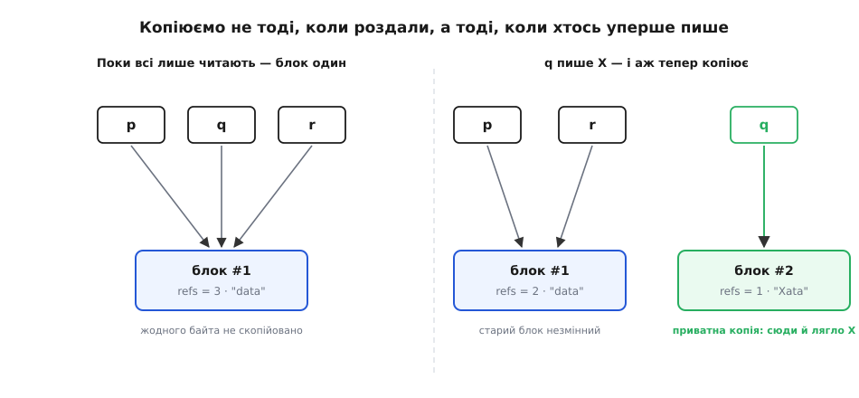
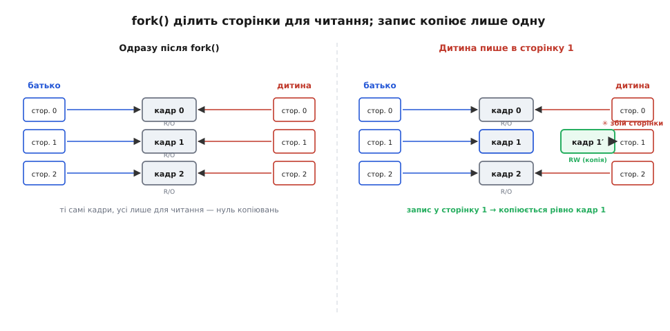
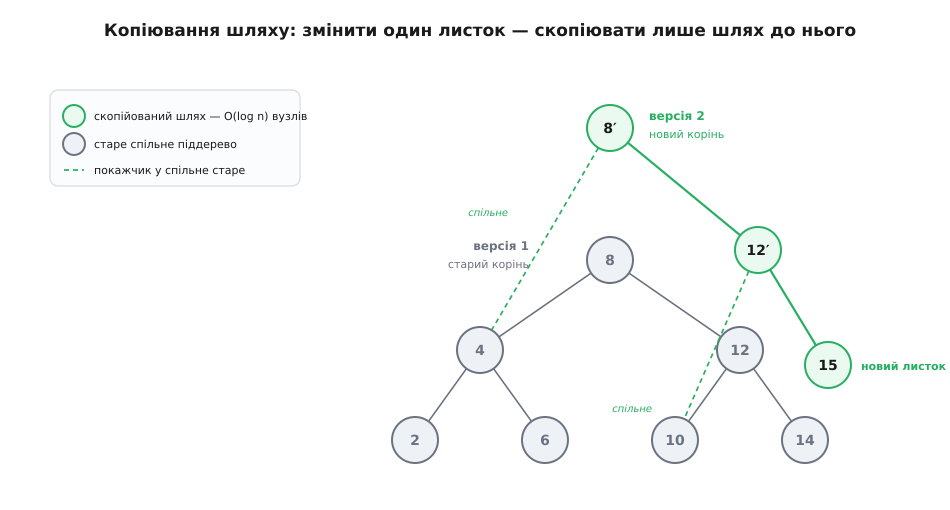

# Copy-on-write: принцип незмінних копій

<preknowlist>
- [Адреси й покажчики](book:programming/addresses-pointers) — покажчик як адреса ділянки пам'яті; кілька покажчиків можуть указувати на ту саму ділянку, тобто ділити один вміст.
- [Підрахунок посилань](book:programming/reference-counting) — лічильник власників блока: скільки посилань на нього зараз указує; коли він падає до нуля, блок нікому не потрібен і його звільняють.
- [Двійкове дерево пошуку](book:algorithms/binary-search-tree) — вузли з ключем і двома дітьми, впорядковані так, що пошук іде згори вниз одним шляхом від кореня до листка.
</preknowlist>

Копіювати дані коштує часу й пам'яті, пропорційних розмірові. І дуже часто ця плата — намарне: копію роблять «про всяк випадок», а потім жодного разу не змінюють. Найяскравіший приклад — коли програма запускає зовнішню команду. Щоб народити новий процес, Unix спершу дублює наявний повністю — усю його пам'ять до останнього байта, — а новонароджений одразу заміщає себе іншою програмою і щойно скопійований образ викидає геть. Мегабайти скопіювали лише для того, щоб за мить стерти. Те саме, тільки дрібніше, — коли великий масив передають у функцію «за значенням», а вона його лише читає: копія народжується і вмирає незайманою.

Придивімося, де тут марнотратство. Плата за копію виправдана рівно тоді, коли обидві сторони потім живуть кожна своїм життям — одна міняє своє, друга своє, і їм треба бути незалежними. Але поки всі лише читають, незалежність нічого не варта: два однакові байти й один той самий байт, на який дивляться двоє, — з погляду читача те саме. Копія потрібна не в мить, коли дані «роздали», а в мить, коли хтось уперше збереться в них щось змінити — бо аж тоді читачі почали б заважати одне одному.

Звідси й увесь прийом: **не копіювати наперед, а віддати всім одну спільну копію лише для читання — і зробити приватний дублікат тільки тому й тільки тоді, хто справді збереться писати.** Копіюємо на запис, не раніше. Це й є copy-on-write (англ. «копіювання під час запису», скорочено COW).

> 🔧 **Навіщо це.** На цьому прийомі тримається народження процесів у кожній Unix-системі, знімки файлових систем ZFS і Btrfs, клони віртуальних машин, «незмінні» рядки й контейнери в бібліотеках, персистентні структури у функційних мовах, версії в git, ізоляція транзакцій у базах даних. Скрізь, де багато хто дивиться на майже однакові дані, а міняють їх лише декотрі й лише де-не-де, відкладене копіювання зрізає величезну частку роботи.

## Як зрозуміти, що вже час копіювати

Приховане питання всього прийому таке: коли я збираюся писати, звідки мені знати — я тут сам чи на цей блок дивиться ще хтось? Бо якщо сам, можна писати прямо на місці, і копія ні до чого; а якщо не сам — писати на місці не можна, інакше я зіпсую дані тим, хто теж на них покладається.

Відповідь дає лічильник посилань. Біля спільного блока тримаємо число: скільки власників на нього зараз указує. Роздати «копію» — це не копіювати байти, а лише дати ще один покажчик на той самий блок і збільшити лічильник на одиницю. Викинути копію — зменшити лічильник. А запис іде за одним правилом розвилки: лічильник дорівнює одиниці — я єдиний власник, пишу на місці; лічильник більший за одиницю — блок спільний, спершу відколюю собі приватну копію, а тоді пишу вже в неї.

```c
typedef struct { int refs; size_t len; char data[]; } block_t;

/* Записати байт b у позицію i за принципом «копія-на-запис».
   Приймає покажчик на власний покажчик, бо може його перенаправити. */
void cow_write(block_t **owned, size_t i, char b) {
    block_t *blk = *owned;
    if (blk->refs > 1) {                 /* блок спільний — треба відколотись */
        block_t *copy = malloc(sizeof(block_t) + blk->len);
        copy->refs = 1;
        copy->len  = blk->len;
        memcpy(copy->data, blk->data, blk->len);
        blk->refs--;                     /* нас у старому блоці більше нема   */
        *owned = blk = copy;             /* тепер ми на власній копії         */
    }
    blk->data[i] = b;                    /* refs == 1 — пишемо прямо на місці */
}
```

Стара, спільна копія лишається недоторканою — і всі, хто на неї дивиться, нічого не помічають. Той, хто писав, тихо відколовся на власний блок. Це і є ключовий інваріант усього прийому: **спільний блок ніхто не змінює на місці; єдиний спосіб його «змінити» — перестати його ділити.** Поки на блок указує більш ніж один власник, він фактично [незмінний](book:programming/immutability).


*Ліворуч усі троє — `p`, `q`, `r` — указують на один блок із лічильником 3, і жодного байта не скопійовано. Праворуч `q` пише: лічильник спільного блока більший за одиницю, тож `q` відколює собі дублікат (лічильник 1), а лічильник старого блока падає до 2. `p` і `r` досі бачать той самий незмінений блок — вони й не дізналися, що хтось поруч щось міняв.*

**Приклад (лічильник веде копіювання).** Простежмо стан блоків, роздаючи один рядок трьом власникам, а тоді записавши одним із них:

```
p = make("data")       # блок #1: refs = 1
q = share(p)           # блок #1: refs = 2   (share лише робить refs++, не копіює)
r = share(p)           # блок #1: refs = 3
cow_write(&q, 0, 'X'): # q указує на #1, refs = 3 > 1 → копіюємо:
                       #   copy = дублікат #1  →  блок #2: refs = 1
                       #   #1: refs-- → 2
                       #   q → блок #2;  #2.data[0] = 'X'
```

Підсумок: три «копії» коштували один блок і два приростки лічильника — аж поки перший запис не змусив відколоти рівно одну справжню копію. `p` і `r` бачать блок #1 («data», лічильник 2), `q` бачить блок #2 («Xata», лічильник 1).

> 📜 Поряд — історична вставка: [як народилося копіювання-на-запис](book:algorithms/copy-on-write/hist-cow-lineage.md) — прийом як спосіб керувати пам'яттю з'явився в системі TENEX (1972) на PDP-10, звідки перейшов у fork; ту саму ідею для зв'язаних структур даних оформили Сарнак і Тар'ян (1986), а тоді Дрісколл, Сарнак, Слейтор і Тар'ян у праці «Making Data Structures Persistent» (1989).

## Найвідоміший приклад: fork() і сторінки пам'яті

Повернімося до народження процесу — саме там COW дає найбільший зиск. Коли процес робить fork, ядро мало б віддати дитині копію всієї батьківської пам'яті. Робити це чесним копіюванням — довго й майже завжди намарне, бо дитина здебільшого одразу викликає exec, і той образ стирає. Тому сучасні ядра копію не роблять: вони віддають дитині ті самі фізичні сторінки пам'яті, що й у батька, але позначають їх для обох лише для читання. Тут працює [віртуальна пам'ять](book:programming/virtual-memory) — те, що обидва процеси бачать як «свою» пам'ять, насправді відображено на спільні фізичні сторінки.

Поки обидва процеси лише читають, вони живуть на спільній пам'яті й не коштують ані байта зайвого. Щойно котрийсь пробує писати в якусь сторінку, апаратура натикається на позначку «лише читання» і збиває виконання — стається збій сторінки (page fault). Його перехоплює ядро, бачить, що сторінка спільна, і аж тепер копіює **рівно цю одну сторінку** (типово 4 КіБ): робить приватний дублікат, дозволяє в нього писати й повертає процес до перерваної інструкції. Скопійовано лише те, у що справді писали; усе, чого не торкались, лишилось спільним.


*Одразу після fork таблиці сторінок батька й дитини вказують на ті самі фізичні кадри, усі позначені «лише читання» (R/O) — нуль копіювань. Коли дитина пише в сторінку 1, апаратура ловить заборонений запис, ядро копіює тільки кадр 1 у новий кадр 1′ і переспрямовує туди дитину. Кадри 0 і 2 лишаються спільними; скопійовано рівно те, що змінили.*

Ось чому послідовність fork-exec така дешева: величезний батько народжує дитину без масового копіювання, а кілька сторінок, які дитина встигне зачепити до exec, — то дрібниця. Той самий механізм рухає клони віртуальних машин: копія дістає пам'ять оригіналу «в оренду», а розходяться вони лише в тих сторінках, які хтось із них перепише.

## Той самий прийом у структурах даних: копіювання шляху

Досі ми ділили суцільні блоки — сторінки, буфери. Але найкрасивіше COW показує себе на зв'язаних структурах, де дані розкидані по вузлах із покажчиками. Візьмімо збалансоване [дерево пошуку](book:algorithms/binary-search-tree) на n вузлів і поставмо незвичну вимогу: змінити в ньому один листок, але **зберегти й стару версію теж** — так, щоб обидві, і до, і після зміни, лишались повноцінними деревами, якими можна користуватись.

Найгрубіше рішення — здублювати все дерево, а тоді правити дублікат: O(n) роботи на кожну зміну. Але придивімося, що насправді відрізняє нову версію від старої. Змінили ми один листок. Його старий батько тепер мусить указувати на новий листок замість старого — отже, батько теж інший. А дідусь мусить указувати на нового батька — теж інший. І так угору аж до кореня. Зате всі піддерева, що звисають **убік** від цього шляху, не змінились ані на біт — вони в обох версіях однакові.

Звідси прийом, який називають копіюванням шляху (path copying): щоб «змінити» листок, копіюємо лише вузли на шляху від кореня до нього — а це в збалансованому дереві всього O(log n) вузлів. Кожен новий вузол на шляху вказує новим дітям туди, де стався запис, а **рештою покажчиків дивиться просто на старі, спільні піддерева**. У підсумку постає новий корінь; старий корінь нікуди не дівся й досі точно описує стару версію. Дві версії дерева ділять між собою все, крім O(log n) свіжих вузлів.


*Стара версія (сірий корінь 8) лишається цілою. Щоб замінити правий листок, скопійовано лише три вузли на шляху корінь→8′, 12′, новий листок 15 (зелені). Новий корінь 8′ лівим покажчиком дивиться на **спільне** старе ліве піддерево (вузол 4), а новий вузол 12′ — на спільний старий листок 10. Скопійовано O(log n) вузлів; усе решта в обох версіях — те саме.*

Так із простого дерева виходить персистентна (лат. *persistere* — залишатися, тривати) структура — така, у якій зміна не затирає минуле, а породжує нову версію поряд зі старою, і будь-яку з версій можна читати будь-коли. Ціна версії — не O(n), а O(log n) часу й пам'яті. На цьому стоять [незмінні](book:programming/immutability) структури даних у функційних мовах, історія редагувань із необмеженим відкотом і навіть внутрішній устрій [git](book:programming/version-control), де кожен коміт — новий корінь дерева файлів, що ділить із попереднім усі незмінені теки.

> 🧮 Поряд — математична вставка: [аналіз копіювання шляху](book:algorithms/copy-on-write/math-path-copying.md) — чому копіювання шляху дає рівно O(log n) вузлів на зміну у збалансованому дереві, звідки береться сумарна пам'ять O(k log n) на k змін, і доведення інваріанта спільності: старі версії ніколи не псуються, а правило з лічильником посилань коректне.

> ⚙️ Поряд — код-вставка: [персистентне дерево копіюванням шляху](book:algorithms/copy-on-write/proj-persistent-bst.md) — робоча реалізація незмінного дерева пошуку, де вставка повертає новий корінь і ділить зі старим усе, крім шляху; з покроковим розбором, замірами спільних вузлів і складністю.

## Файлові системи й бази даних

Той самий принцип — «не переписуй на місці, напиши поруч і переспрямуй покажчик» — лежить в основі сучасних файлових систем на кшталт ZFS і Btrfs. Вони ніколи не змінюють блок даних там, де він лежить. Змінені дані пишуться в **нові** вільні блоки, а тоді оновлюються покажчики на них — знизу вгору, аж до кореня [дерева](book:algorithms/b-tree) файлової системи. Стара версія при цьому лишається цілою, бо її блоки ніхто не чіпав. Тому знімок (snapshot) такої системи майже безкоштовний: досить зберегти старий корінь — і всі його блоки лишаються спільними з живою версією, доки хтось їх не перепише.

У базах даних той самий хід зветься багатоверсійністю — [MVCC](book:programming/mvcc). Замість того щоб перезаписувати рядок на місці й замикати його від читачів, база створює **нову версію** рядка, а стару лишає тим, хто вже почав свою транзакцію. Кожна транзакція так бачить узгоджений знімок даних на момент свого початку, і читачі ніколи не блокують того, хто пише, — бо ніхто нічого не затирає, лише додає версії.

Спільна нитка скрізь одна: якщо ставитись до спільних даних як до незмінних і платити за копію рівно там і рівно тоді, де запис змушує, — знімки, версії й безпечне одночасне читання стають майже дурницею.

## Де прийом кусає

Copy-on-write не безкоштовний, і його ціна ховається в тих самих місцях, де захована вигода.

**Облік спільності теж коштує.** Хтось має вести лічильник посилань, а коли на блок дивляться кілька потоків одночасно, цей лічильник стає спільною змінною, яку всі смикають, — і його приростки й спади доводиться робити [атомарно](book:programming/std-atomic), що недешево. Класична пересторога — рядки з copy-on-write у C++ до 2011 року: перегони навколо лічильника й підступне псування посилань виявились такою халепою, що стандарт C++11 copy-on-write-рядки фактично заборонив, а бібліотека GCC від версії 5.1 від них відмовилась на користь малих рядків у самому об'єкті.

**Перший запис — раптом повільний.** Той, хто пише першим після роздачі, платить за копію саме тоді, коли пише, — і ця плата може впасти в найгіршу мить. fork величезного процесу, який потім заходиться писати всюди, обертається бурею збоїв сторінок: кожен окремо дешевий, а разом — помітна затримка рівно на гарячому шляху.

**Старе не зникає само.** Поки хоч одна версія тримається за спільний блок, його не можна звільнити. Персистентні дерева, знімки файлових систем і старі версії рядків у базі накопичують пам'ять, доки хтось не викине посилання й лічильник не впаде до нуля. Тому COW-системи майже завжди ходять у парі зі [збиранням сміття](book:programming/garbage-collection) — інакше минуле поїдає весь простір.

**Уся коректність — на одному правилі.** Що спільний блок незмінний, тримається лише на дисципліні: жоден шлях у коді не сміє писати в блок із лічильником, більшим за одиницю, оминувши копіювання. Один такий недогляд — і зміна протече в чужу версію; такі помилки підступні, бо виявляються, лише коли блок справді хтось поділив.

## Одна думка на всі випадки

За всіма цими прикладами — від народження процесу до знімка файлової системи, від незмінного рядка до git-коміту — стоїть одна й та сама думка. Не роби роботу, поки не певен, що вона потрібна. Дай усім спільні дані в оренду й вважай їх незмінними; а коли — і якщо — хтось таки збереться писати, зроби копію рівно того шматка, який він міняє, рівно в ту мить, коли ручка торкнулась паперу. Плата за копіювання нікуди не зникла — вона лише перенеслась туди, де без неї справді не обійтися, і зникла звідусіль, де була б намарною.
