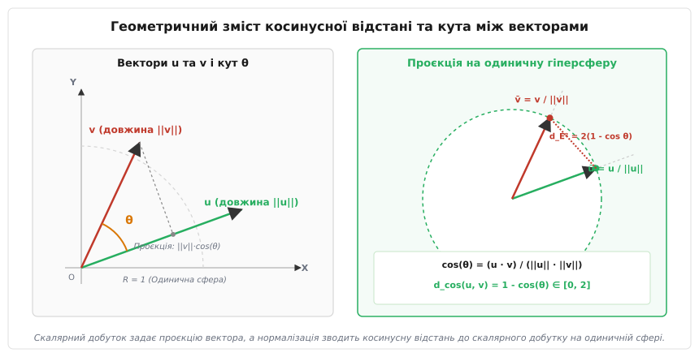
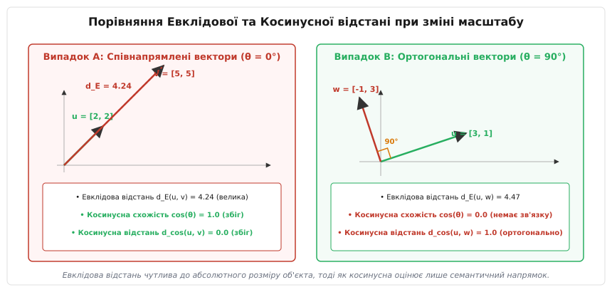
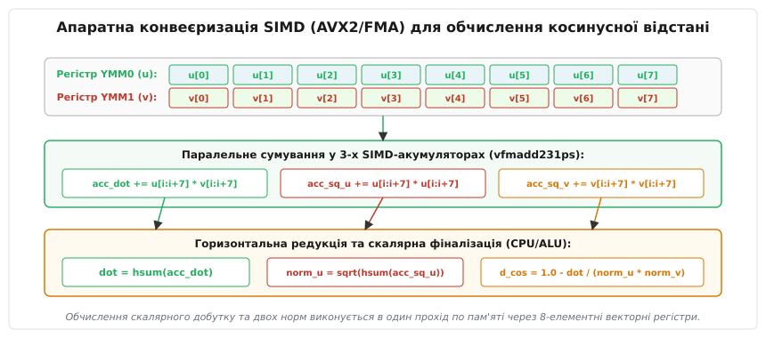

# Косинусна відстань

<preknowlist>
- [Векторний простір](topic:math/vector-space) — алгебраїчна структура дійснозначних векторів, скалярний добуток та норми.
- [Норма вектора](topic:math/vector-norm) — обчислення евклідової L2-норми та довжини вектора.
- [Хешування з урахуванням локальності](topic:algorithms/locality-sensitive-hashing) — імовірнісний індексальний пошук близкості за допомогою методів SimHash та Random Hyperplanes.
- [Пошук найближчих сусідів](topic:algorithms/k-nearest-neighbors) — задача відбору K найближчих векторів у багатовимірних просторах ознак.
</preknowlist>

Уявіть інформаційно-пошукову систему, яка порівнює релевантність двох текстових документів: короткої новинної замітки на 100 слів та розгорнутої наукової монографії на 50 000 слів. Обидва тексти присвячені одній темі — наприклад, квантовим обчисленням — і мають однакові пропорції вживання ключових термінів. Якщо подати ці документи у вигляді векторів частот слів (Bag-of-Words або TF-IDF) і обчислити звичайну Евклідову відстань між ними, результати будуть повністю викривлені: вектор монографії виявиться у сотні разів довшим за вектор замітки, а геометрична евклідова відстань між ними сягне величезного значення `d_E ≈ 450.0`. Пошуковий алгоритм на основі евклідової відстані зробить помилковий висновок, що ці документи не мають нічого спільного, лише через те, що один із них детальніший та обсяжніший за інший.

Аналогічна криза виникає в комп'ютерному зорі під час порівняння зображень з різним рівнем освітленості чи контрастності, у спектральному аналізі сигналів або у нейронних мережах обробки природної мови, де векторні ембеддинги того самого поняття можуть мати різну абсолютну амплітуду залежно від контексту чи довжини вхідної послідовності. Звичайна геометрична відстань є чутливою до абсолютного розміру (норми) об'єкта. Для оцінки семантичної схожості потрібна метрика, яка повністю ігнорує довжину векторів і вимірює лише **напрямок їхнього поширення у просторі ознак**.

Цю задачу вирішує **косинусна відстань (Cosine Distance)** — кутова міра відмінності між векторами у багатовимірному просторі, яка вимірює косинус кута між ними і є повністю інваріантною до їхнього абсолютного масштабу.

## Прокляття вимірності та геометрична мотивація

У класичній геометрії низьких вимірів (2D чи 3D) ми звикли довіряти Евклідовій відстані як універсальній мірі близькості. Однак у сучасних інфраструктурах машинного навчання та аналізу даних об'єкти представлені векторами високої вимірності — від `d = 128` у задачах розпізнавання облич до `d = 1536` чи `d = 4096` у сучасних мовних моделях (LLM).

При зростанні вимірності простору геометрія змінюється докорінно. Це явище відоме в інформатиці як «прокляття вимірності» (Curse of Dimensionality). У просторах високої вимірності майже весь об'єм гіперкуба зосереджується в його кутках, а абсолютні евклідові відстані між будь-якою парою випадково вибраних точок прямують до однакового значення.

Більше того, у високовимірних просторах ознак норма вектора `||u||` зазвичай відображає інтенсивність, обсяг або масштабованість об'єкта, але не його якісну структуру:
- У текстовому аналізі норма вектора пропорційна загальній кількості слів у документі.
- У комп'ютерному зорі норма вектора ознак пропорційна середній яскравості чи контрастності зображення.
- У рекомендаційних системах норма вектора користувача пропорційна активності (користувач, який поставив 1000 оцінок, має доввший вектор, ніж той, хто поставив 10 оцінок, хоча їхні смаки можуть бути ідентичними).

Якщо вимірювати схожість евклідовою відстанню, активний користувач опиниться «далеко» від пасивного, а довгий документ — далеко від короткого. Косинусна відстань скасовує вплив норми, виділяючи чистий напрямок вектора.

## Геометричний зміст та математичний фундамент

У дійснозначному векторному просторі `ℝᵈ` скалярний добуток двох векторів `u` та `v` фундаментально пов'язаний із довжинами цих векторів та косинусом кута `θ` між ними через алгебраїчне співвідношення:

```
u · v = ||u|| · ||v|| · cos(θ)
```

Де:
- `u · v = ∑ᵢ₌₁ᵈ (uᵢ · vᵢ)` — скалярний добуток (Inner Product / Dot Product) векторів у координатному вигляді;
- `||u|| = √(∑ᵢ₌₁ᵈ uᵢ²)` — евклідова норма (L2-довжина) вектора `u`, що обчислюється як квадратний корінь із суми квадратів усіх його компонентів;
- `||v|| = √(∑ᵢ₌₁ᵈ vᵢ²)` — евклідова норма вектора `v`;
- `θ` — кут між векторами у променях, що виходять із початку координат `O(0, 0, ..., 0)`.

Геометрично скалярний добуток можна уявити як довжину ортогональної проєкції вектора `v` на напрямок вектора `u`, помножену на довжину вектора `u`. Якщо спроєктувати кінчик вектора `v` під прямим кутом 90 градусів на пряму, уздовж якої лежить вектор `u`, довжина цієї проєкції дорівнює `||v|| · cos(θ)`. Відношення цієї проєкції до власної довжини вектора `||v||` дає косинус кута.

Виразивши з цього співвідношення косинус кута, отримуємо **косинусну схожість (Cosine Similarity)** (від латинського *cosinus* — косинус та *similaritas* — схожість):

```
CosSim(u, v) = cos(θ) = (u · v) / (||u|| · ||v||) = ∑ᵢ₌₁ᵈ (uᵢ · vᵢ) / (√(∑ᵢ₌₁ᵈ uᵢ²) · √(∑ᵢ₌₁ᵈ vᵢ²))
```

З нерівності Коші — Буняковського — Шварца випливає, що для будь-яких ненульових векторів значення косинусної схожості строго обмежене інтервалом `[-1.0, 1.0]`.


*Геометрична інтерпретація кута θ між векторами u та v, проєктування на одиничну гіперсферу та зв'язок зі скалярним добутком.*

Оскільки для побудови алгоритмів пошуку та індексування потрібна міра **відстані** (де 0 відповідає повному збігу, а більші значення — більшій відмінності), **косинусна відстань (Cosine Distance)** визначається як віднімання косинусної схожості від одиниці:

```
d_cos(u, v) = 1 - CosSim(u, v) = 1 - (u · v) / (||u|| · ||v||)
```

### Характерні режими та значення косинусної відстані

Розглянемо три взаємні орієнтації векторів у просторі:

1. **Співнапрямлені вектори (`θ = 0°`, `cos(θ) = 1.0`):**
   Косинусна відстань дорівнює `d_cos(u, v) = 0.0`. Вектори вказують строго в один і той самий бік. Вони відрізняються лише масштабом `v = c · u` (де `c > 0`). У семантичному аналізі це відповідає повному збігу змісту.

2. **Ортогональні вектори (`θ = 90°`, `cos(θ) = 0.0`):**
   Косинусна відстань дорівнює `d_cos(u, v) = 1.0`. Вектори перпендикулярні. У них немає жодної спільної ненульової компоненти або лінійної залежності. В інформаційному пошуку це означає відсутність спільних тематичних ознак.

3. **Протилежно напрямлені вектори (`θ = 180°`, `cos(θ) = -1.0`):**
   Косинусна відстань дорівнює `d_cos(u, v) = 2.0`. Вектори є протилежними `v = -c · u` (`c > 0`). Це максимальна можлива відмінність у дійснозначному просторі.

Для невід'ємних векторів (наприклад, у задачах аналізу текстів `TF-IDF` або після шарів активації `ReLU` у нейромережах, де всі значення `uᵢ ≥ 0`), кут `θ` не може перевищувати `90°`. У цьому випадку косинусна відстань обмежена діапазоном `d_cos(u, v) ∈ [0.0, 1.0]`.

## Порівняльний аналіз: Евклідова проти Косинусної відстані

Щоб чітко зрозуміти інженерну різницю між Евклідовою та Косинусною відстанню, проаналізуємо їхню математичну поведінку при масштабуванні векторів.

Нехай вектор запиту дорівнює `u = [2, 2]`. Розглянемо два вектори бази даних:
- `v = [5, 5]` — вектор, що має точнісінько той самий напрямок, але помножений на скаляр `2.5`;
- `w = [-2, 2]` — вектор, ортогональний до `u` (`u · w = 2·(-2) + 2·2 = -4 + 4 = 0`).


*Порівняльна поведінка евклідової та косинусної відстаней при зміні масштабу співнапрямлених та ортогональних векторів.*

Обчислимо обидві метрики для двох пар векторів:

### Випадок A: Співнапрямлені вектори (u, v)
```
d_E(u, v)   = √((2-5)² + (2-5)²) = √((-3)² + (-3)²) = √(9 + 9) = √18 ≈ 4.2426
cos(θ)      = (2·5 + 2·5) / (√(4+4) · √(25+25)) = 20 / (√8 · √50) = 20 / 20 = 1.0
d_cos(u, v) = 1.0 - 1.0 = 0.0
```

### Випадок B: Ортогональні вектори (u, w)
```
d_E(u, w)   = √((2 - (-2))² + (2-2)²) = √(4² + 0²) = √16 = 4.0
cos(θ)      = (2·(-2) + 2·2) / (√(4+4) · √(4+4)) = 0 / (√8 · √8) = 0 / 8 = 0.0
d_cos(u, w) = 1.0 - 0.0 = 1.0
```

### Головний парадокс евклідової відстані:
Евклідова відстань до співнапрямленого вектора `v` виявилася **більшою**, ніж до абсолютно ортогонального вектора `w` (`4.2426 > 4.0`). Система на основі евклідової відстані поверне ортогональний вектор як «більш схожий», ніж вектор однакового напрямку більшої довжини!

Натомість косинусна відстань дає абсолютно точний семантичний результат: `d_cos(u, v) = 0.0` (абсолютна схожість напрямку), а `d_cos(u, w) = 1.0` (відсутність зв'язку).

Історичному шляху виникнення цього геометричного підходу — від статистичних досліджень Пірсона наприкінці XIX століття до створення векторної моделі SMART Джерардом Солтоном та сучасних векторних пошукових систем — присвячено вставку [📜 Історія косинусної відстані та геометричної схожості](topic:algorithms/cosine-distance/hist-cosine-distance.md).

## Математичні властивості та тотожність на одиничній гіперсфері

У математичному аналізі просторів метрика повинна задовольняти чотири фундаментальні аксіоми: невід'ємність, симетрію, тотожність нерозрізнюваних та нерівність трикутника.

Косинусна відстань є **псевдометрикою** (семіметрикою), оскільки у загальному просторі `ℝᵈ` вона порушує дві з чотирьох аксіом:

1. **Порушення аксіоми тотожності нерозрізнюваних:** Умова `d_cos(u, v) = 0` гарантує лише колінеарність векторів `v = c · u` (`c > 0`), але не їхню тотожність `u = v`. Вектори `[1, 1]` та `[2, 2]` мають косинусну відстань 0, хоча є різними елементами простору.
2. **Порушення нерівності трикутника:** У загальному випадку косинусна відстань `d_cos(u, w)` може бути більшою за суму `d_cos(u, v) + d_cos(v, w)`.

Наприклад, якщо розглянути вектори `u = [1, 0]`, `v = [1/√2, 1/√2]` (кут 45°) та `w = [0, 1]` (кут 90°):
- `d_cos(u, v) = 1 - 1/√2 ≈ 0.2929`
- `d_cos(v, w) = 1 - 1/√2 ≈ 0.2929`
- `d_cos(u, w) = 1 - 0 = 1.0`
- Сума окремих відстаней: `0.2929 + 0.2929 = 0.5858 < 1.0`. Нерівність трикутника порушено!

Детальні математичні доведення цих властивостей, виведення нерівності Коші — Буняковського — Шварца та аналіз **Кутової відстані (Angular Distance)** `d_ang = arccos(cos θ) / π`, яка є справжньою метрикою і задовольняє нерівність трикутника, наведено у вставці [🧮 Математичні властивості та геометрія косинусної відстані](topic:algorithms/cosine-distance/math-cosine-properties.md).

### Оптимізаційний прийом: Зведення до скалярного добутку (L2 Normalization)

Якщо перед індексацією всі вектори нормалізувати за нормою L2, звівши їх до одиничної довжини `ū = u / ||u||` (`||ū|| = 1`), то квадрат Евклідової відстані між нормалізованими точками на поверхні одиничної сфери пов'язаний із косинусною відстанню строгим математичним співвідношенням:

```
||ū - v̄||²
= (ū - v̄) · (ū - v̄)            [означення квадрата норми через скалярний добуток]
= ||ū||² + ||v̄||² - 2(ū · v̄)    [білінійність скалярного добутку: розкриття дужок]
= 1 + 1 - 2(ū · v̄)             [умова нормалізації: ||ū|| = 1, ||v̄|| = 1]
= 2(1 - ū · v̄)                [винесення спільного множника 2 за дужки]
= 2 · d_cos(u, v)              [підстановка означення косинусної відстані]
```

Звідси випливає фундаментальна формула:

```
d_cos(u, v) = 1 - (ū · v̄)
```

**Чому це критично для практичної інженерії:**
Якщо вектори заздалегідь нормалізовані під час завантаження у базу даних, обчислення косинусної відстані під час запиту скорочується до **одноразового скалярного добутку `1 - (ū · v̄)`**. Це усуває необхідність обчислення квадратних коренів та ділення під час кожного порівняння векторів, що прискорює пошукові індекси у 3–5 разів!

## Застосування у розріджених та щільних векторних просторах

У практичному програмуванні косинусна відстань застосовується у двох принципово різних типах векторних структур: розріджених та щільних.

### 1. Розріджені вектори (Sparse Vectors) — Пошук текстів TF-IDF / BM25 та алгоритм WAND

У класичному текстовому пошуку словник може містити `d = 500 000` унікальних слів. Однак кожен окремий документ містить лише від 50 до 1000 унікальних слів. Вектори таких документів є розрідженими (Sparse): 99.9% їхніх компонентів дорівнюють нулю.

Для розріджених векторів збереження 500 000 чисел недоцільне. Дані зберігаються у вигляді стиснутого списку паралельних масивів індексів та значень (формат CSR — Compressed Sparse Row).

У високопродуктивних інвертованих індексах (Lucene, Elasticsearch) для швидкого відбору кандидатів за косинусною схожістю застосовують **алгоритм WAND (Weak AND)** та **Block-Max WAND**. Замість того, щоб обчислювати повний скалярний добуток для всіх документів індексу, алгоритм оцінює верхню межу можливої косинусної схожості для кожного інвертованого списку. Якщо максимальна можлива схожість документа не перевищує поріг поточного `K`-го найкращого результату, весь документ повністю пропускається без читання його векторних значень.

### 2. Щільні вектори (Dense Vectors) — Нейронні ембеддинги (BERT, OpenAI, CLIP) та індекси HNSW / IVF-PQ

У сучасному глибокому навчанні трансформерні моделі стискають семантичний зміст будь-якого тексту, зображення або аудіофайлу у **щільний вектор (Dense Vector)** фіксованого розміру (наприклад, `d = 768` у BERT чи `d = 1536` у OpenAI text-embedding-3).

У щільних векторах майже всі компоненти є ненульовими дійсними числами. Для пошуку найближчих векторів у таких просторах використовують векторні бази даних (Milvus, Qdrant, FAISS, Pinecone). Вони будують наближені індекси двох основних типів:

- **HNSW (Hierarchical Navigable Small World):** Графова структура даних, у якій вектори утворюють багатошаровий граф малого світу. Сусідні вузли графа з'єднані ребрами, якщо косинусна відстань між ними є мінімальною. Пошук найближчого вектора виконується за логарифмічний час `O(log N)` шляхом жадібного спуску по графу від верхніх розріджених шарів до нижніх щільних.
- **IVF-PQ (Inverted File with Product Quantization):** Пошуковий індекс, який спочатку розбиває простір на кошики Вороного за допомогою алгоритму `k-Means`, а потім стискає вектори у короткі байти за допомогою продуктового квантування. Під час пошуку обчислюються таблиці відстаней між вектором запиту та центроїдами, а косинусна відстань до елементів оцінюється за табличними вибірками без розпакування векторів.

## Апаратне SIMD-прискорення (AVX2 / FMA) та кеш-ієрархія CPU

Оскільки обчислення косинусної відстані для щільних векторів зводиться до тривалого послідовного сумування добутків компонентів, скалярне виконання в циклі не здатне завантажити обчислювальні потужності сучасного процесора.

Для максимального прискорення обчислень застосовують інструкції SIMD (Single Instruction, Multiple Data). За допомогою 256-бітних регістрів `YMM` в архітектурі AVX2 процесор обробляє по 8 чисел типу `float` за одну інструкцію `vfmadd231ps` (Fused Multiply-Add), яка виконується за один апаратний такт без проміжного втрачання точності:

```
acc_dot  = acc_dot  + (u_vec * v_vec)
acc_sq_u = acc_sq_u + (u_vec * u_vec)
acc_sq_v = acc_sq_v + (v_vec * v_vec)
```


*Конвеєризація обчислення косинусної відстані на 256-бітних регістрах AVX2 з трьома паралельними акумуляторами.*

Під час конвеєризації критично враховувати затримку інструкцій (Latency) та пропускну здатність (Throughput) викональних блоків CPU. Інструкція FMA має затримку виконання близько 4 тактів. Якщо використовувати лише один векторний акумулятор, наступна інструкція буде чекати на результат попередньої. Щоб повністю завантажити конвеєр процесора, розробники використовують **розгортання циклу із трьома паралельними акумуляторами**, які виконуються незалежно на різних викональних портах CPU (`Port 0` та `Port 1`).

Повний робочий проєкт із реалізацією скалярного, SIMD-векторизованого та розрідженого обчислення косинусної відстані з підтримкою C та C++, порівняльним аналізом продуктивності та обробкою субнормальних чисел розміщено у вставці [⚙️ Швидке обчислення косинусної відстані з SIMD-оптимізацією](topic:algorithms/cosine-distance/proj-simd-cosine.md).

## Чисельна стабільність та граничні випадки

При реалізації косинусної відстані у продакшн-системах необхідно враховувати три основні граничні випадки обчислювальної математики:

### 1. Нульові вектори та ділення на нуль
Якщо один із векторів є повністю нульовим (`u = [0, 0, ..., 0]`), його норма `||u|| = 0`. Спроба обчислити `(u · v) / (0 · ||v||)` призведе до виникнення значення `NaN` (Not a Number) або винятку ділення на нуль.
- **Стратегія захисту:** Перед діленням перевіряють умови `||u||² < ε` та `||v||² < ε` (де `ε ≈ 1e-12`). Якщо хоча б одна норма менша за `ε`, алгоритм повертає заздалегідь визначену відстань `1.0` або спеціальний код помилки.

### 2. Вихід за межі інтервалу через округлення float32
Через похибки накопичення у плаваючій комі звичайної точності (`float32`), для двох майже ідентичних векторів обчислене значення скалярного добутку `(u · v) / (||u|| · ||v||)` може дорівнювати, наприклад, `1.000000119`. Якщо відняти це значення від одиниці, отримаємо від'ємне значення `d_cos = -0.000000119`. Якщо згодом з цього значення обчислити квадратний корінь (для переходу до евклідової відстані), програма впаде з помилкою `NaN`.
- **Стратегія захисту:** Результат ділення обов'язково обрізають (clamp) до математичного інтервалу `[-1.0, 1.0]`:
:::tabs
```c
float cos_sim = dot / (norm_u * norm_v);
if (cos_sim > 1.0f)  cos_sim = 1.0f;
if (cos_sim < -1.0f) cos_sim = -1.0f;
float d_cos = 1.0f - cos_sim;
```
```cpp
const float cos_sim = std::clamp(dot / (norm_u * norm_v), -1.0f, 1.0f);
const float d_cos = 1.0f - cos_sim;
```
:::

### 3. Субнормальні числа (Denormals)
Коли компоненти вектора стають надзвичайно малими (близькими до `10⁻³⁸`), процесори x86 перемикаються в режим обробки субнормальних чисел через мікрокод, що призводить до падіння швидкості обчислень у 50–100 разів.
- **Стратегія захисту:** Увімкнення апаратних режимів процесора `FTZ` (Flush-to-Zero) та `DAZ` (Denormals-are-Zero) на рівні потоку виконання.

Опис публічного програмного контракту бібліотеки векторних метрик, кодів помилок та C/C++ заголовочних файлів подано у вставці [📋 Інтерфейс та C/C++ API векторних метрик](topic:algorithms/cosine-distance/api-cosine-metrics.md).

## Порівняльна матриця векторних метрик

У наступній таблиці зібрано порівняльну характеристику найуживаніших векторних метрик у сучасних алгоритмах та структурах даних:

| Метрика | Формула обчислення | Інваріантність до масштабу | Виконання аксіом метрики | Основна галузь застосування |
| :--- | :--- | :--- | :--- | :--- |
| **Косинусна відстань (Cosine)** | `1 - (u·v)/(||u||·||v||)` | **Так** (інваріантна) | Ні (Псевдометрика, немає нерівності трикутника) | Нейронні ембеддинги (NLP, Vision), пошук у тексті (TF-IDF), RAG |
| **Евклідова відстань (L₂)** | `√(∑ (uᵢ - vᵢ)²)` | Ні (чутлива до довжини) | **Так** (Повноцінна метрика) | Геометричний пошук, фізичні моделі, кластеризація k-Means |
| **Мангеттенська відстань (L₁)** | `∑ \|uᵢ - vᵢ\|` | Ні (чутлива до довжини) | **Так** (Повноцінна метрика) | Сіткові графи, робототехніка, обробка дискретних сигналів |
| **Скалярний добуток (Inner Product)** | `u · v` | Ні (пропорційний довжині) | Ні (Не є відстанню) | MIPS (Maximum Inner Product Search), системи рекомендацій |
| **Кутова відстань (Angular)** | `arccos(cos θ) / π` | **Так** (інваріантна) | **Так** (Повноцінна метрика на сфері) | Теоретичні метричні дерева (VP-tree), сферична геометрія |

> 🔧 **Навіщо це.**
> У сучасних архітектурах штучного інтелекту (Retrieval-Augmented Generation / RAG, LLM-пошук) косинусна відстань є осердям векторної пам'яті. Коли нейронна модель перетворює запит користувача у вектор ембеддинга, саме косинусна відстань дозволяє за декілька мілісекунд знайти серед мільйонів векторів у базі даних (Milvus, Qdrant, FAISS) ті фрагменти знань, які найточніше відповідають за **семантичним змістом**, незалежно від довжини вихідних документів.
