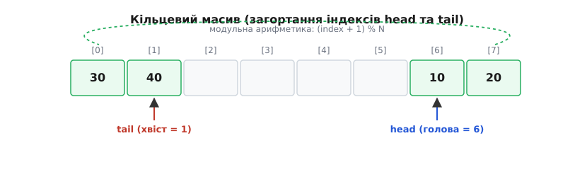
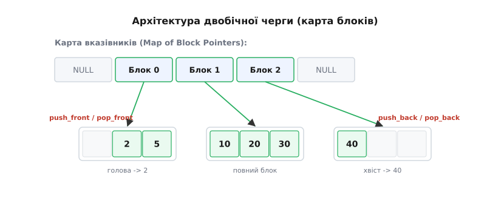
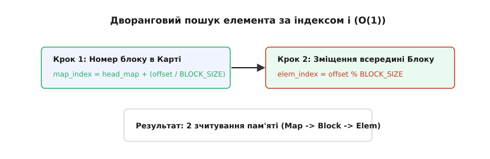

# Двобічна черга (deque)

<preknowlist>
- [Масив](topic:algorithms/array) — неперервний блок пам'яті; забезпечує швидкий доступ за індексом O(1), але вимагає зсуву всього масиву при додаванні чи вилученні елемента з початку.
- [Зв'язаний список](topic:algorithms/linked-list) — ланцюг автономних вузлів із вказівниками; дозволяє миттєво приєднувати та відривати елементи на кінцях, але не має доступу за індексом і руйнує локальність процесорного кешу.
</preknowlist>

Уяви, що ти розробляєш модуль збереження історії дій у графічному чи текстовому редакторі (системний буфер Скасувати / Повторити — Undo/Redo). Щоразу, коли користувач малює штрих або вводить символ, програма фіксує нову операцію. Якщо натискається комбінація дій скасування, остання виконана дія має бути негайно вилучена та відкатана. Це класична поведінка стека — принцип «останнім прийшов — першим пішов» (LIFO). 

Проте оперативна пам'ять комп'ютера не безмежна, тому система встановлює суворий ліміт: зберігати лише 1000 останніх дій. Коли користувач робить 1001-й крок, програма мусить зберегти його, але щоб не перевищити ліміт, вона зобов'язана одночасно видалити найстарішу, 1-шу дію. Найстаріша дія знаходиться на самому дні структури — на протилежному кінці від точки додавання.

Щоб такий буфер працював без найменших затримок інтерфейсу, структура даних повинна виконувати чотири базові операції з однаковою миттєвою швидкістю:
1. Додавати новий елемент на один кінець (запис нової дії).
2. Вилучати елемент із цього ж кінця (скасування останньої дії).
3. Вилучати елемент із протилежного кінця (виштовхування найстарішої дії при переповненні).
4. Забезпечувати миттєвий перегляд будь-якої дії за її порядковим номером (наприклад, для відображення списку з 50 останніх кроків у меню панелі).

Звичайний стек на основі масиву чи списку не здатен збалансувати ці вимоги. Нам потрібна структура, яка не має «глухої стіни» на початку і не розкидає дані по всій пам'яті. Структура, що розв'язує цю суперечність, називається **двобічною чергою** (англ. *double-ended queue*, скорочено *deque*, вимовляється як «дек»).

> 📜 [Історія виникнення двобічної черги](topic:algorithms/deque/hist-deque-origin.md) — як Дональд Кнут формалізував поняття дека у 1963 році та як Олександр Степанов адаптував його для сучасних систем у C++ STL.

---

### Чому базові класичні структури зазнають поразки

Аби зрозуміти, яка саме архітектура потрібна для двобічної черги, проаналізуємо, чому фундаментальні класичні структури пам'яті виявляються неефективними для цього завдання.

#### Межі звичайного масиву: стіна нульового індексу

Суцільний масив за своєю фізичною природою є неперервним вектором у пам'яті. Елемент із номером 0 жорстко прив'язаний до початкової адреси виділеного блоку. 
Коли ми додаємо елемент у кінець масиву (операція `push_back`), це відбувається миттєво за константний час O(1), оскільки ми просто записуємо значення у наступну вільну комірку і збільшуємо лічильник розміру.

Проте спроба додати елемент на початок масиву (операція `push_front`) або вилучити перший елемент (`pop_front`) впирається у фізичне обмеження:
- Щоб звільнити комірку з індексом 0 для нового елемента, програма мусить зсунути всі наявні N елементів на одну позицію праворуч.
- Це вимагає виконання системного копіювання пам'яті (`memmove`), яке робить N операцій запису. Часова складність становить O(N).

Якщо буфер містить 1 000 000 елементів, кожне вилучення або додавання з початку змушує процесор копіювати мільйон комірок. Навіть якщо ми спробуємо виділити «порожній простір» ліворуч від нуля, після кількох операцій цей запас вичерпається, і зсув усе одно стане неминучим.

#### Межі зв'язаного списку: руйнування кешу та втрата доступу

Двозв'язаний список легко розв'язує проблему операцій на краях. Кожен вузол списку містить значення та два вказівники — на попередній (`prev`) та наступний (`next`) вузли.
Аби додати чи вилучити елемент з будь-якого кінця, достатньо перенаправити 2–4 вказівники. Цей процес займає частки наносекунди і має сувору складність O(1).

Проте зв'язаний список розплачується за це трьома критичними недоліками:
1. **Відсутність випадкового доступу:** Вузли не лежать поруч у пам'яті. Щоб прочитати 500 000-й елемент, програма змушена послідовно пройти пів мільйона вказівників починаючи від голови. Операція доступу за індексом `operator[]` має складність O(N).
2. **Високі накладні витрати пам'яті:** На кожен корисний елемент (наприклад, 4-байтне число `int`) список вимагає 16 додаткових байтів для двох 64-бітних вказівників. Накладні витрати становлять 400% від обсягу самих даних.
3. **Процесорні затримки через Cache Miss:** Сучасні процесори зчитують дані з оперативної пам'яті не по одному байту, а блоками (Cache Line) по 64 байти у надшвидку кеш-пам'ять (L1/L2). Оскільки вузли списку виділяються через `malloc` у довільних місцях купи (Heap), перехід за вказівником майже завжди призводить до промаху кешу (Cache Miss). Процесор зупиняє обчислення і чекає сотні тактів, доки RAM видасть новий вузол.

---

### Обмежений варіант: Кільцевий масив

Якщо максимальний обсяг даних відомий заздалегідь і не змінюється під час виконання програми, двобічну чергу можна побудувати на основі кільцевого замикання звичайного масиву.

Замість фіксації початку даних на індексі 0, елементам дозволяють «плавати» всередині масиву `N`, а межі контролюються двома маркерами `head` і `tail`. Коли маркер досягає межі масиву, він перестрибує на протилежний кінець за допомогою модульної арифметики: `(head - 1 + N) % N` для руху ліворуч та `(tail + 1) % N` для руху праворуч.

```
Індекси:   [ 0 ] [ 1 ] [ 2 ] [ 3 ] [ 4 ] [ 5 ] [ 6 ] [ 7 ]
Дані:      [ 30] [ 40] [   ] [   ] [   ] [   ] [ 10] [ 20]
                   ^                             ^
                 tail                          head
```

У даному стані черга містить елементи `[10, 20, 30, 40]` у порядку від початку до кінця. Голова (`head`) вказує на найстаріший елемент `10` на індексі 6, а хвіст (`tail`) — на найновіший елемент `40` на індексі 1.


*Кільцевий масив: маркери head і tail рухаються по колу за модульною арифметикою, забезпечуючи O(1) операції без переміщення елементів у пам'яті.*

Така структура працює за точний час O(1) і має 100% кеш-локальність. Проте вона обмежена фіксованою місткістю: спроба розширити кільцевий масив при переповненні вимагає виділення нового масиву `2N` та копіювання всіх N елементів за час O(N). Детальний розбір інваріантів, варіантів розрізнення повноти й порожнечі та беззамоквих реалізацій винесено в окрему статтю [Кільцевий буфер](topic:algorithms/ring-buffer).

> ⚙️ [Реалізація кільцевої двобічної черги](topic:algorithms/deque/proj-circular-deque.md) — робочий код мовами C та C++, правила обчислення індексів без умовних операторів та захист від гонки індексів.

---

### Головне рішення: Блочна дворангова архітектура (Chunked Deque)

Щоб створити двобічну чергу, яка здатна рости до нескінченності без раптових затримок на копіювання і при цьому зберігає швидкий доступ за індексом, застосовують дворангову блочну архітектуру (саме цей підхід реалізований у `std::deque` в стандартній бібліотеці C++).

Замість того, щоб утримувати всі елементи в одному гігантському масиві, блочний дек розбиває дані на множину окремих неперервних блоків (буферів фіксованого розміру, наприклад, по 512 байтів або 64 елементи).


*Блочна двобічна черга: центральна карта вказівників керує окремими неперервними блоками фіксованого розміру, забезпечуючи миттєве розширення з обох кінців.*

#### Будова блочного дека

Структура складається з двох основних рівнів пам'яті, якими керують ітератори:
1. **Блоки елементів (Data Chunks):** Суцільні масиви фіксованого розміру `BLOCK_SIZE`. Всередині кожного окремого блоку елементи лежать один за одним, гарантуючи локальність кешу процесора.
2. **Центральна Карта (Map):** Динамічний масив вказівників, де кожен елемент є адресою одного з виділених блоків пам'яті.
3. **Складні ітератори країв:** Черга зберігає два ітератори-вказівники:
   - `head`: вказує на поточний блок у карті та на конкретну комірку всередині цього блоку, де лежить перший елемент.
   - `tail`: вказує на поточний блок у карті та комірку останнього елемента.

#### Механізм безпаузного розширення

Коли ми постійно додаємо нові елементи в кінець (`push_back`), черга заповнює вільні комірки поточного крайнього блоку за час O(1).

Коли крайній блок заповнюється повністю:
1. Програма **не копіює** наявні елементи.
2. Вона запитує в операційної системи пам'ять лише для **одного нового блоку** фіксованого розміру `BLOCK_SIZE`.
3. Вказівник на цей новий блок додається у наступну комірку центральної карти.
4. Маркер `tail` переходить на початок нового блоку.

Оскільки всі раніше створені блоки залишаються недоторканими на своїх фізичних адресах, **жоден існуючий елемент не переміщується і не копіюється**. Додавання нового блоку виконується за стабільний константний час.

Аналогічно, якщо ми додаємо елементи на початок (`push_front`) і перший блок вичерпується, система виділяє один новий блок ліворуч і додає його вказівник у початок карти.

#### Що відбувається при переповненні Карти вказівників?

З часом сам масив Карти вказівників може заповнитися. У цей момент Карта мусить розширитися (реалокуватися у новий, удвічі більший масив).

Проте ця операція копіювання є незрівнянно дешевшою за копіювання звичайного масиву:
- Карта містить не самі елементи даних (які можуть важити кілобайти або мегабайти), а лише легкі 64-бітні адреси вказівників (по 8 байтів).
- Якщо дек зберігає 1 000 000 елементів при розмірі блоку 64, карта містить лише 15 625 вказівників (всього ~125 кілобайтів даних).
- Скопіювати 125 КБ вказівників у нове місце займає мікросекунди і відбувається практично непомітно для системи. Самі ж блоки з мільйоном елементів залишаються на своїх місцях.

> 🧮 [Амортизована вартість блочної черги](topic:algorithms/deque/math-amortized-deque.md) — математичне доведення за допомогою методу потенціалів того, чому витрати на виділення нових блоків та реалокацію карти дають сувору середню складність O(1).

#### Дворанговий доступ за індексом

Як знайти `i`-й елемент у блочному деці без проходу по ланцюжку?
Завдяки однаковому фіксованому розміру всіх блоків `BLOCK_SIZE`, його позиція обчислюється математично за два кроки:

1. **Обчислення глобального зміщення:**
   `global_offset = head_offset + i`
2. **Визначення номера блоку в карті:**
   `map_index = head_map_index + (global_offset / BLOCK_SIZE)`
3. **Визначення індексу всередині блоку:**
   `block_offset = global_offset % BLOCK_SIZE`


*Обчислення індексу в блочному деці: за дві математичні операції визначається номер блоку та зміщення всередині нього, що забезпечує O(1) доступ.*

Процесор виконує лише дві операції зчитування з пам'яті: зчитує адресу блоку з карти за індексом `map_index`, а потім зчитує сам елемент за зміщенням `block_offset`. Отже, доступ за індексом `operator[]` залишається швидким і виконується за **O(1)**.

---

### Порівняльний аналіз структур даних

Щоб остаточно зрозуміти місце двобічної черги у системному програмуванні, зіставимо її характеристики з іншими послідовними контейнерами:

| Характеристика / Операція | Динамічний масив (`vector`) | Двозв'язаний список (`list`) | Кільцевий буфер (`circular`) | Блочний дек (`deque`) |
| :--- | :--- | :--- | :--- | :--- |
| **Додавання / вилучення спереду** | O(N) *(повільно)* | O(1) *(миттєво)* | O(1) *(миттєво)* | O(1) *(амортизовано)* |
| **Додавання / вилучення ззаду** | O(1) *(амортизовано)* | O(1) *(миттєво)* | O(1) *(миттєво)* | O(1) *(амортизовано)* |
| **Доступ за індексом `[i]`** | O(1) *(найшвидший)* | O(N) *(дуже повільно)* | O(1) *(миттєво)* | O(1) *(2 рівні адресації)* |
| **Локальність процесорного кешу** | 100% *(ідеальна)* | 0% *(жахлива)* | 100% *(ідеальна)* | 90–95% *(висока у блоках)* |
| **Стабільність вказівників на елементи**| Ні *(інвалідуються при розширенні)*| Так *(адреса не змінюється)*| Ні *(при перевиділенні)*| Так *(блоки не перекопійовуються)*|
| **Накладні витрати пам'яті** | Мінімальні | Дуже високі (16 байт/вузол) | Нульові | Мінімальні (на карту) |

---

### Архітектурні застосування двобічної черги

Двобічна черга — це не просто теоретична абстракція, а критичний фундаментальний інструмент у високонавантажених обчислювальних системах.

#### 1. Балансування завдань у багатоядерних процесорах (Work-Stealing Scheduler)

Сучасні середовища виконання високопаралельних мов (планувальник Go runtime, Java ForkJoinPool, Intel TBB) використовують двобічну чергу для розподілу обчислень між ядрами CPU.

- Кожне ядро процесора володіє власною локальною двобічною чергою готових до виконання задач.
- **Власне ядро** працює з одного кінця черги як зі **Стеком (LIFO)**: воно додає нові підзадачі в кінець і бере звідти ж найновішу задачу. Поведінка LIFO гарантує, що дані найсвіжішої задачі ще знаходяться в гарячому кеші L1/L2 даного ядра.
- Якщо якесь ядро закінчує свої задачі і стає вільним, воно намагається «вкрасти» робоче навантаження в іншого, перевантаженого ядра.
- **Вільне ядро-крадій** забирає задачу з **протилежного кінця (FIFO)** черги сусіда. Це вирішує дві проблеми:
  1. Зменшується конкуренція за блокування (lock contention): господар і крадій звертаються до різних кінців черги.
  2. Крадій забирає найстарішу задачу, яка зазвичай є найбільш об'ємною (верхній рівень дерева паралелізму), забезпечуючи собі тривалу роботу.

#### 2. Пошук у ширину у графах з двома вагами (0-1 BFS)

У класичному алгоритмі BFS використовується звичайна черга FIFO. Проте якщо ребра графа мають вагу 0 або 1 (наприклад, перехід у грі є безкоштовним або вимагає 1 монету), замість дорогої черги з пріоритетом (купа / Dijkstra) застосовують двобічну чергу:
- Ребра з вагою 0 додаються на **початок** дека (`push_front`), бо їхня відстань не збільшилась.
- Ребра з вагою 1 додаються в **кінець** дека (`push_back`).
Це дозволяє знаходити найкоротший шлях за оптимізований час O(V + E).

#### 3. Алгоритм ковзного вікна екстремумів (Sliding Window Maximum)

Під час обробки потокових даних (наприклад, аналіз котирувань на біржі за останні 60 секунд) виникає задача швидкого пошуку максимуму у вікні, що рухається. Використання двобічної черги у монотонному режимі дозволяє підтримувати поточний максимум за час O(1) на кожен новий елемент потоку.
