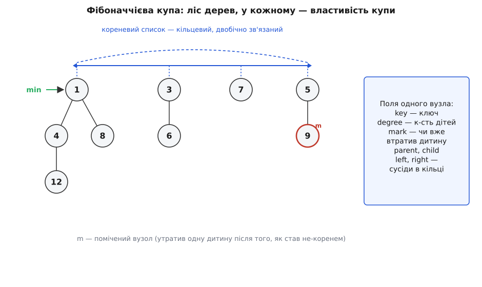
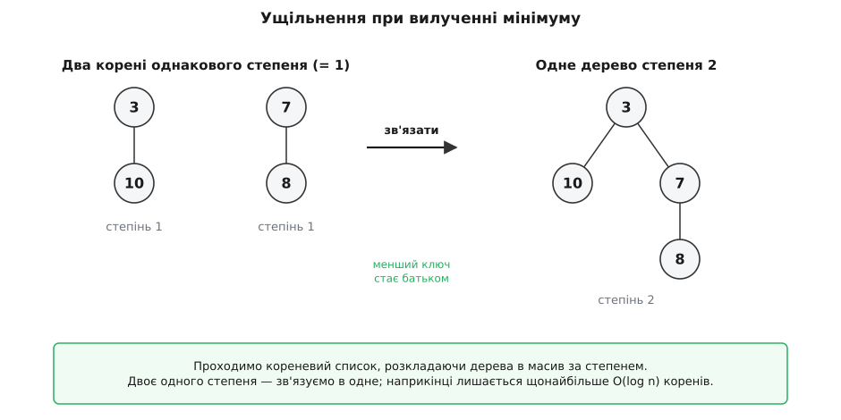
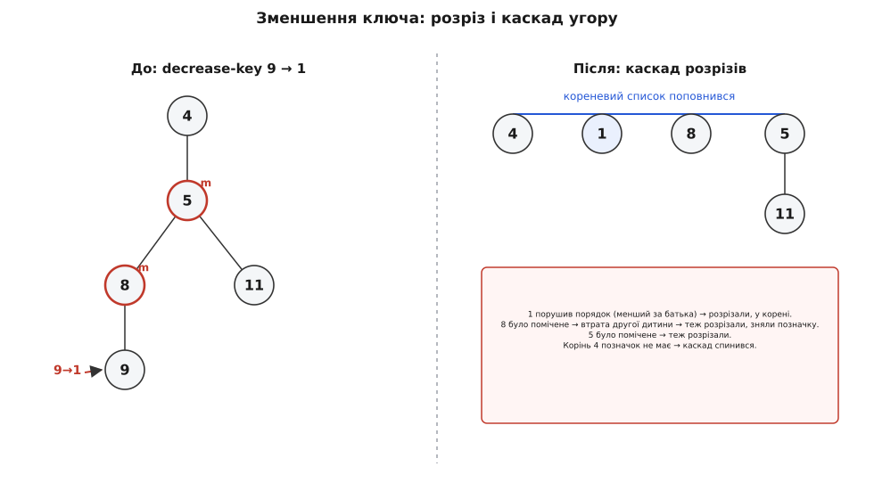

# Фібоначчієва купа

<preknowlist>
- [Черга з пріоритетом (купа)](topic:algorithms/priority-queue) — що таке купа й операції над нею: вставити, підглянути мінімум, вилучити мінімум, зменшити ключ; як звичайна двійкова купа робить їх за O(log n).
- [Амортизований аналіз](topic:algorithms/amortized-analysis) — вартість, усереднена по всій послідовності операцій, і метод потенціалу: як одна дорога операція окуповується багатьма дешевими.
- [Асимптотична складність](topic:algorithms/asymptotic-complexity) — що означають O(1), O(log n), O(E + V·log V) і як за ними порівнюють алгоритми.
</preknowlist>

Алгоритм Дейкстри шукає найкоротші шляхи так: тримає всі ще не оброблені вершини в купі за поточною оцінкою відстані, щоразу дістає найближчу, а потім для кожного її сусіда пробує **покращити** оцінку — тобто зменшити його ключ у купі. Порахуймо, скільки яких операцій він робить на графі з V вершин і E ребер. Вилучень мінімуму — рівно V, по одному на вершину. А от зменшень ключа — **до E разів**, по одному на кожне ребро, яке дало коротший шлях. [Алгоритм Дейкстри](topic:algorithms/dijkstra) саме на цьому й стоїть: вершин мало, ребер — багато.

Якщо купа звичайна, [двійкова](topic:algorithms/priority-queue), обидві операції коштують O(log V). Складаємо: V вилучень і E зменшень, кожне по O(log V), разом **O((V + E)·log V) = O(E·log V)**. Дивимось, хто тут головний: E буває аж до V² (у щільному графі майже кожна пара вершин з'єднана), тож доданок E·log V важчий за V·log V. Вартість алгоритму диктує **зменшення ключа** — операція, якої найбільше.

Ось де народжується питання. Вилучень мінімуму мало (V штук), і навіть O(log V) кожне — не страшно: разом V·log V. А зменшень ключа багато (E штук), і саме тому кожне хочеться зробити **найдешевшим — за O(1)**. Тоді сумарно вийшло б O(E + V·log V): зменшення ключа перестало б домінувати, і на щільних графах це справжній виграш проти O(E·log V). Отже, мета точна й вузька: **зменшити ключ за сталий час, не зіпсувавши всього решти.** Фібоначчієва купа — це структура, яку Фредман і Тарджан [придумали 1984 року саме заради цього](topic:algorithms/fibonacci-heap/hist-fredman-tarjan.md): пришвидшити мережеві алгоритми на кшталт Дейкстри та побудови кістякового дерева.

## Чому двійкова купа не може зменшувати ключ за O(1)

Двійкова купа тримає **суворий лад**: це повне двійкове дерево, щільно спаковане в масив, де батько завжди не більший за дітей. Зменшили ключ вузла — він міг стати меншим за батька, порядок порушено. Полагодити його можна лише **просіюванням угору**: міняти вузол з батьком, доки той не сяде на своє місце. А це шлях завдовжки з висоту дерева — до log n обмінів.

Корінь біди — саме та жорсткість. Форма мусить залишатися ідеальною після кожної дії, тож кожна дія платить повну висоту. Щоб зменшення ключа стало дешевим, треба відмовитися від суворого ладу. Але відмовитися так, щоб не втратити головного — швидкого доступу до мінімуму.

## Ідея: лінощі замість ретельності

Уся фібоначчієва купа тримається на одній думці: **не наводь лад, поки не змусили.** Роби зараз щонайменше, а прибирання відкладай — і колись, гуртом, заплатиш за все відразу. Це і є [амортизація](topic:algorithms/amortized-analysis): дорогі прибирання трапляються рідко й окуповуються морем дешевих операцій, що напрацювали на них «наперед».

Що це означає на практиці. Замість одного акуратного дерева купа тримає цілий **ліс** окремих дерев — розхристаний, різнорослий, який ніхто не зобов'язаний тримати в порядку між операціями. Вставити елемент — це кинути в ліс іще одне однокоренове деревце й пересунути, якщо треба, вказівник на мінімум. Жодного просіювання, жодного впорядкування: **O(1)** — і по всьому. Так само злити дві купи — просто зчепити два ліси в один. Порядок наведемо потім, і лише там, де без нього справді не обійтися.

> 🔧 **Навіщо це.** Обмін «зроби менше зараз — доплати потім» окупається, коли дешевих операцій набагато більше, ніж дорогих. У Дейкстри так і є: зменшень ключа (дешевих) — до E, а вилучень мінімуму (дорогих) — лише V. Відкласти роботу на рідкісне вилучення і зробити часте зменшення миттєвим — точно те, що треба цій задачі.

## Ліс дерев: як улаштована купа

Отже, купа — це набір дерев, у кожному з яких виконано **властивість купи**: ключ будь-якого вузла не більший за ключі його дітей. Наслідок той самий, що й у звичайній купі: **мінімум кожного дерева сидить у його корені**. А отже, найменший елемент усієї купи — це найменший серед коренів. Щоб не шукати його щоразу, купа тримає окремий вказівник `min` прямо на потрібний корінь.

Корені зчеплені в **кореневий список** — кільцевий, двобічно зв'язаний. Кільце (кожен знає лівого й правого сусіда, а кінці замкнені) вибрано не випадково: у такий список можна за сталий час **вкинути** новий вузол і так само за сталий час **вирвати** будь-який, не шукаючи його з початку. Діти кожного вузла зчеплені в такий самий кільцевий список між собою; батько знає лише одного зі своїх дітей (будь-якого), а решту — через їхнє спільне кільце.



*Купа — це ліс дерев, кожне з властивістю купи. Корені висять на кільцевому двобічному списку; `min` показує на найменший. Кожен вузол знає ключ, свій степінь, батька, одну дитину й двох сусідів по кільцю — плюс позначку, про яку далі.*

У коді один вузол — це проста структура з вказівниками. **Степенем** вузла (лат. *gradus* — «крок, ступінь») звуть кількість його безпосередніх дітей; він знадобиться, коли наводитимемо лад.

```c
typedef struct Node {
    int  key;                  // ключ (за ним упорядкування)
    int  degree;               // кількість безпосередніх дітей
    bool mark;                 // чи втратив дитину, відколи став не-коренем
    struct Node *parent;       // батько (NULL у кореня)
    struct Node *child;        // одна з дітей (решта — через її кільце)
    struct Node *left, *right; // сусіди в кільці (кореневому чи дитячому)
} Node;
```

Поле `mark` поки що просто стоїть — його роль з'ясується там, де почнемо зменшувати ключі. Повний код усіх операцій — від зв'язування дерев до каскадного розрізу — зібрано в [окремій реалізації на C](topic:algorithms/fibonacci-heap/proj-fib-heap.md); тут ми будуємо логіку, а не набираємо її.

## Три дешеві операції

Тепер видно, чому три операції з купою — миттєві.

**Вставити** новий ключ — це створити однокореневий вузол і вкинути його в кореневий список. Якщо він менший за поточний мінімум, пересунути `min` на нього. Ніякого впорядкування дерева: новачок просто стає ще одним самотнім деревом у лісі. **O(1).**

**Підглянути мінімум** — повернути `min->key`. Вказівник уже націлено. **O(1).**

**Злити дві купи** — зчепити два кореневі списки в один (двобічне кільце зшивається за сталий час) і лишити `min` тим із двох, чий ключ менший. **O(1).** Ця дешевизна злиття — окрема цінна властивість: [двійкова купа](topic:algorithms/priority-queue) зливається лише за O(n), бо її масив доводиться перебудовувати, а тут ліси просто зростаються.

Помітно, що весь тягар кудись зсунуто. Ліс дедалі більше захаращується самотніми деревами, мінімум усе там само на видноті, але порядку в купі нема. Борг накопичується — і колись його доведеться сплатити. Момент сплати один: **вилучення мінімуму.**

## Вилучення мінімуму: борг повертають тут

Вилучити мінімум просто лише спочатку. Корінь із найменшим ключем прибираємо; його діти лишаються без батька — піднімаємо їх усіх у кореневий список (вони й так корені своїх піддерев, властивість купи не страждає). А далі постає незручність: `min` показував на видалений вузол, і новий мінімум невідомо де. Знайти його — це пройти **весь** кореневий список, а він за час роботи розрісся до багатьох дерев.

Якщо на цьому спинитися, кореневий список лишиться довгим, і наступне вилучення знову перебиратиме його цілком — купа виродиться в лінійний список. Тому момент, коли ми **однаково змушені пройтися по всіх коренях**, використовуємо, щоб заразом навести лад — стиснути ліс. Це називають **ущільненням**.

Правило ущільнення одне: **у лісі не має лишитися двох дерев однакового степеня.** Ідемо кореневим списком і розкладаємо дерева в допоміжний масив за їхнім степенем — «комірка степеня 0, комірка степеня 1, …». Наткнулися на два дерева одного степеня — **зв'язуємо** їх: те, чий корінь має більший ключ, стає дитиною того, чий менший. Властивість купи від цього не порушується (більший ключ пішов під менший), а степінь переможця зростає на одиницю — отже, дерево переїжджає в наступну комірку, де знову може здибати рівню собі й знову зв'язатися.



*Ущільнення зустрічає два корені однакового степеня й зв'язує їх: менший ключ стає батьком більшого. Степінь зростає на одиницю. Пройшовши так увесь кореневий список, дістаємо щонайбільше по одному дереву кожного степеня.*

Це та сама механіка, що й додавання двійкових чисел стовпчиком: два однакові розряди дають перенесення в наступний. Тому й дерева виходять правильної форми — **біноміальні**: дерево степеня k, зібране самими лише зв'язуваннями, має рівно 2ᵏ вузлів. Власне, фібоначчієва купа — це «ледаче» продовження [біноміальної купи](topic:algorithms/binomial-heap), яку 1978 року придумав Жан Вюймен; різниця в тім, що біноміальна наводить лад ретельно й одразу, а фібоначчієва відкладає його до ущільнення.

**Скільки коштує ущільнення.** Ключове число — скільки різних степенів узагалі можливо. Якщо дерево степеня k має щонайменше 2ᵏ вузлів, то степінь не перевищує log₂ n: більше вузлів, ніж є в купі, не буває. Отже, комірок у масиві — лише **O(log n)**, і після ущільнення стільки ж коренів. Один прохід ущільнення коштує стільки, скільки коренів було до нього, — а їх могло назбиратися багато. Але кожен зайвий корінь колись **вкинула** туди вставка або зменшення ключа, і сплатила за нього наперед. Тому амортизовано, усередненою по всій послідовності операцій, вилучення мінімуму коштує **O(log n)** — рівно висоту, яку ми ущільненням і відновлюємо.

**Крок за кроком: ущільнюємо ліс із чотирьох коренів.** Ідемо кореневим списком зліва направо, тримаючи в масиві вже опрацьовані дерева.

```
Кореневий список:  7(степ.0)  5(степ.0)  9(степ.0)  3(степ.1)
Масив за степенем:  [0]=·  [1]=·  [2]=·

7:  [0] вільна        → [0] = 7
5:  [0] зайнята (7)   → зв'язати 5 і 7: 5<7 ⇒ 5 батько (степінь 1); [0] вільна
    [1] вільна        → [1] = 5
9:  [0] вільна        → [0] = 9
3:  [1] зайнята (5)   → зв'язати 3 і 5: 3<5 ⇒ 3 батько (степінь 2); [1] вільна
    [2] вільна        → [2] = 3
кінець:  корені 9 (степінь 0) і 3 (степінь 2) — по одному на степінь
новий min: менший із 9 і 3 ⇒ 3
```

Замість чотирьох дерев — два, і мінімум знайдено дорогою. Ліс стиснуто, борг сплачено.

## Зменшення ключа: заради нього все й затівалося

От ми й дійшли до операції, задля якої будували структуру. Зменшуємо ключ вузла. Якщо він і далі не менший за батька — нічого не сталося, купа лишилась купою, робити нема чого. Цікавий випадок — коли зменшений ключ став **меншим за батьків**: властивість купи в цьому місці порушено.

Просіювати вгору, як у двійковій купі, ми не хочемо — це знову O(log n), а ми ж бо ловимо O(1). Ледачий хід інший і напрочуд простий: **відрізати** цей вузол разом з усім його піддеревом від батька й **перенести в кореневий список** окремим деревом. Щойно вузол став коренем, батька над ним немає — отже, й порушувати нема чого, властивість купи відновлено миттю. Оновити `min`, якщо новий корінь виявився найменшим. Один розріз — **O(1)**. Саме те, чого прагнули.

Але тут ховається пастка, і вона серйозна. Розрізи **обкрадають батьків**: щоразу якийсь вузол втрачає дитину. Якщо дозволити це безкарно, дерево швидко обскубеться — з пишного стане ниточкою, довгим ланцюжком вузлів. А тоді все валиться: вся наша оцінка «степінь k ⇒ щонайменше 2ᵏ вузлів» трималася на тому, що дерева зібрані зв'язуванням і **бушисті**. Виродилися в ниточки — і степінь більше не обмежений через log n, комірок в ущільненні стає скільки завгодно, і O(log n) на вилучення зникає. Дешеве зменшення ключа зруйнувало б головну гарантію купи.

Отже, розрізати можна, але **не безкарно**. Потрібне правило, яке не дасть жодному вузлові обскубтися занадто — і водночас само коштуватиме дешево.

## Позначка й каскадний розріз: як утримати дерева бушистими

Правило таке. Кожен вузол носить **позначку** (`mark`) — один біт зі змістом «відколи я перестав бути коренем, я вже втратив одну дитину». Коли вузол через розріз втрачає дитину:

- якщо він **не позначений** — це його **перша** втрата: просто ставимо позначку й лишаємо на місці;
- якщо він **уже позначений** — це вже **друга** втрата: терпіти не можна. Ріжемо **і його теж** — переносимо в кореневий список, знімаємо позначку (корені не позначають). А оскільки, вирвавшись, він обікрав уже свого батька, те саме правило застосовуємо до батька, тоді, можливо, до діда — розріз **котиться вгору**, доки не впреться в непозначений вузол (той просто дістає першу позначку) або в самий корінь.

Оце «котиться вгору» і є **каскадний розріз** (від фр. *cascade* — «водоспад»).



*Зменшили ключ до 1 — він менший за батька, ріжемо його в корінь. Батько був уже позначений (утратив другу дитину) — ріжемо і його, позначку знімаємо; його батько теж позначений — ріжемо. Дійшли до непозначеного кореня — каскад спинився. Кореневий список поповнився кількома деревами відразу.*

Навіщо аж так — чому не дозволити втратити двох, трьох, десятьох дітей? Бо правило «щонайбільше одна втрата, друга — виліт» ставить **знизу межу на бушистість**. Якщо кожен не-корінь втрачає щонайбільше одну дитину, перш ніж сам вилетить, то дерево не встигає обскубтися в ниточку: у вузла степеня k все ще лишається чимало нащадків. Скільки саме — і є та обіцяна межа, і саме тут з'являються числа, що дали купі ім'я.

## Звідки взялися Фібоначчі

Порахуймо, наскільки бушистим лишається дерево під правилом «щонайбільше одна втрата». Питання конкретне: скільки щонайменше вузлів у піддереві, чий корінь має степінь k? Виявляється — і це доводять строго — не менше за **(k+2)-ге число Фібоначчі**: у вузла степеня k разом з ним самим щонайменше F₍ₖ₊₂₎ нащадків. [Числа Фібоначчі](topic:math/fibonacci-numbers) (названі на честь Леонардо Пізанського, прозваного Fibonacci — *filius Bonacci*, «син Боначчі») — це послідовність 1, 1, 2, 3, 5, 8, 13, 21, …, де кожне наступне дорівнює сумі двох попередніх. Через це купа й зветься **фібоначчієвою**.

Числа Фібоначчі ростуть **експоненційно**: F₍ₖ₊₂₎ ≥ φᵏ, де φ = (1 + √5)/2 ≈ 1.618 — **золотий перетин**. А коли кількість вузлів піддерева степеня k не менша за φᵏ, то степінь не може розігнатися: якщо n вузлів у всій купі, то n ≥ φᵏ, а звідси

```
n ≥ φ^k
k ≤ log_φ(n) = log(n) / log(φ) ≈ 1.44 · log₂(n)
```

Отже, найбільший можливий степінь **D(n) = O(log n)** — точно як і без розрізів, лише з трохи слабшою сталою: замість 2ᵏ тепер φᵏ, а що база менша (φ < 2), то піддерево набирає той самий степінь із меншою кількістю вузлів — межа степеня трохи вища, зате й далі логарифмічна. Головне вціліло: комірок в ущільненні знову лише O(log n), а отже, вилучення мінімуму лишається O(log n). Каскадний розріз зробив саме те, задля чого його вводили: дозволив дешеві розрізи й **не дав** деревам виродитися. Повне доведення межі й точний підрахунок амортизованих вартостей — в [окремому математичному розборі](topic:algorithms/fibonacci-heap/math-fibonacci-bound.md).

## Чому все сходиться амортизовано

Лишилося переконатися, що каскадний розріз, попри свою назву-водоспад, не робить зменшення ключа дорогим. Адже один такий розріз може прокотитися вгору через багато вузлів — де ж тут O(1)?

Тут працює [метод потенціалу](topic:algorithms/amortized-analysis). Заведімо на купу «скарбничку» — число, що зростає, коли ми лишаємо в структурі неприбраний безлад, і меншає, коли лад наводимо. Береться воно так:

```
Φ = (кількість дерев у лісі) + 2 · (кількість позначених вузлів)
```

Кожна вставка додає в ліс одне дерево — кладе в скарбничку одиницю, якою потім оплатиться його зв'язування під час ущільнення. Кожна перша втрата дитини **ставить позначку** — теж поповнює скарбничку (з коефіцієнтом два: одна одиниця оплатить майбутній розріз цього вузла, друга — те, що, вилетівши, він обікраде батька й розкрутить каскад далі). Тому коли каскад нарешті спрацьовує, кожен його розріз **уже оплачений** позначкою, яку колись поставили; довгий каскад лише **спорожнює** заздалегідь наповнену скарбничку, а не коштує щоразу заново. Амортизовано зменшення ключа виходить **O(1)** — попри можливий довгий каскад.

Та сама скарбничка платить і за вилучення мінімуму: ущільнення прибирає з лісу зайві дерева (Φ падає рівно на стільки, скільки коренів воно злило), і цей спад покриває вартість проходу. Лишається чистими O(log n) — на новий, уже стиснутий, кореневий список і оновлення `min`.

## Вилучення довільного вузла — задарма

Маючи дешеве зменшення ключа й уже наявне вилучення мінімуму, купа безкоштовно дістає ще одну операцію — **вилучити будь-який вузол**, а не лише найменший. Прийом одноходовий: зменшуємо ключ потрібного вузла до −∞. За правилом зменшення ключа він миттю відрізається в кореневий список і стає новим мінімумом — меншого за −∞ бути не може, тож `min` неодмінно переїде на нього. Тепер це найменший елемент купи, і звичайне вилучення мінімуму його прибирає. Разом — амортизовано **O(log n)**, як і саме вилучення мінімуму; жодного нового механізму не знадобилося. Це довільне вилучення за O(log n) Фредман і Тарджан і виділяли окремо, коли описували, що купа вміє.

## Підсумкова таблиця й де тут виграш

Зберімо всі вартості разом — і поруч ті самі операції для звичайних куп.

```
Операція           Двійкова купа   Біноміальна купа   Фібоначчієва купа
                                                       (амортизовано)
вставити           O(log n)        O(log n)           O(1)
мінімум            O(1)            O(log n)           O(1)
вилучити мінімум   O(log n)        O(log n)           O(log n)
вилучити вузол     O(log n)        O(log n)           O(log n)
зменшити ключ      O(log n)        O(log n)           O(1)
злити (union)      O(n)            O(log n)           O(1)
```

Три операції, які у двійковій купі коштували log n, — вставка, зменшення ключа, злиття — у фібоначчієвій стали сталими. Дорогим лишилося тільки вилучення мінімуму, і то амортизовано: саме на нього зсунуто весь відкладений борг. Повернімося до Дейкстри, з якого починали: V вилучень по O(log V) і E зменшень по O(1) дають

```
V · O(log V) + E · O(1) = O(E + V·log V)
```

Точно той результат, задля якого структуру й вигадали, — і асимптотично найкращий відомий для Дейкстри та для побудови [мінімального кістякового дерева](topic:math/spanning-tree) алгоритмом Пріма на щільних графах.

> 🔧 **Навіщо це.** O(E + V·log V) проти O(E·log V) — це не косметика. На щільному графі, де E ~ V², перше дає ≈ V², друге ≈ V²·log V: множник log V зникає з домінантного доданка. Для великих мереж (маршрутизація, планування, аналіз соцграфів) саме прибирання цього log і є різницею між «встигає» й «ні».

## Чесна межа: коли її насправді беруть

Асимптотика — не вся правда. За красивими O(1) ховаються **великі сталі множники** й недружня до кеша реалізація: ліс на вказівниках означає, що обхід стрибає пам'яттю навмання, а процесор любить суцільні масиви. Кожен вузол несе п'ять вказівників, степінь і позначку — це помітні накладні витрати пам'яті проти компактного масиву двійкової купи. Плюс сам код помітно складніший: каскадні розрізи, кільцеві списки, ущільнення з масивом за степенем — усе це легко наплутати.

Тому на практиці фібоначчієву купу беруть рідше, ніж могло б здатися з таблиці. На звичайних, не надто щільних графах проста двійкова (чи d-арна) купа з її суцільним масивом часто **обганяє** фібоначчієву на реальних даних — попри гірший папір, — бо краще лягає на кеш і має менші сталі. Там, де потрібні саме дешеві злиття й зменшення ключа, нерідко беруть простішу **парувальну купу** (pairing heap): вона майже так само добра теоретично, а на практиці швидша й куди легша в реалізації. Фібоначчієва купа світить передусім там, де важлива теоретична гарантія — доводять оцінки алгоритмів, будують інші структури поверх неї, працюють з гранично щільними графами.

Її головна цінність — не стільки готовий інструмент на щодень, скільки **ідея**: відкласти впорядкування, накопичити безлад, а тоді сплатити за нього гуртом у єдиній рідкісній операції — і показати строго, через числа Фібоначчі, що така лінь не руйнує гарантій, а лише перерозподіляє вартість туди, де її не шкода.
