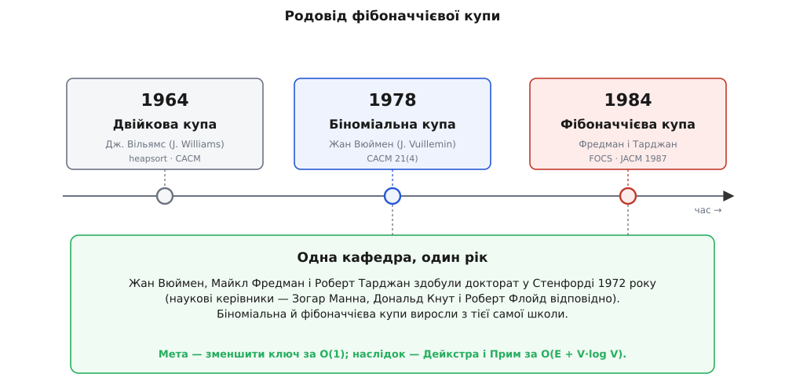

# 📜 Народження фібоначчієвої купи: як зняли логарифм із мережевих алгоритмів

Восени 1984-го на 25-му симпозіумі FOCS (Foundations of Computer Science) у Вест-Палм-Біч, штат Флорида, двоє американських дослідників показали структуру даних, придуману не задля себе самої, а щоб **пришвидшити чужі алгоритми** — і прибрали цілий множник `log` із найшвидших тодішніх обчислень на графах. Стаття називалася «Fibonacci heaps and their uses in improved network optimization algorithms» — «Фібоначчієві купи та їхнє застосування в покращених алгоритмах мережевої оптимізації». Автори — **Майкл Фредман** (Michael L. Fredman) і **Роберт Тарджан** (Robert E. Tarjan). Повна, журнальна версія вийшла лише за три роки, 1987-го, у Journal of the ACM (том 34, №3, с. 596–615), — і саме її зазвичай цитують.

Заголовок каже головне вже сам: у центрі не купа, а **мережеві алгоритми**, яким купа має служити. Щоб зрозуміти, звідки вона взялася, спершу треба побачити, що саме муляло.

## Вузьке місце, за яким полювали

На початку 1980-х улюбленим спортом теоретиків була **мережева оптимізація** — найкоротші шляхи, найдешевші кістяки, потоки — і питання стояло вузько: скільки коштує реалізувати чергу з пріоритетом усередині цих алгоритмів. [Алгоритм Дейкстри](book:algorithms/dijkstra) шукає найкоротші шляхи від однієї вершини, тримаючи ще не оброблені вершини в купі за оцінкою відстані й раз по раз **покращуючи** ці оцінки — тобто зменшуючи ключі. На графі з V вершин і E ребер вилучень мінімуму в нього рівно V, а зменшень ключа — до E, по одному на кожне ребро, що дало коротший шлях.

Ще 1977 року Дональд Джонсон (Donald B. Johnson) вичавив із цього d-арні купи й дістав для Дейкстри на розріджених графах кращу межу, ніж проста двійкова купа. Але один доданок лишався твердим: зменшення ключа коштувало O(log) кожне, а їх — аж E. Саме він і диктував усю вартість на щільних графах. Мета, отже, визріла точна й зухвала: **зробити зменшення ключа за сталий час**, не зіпсувавши решти. Хто це вміє — той знімає з Дейкстри останній зайвий логарифм.

## Дві купи до фібоначчієвої

Купа як ідея була не нова. Ще 1964-го Дж. Вільямс (J. W. J. Williams), описуючи сортування heapsort, увів **двійкову купу** — повне дерево, туго спаковане в масив. Вона тримала суворий лад і платила за нього: будь-яка зміна просіювалася вгору чи вниз за O(log n), а злити дві такі купи можна лише за O(n), перебудувавши масив.

1978-го француз **Жан Вюймен** (Jean Vuillemin) зробив наступний крок — [біноміальну купу](book:algorithms/binomial-heap): не одне дерево, а **ліс** біноміальних дерев розмірів 1, 2, 4, 8, …, де два дерева однакового розміру зчеплюються, наче перенесення при додаванні двійкових чисел стовпчиком. Це дало дешеве злиття — O(log n) замість O(n). Та впорядкування біноміальна купа наводила **ретельно й одразу**, тож зменшення ключа їй усе одно коштувало O(log n). Ліс уже був — бракувало **ліні**.

Ось точна щілина, у яку ступили Фредман і Тарджан: узяти лісову будову Вюймена, але перестати наводити в ній лад між операціями. Робити щонайменше зараз, а прибирання відкласти — і сплатити гуртом у єдиній рідкісній операції.

## Три докторати, одна кафедра

Тут історія робить несподіваний виток. **Роберт Тарджан** — одна з центральних постатей в алгоритмах XX століття: аналіз об'єднання-пошуку, компоненти сильної зв'язності, планарність, splay-дерева. **Майкл Фредман** уславився нижніми оцінками складності й пізнішими fusion-деревами. **Жан Вюймен**, чию купу вони брали за основу, — французький піонер інформатики, згодом професор Вищої нормальної школи в Парижі. Здавалося б, троє різних людей із двох континентів.

А насправді всі троє захистили докторат **в одному місці й одного року**: Стенфорд, 1972-й — Фредман у Дональда Кнута (Donald Knuth), Тарджан у Роберта Флойда (Robert W. Floyd), Вюймен у Зогара Манни (Zohar Manna). Біноміальна купа й фібоначчієва, розділені дванадцятьма роками, виросли, по суті, з тієї самої стенфордської школи алгоритмів початку 1970-х.

І ще один збіг у часі, уже не людський, а ідейний. Саме в ці роки Тарджан викристалізовував **[амортизований аналіз](book:algorithms/amortized-analysis)** як окремий метод — його програмна стаття «Amortized computational complexity» вийшла 1985-го, майже поруч із фібоначчієвою купою. Амортизований аналіз міряє не найгіршу окрему операцію, а середню в довгій послідовності: дорога дія окуповується морем дешевих, що доплатили за неї наперед. Фібоначчієва купа стала **взірцевим прикладом** цього способу мислити — «самопристосовною» структурою, яка накопичує безлад і платить за нього оптом. Метод і структура народилися майже разом і підсвітили одне одного.



*Родовід фібоначчієвої купи: строга двійкова (Вільямс, 1964), легка до злиття біноміальна (Вюймен, 1978), ледача фібоначчієва (Фредман і Тарджан, 1984). Три структури — і несподіваний людський вузол: Вюймен, Фредман і Тарджан усі троє захистилися в Стенфорді 1972 року.*

## Чому «фібоначчієва»

Назва — не примха й не маркетинг: вона показує пальцем на доведення. Коли зменшення ключа стало дешевим, з'явилася загроза, що дерева обскубуться в ниточки й уся економія завалиться. Рятує правило «не-корінь втрачає щонайбільше одну дитину, а на другій — вилітає й сам». Це правило ставить знизу межу на пишність дерева, і межа виходить напрочуд точна: у піддереві, чий корінь має степінь k, вузлів не менше за (k+2)-ге **[число Фібоначчі](book:math/fibonacci-numbers)**. Числа Фібоначчі — послідовність 1, 1, 2, 3, 5, 8, 13, …, де кожне дорівнює сумі двох попередніх; вони ростуть експоненційно, як φᵏ (φ = (1 + √5)/2 ≈ 1.618). А коли піддерево степеня k має щонайменше φᵏ вузлів, найбільший степінь не може перевищити ≈ 1.44·log₂ n — і логарифмічна гарантія вціліла.

Саме цей Фібоначчіїв нижній поріг на розмір дерева й дав купі ім'я. Послідовність, до речі, європейці дістали від Леонардо Пізанського (Leonardo of Pisa), прозваного Fibonacci — «син Боначчі», — який 1202 року розписав нею задачку про кролів у «Книзі абака». Від середньовічних кролів до черги в Дейкстрі — несподівано пряма лінія.

## Що обіцяв заголовок

Слова «network optimization algorithms» в назві стоять у множині — і не для краси. У тій самій статті Фредман і Тарджан виклали цілий врожай наслідків. Дейкстра й побудова [мінімального кістякового дерева](book:math/spanning-tree) алгоритмом Пріма (черга з пріоритетом і те саме зменшення ключа) дістали

```
O(E + V·log V)
```

— асимптотично найкраще з відомого для щільних графів. Для найкоротших шляхів це означало межу O(m + n·log n) замість колишньої O(m·log n). Мало того, у тій-таки роботі автори дали власний алгоритм кістякового дерева, що біг за

```
O(m · β(m, n)),   β(m, n) = min{ i : log⁽ⁱ⁾ n ≤ m/n }
```

— тобто практично **лінійно** за числом ребер: β(m, n) росте страшенно повільно, це по суті ітерований логарифм log* n, який для будь-якого мислимого n не перевищує 5. Помолодшала й класична задача про призначення. Одна структура даних — і ціла полиця алгоритмів скинула по логарифму.

## Слава і тінь слави

Тарджан на той час уже був живим класиком; 1986 року він разом із Джоном Гопкрофтом (John Hopcroft) дістав премію Тюрінга «за фундаментальні досягнення в побудові й аналізі алгоритмів і структур даних». Фібоначчієва купа міцно ввійшла в підручники — і водночас стала **хрестоматійним застереженням**: структура, теоретично неперевершена, на реальних даних часто програє простішій двійковій купі через великі сталі множники й недружбу з кешем. Красива межа на папері не завжди виграє гонку в пам'яті.

Тому історія на статті 1987 року не спинилася — вона розгалузилась у пошук чогось так само сильного, але легшого. Уже 1986-го той-таки дует, тепер із Робертом Седжвіком (Robert Sedgewick) і Деніелом Слейтором (Daniel Sleator), запропонував **парувальну купу** (pairing heap) — простішу й на практиці прудкішу, хоч і хитрішу для аналізу. Згодом з'явилися релаксовані, тонкі, рангові й навіть «строгі» фібоначчієві купи, що дають ті самі оцінки вже в найгіршому, а не лише в амортизованому випадку. Але всі вони — нащадки однієї думки, показаної 1984-го: **відклади лад, накопич борг, заплати оптом — і доведи числами Фібоначчі, що така лінь нічого не руйнує.**
