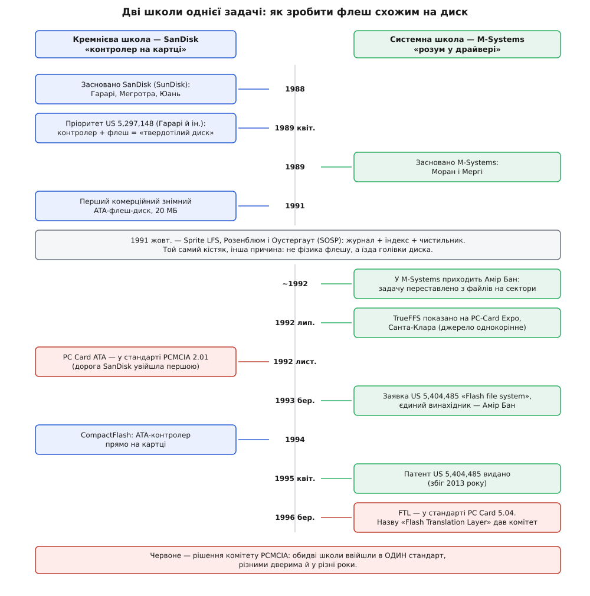
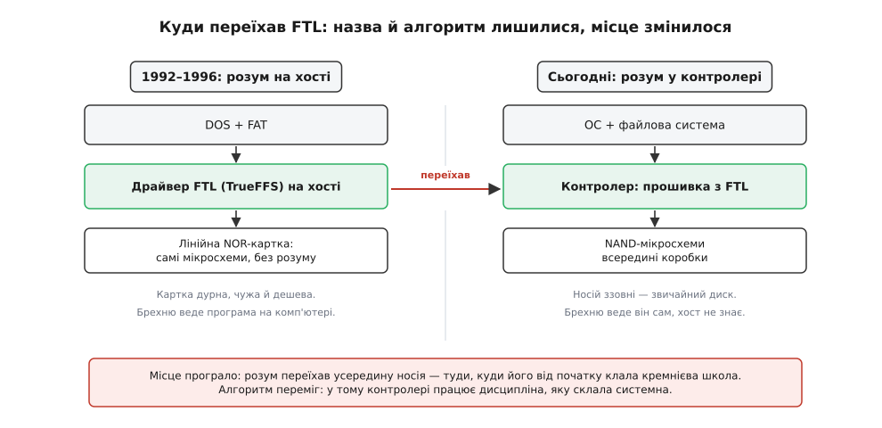

# 📜 Як флеш навчився брехати, що він диск

Наприкінці 1980-х флеш-пам'ять уже існувала, і її можна було просто купити. Intel продавала мікросхеми NOR-флешу: вони не забували даних без живлення, не мали жодної рухомої деталі, не боялися трясіння й не помирали від падіння зі столу. Поруч із обертовим диском, який у ноутбуці гудів, грівся, їв батарею й розсипався від удару, це виглядало як очевидне майбутнє.

І майже ніхто не міг цим скористатися.

Завада була не в мікросхемі, а поверхом вище — у програмах. Кожна файлова система, будь-коли написана людством, спиралася на одну мовчазну обіцянку носія: сектор можна перезаписати. Не «прочитати», не «дописати» — саме **перезаписати**, будь-коли й будь-скільки разів. На цій обіцянці трималося все: FAT переписувала свої таблиці, каталог оновлював запис про файл, лічильник вільних кластерів мінявся щоразу. Флеш цієї обіцянки не виконував і не міг виконати: [його фізика дозволяє стирати лише цілими блоками](book:programming/flash-internals), а писати — тільки на стерте.

Отже, перед новим носієм стояла розвилка, і обидві дороги виглядали кепсько. Перша: хай увесь світ перепише свої файлові системи під тебе. Це не «важко» — це неможливо, бо на дворі DOS, FAT зашита в мільйони машин, і жоден виробник ноутбуків не буде переписувати операційну систему заради чиєїсь дивної мікросхеми. Друга дорога: **навчися брехати**. Удавай звичайний диск — так переконливо, щоб FAT нічого не запідозрила.

Уся ця історія — про те, як другу дорогу проходили двічі, з двох різних боків, дві компанії, що ненавиділи підходи одна одної. І про те, чому переможцем зрештою вийшла назва, вигадана комітетом.

## Дві школи: кремнієва й системна

Одну спробу зробили в Каліфорнії. **SanDisk** — спершу вона звалася SunDisk — заснували 1988 року **Елі Гарарі** (Eli Harari), **Санджай Мегротра** (Sanjay Mehrotra) і **Джек Юань** (Jack Yuan). Гарарі був людиною кремнію: він розумів фізику плаваючого затвора й дивився на задачу з боку мікросхеми. Його відповідь була така: якщо флеш не вміє прикидатися диском сам, впаяймо поруч із ним **контролер**, який це вміє. Картка назовні відповідає на команди ATA, як звичайний вінчестер, а всередині робить, що хоче, — і хост про це ніколи не дізнається.

Це не постфактумна реконструкція, а те, що вони одразу оформили патентом. Заявка US 5,297,148 «Flash EEprom system» (винахідники **Еліяху Гарарі**, **Роберт Норман**, **Санджай Мегротра**) має пріоритет від **13 квітня 1989 року**, а видана вона **22 березня 1994-го**; в анотації прямо сказано, що система мікросхем флешу з керівними схемами служить енергонезалежною пам'яттю на кшталт тієї, що її дають магнітні диски. Там уже є перевідображення дефектних комірок через покажчики дефектів і контролер, який ховає сектори від хоста. **Статус: усталено** (первинне джерело — сам патент). 1991 року SanDisk випустила перший комерційний знімний флеш-диск на 20 МБ з інтерфейсом ATA, а 1994-го — CompactFlash, де ATA-контролер сидів прямо на картці.

Другу спробу робили в Ізраїлі. **M-Systems** заснували **1989 року** **Дов Моран** (Dov Moran) і **Ар'є Мергі** (Aryeh Mergi) — спершу вона називалася Dikla, потім Moran Systems, і лише згодом стала M-Systems. Ці двоє прийшли із зовсім іншого боку: вони були не кремнієвики, а системники. Моран сам описує різницю без жодної дипломатії: SanDisk походить від *sand*, піску, тобто кремнію; вони ж були M-Systems — системні хлопці, які розуміли системи.

І звідси випливала протилежна відповідь на ту саму задачу. Навіщо паяти контролер, якщо брехати можна **програмою**? Хай картка буде дурною — просто ряд звичайних мікросхем NOR-флешу, які будь-хто купить в Intel чи AMD. А весь розум хай живе в драйвері на хості: він приймає від DOS команду «запиши сектор», а сам вирішує, куди насправді її покласти.

Різниця між двома школами була не в смаку, а в грошах і владі. Кремнієвий шлях означає, що ти мусиш робити мікросхему — а отже, мати фабрику, або принаймні власний контролер. Системний шлях означає, що ти продаєш дискету з драйвером і їздиш по чужі мікросхеми на ринок. Зате системний шлях працює на **будь-якому** чужому флеші — і саме ця незалежність від заліза виявиться в цій історії важливішою за все інше.

## Глухий кут перед SCSI-диском

Тільки от системний шлях уперся в стіну майже одразу, і це найцікавіша частина історії — бо вперлися вони не в брак уміння, а в саму будову задачі.

Моран і Мергі познайомилися ще на флоті: Моран (нар. 1955 в Ізраїлі) після Техніону служив у ВМС Ізраїлю, керував там комп'ютерним відділом, а потім очолив відділ мікропроцесорів — і Мергі працював у нього. Коли Моран заснував свою фірму, він покликав тих самих людей. Вони бралися за будь-яку системну роботу, і серед іншого взялися будувати флеш-накопичувач із інтерфейсом SCSI.

І тут з'ясувалося, що вони не вміють. В усній історії, записаній Музеєм історії комп'ютерів 2020 року, Мергі згадує цей момент напрочуд відверто: вони побачили, що їхні алгоритми не досконалі, не оптимальні, спробували знайти розв'язок — і не знайшли його. Не «довго шукали», не «мали дрібні негаразди» — просто не знайшли.

Варто зрозуміти, у що саме вони вперлися, бо це не порожні слова про «складність». Зробити дурний шар, який кладе новий запис на вільне місце, легко — це кілька вечорів роботи. Складне починається на другому колі: вільні сторінки закінчуються, треба збирати сміття, збирання сміття саме породжує записи, записи зношують блоки, знос треба розрівнювати, а розрівнювання знову породжує записи. Кожен важіль смикає всі інші. Вийти з цього кола так, щоб система не захлинулася й не зносила флеш до смерті за місяць, — це вже не програмування, а задача на рівновагу, де треба бачити конструкцію цілком.

Тоді Моран сказав, що має друга з Техніону — генія з оцінками «A з плюсом», якого треба привести. Так у компанії з'явився **Амір Бан** (Amir Ban) — за словами Морана, приблизно на третій рік існування фірми, тобто десь 1992-го, і став першим віцепрезидентом з програмного забезпечення. І, як прямо каже Мергі, саме Амір був тим, хто придумав розв'язок TrueFFS, який згодом став FTL — основою керування флешем донині.

Що ж такого побачив Бан, чого не бачили двоє досвідчених системників? Він **перестав розв'язувати задачу, яку вони собі поставили**. Вони питали: «як зробити файлову систему для флешу?» — і застрягли, бо файлова система знає про файли, каталоги, атрибути, і кожне з цих понять треба було якось припасувати до стирання блоками. Бан спитав інакше: **а навіщо взагалі знати про файли?** Досить брехати рівнем нижче — на рівні сектора. Хай нагорі лишиться звичайна FAT, яка нічого не підозрює, а знизу буде маленький упертий шар, який знає рівно одне: логічний номер сектора й фізичне місце. Уся семантика файлів залишається чужою проблемою.

Це те саме зміщення погляду, що двигає половину гарної інженерії: не розв'язувати важку задачу, а знайти те місце, де вона не важка.

## Ім'я як шпилька: звідки взявся «TrueFFS»

І тут з історією стається кумедна річ: розв'язок був точний, а назва — навпаки, кричуще неточна. Причому автори про це прекрасно знали.

На той час Intel і Microsoft уже просували свій шар для флешу й назвали його **FFS** — *Flash File System*, потім вийшло друге покоління, FFS2. Він робив емуляцію на рівні **файлу**. Різницю Моран пояснює просто: файл можна було записати, файл можна було стерти. А от відкрити файл із контактами й **змінити в ньому один контакт** — не можна. Треба було стерти попередній файл і записати новий. У M-Systems уважали це дуже поганим рішенням — і зробили справжню емуляцію жорсткого диска на рівні сектора.

Звідси й назва. Моран розповідає це майже зі стогоном: спершу вони дали своїй програмі ім'я — і воно було жахливе. TrueFFS означало приблизно «у них є FFS — а гей, у нас справжній». І сам-таки додає: дуже дурне, визнаю.

Дурне воно з подвійної причини. По-перше, це шпилька конкурентові, вбудована в назву продукту, — маркетинг, а не суть. По-друге, і головне: **TrueFFS взагалі не був файловою системою**. Моран каже це прямо: FFS означає flash file system, але практично вони не робили файлової системи — вони зробили емуляцію диска, не на рівні файлу, а на рівні сектора. Тобто назва хвалилася тим, що продукт «справжніший» у категорії, до якої він не належав.

Історія цю неточність згодом мовчки виправила — і зробила це чужими руками, про що трохи далі.

Публічно TrueFFS показали як програмний продукт на виставці **PC-Card Expo в Санта-Кларі (Каліфорнія) у липні 1992 року**. Тут варто чесно позначити доказовість: це твердження ходить по довідниках, але всі його сліди сходяться до однієї статті у Вікіпедії та її дзеркал; незалежного сучасного події джерела — репортажу, каталогу виставки — я не знайшов. **Статус: правдоподібно й широко повторюване, але однокорінне.** Загальна ж канва — що на початку 1990-х TrueFFS існував і продавався як програма для лінійних флеш-карток — підтверджена самим продуктом: у документації до TrueFFS-95 стоїть копірайт «1995–1997 M-Systems Flash Disk Pioneers Ltd.», адреса в Тель-Авіві, і перелік підтримуваних карток — Intel Series-2, AMD Series-D, Fujitsu Series-D, картки самої M-Systems і навіть статичні RAM-картки.

Зверніть увагу на цей перелік: усе це **чужий** флеш. У ньому й полягала вся ставка системної школи.

## Патент US 5,404,485: що в ньому справді нове

Заявку **08/027,131** подали **8 березня 1993 року**; патент **US 5,404,485 «Flash file system»** видали **4 квітня 1995-го**. Єдиний винахідник — **Амір Бан**, правовласник — M-Systems Flash Disk Pioneers Ltd. **Статус: усталено** (первинне джерело — реєстрова справа патенту).

Що всередині — коротко, бо механіка цих речей заслуговує на окрему розмову, а не на переказ у історичній довідці. Патент описує таблицю віртуальних адрес, яка переводить віртуальну адресу у фізичну; стани блоку (вільний, записаний, вилучений); і **transfer unit** — окремий блок, що його тримають порожнім спеціально на те, щоб було куди перенести живі дані перед стиранням. Плюс те, чого до нього в такому вигляді не було: перенесення активних даних із блоків, де назбиралося вилучене, у свіже, ще не записане місце з наступним стиранням вихідного блоку — тобто [вирівнювання зносу](book:programming/wear-leveling) як частина того самого механізму.

Тепер про слово «перший», з яким треба бути обережним, бо тут легко збрехати в обидва боки.

**Хибно** сказати, що Бан перший придумав, як зробити флеш схожим на диск. Не перший: пріоритет патенту Гарарі — квітень 1989-го, на чотири роки раніше, і там уже є і контролер, що вдає диск, і перевідображення дефектів. **Хибно** й протилежне — мовляв, Бан лише повторив зроблене в SanDisk на софті. Різниця істотна: у Гарарі перевідображення служить насамперед **для обходу дефектів** — знайшли биту комірку, підставили запасну; ідеї «пиши завжди на нове місце, а старе оголошуй сміттям, і рівномірно зношуй усе» як цілісної дисципліни там немає.

Точне формулювання буде таке. Бан не винайшов ідею брехні. Він винайшов **конкретний, повний і опублікований механізм** цієї брехні, що працює **програмою на чужому, звичайному флеші** й тримає всі важелі водночас: непряме відображення, збирання сміття через запасний блок, вирівнювання зносу, [обхід битих блоків](book:programming/bad-block-management). І — що зрештою виявилося важливішим за сам винахід — цей механізм став **форматом даних**, який можна записати в стандарт і якого можуть дотримуватися чужі люди. Ідея, реалізація, продукт і стандарт — чотири різні речі, і слава дістається тому, хто пройшов усі чотири.

Патент, до речі, давно помер: розрахунковий кінець строку — **8 березня 2013 року**, статус у реєстрі — «Expired — Lifetime». Права по дорозі переїхали до SanDisk IL, а звідти до Western Digital Israel.

## Рік у Каліфорнії: як TrueFFS став стандартом

Далі починається частина, яку інженери зазвичай проминають, а вона тут вирішальна.

Мати кращий продукт мало. Треба, щоб твій формат став **тим самим**, який усі підтримують, — бо картку купують не заради картки, а заради того, що вона працює в будь-якому ноутбуці. Отже, воювати треба було не в лабораторії, а в комітеті PCMCIA.

Моран описує свій хід без зайвої скромності: вони почали просувати запропоноване ними як новий стандарт до комітету PCMCIA, і одна з речей, яку, на його думку, вони зробили дуже добре, — це те, що він відправив Мергі до Каліфорнії **на рік**, аби той поставив їхній TrueFFS, він же FTL, за стандарт проти flash file system. І додає: якби вони цього не зробили, вся індустрія емуляції флешу як диска пішла б, на його переконання, зовсім інакше.

Ось де народилася назва, яка живе досі. **FTL — Flash Translation Layer — це не ім'я продукту M-Systems, це офіційна назва від комітету PCMCIA.** Моран сам це так і уточнює. Комітет, сам того не плануючи, зробив компанії найкращий подарунок: викинув брехливе «file system» і назвав річ тим, чим вона є, — **шаром трансляції**. Точна назва пережила і продукт, і компанію, і патент.

А тепер — про дату, з якою в довідниках безлад.

Ходовим є твердження, що «близько 1994 року PCMCIA затвердила специфікацію FTL на основі TrueFFS». Проте офіційна історія випусків самого стандарту PC Card каже інше. У ній чорним по білому:

```
PCMCIA Standard Release 2.01 — листопад 1992
  • PC Card ATA Specification            ← дорога SanDisk: контролер на картці
  • Type III Form Factor
  ...
PC Card Standard Release 5.0 — лютий 1995
  • CardBus 32-bit Bus Mastering Interface
  ...
PC Card Standard 5.04 Update — березень 1996
  • Added Zoomed Video (ZV Port) Custom Interface
    and Flash Translation Layer (FTL)    ← дорога M-Systems, аж тепер
```

Тобто формально FTL додали до стандарту PC Card **оновленням 5.04 у березні 1996 року** — і це на півтора-два роки пізніше за ходову дату «~1994». **Статус: суперечливо.** Розв'язати суперечність можна двома способами, і обидва правдоподібні: або «1994» стосується схвалення в комітеті, яке передувало публікації в тексті стандарту (робота ж тривала роками — рік Мергі в Каліфорнії десь тут і лежить), або це просто неточність, що розповзлася з однієї статті. Що можна стверджувати твердо: **робота припала на 1993–1995, а документоване входження в стандарт — березень 1996-го.**

І гляньте, що стоїть у тій самій хронології **раніше** за FTL, аж у листопаді 1992-го: **PC Card ATA Specification**. Дорога Гарарі увійшла в стандарт на три роки раніше за дорогу Морана. Обидві школи потрапили в один документ — просто різними дверима й у різні роки.


*Дві школи йшли до однієї мети вісім років і зійшлися в одному документі. Ліва колонка починає раніше: SanDisk заснована 1988-го, пріоритет патенту Гарарі — квітень 1989-го, і саме ATA-дорога першою потрапляє в стандарт PCMCIA (листопад 1992). Права колонка стартує з відставанням і надолужує головою Бана: 1992 — переставлена задача, березень 1993 — заявка, квітень 1995 — патент, березень 1996 — FTL у стандарті. Осторонь, поза обома школами, стоїть Sprite LFS 1991 року: та сама анатомія, вигадана в Берклі з іншої причини.*

Що специфікація FTL справді існувала й була формальна, видно з дрібниці, яку годі підробити. Кожна FTL-картка мусила нести на собі підпис — кортеж у своїй структурі інформації:

```
46 39 00 46 54 4C 31 30 30 00
│  │  │  └─────────────────┴─ "FTL100" і нульовий термінатор
│  │  └─ TPLORG_TYPE = 0 — тип «файлова система»
│  └─ TPL_LINK = 39h = 57 байтів далі
└─ TPL_CODE = 46h — CISTPL_ORG, кортеж «організація даних»

бо  46h='F'  54h='T'  4Ch='L'  31h='1'  30h='0'  30h='0'
```

`FTL100` — тобто FTL версії 1.00. Ці сім байтів у службовому заголовку картки й були тим паролем, за яким драйвер упізнавав: тут лежить не абищо, а формат, описаний у специфікації.

## Що з цього мала Intel

Найкращий свідок тієї доби — не спогади, а документ конкурента. Intel випустила прикладну нотатку **AP-684 «Understanding the Flash Translation Layer (FTL) Specification»**, замовний номер **297816-002**, **грудень 1998**, копірайт Intel 1997–1998. Тобто найбільший виробник флешу пояснював своїм клієнтам чужий формат — і в цьому вся сіль.

Нотатка описує FTL рівно тими словами, якими описали б його й ми: це драйвер, що працює з наявною операційною системою (а у вбудованих застосуваннях — і замість неї), щоб **лінійна флеш-пам'ять виглядала для системи як дисковий накопичувач**. Він робить три речі: нарізає з великих блоків стирання дрібні віртуальні сектори; веде дані так, щоб **здавалося**, ніби запис іде на місце, тоді як насправді він лягає в інші місця флешу; і дбає, щоб завжди були чисті стерті місця під запис. Мета — щоб файлова система DOS могла поводитися з флешем як із будь-яким блоковим пристроєм і **лишатися необізнаною** з його властивостями.

Зверніть увагу на слово «лінійна» й на те, що всі приклади в нотатці — про NOR-флеш. Це не деталь: FTL народився не для SSD і не для NAND, а для **лінійних NOR-карток**, які вставляли в ноутбуки замість дискети.

І в тій самій нотатці, у додатку, стоїть абзац, що коштував індустрії двадцяти років обережності:

> FTL is based on Intellectual Property and patent(s) from M-Systems, Ltd. All rights are reserved by M-Systems. M-Systems does grant a royalty-free, non-exclusive license for the design and development of FTL-compatible drivers, file systems, and utilities using the data formats with PCMCIA PC Cards as described in the FTL Specification.

Тобто: користуйтеся безоплатно — **але з картками PCMCIA**. За межами PC-карток ліцензії немає. Саме це застереження згодом дорого обійдеться вільному софту.

Є в нотатці й побутова дрібничка, що каже про ту епоху більше за пафосні висновки. У додатку «FTL Availability» перелічено, де взяти реалізацію: M-Systems TrueFFS і SCM SwapFTL. Адреса американського офісу M-Systems — 4655 Old Ironsides Drive, Санта-Клара. Адреса SCM Microsystems — **4655 Old Ironsides Drive, Санта-Клара**. Два «незалежні» постачальники єдиного стандарту сиділи в одному будинку. (Специфікацію, за наявними джерелами, M-Systems і SCM склали та внесли спільно, вони ж дали й перші робочі реалізації. **Статус: усталено на рівні довідників**, першоджерела внесення я не бачив.)

## Той самий кістяк, знайдений у Берклі

Поки в Тель-Авіві Бан складав свій шар, за океаном сталася річ, повз яку не пройти.

У жовтні **1991 року** на симпозіумі SOSP у Пасифік-Ґроуві (Каліфорнія) **Мендель Розенблюм** (Mendel Rosenblum) і **Джон Оустергаут** (John Ousterhout) з Берклі представили працю «The Design and Implementation of a Log-Structured File System», а з нею — робочий прототип **Sprite LFS**. Їхня ідея: писати всі зміни на диск **послідовно, у вигляді журналу**; журнал — єдина структура на диску, і він містить індексну інформацію, щоб файли можна було читати назад. Щоб було куди писати, журнал ділять на сегменти, а окремий **чистильник сегментів** ущільнює живі дані з сильно фрагментованих сегментів. **Статус: усталено.**

Прочитайте це ще раз і порівняйте з тим, що робив Бан. Пишемо не на місце, а вперед. Індекс каже, де тепер лежить актуальна версія. Фоновий прибиральник збирає живе з напівмертвих ділянок і звільняє місце. Це той самий кістяк — і в LFS, і в FTL. Розенблюм і Оустергаут навіть назвали свого прибиральника **cleaner**, а специфікація FTL зве свою запасну одиницю **transfer unit** і саму операцію — **reclaim**. Різні слова, одна анатомія.

Спокуса сказати «Бан узяв LFS і переніс на флеш» велика — і піддаватися їй не можна. Праця Розенблюма й Оустергаута вийшла в жовтні 1991-го, заявка Бана подана в березні 1993-го — сімнадцять місяців потому, часу цілком вистачало. Але **жодного доказу запозичення я не знайшов**: ані посилання, ані свідчення, ані згадки в усній історії. **Статус: непідтверджене припущення** — і тому твердження робити не буду.

Тим паче, що для збігу є пояснення, яке не потребує запозичення. Обидві команди мали **однакову форму задачі, але з різних причин**. Розенблюма й Оустергаута гнала механіка: голівка диска довго їде до потрібного місця, тож дрібні розкидані записи вбивають швидкість, і рятунок — злити їх в один довгий послідовний потік. Бана гнала фізика: запис на місце **фізично неможливий**, тож на нове місце — не оптимізація, а єдиний вихід. Різні кайдани, однакова хода. Коли задача тисне з двох боків на ту саму конструкцію, дві голови дійдуть до неї нарізно — тут це видно як на долоні, і саме тому [журнальні сховища](book:programming/log-structured-storage) згодом виринули ще й у [LSM-деревах](book:algorithms/lsm-tree) баз даних, у третьому місці й з третьої причини.

## Патент, що пережив себе

Тепер згадаймо те застереження: безоплатно — але з картками PCMCIA.

Наприкінці 1990-х Linux почав обростати підтримкою флешу, і вільний світ уперся в патент лобом. У драйвері `drivers/mtd/ftl.c`, що його написав **Девід А. Гайндс** (David A. Hinds, 1999), а до підсистеми MTD переніс **Девід Вудгаус** (David Woodhouse), і донині — у сьогоднішньому ядрі, через тридцять років — стоїть попередження: формат FTL запатентований M-Systems; ліцензія безоплатна й невиключна дана на розробку FTL-сумісних драйверів, файлових систем і утиліт із форматами даних для карток PCMCIA; **використання формату FTL для не-PCMCIA застосувань може порушувати ці патенти**.

1999 року навколо цього спалахнула суперечка в списку розсилки linux-mtd — уже не про FTL, а про NFTL, NAND-варіант формату для DiskOnChip. M-Systems не хотіла давати специфікації, побоюючись, що GPL-код підриє її патентний захист. Вудгаус доводив, що GPL стосується копіювання, поширення й зміни, а патент не обмежує жодної з цих трьох дій — лише використання коду з не-M-Systems залізом. **Річард Столмен** відповів через юриста: ліцензувати поширення програми автоматично означає ліцензувати користувачам її запуск; а код, обплутаний патентними обмеженнями на використання, — не вільне програмне забезпечення. **Статус: усталено** (архів розсилки).

Наслідок цієї сварки видно й сьогодні. Вільний світ не став битися за FTL — він **обійшов** його: JFFS Вудгауса, потім JFFS2, потім YAFFS пішли іншою дорогою — справжніх журнальних файлових систем **прямо поверх голого флешу**, без брехні про сектори. Іронія тут подвійна. По-перше, обхідний шлях привів рівно туди, куди Intel і Microsoft ішли зі своїм FFS, — до файлової системи, обізнаної з флешем; тільки тепер вона була добре зроблена. По-друге, попередження в ядрі Linux пережило сам патент: він збіг **2013 року**, а текст стоїть у файлі досі й досі змушує людей нервувати. Патенти помирають тихіше, ніж їхні коментарі.

## Дійові особи

**Дов Моран** (Dov Moran, нар. 1955, Ізраїль) — засновник і CEO. Техніон закінчив за три з половиною роки, служив у ВМС Ізраїлю, дійшовши до керівника мікропроцесорного відділу флоту; там-таки зустрів Мергі. Роль у цій історії — не інженерна, а стратегічна: побачити, що бракує голови, привести Бана; побачити, що бракує стандарту, відправити Мергі на рік у Каліфорнію. Обидва рази вгадав.

**Ар'є Мергі** (Aryeh Mergi) — співзасновник і технічний директор, пізніше ще й маркетинг та розвиток бізнесу. Той, хто рік прожив у Каліфорнії, штовхаючи формат крізь комітет.

**Амір Бан** (Amir Ban) — автор TrueFFS і єдиний винахідник у патенті US 5,404,485; прийшов у M-Systems приблизно 1992-го першим віцепрезидентом з ПЗ. Постать колоритна навіть за мірками галузі: чемпіон ізраїльської математичної олімпіади початку 1970-х, а поза флешем — співавтор (разом із **Шаєм Бушинським**, Shay Bushinsky) шахової програми **Junior** і її багатопроцесорної версії **Deep Junior**, багаторазового комп'ютерного чемпіона світу; шахове програмування почав ще 1985 року. Пізніше здобув докторат з раціональності в Єврейському університеті в Єрусалимі. **Статус: усталено.**

**Елі Гарарі** (Eliyahou Harari) — засновник SanDisk і головний опонент по школі. Не лиходій цієї історії, а її друга половина: без кремнієвого шляху не було б куди переселятися системному.

І окремо — про **Симона Ліцина** (Simon Litsyn), бо саме тут ходить помилка, яку варто зупинити. Ліцина часто ставлять поруч із Мораном і Баном, і подекуди навіть приписують йому участь у DiskOnChip середини 1990-х. Це **хибно за датами**. Ліцин прийшов у M-Systems **близько 1999–2000 року** — на сім-вісім років пізніше за народження TrueFFS і на чотири-п'ять пізніше за DiskOnChip; був там головним науковцем та Engineering Fellow, потім лишився на цій ролі в SanDisk. До FTL він **непричетний**; його внесок зовсім інший і теж великий — теорія кодування й обробка сигналів, які підняли щільність запису (кілька біт на комірку) і здешевили флеш, а також [коди корекції помилок](book:communications/hamming-code), без яких NAND просто не працює. Усіх трьох — Морана, Бана й Ліцина — справедливо вшановано **премією IEEE Reynold B. Johnson 2015 року** за піонерський внесок у сховища на флеш-пам'яті; але премія за спільний доробок компанії — не підстава заднім числом вписувати людину в винахід, зроблений до її приходу.

Тепер про походження Ліцина, бо тут звична неточність теж напоготові. Народився він **1957 року в Харкові** — тобто в **Українській РСР**, а не в Росії; освіту здобув у СРСР: магістратура в Пермському політехнічному інституті (1979), докторат у Ленінградському електротехнічному інституті (1982), обидва з електротехніки. З **1991 року** він у Тель-Авівському університеті, професор і свого часу завідувач кафедри. Тобто точний опис — **народжений у Харкові, освічений у СРСР, ізраїльський науковець із 1991 року**; ярлик «російський» тут був би просто хибний, а «радянський» — правдивий лише про період освіти. **Статус: усталено** (біографічні довідки IEEE й Тель-Авівського університету).

## Чия ж це перемога

Лишається питання, з якого варто було б починати, якби відповідь не потребувала всієї попередньої дороги: то чий підхід переміг?

Формально — жоден, а насправді обидва, тільки кожен своєю частиною.

**Місце програло.** FTL задумувався як **драйвер на хості**: розум сидить у комп'ютері, картка дурна. Сьогодні так не робить ніхто. Розум переїхав туди, куди його від початку клав Гарарі, — **всередину самого носія**, у прошивку контролера. Кожен SSD, кожна SD-картка, [кожен eMMC у телефоні](book:electronics/emmc-ssd) — це проста назовні коробка з власним процесором, який усе робить сам. Архітектурно переміг кремнієвий шлях.


*Той самий шар, інше місце проживання. Ліворуч — задум M-Systems: розум сидить у драйвері на комп'ютері, а картка навмисне дурна, бо дурна картка — чужа й дешева, і саме на цьому трималася вся ставка системної школи. Праворуч — те, чим усе скінчилося: розум переїхав усередину носія, у прошивку контролера, і хост знову ні про що не здогадується. Зелена рамка в обох панелях — та сама сутність; вона не змінилася, вона переселилася.*

**Алгоритм переміг.** Але те, що крутиться в тому контролері, — не патент Гарарі про заміну дефектних комірок. Це рівно та дисципліна, яку склав Бан: пиши на нове, тримай карту, збирай сміття запасним блоком, рівняй знос. Мергі каже про це з очевидною гордістю: у SanDisk уважали, що з флешу Intel не зробити SSD, а TrueFFS довів протилежне — і зробили це алгоритми, які розробив Амір Бан.

**І назва перемогла.** Слово, яким сьогодні звуть цю штуку в усьому світі — від наукових праць до документації на контролери, — не «TrueFFS», не «FFS2», не «System Flash». Це **FTL**: точний, беземоційний термін, вигаданий комітетом PCMCIA для картки, якої давно немає, на носії, який давно не роблять. Компанія-автор зникла: 2006 року SanDisk купила M-Systems приблизно за 1,55 млрд доларів — тобто кремнієва школа буквально купила системну, — а патент дожив свої роки й помер 2013-го вже під іншим прапором.

І от у чому остаточний висновок цієї історії, і він не про флеш. Виграє не той, хто перший подумав; не завжди навіть той, хто перший зробив. Виграє **інтерфейс**, на який усі погодилися. Бан придумав добру річ, але доброю річчю світ користується лише тоді, коли її можна записати в документ, дати чужим людям і сказати: ось формат, тримайтеся його. Тому в цій історії рік, який Мергі прожив у Каліфорнії, важить рівно стільки ж, скільки осяяння, з яким Бан переставив задачу з файлів на сектори. Одне без одного лишилося б епізодом.

Урешті брехня, задумана як тимчасова хитрість, щоб протягти дивну мікросхему повз DOS, пережила і DOS, і ту мікросхему, і компанію, і патент — і працює просто зараз у кожній кишені.
