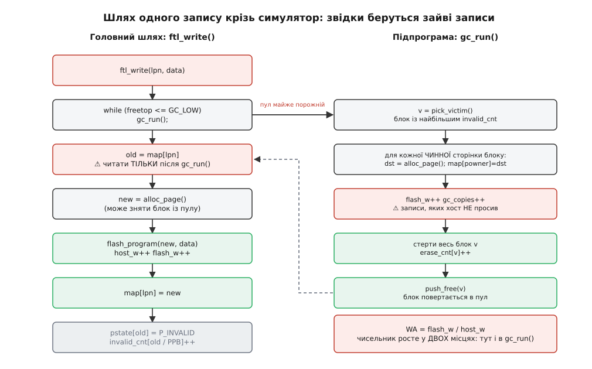
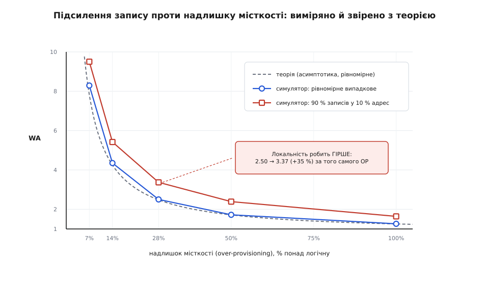
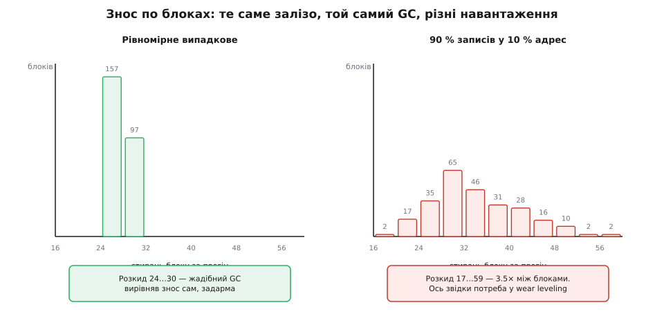

# ⚙️ Навчальний FTL: 150 рядків C, у яких видно підсилення запису

**Задача.** Зібрати посторінковий FTL, який справді компілюється й біжить, — і змусити його **виміряти** те, про що зазвичай говорять на пальцях. Модель флешу: блоки зі сторінками, у кожної сторінки — стан (вільна / чинна / недійсна), у кожного блоку — лічильник стирань. Посторінкова карта `map[LPN] = PPN`. Запис не на місце з інвалідацією старої сторінки. Розподільник вільних сторінок із фронтом запису. Жадібне збирання сміття: жертва — блок із найбільшою часткою недійсних сторінок, чинні сторінки копіюємо, блок стираємо й повертаємо в пул. Зверху — два лічильники: скільки сторінок замовив хост і скільки насправді лягло у флеш. Їхнє відношення — коефіцієнт підсилення запису — друкується саме. А тоді ганяємо демо-навантаження й дивимося, що з цим числом роблять надлишок місткості й локальність записів.

**Ідея.** Усе тримається на одному колі, і решта — його наслідки. Хост просить записати сторінку → писати можна лише в стерту → стерті сторінки беруться лише з блоків, які хтось стер → стерти блок можна, тільки вивізши з нього чинні сторінки → а вивезти означає записати їх ще раз. Коло замкнулося: **щоб дати місце під запис, доводиться писати**. Уся програма — це чотири деталі, які обслуговують це коло: масив стану флешу, карта, розподільник, що йде фронтом по стертих сторінках, і збирач, який коло замикає. Коефіцієнт підсилення запису тут — не якась зовнішня метрика, для якої треба вигадувати методику: це відношення двох лічильників, поставлених на двох різних дугах того самого кола.

Головне спрощення, яке робить симулятор коротким і швидким: **байтів даних ми не тримаємо взагалі**. Скільки разів флеш перепише сторінку, не залежить від того, що в ній записано, — на підсилення запису впливають адреси, а не вміст. Тож у моделі фізична сторінка — це два числа: її стан і логічний номер власника. Симулятор меле мільйони записів за секунди й важить кілька сотень кілобайтів.

Мова — C, і не заради антуражу: код навмисне має ту саму форму, у якій живе справжня прошивка контролера — статичні масиви, жодного `malloc`, жодного float у гарячому шляху, уся «пам'ять пристрою» відома на етапі компіляції.

## Що взагалі треба тримати в пам'яті

```c
// ftlsim.c — навчальний посторінковий FTL: карта, запис не на місце,
// жадібне збирання сміття, лічильник підсилення запису.
// Збірка:  cc -O2 -o ftlsim ftlsim.c
#include <stdio.h>
#include <stdint.h>
#include <string.h>
#include <stdlib.h>

#define PPB    64                  // сторінок у блоці
#define NBLK   256                 // блоків у кристалі
#define NPHYS  (PPB * NBLK)        // 16384 фізичні сторінки
#define GC_LOW 2                   // поріг пулу: нижче — будимо збирача
#define NONE   0xFFFFFFFFu

enum { P_FREE, P_VALID, P_INVALID };   // стан фізичної сторінки

static uint8_t  pstate[NPHYS];         // стан кожної фізичної сторінки
static uint32_t powner[NPHYS];         // OOB: чий LPN тут лежить
static uint16_t invalid_cnt[NBLK];     // недійсних сторінок у блоці
static uint32_t erase_cnt[NBLK];       // скільки разів блок стирали

static uint32_t map[NPHYS];            // карта: map[LPN] = PPN
static uint32_t nlog;                  // скільки LPN бачить хост

static uint32_t freelist[NBLK];        // пул стертих блоків (стек)
static uint32_t freetop;               // скільки їх у пулі
static uint32_t wblk, wpage;           // фронт запису: блок і зсув у ньому

static uint64_t host_w, flash_w, erases, gc_copies;   // лічильники

static void gc_run(void);              // наперед: ftl_write кличе збирача
```

Кожен рядок тут заслужив своє місце, і найцікавіше — чому їх саме стільки.

`map` — та сама таблиця відображення, серце всієї конструкції. `pstate` — модель фізики: сторінка або стерта, або несе чинні дані, або несе сміття, і третього не дано.

`powner` — модель службової області сторінки (OOB), і саме вона робить збирання сміття можливим. Подумаймо, що станеться без неї. Збирач знайшов у блоці-жертві чинну сторінку й хоче її перевезти. Перевезти означає не тільки скопіювати байти, а й **оновити карту** — інакше після переїзду `map[LPN]` показуватиме на старе, вже стерте місце. А щоб оновити карту, треба знати, **чий** це LPN. Карта веде з логічного у фізичне; збирачеві ж потрібен зворотний напрямок. Без підпису на сторінці довелося б на кожну врятовану сторінку прочісувати всю карту в пошуках того, хто на неї вказує, — тобто 16384 порівняння замість одного звертання. Тож OOB — це не тільки страховка на випадок раптового вимкнення живлення: це зворотний індекс, без якого GC був би квадратичним.

`invalid_cnt` — похідна величина: її щоразу можна перерахувати, пробігши `pstate` по блоку. Тримаємо її окремо тому, що жадібний вибір жертви питає «скільки тут сміття?» постійно, а змінюється це число рівно в одному місці — коли якась сторінка стає недійсною.

`erase_cnt` — єдиний масив, який **ні на що не впливає**. Жодна гілка коду не читає його, щоб ухвалити рішення. Це чистий вимірювальний прилад, вбудований у модель, і саме він потім покаже те, чого не покаже підсилення запису.

Порахуймо, у що це стає:

```
map     = 16384 · 4 Б = 64 КБ      ← карта: 4 байти на логічну сторінку
powner  = 16384 · 4 Б = 64 КБ      ← модель OOB (у залізі живе на самих сторінках)
pstate  = 16384 · 1 Б = 16 КБ
решта   = 256 · (2 + 4 + 4) Б ≈ 2.5 КБ
разом   ≈ 147 КБ статичної пам'яті
```

Пропорція «4 байти на логічну сторінку» — це те саме, що робить посторінкову карту дорогою на справжніх місткостях: наш іграшковий кристал на 64 МБ обходиться 64 кілобайтами, і рівно з тим самим коефіцієнтом терабайт обійдеться гігабайтом.

## Розподільник: фронт запису

```c
static void push_free(uint32_t b) { freelist[freetop++] = b; }
static uint32_t pop_free(void)    { return freelist[--freetop]; }

// Наступна фізична сторінка з фронту запису.
static uint32_t alloc_page(void) {
    if (wpage == PPB) {             // поточний блок дописано вщерть
        wblk = pop_free();          // беремо наступний стертий блок
        wpage = 0;
    }
    return wblk * PPB + wpage++;
}
```

Вільних сторінок у нас багато й розкидані вони по всьому кристалу — але розподільник навмисне не має права вибору. Він іде **фронтом**: заповнює поточний блок від сторінки 0 до сторінки 63 підряд, і лише коли той дописано, бере з пулу наступний стертий блок.

Ця впертість не від бідності. Сучасний NAND вимагає програмувати сторінки в блоці **по порядку** — обмеження описане у вендорських технічних нотах (наприклад, у мікронівській «NAND Flash 101») і для MLC/TLC є твердим правилом, а не рекомендацією: сусідні сторінки ділять фізичні комірки, і програмування врозбрід псує вже записані дані. Тож фронт — це не спрощення моделі, а копія залізного правила. Побічний ефект — приємний: запис, що завжди йде вперед і ніколи назад, перетворює флеш на журнал сам собою.

Зверніть увагу на те, чого в `alloc_page` **немає**: вона ніколи не кличе збирача. Спокуса є — здається природним, щоб той, хто роздає сторінки, сам і дбав про їх наявність. Але збирач, як побачимо за мить, сам кличе `alloc_page` (йому ж треба кудись класти врятовані сторінки), і взаємна рекурсія двох функцій, кожна з яких може покликати іншу, — рівно те місце, де в такому коді заводяться найгидкіші помилки. Тому обов'язок поповнювати пул винесено туди, де це безпечно: у початок запису від хоста.

## Запис не на місце

```c
void ftl_write(uint32_t lpn, const void *data) {
    (void)data;                          // модель: самі байти не тримаємо
    while (freetop <= GC_LOW) gc_run();  // спершу подбали про запас

    uint32_t old = map[lpn];             // ⚠ читати ТІЛЬКИ після GC
    uint32_t new_ppn = alloc_page();
    pstate[new_ppn] = P_VALID;
    powner[new_ppn] = lpn;               // підписали сторінку в OOB
    map[lpn] = new_ppn;
    host_w++; flash_w++;                 // хост попросив — флеш зробив

    if (old != NONE) {                   // стара версія стала сміттям
        pstate[old] = P_INVALID;
        invalid_cnt[old / PPB]++;
    }
}

uint32_t ftl_read(uint32_t lpn) { return map[lpn]; }   // PPN або NONE
```

Серединка цієї функції — та сама механіка запису не на місце: узяти чисту сторінку, покласти дані туди, переставити один вказівник, оголосити стару сторінку сміттям. Нового тут два рядки й один порядок слів.

Рядок `host_w++; flash_w++;` — це вся арифметика чесного випадку: коли збирач спить, обидва лічильники ростуть разом, і підсилення запису тотожно дорівнює одиниці. Скільки хост попросив, стільки флеш і зробив. Усе, що колись зіпсує цю рівність, лежить не тут.

А `while (freetop <= GC_LOW) gc_run();` **перед** читанням карти — не стилістична примха, а умова коректності, до якої ще повернемося серед пасток. Поки що досить помітити: збирач має право пересувати сторінки, у тому числі сторінку того самого `lpn`, який ми зараз пишемо. Тому питати в карти, де лежить попередня версія, можна лише тоді, коли збирач уже відпрацював і замовк.


*Уся програма з висоти пташиного польоту. Ліворуч — головний шлях: подбати про запас вільних блоків, узнати стару адресу, взяти нову сторінку з фронту, записати, переставити карту, поховати стару версію. Праворуч — підпрограма збирача, у яку головний шлях звертає, щойно пул майже порожній. Ключ до всього числа WA — у тому, що `flash_w++` трапляється у ДВОХ місцях: раз на прохання хоста і ще раз на кожну сторінку, яку збирач перетягує заради вивільнення блоку. Пунктирна стрілка назад — нагадування, що після роботи збирача карта могла змінитися, тож `map[lpn]` читаємо тільки тепер.*

## Жадібний збирач

```c
// Жертва — блок із найбільшим числом недійсних сторінок.
static uint32_t pick_victim(void) {
    uint32_t best = NONE, best_inv = 0;
    for (uint32_t b = 0; b < NBLK; b++)
        if (b != wblk && invalid_cnt[b] > best_inv) {
            best = b; best_inv = invalid_cnt[b];
        }
    return best;
}

static void gc_run(void) {
    uint32_t v = pick_victim();
    if (v == NONE) {
        fprintf(stderr, "FTL: нема чого збирати — диск справді повний\n");
        exit(1);
    }
    for (uint32_t i = 0; i < PPB; i++) {        // рятуємо чинні сторінки
        uint32_t ppn = v * PPB + i;
        if (pstate[ppn] != P_VALID) continue;
        uint32_t lpn = powner[ppn];             // OOB каже, чий це LPN
        uint32_t dst = alloc_page();
        pstate[dst] = P_VALID;
        powner[dst] = lpn;
        map[lpn] = dst;                         // карта — на копію
        flash_w++; gc_copies++;                 // запис, якого хост НЕ просив
    }
    for (uint32_t i = 0; i < PPB; i++)          // стирання — цілим блоком
        pstate[v * PPB + i] = P_FREE;
    invalid_cnt[v] = 0;
    erase_cnt[v]++;
    erases++;
    push_free(v);                               // блок назад у пул
}
```

У `pick_victim` дві дрібниці роблять усю роботу. `b != wblk` — блок, у який зараз пише фронт, чіпати не можна: попереду фронту в ньому ще стоять вільні сторінки, і стерти його означало б викинути сам фронт. А умова `invalid_cnt[b] > best_inv` зі стартовим `best_inv = 0` фільтрує все зайве одним порівнянням: блоки з пулу й свіжостерті мають нуль недійсних сторінок і тому просто не проходять — окрема перевірка «а чи цей блок узагалі кандидат?» не потрібна.

Рядок `flash_w++; gc_copies++;` — друге, і останнє, місце в усій програмі, де росте чисельник підсилення запису. Ось і вся таємниця: WA більше за одиницю рівно настільки, наскільки часто виконується цей рядок. Далі — тільки арифметика.

## Чому це взагалі завершується

Питання не дозвільне. `gc_run` кличуть у циклі `while`, а сам він може відбирати блоки з пулу — звідки певність, що програма не зависне назавжди й не візьме сторінку з порожнього пулу?

Гарантія тут не з добрих намірів, а з арифметики:

```
чинних сторінок  ≤ nlog        (у кожного LPN не більше однієї чинної копії)
усього сторінок  = NPHYS
⇒ недійсних + вільних ≥ NPHYS − nlog
```

Поки `nlog < NPHYS`, права частина строго додатна. А тепер найважливіший момент: коли вільні сторінки вичерпано, уся ця різниця **мусить** сидіти в недійсних. Отже знайдеться блок із `invalid_cnt > 0`, жадібний його неодмінно знайде (він же бере максимум), і кожен виклик `gc_run` вивільнить щонайменше одну сторінку. Прогрес гарантований не везінням, а нерівністю. Гілка з `exit(1)` при `nlog < NPHYS` недосяжна — вона стоїть як пастка на випадок, якщо хтось колись видасть хостові більше логічних сторінок, ніж є фізичних.

Але зверніть увагу, наскільки слабку обіцянку ми щойно довели: **щонайменше одну** сторінку. Якщо в найкращого кандидата недійсна лише одна сторінка з 64, збирач скопіює 63 чинні, щоб виграти одну вільну. Це не зависання — програма чесно повзе вперед. Це торохтіння. Різниця між «працює» і «придатне до вжитку» ховається цілком у величині `NPHYS − nlog` — і ця величина має ім'я: [надлишок місткості](book:algorithms/over-provisioning), той самий резерв, який накопичувач приховує від користувача. Ми щойно не постулювали його потрібність, а вивели: без запасу нерівність вироджується, а разом із нею вироджується й уся конструкція.

Звідси й `GC_LOW`. Поріг мусить бути принаймні одиницею, бо `gc_run` кличе `alloc_page`, а та може зняти блок із пулу — збирачеві теж треба, куди класти копії. Розбудити збирача, коли в пулі вже нуль, означає, що йому не буде куди рятувати сторінки. Резерв — не оптимізація, а інваріант, на якому тримається коректність.

## Навантаження, яке не бреше

```c
static uint32_t rng;
static uint32_t rnd(void) {          // xorshift32 — щоб прогін відтворювався
    uint32_t x = rng;
    x ^= x << 13; x ^= x >> 17; x ^= x << 5;
    return rng = x;
}

// hot_share % записів б'ють у перші hot_frac % адрес.
static uint32_t pick_lpn(uint32_t hot_share, uint32_t hot_frac) {
    if (hot_share && rnd() % 100 < hot_share)
        return rnd() % (nlog * hot_frac / 100);
    return rnd() % nlog;
}

static void ftl_init(uint32_t logical_pages) {
    nlog = logical_pages;
    memset(pstate, P_FREE, sizeof pstate);
    memset(invalid_cnt, 0, sizeof invalid_cnt);
    memset(erase_cnt, 0, sizeof erase_cnt);
    for (uint32_t i = 0; i < nlog; i++) map[i] = NONE;
    freetop = 0;
    for (uint32_t b = NBLK; b-- > 1; ) push_free(b);   // блок 0 — під фронт
    wblk = 0; wpage = 0;
    host_w = flash_w = erases = gc_copies = 0;
}
```

Власний `xorshift32` замість бібліотечного `rand()` — свідомий вибір. Реалізації `rand()` різняться від бібліотеки до бібліотеки, тож у читача на іншій системі вийшли б інші числа, і звірити свій прогін із наведеним тут стало б неможливо. А `xorshift` — це три зсуви та три «виключних або», описані George Marsaglia в «Xorshift RNGs» (Journal of Statistical Software, 2003); трійка зсувів (13, 17, 5) — з його ж переліку. Чотири байти стану дають однаковий потік усюди, де `uint32_t` має 32 біти, — тобто скрізь. Один підступ там усе-таки є: нуль для xorshift — нерухома точка, з нульового зерна генератор довіку видаватиме нулі. Тому зерно `2463534242` — не окраса, а необхідність.

Тепер сам прогін — і в ньому та єдина деталь, без якої всі числа були б брехнею:

```c
static void run_case(const char *name, uint32_t op_pct,
                     uint32_t hot_share, uint32_t hot_frac) {
    uint32_t logical = (uint32_t)((uint64_t)NPHYS * 100 / (100 + op_pct));
    rng = 2463534242u;
    ftl_init(logical);

    for (uint32_t i = 0; i < logical; i++)          // 1. заповнити диск ущерть
        ftl_write(i, NULL);
    for (uint32_t i = 0; i < 4 * logical; i++)      // 2. прогріти до усталеного режиму
        ftl_write(pick_lpn(hot_share, hot_frac), NULL);

    host_w = flash_w = erases = gc_copies = 0;      // 3. і ТІЛЬКИ ТЕПЕР міряти
    for (uint32_t i = 0; i < 10 * logical; i++)
        ftl_write(pick_lpn(hot_share, hot_frac), NULL);

    uint32_t emin = 0xFFFFFFFFu, emax = 0, never = 0;
    for (uint32_t b = 0; b < NBLK; b++) {
        if (erase_cnt[b] == 0) { never++; continue; }
        if (erase_cnt[b] < emin) emin = erase_cnt[b];
        if (erase_cnt[b] > emax) emax = erase_cnt[b];
    }
    printf("OP=%3u%%  WA=%5.2f  копій=%8llu  стирань=%6llu"
           "  знос %3u…%3u  поза обігом: %u   %s\n",
           op_pct, (double)flash_w / (double)host_w,
           (unsigned long long)gc_copies, (unsigned long long)erases,
           emin, emax, never, name);
}

int main(void) {
    run_case("рівномірне випадкове",     100, 0, 0);
    run_case("рівномірне випадкове",      50, 0, 0);
    run_case("рівномірне випадкове",      28, 0, 0);
    run_case("рівномірне випадкове",       7, 0, 0);
    run_case("90 % записів у 10 % адрес", 28, 90, 10);
    run_case("90 % записів у 10 % адрес",  7, 90, 10);
    return 0;
}
```

Три фази — і скидання лічильників між другою й третьою. Це не косметика, а те, без чого вимірювання не має сенсу. На свіжому, щойно стертому накопичувачі вільних блоків удосталь, збирач не прокидається жодного разу, і підсилення запису дорівнює рівно одиниці — **за будь-якої** політики GC, хоч би якою дурною вона була. Міряючи з порожнього диска, можна «довести» досконалість чого завгодно. Число починає щось означати лише в усталеному режимі: диск заповнено, вільні блоки народжуються тільки зі збирача, і система знайшла свою рівновагу. Прогрів у чотири повні перезаписи диска цієї рівноваги досягає з запасом: якщо збільшити його втричі, до дванадцяти, WA у найтіснішому випадку зміщується з 8.29 на 8.28 — тобто нікуди.

І дрібниця, яку видно лише в C: `%s` з назвою стоїть **останнім** не випадково. Ширина поля в `printf` рахує **байти**, а не символи; на UTF-8-рядку `%-22s` відміряв би 22 байти, тобто десь одинадцять українських літер, і колонки б поїхали. Числові колонки мають сталу ширину — тож усе, що вимірюється, друкуємо першим, а рядок довільної ширини лишаємо в кінці, де він нікому не заважає.

## Прогін

```
OP=100%  WA= 1.26  копій=   20921  стирань=  1607  знос   7… 10  поза обігом: 2   рівномірне випадкове
OP= 50%  WA= 1.72  копій=   78477  стирань=  2933  знос  14… 19  поза обігом: 2   рівномірне випадкове
OP= 28%  WA= 2.50  копій=  192132  стирань=  5002  знос  24… 30  поза обігом: 2   рівномірне випадкове
OP=  7%  WA= 8.29  копій= 1116058  стирань= 19831  знос  94…127  поза обігом: 2   рівномірне випадкове
OP= 28%  WA= 3.37  копій=  303611  стирань=  6744  знос  17… 59  поза обігом: 2   90 % записів у 10 % адрес
OP=  7%  WA= 9.50  копій= 1301282  стирань= 22725  знос  89…173  поза обігом: 2   90 % записів у 10 % адрес
```

Перш ніж вірити хоч одному з цих чисел, варто перевірити, чи сходиться баланс. Візьмімо третій рядок.

**Чи не бреше лічильник: OP = 28 %, рівномірне випадкове.**

```
логічних сторінок = 16384 · 100 / 128 = 12800
host_w  = 10 · 12800                   = 128 000      ← стільки просив хост
flash_w = host_w + gc_copies = 128 000 + 192 132 = 320 132
WA      = 320 132 / 128 000            = 2.50         ← те саме, що надрукувала програма

Тепер із іншого боку. Кожне стирання вивільняє рівно PPB сторінок,
і кожну вивільнену сторінку хтось згодом записав:
erases · PPB = 5002 · 64               = 320 128  ≈  flash_w = 320 132
```

Розбіжність — чотири сторінки з трьохсот двадцяти тисяч: це недописаний фронт, що завис у поточному блоці на момент зупинки. Два незалежні шляхи до одного числа сходяться — лічильники не брешуть.

## Звірка з теорією

Для рівномірного випадкового запису з жадібним збирачем підсилення запису вміють рахувати аналітично. Задачу розв'язували кілька груп незалежно, і близько 2012 року вона зійшлася до замкненої форми через функцію Ламберта: Peter Desnoyers (SYSTOR 2012) і Xiang Luojie з Brian Kurkoski (ICNC 2012); ґрунт підготувала праця Xiao-Yu Hu зі співавторами з IBM Zurich (SYSTOR 2009), яка й поставила питання про вплив надлишку місткості на WA кількісно. У зручнішому вигляді, без явної функції Ламберта, результат такий:

```
ρ = (δ − 1) / ln δ        ρ — частка зайнятого місця = логічних / фізичних
WA = 1 / (1 − δ)          δ — частка ЧИННИХ сторінок у блоці-жертві
```

Сенс за формулами простий. Збирач стирає блок і виграє `(1 − δ)·PPB` вільних сторінок, заплативши `δ·PPB` копіювань. Що більше чинних сторінок у жертві, то дорожча вільна сторінка — а `ρ` через перше рівняння каже, наскільки повним є той найкращий блок, який жадібному щастить знайти в усталеному режимі.

**Скільки має вийти за OP = 28 %.**

```
ρ = 100 / (100 + 28) = 0.781

Шукаємо δ ∈ (0, 1), для якого (δ − 1) / ln δ = 0.781:
  δ = 0.59  →  (−0.410) / (−0.5276) = 0.777    замало
  δ = 0.60  →  (−0.400) / (−0.5108) = 0.783    забагато
  δ ≈ 0.597

WA = 1 / (1 − 0.597) = 2.48
```

Симулятор надрукував 2.50. Півтораста рядків C, написаних без жодної оглядки на аналіз, відтворили аналітичну модель із точністю до сотих.

| OP | навантаження | WA (симулятор) | WA (теорія) |
|---:|---|---:|---:|
| 100 % | рівномірне випадкове | 1.26 | 1.26 |
| 50 % | рівномірне випадкове | 1.72 | 1.72 |
| 28 % | рівномірне випадкове | 2.50 | 2.48 |
| 7 % | рівномірне випадкове | 8.29 | 7.82 |
| 28 % | 90 % записів у 10 % адрес | 3.37 | — |
| 7 % | 90 % записів у 10 % адрес | 9.50 | — |


*Той самий симулятор, прогнаний по низці значень надлишку місткості. Пунктир — асимптотична теорія, кружечки — виміряне на рівномірному випадковому записі: лінії лежать одна на одній, і це найкраще свідчення, що модель не бреше. Крива різко злітає ліворуч: кожен відсоток надлишку, відрізаний біля 7 %, коштує втричі дорожче за відсоток, відрізаний біля 50 %. А квадратики — те, чого теорія не описує й чого ніхто не чекає: навантаження з локальністю лежить ВИЩЕ рівномірного на всій довжині.*

Розбіжність у найтіснішому випадку (8.29 проти 7.82) не випадкова й пояснюється чесно. Теорія асимптотична: вона припускає нескінченно багато блоків і те, що весь надлишок місткості працює на збирача. У нас блоків 256, і приблизно три з них для збирача недосяжні: `GC_LOW = 2` тримає два блоки в пулі як резерв, і ще один частково зайнятий фронтом. За OP = 100 % ці три блоки — шум на тлі величезного запасу. За OP = 7 % увесь запас — це лише 1072 сторінки, тобто менш ніж сімнадцять блоків, і три вилучені з обігу забирають майже п'яту його частину. Що тісніший надлишок, то дорожчий кожен блок — рівно те, про що й сама крива.

## Сюрприз: локальність робить гірше

Тепер два останні рядки прогону — і вони варті всієї роботи.

Очікування напрошується само. Дев'яносто відсотків записів б'ють у десяту частину адрес: гарячі блоки мали б перетворюватися на суцільне сміття за лічені секунди, збирач знаходив би жертви, у яких копіювати майже нічого, і підсилення запису мало б **упасти**. Реальне навантаження ж не рівномірне — тим краще для нас.

Програма каже протилежне. За того самого надлишку місткості: 2.50 → **3.37**. Локальність не допомогла — вона з'їла третину ресурсу. І це не одна невдала точка: на кривій вище квадратики лежать вище кружечків **скрізь**, від 7 % до 100 %.

Чому. Жадібний збирач знає рівно одне число — скільки в блоці сміття. Гарячі блоки справді протухають миттєво, і збирач їх залюбки їсть. Але холодні дані — ті дев'яносто відсотків адрес, у які майже не пишуть, — лежать у блоках, що протухають нестерпно повільно. Ці блоки нікуди не діваються, вони просто чекають своєї черги. І черга настає: коли всі гарячі блоки вже зібрано, а вільні сторінки знову потрібні, жадібний бере найкраще з того, що лишилося, — холодний блок, у якому недійсна, скажімо, чверть сторінок. Він сумлінно перевозить три чверті нерухомих даних на нове місце, де ті знову лягають нерухомо. І так по колу.

Тобто локальність не прибирає роботу, а **розшаровує** флеш: на блоки, що протухають швидко, і блоки, що не протухають майже ніколи. За рівномірного навантаження такого розшарування немає — сміття рівно розмазане, усі блоки старіють з однаковою швидкістю, і збирачеві завжди є що взяти дешево. Жадібний критерій цього розшарування не бачить у принципі: він знає, **скільки** в блоці сміття, але не знає, **як швидко** воно там накопичується. І платить за сліпоту, катаючи холодні дані з місця на місце.

Найкраще в цьому результаті те, що він не наш і не є артефактом іграшкової моделі. Рівно те саме — і з тим самим здивуванням — виявили Mendel Rosenblum і John Ousterhout, коли міряли чистильника сегментів у своїй log-structured file system (SOSP 1991; розгорнуто в ACM TOCS, лютий 1992): жадібна політика показала себе **гірше** на навантаженні з локальністю, ніж на рівномірному. Пояснення в них те саме, тільки іншими словами: сегмент не чистять, доки він не стане найменш заповненим з усіх, — а отже до порога чищення рано чи пізно сповзають і холодні сегменти теж. Саме через цей результат вони й вигадали політику «вартість/вигода» (cost-benefit), яка додає до заповненості другий доданок — **вік** даних: холодний сегмент варто чистити тільки тоді, коли він справді майже порожній, бо після чищення він знову залягне надовго й місце окупиться. Ось чому [вибір жертви](book:algorithms/flash-garbage-collection) — окрема наука, а не рядок коду: жадібність тут не просто неоптимальна, вона систематично помиляється саме на тих навантаженнях, заради яких накопичувач і купують.

І ось найдешевша латка, яку наш симулятор навмисне не робить: **два фронти замість одного**. Дані, які перевозить збирач, холодні за визначенням — їх щойно не переписали, поки цілий блок устиг протухнути. Змішуючи їх з гарячими записами хоста в один фронт, ми власноруч гарантуємо, що кожен новий блок вийде мішанкою гарячого з холодним — тобто блоком, який ніколи не протухне цілком. Розвести їх у різні блоки коштує кількох рядків, а розшарування, що псує нам числа, зникає само.

## Знос: те, чого підсилення запису не показує

У кожному рядку прогону є ще одна пара чисел — та, заради якої в моделі живе `erase_cnt`, масив, що ні на що не впливає.

За рівномірного навантаження й OP = 28 % блоки стерто від 24 до 30 разів. Розкид — 1.25×, тобто його практично немає. Ніхто не просив вирівнювати знос, у програмі немає ані рядка про це — а знос вийшов рівним. І це не диво: коли всі блоки старіють з однаковою швидкістю, «бери найпротухліший» перетворюється на чесну ротацію, бо найпротухлішим кожен стає по черзі.

Змінюємо самі лише адреси — той самий код, те саме залізо, той самий збирач — і отримуємо **17…59**. Розкид 3.5×.


*Дві гістограми одного й того самого симулятора за однакового надлишку місткості 28 % — різняться лише адреси, у які пише хост. Ліворуч усі 254 блоки, що були в обігу, збилися у два стовпчики: жадібний GC вирівняв знос задарма, сам того не бажаючи. Праворуч той самий код розмазав знос від 17 до 59 стирань: блоки, яким випало ловити гарячі дані, зношуються втричі з половиною швидше за ті, що тримають холодні. Підсилення запису про цю різницю не сказало нічого — воно зросло лише на третину.*

Різниця між цими двома числами — 2.50 проти 3.37, тобто плюс третина, — і між 1.25× та 3.5× розкиду не збігається навіть за порядком. Це дві різні хвороби, і одним числом їх не побачити. Підсилення запису — середнє по лікарні: воно каже, скільки роботи флеш виконав **сумарно**. Про те, як цю роботу розподілено між блоками, воно мовчить принципово. А накопичувач помирає не тоді, коли зношується середній блок, — він помирає, коли зношується **перший**. Якщо блок витримує три тисячі циклів, то за розкиду 3.5× найнещасніший дійде до межі тоді, коли середній пройде менш ніж третину шляху.

Ось звідки береться [вирівнювання зносу](book:programming/wear-leveling) як окремий, свідомо збудований механізм: жадібний збирач — не політика зносу, він оптимізує зовсім інше, а те, що на рівномірному навантаженні знос вийшов рівним, — просто збіг, який розсипається на першому ж справжньому навантаженні. І симетрично — [підсилення запису](book:algorithms/write-amplification) заслуговує окремої розмови не тому, що це «ще одна метрика», а тому, що це єдина величина, яка зв'язує швидкодію під навантаженням і строк життя в одне число; тут ми лише спіймали його за хвіст лічильником.

## Складність

| Операція | Ціна | Звідки |
|---|---|---|
| `ftl_read` | O(1) | одне звертання в масив за індексом |
| `alloc_page` | O(1) | інкремент фронту, зрідка `pop_free` |
| `ftl_write` без збирача | O(1) | запис і два оновлення лічильників |
| `pick_victim` | O(NBLK) | лінійний скан усіх блоків |
| `gc_run` | O(NBLK + PPB) | скан жертви + прохід по її сторінках |
| `ftl_write` амортизовано | WA записів + WA/PPB стирань | наслідок кола |
| Пам'ять | 4 Б на логічну сторінку | розмір карти |

Амортизована ціна варта окремого погляду, бо вона переводить абстрактне WA у такти. За OP = 28 % кожен запис від хоста коштує в середньому 2.50 програмувань сторінки та 2.50/64 ≈ 0.039 стирання блоку — і це збігається з виміряним: 5002 стирання на 128 000 записів дають рівно 0.039. Не «приблизно», а тотожно: кожне стирання вивільняє 64 сторінки, кожна з яких приймає один флеш-запис, — те саме коло, тільки записане як формула.

А `pick_victim` — чесно найслабше місце симулятора. Лінійний скан 256 блоків не помітний; справжній накопичувач має сотні тисяч блоків, і прочісувати їх усі на кожному збиранні неприйнятно. Найкращий вихід підказують самі дані: `invalid_cnt` не буває більшим за `PPB`, тобто набирає лише 65 різних значень. Отже максимум шукати не треба взагалі — досить тримати 65 кошиків зі списками блоків за кількістю сміття й покажчик на найвищий непорожній кошик. Блок переїжджає між кошиками за O(1), коли якась його сторінка стає недійсною; «дай жадібну жертву» — теж O(1). Це логіка сортування підрахунком, і вона працює саме тому, що величина, за якою ми сортуємо, обмежена зверху розміром блоку. Ані купи, ані сканів.

## Пастки

**Збирач, якому нема куди класти копії.** Найспокусливіша помилка — будити збирача, коли вільні блоки вже скінчилися: `if (freetop == 0) gc_run();`. Виглядає ощадливо: не турбуємо GC даремно. Але `gc_run` кличе `alloc_page`, а та на порожньому пулі виконає `freelist[--freetop]` при `freetop == 0`; беззнаковий нуль мінус один — це 0xFFFFFFFF, і замість чесного глухого кута ми дістаємо читання за межами масиву. Класичний «тупик збирача» в C приходить не як зависання, а як псування пам'яті. Резерв `GC_LOW` — не тюнінг продуктивності, а умова, за якої код узагалі коректний.

**`old = map[lpn]` до збирача.** Найтонша з усіх. Якщо прочитати карту перед `while (freetop <= GC_LOW) gc_run();`, а збирач саме тоді вибере блок, де лежить наш `lpn`, то він перевезе сторінку й перепише `map[lpn]` — а наш `old` лишиться показувати на місце, якого вже немає. Далі `pstate[old] = P_INVALID` позначає недійсною **стерту** сторінку, а `invalid_cnt[old / PPB]++` домальовує фантомне сміття блоку, у якому сміття немає. Нічого не падає. Мінімальна шкода — `invalid_cnt` починає брехати, і жадібний ганяється за примарою. Максимальна виходить, коли зорі стають так: збирач стер блок і повернув його в пул, `alloc_page` одразу зняла його з пулу під наш новий запис і видала ту саму фізичну сторінку — тоді `old == new_ppn`, і останні рядки `ftl_write` позначають недійсною сторінку, яку щойно записали. Карта показує на сторінку, яку збирач більше ніколи не рятуватиме, бо для нього вона сміття. Дані зникнуть тихо, без жодного повідомлення, і виявиться це десь через тиждень під навантаженням. Ціна питання — порядок двох рядків.

**Торохтіння за тісного надлишку.** `while` у `ftl_write` не має стелі: один запис від хоста може прокрутити збирача скільки завгодно разів. За OP = 7 % кожен запис уже коштує 7.3 скопійованих сторінок у середньому; стисніть надлишок до 2 % — і теорія обіцяє WA ≈ 25.7, тобто одна сторінка від хоста обертається двома з половиною десятками флеш-записів. Але середнє тут — найменше лихо. Гірше те, що ці двадцять п'ять записів не розмазані рівно: конкретний нещасливий `ftl_write` застрягне в циклі на десятках раундів збирання, поки сусідні пролетять миттєво. Саме в цьому `while` живе хвостова затримка накопичувача — і стріляє вона рівно тоді, коли хост навантажив диск найсильніше.

**Вимірювання зі свіжого диска.** Про це вже йшлося, але воно варте повторення саме як пастка: без фази заповнення й прогріву будь-який FTL показує WA = 1.00 і виглядає бездоганним. Скидання лічильників перед третьою фазою — не деталь методики, а різниця між вимірюванням і самообманом.

**Стек проти черги.** Звідки в кожному рядку взялося «поза обігом: 2»? Пул вільних блоків у нас — стек: кладемо й беремо згори. На старті ми заштовхали туди блоки 255…1, тож на дні опинилися найбільші номери. В усталеному режимі `freetop` коливається між двома й трьома, тобто працює лише верхівка: те, що осіло на дно, більше ніколи не спливає. Блоки 255 і 254 простояли весь прогін незайманими, з навічно нульовим лічильником стирань.

Спокусливо оголосити це втратою місткості — але це буде неправда, і програма сама її спростовує. Резерв у два блоки FTL мусить тримати в будь-якому разі, бо на ньому тримається коректність; стек не забирає **більше** резерву, він лише прибиває резерв до тих самих **двох конкретних блоків**. Тому й WA не змінюється: заміна стека на чергу дає 2.51 замість 2.50, тобто шум, — підсиленню запису байдуже, **скільки** блоків у резерві сидить, а не **які саме**. Зате «поза обігом» стає нулем.

Мораль не в тому, що черга краща за стек. Мораль у дзеркальності: вище ми бачили блоки, які зношуються втричі швидше за інших, а тут — блоки, які не зношуються **взагалі**, чий ресурс перезаписів ніхто ніколи не витратить. І те, й те вирішує непримітний вибір структури даних, невидимий у головній метриці. Для FTL це особливо гостро, бо FTL — це і є машина, яка вирішує, котрі блоки старітимуть.

## Чого тут свідомо немає

Півтораста рядків — це несучий кістяк, і чесно буде назвати все, що на нього ще належить нарощувати. Немає бракованих блоків — жодне стирання в моделі не може провалитися. Немає відновлення після вимкнення живлення: карта живе тільки в RAM, тоді як справжній FTL відбудовує її з підписів у OOB — `powner` у нас є, але його ніхто не читає при старті. Немає вирівнювання зносу: `erase_cnt` тільки міряє. Немає розшарування гарячого й холодного по різних фронтах. Немає паралелізму — реальний накопичувач розкладає фронт по кількох кристалах і каналах, і саме звідти береться його швидкість. Немає команди TRIM, а вона — найдешевший спосіб збити WA з усіх існуючих: файлова система просто каже «ці LPN мені більше не потрібні», і сторінки стають недійсними задарма, без єдиного запису.

Але кожна з цих речей — шар **поверх** того самого кола: запис вимагає стертого, стерте вимагає збирання, збирання вимагає запису. Коло тут повне, і кожне число, яке друкує програма, випало з нього, а не з припущень.
