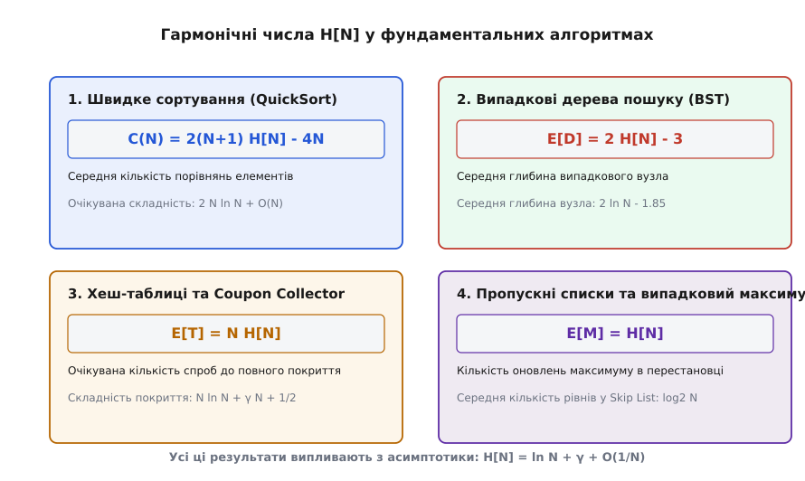

# Гармонічні числа

<preknowlist>
- [Асимптотичний аналіз](book:algorithms/asymptotic-complexity) — нотації O, Ω, Θ та оцінка швидкості зростання функцій.
- [Амортизаційний аналіз](book:algorithms/amortized-analysis) — усереднення вартості послідовності операцій.
- [Порівняльні сортування](book:algorithms/comparison-sort-lower-bound) — дереварні моделі та середня кількість порівнянь.
- [Бінарне дерево пошуку](book:algorithms/binary-search-tree) — структура та середня висота дерева.
</preknowlist>

Уявімо виконання алгоритму швидкого сортування (QuickSort) на масиві з мільйона елементів або роботу хеш-таблиці з лінійним пробуванням при заповненні на 80%: скільки в середньому порівнянь виконає алгоритм або скільки спроб знадобиться для розв'язання колізій? Відповідь спирається не на степені чи факторіали, а на суму обернених величин `1 + 1/2 + 1/3 + ... + 1/N`. Ця сума, яку називають `N`-им гармонічним числом `H[N]`, зростає надзвичайно повільно — логарифмічно, але неперервно накопичується в сотнях імовірнісних та комбінаторних алгоритмів. Без розуміння точної поведінки гармонічних чисел неможливо оцінити середню складність сортування, час збирання купонів у рандомізованих структурах чи очікувану висоту пропускних списків (Skip Lists).

## 1. Фундаментальне означення та аналітична сутність

За означенням, `N`-им гармонічним числом `H[N]` (англ. *harmonic number*) називають скінченну суму обернених величин перших `N` натуральних чисел:

```
H[N] = sum_{k=1}^N (1/k) = 1 + 1/2 + 1/3 + 1/4 + ... + 1/N
```

Для початкових значень індексу `N` відповідні гармонічні числа мають вигляд раціональних дробів та десяткових наближень:

```
H[1] = 1                         = 1.000000...
H[2] = 1 + 1/2                   = 3/2       = 1.500000...
H[3] = 1 + 1/2 + 1/3             = 11/6      = 1.833333...
H[4] = 1 + 1/2 + 1/3 + 1/4       = 25/12     = 2.083333...
H[5] = 1 + 1/2 + 1/3 + 1/4 + 1/5 = 137/60    = 2.283333...
H[10]                            = 7381/2520 = 2.928968...
```

Назва «гармонічні» походить з античної акустики та математичної теорії музичних інтервалів піфагорійців (гр. *harmonía* — співзвуччя, згода, лад). Якщо взяти звучущу струну одиничної довжини `1`, то її скорочення до довжин `1/2`, `1/3`, `1/4`, `1/5` утворюють натуральний гармонійний ряд обертонів (октаву, квінту, кварту). Будь-який середній член `1/k` цієї послідовності є точно гармонійним середнім між двома своїми сусідніми членами `1/(k-1)` та `1/(k+1)`:

```
1 / (1/k) = (1 / (1/(k-1)) + 1 / (1/(k+1))) / 2
k         = ((k - 1) + (k + 1)) / 2
```

Гармонічний ряд є найпростішим і найвідомішим прикладом розбіжного чисельного ряду, доданки якого прямують до нуля (`1/k → 0`), проте загальна сума неперервно зростає до нескінченності. Детальний шлях розвитку цієї теорії від акустики Піфагора через доведення Орема до робіт Ейлера й Маскероні викладено у вставці про [історію гармонічного ряду](book:algorithms/data-structures/harmonic-numbers/hist-harmonic-series.md).

З аналітичного погляду гармонічне число `H[N]` можна записати в інтегральній формі:

```
H[N] = int_0^1 ((1 - t^N) / (1 - t)) dt
```

Ця тотожність легко перевіряється розкладом геометричної прогресії `(1 - t^N) / (1 - t) = 1 + t + t² + ... + t^{N-1}`. Почленне інтегрування степенів `t^k` на відрізку `[0, 1]` дає у точності `1 / (k + 1)`, що збирає суму `H[N]`. Завдяки цій інтегральній формі гармонічні числа отримують природне аналітичне продовження з дискретних цілих індексів `N` на довільні дійсні та комплексні значення аргументу `x`:

```
H[x] = int_0^1 ((1 - t^x) / (1 - t)) dt = ψ(x + 1) + γ
```

де `ψ(z)` — пси-функція (дигамма-функція), а `γ` — стала Ейлера — Маскероні. Таке узагальнення дозволяє обчислювати дробові гармонічні числа, наприклад `H[1/2] = 2 - 2 ln 2`.

Ще одним фундаментальним математичним інструментом є твірна функція (англ. *generating function*) послідовності гармонічних чисел. Якщо перемножити геометричний ряд `1 / (1 - x)` та логарифмічний ряд `-ln(1 - x)`, утворюється степеневий ряд, коефіцієнтами якого є саме гармонічні числа:

```
sum_{N=1}^∞ H[N] x^N = (-ln(1 - x)) / (1 - x)
```

Ця твірна функція є головним робочим конем у комбінаторному аналізі алгоритмів, коли потрібно обчислити точні згортки або розв'язати рекурентні рівняння складності.

## 2. Інтегральна оцінка, асимптотика та стала Ейлера — Маскероні

Щоб зрозуміти поведінку `H[N]` при великих `N`, зіставимо дискретну суму `sum_{k=1}^N (1/k)` з площею під кривою гладкої монотонно спадної функції `f(x) = 1/x` на відрізку від `1` до `N + 1`.

![Інтегральна оцінка H[n] та стала Ейлера — Маскероні](/book/algorithms/data-structures/harmonic-numbers/img/integral-bounds.svg)
*Зазорок між сходинками прямокутників верхньої суми H[n] та площею під кривою 1/x утворює сталу Ейлера — Маскероні γ ≈ 0.5772156649.*

Побудувавши верхні та нижні прямокутники під графіком `1/x`, отримуємо фундаментальну подвійну нерівність:

```
int_1^{N+1} (1/x) dx < H[N] < 1 + int_1^N (1/x) dx

ln(N + 1) < H[N] < 1 + ln(N)
```

З цієї нерівності випливає, що асимптотичний порядок зростання гармонічного числа є логарифмічним і дорівнює `Θ(ln N)`. Різниця між `H[N]` та натуральним логарифмом `ln N` утворює строго спадну та обмежену знизу послідовність, що прямує до скінченної константи.

Цю границеву константу називають **сталою Ейлера — Маскероні** і позначають грецькою літерою `γ` (гамма):

```
γ = lim_{N → ∞} (H[N] - ln N) ≈ 0.57721566490153286060...
```

Завдяки залученню апарату формули підсумовування Ейлера — Маклорена, гармонічне число розкладається в асимптотичний ряд за степенями `1/N`:

```
H[N] = ln N + γ + 1/(2N) - 1/(12N²) + 1/(120N⁴) - 1/(252N⁶) + O(1/N⁸)
```

Цей розклад дає надзвичайно точний інструмент обчислення:
- Перше наближення `H[N] ≈ ln N + 0.577216` дає відносну похибку менше `0.1%` вже при `N > 100`.
- Врахування члена `1/(2N)` знижує похибку до `O(1/N²)`.
- Врахування членів до `1/(120N⁴)` дає повну точність 64-бітного чисельного формату `double` вже при `N > 1000`.

Стала Ейлера — Маскероні `γ` фундаментальним чином пов'язана з іншими галузями математики. Вона виникає при обчисленні першої похідної пси-функції у точці одиниця `ψ(1) = -γ`, у розкладі Лорана дзета-функції Рімана в околі полюса `s = 1`:

```
ζ(s) = 1 / (s - 1) + γ + O(s - 1)
```

а також у розкладі факторіала та гамма-функції Ейлера.

Строге математичне виведення асимптотичного розкладу через підсумовування Ейлера — Маклорена наведено у вставці про [математичну асимптотику Ейлера — Маклорена](book:algorithms/data-structures/harmonic-numbers/math-euler-maclaurin.md).

## 3. Комбінаторна теорія перестановок та числа Стірлінга першого роду

Гармонічні числа мають прямий комбінаторний зв'язок із цикловою структурою випадкових перестановок та беззнаковими **числами Стірлінга першого роду** `[N, k]` (англ. *unassigned Stirling numbers of the first kind*).

Число Стірлінга першого роду `[N, k]` підраховує кількість перестановок `N` елементів, які розкладаються у точно `k` диз'юнктних циклів. Зростаючий факторіальний многочлен (англ. *rising factorial*) являє собою твірну функцію цих чисел:

```
x(x + 1)(x + 2)...(x + N - 1) = sum_{k=1}^N [N, k] x^k
```

Розглянемо першу похідну цього многочлена у точці `x = 1`. З одного боку, підставивши `x = 1`, ліва частина дорівнює `N!`. З іншого боку, застосувавши логарифмічне диференціювання до лівої частини:

```
d/dx (ln(x(x + 1)...(x + N - 1))) = 1/x + 1/(x + 1) + ... + 1/(x + N - 1)
```

У точці `x = 1` ця сума перетворюється у точно `1/1 + 1/2 + ... + 1/N = H[N]`.

Отже, похідна лівої частини у точці `x = 1` дорівнює `N! · H[N]`. З іншого боку, продиференціювавши праву частину та підставивши `x = 1`, отримуємо суму `sum_{k=1}^N k [N, k]`. Поділивши обидві частини на загальну кількість перестановок `N!`, отримуємо фундаментальну теорему:

```
E[K] = (1 / N!) sum_{k=1}^N k [N, k] = H[N]
```

**Теорема про кількість циклів:** Математичне сподівання кількості циклів у випадковій перестановці `N` елементів є у точності `N`-ним гармонічним числом `H[N] ≈ ln N + γ`.

Аналогічно, обчисливши другу похідну, можна довести, що дисперсія кількості циклів у випадковій перестановці описується виразом:

```
Var[K] = H[N] - H[N, 2] ≈ ln N + γ - π² / 6
```

де `H[N, 2] = sum_{k=1}^N (1/k²)` — гармонічне число другого порядку.

Ця теорема є фундаментальною для аналізу багатьох комп'ютерних алгоритмів: кількість циклів у перестановці прямо відповідає кількості кроків у циклічних алгоритмах інверсії, кількості перезаписів в алгоритмах вибіркового аналізу та кількості порівнянь у рандомізованому пошуку.

## 4. Гармонічні числа у фундаментальних алгоритмах та структурах даних

Гармонічні числа виникають у комбінаторному аналізі алгоритмів кожного разу, коли процес вибирає елементи випадковим чином або розділяє задачу на підзадачі випадкової довжини.


*Роль гармонічного числа H[N] у підрахунку середньої кількості порівнянь, глибини дерев та кількості спроб у ймовірнісних алгоритмах.*

### 4.1 Алгоритм QuickSort та QuickSelect

Аналіз середньої складності алгоритму швидкого сортування (QuickSort) на масиві з `N` елементів є класичним прикладом застосування гармонічних чисел.

Розглянемо впорядкований масив елементів `A[1...N]`. На кожному кроці QuickSort обирає випадковий опорний елемент (pivot), який з однаковою ймовірністю `1/N` може виявитися `k`-м за величиною елементом. Позначимо через `C[N]` середнє число порівнянь між елементами. Маємо рекурентне рівняння:

```
C[N] = (N - 1) + (1/N) sum_{k=1}^N (C[k - 1] + C[N - k])
```

де `(N - 1)` — це порівняння опорного елемента з усіма іншими, а сума описує середню роботу на лівій та правій частинах розбиття.

Це рівняння можна спростити, помноживши обидві частини на `N` і віднявши аналогічне рівняння для `(N - 1)`:

```
N C[N] - (N - 1) C[N - 1] = 2(N - 1) + 2 C[N - 1]
N C[N] = (N + 1) C[N - 1] + 2(N - 1)
```

Поділивши обидві частини на `N(N + 1)`, отримуємо телескопічне рівняння:

```
C[N] / (N + 1) = C[N - 1] / N + 2(N - 1) / (N(N + 1))
```

Розкривши цю телескопічну суму по всіх `k` від `1` до `N`, отримуємо точний вираз для середньої кількості порівнянь через `N`-не гармонічне число:

```
C[N] = 2(N + 1) H[N] - 4N
```

Альтернативний і більш інтуїтивний спосіб доведення цього результату спирається на індикатори подій. Розглянемо два елементи `z_i` та `z_j` (де `z_i` — `i`-й за величиною елемент, `z_j` — `j`-й за величиною). Вони порівнюються між собою тоді й тільки тоді, коли першим опорним елементом серед підмножини `{z_i, z_{i+1}, ..., z_j}` буде обрано або сам `z_i`, або сам `z_j`. Якщо ж першим буде обрано будь-який елемент між ними, `z_i` та `z_j` потраплять у різні підмасиви і більше ніколи не порівняються.

Оскільки всі елементи в цій підмножині з `(j - i + 1)` елементів мають однакову ймовірність стати опорним, ймовірність порівняння дорівнює:

```
p_{ij} = 2 / (j - i + 1)
```

Сумуючи цю ймовірність по всіх можливих парах `1 ≤ i < j ≤ N`:

```
C[N] = sum_{i=1}^{N-1} sum_{j=i+1}^N (2 / (j - i + 1))
     = sum_{k=2}^N (2/k) (N - k + 1)
     = 2(N + 1) H[N] - 4N
```

Підставивши асимптотичний розклад `H[N] = ln N + γ + 1/(2N) + O(1/N²)`, маємо:

```
C[N] = 2(N + 1)(ln N + γ + 1/(2N)) - 4N
     = 2 N ln N + (2γ - 4) N + 2 ln N + (2γ + 1) + O(1/N)
```

Оскільки `ln N = (ln 2) · log2 N ≈ 0.693147 · log2 N`, отримуємо:

```
C[N] ≈ 2 ln 2 · N log2 N - 2.846 N ≈ 1.386 N log2 N - 2.846 N
```

Цей результат доводить, що у середньому QuickSort виконує лише на `38.6%` більше порівнянь, ніж теоретичний нижній кошторис сортування `log2(N!) ≈ N log2 N - 1.44 N`.

Для алгоритму селекції **QuickSelect** (знаходження `k`-ї порядкової статистики / медіани) точна середня кількість порівнянь `C[N, k]` виражається через гармонічні числа так:

```
C[N, k] = 2 ( (N + 1) H[N] - (N + 1 - k) H[N - k] - k H[k] + N )
```

У найгіршому для селекції випадку шуканої медіани (`k = N/2`) середня кількість порівнянь становить `C[N, N/2] ≈ 2 (1 + ln 2) N ≈ 3.386 N`, що підтверджує лінійну складність `O(N)` у середньому.

### 4.2 Випадкові бінарні дерева пошуку (BST)

Існує точна математична відповідність між процесом побудови випадкового бінарного дерева пошуку (Binary Search Tree, BST) шляхом послідовного вставляння випадкової перестановки `N` ключів та процесом розбиття масиву в QuickSort.

Якщо в дерево послідовно вставити `N` випадкових елементів, середня глибина `E[D]` довільного вузла дорівнює:

```
E[D] = 2 H[N] - 3 ≈ 2 ln N - 1.846
```

А середньозважена середня довжина успішного пошуку в дерево дорівнює:

```
P[N] = 2 (1 + 1/N) H[N] - 3 ≈ 2 ln N - 1.846
```

Звідси випливає, що середня висота випадкового бінарного дерева пошуку становить приблизно `4.311 ln N`, а середня глибина вузла лише у `1.386` рази перевищує ідеально збалансоване дерево `log2 N`.

У декартових деревах (**Treap**), де кожному вузлу призначається випадковий пріоритет, очікувана глибина вузла з ключем `k` серед `N` елементів описується виразом `H[k] + H[N - k + 1] - 1`, що також прямо спирається на гармонічні числа.

### 4.3 Задача про збирача купонів (Coupon Collector Problem) та хешування

Уявимо задачу: у кожній коробці пластівців лежить один випадковий купон із `N` можливих видів. Скільки в середньому коробок пластівців `T` потрібно придбати, щоб зібрати повну колекцію з усіх `N` унікальних купонів?

Нехай `t_i` — кількість коробок, куплених для отримання `i`-го нового купона після того, як вже зібрано `i - 1` унікальних купонів. Змінна `t_i` має геометричний розподіл з ймовірністю успіху:

```
p_i = (N - (i - 1)) / N = (N - i + 1) / N
```

Математичне сподівання кількості спроб для `t_i` дорівнює `E[t_i] = 1 / p_i = N / (N - i + 1)`.

За лінійністю математичного сподівання, загальна очікувана кількість спроб `E[T]` дорівнює сумі сподівань на кожному кроці:

```
E[T] = sum_{i=1}^N E[t_i] = sum_{i=1}^N (N / (N - i + 1))
     = N (1/N + 1/(N-1) + ... + 1/2 + 1/1)
     = N H[N]
```

Підставивши асимптотику `H[N]`, отримуємо:

```
E[T] = N ln N + γ N + 1/2 + O(1/N)
```

Дисперсія цієї кількості спроб обчислюється через другу суму обернених квадратів і дорівнює:

```
Var[T] = sum_{i=1}^N Var[t_i] = sum_{i=1}^N ((1 - p_i) / p_i²)
       < N² sum_{k=1}^N (1 / k²) = N² H[N, 2] < (π² / 6) N²
```

Цей фундаментальний результат має пряме застосування у хешуванні та розподілених системах:
1. **Заповнення хеш-таблиці з `N` кошиками:** щоб у кожен кошик влучив хоча б один елемент при випадковому хешуванні, потрібно вставити в середньому `N ln N + γ N` елементів.
2. **Аналіз колізій при відкритій адресації:** середня кількість проб при успішному пошуку у хеш-таблиці з коефіцієнтом заповнення `α = n/m` дорівнює `(1/α) ln(1 / (1 - α))`, що виводиться як неперервний аналог гармонічної площі під кривою `1/(1 - t)`.
3. **Закон Зіпфа (Zipf's Law):** у базах даних та пошукових системах частота запитів до `k`-го за популярністю об'єкта пропорційна `1/k^s`. Нормувальною константою розподілу ймовірностей для `N` об'єктів при `s = 1` є саме гармонічне число `H[N]`: `P(k) = (1/k) / H[N]`.
4. **Аналіз фільтрів Блума (Bloom Filters):** кількість встановлених бітів у векторі розміру `M` після вставляння `N` елементів аналізується через аналоги суми купонів.
5. **Cuckoo Hashing та графи колізій:** очікуваний розмір зв'язаних компонент у графах колізій спирається на гармонічні коефіцієнти.

### 4.4 Пропускні списки (Skip Lists) та випадковий максимум

Розглянемо алгоритм знаходження максимального елемента в масиві з `N` випадкових чисел шляхом сканування від початку до кінця:

```
max_val = A[0]
for i = 1 to N-1:
    if A[i] > max_val:
        max_val = A[i]   // скільки разів виконається це оновлення?
```

Ймовірність того, що `i`-й елемент випадкової перестановки є більшим за всі попередні `i` елементів, дорівнює точно `1 / (i + 1)`. Отже, очікувана кількість оновлень змінної `max_val` дорівнює:

```
E[M] = sum_{i=1}^N (1/i) = H[N] ≈ ln N + γ
```

Дисперсія кількості оновлень максимуму дорівнює `H[N] - H[N, 2] ≈ ln N + γ - π²/6`.

У рандомізованій обчислювальній геометрії ця ж характеристика підраховує очікувану кількість максимальних домінуючих точок (Парето-фронтир / Skyline Queries) у 2D плоскості: для `N` випадкових точок середня кількість точок на межі Парето становить точно `H[N]`.

У пропускних списках (**Skip Lists**) кожен елемент отримує вежу висоти `k` з ймовірністю `(1/2)^k`. Довжина пошукового шляху та кількість переходів між рівнями веж описується гармонічними числами та дає середній час пошуку `O(log N)`.

### 4.5 Потокові алгоритми та вибіркове обчислення (Reservoir Sampling)

У потокових алгоритмах обробки великих даних (Data Streams) постає задача вибору випадкового елемента з потоку невідомої заздалегідь довжини `N` так, щоб кожен з прочитаних елементів мав однакову ймовірність `1/N` потрапити у вибірку (алгоритм **Reservoir Sampling** / Algorithm R Кнута).

При збереженні вибірки розміру `1`, елемент з номером `i` замінює поточного фаворита з ймовірністю `1/i`. Загальна очікувана кількість перезаписів у пам'яті резервуара при прочитанні `N` елементів становить у точності:

```
E[R] = sum_{i=1}^N (1/i) = H[N] ≈ ln N + γ
```

Це означає, що для потоку з мільярда елементів (`N = 10⁹`) алгоритм виконує у середньому лише `ln(10⁹) + 0.5772 ≈ 21.3` операцій запису у оперативну пам'яті, що робить його надзвичайно ефективним для мережевих роутерів та аналізу трафіку.

## 5. Гармонічна оцінка в амортизаційному аналізі та менеджменті пам'яті

У системній архітектурі та реалізації операційних систем гармонічні числа виникають при аналізі розподілу пам'яті та алгоритмів фрагментації:

1. **Buddy Allocator (Алгоритм двійкових близнюків):** в операційних системах (зокрема в ядрі Linux) пам'ять виділяється блоками степенів двійки. Середня кількість об'єднань та розщеплень блоків при послідовному виділенні й звільненні об'єктів довільного розміру обмежена сумою гармонічних коефіцієнтів рівнів `sum_{k=1}^L (1/k) = H[L]`, де `L = log2(MaxMemory)`.
2. **Амортизаційний аналіз коефіцієнтів розширення:** при динамічному масштабуванні хеш-таблиць та масивів із коефіцієнтом `r` середня амортизована ціна перерозподілу пам'яті спирається на гармонічні суми геометрії.

## 6. Узагальнені гармонічні числа та Базельська задача

Розширенням класичних гармонічних чисел є **узагальнені гармонічні числа** ступеня `m` (англ. *generalized harmonic numbers*):

```
H[N, m] = sum_{k=1}^N (1 / k^m) = 1 + 1/2^m + 1/3^m + ... + 1/N^m
```

На відміну від класичного гармонічного ряду (`m = 1`), який розбігається до нескінченності, для будь-якого `m > 1` границя ряду при `N → ∞` є **скінченним числом** і відповідає значенню дзета-функції Рімана `ζ(m)`:

```
lim_{N → ∞} H[N, m] = ζ(m)
```

Найвідомішим узагальненим гармонічним числом є сума квадратів обернених чисел (`m = 2`), розв'язана Леонардом Ейлером 1735 року (**Базельська задача**):

```
H[∞, 2] = 1 + 1/4 + 1/9 + 1/16 + ... = π² / 6 ≈ 1.6449340668...
```

Для степеня `m = 4` границя дорівнює `π⁴ / 90 ≈ 1.082323`.

У галереї алгоритмів збіжність узагальненного ряду `H[N, 2]` гарантує, що дисперсія (другий момент) багатьох імовірнісних характеристик структур даних (наприклад, відхилення глибини вузла у BST чи дисперсія кількості порівнянь у QuickSort) залишається обмеженою константою `O(1)` або `O(N²)`, а не розлітається до нескінченності.

## 7. Обчислювальні особливості та чисельна стійкість

При реалізації обчислень `H[N]` у реальних програмах виникає проблема чисельної нестабільності стандарту плаваючої крапки IEEE 754.

Якщо обчислювати `H[N]` прямим циклом `sum += 1.0 / k` від `k = 1` до `N` у форматі `float` (32 біти), то при досягненні `N ≈ 524288` значення доданка `1/k` стає меншим за молодший біт мантиси накопиченої суми. У результаті сума «замерзає», і подальші доданки повністю втрачаються.

Два алгоритмічних рішення усувають цю проблему:
1. **Зворотне підсумовування (Backward Summation):** сумування виконують від `k = N` спадно до `1`. Спочатку додаються найменші числа, утворюючи більшу суму, яка не втрачається при додаванні одиниці наприкінці.
2. **Алгоритм сумування Кахана (Kahan Summation):** ведення додаткової змінної-компенсатора `c`, яка накопичує втрачені молодші біти мантиси на кожному кроці.

Для великих `N > 1000` пряме підсумовування у циклі замінюють на формулу Ейлера — Маклорена, яка обчислює `H[N]` за `O(1)` операцій з точністю `10⁻¹⁵`.

Алгоритмічні реалізації компенсацій похибок та приклади коду різними мовами наведено у вставці про [алгоритми обчислення гармонічних чисел](book:algorithms/data-structures/harmonic-numbers/proj-harmonic-computation.md).

Системний довідник бібліотечних функцій C, C++, POSIX та Python для обчислення пси-функції наведено у вставці про [інтерфейс бібліотечних викликів](book:algorithms/data-structures/harmonic-numbers/api-harmonic-eval.md).

## 8. Практична цінність у конструюванні систем

> 🔧 **Навіщо це.**
> Знання гармонічних чисел та їхньої асимптотики `H[N] ≈ ln N + 0.5772` дає інженеру та архітектору програмного забезпечення потужний аналітичний інструмент. Замість запускати тривалі симуляції чи бенчмарки для масивів з мільярдом елементів, розробник може за лічені наносекунди обчислити точні теоретичні межі витрат пам'яті, середню кількість колізій у хеш-таблицях, очікувану кількість порівнянь у сортуванні чи глибину рекурсії. Гармонічне число — це універсальний міст між дискретним кодом та неперервним математичним аналізом.
