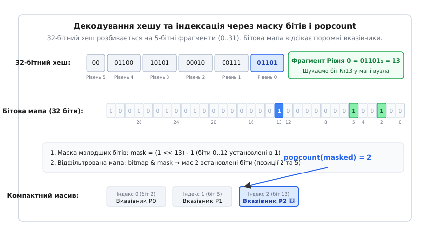
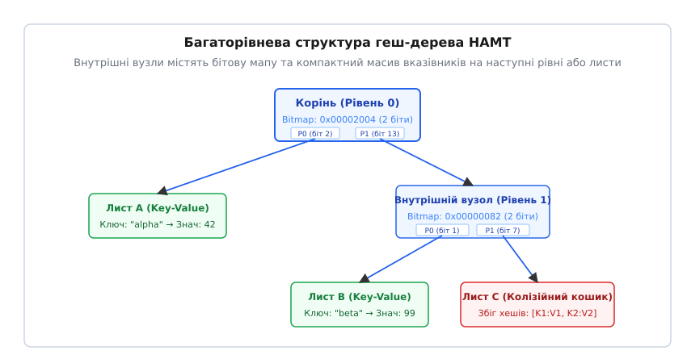
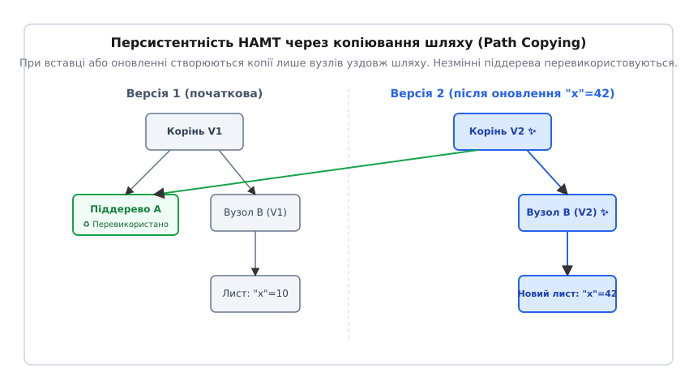

# Hash Array Mapped Trie (HAMT)

<preknowlist>
- [Хеш-таблиця](topic:algorithms/hash-table) — відображення ключів у кошики за допомогою хеш-функції.
- [Копіювання при записі](topic:algorithms/copy-on-write-structures) — механізм збереження попереднього стану через створення копій лише змінених вузлів.
- [Двійкове дерево пошуку](topic:algorithms/binary-search-tree) — древоподібна організація даних для швидкого пошуку.
</preknowlist>

Організація збереження даних у пам'яті комп'ютера тривалий час опиралася на вибір між двома протилежними підходами: асоціативними геш-таблицями зі швидким доступом `O(1)` та ієрархічними деревами з логарифмічним доступом `O(log N)`. Кожен із цих підходів висував власні вимоги до структури пам'яті. Класична геш-таблиця вимагала суцільного масиву в пам'яті, що робило оновлення розміру непередбачуваним за часом і перешкоджало створенню незмінних (персистентних) версій структури. Звичайне префіксне дерево (Trie) забезпечувало просту персистентність через створення нових вузлів уздовж шляху оновлення, але витрачало величезні обсяги пам'яті на порожні вказівники у внутрішніх вузлах.

Структура даних **HAMT** (від англ. *Hash Array Mapped Trie* — геш-дерево з бітовими мапами) вирішує цю інженерну суперечність. Вона поєднує обчислення геш-коду ключа з префіксним розгалуженням на 32 канали, усуваючи перевитрату пам'яті за допомогою бітової маски та апаратно прискореного підрахунку встановлених бітів. Це дозволяє досягти швидкості пошуку, фактично невідмінної від `O(1)`, при збереженні компактності пам'яті та ефективності копіювання при записі.

---

## 1. Конфлікт вибору: геш-таблиці проти префіксних дерев

Щоб зрозуміти причину появи HAMT, необхідно проаналізувати обмеження, із якими зіштовхуються класичні структури даних при роботі з асоціативними масивами (парами «ключ — значення»).

### Замкнене колізійне середовище геш-таблиць

Класична геш-таблиця спирається на функцію `h(k)`, яка відображає довільний ключ `k` на індекс `i` у суцільному масиві розміром `M`:

```
i = h(k) mod M
```

Цей підхід забезпечує середній час пошуку `O(1)`, оскільки адресація комірки пам'яті виконується за одну арифметичну операцію. Проте така архітектура має три суттєві вади:

1. **Ціна динамічного розширення (Rehash):** Коли коефіцієнт заповнення (Load Factor) перевищує межу (наприклад, `0.75`), таблиця змушена виділити новий масив розміром `2M` і перерахувати індекси для всіх наявних елементів. У системному програмуванні це спричиняє раптові затримки (latency spikes), недопустимі для систем реального часу.
2. **Непридатність до структурного суміщення (Structural Sharing):** Якщо програмі потрібно зберегти попередній стан геш-таблиці (наприклад, у функційному програмуванні або при підтримці транзакцій), єдиним способом є повне копіювання всього масиву елементів. Витрати пам'яті та часу при цьому становлять `O(N)`.
3. **Нестійкість до локальності кешу при відсіканні колізій:** Метод ланцюжків (Chaining) створює зв'язані списки для колізійних елементів, що призводить до хаотичних переходів по покажчиках у пам'яті та частих промахів кешу CPU (Cache Misses).

### Проблема порожніх вказівників у префіксних деревах (Trie)

Альтернативою геш-таблицям є префіксні дерева за гешем (Hash Trie). Замість відображення геш-коду на індекс масиву через операцію залишкового ділення `mod M`, геш-код розглядається як послідовність бітових символів (алфавіт).

Якщо обрати розгалуження з кодом довжиною 5 бітів, кожен внутрішній вузол дерева повинен мати `2⁵ = 32` канали для вказівників на дочірні вузли. При пошуку перші 5 бітів геш-коду визначають гілку на рівні 0, наступні 5 бітів — на рівні 1, і так далі.

Перевага такої структури полягає в персистентності: при зміні одного ключа достатньо скопіювати лише вузли вздовж шляху від кореня до листа (глибина не перевищує 6–7 рівнів), а решту піддерева перевикористати без змін. Проте витрати пам'яті у звичайному 32-канальному префіксному дереві є катастрофічними.

Якщо внутрішній вузол має лише 2 або 3 дійсних дочірніх вузли, інші 29–30 елементів масиву вказівників заповнюються значеннями `NULL` (або `nullptr`). На 64-бітних архітектурах один порожній вказівник займає 8 байтів. Вузол із 32 комірками вимагає:

```
32 · 8 байтів = 256 байтів
```

Якщо з них лише 2 вказівники корисні (16 байтів), коефіцієнт корисного використання пам'яті вузла становить лише:

```
(16 / 256) · 100% = 6.25%
```

Решта 93.75% пам'яті витрачається на збереження нулів. У результаті дерево з мільйоном елементів споживає гігабайти пам'яті, а кеш процесора забивається марною інформацією.

---

## 2. Анатомія вузла HAMT: бітові мапи та popcount

Ідея HAMT полягає в тому, щоб зробити масив вказівників у внутрішньому вузлі **динамічним і компактним**, видаливши всі комірки з `NULL`, але зберігши можливість визначати потрібний індекс за одну швидку побітову операцію.


*Декодування 32-бітного хешу на 5-бітні фрагменти та динамічна індексація компактного масиву вказівників через маскування молодших бітів та операцію popcount.*

### Побітова декомпозиція геш-коду

У HAMT геш-код ключа (зазвичай 32-бітне або 64-бітне ціле число) розбивається на однакові фрагменти фіксованої довжини `w`. Стандартним вибором є `w = 5` бітів, що відповідає фактору розгалуження `B = 2⁵ = 32`.

Ділення 32-бітного геш-коду `h` на фрагменти по 5 бітів дає 6 повних рівнів (і один 2-бітний за залишковою схемою):

```
Рівень 0: біти [0..4]    (значення від 0 до 31)
Рівень 1: біти [5..9]    (значення від 0 до 31)
Рівень 2: біти [10..14]  (значення від 0 до 31)
...
Рівень 6: біти [30..31]  (значення від 0 до 3)
```

Для виділення `5`-бітного фрагмента на рівні `L` застосовується операція зсуву та маскування:

```
chunk = (h >> (5 · L)) & 0x1F
```

### Динамічна індексація через бітову маску (Bitmap)

Вузол HAMT не містить фіксованого масиву з 32 вказівників. Натомість він складається з двох полів:
1. **Бітова мапа (`bitmap`):** 32-бітне ціле число без знаку, у якому `k`-й біт встановлено в `1`, якщо в даному вузлі існує дитина з фрагментом гешу `k`. Якщо біт дорівнює `0`, дитини з таким префіксом немає.
2. **Компактний масив вказівників (`children`):** Масив у динамічній пам'яті, розмір якого `m` точно дорівнює кількості одиничних бітів у масці `bitmap`:

```
m = popcount(bitmap)
```

Якщо у вузлі присутні лише 3 дитини (наприклад, для фрагментів `2`, `5` і `13`), бітова мапа буде містити одиниці у позиціях 2, 5 і 13. Масив `children` буде мати довжину точно 3 комірки, де:
- `children[0]` відповідає фрагменту 2;
- `children[1]` відповідає фрагменту 5;
- `children[2]` відповідає фрагменту 13.

### Математичний механізм popcount-адресації

Коли алгоритм шукає або вставляє ключ із фрагментом гешу `k ∈ [0, 31]` на рівні `L`, виникає завдання: як знайти фізичний індекс `idx` у компактному масиві `children`, не здійснюючи лінійного циклічного обходу?

Фізичний індекс елемента в компактному масиві дорівнює **кількості дійсних дітей, які мають менші фрагменти ніж `k`**. Іншими словами, це кількість одиничних бітів у масці `bitmap`, що розташовані в позиціях від `0` до `k - 1`.

Обчислення виконується за три кроки:

1. **Створення маски молодших бітів:** Формується бітова маска, у якій усі біти молодше `k` дорівнюють `1`, а біти від `k` і вище — `0`:

```
mask = (1U << k) - 1
```

Для `k = 13` значення `(1U << 13) - 1` у двійковій системі має вигляд `00000000000000000001111111111111₂` (13 одиниць у бітах 0..12).

2. **Маскування бітової мапи:** Виконується побітове «І» (`AND`) між маскою вузла та маскою молодших бітів:

```
masked_bitmap = bitmap & mask
```

У результаті `masked_bitmap` містить одиниці лише тих дітей вузла, бітові позиції яких строго менші за `k`.

3. **Підрахунок одиниць (`popcount`):** Фізичний індекс у масиві обчислюється як кількість одиничних бітів у відфільтрованій масці:

```
idx = popcount(masked_bitmap)
```

Завдяки сучасним інструкціям процесора (наприклад, `POPCNT` у x86_64 або `CNT` у ARM Assembly), ця операція виконується за **1 такт процесора**.

Детальний алгебраїчний вивід та оцінку колізій наведено в окремому матеріалі [Математичні основи HAMT: побітова індексація, аналіз глибини та колізій](topic:algorithms/hash-array-mapped-trie/math-hamt-popcount.md).

---

## 3. Багаторівнева структура та обхід дерева

Внутрішня організація HAMT являє собою дерево, у якому чергуються внутрішні індексувальні вузли та листові вузли з даними.


*Багаторівнева ієрархія HAMT з внутрішніми вузлами (бітова мапа + вказівники) та листовими кошиками.*

### Типи вузлів HAMT

Для мінімізації накладних витрат пам'яті в HAMT зазвичай використовують два типи вузлів:

1. **Внутрішній вузол (Internal Bitmap Node):** Містить бітову мапу `bitmap` та масив вказівників на дочірні вузли. Вказівник може вести або на інший внутрішній вузол наступного рівня, або безпосередньо на лист.
2. **Листовий вузол (Leaf Node):** Зберігає безпосередньо пара ключ-значення, а також повне значення 32-бітного або 64-бітного гешу ключа.
3. **Колізійний лист (Collision Node):** Створюється лише тоді, коли два різні ключі мають 100% однакові геш-коди на всіх рівнях. Такий вузол містить масив або зв'язаний список усіх колізійних пар.

### Покроковий алгоритм пошуку (Lookup)

Процес пошуку значення за ключем `K` відбувається за наступним алгоритмом:

1. Обчислюється геш-код ключа `h = hash(K)`.
2. Встановлюється початковий вузол `current = root` та зміщення бітів `shift = 0`.
3. Поки `current` є внутрішнім вузлом:
   - Обчислюється фрагмент гешу `chunk = (h >> shift) & 0x1F`.
   - Перевіряється наявність біта: `bit_pos = 1U << chunk`.
   - Якщо `(current.bitmap & bit_pos) == 0`, це означає, що ключ відсутній у дереві. Пошук завершується невдачею.
   - Якщо біт присутній, обчислюється фізичний індекс `idx = popcount(current.bitmap & (bit_pos - 1))`.
   - Здійснюється перехід: `current = current.children[idx]`, а зміщення збільшується: `shift += 5`.
4. Коли `current` є листовим вузлом:
   - Порівнюється збережений у листі геш із `h`, а також виконується пряме порівняння ключів за допомогою `equals(current.key, K)`.
   - Якщо ключі збігаються — значення знайдено. Інакше — ключ відсутній.

---

## 4. Персистентність та копіювання шляху (Path Copying)

Однією з найважливіших переваг HAMT над класичними геш-таблицями є природна підтримка **персистентності** — здатності зберігати попередні версії структури даних після виконання операцій модифікації (вставки, видалення або оновлення).


*Структурне суміщення піддерев при оновленні значення: лише вузли вздовж шляху копіюються для Версії 2, тоді як незмінні гілки перевикористовуються.*

### Механізм Path Copying

Коли в незмінне дерево вставляється новий ключ або оновлюється наявний, замість мутації існуючих вузлів виділяються нові вузли **лише уздовж шляху від кореня до відповідного листа**:

1. Створюється новий листовий вузол із оновленими даними.
2. Для батьківського внутрішнього вузла створюється **нова копія**, бітова мапа якої оновлюється (якщо вставляється новий біт), а в масиві `children` один зі вказівників замінюється на адресу нового листа. Усі інші вказівники в масиві `children` копіюються без змін і продовжують вказувати на ті самі піддерева попередньої версії.
3. Процес копіювання піднімається вгору до кореня, у результаті чого створюється новий корінь `Root_v2`.

Решта піддерев, які не лежали на шляху модифікації, **повністю перевикористовуються** між версіями `v1` та `v2` (це явище називається *Structural Sharing* — структурне суміщення).

### Просторовий та часовий оверхед персистентності

Оскільки глибина HAMT із розгалуженням `B = 32` для `N = 10⁶` елементів не перевищує 4–5 рівнів, операція вставки або оновлення створює лише 4–5 нових дрібних вузлів.

- **Часова складність оновлення:** `O(log₃₂ N)` (на практиці 4–5 переходів).
- **Обсяг нової пам'яті на операцію:** `O(log₃₂ N)` новостворених байтів.

Автоматичне управління пам'яттю застарілих версій здійснюється через лічильники посилань (наприклад, `std::shared_ptr` у C++) або через збирач сміття (Garbage Collector у JVM/CLR).

Детальну реалізацію персистентного HAMT із використанням копіювання шляху мовами C та C++20 наведено у вставці [Практична реалізація HAMT мовами C та C++](topic:algorithms/hash-array-mapped-trie/proj-hamt.md).

### Тимчасова мутабельність (Transient Collections)

Хоча персистентні колекції забезпечують безпеку в багатопотоковому середовищі, пакетне додавання 100 000 елементів по одному викликало б створення півмільйона тимчасових вузлів. Для вирішення цієї проблеми у Clojure та Scala застосовується концепція **Transient HAMT**:

1. Викликом метода `.as_transient()` корінь дерева переводиться в локальний мутабельний режим.
2. Усі вставки та оновлення виконуються через вільну мутацію наявних вузлів "in-place" без копіювання шляху.
3. Після завершення пакетної обробки викликом `.persistent!()` корінь заморожується назад у незмінну персистентну структуру.

Це дозволяє поєднати швидкість локальної геш-таблиці при побудові з безпекою персистентного дерева при читанні.

---

## 5. Варіації та похідні структури даних

Концепція HAMT породила ціле сімейство адаптованих структур даних для спеціалізованих інженерних задач.

### Array Mapped Trie (AMT)

Якщо замість геш-коду довільного об'єкта використовувати безпосередньо цілочисельний індекс масиву `0, 1, 2, ...`, HAMT перетворюється на **Array Mapped Trie (AMT)**. Саме ця структура є основою для незмінних векторів (Persistent Vectors) у мовах Clojure та Scala. Вона забезпечує ефективну індексацію за номером елемента `vec[i]` та розширення масиву в кінець за амортизований час `O(1)`.

### Concurrent Trie (Ctrie)

Для високопаралельних багатьохпроцесорних систем класичне копіювання шляху або блокування м'ютексами створює вузькі місця. У 2011 році Філ Багвелл та Олександр Прокопець розробили **Ctrie** — мутабельну лок-фрі (Lock-Free) версію HAMT.

У Ctrie замість копіювання вузлів використовуються атомарні інструкції CPU `Compare-And-Swap` (CAS) над спеціальними індирекційними вузлами (I-nodes). Це дозволяє сотням паралельних потоків одночасно читати та оновлювати різні гілки дерева без жодного м'ютекса, а також створювати миттєві знімки стану (Snapshots) за `O(1)` за допомогою механізму поколінь (Generations).

### Merkle Patricia Trie (MPT)

У криптографічних системах та блокчейн-мережах (зокрема в Ethereum) використовується **Merkle Patricia Trie**. Це поєднання ідей HAMT, PATRICIA tree та геш-дерев Меркла:
- Кожен вузол містить криптографічний геш (SHA-3 / Keccak-256) своїх дітей.
- Порожні рівні з одним дочірнім вузлом стискаються (Path Compression).
- Корінне значення гешу (State Root) однозначно засвідчує стан усієї бази даних із мільйонами акаунтів, дозволяючи перевіряти транзакції за допомогою компактних криптографічних доказів (Merkle Proofs).

---

## 6. Аналіз продуктивності та локальності кешу CPU

Сучасні процесори вимагають від структур даних не лише низької асимптотичної складності, а й максимальної адаптованості до кєш-ліній процесора (Cache Line).

### Оптимізація під лінію кешу (64 байти)

У більшості процесорів x86_64 та ARM64 розмір кеш-лінії L1 дорівнює 64 байтам. Розглянемо розмір вузла HAMT:
- Поле `bitmap`: 4 байти.
- Вказівник на масив `children`: 8 байтів.
- При середній кількості дітей `m = 4..6`, динамічний масив вимагає `4..6 · 8 = 32..48` байтів.

Таким чином, типовий внутрішній вузол HAMT разом із дочірніми вказівниками повністю вміщується в **одну кеш-лінію процесора (64 байти)**. Це означає, що при переході на наступний рівень дерева процесор підвантажує з оперативної пам'яті весь вузол та всі його вказівники за один шинний такт.

### Порівняльна таблиця характеристик

| Характеристика | Геш-таблиця (Open Addressing) | Червоно-чорне дерево (Red-Black Tree) | B-Tree (M-way Tree) | **HAMT (32-way Trie)** |
| :--- | :--- | :--- | :--- | :--- |
| **Час пошуку (середній)** | `O(1)` | `O(log₂ N)` | `O(log_M N)` | **`O(log₃₂ N) ≈ O(1)`** |
| **Час пошуку (найгірший)** | `O(N)` | `O(log₂ N)` | `O(log_M N)` | **`O(W / 5)` (фіксований)** |
| **Персистентність / CoW** | Жахлива (`O(N)` пам'яті) | Добра (`O(log₂ N)` вузлів) | Посередня (`O(M log_M N)`) | **Ідеальна (`O(log₃₂ N)`)** |
| **Динамічний Rehash** | Потрібен (паузи `O(N)`) | Не потрібен | Не потрібен | **Не потрібен** |
| **Витрати на порожні вказівники**| Відсутні | Відсутні | Відсутні | **Відсутні (popcount)** |
| **Локальність кешу CPU** | Відмінна | Погана | Висока | **Добра (вузли дрібні)** |

> 🔧 **Навіщо це.**
> HAMT є незамінним інструментом у сучасних високонавантажених і паралельних системах:
> 1. **Незмінні колекції у функційному програмуванні:** HAMT є базовим каркасом для Map та Set у мовах Clojure, Scala, Haskell та Elixir. Вона дозволяє передавати гігантські асоціативні масиви між потоками без блокувань (Thread-Safe) та без ризику мутації.
> 2. **Системи збереження стану та блокчейн:** Багаторівневі геш-дерева (зокрема варіанти Patricia HAMT) використовуються в Ethereum (Merkle Patricia Trie) для швидкого обчислення корінного гешу стану (State Root) та порівняння версій баз даних за `O(1)`.
> 3. **Висококонкурентні Lock-Free структури:** Алгоритм Ctrie (Concurrent Trie на основі HAMT) дозволяє виконувати атомарні безблокувальні оновлення вказівників через інструкції CAS (Compare-And-Swap) без використання глобальних м'ютексів.

Детальніше про історичний шлях розробки цієї структури можна прочитати у матеріалі [Історія виникнення HAMT та ідеальних хеш-дерев](topic:algorithms/hash-array-mapped-trie/hist-hamt.md).
