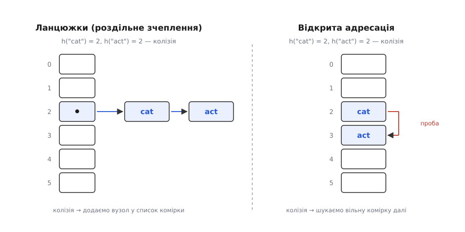
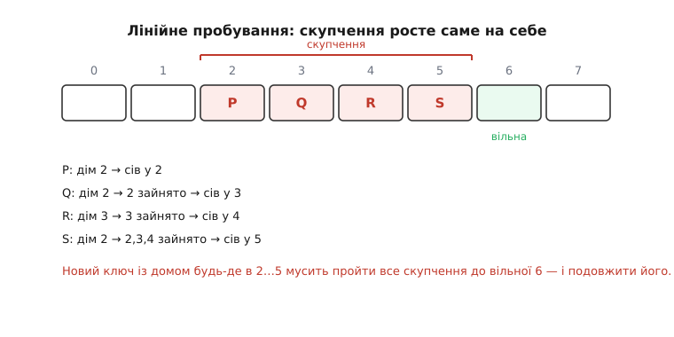
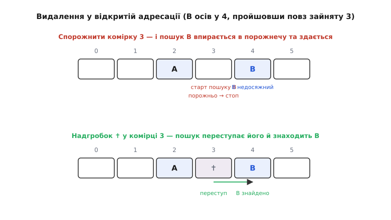
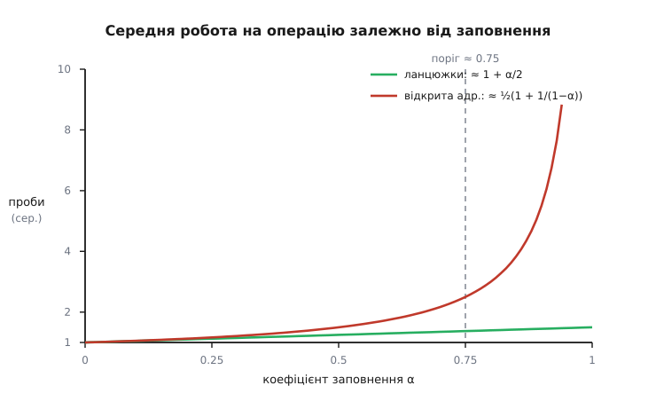

# Хеш-таблиця

<preknowlist>
- [Масив](topic:algorithms/array) — суцільна індексована пам'ять: до комірки за цілим індексом `arr[i]` звертаються за один крок, незалежно від розміру масиву.
- [Асимптотична складність](topic:algorithms/asymptotic-complexity) — що означає O(1), O(log n), O(n): яка операція «стала», яка «лінійна», і чому це вирішує долю структури.
- [Модульна арифметика](topic:math/modular-arithmetic) — остача від ділення й те, як нею згорнути велике число в діапазон 0…m−1.
- [Амортизований аналіз](topic:algorithms/amortized-analysis) — усереднена вартість операції за довгу серію, коли поодинокі операції бувають дорогими.
</preknowlist>

Масив дає найшвидший доступ, який узагалі можливий: комірка `arr[5]` знаходиться за один крок, бо процесор обчислює її адресу арифметикою — початок масиву плюс 5 розмірів елемента — і йде туди безпосередньо. Розмір масиву тут ні до чого: мільйонна комірка дістається так само швидко, як п'ята. Але ця блискавична адресація вимагає, щоб ключ був **малим цілим числом** — індексом у межах 0…m−1. А в реальних задачах ключ — це рядок `"user_9174"`, 64-бітний ідентифікатор, IP-адреса, ціле ім'я. Ви знаєте `"Ада"` і хочете її телефон; масив же вміє відповідати лише на питання «що лежить у комірці номер 5?».

Ось прірва, яку треба перекрити. Якби ключі самі були числами 0, 1, 2, …, m−1, задачі б не існувало — клали б значення в комірку з номером ключа й діставали миттєво. Уся хитрість хеш-таблиці в одному: **виготовити** з довільного ключа те мале ціле число, якого бракує, — і вжити його як індекс. Функцію, що це робить, звуть **хеш-функцією**, а масив, у який вона цілиться, — **хеш-таблицею**. Тоді і той, хто кладе значення, і той, хто його шукає, проганяють ключ крізь ту саму функцію, дістають ту саму адресу — і знаходять комірку без жодного перебору. Саме так хеш-таблиця реалізує [сховище «ключ — значення»](topic:algorithms/key-value-store) — інтерфейс `put`/`get`/`delete` — зі сталою вартістю доступу.

## Хеш-функція: викувати індекс із ключа

Перетворення ключа в індекс складають із двох окремих кроків, і плутати їх — джерело помилок. Спершу **хеш-код**: ключ будь-якої природи стискають у ціле число, зазвичай широке, 32- чи 64-бітне. Потім **згортання** (компресію): це широке число заганяють у вузький діапазон 0…m−1, де m — кількість комірок. Розділення не випадкове: хеш-код залежить лише від ключа й ні від чого більше, а от діапазон залежить від поточного розміру таблиці, який із часом змінюється.

Слово **хеш** (англ. *hash* — сікти, кришити, робити фарш) точно описує перший крок: функція «кришить» ключ на, здавалося б, безладне число, у якому від початкового ключа не лишається видимої структури. Від хеш-коду хочуть трьох речей, і кожна має причину. Він мусить бути **детермінованим** — той самий ключ завжди дає те саме число, інакше значення не знайдеться там, куди його поклали. Він мусить **розсіювати рівномірно** — близькі й схожі ключі повинні розлітатися по всьому діапазону, бо якщо всі ключі скупчаться в кількох числах, скупчаться й адреси, і таблиця виродиться. І він мусить бути **дешевим** — його рахують на кожен `get` і `put`, тож повільна функція з'їсть увесь виграш від сталого доступу.

Наївна спроба — скласти коди літер рядка — провалює другу вимогу. Ключі `"cat"` і `"act"` складаються з тих самих літер, тож дають однакову суму, а отже, однакову адресу, хоч це різні слова. Функція, сліпа до **порядку** символів, зіштовхує всі анаграми в одну комірку. Лік — домішати позицію: множити накопичене число на сталу основу перед додаванням кожного наступного символу, щоб «вага» символу залежала від того, де він стоїть.

**Приклад (поліноміальний хеш рядка).** Візьмімо основу 31 і рахуймо схемою Горнера — старий надійний спосіб перетворити рядок на число, у якому кожен символ важить тим більше, чим ближче до кінця:

```
h = 0
"c": h = 0·31 + 99  = 99
"a": h = 99·31 + 97 = 3166
"t": h = 3166·31 + 116 = 98262
```

Тепер згорнімо в таблицю на 8 комірок остачею від ділення:

```
98262 mod 8 = 6      → комірка 6
```

А для анаграми `"act"` та сама схема дає інше число й інше місце:

```
"a": h = 97
"c": h = 97·31 + 99  = 3106
"t": h = 3106·31 + 116 = 96402
96402 mod 8 = 2      → комірка 2
```

Порядок символів увійшов у результат — і `"cat"` із `"act"` роз'їхалися по різних комірках (6 і 2), тоді як наївна сума посадила б їх в одну. Основа 31 не магічна: це невелике непарне просте число, множення на яке процесор до того ж уміє робити зсувом і відніманням (`x·31 = (x<<5) − x`). Справжні некриптографічні хеші — FNV, MurmurHash — влаштовані складніше (домішують ще й побітові зсуви та множення на великі константи), але переслідують ту саму мету: щоб зміна навіть одного біта ключа перевертала половину бітів хеш-коду. Це **не** те саме, що [криптографічна хеш-функція](topic:programming/cryptographic-hash): тій потрібна стійкість до навмисного підбору й вона свідомо повільна, а хешу для таблиці — лише швидкість і рівномірність.

Другий крок, згортання, теж має свої пастки. Остача від ділення `h mod m` — найпростіший спосіб, і він добрий, коли m — просте число: тоді дільник не «викушує» регулярних бітових візерунків із хеш-коду. Якщо ж узяти m степенем двійки, `h mod m` перетворюється на швидке маскування молодших бітів (`h & (m−1)`) — але тоді старші біти хеш-коду взагалі не впливають на адресу, і поганий хеш, що ворушить лише старші біти, посадить усе в кілька комірок. Тому таблиці зі степенем-двійки м вимагають якісного хешу з добрим перемішуванням, а таблиці з простим m (див. [прості числа](topic:math/prime-numbers)) прощають слабший хеш. Обидва підходи живі; вибір між ними — компроміс між швидкістю згортання й вимогами до якості хешу.

> 🔧 **Навіщо це.** Якість хеш-функції — не академічна дрібниця, а різниця між таблицею, що працює за O(1), і таблицею, що тихо деградує до списку. Коли профайлер показує, що «швидка» хеш-мапа несподівано гальмує на певному наборі ключів, причина майже завжди тут: ключі мають спільну структуру (однаковий префікс, вирівняні адреси, послідовні числа), яку слабкий хеш не розсіює, і всі вони скупчуються в жменьці комірок. Готові хеші стандартних бібліотек (той же MurmurHash чи хеш рядків у мові) обрані саме тому, що добре перемішують типові ключі; писати власний хеш варто, лише розуміючи, які ключі до вас прийдуть.

## Колізія: чому вона неминуча

Хоч би яка гарна була хеш-функція, вона не рятує від фундаментальної арифметики. Можливих ключів — незліченно багато (усі рядки, усі 64-бітні числа), а комірок — скінченна кількість m. Утиснути нескінченну множину в скінченну без збігів неможливо: за **принципом Діріхле** (якщо предметів більше, ніж шухляд, у якусь шухляду потрапить двоє) знайдуться два ключі з однаковою адресою. Це **колізія** (лат. *collisio* — зіткнення), і саме навколо неї крутиться вся інженерія хеш-таблиць.

Гірше того, колізії з'являються набагато раніше, ніж підказує інтуїція. Це той самий ефект, що й **парадокс днів народження**: у групі всього з 23 людей уже ймовірніше, ніж ні, що двоє народилися одного дня, хоч днів 365. Причина — рахуються не окремі збіги з конкретним днем, а **пари**: із зростанням кількості ключів число пар, які можуть зіткнутися, росте квадратично. У таблиці на m комірок перша колізія стається в середньому вже після приблизно √m вставок — для тисячі комірок це якихось три десятки ключів. Тож колізії — не рідкісна прикрість, якою можна знехтувати, а звичайний стан справ, який структура **мусить** обробляти коректно й дешево. Хеш-таблиця, по суті, **визначається** тим, як вона це робить, — і тут розходяться дві великі родини рішень.


*Два ключі, що дали однакову адресу, розведені двома різними способами. **Ланцюжки (роздільне зчеплення):** комірка масиву тримає не запис, а покажчик на зв'язаний список усіх пар, чий ключ сюди влучив; колізія просто додає ще один вузол до списку. **Відкрита адресація:** усі записи живуть безпосередньо в масиві, а при зіткненні другий ключ іде шукати вільну комірку далі за наперед відомим правилом. Ліворуч колізії висять збоку від таблиці, праворуч — розповзаються всередині неї.*

## Стратегія перша: ланцюжки

Найпряміша відповідь на колізію — дозволити комірці тримати більш ніж один запис. У **роздільному зчепленні** (англ. *separate chaining*) кожна комірка масиву зберігає не пару «ключ — значення», а посилання на [зв'язаний список](topic:algorithms/linked-list) усіх пар, чиї ключі згорнулися в цю адресу. Операції стають прозорими: щоб покласти пару, обчислюємо комірку й додаємо вузол на початок її списку; щоб знайти — обчислюємо комірку й перебираємо її короткий список, порівнюючи ключі; щоб видалити — знаходимо вузол у списку й вирізаємо його. Обчислення комірки — стале; уся змінна вартість — у довжині ланцюжка.

А довжина ланцюжка в середньому дорівнює простій величині: **коефіцієнту заповнення** α = n/m, тобто числу записів на одну комірку. Якщо хеш розсіює рівномірно, n записів розкладаються по m комірках приблизно порівну, тож у кожному ланцюжку осідає близько α елементів. Звідси вартість пошуку — O(1 + α): стала на обчислення адреси плюс α на пробіг ланцюжком. Поки α тримають невеликим (скажімо, близько 1), ланцюжки короткі, і кожна операція коштує фактично сталу роботу. Докладний вивід того, чому середня довжина ланцюжка дорівнює саме α, розписано в [аналізі через коефіцієнт заповнення](topic:algorithms/key-value-store/math-load-factor.md).

Ланцюжки прощають багато. Таблиця не «переповнюється» раптово: навіть коли α переростає одиницю, вона лише плавно сповільнюється, бо ланцюжки подовжуються поступово. Видалення тривіальне — просто вирізаєш вузол. Але за цю поблажливість платять двічі. По-перше, кожен вузол списку — це окремий шматочок пам'яті десь у купі, і пробіг ланцюжком стрибає по не сусідніх адресах, а процесорний кеш такі стрибки ненавидить: два елементи одного ланцюжка можуть лежати за кілометри один від одного в пам'яті, і кожен стрибок — промах кеша. По-друге, на кожен запис іде додаткова пам'ять під покажчик (а то й два), і при дрібних значеннях цей службовий тягар переважує самі дані. Обидві вади мають спільний корінь: дані розкидані поза масивом. Друга родина рішень б'є саме в цей корінь.

## Стратегія друга: відкрита адресація

А що, як не заводити жодних списків, а тримати всі записи **всередині** самого масиву — по одному на комірку — і колізію розв'язувати пошуком іншої вільної комірки в тому ж масиві? Це **відкрита адресація** (англ. *open addressing*): «відкрита» означає, що остаточна адреса запису не прибита до хеш-коду намертво, а може виявитися іншою коміркою. Коли обчислена комірка вже зайнята, ключ починає **пробувати** (англ. *probe* — зондувати) наступні за наперед визначеною послідовністю, аж поки не натрапить на порожню, — там і осідає. Пошук діє дзеркально: обчислює першу комірку й іде тією ж послідовністю проб, порівнюючи ключі, доки не знайде свій (успіх) або не впреться в порожню комірку (ключа немає — інакше він осів би тут).

Найпростіша послідовність проб — **лінійна**: пробуй комірку h, потім h+1, h+2, … (по колу, за модулем m). Один рядок:

```c
size_t idx = (hash(key) + i) % m;   // i = 0, 1, 2, ... до вільної комірки
```

Лінійне пробування любить кеш саме там, де ланцюжки його мучили: сусідні проби — це сусідні комірки масиву, які лежать поруч у пам'яті й затягуються в кеш одним махом. Але в нього є власна, підступна вада. Коли кілька зайнятих комірок стають поспіль, вони зливаються у **скупчення** (англ. *primary clustering*), і будь-який новий ключ, чия адреса впала будь-куди в це скупчення, мусить пройти його все до кінця й ще й подовжити. Скупчення притягують ключі, а притягнуті ключі роблять скупчення довшими — воно росте саме на себе. Причому зливаються навіть ключі, що не мали спільної початкової адреси: досить, щоб їхні проби перетнулися.


*Чотири ключі з близькими адресами злилися у суцільне скупчення комірок 2–5. Ключ P сів у свою комірку 2. Ключ Q мав ту саму адресу 2 — вона зайнята, тож він пройшов до 3. Ключ R цілив у 3 — зайнято P-подовженням, пройшов у 4. Ключ S цілив знову в 2 і мусив прочовгати аж до 5. Тепер новий ключ із будь-якою адресою від 2 до 5 змушений пройти все скупчення до вільної комірки 6 — і продовжити його. Що довше скупчення, то ймовірніше воно спіймає наступний ключ і виросте ще.*

Скупчення — плата за передбачуваність лінійного кроку, і його гасять, ламаючи регулярність проб. **Квадратичне пробування** відходить від адреси не на 1, 2, 3, а на 1, 4, 9, … (i²), тож ключі з однаковою першою адресою розлітаються, не встигаючи злитися в суцільну смугу. **Подвійне хешування** йде ще далі: крок проби сам обчислюють другою хеш-функцією від ключа, тож два різні ключі з однаковою першою адресою крокують по-різному й майже не заважають одне одному. Обидва прийоми зменшують скупчення ціною гіршої дружби з кешем (проби вже не сусідні). Який із трьох способів обрати — залежить від того, що дорожче на конкретній машині: зайві проби чи промахи кеша.

## Видалення: пастка надгробків

У відкритій адресації видалення таїть халепу, якої немає в ланцюжках. Здавалося б, знайшов ключ — очисти його комірку. Але порожня комірка для пошуку означає «далі шукати нема сенсу, ключа немає»; отже, спорожнивши комірку в середині чиєїсь послідовності проб, ви обриваєте той шлях, і ключі, що осіли **за** нею, стають недосяжними — пошук упреться в свіжу порожнечу й здасться, хоч ключ лежить трохи далі.


*Ключ B осів у комірці 4, пройшовши пробами повз зайняту 3 від своєї адреси 3. Якщо видалити ключ із комірки 3 і лишити її просто порожньою, пошук ключа B почнеться з адреси 3, побачить порожнечу й вирішить, що B немає, — хоч B лежить у сусідній 4. Рішення — позначити звільнену комірку **надгробком**: особливою міткою «тут колись був запис». Пошук, зустрівши надгробок, не спиняється, а йде далі; вставка ж може надгробок перезаписати. Так шлях проб лишається цілим.*

Вихід — не спорожняти комірку, а ставити в неї **надгробок** (англ. *tombstone*): особливу мітку «тут був запис, але його прибрали». Для пошуку надгробок прозорий — він переступає через нього й іде далі за пробами, тож обірвані шляхи зцілюються. Для вставки надгробок — вільне місце, яке можна зайняти. Але надгробки накопичуються: після багатьох видалень таблиця повниться мітками, які подовжують проби, не несучи даних, — тож при розширенні чи перехешуванні їх виметають, лишаючи тільки живі записи. Ланцюжки цієї мороки не знають зовсім: там видалення — просте вирізання вузла.

## Коефіцієнт заповнення й розширення

Обидві стратегії деградують, коли таблиця заповнюється, але по-різному. У ланцюжках вартість росте лінійно й лагідно: α = 2 означає ланцюжки завдовжки два, α = 3 — завдовжки три. У відкритій адресації вартість вибухає, коли α підповзає до одиниці: вільних комірок лишається обмаль, і проба мусить обійти майже все, перш ніж натрапити на порожнечу. Точна залежність відома: для рівномірного хешування середнє число проб при невдалому пошуку — близько 1/(1−α), і воно злітає в небо, щойно α → 1. При заповненні 90 % (α = 0.9) це вже десяток проб на операцію, при 99 % — сотня.


*Чому таблицю розширюють, не чекаючи, доки вона наповниться. Горизонтально — коефіцієнт заповнення α від 0 до 1, вертикально — середня робота на операцію. Ланцюжки (зелена) ростуть лінійно, майже байдуже до заповнення. Відкрита адресація (червона) тримається чудово, поки місця вдосталь, але стрімко злітає, коли α наближається до 1, за законом 1/(1−α). Вертикальна риска на α ≈ 0.75 — типовий поріг, за яким таблицю подвоюють: ліворуч від неї операції фактично сталі, праворуч ціна швидко стає нестерпною.*

Звідси політика: стежити за α і, щойно він переростає поріг (типово 0.7…0.75, для відкритої адресації радше нижчий), **розширювати** таблицю. Розширення — це не просто збільшення масиву. Адреса кожного ключа — це `hash(key) mod m`, і вона залежить від m; варто m змінитися, як усі адреси перераховуються. Тому таблицю не можна просто «доточити»: заводять новий масив, зазвичай удвічі більший, і **перехешовують** — проганяють кожен наявний ключ крізь згортання за новим розміром і кладуть у нову комірку. Старий масив по тому викидають.

Одне таке перехешування коштує O(n) — треба торкнутися всіх n записів. Звучить дорого, але трапляється воно рідко: між двома розширеннями таблиця подвоюється, тож більшість вставок — дешеві, сталі, і лише зрідка одна натикається на дороге перехешування. Якщо розмазати вартість поодинокого O(n)-сплеску на всі дешеві вставки, що йому передували, на кожну вставку припадає стала частка роботи. Тому кажуть, що вставка коштує O(1) **амортизовано** — усереднено за довгу серію, попри поодинокі дорогі піки; чому саме подвоєння (а не додавання сталого шматка) дає сталу амортизовану ціну, показано в [амортизованому аналізі](topic:algorithms/amortized-analysis). Там, де довгі паузи неприйнятні (система реального часу), перехешування роблять **поступовим** — переносять по кілька ключів на кожній звичайній операції, розтягуючи O(n)-роботу тонким шаром, щоб жодна окрема операція не застрягла.

Строгий вивід середнього числа проб для відкритої адресації — і чому лінійне пробування деградує ще швидше за формулу 1/(1−α), — а також поняття універсального хешування, що дає гарантію в середньому навіть проти невдалих ключів, зібрано в [аналізі відкритої адресації](topic:algorithms/hash-table/math-open-addressing.md). Робочу реалізацію хеш-таблиці на відкритій адресації — з хешем FNV-1a, лінійним пробуванням, надгробками й розширенням — розібрано покроково в [проєкті на C](topic:algorithms/hash-table/proj-open-addressing.md).

## Гарантії, напади й межі

Уся сила хеш-таблиці — у слові «в середньому». O(1) на операцію справджується, **якщо** хеш розсіює ключі рівномірно. У найгіршому разі, коли всі n ключів згортаються в одну адресу, ланцюжок стає списком на n елементів, а проби обходять усю таблицю, — і операція вироджується в O(n). За випадкових ключів це майже неможливо. Але ключі не завжди випадкові.

Якщо зловмисник знає вашу хеш-функцію, він може **навмисно** дібрати ключі, що всі згортаються в одну комірку, і надіслати їх на сервер — кожна вставка стає O(n), і таблиця, а з нею й уся служба, застигає під квадратичним навантаженням від жменьки запитів. Це **напад хеш-затоплення** (англ. *hash flooding*), окремий випадок ширшого класу атак на алгоритмічну складність, який ще 2003 року описали Скотт Кросбі й Ден Воллах; хвиля реальних атак на вебсервери прокотилася наприкінці 2011-го. Захист — **рандомізоване** хешування: у функцію домішують таємний ключ, свій на кожен процес, тож нападник не може передбачити, які ключі зіткнуться. Саме для цього 2012 року Жан-Філіпп Омассон і Деніел Бернстайн створили [SipHash](topic:programming/cryptographic-hash) — швидку хеш-функцію з ключем, яку відтоді взяли за типовий хеш рядків Python, Rust, Ruby та інші. Ціна безпеки — трохи повільніший хеш; плата за безпеку майже завжди така.

Є й вроджена межа, яку не залатати жодним хешем. Хеш-таблиця свідомо **розкидає** ключі без ладу — у цьому вся ідея рівномірного розсіювання, — тож вона не тямить нічого про порядок. Питання «дай усі ключі між X та Y», «дай найменший», «пройдися по зростанню» для неї не існують: вона знає лише точну адресу точного ключа. Коли порядок потрібен, беруть [двійкове дерево пошуку](topic:algorithms/binary-search-tree) — трохи повільніше (O(log n) замість O(1)), зате ключі там упорядковані й діапазонні запити природні. Коли ж даних більше, ніж влазить в одну машину, ключі розкидають по багатьох вузлах — і тут наївне «вузол = хеш за кількістю вузлів» ламається (додав вузол — і майже все переїхало), тому вживають [консистентне хешування](topic:algorithms/consistent-hashing), стійке до появи й зникнення вузлів.

Нарешті, дві стратегії — не остання відповідь. **Хешування зозулі** (англ. *cuckoo hashing*, Расмус Паг і Флемінг Родлер, 2001) дає кожному ключу дві можливі комірки від двох хеш-функцій і, вселяючись, виштовхує звідти чужий ключ у його другий дім — як зозуля з гнізда, звідки й назва; натомість пошук завжди перевіряє рівно дві комірки, тобто гарантовано O(1) навіть у найгіршому разі. **Хешування Робін Гуда** зменшує розкид довжин проб, «відбираючи» місце в ключів, що недалеко відійшли від дому, на користь тих, хто відійшов далеко. Кожна така схема по-своєму торгує пам'яттю, швидкістю й простотою; спільне ядро незмінне — обчислити адресу з ключа й якось розвести неминучі колізії. Як ця ідея народилася в надрах IBM 1950-х і виросла в те, що сьогодні стоїть під кожним словником, розказано в [історії хешування](topic:algorithms/hash-table/hist-hashing-birth.md).

---

Хеш-таблиця перекриває прірву між довільним ключем і швидкою адресацією масиву, **обчислюючи** індекс просто з ключа замість того, щоб його шукати. За це вона віддає дві речі: порядок ключів (їх навмисне розкидано) і гарантію в найгіршому разі (яка тримається лише в середньому). Усе інше в її устрої — інженерія навколо однієї неминучої обставини: ключів більше, ніж комірок, тож колізії будуть завжди. Хеш-функція вирішує, наскільки рівно ключі ляжуть; стратегія колізій — ланцюжки чи відкрита адресація — вирішує, як розвести тих, що зіткнулися; коефіцієнт заповнення й розширення тримають таблицю в тій зоні, де операції справді сталі. Розібравшись у цих трьох важелях, ви розумієте не одну структуру, а той самий механізм, що тихо працює під кожним `dict`, `map` і `HashMap`, які ви коли-небудь викличете.
