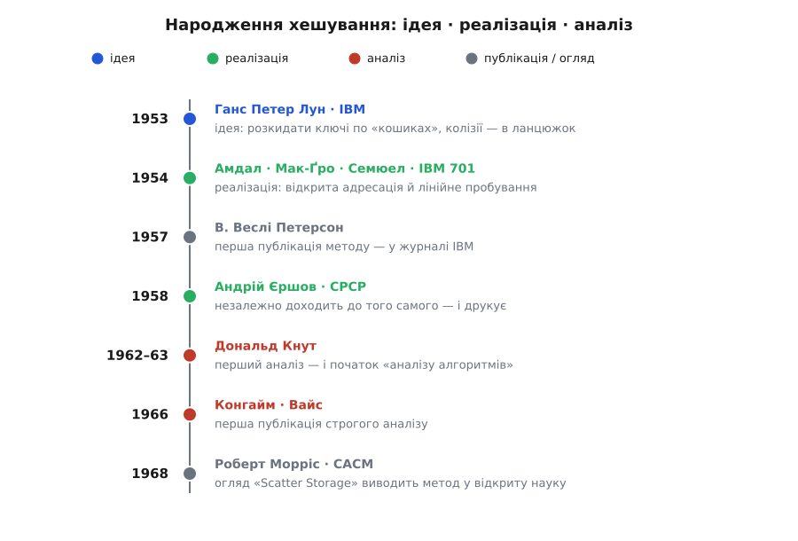

# 📜 Народження хешування: винахід, у якого немає одного винахідника

Хеш-таблиця — рідкісний випадок, коли майже по роках видно, як гола ідея стала методом, метод — робочою практикою, практика — теорією, а теорія — спільним надбанням; і на кожному з цих кроків стояли різні люди, здебільшого не знаючи одне про одного. Уся головна історія вмістилася в п'ятнадцять років — від службової записки 1953-го до оглядової статті 1968-го — і повчальна саме тим, що на питання «хто винайшов хеш-таблицю?» чесної однослівної відповіді немає. Замість одного імені тут ланцюжок людей, кожен з яких додав рівно одну ланку: хтось — думку, хтось — код, хтось — доведення.

*П'ятнадцять років і сім кроків. Кольори розрізняють природу внеску, і в цьому вся суть історії: ідею (синій) подав один, робочу реалізацію (зелений) — інші й незалежно ще одні, строгий аналіз (червоний) — треті, а у відкриту літературу все це винесли оглядові публікації (сірий). Жоден рядок не покриває всіх інших.*

## Службова записка Луна (січень 1953)

Почалося не зі статті, а з внутрішньої службової записки IBM. У січні 1953-го інженер Ганс Петер Лун (Hans Peter Luhn) — німець родом із Бармена, той самий, чиє ім'я носить контрольна цифра банківських карток, — записав думку, яка сьогодні здається очевидною, а тоді була нова. Щоб швидко знаходити запис за ключем, не треба тримати ключі впорядкованими й не треба їх перебирати: досить обчислити з ключа число й розкидати записи по «кошиках» (buckets) за цим числом. Коли двом ключам випадає той самий кошик, їх не викидають і не шукають іншого місця, а зчіплюють один за одним у ланцюжок усередині кошика.

Це та сама ідея, яку сьогодні звуть роздільним зчепленням, — і подана вона була першою, ще до того, як у когось з'явилося слово «хешування». Варта уваги й побічна деталь тієї записки: щоб зчепити записи одного кошика, Лун описав структуру, де кожен елемент зберігає посилання на наступний, — і це один із найраніших відомих описів [зв'язаного списку](book:algorithms/linked-list). Одна коротка записка, отже, містила зародок одразу двох речей, на яких досі стоїть половина програмування. Статус цього факту — добре засвідчений: записка збереглася в архівах IBM і датована, на неї спирається історичний розділ Кнутової монографії.

## Асемблер для IBM 701 (1954): троє й символьна таблиця

Наступна ланка визріла роком пізніше — і це вже зовсім інша ідея, породжена конкретною інженерною скрутою. Група в IBM писала асемблер для машини IBM 701 — першого серійного наукового комп'ютера фірми. Асемблеру потрібна **символьна таблиця**: він читає текст програми, натрапляє на імена міток на кшталт `LOOP` чи `SUM` і мусить швидко пам'ятати, якій адресі відповідає кожне ім'я. Задачу «зробити цю таблицю» дістала Ілейн Беме (Elaine Boehme) — молода співробітниця, яку роком раніше найняв до IBM Джин Амдал (Gene Amdahl); згодом, по заміжжі, вона підписувалася Ілейн Мак-Ґро (Elaine McGraw).

Разом із Амдалом і Артуром Семюелом (Arthur Samuel) вона розв'язала задачу інакше, ніж Лун. Ніяких зовнішніх ланцюжків: усі записи живуть безпосередньо в одному масиві, по одному на комірку. Коли обчислена комірка вже зайнята чужим ключем, новий ключ не заводить окремого списку, а йде масивом далі, комірка за коміркою, доки не натрапить на вільну. Так за одне літо 1954-го народилися відразу дві речі — **відкрита адресація** й **лінійне пробування**, — які й досі стоять під більшістю швидких хеш-таблиць. Цікаво, що обидві великі стратегії розв'язання колізій з'явилися майже поспіль і незалежно: зчеплення — у записці Луна, відкрита адресація — в асемблері IBM 701.

Тут варто спинитися на іменах. Двоє з тієї трійці стали в інформатиці знаменитими — але за геть інші справи. Джин Амдал заклав архітектуру IBM System/360 і дав своє ім'я закону Амдала про межу пришвидшення від паралелізму. Артур Семюел написав програму, що грала в шашки й сама вчилася на власних партіях, і саме він увів у обіг вислів «машинне навчання». А третє ім'я — тієї, кому, власне, й доручили символьну таблицю, — сьогодні майже забуте, хоча метод настільки ж її, наскільки їхній. Прикметно, що в першій же публікації метод приписали всім трьом поіменно, Беме зокрема; забуття прийшло пізніше, від переказу до переказу. Історія винаходів раз у раз висвічує так яскраво тих, хто прославився чимось іншим, і лишає в тіні того, чиїм був сам винахід.

## «Так природно, що винаходили не раз» — Петерсон і Єршов

Метод трійці з IBM кілька років жив лише в пам'яті колег та внутрішніх записках, поки 1957-го його вперше не описав у пресі Веслі Петерсон (W. Wesley Peterson) — у журналі IBM, у праці про доступ до пам'яті з довільною вибіркою. Петерсон чесно віддав першість Семюелові, Амдалу й Беме, але додав спостереження, яке стало пророчим: метод настільки природний, що його майже напевно винаходили незалежно й до, і після них.

І це виявилося буквальною правдою — та ще й по інший бік залізної завіси. У 1958 році радянський математик і програміст Андрій Єршов (Andrey Ershov), працюючи в Москві над способами програмувати арифметику, самостійно дійшов до тієї самої відкритої адресації з лінійним пробуванням і надрукував її. Він не міг знати ні про внутрішню записку IBM, ні про роботу Петерсона; це був справді паралельний винахід. Так вважає й Дональд Кнут (Donald Knuth) — головний літописець хешування, — прямо називаючи Єршова незалежним співвідкривачем методу. Єршов потім став одним із батьків радянського системного програмування, заснував обчислювальний центр у Новосибірську й цілу сибірську школу інформатики; лінійне пробування — лише рання нота в його доробку.

Два винаходи одного й того самого за чотири роки, у двох країнах, що майже не спілкувалися, — найкращий доказ Петерсонового спостереження. Коли ідея дозріла, вона проростає в кількох головах воднораз; питання «хто перший» тут менш цікаве за питання «чому це стало неминучим».

## Рукопис, що не вийшов друком (Кнут, 1962–63)

Досі йшлося про ідею та її втілення. Бракувало третього — теорії: ніхто ще строго не порахував, скільки ж коштує лінійне пробування, коли таблиця заповнюється. Цю ланку додав Дональд Кнут — і сам винахід аналізу став для нього поворотним.

Улітку 1962-го, працюючи в Медісоні (Madison) у штаті Вісконсин, Кнут узявся вирахувати, скільки в середньому проб робить лінійне пробування залежно від заповнення таблиці. Відповідь виявилася напрочуд глибокою: коли до заповнення бракує частки δ, середня робота на операцію росте десь як `≈ 1/δ` — тобто вибухає, щойно таблиця близька до повної. У цьому обчисленні вже прозирало те, що згодом назвуть [амортизованим аналізом](book:algorithms/amortized-analysis): Кнут дивився не на поодиноку операцію, а на усереднену вартість за довгу серію вставок.

Кнута так захопила математика, що виринула з цієї на позір буденної задачі, що вона визначила напрям усього його життя. Він сам пізніше згадував: то був його перший аналіз алгоритму. Він записав викладки в нотатку «Notes on Open Addressing» і датував її 22 липня 1963-го, з припискою, що обчислення зроблено ще влітку 62-го в Медісоні. Ту нотатку так ніколи й не надрукували — вона розійшлася в рукописі з рук у руки, — але саме з неї заведено вести цілу галузь, **аналіз алгоритмів**: систематичне обчислення того, скільки роботи алгоритм справді коштує. Перша ж **публікація** строгого аналізу лінійного пробування вийшла окремо, 1966 року, з-під пера Алана Конгайма (Alan Konheim) й Бенджаміна Вайса (Benjamin Weiss). Знову те саме роздвоєння, що й у Єршова з Петерсоном: хто зробив і хто надрукував — різні дати й нерідко різні люди.

## Морріс виводить хешування у відкриту науку (1968)

Лишалася остання ланка — не наукова, а радше суспільна. Хоч хешування вже років п'ятнадцять як існувало й працювало, у відкритій літературі його майже не було: воно жило в коридорах IBM та усних переказах, і чимало теоретиків дивилися на нього зверхньо, як на спритний трюк, не вартий поважної публікації. Саме тому переломною стала оглядова праця Роберта Морріса (Robert Morris) «Scatter Storage Techniques», надрукована в січні 1968-го в головному часописі галузі — Communications of the ACM.

Моррісова стаття не додала принципово нового методу; її вага в іншому. Вона зібрала докупи розпорошене доти знання, показала, що хешування — не хитрощі, а повноцінна й потужна техніка зберігання з малим середнім часом доступу, і винесла і сам метод, і його словник із фольклору в наукову літературу, де його нарешті стали вивчати й розвивати відкрито. Це той нерідкий у техніці випадок, коли добрий огляд важить не менше за первісний винахід: він робить винахід спільним. (Побіжна деталь для колекціонерів іронії: цей самий Роберт Морріс, згодом провідний криптограф Bell Labs і головний науковець АНБ, — батько Роберта Тапана Морріса, автора «хробака Морріса», що 1988-го поклав чималу частину раннього інтернету.)

## Винахід без винахідника

Тепер видно, чому на початку не знайшлося одного імені. Хешування не винайшли — його **зібрали**, ланка за ланкою, і кожну ланку кував хтось інший. Ідею розкидати ключі й зчепити колізії подав Лун. Другу, протилежну стратегію — тримати все в масиві — придумали Беме, Амдал і Семюел, а тоді, за завісою, ще й Єршов. Строго порахував ціну Кнут, надрукували аналіз Конгайм і Вайс, а всю справу вивів у відкриту науку огляд Морріса.

Ця історія — не просто хроніка, а урок, як узагалі влаштовані винаходи. Варто щоразу розрізняти, хто **подав ідею**, хто **зробив робочу реалізацію**, хто **довів, що і скільки вона коштує**, а хто **виніс її у широкий обіг**, — бо це, як правило, різні люди, і склеювати їх в одну постать «винахідника» означає викривляти те, що сталося насправді. Хеш-таблиця тим і зручна для науки, що на ній це роздвоєння видно майже по місяцях: ідея, реалізація, аналіз і поширення лягли в окремі роки й на окремі імена. Коли наступного разу хтось скаже «X винайшов Y», варто спитати — яку саме ланку? Найчастіше виявиться, що ланок було кілька, і рук — теж.
