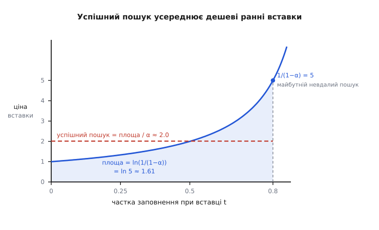
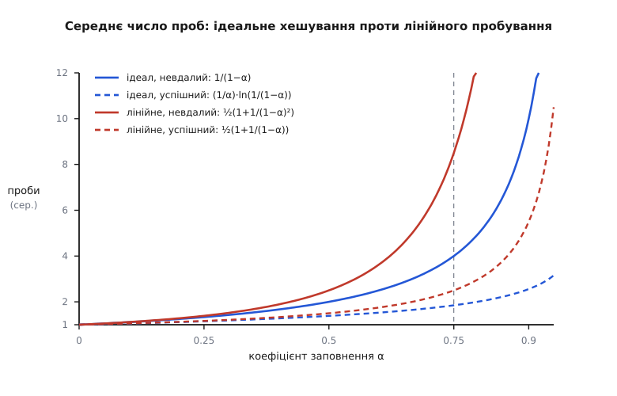

# 🧮 Ціна однієї проби: точна арифметика відкритої адресації

Скільки кроків-проб коштує пошук у таблиці з відкритою адресацією — не «сталу в середньому», а точну функцію заповнення α? Нижче виведено три відповіді й одну гарантію: очікуване число проб за ідеалізованого рівномірного хешування (невдалий пошук ≈ 1/(1−α), успішний ≈ (1/α)·ln(1/(1−α))), поправку Кнута на реальне лінійне пробування, де скупчення підносять знаменник до квадрата, і, нарешті, те, що взагалі дає право писати слова «в середньому», — універсальне сімейство хеш-функцій, чия оцінка тримається навіть проти ключів, дібраних ворогом.

Домовимося про позначення раз. У таблиці m комірок і n записів, α = n/m, і для відкритої адресації α < 1: записів не буває більше, ніж комірок. **Проба** — одне звертання до комірки: обчислили за пробною послідовністю адресу, глянули, що там. Рахуємо саме проби, бо все інше на пробу стале — обчислити хеш, порівняти ключ.

## Модель: рівномірне хешування

Уся викладка спирається на одне припущення, яке треба назвати чесно, бо далі виявиться, що реальність його порушує. **Рівномірне хешування**: пробна послідовність кожного ключа ⟨h(k,0), h(k,1), …, h(k,m−1)⟩ однаково ймовірно є будь-якою з m! перестановок адрес 0…m−1. Наслідок, яким ми й користуємося: кожна наступна проба, за умови що попередні впали в зайняте, потрапляє в рівномірно випадкову з-поміж іще не оглянутих комірок.

Це ідеалізація. Її добре наближає подвійне хешування (крок проби сам залежить від ключа, тож послідовностей аж ~m²), а от лінійне пробування — грубо порушує: у нього всього m різних послідовностей, по одній на стартову комірку, бо далі йдуть жорсткі +1, +2, +3. Саме тому лінійне пробування дістане нижче окрему, гіршу відповідь. А поки що рахуємо ідеал.

## Невдалий пошук: геометричний ряд до 1/(1−α)

Невдалий пошук іде пробами, доки не впреться в **порожню** комірку — там і присуд «ключа немає». Отже, всі проби, крім останньої, влучили в зайняте. Нехай X — число проб. Оцінюємо ймовірність, що проб буде щонайменше i+1, тобто що перші i проб усі влучили в зайняті комірки:

```
Pr[X ≥ i+1] = Pr[перші i проб — усі в зайняті]

перша проба в зайняту:                     n/m
друга, якщо перша влучила:          (n−1)/(m−1)
…
i-та, якщо попередні влучили:   (n−i+1)/(m−i+1)

Pr[X ≥ i+1] = (n/m)·((n−1)/(m−1))···((n−i+1)/(m−i+1))
```

Тепер ключова нерівність. Кожен множник (n−j)/(m−j) не більший за n/m = α, бо n ≤ m, а віднімання того самого j від чисельника й знаменника дробу, меншого за одиницю, лише зменшує його:

```
(n−j)/(m−j) ≤ n/m = α      ⟺   (n−j)·m ≤ n·(m−j)   ⟺   m ≥ n   ✓
```

Отже кожен множник ≤ α, а їх i штук, тож Pr[X ≥ i+1] ≤ αⁱ. Лишається згорнути сподівання. Для невід'ємної цілої величини сподівання дорівнює сумі «хвостів»:

```
E[X] = Σ Pr[X ≥ i+1]   ≤   Σ αⁱ   =   1/(1−α)
       i≥0                  i≥0
```

Остання сума — звичайний геометричний ряд, і його стеля 1/(1−α) і є відповідь.

Інтуїція за формулою проста, і варто її мати перед очима. Уявіть, що частка α комірок зайнята, і кожна проба — незалежний постріл у випадкову комірку, який влучає в зайняту з імовірністю α. Число пострілів до першої порожньої — геометрична величина з імовірністю успіху (1−α), а її середнє — рівно 1/(1−α). Насправді ми ще й **вибираємо** зайняті комірки з пулу в міру ходу, тож таблиця перед кожною наступною пробою трішки менш заповнена, і точне сподівання ледь менше — воно дорівнює (m+1)/(m+1−n), — але 1/(1−α) є робочою стелею й границею при великих m.

```
α = 0.50  →   2 проби
α = 0.75  →   4 проби
α = 0.90  →  10 проб
α = 0.99  → 100 проб
```

> 🔧 **Навіщо це.** Полюс в одиниці — не просто «дорого під кінець», а прискорення. Похідна 1/(1−α) дорівнює 1/(1−α)², тобто **гранична** ціна ще одного ключа росте як **квадрат** самої ціни. При α = 0.9 кожен наступний ключ додає до очікуваної проби вже близько 1/(0.1)² = 100 одиниць нахилу — таблиця не сповільнюється плавно, вона зривається. Ось арифметична причина, чому відкриту адресацію розширюють, коли ще повно місця: не тому, що вона «майже повна», а тому, що з певної миті кожен новий ключ коштує непропорційно більше за попередній.

## Успішний пошук: середнє по історії вставок

Успішний пошук виглядав би складнішим — ключ десь усередині чиєїсь пробної послідовності, — але його ціна дістається задарма з попереднього результату. Пошук ключа k проходить **точно ту саму** послідовність проб, якою k колись вставляли; а вставка k була не чим іншим, як невдалим пошуком (пробуємо, доки не знайдемо порожнє, і кладемо туди). Тож ціна знайти k тепер = ціна того невдалого пошуку тоді.

А тоді таблиця була порожніша. Якщо k вставляли (i+1)-м за ліком (перед ним уже лежало i ключів), заповнення в ту мить було i/m, і очікувана ціна його вставки ≤ 1/(1 − i/m) = m/(m−i). Успішний пошук навмання бере один із n ключів, тож усереднюємо цю ціну по всій історії вставок:

```
E ≤ (1/n)·Σ  m/(m−i)   =   (m/n)·Σ  1/(m−i)   =   (1/α)·Σ  1/(m−i)
        i=0…n−1               i=0…n−1                i=0…n−1

  = (1/α)·( 1/m + 1/(m−1) + … + 1/(m−n+1) )   =   (1/α)·(H_m − H_{m−n})
```

де H_k = 1 + 1/2 + … + 1/k — гармонічне число. Різницю гармонічних чисел затискаємо інтегралом: функція 1/x спадна, тож сума її значень не більша за площу під нею:

```
H_m − H_{m−n} = Σ  1/j   ≤   ∫ dx/x  =  ln( m/(m−n) )  =  ln( 1/(1−α) )
              j=m−n+1…m    m−n…m
```

Звідси відповідь:

```
E ≤ (1/α)·ln( 1/(1−α) )
```

Чому тут **логарифм**, а не полюс, видно з тієї самої історії вставок. Ціна вставити (i+1)-й ключ, 1/(1−i/m), повзе від 1 (порожня таблиця) до 1/(1−α) (майже повна). Успішний пошук усереднює цей похилий підйом, а не платить його вершину. Площа під кривою 1/(1−t) від 0 до α — це рівно ln(1/(1−α)); поділена на ширину α, вона дає середню висоту, тобто ціну пошуку.


*Крива — ціна вставити черговий ключ, 1/(1−t), у міру наповнення таблиці від t = 0 до t = α = 0.8. Праворуч вона злітає до 5 (це майбутній невдалий пошук при α = 0.8), але успішний пошук платить не її, а **середню висоту** заштрихованої області: площа під кривою дорівнює ln(1/(1−α)) = ln 5 ≈ 1.61, а поділена на ширину α = 0.8 дає ≈ 2.0 проби. Ранні ключі вставлялися в майже порожню таблицю майже задарма — і саме вони тягнуть середнє вниз, обертаючи полюс на логарифм.*

```
α = 0.50  →  (1/0.50)·ln 2   = 1.39 проби
α = 0.75  →  (1/0.75)·ln 4   = 1.85
α = 0.90  →  (1/0.90)·ln 10  = 2.56
α = 0.99  →  (1/0.99)·ln 100 = 4.65
```

Ось разюча асиметрія: при α = 0.99 невдалий пошук коштує сотню проб, а успішний — менш як п'ять. Причина не в удачі, а в порядку: наявний ключ вставлявся, коли тіснява ще не набралася, тож він сидить у ранній, ще просторій частині; відсутній ключ зустрічає таблицю такою, яка вона є зараз, — на повній тісняві.

## Лінійне пробування: звідки квадрат (результат Кнута)

Уся викладка вище стояла на **незалежності** проб. Лінійне пробування цю опору вибиває. Проби — сусідні комірки h, h+1, h+2, тож зайняті комірки зливаються у суцільні пробіги (скупчення), і хто впав будь-куди в пробіг, мусить дочовгати до його кінця. Зайнятість сусідів додатно корельована — тієї незалежності, що дала охайний геометричний ряд, більше нема, і відповідь мусить бути інша.

Дональд Кнут порахував її точно 1963 року в записці «Notes on 'open' addressing» — і сам відзначив це як **свій перший аналіз алгоритму**, зроблений улітку 1962-го в Медісоні; історики відліковують від цієї викладки народження точного аналізу алгоритмів як галузі. Для лінійного пробування з заповненням α:

```
невдалий пошук / вставка   ≈   ½·( 1 + 1/(1−α)² )
успішний пошук             ≈   ½·( 1 + 1/(1−α) )
```

Дивіться на знаменник невдалого: там, де ідеал мав простий полюс 1/(1−α), скупчення підносять його до **квадрата** 1/(1−α)². Звідки квадрат — коротко про це так. Довжина дочовгування від випадкової точки падіння визначається не середньою довжиною пробігу, а тією, яку відчуває випадкова точка: довгі пробіги ловлять більше точок, тож у гру входить **другий момент** довжин пробігів — а він при наближенні до заповнення росте як 1/(1−α)², проти першого моменту 1/(1−α) незалежної моделі. (Повний вивід — то генеративні функції Кнута з його Q-функціями, тут ми беремо результат.) Порівняймо обидва невдалі пошуки в лоб:

```
   α       ідеал 1/(1−α)      лінійне ½(1+1/(1−α)²)
 0.50            2                     2.5
 0.75            4                     8.5
 0.90           10                    50.5
 0.99          100                  5000.5
```

Квадрат — це і є плата за скупчення. При α = 0.9 лінійне пробування вп'ятеро дорожче за ідеал, при α = 0.99 — уп'ятдесятеро. Успішний пошук лінійне пробування псує м'якше, але теж псує: замість лагідного логарифма — той самий полюс 1/(1−α), лише вдвічі притлумлений.

```
   α     ідеал (1/α)ln(1/(1−α))     лінійне ½(1+1/(1−α))
 0.50            1.39                       1.5
 0.75            1.85                       2.5
 0.90            2.56                       5.5
 0.99            4.65                      50.5
```


*Усі чотири формули на одному полі, обидві пари віялом з точки (0, 1). Суцільні — невдалий пошук, пунктир — успішний; синє — ідеальне рівномірне хешування, червоне — лінійне пробування. Червоне всюди над синім (ціна скупчення), суцільне над пунктиром (відсутній ключ дорожчий за наявний). Головне видно з розриву суцільних кривих під правим краєм: синій полюс 1/(1−α) ще тримається на висоті, а червоний ½(1+1/(1−α)²) уже вилетів за стелю — квадрат зриває криву значно раніше.*

> 🔧 **Навіщо це.** Різницю (1−α) проти (1−α)² можна перевести в пам'ять. Щоб утримати, скажімо, бюджет у 4 проби на невдалий пошук, ідеальному хешуванню (подвійному) вистачає α = 0.75; лінійному ж треба ½(1+1/(1−α)²) = 4, звідки 1/(1−α)² = 7, тобто α = 1 − 1/√7 ≈ 0.62. За той самий бюджет швидкості лінійне пробування мусить жити на нижчому заповненні; а що пам'ять на ключ пропорційна 1/α, то це приблизно на п'яту частину (1/0.62 проти 1/0.75, ≈ 20 %) більше комірок під ту саму кількість ключів. Ось точна ціна його дружби з кешем: сусідні проби задарма влітають у кеш, зате полюс у знаменнику підноситься до квадрата. Що дорожче на конкретній машині — промахи кеша чи зайва пам'ять, — те й вирішує вибір між лінійним і подвійним хешуванням.

## Універсальне сімейство: перенести кістку з ключів на функцію

Усе пораховане досі трималося на фразі «хеш розсіює ключі так, ніби навмання». Але ключі не випадкові. Гірше: якщо зловмисник знає вашу закріплену хеш-функцію, він добере ключі, що всі до одного згортаються в одну адресу, — і кожна операція виродиться в O(n) (напад хеш-затоплення). Порятунок несподіваний: прибрати випадковість із ключів і перенести її на **саму хеш-функцію**.

Ларрі Картер і Марк Веґман назвали потрібну властивість 1979 року (*Universal classes of hash functions*, Journal of Computer and System Sciences, том 18; доповідь — STOC'77). Скінченне сімейство H функцій із ключів у 0…m−1 звуть **універсальним**, якщо для будь-яких двох **різних** ключів x ≠ y

```
Pr[ h(x) = h(y) ]  ≤  1/m,        де h береться навмання з H
```

Прочитайте, де живе ймовірність. Два **закріплені** різні ключі стикаються — з імовірністю не більш як 1/m — коли навмання тягнемо **h**. Це рівно те число, що дало б розсіювання навмання, тільки джерело випадковості інше: ключі чиї завгодно (хоч ворожі), а кістку кидаємо ми.

Тепер головна теорема — оцінка довжини ланцюжка проти найгіршого набору. Закріпимо **будь-яку** множину S з n ключів (хай її склав ворог). Витягнемо h навмання з універсального H. Для ключа x нехай C_x — скільки **інших** ключів S сіли в ту саму комірку, що й x. Тоді:

```
E[C_x]  ≤  n/m  =  α          для x поза таблицею
E[довжина ланцюжка x]  =  E[1 + C_x]  ≤  1 + (n−1)/m  <  1 + α     для x у таблиці
```

Доведення — три рядки на індикаторах. Для різних x, y заведімо I_{xy} = 1, якщо h(x) = h(y), інакше 0. Його сподівання — це ймовірність колізії, а вона за універсальністю ≤ 1/m. Далі — лінійність сподівання (сподівання суми дорівнює сумі сподівань, завжди, без жодної незалежності):

```
E[C_x] = Σ  E[I_{xy}]  ≤  (число таких y)·(1/m)
         y∈S, y≠x

x поза S:  таких y рівно n     →  E[C_x] ≤ n/m = α
x у  S:    таких y рівно n−1   →  довжина = 1 + C_x,  E ≤ 1 + (n−1)/m < 1 + α        ∎
```

Придивіться, що́ доведення вжило: **лише** попарну оцінку 1/m. Ні незалежності всіх n ключів, ні випадковості в самих ключах. Тому оцінка тримається для **найгіршого** набору. Ворог обирає ключі перший (вони закріплені), **потім** ми тягнемо h — і він не може наперед порахувати колізії, бо не знає, яку h ми витягли. Це і є захист від хеш-затоплення, доведений, а не сподіваний.

## Конкретне сімейство: два множення, дві остачі, гарантія

Означення варте свідка — сімейства, яке справді дає ≤ 1/m. Класичне, від Картера й Веґмана: беруть просте p, більше за будь-який можливий ключ (тож ключі лежать у 0…p−1), і навмання дві сталі a ∈ {1…p−1}, b ∈ {0…p−1}. Функція зводить ключ двічі — спершу за модулем простого p, потім за модулем розміру таблиці m ([модульна арифметика](topic:math/modular-arithmetic) — остача від ділення):

```
h(x)  =  ( (a·x + b) mod p )  mod m
```

Доведімо, що це сімейство універсальне. Закріпимо різні x ≠ y з 0…p−1 і позначмо проміжні лишки

```
r = (a·x + b) mod p,      s = (a·y + b) mod p
```

**Крок 1: r ≠ s.** Різниця r − s ≡ a·(x−y) (mod p). Тут вирішальна простота p: при простому p кожен ненульовий лишок має обернений за модулем, тож ненульові множники не можуть дати нуль. А a ≠ 0 за вибором, і x − y ≢ 0, бо x ≠ y і обидва менші за p; отже a·(x−y) ≢ 0, тобто r ≠ s. (Чому простота p це гарантує — у [простих числах](topic:math/prime-numbers) та [оберненому за модулем](topic:math/modular-inverse): обернений існує рівно тоді, коли число взаємно просте з модулем, а при простому p взаємно прості з ним усі ненульові лишки.)

**Крок 2: пари (a, b) і пари (r, s) — у взаємно однозначній відповідності.** Для будь-якої цілі (r, s) з r ≠ s система

```
a·x + b ≡ r  (mod p)
a·y + b ≡ s  (mod p)
```

має єдиний розв'язок: віднімання дає a·(x−y) ≡ r − s, звідки a ≡ (r−s)·(x−y)⁻¹ (обернений існує, бо p просте), а тоді b ≡ r − a·x. І a ≠ 0, бо r ≠ s. Отже p·(p−1) наборів (a, b) лягають бієкцією на p·(p−1) упорядкованих пар (r, s) з r ≠ s. А раз (a, b) рівномірні, то й (r, s) рівномірні по всіх парах із r ≠ s.

**Крок 3: рахуємо колізії.** Колізія h(x) = h(y) означає r ≡ s (mod m) при r ≠ s. Порахуймо такі пари: закріпимо r (p способів); скільки s ∈ 0…p−1 дають той самий лишок за модулем m? Їх ⌈p/m⌉ або менше, а виключивши s = r — щонайбільше ⌈p/m⌉ − 1 ≤ (p−1)/m. Отже колізійних пар не більш як p·(p−1)/m. Ділимо на всі p·(p−1) пар:

```
Pr[ h(x)=h(y) ]  =  (колізійних пар)/(усіх пар)  ≤  [ p·(p−1)/m ] / [ p·(p−1) ]  =  1/m      ∎
```

Два множення й дві остачі — і гарантія, якої не дасть жодна закріплена функція, хоч би яку хитру ви написали: ворог не знає ваших a і b, тож не має за що зачепитися.

Ось де замикається вся стаття. Формули 1/(1−α), (1/α)·ln(1/(1−α)) і навіть квадрат Кнута — усі промовлені «в середньому», і те середнє означало «усереднене по випадковому розкиданню ключів». Універсальне хешування обертає цю фразу з надії на дані в теорему про власну кістку: не молимося, щоб ключі виявилися випадковими, — самі кидаємо кістку при старті. Ворог може знати кожну сталу вашого коду й однаково не знати, яку h ви витягли; тому очікуваний ланцюжок лишається ≤ 1 + α — і O(1) тримається проти нього, а не лише проти невдачі.
