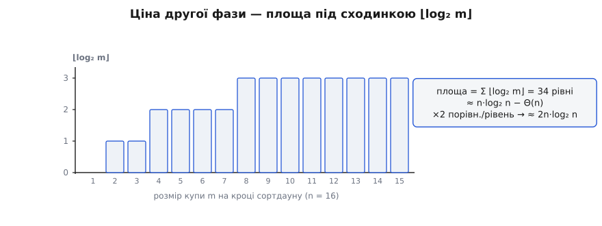

# 🧮 Математика heapsort: точна ціна другої фази й доказ, що щастя не буде

Порахуймо heapsort до останнього порівняння — і доведімо річ, яка спершу обурює: жоден вхід із різними ключами, хоч би який лагідний, не спускає сортування купою нижче за Ω(n log n). Щасливого лінійного випадку, який має, скажімо, сортування вставками на вже впорядкованому масиві, тут немає взагалі. Три величини вичерпують арифметику алгоритму, і всі три варто вивести, а не приймати на віру: точне число порівнянь у фазі витягання максимумів; межу знизу, що забороняє щасливий випадок; і — для повноти — чому побудова купи коштує лише O(n). Почнімо з дешевого й піднімаймося до найтоншого.

## Дешева фаза: побудова за O(n) у два рядки

Побудова просіює вниз кожен внутрішній вузол, ідучи з кінця масиву до кореня. Вузол **висоти** h коштує щонайбільше h обмінів (тонути можна лише донизу, а під ним усього h рівнів), а таких вузлів у повному дереві небагато: що вища точка, то рідша, бо кожен новий рівень удвічі менший. Точніше, вузлів висоти h не більше за n/2ʰ. Уся робота — зважена сума «скільки вузлів × як глибоко кожен тоне»:

```
T(n)  ≤  Σₕ (n / 2ʰ) · h  =  n · Σₕ h/2ʰ
```

Усе тепер тримається на одному нескінченному ряді Σ h/2ʰ. Він скінченний, і береться трюком подвоєння: нехай S = Σₕ₌₁ h/2ʰ; випишемо S і його половину зі зсувом на доданок і віднімемо:

```
 S    =  1/2 + 2/4 + 3/8 + 4/16 + …
 S/2  =        1/4 + 2/8 + 3/16 + …
 ────────────────────────────────
 S − S/2  =  1/2 + 1/4 + 1/8 + …  =  1
```

Праворуч — звичайна геометрична сума, що дорівнює 1. Отже S/2 = 1, тобто **S = 2**, і

```
T(n)  ≤  n · 2  =  2n  =  O(n)
```

Не тому, що вузли дешеві, а тому, що дорогих вузлів мало: половина — листки з нульовою висотою, чверть коштує по кроку, і одиниці найдорожчих угорі не встигають зіпсувати суму. Повне виведення — з точним підрахунком вузлів кожної висоти і навіть закритою формою «сума всіх висот = n − s₂(n)» — розгорнуто в [математиці купи](topic:algorithms/priority-queue/math-heap-analysis.md). Нам тут досить підсумку: **побудова коштує O(n)** і на тлі другої фази просто зникає. Уся неминуча вага сортування живе не тут.

## Точна ціна другої фази

Друга фаза робить (n−1) просіювань вниз. Те, що просіює новий корінь у купі розміру m, іде вздовж однієї гілки заввишки ⌊log₂ m⌋ і на кожному рівні робить **два** порівняння — спершу знайти більшу з двох дітей, тоді звірити з нею елемент. Тож одне просіювання коштує щонайбільше 2·⌊log₂ m⌋ порівнянь, а купа при цьому пробігає всі розміри від n−1 до 1. Уся фаза — сума:

```
C  ≤  2 · Σₘ₌₁^{n−1} ⌊log₂ m⌋
```

Лишилося взяти цю суму точно — і тут працює гарний прийом: **групувати доданки за значенням підлоги**. Рівність ⌊log₂ m⌋ = j справджується рівно для тих m, що лежать у проміжку [2ʲ, 2ʲ⁺¹−1], а таких значень рівно 2ʲ, і кожне додає j. Для повних груп j = 0…H−1 (де H = ⌊log₂ n⌋) це дає Σ j·2ʲ, а верхня, неповна група j = H додає H·(n − 2ᴴ + 1):

```
Σₘ₌₁^{n} ⌊log₂ m⌋  =  Σⱼ₌₀^{H−1} j·2ʲ  +  H·(n − 2ᴴ + 1)
```

Внутрішню суму беруть тим самим подвоєнням: Σⱼ₌₀^{H−1} j·2ʲ = (H−2)·2ᴴ + 2. Підставмо, зведімо доданки з 2ᴴ (виходить (H−2)·2ᴴ − H·2ᴴ = −2·2ᴴ = −2ᴴ⁺¹) — і лишається чиста закрита формула:

```
Σₘ₌₁^{n} ⌊log₂ m⌋  =  (n+1)·⌊log₂ n⌋  −  2^{⌊log₂ n⌋+1}  +  2
```

**Умова: скільки занурень робить друга фаза для n = 16.**

Сортдаун занурює елемент у купах розміру від 15 до 1, тож сумуємо до m = 15, де ⌊log₂ 15⌋ = 3:

```
Σₘ₌₁^{15} ⌊log₂ m⌋  =  (15+1)·3 − 2⁴ + 2  =  48 − 16 + 2  =  34
```

Тридцять чотири рівні занурення на всю фазу; помножити на два порівняння на рівень — **щонайбільше 68 порівнянь**, щоб відсортувати шістнадцять елементів. (Пряма перевірка підсумовуванням 0+1+1+2+2+2+2+3+3+3+3+3+3+3+3 дає ті самі 34.)

Тепер асимптотика. Головний член формули — (n+1)·⌊log₂ n⌋ ≈ n·log₂ n; від нього віднімається 2^{⌊log₂ n⌋+1}, а це щось між n і 2n. Тому

```
Σₘ₌₁^{n} ⌊log₂ m⌋  =  n·log₂ n  −  Θ(n)
```

а вся друга фаза коштує **C ≈ 2·n·log₂ n** порівнянь (точніше 2n·log₂ n + O(n)). Ось звідки та «двійка» перед n log n, якою heapsort програє швидкому сортуванню по сталій множниці: два порівняння на кожен із приблизно n·log₂ n рівнів занурення.



*Ціна другої фази — це площа під сходинкою ⌊log₂ m⌋. Для n = 16 вона дорівнює 34 рівням занурення; головний член площі — n·log₂ n, а два порівняння на рівень підіймають підсумок до ≈ 2n·log₂ n.*

## Немає щасливого входу: чому навіть найкращий випадок — Ω(n log n)

Оцінку зверху ми маємо. Питання протилежне й тонше: чи існує вхід, на якому heapsort раптом упорається за лінію? Багато сортувань мають такий подарунок. У heapsort його немає, і це не спостереження, а теорема.

Спершу відокремимо те, що дається задарма. Будь-яке [сортування порівняннями](topic:algorithms/comparison-sort-lower-bound) мусить у найгіршому й у середньому випадку зробити щонайменше log₂(n!) ≈ n·log₂ n порівнянь — просто щоб розрізнити n! перестановок. Тож «важкі» й «типові» входи для heapsort гарантовано Ω(n log n) ще до будь-якого аналізу самого алгоритму. Цікавий саме **найкращий** випадок — єдиний, якого ці загальні межі не покривають: адже мінімум по входах може бути малим, як у тих-таки вставках, де вже впорядкований масив коштує O(n).

Зведімо все до одного лічильника. У другій фазі кожне порівняння або веде до обміну (елемент тоне на рівень нижче), або зупиняє спуск. Тож число порівнянь не менше за число обмінів, а число обмінів — це рівно сумарна глибина всіх занурень:

```
порівняння  ≥  обміни  =  Σ_кроків (на скільки рівнів занурився елемент)
```

Отже «немає лінійного випадку» рівносильне твердженню: **сумарна глибина занурень не може бути малою** — на жодному вході з різними ключами.

Чому ж елемент, посаджений у корінь, тоне глибоко? Спуск зупиняється рівно там, де елемент x стає **не меншим за обох дітей**. А в купі це значить більше, ніж здається: якщо x зупинився у вузлі v, то за властивістю купи x ⩾ **усе піддерево** під v — не лише діти, а всі нащадки, бо кожна дитина не менша за своїх. Зупинитися на глибині d означає перевершити цілу піддереву-масу під точкою зупину.

Ось де пастка для входу, що прагнув би бути «щасливим». Угорі піддерева величезні: під вузлом на глибині d сидить близько m/2ᵈ елементів. Щоб x зупинився високо (мале d), він мусить бути більшим майже за все дерево — а таких, майже-найбільших, елементів лише жменя. Переважна більшість менші за свою піддереву-масу нагорі й тому проскакують її, тонучи далі. У повному дереві є ще й геометричний замок: усі листки сидять на глибині ⌊log₂ m⌋ або на одну вище — мілких місць для зупину просто немає, зупинитися рано можна, лише ставши королем цілого піддерева.

Єдина шпарина — **однакові ключі**. Коли всі елементи рівні, умова зупину «x ⩾ більша дитина» справджується вже в корені: x дорівнює дітям, тонути нікуди, глибина занурення 0. Тоді кожне з (n−1) просіювань — двоє порівнянь і жодного обміну, разом Θ(n). Саме тому строге твердження завжди уточнює: **різні ключі**. З рівними ключами heapsort таки лінійний, але це вироджений випадок, а не подарунок для реальних даних.


*Спуск зупиняється, лише коли x ⩾ обидві дитини. Мала величина у корені (тут 2) цього не діждеться до самого листа — тоне на всю висоту. Єдина втеча — рівні ключі: тоді x дорівнює дітям, зупинка на глибині 0, і вся друга фаза стає лінійною.*

Найкраще недовіру лікує підрахунок. Візьмімо вхід, який *виглядає* найлагіднішим — уже відсортований за зростанням масив із 63 різних чисел — і покрутімо heapsort до кінця, лічачи занурення другої фази:

```
n = 63, вхід [1, 2, 3, …, 63]  (вже відсортований за зростанням)

максимум можливих занурень:  Σₘ₌₁^{62} ⌊log₂ m⌋  =  253
фактичні занурення сортдауну:                        237
```

Двісті тридцять сім із щонайбільших двохсот п'ятдесяти трьох: уже впорядкований вхід виконує **94 %** усієї можливої роботи занурення. Лінійний випадок означав би, що занурень усього близько n, тобто ~63; натомість їх 237 — учетверо більше, і зі зростанням n частка від максимуму лише росте (для n ≈ 65 тисяч це вже понад 98 %). «Відсортованість», яку сортування вставками зчитує як підказку й доробляє за лінію, купа під час побудови просто перемішує — і друга фаза платить майже повну ціну. Для контрасту, той самий n = 63, але з усіма **рівними** ключами дає рівно 0 занурень і 121 ≈ 2n порівнянь: ото і є лінійна втеча, і лише вона.

Один вхід — це ще не всі. Може, знайдеться якийсь хитромудрий масив із різними ключами, на якому занурень усе-таки лінійно мало? Ні. Це і є зміст теореми, яку [Рассел В. Шаффер і Роберт Седжвік](https://www.sciencedirect.com/science/article/abs/pii/S019667748371031X) довели 1993 року («The Analysis of Heapsort», Journal of Algorithms, т. 15, с. 76–100; ключовий крок вони заклали ще в принстонському звіті 1990-го, а окремо це саме питання розробляли й Боллобаш, Феннер і Фрайз):

> Для класичного heapsort сумарна кількість обмінів у другій фазі не менша за n·log₂ n − O(n) — на **будь-якому** вході з різними ключами.

Оскільки порівнянь не менше, ніж обмінів, звідси одразу best-case = Ω(n log n). Доказ не короткий: він рахує, скільки різних куп дають той самий «слід» занурень, і показує, що слідів замало, аби серед них траплялися дешеві, — глобальний облік, а не оцінка окремого кроку (бо окремий крок, як ми бачили, справді буває мілким). Підсумок же простий і остаточний: heapsort не має ані найгіршого входу, гіршого за O(n log n), ані найкращого, кращого за нього. Його вартість — не обіцянка «зазвичай», а стеля й підлога, що зійшлися в одну пряму.
